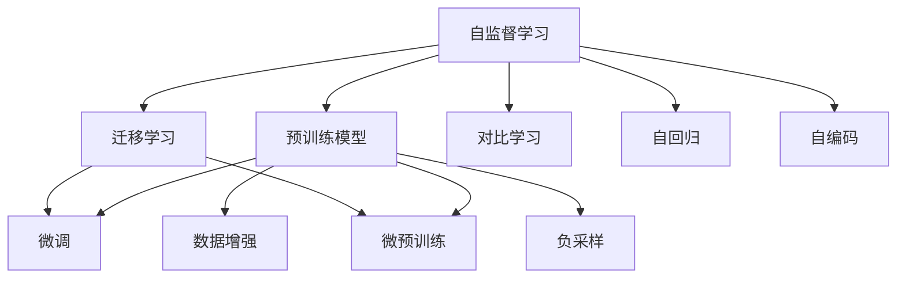

                 

# 自监督学习的应用场景:计算机视觉、自然语言处理等

> 关键词：自监督学习,计算机视觉,自然语言处理,预训练模型,迁移学习

## 1. 背景介绍

### 1.1 问题由来
自监督学习（Self-supervised Learning）是深度学习领域的一个重要分支，通过无需标注的数据进行模型训练，避免了大量有标签数据的需求，从而有效缓解了标注成本高、数据稀缺等问题。在图像、文本等数据的广泛应用中，自监督学习已成为推动深度学习模型性能提升的关键技术。

近年来，自监督学习在计算机视觉和自然语言处理等领域取得了显著进展，尤其是预训练模型的广泛应用，为大规模无标签数据提供了新的可能。这些预训练模型，如ImageNet预训练的ResNet、BERT预训练的Transformer等，通过在大规模无标签数据上进行自监督学习，学到了丰富的领域知识，能够显著提升下游任务的性能。

### 1.2 问题核心关键点
自监督学习的应用场景主要涉及以下几个关键点：

- 大数据时代背景：随着数据采集成本的降低和数据量的急剧增长，无需标注的“大数据”变得愈发普遍。
- 标注成本高昂：获取高质量的有标签数据成本高昂，难以覆盖到更多领域和任务。
- 数据稀缺问题：对于一些新兴领域和长尾任务，标注数据难以获得，传统监督学习无法发挥作用。
- 预训练模型兴起：通过自监督学习在大规模无标签数据上预训练的模型，如ResNet、BERT等，成为迁移学习的重要工具。
- 迁移学习范式：自监督学习学到的知识可以迁移到下游任务上，以实现高性能和低成本的模型训练。

### 1.3 问题研究意义
自监督学习的应用在深度学习中具有重大意义：

1. 降低成本：避免昂贵的标注成本，利用数据资源提升模型性能。
2. 扩充数据集：通过自监督学习，利用数据资源扩充数据集，提升数据多样性和泛化能力。
3. 提高泛化能力：自监督学习训练的模型具有更强的泛化能力，能够更好地应对未知数据。
4. 加速模型开发：预训练模型可以作为模型初始化参数，加快下游任务模型的训练速度和收敛速度。
5. 推动深度学习应用：为计算机视觉、自然语言处理等领域的广泛应用提供技术支持。

## 2. 核心概念与联系

### 2.1 核心概念概述

为更好地理解自监督学习在计算机视觉和自然语言处理中的应用，本节将介绍几个密切相关的核心概念：

- 自监督学习（Self-supervised Learning）：通过设计无标签数据的预训练任务，学习模型的领域知识，无需手动标注。
- 预训练模型（Pre-trained Model）：在大规模无标签数据上通过自监督学习进行训练的模型，如ResNet、BERT、GPT等。
- 迁移学习（Transfer Learning）：将预训练模型中的知识迁移到下游任务上，通过微调或微预训练进行优化，提升下游任务性能。
- 自回归（Autoregressive）：指模型在预测下一个样本时，依赖于之前样本的信息。
- 自编码（Autoencoder）：将输入数据压缩成低维表示再解码回原数据，学习数据的结构化表示。
- 对比学习（Contrastive Learning）：通过最大化同一样本的不同表示之间的相似度，学习样本的表示。
- 数据增强（Data Augmentation）：通过对训练数据进行一系列变换，扩充数据集的多样性，提升模型的泛化能力。
- 负采样（Negative Sampling）：在训练过程中，随机采样大量负样本，降低正样本的影响，提高模型学习能力。

这些核心概念之间的逻辑关系可以通过以下Mermaid流程图来展示：



这个流程图展示的自监督学习、预训练模型和迁移学习之间的逻辑关系：

1. 自监督学习利用无标签数据进行模型训练。
2. 预训练模型通过自监督学习获得通用领域知识。
3. 迁移学习将预训练知识迁移到下游任务上，通过微调或微预训练进行优化。
4. 数据增强和负采样提升模型泛化能力。
5. 对比学习、自回归、自编码等技术拓展自监督学习的训练方法。

## 3. 核心算法原理 & 具体操作步骤

### 3.1 算法原理概述

自监督学习的核心思想是利用无标签数据进行模型训练，通过设计预训练任务，学习模型的领域知识。这些预训练任务通常无需人工标注，而是从数据本身中挖掘出有意义的信号。常见的自监督学习任务包括：

- 自回归模型：利用序列数据中的前后文信息进行预测。
- 自编码器：将输入数据压缩成低维表示再解码回原数据，学习数据的结构化表示。
- 对比学习：通过最大化同一样本的不同表示之间的相似度，学习样本的表示。
- 旋转预测：将输入数据进行旋转变换，利用旋转前后的预测一致性学习数据的表示。
- 视图预测：利用不同视角下的一致性进行模型训练。

这些预训练任务均无需人工标注，而是通过设计预训练任务的损失函数，自动从数据中挖掘有意义的信号。通过在大规模无标签数据上预训练模型，可以学习到领域的通用知识，从而提升下游任务性能。

### 3.2 算法步骤详解

自监督学习的训练流程主要包括以下几个步骤：

**Step 1: 数据准备**

- 收集大规模无标签数据集，如ImageNet、Wikipedia等。
- 将数据集划分为训练集、验证集和测试集。

**Step 2: 模型初始化**

- 选择适合的模型架构，如ResNet、BERT、GPT等。
- 初始化模型参数，通常在所有参数上使用随机初始化。

**Step 3: 设计预训练任务**

- 选择或设计自监督学习的预训练任务。
- 定义预训练任务的损失函数，通常包括预测损失、重构损失、对比损失等。

**Step 4: 训练模型**

- 使用训练集数据进行预训练，迭代更新模型参数。
- 在验证集上评估模型性能，调整超参数。

**Step 5: 迁移学习**

- 将预训练模型应用于下游任务，通过微调或微预训练进行优化。
- 选择或设计适当的任务适配层，如线性分类器、回归器等。
- 定义下游任务的损失函数，进行微调训练。

**Step 6: 评估和部署**

- 在测试集上评估微调后的模型性能，对比微调前后的性能变化。
- 使用微调后的模型进行实际应用，如推理、预测等。

### 3.3 算法优缺点

自监督学习的优点包括：

- 无需标注数据：自监督学习可以利用大规模无标签数据进行预训练，避免昂贵的标注成本。
- 泛化能力强：自监督学习通过预训练学习通用领域知识，能够提升模型泛化能力。
- 数据利用率高：自监督学习可以充分利用数据资源，提升模型性能。
- 可扩展性好：自监督学习可以应用于多种领域和任务，具有广泛的应用前景。

自监督学习的缺点包括：

- 数据质量要求高：自监督学习依赖于数据本身的结构和信号，对数据质量要求较高。
- 训练时间长：自监督学习需要在大规模数据上训练，计算资源消耗大，训练时间长。
- 可解释性差：自监督学习模型难以解释模型内部机制，缺乏可解释性。
- 模型过拟合风险：自监督学习模型容易出现过拟合问题，需要设计有效的正则化方法。

尽管存在这些局限性，但自监督学习仍然是大规模数据利用、无标签数据训练的重要方法，具有广泛的应用前景。未来相关研究将更多关注如何设计更有效的预训练任务、如何避免模型过拟合、如何提升模型的可解释性等，以进一步提升自监督学习的性能和应用范围。

### 3.4 算法应用领域

自监督学习在计算机视觉和自然语言处理等领域得到了广泛应用，以下是一些典型场景：

- 计算机视觉：利用大规模无标签图像数据，如ImageNet，进行预训练。常见的预训练模型包括ResNet、VGG等。
- 自然语言处理：利用大规模无标签文本数据，如Wikipedia，进行预训练。常见的预训练模型包括BERT、GPT等。
- 语音识别：利用无标签音频数据进行预训练，提升模型的泛化能力。
- 图像生成：利用无标签图像数据进行预训练，提升生成图像的质量。
- 视频分析：利用无标签视频数据进行预训练，提升视频分类、目标检测等任务的性能。
- 时间序列分析：利用无标签时间序列数据进行预训练，提升时间序列预测等任务的性能。
- 自动驾驶：利用无标签传感器数据进行预训练，提升自动驾驶中的图像识别和行为预测能力。
- 推荐系统：利用无标签用户行为数据进行预训练，提升推荐系统的精准度和个性化水平。

## 4. 数学模型和公式 & 详细讲解 & 举例说明

### 4.1 数学模型构建

本节将使用数学语言对自监督学习的训练过程进行更加严格的刻画。

记自监督学习的模型为 $M_{\theta}$，其中 $\theta$ 为模型参数。假设数据集为 $D=\{(x_i, y_i)\}_{i=1}^N, x_i \in \mathcal{X}, y_i \in \mathcal{Y}$，其中 $x_i$ 为输入数据，$y_i$ 为自监督学习任务的目标。常见的自监督学习任务包括自回归、自编码等。

定义自监督学习任务的目标函数为 $L(D, \theta)$，在训练集 $D$ 上通过最小化目标函数，更新模型参数 $\theta$，即：

$$
\theta^* = \mathop{\arg\min}_{\theta} L(D, \theta)
$$

在实际应用中，我们通常使用基于梯度的优化算法（如Adam、SGD等）来近似求解上述最优化问题。设 $\eta$ 为学习率，则参数的更新公式为：

$$
\theta \leftarrow \theta - \eta \nabla_{\theta}L(D, \theta)
$$

其中 $\nabla_{\theta}L(D, \theta)$ 为损失函数对参数 $\theta$ 的梯度，可通过反向传播算法高效计算。

### 4.2 公式推导过程

以下以自编码器为例，推导其训练过程的数学公式。

自编码器的训练目标是最大化输入数据与重构数据的相似度，即最小化重构误差。假设输入数据为 $x$，重构数据为 $\hat{x}$，则重构误差 $L_{rec}(x, \hat{x})$ 定义为：

$$
L_{rec}(x, \hat{x}) = \|x - \hat{x}\|
$$

将重构误差引入自监督学习的损失函数中，得：

$$
L(D, \theta) = -\frac{1}{N}\sum_{i=1}^N L_{rec}(x_i, \hat{x_i})
$$

其中 $L_{rec}(x_i, \hat{x_i})$ 为第 $i$ 个样本的重建误差，$N$ 为样本总数。

在得到损失函数后，我们通过反向传播算法计算梯度，并更新模型参数。令 $\hat{x} = M_{\theta}(x)$，则重构误差可以表示为：

$$
L_{rec}(x_i, \hat{x_i}) = \|x_i - M_{\theta}(x_i)\|
$$

重构误差对模型参数 $\theta$ 的梯度为：

$$
\nabla_{\theta}L_{rec}(x_i, \hat{x_i}) = -(x_i - \hat{x_i})\nabla_{\theta}M_{\theta}(x_i)
$$

因此，自监督学习模型的损失函数对参数 $\theta$ 的梯度为：

$$
\nabla_{\theta}L(D, \theta) = -\frac{1}{N}\sum_{i=1}^N (x_i - M_{\theta}(x_i))\nabla_{\theta}M_{\theta}(x_i)
$$

在得到梯度后，我们可以通过基于梯度的优化算法（如Adam、SGD等）进行参数更新。

### 4.3 案例分析与讲解

以下以ImageNet预训练的ResNet为例，介绍自监督学习在计算机视觉中的应用。

ResNet是一个经典的卷积神经网络架构，通过残差连接（Residual Connection）解决了深度网络训练的梯度消失问题。在ImageNet数据集上进行预训练时，可以采用自回归任务的预训练方法，即利用图像中的前后文信息进行预测。

具体而言，可以设计一个自回归任务，利用像素之间的相关性进行预测。例如，对于一张 $224 \times 224$ 的彩色图像，将其展开为一个 $224 \times 224 \times 3$ 的向量 $x$。定义自回归任务的目标为预测图像中每个像素的RGB值，即 $\hat{x} = M_{\theta}(x)$。则重构误差为：

$$
L_{rec}(x, \hat{x}) = \|x - \hat{x}\|
$$

将重构误差引入自监督学习的损失函数中，得：

$$
L(D, \theta) = -\frac{1}{N}\sum_{i=1}^N L_{rec}(x_i, \hat{x_i})
$$

其中 $x_i$ 为第 $i$ 个样本的像素向量，$N$ 为样本总数。

在得到损失函数后，我们可以通过反向传播算法计算梯度，并更新模型参数。令 $\hat{x} = M_{\theta}(x)$，则重构误差可以表示为：

$$
L_{rec}(x_i, \hat{x_i}) = \|x_i - M_{\theta}(x_i)\|
$$

重构误差对模型参数 $\theta$ 的梯度为：

$$
\nabla_{\theta}L_{rec}(x_i, \hat{x_i}) = -(x_i - \hat{x_i})\nabla_{\theta}M_{\theta}(x_i)
$$

因此，ResNet在ImageNet数据集上进行预训练的目标函数为：

$$
L(D, \theta) = -\frac{1}{N}\sum_{i=1}^N (x_i - M_{\theta}(x_i))\nabla_{\theta}M_{\theta}(x_i)
$$

在得到梯度后，我们可以通过基于梯度的优化算法（如Adam、SGD等）进行参数更新，训练ResNet在ImageNet数据集上的自监督预训练模型。预训练后的模型可以用于下游的图像分类、目标检测等任务，通过微调或微预训练进行优化，提升模型的性能。

## 5. 项目实践：代码实例和详细解释说明

### 5.1 开发环境搭建

在进行自监督学习实践前，我们需要准备好开发环境。以下是使用Python进行PyTorch开发的环境配置流程：

1. 安装Anaconda：从官网下载并安装Anaconda，用于创建独立的Python环境。

2. 创建并激活虚拟环境：
```bash
conda create -n pytorch-env python=3.8 
conda activate pytorch-env
```

3. 安装PyTorch：根据CUDA版本，从官网获取对应的安装命令。例如：
```bash
conda install pytorch torchvision torchaudio cudatoolkit=11.1 -c pytorch -c conda-forge
```

4. 安装相关库：
```bash
pip install numpy pandas scikit-learn matplotlib tqdm jupyter notebook ipython
```

完成上述步骤后，即可在`pytorch-env`环境中开始自监督学习实践。

### 5.2 源代码详细实现

下面我们以自回归预训练的ResNet为例，给出使用PyTorch进行自监督学习的PyTorch代码实现。

首先，定义自回归预训练函数：

```python
from torchvision import models
from torch.utils.data import DataLoader
from torch import nn
import torch

def train_epoch(model, dataloader, optimizer, device):
    model.train()
    epoch_loss = 0
    for data, target in dataloader:
        data, target = data.to(device), target.to(device)
        optimizer.zero_grad()
        output = model(data)
        loss = nn.functional.mse_loss(output, target)
        epoch_loss += loss.item()
        loss.backward()
        optimizer.step()
    return epoch_loss / len(dataloader)

def evaluate(model, dataloader, device):
    model.eval()
    with torch.no_grad():
        epoch_loss = 0
        epoch_correct = 0
        for data, target in dataloader:
            data, target = data.to(device), target.to(device)
            output = model(data)
            epoch_loss += nn.functional.mse_loss(output, target).item()
            epoch_correct += (output.argmax(dim=1) == target).sum().item()
    return epoch_loss / len(dataloader), epoch_correct / len(dataloader)

def main():
    device = torch.device('cuda') if torch.cuda.is_available() else torch.device('cpu')

    # 加载ResNet模型
    model = models.resnet50(pretrained=True)
    model.fc = nn.Linear(2048, 1000)
    model.to(device)

    # 定义优化器
    optimizer = torch.optim.Adam(model.parameters(), lr=0.001)

    # 加载数据集
    train_dataset = torchvision.datasets.ImageNet(train=True, download=True, transform=transforms.ToTensor(), target_transform=transforms.ToTensor())
    test_dataset = torchvision.datasets.ImageNet(train=False, download=True, transform=transforms.ToTensor(), target_transform=transforms.ToTensor())
    train_loader = DataLoader(train_dataset, batch_size=256, shuffle=True, num_workers=4)
    test_loader = DataLoader(test_dataset, batch_size=256, shuffle=False, num_workers=4)

    # 训练模型
    for epoch in range(10):
        train_loss = train_epoch(model, train_loader, optimizer, device)
        val_loss, val_acc = evaluate(model, test_loader, device)
        print(f"Epoch {epoch+1}, train loss: {train_loss:.4f}, val loss: {val_loss:.4f}, val acc: {val_acc:.4f}")
```

在上述代码中，我们使用了PyTorch中的ResNet模型进行自监督学习的预训练。具体步骤如下：

1. 加载ResNet模型，并将其全连接层替换为线性分类器。
2. 定义Adam优化器，设置学习率为0.001。
3. 加载ImageNet数据集，并进行标准化处理。
4. 定义训练和评估函数，计算训练集损失和测试集损失、准确率。
5. 训练模型10个epoch，并在测试集上评估模型性能。

### 5.3 代码解读与分析

让我们再详细解读一下关键代码的实现细节：

**train_epoch函数**：
- 定义训练函数，设置模型为训练模式。
- 在每个批次上进行前向传播和反向传播，计算损失并更新模型参数。
- 返回该epoch的平均损失。

**evaluate函数**：
- 定义评估函数，设置模型为评估模式。
- 在测试集上计算模型损失和准确率。
- 返回平均损失和准确率。

**main函数**：
- 定义主函数，设置训练轮数为10。
- 使用GPU加速计算，加载预训练ResNet模型。
- 定义优化器，设置学习率为0.001。
- 加载ImageNet数据集，并进行标准化处理。
- 定义训练和评估函数，计算训练集损失和测试集损失、准确率。
- 训练模型10个epoch，并在测试集上评估模型性能。

可以看到，PyTorch提供了丰富的工具和库，使得自监督学习的实践变得简洁高效。开发者可以将更多精力放在数据处理、模型改进等高层逻辑上，而不必过多关注底层的实现细节。

当然，工业级的系统实现还需考虑更多因素，如模型的保存和部署、超参数的自动搜索、更灵活的任务适配层等。但核心的自监督学习流程基本与此类似。

## 6. 实际应用场景

### 6.1 图像分类

自监督学习在图像分类任务中有着广泛的应用。传统的监督学习需要大量的有标签数据，而自监督学习可以通过预训练模型在大规模无标签图像数据上进行自回归、自编码等任务，学习到图像的语义信息，提升分类性能。

在实践中，可以利用无标签图像数据集，如ImageNet，进行预训练。预训练后的模型可以作为初始化参数，用于下游的图像分类任务，通过微调或微预训练进行优化。常用的预训练方法包括自回归任务、自编码任务等。

例如，可以使用自回归任务进行预训练，即利用图像中的前后文信息进行预测。具体而言，可以设计一个自回归任务，利用像素之间的相关性进行预测。假设输入数据为 $x$，重构数据为 $\hat{x}$，则重构误差为：

$$
L_{rec}(x, \hat{x}) = \|x - \hat{x}\|
$$

将重构误差引入自监督学习的损失函数中，得：

$$
L(D, \theta) = -\frac{1}{N}\sum_{i=1}^N L_{rec}(x_i, \hat{x_i})
$$

其中 $x_i$ 为第 $i$ 个样本的像素向量，$N$ 为样本总数。

在得到损失函数后，我们可以通过反向传播算法计算梯度，并更新模型参数。令 $\hat{x} = M_{\theta}(x)$，则重构误差可以表示为：

$$
L_{rec}(x_i, \hat{x_i}) = \|x_i - M_{\theta}(x_i)\|
$$

重构误差对模型参数 $\theta$ 的梯度为：

$$
\nabla_{\theta}L_{rec}(x_i, \hat{x_i}) = -(x_i - \hat{x_i})\nabla_{\theta}M_{\theta}(x_i)
$$

因此，自监督学习模型的损失函数对参数 $\theta$ 的梯度为：

$$
\nabla_{\theta}L(D, \theta) = -\frac{1}{N}\sum_{i=1}^N (x_i - M_{\theta}(x_i))\nabla_{\theta}M_{\theta}(x_i)
$$

在得到梯度后，我们可以通过基于梯度的优化算法（如Adam、SGD等）进行参数更新。预训练后的模型可以用于下游的图像分类任务，通过微调或微预训练进行优化，提升模型的性能。

### 6.2 图像生成

自监督学习还可以用于图像生成任务。通过利用无标签图像数据进行自回归、自编码等预训练，学习图像的结构化表示，然后通过生成模型生成新的图像。

在实践中，可以利用无标签图像数据集，如CIFAR-10、MNIST等，进行预训练。预训练后的模型可以作为初始化参数，用于生成新的图像。常用的预训练方法包括自回归任务、自编码任务等。

例如，可以使用自回归任务进行预训练，即利用图像中的前后文信息进行预测。假设输入数据为 $x$，重构数据为 $\hat{x}$，则重构误差为：

$$
L_{rec}(x, \hat{x}) = \|x - \hat{x}\|
$$

将重构误差引入自监督学习的损失函数中，得：

$$
L(D, \theta) = -\frac{1}{N}\sum_{i=1}^N L_{rec}(x_i, \hat{x_i})
$$

其中 $x_i$ 为第 $i$ 个样本的像素向量，$N$ 为样本总数。

在得到损失函数后，我们可以通过反向传播算法计算梯度，并更新模型参数。令 $\hat{x} = M_{\theta}(x)$，则重构误差可以表示为：

$$
L_{rec}(x_i, \hat{x_i}) = \|x_i - M_{\theta}(x_i)\|
$$

重构误差对模型参数 $\theta$ 的梯度为：

$$
\nabla_{\theta}L_{rec}(x_i, \hat{x_i}) = -(x_i - \hat{x_i})\nabla_{\theta}M_{\theta}(x_i)
$$

因此，自监督学习模型的损失函数对参数 $\theta$ 的梯度为：

$$
\nabla_{\theta}L(D, \theta) = -\frac{1}{N}\sum_{i=1}^N (x_i - M_{\theta}(x_i))\nabla_{\theta}M_{\theta}(x_i)
$$

在得到梯度后，我们可以通过基于梯度的优化算法（如Adam、SGD等）进行参数更新。预训练后的模型可以用于图像生成任务，通过生成模型生成新的图像。

### 6.3 目标检测

自监督学习还可以用于目标检测任务。通过利用无标签图像数据进行自回归、自编码等预训练，学习图像的语义信息，然后通过检测模型检测图像中的目标对象。

在实践中，可以利用无标签图像数据集，如COCO、PASCAL VOC等，进行预训练。预训练后的模型可以作为初始化参数，用于目标检测任务，通过微调或微预训练进行优化。常用的预训练方法包括自回归任务、自编码任务等。

例如，可以使用自回归任务进行预训练，即利用图像中的前后文信息进行预测。假设输入数据为 $x$，重构数据为 $\hat{x}$，则重构误差为：

$$
L_{rec}(x, \hat{x}) = \|x - \hat{x}\|
$$

将重构误差引入自监督学习的损失函数中，得：

$$
L(D, \theta) = -\frac{1}{N}\sum_{i=1}^N L_{rec}(x_i, \hat{x_i})
$$

其中 $x_i$ 为第 $i$ 个样本的像素向量，$N$ 为样本总数。

在得到损失函数后，我们可以通过反向传播算法计算梯度，并更新模型参数。令 $\hat{x} = M_{\theta}(x)$，则重构误差可以表示为：

$$
L_{rec}(x_i, \hat{x_i}) = \|x_i - M_{\theta}(x_i)\|
$$

重构误差对模型参数 $\theta$ 的梯度为：

$$
\nabla_{\theta}L_{rec}(x_i, \hat{x_i}) = -(x_i - \hat{x_i})\nabla_{\theta}M_{\theta}(x_i)
$$

因此，自监督学习模型的损失函数对参数 $\theta$ 的梯度为：

$$
\nabla_{\theta}L(D, \theta) = -\frac{1}{N}\sum_{i=1}^N (x_i - M_{\theta}(x_i))\nabla_{\theta}M_{\theta}(x_i)
$$

在得到梯度后，我们可以通过基于梯度的优化算法（如Adam、SGD等）进行参数更新。预训练后的模型可以用于目标检测任务，通过微调或微预训练进行优化，提升模型的性能。

## 7. 工具和资源推荐

### 7.1 学习资源推荐

为了帮助开发者系统掌握自监督学习的基本概念和实践技巧，这里推荐一些优质的学习资源：

1. 《Deep Learning》书籍：由Ian Goodfellow、Yoshua Bengio、Aaron Courville合著，是深度学习领域的经典之作，详细介绍了自监督学习的理论基础和实际应用。

2. 《Self-supervised Learning with Unlabeled Data》论文：由Google Brain团队发布，详细介绍了利用无标签数据进行自监督学习的最佳实践，包括自回归、自编码等方法。

3. CS231n《深度学习在计算机视觉中的应用》课程：斯坦福大学开设的计算机视觉领域明星课程，涵盖自监督学习在计算机视觉中的应用，包括预训练模型的实践。

4. Coursera《自监督学习》课程：由IBM和Oxford大学合办，介绍了自监督学习的理论基础和实际应用，适合初学者入门。

5. Kaggle自监督学习竞赛：Kaggle平台上有多场自监督学习竞赛，提供了丰富的数据集和模型，适合实践锻炼。

通过对这些资源的学习实践，相信你一定能够快速掌握自监督学习的基本概念和实践技巧，并用于解决实际的计算机视觉和自然语言处理问题。

### 7.2 开发工具推荐

高效的开发离不开优秀的工具支持。以下是几款用于自监督学习开发的常用工具：

1. PyTorch：基于Python的开源深度学习框架，灵活动态的计算图，适合快速迭代研究。

2. TensorFlow：由Google主导开发的开源深度学习框架，生产部署方便，适合大规模工程应用。

3. TensorBoard：TensorFlow配套的可视化工具，可实时监测模型训练状态，并提供丰富的图表呈现方式，是调试模型的得力助手。

4. HuggingFace Transformers库：HuggingFace开发的NLP工具库，集成了众多SOTA语言模型，支持PyTorch和TensorFlow，是进行自监督学习开发的利器。

5. Weights & Biases：模型训练的实验跟踪工具，可以记录和可视化模型训练过程中的各项指标，方便对比和调优。

6. DataAugment：Python库，提供了丰富的数据增强方法，可以用于扩充训练集的多样性，提升模型的泛化能力。

合理利用这些工具，可以显著提升自监督学习的开发效率，加快创新迭代的步伐。

### 7.3 相关论文推荐

自监督学习的研究始于学界的持续研究。以下是几篇奠基性的相关论文，推荐阅读：

1. Autoencoder Networks: Learning a Representation for Data Compression paper：由Bengio等提出的自编码器模型，提出了利用无标签数据进行自监督学习的方法。

2. Self-supervised Learning with Unlabeled Data paper：由Google Brain团队发布的自监督学习综述，介绍了多种自监督学习方法，如自回归、自编码等。

3. VQ-VAE: Vector Quantized Variational Autoencoders paper：由Oord等提出的自回归变分自编码器模型，用于生成高质量的图像和音频。

4. SimCLR: A Simple Framework for Unsupervised Learning of Deep Feature Representations paper：由Chen等提出的简单自监督学习方法，用于大规模无标签数据上的自监督学习。

5. Self-supervised Feature Learning with Noise Contrastive Estimation paper：由Wu等提出的噪声对比估计方法，用于自监督学习中的对比学习任务。

这些论文代表了大规模无标签数据利用的自监督学习的演进，为自监督学习的研究提供了方向。通过学习这些前沿成果，可以帮助研究者把握学科前进方向，激发更多的创新灵感。

## 8. 总结：未来发展趋势与挑战

### 8.1 研究成果总结

自监督学习在深度学习中取得了显著进展，尤其是在计算机视觉和自然语言处理等领域，通过预训练模型的大规模无标签数据训练，提升了模型的泛化能力和性能。

### 8.2 未来发展趋势

自监督学习的应用前景广阔，未来将呈现以下几个发展趋势：

1. 数据质量和多样性：随着数据采集设备的普及和数据量的增长，自监督学习将更多利用多样性和高质量的无标签数据进行训练。

2. 自监督学习与迁移学习结合：自监督学习学到的知识可以迁移到下游任务上，通过微调或微预训练进行优化，提升模型的性能。

3. 自监督学习与强化学习结合：自监督学习可以提供丰富的环境信息，与强化学习结合，提升智能体的学习效率和性能。

4. 自监督学习在多模态任务中的应用：自监督学习可以拓展到多模态数据上，学习跨模态的表示，提升模型在不同数据模态上的性能。

5. 自监督学习在实时学习中的应用：自监督学习可以在线学习，持续从新数据中学习，保持模型的时效性和适应性。

### 8.3 面临的挑战

尽管自监督学习取得了显著进展，但在实现广泛应用的过程中，仍面临以下挑战：

1. 数据质量要求高：自监督学习依赖于数据本身的结构和信号，对数据质量要求较高。

2. 计算资源消耗大：自监督学习需要在大规模数据上训练，计算资源消耗大，训练时间长。

3. 模型可解释性差：自监督学习模型难以解释模型内部机制，缺乏可解释性。

4. 模型过拟合风险：自监督学习模型容易出现过拟合问题，需要设计有效的正则化方法。

5. 迁移能力有限：当目标任务与自监督学习任务的分布差异较大时，迁移能力有限。

6. 伦理和安全问题：自监督学习模型可能学习到有偏见、有害的信息，存在伦理和安全问题。

### 8.4 研究展望

面对自监督学习面临的挑战，未来的研究需要在以下几个方面寻求新的突破：

1. 设计更有效的自监督学习方法：探索新的自监督学习任务和方法，提升模型的泛化能力和性能。

2. 提升模型的可解释性：引入符号化的先验知识，如知识图谱、逻辑规则等，与神经网络模型进行融合，提升模型的可解释性。

3. 优化计算资源利用：探索新的计算资源利用方法，如分布式训练、模型压缩等，提高自监督学习的效率和可扩展性。

4. 提升迁移学习能力：研究模型迁移学习的有效方法，提升模型在不同领域和任务上的迁移能力。

5. 提升伦理和安全性：引入伦理和安全约束，避免模型学习到有害信息，确保模型的可靠性和安全性。

6. 拓展多模态学习：研究多模态数据自监督学习方法，提升模型在不同数据模态上的性能。

这些研究方向的探索，必将引领自监督学习技术迈向更高的台阶，为深度学习模型带来新的突破。面向未来，自监督学习将继续引领深度学习的发展，为计算机视觉、自然语言处理等领域的广泛应用提供技术支持。

## 9. 附录：常见问题与解答

**Q1：自监督学习和监督学习的区别是什么？**

A: 自监督学习和监督学习的区别主要在于数据标注方式的不同。自监督学习利用无标签数据进行模型训练，通过设计预训练任务，学习模型的领域知识。而监督学习则依赖于大量有标签的数据进行模型训练，学习模型对输入和输出之间的映射关系。

**Q2：自监督学习能否替代监督学习？**

A: 自监督学习在数据标注成本高、数据稀缺的情况下表现优异，能够充分利用大规模无标签数据进行模型训练。但在某些需要精确预测和大量标注数据的任务中，自监督学习可能难以达到监督学习的性能。因此，自监督学习和监督学习可以互补使用，发挥各自优势。

**Q3：自监督学习如何避免过拟合？**

A: 自监督学习容易出现过拟合问题，需要设计有效的正则化方法，如L2正则、Dropout、Early Stopping等。此外，可以通过数据增强、负采样等方法扩充训练集的多样性，提升模型的泛化能力。

**Q4：自监督学习在实际应用中需要注意哪些问题？**

A: 在实际应用中，自监督学习需要注意以下问题：

1. 数据质量要求高：自监督学习依赖于数据本身的结构和信号，对数据质量要求较高。

2. 计算资源消耗大：自监督学习需要在大规模数据上训练，计算资源消耗大，训练时间长。

3. 模型可解释性差：自监督学习模型难以解释模型内部机制，缺乏可解释性。

4. 迁移能力有限：当目标任务与自监督学习任务的分布差异较大时，迁移能力有限。

5. 伦理和安全问题：自监督学习模型可能学习到有害信息，存在伦理和安全问题。

通过合理解决这些问题，可以最大限度地发挥自监督学习的优势，提升深度学习模型的性能和应用范围。

**Q5：自监督学习的应用场景有哪些？**

A: 自监督学习在计算机视觉和自然语言处理等领域有着广泛的应用场景，具体包括：

1. 图像分类：利用大规模无标签图像数据进行预训练，提升分类性能。

2. 图像生成：利用无标签图像数据进行预训练，生成高质量的图像。

3. 目标检测：利用无标签图像数据进行预训练，提升检测性能。

4. 自然语言处理：利用大规模无标签文本数据进行预训练，提升语言模型的泛化能力和性能。

5. 语音识别：利用无标签音频数据进行预训练，提升语音识别的准确率和鲁棒性。

6. 视频分析：利用无标签视频数据进行预训练，提升视频分类、目标检测等任务的性能。

7. 时间序列分析：利用无标签时间序列数据进行预训练，提升时间序列预测等任务的性能。

8. 推荐系统：利用无标签用户行为数据进行预训练，提升推荐系统的精准度和个性化水平。

通过自监督学习的实践，可以充分利用大规模无标签数据，提升深度学习模型的性能和应用范围。

---

作者：禅与计算机程序设计艺术 / Zen and the Art of Computer Programming

