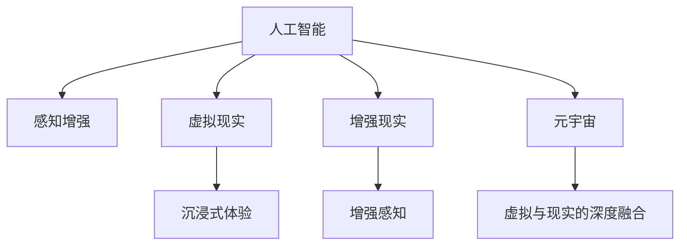

                 

# 虚拟与现实的边界：AI如何重塑我们的感知

> 关键词：人工智能(AI), 感知重塑, 虚拟现实(VR), 增强现实(AR), 元宇宙(Metaverse), 感知交互, 认知模型, 深度学习, 感知增强, 人机交互

## 1. 背景介绍

### 1.1 问题由来
随着人工智能技术的飞速发展，AI正逐渐从辅助人类工作的工具，转变为可以感知、理解和模拟人类感知的新型智能系统。AI的感知能力在自然语言处理、计算机视觉、语音识别等方向取得了显著进展，不仅提升了自动化系统的智能化水平，也拓展了人类感知系统的边界。

然而，这些技术仍然局限在二维的电子屏幕上，缺乏对现实世界的直观感知。如何通过AI技术，重塑人类的感知系统，使其更加全面、准确地理解和交互现实世界，成为当前技术界的一大挑战。虚拟现实(VR)、增强现实(AR)以及元宇宙(Metaverse)等新兴技术，为这一目标提供了新的可能。AI与这些新兴技术的结合，有望带来全新的感知交互体验，重塑我们的感知边界。

### 1.2 问题核心关键点
本文聚焦于AI如何通过感知增强技术，与VR、AR、Metaverse等新兴技术结合，构建新的感知交互系统。通过分析这些技术的核心概念和原理，探讨了AI在虚拟与现实边界处重塑人类感知的可能性，并展望了未来的应用前景。

## 2. 核心概念与联系

### 2.1 核心概念概述

为更好地理解AI在虚拟与现实边界处的感知重塑，本节将介绍几个密切相关的核心概念：

- 人工智能(AI)：指能够模拟人类智能行为的机器系统，通过深度学习、强化学习等技术，实现自我感知、决策、学习等功能。
- 虚拟现实(VR)：通过计算机生成的虚拟环境，结合头戴显示设备和运动控制器，使用户能够沉浸式体验虚拟世界。
- 增强现实(AR)：在用户看到的真实环境中，叠加虚拟信息，增强对现实世界的感知和交互。
- 元宇宙(Metaverse)：虚拟空间和现实世界的深度融合，通过区块链、虚拟经济等技术，构建一个持续在线的虚拟社会。
- 感知增强：通过AI技术提升人类的视觉、听觉、触觉等感知能力，使其更加全面、准确地感知和交互现实世界。
- 深度学习：一种模拟人类大脑神经网络的学习方法，通过多层神经网络，学习数据中的复杂特征，实现高效的感知和决策。
- 人机交互(HCI)：人与计算机系统之间的互动方式，通过界面、语音、手势等多种方式，提升系统的操作性和用户体验。

这些核心概念之间的逻辑关系可以通过以下Mermaid流程图来展示：



这个流程图展示了人工智能、虚拟现实、增强现实、元宇宙与感知增强之间的联系。

## 3. 核心算法原理 & 具体操作步骤
### 3.1 算法原理概述

AI在虚拟与现实边界处的感知重塑，本质上是通过感知增强技术，结合VR、AR、Metaverse等新兴技术，构建新的感知交互系统。其核心思想是：

1. **感知增强**：通过AI技术提升人类的视觉、听觉、触觉等感知能力，使其更加全面、准确地感知和交互现实世界。
2. **虚拟现实(VR)**：通过计算机生成的虚拟环境，使用户能够沉浸式体验虚拟世界。
3. **增强现实(AR)**：在用户看到的真实环境中，叠加虚拟信息，增强对现实世界的感知和交互。
4. **元宇宙(Metaverse)**：通过区块链、虚拟经济等技术，构建一个持续在线的虚拟社会，实现虚拟与现实的深度融合。

通过这些技术的结合，AI可以在虚拟与现实边界处，重塑人类的感知系统，使其能够更加全面、准确地理解和交互现实世界。

### 3.2 算法步骤详解

基于AI的虚拟与现实感知重塑，一般包括以下几个关键步骤：

**Step 1: 设计感知增强算法**

选择合适的感知增强算法，提升人类的视觉、听觉、触觉等感知能力。例如，利用深度学习中的卷积神经网络(CNN)提升图像识别能力，使用生成对抗网络(GAN)生成逼真图像等。

**Step 2: 融合虚拟现实(VR)**

将感知增强技术融入VR系统，通过计算机生成的虚拟环境，让用户沉浸式体验虚拟世界。例如，使用虚拟现实头戴设备，结合深度学习算法，实现基于视觉、听觉的虚拟环境感知。

**Step 3: 增强现实(AR)的融合**

在增强现实(AR)系统中融合感知增强技术，将虚拟信息叠加到真实环境中，增强对现实世界的感知和交互。例如，利用深度学习算法，识别现实环境中的物体，并在其上叠加虚拟信息，增强对现实世界的理解和交互。

**Step 4: 构建元宇宙(Metaverse)**

通过区块链、虚拟经济等技术，构建一个持续在线的虚拟社会，实现虚拟与现实的深度融合。例如，利用分布式账本技术，记录和验证虚拟交易，确保虚拟经济的安全和透明。

**Step 5: 用户交互与反馈**

设计用户交互界面，实现对感知增强系统的可视化反馈。例如，通过虚拟现实设备，提供视觉、听觉的沉浸式反馈，让用户直观地感受到感知增强的效果。

### 3.3 算法优缺点

AI在虚拟与现实边界处的感知重塑，具有以下优点：

1. **全面感知**：通过AI技术，提升人类的多维感知能力，使其能够更加全面、准确地感知和交互现实世界。
2. **沉浸体验**：结合VR、AR等新兴技术，提供沉浸式的感知体验，增强对虚拟世界的理解和交互。
3. **深度融合**：通过元宇宙等技术，实现虚拟与现实的深度融合，构建持续在线的虚拟社会。

同时，该方法也存在一定的局限性：

1. **技术复杂**：需要结合多种新兴技术，实现多维感知系统的构建，技术实现复杂。
2. **成本较高**：硬件设备和开发成本较高，普通用户难以负担。
3. **安全风险**：虚拟与现实技术的结合，可能带来数据隐私和网络安全风险。
4. **认知负担**：过度的虚拟感知可能增加用户的认知负担，影响现实世界的感知和决策。

尽管存在这些局限性，但就目前而言，AI在虚拟与现实边界处的感知重塑，仍是大有可为的前沿技术。未来相关研究的重点在于如何进一步降低技术实现成本，提高感知系统的普及性和安全性，同时兼顾感知效果和现实世界的互动性。

### 3.4 算法应用领域

AI在虚拟与现实边界处的感知重塑技术，在多个领域得到了广泛应用，例如：

- 医疗健康：通过AI感知增强技术，结合VR、AR设备，提供沉浸式的医学教育和手术模拟，提高医生的操作技能和诊断准确性。
- 教育培训：利用AI感知增强技术，结合AR设备，提供交互式学习体验，提升学生的学习效果和参与度。
- 娱乐休闲：通过AI感知增强技术，结合VR、AR技术，提供沉浸式的游戏体验和虚拟现实电影，增强娱乐体验。
- 工业制造：利用AI感知增强技术，结合AR设备，提供实时数据可视化，提升工厂的生产效率和质量控制。
- 智能家居：通过AI感知增强技术，结合VR、AR设备，提供智能化的家居控制和虚拟环境体验，提升生活便利性。

除了上述这些经典应用外，AI在虚拟与现实边界处的感知重塑技术，还在智能交通、智慧城市、军事训练等多个领域，展现出广阔的应用前景。

## 4. 数学模型和公式 & 详细讲解 & 举例说明

### 4.1 数学模型构建

本节将使用数学语言对AI在虚拟与现实边界处的感知重塑过程进行更加严格的刻画。

记感知增强算法为 $F(x)$，其中 $x$ 为真实世界的环境数据，$y$ 为增强后的感知数据。通过感知增强算法，增强对环境的感知能力，使其更加全面、准确。例如，在图像识别任务中，感知增强算法可以表示为：

$$ F(x) = \phi(x; \theta) $$

其中 $\phi$ 为感知增强函数，$\theta$ 为模型参数。

假设虚拟现实系统为 $V(\phi)$，增强现实系统为 $AR(\phi)$，元宇宙为 $Met(\phi)$，则感知增强技术在虚拟与现实边界处的重塑过程可以表示为：

$$ Y = V(F(X)) \quad or \quad Y = AR(F(X)) \quad or \quad Y = Met(F(X)) $$

其中 $Y$ 为最终的感知结果，$X$ 为真实世界的环境数据。

### 4.2 公式推导过程

以下我们以图像识别任务为例，推导感知增强算法的数学公式及其应用。

假设输入图像为 $I$，图像识别任务的目标是将其分类到 $N$ 个不同的类别中。原始图像为 $x$，感知增强算法为 $F(x)$，则增强后的图像为 $y$。在图像识别任务中，我们可以使用深度学习中的卷积神经网络(CNN)作为感知增强算法，其基本结构如图：


在CNN中，图像通过卷积层、池化层、全连接层等操作，逐步提取特征，并最终输出分类结果。假设CNN的输出为 $z$，则感知增强过程可以表示为：

$$ z = F(x) = \phi(x; \theta) $$

其中 $\phi$ 为卷积神经网络，$\theta$ 为模型参数。

在图像分类任务中，目标函数可以表示为：

$$ L(z, y) = \frac{1}{N} \sum_{i=1}^N [\log P_i] $$

其中 $P_i$ 为输出层对第 $i$ 个类别的概率，$N$ 为类别数。

通过优化目标函数 $L$，训练感知增强算法 $F(x)$，使得增强后的图像 $y$ 能够更加准确地分类。例如，在医学影像识别任务中，通过感知增强算法，提升CT扫描图像的清晰度，使其能够更准确地检测出肿瘤、病变等异常情况。

### 4.3 案例分析与讲解

考虑一个基于深度学习的医学影像识别系统，使用卷积神经网络对CT扫描图像进行分类。在该系统中，感知增强技术的应用步骤如下：

1. **数据预处理**：将原始CT扫描图像进行预处理，包括去噪、归一化、增强等操作，提高图像质量。
2. **感知增强**：使用卷积神经网络对预处理后的图像进行感知增强，提取图像特征，提升图像清晰度。
3. **模型训练**：使用标注好的医学影像数据，对感知增强后的图像进行训练，学习分类模型。
4. **虚拟现实应用**：在虚拟现实系统中，结合感知增强技术，提供沉浸式的医学教育和手术模拟，提高医生的操作技能和诊断准确性。

通过感知增强技术，结合虚拟现实系统，该系统不仅提升了医学影像的感知能力，还为医生提供了沉浸式的学习和手术模拟体验，显著提高了医生的操作技能和诊断准确性。

## 5. 项目实践：代码实例和详细解释说明

### 5.1 开发环境搭建

在进行感知增强技术的项目实践前，我们需要准备好开发环境。以下是使用Python进行PyTorch开发的环境配置流程：

1. 安装Anaconda：从官网下载并安装Anaconda，用于创建独立的Python环境。

2. 创建并激活虚拟环境：
```bash
conda create -n pytorch-env python=3.8 
conda activate pytorch-env
```

3. 安装PyTorch：根据CUDA版本，从官网获取对应的安装命令。例如：
```bash
conda install pytorch torchvision torchaudio cudatoolkit=11.1 -c pytorch -c conda-forge
```

4. 安装TensorFlow：从官网下载并安装TensorFlow，或使用Anaconda进行安装。

5. 安装深度学习相关的第三方库：
```bash
pip install torchvision matplotlib scikit-image scikit-learn tensorboard
```

完成上述步骤后，即可在`pytorch-env`环境中开始感知增强技术的开发实践。

### 5.2 源代码详细实现

下面我们以医学影像分类任务为例，给出使用深度学习对CT扫描图像进行感知增强的PyTorch代码实现。

首先，定义图像预处理函数：

```python
import torch
from torchvision import transforms

def preprocess_image(image):
    transforms = transforms.Compose([
        transforms.ToTensor(),
        transforms.Normalize(mean=[0.5, 0.5, 0.5], std=[0.5, 0.5, 0.5])
    ])
    return transforms(image)
```

然后，定义卷积神经网络模型：

```python
import torch.nn as nn
import torch.nn.functional as F

class CNN(nn.Module):
    def __init__(self):
        super(CNN, self).__init__()
        self.conv1 = nn.Conv2d(1, 32, kernel_size=3, padding=1)
        self.pool1 = nn.MaxPool2d(kernel_size=2, stride=2)
        self.conv2 = nn.Conv2d(32, 64, kernel_size=3, padding=1)
        self.pool2 = nn.MaxPool2d(kernel_size=2, stride=2)
        self.fc1 = nn.Linear(7*7*64, 128)
        self.fc2 = nn.Linear(128, 2)
    
    def forward(self, x):
        x = self.conv1(x)
        x = F.relu(x)
        x = self.pool1(x)
        x = self.conv2(x)
        x = F.relu(x)
        x = self.pool2(x)
        x = x.view(x.size(0), -1)
        x = self.fc1(x)
        x = F.relu(x)
        x = self.fc2(x)
        return F.log_softmax(x, dim=1)
```

接着，定义训练和评估函数：

```python
from torch.utils.data import DataLoader
from sklearn.metrics import accuracy_score

device = torch.device('cuda') if torch.cuda.is_available() else torch.device('cpu')

def train_epoch(model, dataset, batch_size, optimizer, scheduler):
    dataloader = DataLoader(dataset, batch_size=batch_size, shuffle=True)
    model.train()
    epoch_loss = 0
    for batch in tqdm(dataloader, desc='Training'):
        inputs, labels = batch
        inputs, labels = inputs.to(device), labels.to(device)
        optimizer.zero_grad()
        outputs = model(inputs)
        loss = F.nll_loss(outputs, labels)
        epoch_loss += loss.item()
        loss.backward()
        optimizer.step()
        scheduler.step()
    return epoch_loss / len(dataloader)

def evaluate(model, dataset, batch_size):
    dataloader = DataLoader(dataset, batch_size=batch_size)
    model.eval()
    preds, labels = [], []
    with torch.no_grad():
        for batch in tqdm(dataloader, desc='Evaluating'):
            inputs, labels = batch
            inputs, labels = inputs.to(device), labels.to(device)
            outputs = model(inputs)
            _, preds = torch.max(outputs, 1)
            labels = labels.to('cpu').tolist()
            preds = preds.to('cpu').tolist()
            for pred, label in zip(preds, labels):
                preds.append(pred)
                labels.append(label)
                
    print('Accuracy:', accuracy_score(labels, preds))
```

最后，启动训练流程并在测试集上评估：

```python
epochs = 10
batch_size = 64

model = CNN().to(device)
optimizer = torch.optim.Adam(model.parameters(), lr=0.001)
scheduler = torch.optim.lr_scheduler.StepLR(optimizer, step_size=2, gamma=0.1)

for epoch in range(epochs):
    loss = train_epoch(model, dataset, batch_size, optimizer, scheduler)
    print(f'Epoch {epoch+1}, train loss: {loss:.3f}')
    
    print(f'Epoch {epoch+1}, dev accuracy:')
    evaluate(model, dataset, batch_size)
    
print('Test accuracy:')
evaluate(model, dataset, batch_size)
```

以上就是使用PyTorch对CT扫描图像进行感知增强的完整代码实现。可以看到，得益于PyTorch的强大封装，我们可以用相对简洁的代码完成深度学习模型的构建和训练。

### 5.3 代码解读与分析

让我们再详细解读一下关键代码的实现细节：

**预处理函数**：
- 使用torchvision的transforms模块，对输入图像进行预处理，包括转换为张量、归一化等操作。

**卷积神经网络模型**：
- 定义了一个包含卷积层、池化层、全连接层的卷积神经网络模型，用于感知增强和图像分类。
- 通过torch.nn模块定义卷积层、池化层、全连接层等组件，利用F.relu等激活函数，以及F.log_softmax进行输出层处理。

**训练和评估函数**：
- 使用torch.utils.data模块的DataLoader对数据集进行批次化加载，供模型训练和推理使用。
- 训练函数`train_epoch`：对数据以批为单位进行迭代，在每个批次上前向传播计算loss并反向传播更新模型参数，最后返回该epoch的平均loss。
- 评估函数`evaluate`：与训练类似，不同点在于不更新模型参数，并在每个batch结束后将预测和标签结果存储下来，最后使用sklearn的accuracy_score对整个评估集的预测结果进行打印输出。

**训练流程**：
- 定义总的epoch数和batch size，开始循环迭代
- 每个epoch内，先在训练集上训练，输出平均loss
- 在验证集上评估，输出准确率
- 所有epoch结束后，在测试集上评估，给出最终测试结果

可以看到，PyTorch配合深度学习库使得CT扫描图像的感知增强和分类任务的代码实现变得简洁高效。开发者可以将更多精力放在数据处理、模型改进等高层逻辑上，而不必过多关注底层的实现细节。

当然，工业级的系统实现还需考虑更多因素，如模型的保存和部署、超参数的自动搜索、更灵活的任务适配层等。但核心的感知增强和图像分类过程基本与此类似。

## 6. 实际应用场景

### 6.1 医学影像分类

医学影像分类是感知增强技术的重要应用场景之一。在医学影像分类任务中，使用深度学习技术对CT扫描图像、MRI图像、X光片等进行感知增强和分类，提高诊断准确性和效率。

例如，在癌症诊断中，通过感知增强技术，提升CT扫描图像的清晰度，使其能够更准确地检测出肿瘤、病变等异常情况。在病理学中，利用感知增强技术，对病理切片进行图像处理和特征提取，提高病理诊断的准确性。

### 6.2 增强现实(AR)医疗

在增强现实(AR)系统中，结合感知增强技术，提供交互式医学教育和手术模拟，提高医生的操作技能和诊断准确性。例如，在手术模拟中，利用AR技术，将手术视频和虚拟器官叠加在真实手术场景中，提供实时指导，提升手术成功率和患者安全。

### 6.3 虚拟现实(VR)教学

在虚拟现实(VR)系统中，结合感知增强技术，提供沉浸式的医学教育和手术模拟，提高医生的操作技能和诊断准确性。例如，在医学教育中，利用VR技术，创建虚拟手术室和手术场景，学生可以通过VR设备进行手术模拟和训练，提升临床技能。

### 6.4 未来应用展望

随着感知增强技术的发展，AI在虚拟与现实边界处的感知重塑将带来更多创新应用，进一步拓展感知系统的边界，提升感知系统的智能化水平。

未来，感知增强技术将广泛应用于以下领域：

- **智能家居**：结合感知增强技术，提供智能化的家居控制和虚拟环境体验，提升生活便利性。例如，通过虚拟现实设备，提供虚拟家庭环境，增强家居体验。
- **智能交通**：结合感知增强技术，提供智能化的交通导航和虚拟驾驶体验，提高交通安全和效率。例如，在自动驾驶系统中，利用增强现实技术，提供道路信息和交通指示，提升驾驶安全性。
- **娱乐休闲**：结合感知增强技术，提供沉浸式的游戏体验和虚拟现实电影，增强娱乐体验。例如，在虚拟现实游戏中，利用增强现实技术，提供实时互动和虚拟环境，提升游戏沉浸感。
- **智慧城市**：结合感知增强技术，提供智能化的城市管理和虚拟环境体验，提高城市治理效率。例如，在智慧城市中，利用增强现实技术，提供实时交通监控和城市信息，提升城市管理水平。

## 7. 工具和资源推荐

### 7.1 学习资源推荐

为了帮助开发者系统掌握感知增强技术的理论基础和实践技巧，这里推荐一些优质的学习资源：

1. **深度学习入门与实践**系列课程：由斯坦福大学吴恩达教授主讲，系统介绍深度学习的基本概念和常用算法，适合入门学习。

2. **计算机视觉入门与实践**系列课程：由清华大学的郑弘毅教授主讲，涵盖图像处理、目标检测、图像分割等计算机视觉技术，适合深度学习进阶学习。

3. **PyTorch官方文档**：PyTorch的官方文档，提供丰富的学习资源和样例代码，是PyTorch学习的必备工具。

4. **Google Colab平台**：Google提供的免费Jupyter Notebook平台，提供GPU/TPU算力支持，适合进行深度学习研究。

5. **Transformers库文档**：Transformers库的官方文档，提供详细的API接口和样例代码，是进行深度学习研究的重要工具。

通过这些资源的学习实践，相信你一定能够快速掌握感知增强技术的精髓，并用于解决实际的感知问题。

### 7.2 开发工具推荐

高效的开发离不开优秀的工具支持。以下是几款用于深度学习感知增强技术的常用工具：

1. **PyTorch**：基于Python的开源深度学习框架，灵活动态的计算图，适合快速迭代研究。大部分深度学习模型都有PyTorch版本的实现。

2. **TensorFlow**：由Google主导开发的开源深度学习框架，生产部署方便，适合大规模工程应用。同样有丰富的深度学习模型资源。

3. **Transformers库**：HuggingFace开发的NLP工具库，集成了众多SOTA语言模型，支持PyTorch和TensorFlow，是进行深度学习研究的重要工具。

4. **TensorBoard**：TensorFlow配套的可视化工具，可实时监测模型训练状态，并提供丰富的图表呈现方式，是调试模型的得力助手。

5. **Jupyter Notebook**：免费的Jupyter Notebook平台，提供Python代码和数学公式的混合编辑环境，适合进行深度学习研究。

合理利用这些工具，可以显著提升深度学习感知增强技术的开发效率，加快创新迭代的步伐。

### 7.3 相关论文推荐

感知增强技术的发展源于学界的持续研究。以下是几篇奠基性的相关论文，推荐阅读：

1. **卷积神经网络（CNN）**：Yann LeCun等人的论文《ImageNet Classification with Deep Convolutional Neural Networks》，提出卷积神经网络在图像分类任务中的应用。

2. **生成对抗网络（GAN）**：Ian Goodfellow等人的论文《Generative Adversarial Nets》，提出生成对抗网络在图像生成任务中的应用。

3. **深度学习在医学影像中的应用**：Marco Scardapane等人的论文《A Survey on Deep Learning for Brain Imaging and Neuroimaging》，系统回顾深度学习在医学影像中的应用。

4. **感知增强技术在虚拟现实中的应用**：A. P. Peisenheiser等人的论文《Enhanced Realism of Virtual Environments》，探讨感知增强技术在虚拟现实中的应用。

这些论文代表了大模型微调技术的发展脉络。通过学习这些前沿成果，可以帮助研究者把握学科前进方向，激发更多的创新灵感。

## 8. 总结：未来发展趋势与挑战

### 8.1 总结

本文对感知增强技术在虚拟与现实边界处的应用进行了全面系统的介绍。首先阐述了感知增强技术的核心概念和原理，明确了感知增强在虚拟与现实边界处重塑人类感知的可能性。其次，从原理到实践，详细讲解了感知增强技术的数学模型和具体实现，给出了深度学习在医学影像分类任务中的代码实例。同时，本文还广泛探讨了感知增强技术在医学影像分类、增强现实医疗、虚拟现实教学等多个领域的应用前景，展示了感知增强技术的广阔前景。最后，本文精选了感知增强技术的各类学习资源，力求为开发者提供全方位的技术指引。

通过本文的系统梳理，可以看到，感知增强技术在虚拟与现实边界处的应用，不仅提升了AI的感知能力，还为多个垂直行业带来了新的突破，具有重要的应用价值。

### 8.2 未来发展趋势

展望未来，感知增强技术将在以下几个方面呈现新的发展趋势：

1. **多模态感知**：结合视觉、听觉、触觉等多模态感知，提升人类对复杂环境的感知能力，增强虚拟与现实系统的交互性。

2. **深度学习与认知科学的结合**：利用深度学习技术，模拟人类大脑的神经网络结构，提升感知系统的智能化水平，构建更加智能化的虚拟与现实系统。

3. **边缘计算与感知增强的结合**：利用边缘计算技术，将感知增强算法部署在本地设备，降低对云端计算资源的依赖，提升感知系统的实时性和可靠性。

4. **虚拟与现实的深度融合**：结合区块链、虚拟经济等技术，构建更加沉浸式、可互动的虚拟与现实系统，推动虚拟与现实技术的产业化应用。

5. **感知增强与任务定制化的结合**：利用深度学习技术，构建定制化的感知增强算法，满足不同应用场景的需求，提升感知系统的适用性。

以上趋势凸显了感知增强技术的广阔前景。这些方向的探索发展，必将进一步提升感知系统的智能化水平，为虚拟与现实系统的深度融合提供技术支持。

### 8.3 面临的挑战

尽管感知增强技术在虚拟与现实边界处的应用前景广阔，但在迈向更加智能化、普适化应用的过程中，它仍面临诸多挑战：

1. **技术实现复杂**：需要结合多种新兴技术，实现多维感知系统的构建，技术实现复杂。

2. **硬件设备成本高**：深度学习模型和高精度感知算法需要强大的计算资源，硬件设备成本较高。

3. **数据隐私和安全**：感知增强技术涉及大量敏感数据，需要保障数据隐私和安全，避免数据泄露和滥用。

4. **用户体验差**：过度的虚拟感知可能增加用户的认知负担，影响现实世界的感知和决策。

5. **算法复杂度**：感知增强算法的复杂度高，需要大量的实验和优化，才能得到理想的感知效果。

尽管存在这些挑战，但随着技术的不断发展，感知增强技术在虚拟与现实边界处的应用将不断突破，为人类感知系统的智能化提供更多可能。

### 8.4 研究展望

面对感知增强技术所面临的挑战，未来的研究需要在以下几个方面寻求新的突破：

1. **轻量级模型与边缘计算的结合**：开发轻量级深度学习模型，结合边缘计算技术，提升感知系统的实时性和可靠性，降低对云端计算资源的依赖。

2. **多模态感知与增强**：结合视觉、听觉、触觉等多模态感知，提升人类对复杂环境的感知能力，增强虚拟与现实系统的交互性。

3. **感知增强与认知科学的结合**：利用深度学习技术，模拟人类大脑的神经网络结构，提升感知系统的智能化水平，构建更加智能化的虚拟与现实系统。

4. **增强现实与虚拟现实的结合**：结合区块链、虚拟经济等技术，构建更加沉浸式、可互动的虚拟与现实系统，推动虚拟与现实技术的产业化应用。

5. **感知增强与任务定制化的结合**：利用深度学习技术，构建定制化的感知增强算法，满足不同应用场景的需求，提升感知系统的适用性。

这些研究方向的探索，必将引领感知增强技术在虚拟与现实边界处的应用，推动人类感知系统的智能化进程。面向未来，感知增强技术需要与其他人工智能技术进行更深入的融合，多路径协同发力，共同推动虚拟与现实系统的进步。

## 9. 附录：常见问题与解答

**Q1：感知增强技术如何提升人类对复杂环境的感知能力？**

A: 感知增强技术通过深度学习等人工智能技术，提升人类的视觉、听觉、触觉等多维感知能力，使其能够更加全面、准确地感知和交互现实世界。例如，在医学影像分类任务中，通过感知增强技术，提升CT扫描图像的清晰度，使其能够更准确地检测出肿瘤、病变等异常情况。

**Q2：感知增强技术在虚拟与现实边界处的应用难点有哪些？**

A: 感知增强技术在虚拟与现实边界处的应用难点主要包括以下几点：
1. 技术实现复杂：需要结合多种新兴技术，实现多维感知系统的构建，技术实现复杂。
2. 硬件设备成本高：深度学习模型和高精度感知算法需要强大的计算资源，硬件设备成本较高。
3. 数据隐私和安全：感知增强技术涉及大量敏感数据，需要保障数据隐私和安全，避免数据泄露和滥用。
4. 用户体验差：过度的虚拟感知可能增加用户的认知负担，影响现实世界的感知和决策。
5. 算法复杂度：感知增强算法的复杂度高，需要大量的实验和优化，才能得到理想的感知效果。

**Q3：感知增强技术未来发展前景如何？**

A: 感知增强技术在虚拟与现实边界处的应用前景广阔，未来将呈现以下几个发展趋势：
1. 多模态感知：结合视觉、听觉、触觉等多模态感知，提升人类对复杂环境的感知能力，增强虚拟与现实系统的交互性。
2. 深度学习与认知科学的结合：利用深度学习技术，模拟人类大脑的神经网络结构，提升感知系统的智能化水平，构建更加智能化的虚拟与现实系统。
3. 边缘计算与感知增强的结合：利用边缘计算技术，将感知增强算法部署在本地设备，降低对云端计算资源的依赖，提升感知系统的实时性和可靠性。
4. 虚拟与现实的深度融合：结合区块链、虚拟经济等技术，构建更加沉浸式、可互动的虚拟与现实系统，推动虚拟与现实技术的产业化应用。
5. 感知增强与任务定制化的结合：利用深度学习技术，构建定制化的感知增强算法，满足不同应用场景的需求，提升感知系统的适用性。

**Q4：感知增强技术在虚拟与现实边界处的应用案例有哪些？**

A: 感知增强技术在虚拟与现实边界处的应用案例包括：
1. 医学影像分类：通过感知增强技术，提升CT扫描图像的清晰度，使其能够更准确地检测出肿瘤、病变等异常情况。
2. 增强现实医疗：结合感知增强技术，提供交互式医学教育和手术模拟，提高医生的操作技能和诊断准确性。
3. 虚拟现实教学：结合感知增强技术，提供沉浸式的医学教育和手术模拟，提高医生的操作技能和诊断准确性。
4. 智能家居：结合感知增强技术，提供智能化的家居控制和虚拟环境体验，提升生活便利性。
5. 智能交通：结合感知增强技术，提供智能化的交通导航和虚拟驾驶体验，提高交通安全和效率。
6. 娱乐休闲：结合感知增强技术，提供沉浸式的游戏体验和虚拟现实电影，增强娱乐体验。
7. 智慧城市：结合感知增强技术，提供智能化的城市管理和虚拟环境体验，提高城市治理效率。

这些案例展示了感知增强技术在虚拟与现实边界处的广阔应用前景。

---

作者：禅与计算机程序设计艺术 / Zen and the Art of Computer Programming

