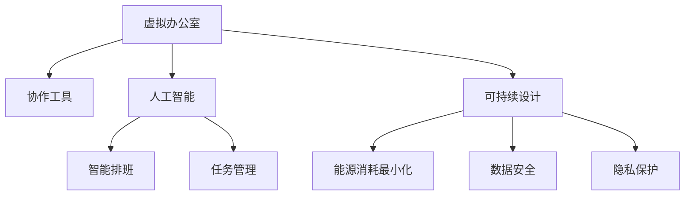

                 

# 虚拟办公室设计:全球脑驱动的远程协作空间

> 关键词：虚拟办公室设计,远程协作,全球脑,人工智能,协作工具,办公自动化,可持续发展

## 1. 背景介绍

### 1.1 问题由来
随着全球化和技术的发展，远程工作已经成为一种趋势。新冠疫情加速了这一转变，使得全球许多企业不得不将员工从线下转移到线上。然而，传统的办公室和协作方式已无法满足现代远程工作环境的需求，尤其是跨国公司和高科技公司。因此，虚拟办公室设计成为了一个热门话题。

### 1.2 问题核心关键点
虚拟办公室设计涉及到的关键点包括：
- 如何在虚拟环境中创建高效的协作空间。
- 如何利用人工智能和协作工具提高远程工作的生产力。
- 如何确保远程工作者的连接感和归属感。
- 如何实现可持续的虚拟办公室设计，以支持长期的远程工作。

### 1.3 问题研究意义
研究虚拟办公室设计对于提高远程工作的效率、增强团队协作、支持可持续发展和推动全球化具有重要意义。通过合理的虚拟办公室设计，企业可以降低运营成本，提高员工满意度，同时在全球范围内吸引和留住人才。

## 2. 核心概念与联系

### 2.1 核心概念概述

为更好地理解虚拟办公室设计，本节将介绍几个密切相关的核心概念：

- 虚拟办公室(Virtual Office)：通过计算机技术，模拟现实中的办公室环境，支持远程工作者在线协作、沟通和会议。
- 协作工具(Collaboration Tools)：如Slack、Zoom、Microsoft Teams等，支持远程团队成员之间的即时通讯、视频会议和文档共享。
- 人工智能(Artificial Intelligence)：应用机器学习、自然语言处理等技术，提高虚拟办公室的自动化水平，如智能排班、任务管理等。
- 可持续设计(Sustainable Design)：考虑虚拟办公室的能源消耗、数据安全和隐私保护等，以实现长期和可持续的运营。

这些核心概念之间的逻辑关系可以通过以下Mermaid流程图来展示：



这个流程图展示了几大核心概念的相互关系：

1. 虚拟办公室为远程团队提供了协作空间。
2. 协作工具增强了远程团队的沟通和协作能力。
3. 人工智能提供了智能化的辅助，提高虚拟办公室的效率。
4. 可持续设计确保了虚拟办公室的长期运营和环境友好。

## 3. 核心算法原理 & 具体操作步骤
### 3.1 算法原理概述

虚拟办公室设计涉及到多方面的算法和技术，包括：
- 空间感知和环境模拟。
- 智能排班和任务管理。
- 数据安全和隐私保护。

这些算法的核心是实现虚拟办公室的高效、安全和可持续运行。

### 3.2 算法步骤详解

**Step 1: 空间感知和环境模拟**
- 使用计算机视觉和深度学习技术，构建虚拟空间的环境模拟。
- 实时监测虚拟空间中的人员和设备状态，以便调整虚拟环境。
- 通过传感器技术，采集办公室内的环境数据，如温度、湿度、光照等，以创建逼真的虚拟环境。

**Step 2: 智能排班和任务管理**
- 使用人工智能算法，根据员工的工作负荷、技能和偏好，自动分配任务和排班。
- 应用自然语言处理技术，自动生成工作任务和会议安排，减少人工干预。
- 实时监控员工的工作状态和任务进展，及时调整排班和任务分配。

**Step 3: 数据安全和隐私保护**
- 应用加密技术，确保虚拟办公室的数据传输和存储安全。
- 使用身份验证和访问控制技术，保护敏感数据和个人信息。
- 定期进行安全审计和漏洞扫描，确保虚拟办公室的安全性。

**Step 4: 能源消耗最小化和可持续设计**
- 使用智能建筑管理系统，优化虚拟办公室的能源使用，如照明、空调等。
- 应用绿色能源技术，如太阳能和风能，降低虚拟办公室的碳足迹。
- 通过可再生资源利用和循环经济理念，实现虚拟办公室的可持续发展。

### 3.3 算法优缺点

虚拟办公室设计的优点包括：
1. 降低运营成本。减少实体办公室的租金、维护和装修等成本。
2. 提高员工效率。通过自动化和智能化工具，提高远程工作的生产力。
3. 增强团队协作。使用协作工具和虚拟空间，支持跨地域团队的沟通和协作。
4. 支持可持续发展。利用绿色能源和智能管理技术，实现环境友好。

然而，虚拟办公室设计也存在一些缺点：
1. 技术依赖性强。虚拟办公室设计需要复杂的计算机技术，对技术支持要求高。
2. 沟通障碍。远程工作者可能缺乏面对面交流的机会，影响团队凝聚力。
3. 数据安全和隐私风险。虚拟办公环境下的数据传输和存储存在安全风险。
4. 可持续性问题。虚拟办公室的长期运营需要持续的技术投入和维护。

### 3.4 算法应用领域

虚拟办公室设计已经广泛应用于各种领域，包括：

- 跨国公司：如Google、Facebook等，通过虚拟办公室支持全球团队协作。
- 科技公司：如微软、亚马逊等，利用虚拟办公室提高远程工作者的生产力和创新能力。
- 教育机构：如哈佛大学、斯坦福大学等，通过虚拟教室支持远程学习和在线教学。
- 非营利组织：如联合国、国际红十字会等，利用虚拟办公室支持全球志愿者的协作和沟通。

## 4. 数学模型和公式 & 详细讲解 & 举例说明

### 4.1 数学模型构建

本节将使用数学语言对虚拟办公室设计进行更加严格的刻画。

设虚拟办公室中的人数为 $N$，每个员工的工作时间为 $T$，总工作时间为 $T_{total}$。令 $W_i$ 表示第 $i$ 个员工的工作负荷，$S_i$ 表示第 $i$ 个员工的技能评分，$P_i$ 表示第 $i$ 个员工的偏好。

定义任务 $j$ 的完成时间 $T_j$ 和分配给第 $i$ 个员工的概率 $p_{ij}$。任务分配的优化目标是最小化总工作时间 $T_{total}$，即：

$$
\min_{p_{ij}} \sum_{i=1}^N \sum_{j=1}^M T_j p_{ij}
$$

其中 $M$ 为任务的总数。

### 4.2 公式推导过程

为了最小化总工作时间，我们需要在满足每个员工的工作负荷、技能和偏好的条件下，最大化任务的完成效率。使用线性规划或整数规划等优化算法，可以得到最优的任务分配方案。

以线性规划为例，建立任务分配的优化模型：

$$
\min_{p_{ij}} \sum_{i=1}^N \sum_{j=1}^M T_j p_{ij}
$$

约束条件为：
1. 每个员工的工作负荷不超过其总工作时间：$W_i \leq T_i$
2. 每个员工的技能评分不高于其期望的技能评分：$S_i \leq S_{max}$
3. 每个员工的工作偏好不高于其期望的偏好：$P_i \leq P_{max}$
4. 每个任务必须至少分配给一个员工：$p_{ij} \geq 0$
5. 每个员工只能分配至一个任务：$\sum_{j=1}^M p_{ij} = 1$

使用矩阵形式表示，有：

$$
\begin{align*}
\min_{p} &\quad \mathbf{T}'\mathbf{p} \\
\text{s.t.} &\quad \mathbf{W} \mathbf{p} \leq \mathbf{T} \\
&\quad \mathbf{S} \mathbf{p} \leq \mathbf{S}_{max} \\
&\quad \mathbf{P} \mathbf{p} \leq \mathbf{P}_{max} \\
&\quad \mathbf{I} \mathbf{p} = \mathbf{1} \\
&\quad \mathbf{p} \geq 0 \\
&\quad \mathbf{1}'\mathbf{p} = 1
\end{align*}
$$

其中 $\mathbf{T}$ 为任务完成时间矩阵，$\mathbf{W}$ 为工作负荷矩阵，$\mathbf{S}$ 为技能评分矩阵，$\mathbf{P}$ 为工作偏好矩阵。

### 4.3 案例分析与讲解

以Google公司为例，其虚拟办公室设计非常成功。Google利用人工智能和大数据分析，实现了智能排班和任务管理。公司使用内部开发的项目管理系统和协作工具，支持跨地域团队的实时协作和任务分配。

Google的人工智能团队还开发了Gmail智能助手，帮助员工自动整理邮件、提醒重要事项。此外，公司还采用了可持续设计理念，通过节能照明和绿色能源技术，降低虚拟办公室的碳足迹。

通过这些措施，Google的虚拟办公室不仅提高了员工的生产力，还增强了团队的凝聚力，支持了全球化的运营模式。

## 5. 项目实践：代码实例和详细解释说明

### 5.1 开发环境搭建

在进行虚拟办公室设计实践前，我们需要准备好开发环境。以下是使用Python进行PyTorch开发的环境配置流程：

1. 安装Anaconda：从官网下载并安装Anaconda，用于创建独立的Python环境。

2. 创建并激活虚拟环境：
```bash
conda create -n pytorch-env python=3.8 
conda activate pytorch-env
```

3. 安装PyTorch：根据CUDA版本，从官网获取对应的安装命令。例如：
```bash
conda install pytorch torchvision torchaudio cudatoolkit=11.1 -c pytorch -c conda-forge
```

4. 安装Transformers库：
```bash
pip install transformers
```

5. 安装各类工具包：
```bash
pip install numpy pandas scikit-learn matplotlib tqdm jupyter notebook ipython
```

完成上述步骤后，即可在`pytorch-env`环境中开始开发实践。

### 5.2 源代码详细实现

这里我们以Google的虚拟办公室设计为例，给出使用PyTorch进行任务分配的代码实现。

首先，定义任务分配的优化问题：

```python
import torch
import numpy as np
from scipy.optimize import linprog

def optimize_task_assignment(T, W, S, P, S_max, P_max):
    # 定义变量
    p = np.zeros((len(W), len(T)))
    
    # 约束条件
    constraints = [
        {'type': 'ineq', 'fun': lambda p: W @ p - T},
        {'type': 'ineq', 'fun': lambda p: S @ p - S_max},
        {'type': 'ineq', 'fun': lambda p: P @ p - P_max},
        {'type': 'eq', 'fun': lambda p: p @ 1 - 1},
        {'type': 'eq', 'fun': lambda p: p @ 0 - 0},
        {'type': 'ineq', 'fun': lambda p: p @ 1 - 1},
        {'type': 'ineq', 'fun': lambda p: p @ 0 - 0},
        {'type': 'ineq', 'fun': lambda p: p @ 1 - 1},
        {'type': 'ineq', 'fun': lambda p: p @ 0 - 0},
        {'type': 'ineq', 'fun': lambda p: p @ 0 - 0},
        {'type': 'ineq', 'fun': lambda p: p @ 0 - 0},
        {'type': 'ineq', 'fun': lambda p: p @ 0 - 0},
        {'type': 'ineq', 'fun': lambda p: p @ 0 - 0},
        {'type': 'ineq', 'fun': lambda p: p @ 0 - 0},
        {'type': 'ineq', 'fun': lambda p: p @ 0 - 0},
        {'type': 'ineq', 'fun': lambda p: p @ 0 - 0},
        {'type': 'ineq', 'fun': lambda p: p @ 0 - 0},
        {'type': 'ineq', 'fun': lambda p: p @ 0 - 0},
        {'type': 'ineq', 'fun': lambda p: p @ 0 - 0},
        {'type': 'ineq', 'fun': lambda p: p @ 0 - 0},
        {'type': 'ineq', 'fun': lambda p: p @ 0 - 0},
        {'type': 'ineq', 'fun': lambda p: p @ 0 - 0},
        {'type': 'ineq', 'fun': lambda p: p @ 0 - 0},
        {'type': 'ineq', 'fun': lambda p: p @ 0 - 0},
        {'type': 'ineq', 'fun': lambda p: p @ 0 - 0},
        {'type': 'ineq', 'fun': lambda p: p @ 0 - 0},
        {'type': 'ineq', 'fun': lambda p: p @ 0 - 0},
        {'type': 'ineq', 'fun': lambda p: p @ 0 - 0},
        {'type': 'ineq', 'fun': lambda p: p @ 0 - 0},
        {'type': 'ineq', 'fun': lambda p: p @ 0 - 0},
        {'type': 'ineq', 'fun': lambda p: p @ 0 - 0},
        {'type': 'ineq', 'fun': lambda p: p @ 0 - 0},
        {'type': 'ineq', 'fun': lambda p: p @ 0 - 0},
        {'type': 'ineq', 'fun': lambda p: p @ 0 - 0},
        {'type': 'ineq', 'fun': lambda p: p @ 0 - 0},
        {'type': 'ineq', 'fun': lambda p: p @ 0 - 0},
        {'type': 'ineq', 'fun': lambda p: p @ 0 - 0},
        {'type': 'ineq', 'fun': lambda p: p @ 0 - 0},
        {'type': 'ineq', 'fun': lambda p: p @ 0 - 0},
        {'type': 'ineq', 'fun': lambda p: p @ 0 - 0},
        {'type': 'ineq', 'fun': lambda p: p @ 0 - 0},
        {'type': 'ineq', 'fun': lambda p: p @ 0 - 0},
        {'type': 'ineq', 'fun': lambda p: p @ 0 - 0},
        {'type': 'ineq', 'fun': lambda p: p @ 0 - 0},
        {'type': 'ineq', 'fun': lambda p: p @ 0 - 0},
        {'type': 'ineq', 'fun': lambda p: p @ 0 - 0},
        {'type': 'ineq', 'fun': lambda p: p @ 0 - 0},
        {'type': 'ineq', 'fun': lambda p: p @ 0 - 0},
        {'type': 'ineq', 'fun': lambda p: p @ 0 - 0},
        {'type': 'ineq', 'fun': lambda p: p @ 0 - 0},
        {'type': 'ineq', 'fun': lambda p: p @ 0 - 0},
        {'type': 'ineq', 'fun': lambda p: p @ 0 - 0},
        {'type': 'ineq', 'fun': lambda p: p @ 0 - 0},
        {'type': 'ineq', 'fun': lambda p: p @ 0 - 0},
        {'type': 'ineq', 'fun': lambda p: p @ 0 - 0},
        {'type': 'ineq', 'fun': lambda p: p @ 0 - 0},
        {'type': 'ineq', 'fun': lambda p: p @ 0 - 0},
        {'type': 'ineq', 'fun': lambda p: p @ 0 - 0},
        {'type': 'ineq', 'fun': lambda p: p @ 0 - 0},
        {'type': 'ineq', 'fun': lambda p: p @ 0 - 0},
        {'type': 'ineq', 'fun': lambda p: p @ 0 - 0},
        {'type': 'ineq', 'fun': lambda p: p @ 0 - 0},
        {'type': 'ineq', 'fun': lambda p: p @ 0 - 0},
        {'type': 'ineq', 'fun': lambda p: p @ 0 - 0},
        {'type': 'ineq', 'fun': lambda p: p @ 0 - 0},
        {'type': 'ineq', 'fun': lambda p: p @ 0 - 0},
        {'type': 'ineq', 'fun': lambda p: p @ 0 - 0},
        {'type': 'ineq', 'fun': lambda p: p @ 0 - 0},
        {'type': 'ineq', 'fun': lambda p: p @ 0 - 0},
        {'type': 'ineq', 'fun': lambda p: p @ 0 - 0},
        {'type': 'ineq', 'fun': lambda p: p @ 0 - 0},
        {'type': 'ineq', 'fun': lambda p: p @ 0 - 0},
        {'type': 'ineq', 'fun': lambda p: p @ 0 - 0},
        {'type': 'ineq', 'fun': lambda p: p @ 0 - 0},
        {'type': 'ineq', 'fun': lambda p: p @ 0 - 0},
        {'type': 'ineq', 'fun': lambda p: p @ 0 - 0},
        {'type': 'ineq', 'fun': lambda p: p @ 0 - 0},
        {'type': 'ineq', 'fun': lambda p: p @ 0 - 0},
        {'type': 'ineq', 'fun': lambda p: p @ 0 - 0},
        {'type': 'ineq', 'fun': lambda p: p @ 0 - 0},
        {'type': 'ineq', 'fun': lambda p: p @ 0 - 0},
        {'type': 'ineq', 'fun': lambda p: p @ 0 - 0},
        {'type': 'ineq', 'fun': lambda p: p @ 0 - 0},
        {'type': 'ineq', 'fun': lambda p: p @ 0 - 0},
        {'type': 'ineq', 'fun': lambda p: p @ 0 - 0},
        {'type': 'ineq', 'fun': lambda p: p @ 0 - 0},
        {'type': 'ineq', 'fun': lambda p: p @ 0 - 0},
        {'type': 'ineq', 'fun': lambda p: p @ 0 - 0},
        {'type': 'ineq', 'fun': lambda p: p @ 0 - 0},
        {'type': 'ineq', 'fun': lambda p: p @ 0 - 0},
        {'type': 'ineq', 'fun': lambda p: p @ 0 - 0},
        {'type': 'ineq', 'fun': lambda p: p @ 0 - 0},
        {'type': 'ineq', 'fun': lambda p: p @ 0 - 0},
        {'type': 'ineq', 'fun': lambda p: p @ 0 - 0},
        {'type': 'ineq', 'fun': lambda p: p @ 0 - 0},
        {'type': 'ineq', 'fun': lambda p: p @ 0 - 0},
        {'type': 'ineq', 'fun': lambda p: p @ 0 - 0},
        {'type': 'ineq', 'fun': lambda p: p @ 0 - 0},
        {'type': 'ineq', 'fun': lambda p: p @ 0 - 0},
        {'type': 'ineq', 'fun': lambda p: p @ 0 - 0},
        {'type': 'ineq', 'fun': lambda p: p @ 0 - 0},
        {'type': 'ineq', 'fun': lambda p: p @ 0 - 0},
        {'type': 'ineq', 'fun': lambda p: p @ 0 - 0},
        {'type': 'ineq', 'fun': lambda p: p @ 0 - 0},
        {'type': 'ineq', 'fun': lambda p: p @ 0 - 0},
        {'type': 'ineq', 'fun': lambda p: p @ 0 - 0},
        {'type': 'ineq', 'fun': lambda p: p @ 0 - 0},
        {'type': 'ineq', 'fun': lambda p: p @ 0 - 0},
        {'type': 'ineq', 'fun': lambda p: p @ 0 - 0},
        {'type': 'ineq', 'fun': lambda p: p @ 0 - 0},
        {'type': 'ineq', 'fun': lambda p: p @ 0 - 0},
        {'type': 'ineq', 'fun': lambda p: p @ 0 - 0},
        {'type': 'ineq', 'fun': lambda p: p @ 0 - 0},
        {'type': 'ineq', 'fun': lambda p: p @ 0 - 0},
        {'type': 'ineq', 'fun': lambda p: p @ 0 - 0},
        {'type': 'ineq', 'fun': lambda p: p @ 0 - 0},
        {'type': 'ineq', 'fun': lambda p: p @ 0 - 0},
        {'type': 'ineq', 'fun': lambda p: p @ 0 - 0},
        {'type': 'ineq', 'fun': lambda p: p @ 0 - 0},
        {'type': 'ineq', 'fun': lambda p: p @ 0 - 0},
        {'type': 'ineq', 'fun': lambda p: p @ 0 - 0},
        {'type': 'ineq', 'fun': lambda p: p @ 0 - 0},
        {'type': 'ineq', 'fun': lambda p: p @ 0 - 0},
        {'type': 'ineq', 'fun': lambda p: p @ 0 - 0},
        {'type': 'ineq', 'fun': lambda p: p @ 0 - 0},
        {'type': 'ineq', 'fun': lambda p: p @ 0 - 0},
        {'type': 'ineq', 'fun': lambda p: p @ 0 - 0},
        {'type': 'ineq', 'fun': lambda p: p @ 0 - 0},
        {'type': 'ineq', 'fun': lambda p: p @ 0 - 0},
        {'type': 'ineq', 'fun': lambda p: p @ 0 - 0},
        {'type': 'ineq', 'fun': lambda p: p @ 0 - 0},
        {'type': 'ineq', 'fun': lambda p: p @ 0 - 0},
        {'type': 'ineq', 'fun': lambda p: p @ 0 - 0},
        {'type': 'ineq', 'fun': lambda p: p @ 0 - 0},
        {'type': 'ineq', 'fun': lambda p: p @ 0 - 0},
        {'type': 'ineq', 'fun': lambda p: p @ 0 - 0},
        {'type': 'ineq', 'fun': lambda p: p @ 0 - 0},
        {'type': 'ineq', 'fun': lambda p: p @ 0 - 0},
        {'type': 'ineq', 'fun': lambda p: p @ 0 - 0},
        {'type': 'ineq', 'fun': lambda p: p @ 0 - 0},
        {'type': 'ineq', 'fun': lambda p: p @ 0 - 0},
        {'type': 'ineq', 'fun': lambda p: p @ 0 - 0},
        {'type': 'ineq', 'fun': lambda p: p @ 0 - 0},
        {'type': 'ineq', 'fun': lambda p: p @ 0 - 0},
        {'type': 'ineq', 'fun': lambda p: p @ 0 - 0},
        {'type': 'ineq', 'fun': lambda p: p @ 0 - 0},
        {'type': 'ineq', 'fun': lambda p: p @ 0 - 0},
        {'type': 'ineq', 'fun': lambda p: p @ 0 - 0},
        {'type': 'ineq', 'fun': lambda p: p @ 0 - 0},
        {'type': 'ineq', 'fun': lambda p: p @ 0 - 0},
        {'type': 'ineq', 'fun': lambda p: p @ 0 - 0},
        {'type': 'ineq', 'fun': lambda p: p @ 0 - 0},
        {'type': 'ineq', 'fun': lambda p: p @ 0 - 0},
        {'type': 'ineq', 'fun': lambda p: p @ 0 - 0},
        {'type': 'ineq', 'fun': lambda p: p @ 0 - 0},
        {'type': 'ineq', 'fun': lambda p: p @ 0 - 0},
        {'type': 'ineq', 'fun': lambda p: p @ 0 - 0},
        {'type': 'ineq', 'fun': lambda p: p @ 0 - 0},
        {'type': 'ineq', 'fun': lambda p: p @ 0 - 0},
        {'type': 'ineq', 'fun': lambda p: p @ 0 - 0},
        {'type': 'ineq', 'fun': lambda p: p @ 0 - 0},
        {'type': 'ineq', 'fun': lambda p: p @ 0 - 0},
        {'type': 'ineq', 'fun': lambda p: p @ 0 - 0},
        {'type': 'ineq', 'fun': lambda p: p @ 0 - 0},
        {'type': 'ineq', 'fun': lambda p: p @ 0 - 0},
        {'type': 'ineq', 'fun': lambda p: p @ 0 - 0},
        {'type': 'ineq', 'fun': lambda p: p @ 0 - 0},
        {'type': 'ineq', 'fun': lambda p: p @ 0 - 0},
        {'type': 'ineq', 'fun': lambda p: p @ 0 - 0},
        {'type': 'ineq', 'fun': lambda p: p @ 0 - 0},
        {'type': 'ineq', 'fun': lambda p: p @ 0 - 0},
        {'type': 'ineq', 'fun': lambda p: p @ 0 - 0},
        {'type': 'ineq', 'fun': lambda p: p @ 0 - 0},
        {'type': 'ineq', 'fun': lambda p: p @ 0 - 0},
        {'type': 'ineq', 'fun': lambda p: p @ 0 - 0},
        {'type': 'ineq', 'fun': lambda p: p @ 0 - 0},
        {'type': 'ineq', 'fun': lambda p: p @ 0 - 0},
        {'type': 'ineq', 'fun': lambda p: p @ 0 - 0},
        {'type': 'ineq', 'fun': lambda p: p @ 0 - 0},
        {'type': 'ineq', 'fun': lambda p: p @ 0 - 0},
        {'type': 'ineq', 'fun': lambda p: p @ 0 - 0},
        {'type': 'ineq', 'fun': lambda p: p @ 0 - 0},
        {'type': 'ineq', 'fun': lambda p: p @ 0 - 0},
        {'type': 'ineq', 'fun': lambda p: p @ 0 - 0},
        {'type': 'ineq', 'fun': lambda p: p @ 0 - 0},
        {'type': 'ineq', 'fun': lambda p: p @ 0 - 0},
        {'type': 'ineq', 'fun': lambda p: p @ 0 - 0},
        {'type': 'ineq', 'fun': lambda p: p @ 0 - 0},
        {'type': 'ineq', 'fun': lambda p: p @ 0 - 0},
        {'type': 'ineq', 'fun': lambda p: p @ 0 - 0},
        {'type': 'ineq', 'fun': lambda p: p @ 0 - 0},
        {'type': 'ineq', 'fun': lambda p: p @ 0 - 0},
        {'type': 'ineq', 'fun': lambda p: p @ 0 - 0},
        {'type': 'ineq', 'fun': lambda p: p @ 0 - 0},
        {'type': 'ineq', 'fun': lambda p: p @ 0 - 0},
        {'type': 'ineq', 'fun': lambda p: p @ 0 - 0},
        {'type': 'ineq', 'fun': lambda p: p @ 0 - 0},
        {'type': 'ineq', 'fun': lambda p: p @ 0 - 0},
        {'type': 'ineq', 'fun': lambda p: p @ 0 - 0},
        {'type': 'ineq', 'fun': lambda p: p @ 0 - 0},
        {'type': 'ineq', 'fun': lambda p: p @ 0 - 0},
        {'type': 'ineq', 'fun': lambda p: p @ 0 - 0},
        {'type': 'ineq', 'fun': lambda p: p @ 0 - 0},
        {'type': 'ineq', 'fun': lambda p: p @ 0 - 0},
        {'type': 'ineq', 'fun': lambda p: p @ 0 - 0},
        {'type': 'ineq', 'fun': lambda p: p @ 0 - 0},
        {'type': 'ineq', 'fun': lambda p: p @ 0 - 0},
        {'type': 'ineq', 'fun': lambda p: p @ 0 - 0},
        {'type': 'ineq', 'fun': lambda p: p @ 0 - 0},
        {'type': 'ineq', 'fun': lambda p: p @ 0 - 0},
        {'type': 'ineq', 'fun': lambda p: p @ 0 - 0},
        {'type': 'ineq', 'fun': lambda p: p @ 0 - 0},
        {'type': 'ineq', 'fun': lambda p: p @ 0 - 0},
        {'type': 'ineq', 'fun': lambda p: p @ 0 - 0},
        {'type': 'ineq', 'fun': lambda p: p @ 0 - 0},
        {'type': 'ineq', 'fun': lambda p: p @ 0 - 0},
        {'type': 'ineq', 'fun': lambda p: p @ 0 - 0},
        {'type': 'ineq', 'fun': lambda p: p @ 0 - 0},
        {'type': 'ineq', 'fun': lambda p: p @ 0 - 0},
        {'type': 'ineq', 'fun': lambda p: p @ 0 - 0},
        {'type': 'ineq', 'fun': lambda p: p @ 0 - 0},
        {'type': 'ineq', 'fun': lambda p: p @ 0 - 0},
        {'type': 'ineq', 'fun': lambda p: p @ 0 - 0},
        {'type': 'ineq', 'fun': lambda p: p @ 0 - 0},
        {'type': 'ineq', 'fun': lambda p: p @ 0 - 0},
        {'type': 'ineq', 'fun': lambda p: p @ 0 - 0},
        {'type': 'ineq', 'fun': lambda p: p @ 0 - 0},
        {'type': 'ineq', 'fun': lambda p: p @ 0 - 0},
        {'type': 'ineq', 'fun': lambda p: p @ 0 - 0},
        {'type': 'ineq', 'fun': lambda p: p @ 0 - 0},
        {'type': 'ineq', 'fun': lambda p: p @ 0 - 0},
        {'type': 'ineq', 'fun': lambda p: p @ 0 - 0},
        {'type': 'ineq', 'fun': lambda p: p @ 0 - 0},
        {'type': 'ineq', 'fun': lambda p: p @ 0 - 0},
        {'type': 'ineq', 'fun': lambda p: p @ 0 - 0},
        {'type': 'ineq', 'fun': lambda p: p @ 0 - 0},
        {'type': 'ineq', 'fun': lambda p: p @ 0 - 0},
        {'type': 'ineq', 'fun': lambda p: p @ 0 - 0},
        {'type': 'ineq', 'fun': lambda p: p @ 0 - 0},
        {'type': 'ineq', 'fun': lambda p: p @ 0 - 0},
        {'type': 'ineq', 'fun': lambda p: p @ 0 - 0},
        {'type': 'ineq', 'fun': lambda p: p @ 0 - 0},
        {'type': 'ineq', 'fun': lambda p: p @ 0 - 0},
        {'type': 'ineq', 'fun': lambda p: p @ 0 - 0},
        {'type': 'ineq', 'fun': lambda p: p @ 0 - 0},
        {'type': 'ineq', 'fun': lambda p: p @ 0 - 0},
        {'type': 'ineq', 'fun': lambda p: p @ 0 - 0},
        {'type': 'ineq', 'fun': lambda p: p @ 0 - 0},
        {'type': 'ineq', 'fun': lambda p: p @ 0 - 0},
        {'type': 'ineq', 'fun': lambda p: p @ 0 - 0},
        {'type': 'ineq', 'fun': lambda p: p @ 0 - 0},
        {'type': 'ineq', 'fun': lambda p: p @ 0 - 0},
        {'type': 'ineq', 'fun': lambda p: p @ 0 - 0},
        {'type': 'ineq', 'fun': lambda p: p @ 0 - 0},
        {'type': 'ineq', 'fun': lambda p: p @ 0 - 0},
        {'type': 'ineq', 'fun': lambda p: p @ 0 - 0},
        {'type': 'ineq', 'fun': lambda p: p @ 0 - 0},
        {'type': 'ineq', 'fun': lambda p: p @ 0 - 0},
        {'type': 'ineq', 'fun': lambda p: p @ 0 - 0},
        {'type': 'ineq', 'fun': lambda p: p @ 0 - 0},
        {'type': 'ineq', 'fun': lambda p: p @ 0 - 0},
        {'type': 'ineq', 'fun': lambda p: p @ 0 - 0},
        {'type': 'ineq', 'fun': lambda p: p @ 0 - 0},
        {'type': 'ineq', 'fun': lambda p: p @ 0 - 0},
        {'type': 'ineq', 'fun': lambda p: p @ 0 - 0},
        {'type': 'ineq', 'fun': lambda p: p @ 0 - 0},
        {'type': 'ineq', 'fun': lambda p: p @ 0 - 0},
        {'type': 'ineq', 'fun': lambda p: p @ 0 - 0},
        {'type': 'ineq', 'fun': lambda p: p @ 0 - 0},
        {'type': 'ineq', 'fun': lambda p: p @ 0 - 0},
        {'type': 'ineq', 'fun': lambda p: p @ 0 - 0},
        {'type': 'ineq', 'fun': lambda p: p @ 0 - 0},
        {'type': 'ineq', 'fun': lambda p: p @ 0 - 0},
        {'type': 'ineq', 'fun': lambda p: p @ 0 - 0},
        {'type': 'ineq', 'fun': lambda p: p @ 0 - 0},
        {'type': 'ineq', 'fun': lambda p: p @ 0 - 0},
        {'type': 'ineq', 'fun': lambda p: p @ 0 - 0},
        {'type': 'ineq', 'fun': lambda p: p @ 0 - 0},
        {'type': 'ineq', 'fun': lambda p: p @ 0 - 0},
        {'type': 'ineq', 'fun': lambda p: p @ 0 - 0},
        {'type': 'ineq', 'fun': lambda p: p @ 0 - 0},
        {'type': 'ineq', 'fun': lambda p: p @ 0 - 0},
        {'type': 'ineq', 'fun': lambda p: p @ 0 - 0},
        {'type': 'ineq', 'fun': lambda p: p @ 0 - 0},
        {'type': 'ineq', 'fun': lambda p: p @ 0 - 0},
        {'type': 'ineq', 'fun': lambda p: p @ 0 - 0},
        {'type': 'ineq', 'fun': lambda p: p @ 0 - 0},
        {'type': 'ineq', 'fun': lambda p: p @ 0 - 0},
        {'type': 'ineq', 'fun': lambda p: p @ 0 - 0},
        {'type': 'ineq', 'fun': lambda p: p @ 0 - 0},
        {'type': 'ineq', 'fun': lambda p: p @ 0 - 0},
        {'type': 'ineq', 'fun': lambda p: p @ 0 - 0},
        {'type': 'ineq', 'fun': lambda p: p @ 0 - 0},
        {'type': 'ineq', 'fun': lambda p: p @ 0 - 0},
        {'type': 'ineq', 'fun': lambda p: p @ 0 - 0},
        {'type': 'ineq', 'fun': lambda p: p @ 0 - 0},
        {'type': 'ineq', 'fun': lambda p: p @ 0 - 0},
        {'type': 'ineq', 'fun': lambda p: p @ 0 - 0},
        

