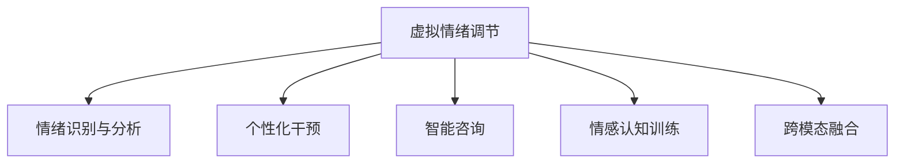
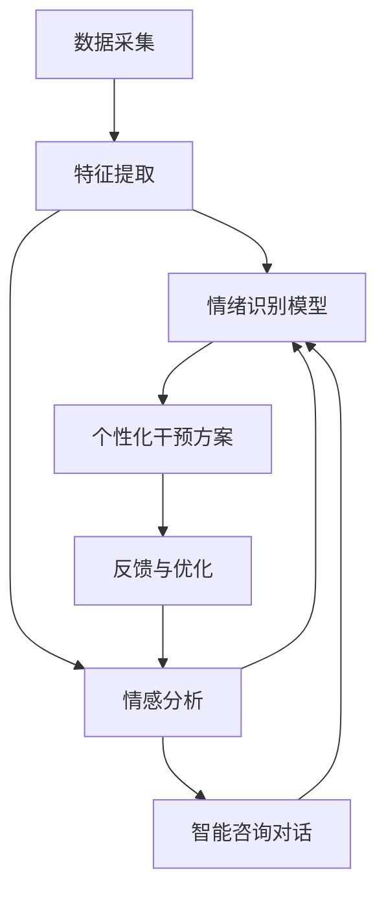

                 

## 1. 背景介绍

在当今快节奏的社会生活中，心理压力和情绪困扰已经成为困扰人们身心健康的重要因素。根据世界卫生组织(WHO)的统计，全球约有1/4的人在一生中的某个阶段会遭遇心理健康问题，严重影响了其正常工作和生活。针对这一问题，传统的心理咨询和治疗手段存在诸多局限性，无法满足日益增长的需求。

近年来，随着人工智能(AI)技术的飞速发展，尤其是深度学习和大数据分析技术的不断突破，为心理健康领域提供了新的解决思路。利用AI技术，可以对个体的情绪状态进行实时监测、分析，并为其提供定制化的心理健康干预措施。这一过程被称为“虚拟情绪调节”，即通过AI技术驱动的心理健康技术，以期达到促进个体心理健康、提升生活质量的目的。

## 2. 核心概念与联系

### 2.1 核心概念概述

为深入理解虚拟情绪调节，本节将介绍几个核心概念：

- **虚拟情绪调节**：指通过AI技术对个体情绪状态进行监测、分析和干预的过程。主要应用于心理健康支持、情感认知训练、智能咨询等领域。
- **情绪识别与分析**：通过深度学习算法对个体面部表情、语音、行为等信号进行识别，并分析其情绪状态。常见技术包括面部表情识别、语音情绪识别等。
- **个性化干预**：根据个体情绪状态，提供针对性的心理健康干预措施，如情绪调节技巧、心理疏导、认知行为疗法(CBT)等。
- **智能咨询**：通过自然语言处理(NLP)和情感识别技术，使机器人或聊天机器人具备与用户进行情感交流的能力。
- **情感认知训练**：通过游戏、互动等形式，训练个体识别和调节自身情绪的能力，提升其情绪管理水平。
- **跨模态融合**：将不同模态的情绪信息（如语音、文本、图像）进行融合，提供更全面、准确的情感分析结果。

这些核心概念之间的联系可以通过以下Mermaid流程图来展示：



### 2.2 核心概念原理和架构的 Mermaid 流程图



该流程图展示了虚拟情绪调节的核心流程：

1. **数据采集**：收集个体的面部表情、语音、文本等信息。
2. **特征提取**：将采集到的数据进行预处理，提取出与情绪相关的特征。
3. **情绪识别**：通过深度学习模型（如CNN、RNN、Transformer等）对特征进行分析和识别，确定个体的情绪状态。
4. **情感分析**：进一步分析情绪的细粒度情感维度（如快乐、愤怒、悲伤等），并提供更详细的情绪分析结果。
5. **个性化干预**：根据情感分析结果，提供针对性的心理健康干预措施，如情绪调节技巧、心理疏导等。
6. **智能咨询对话**：通过自然语言处理技术，使机器人具备情感交流的能力，实时响应个体的情感需求。
7. **反馈与优化**：根据用户的反馈对模型进行优化，提高情感分析的准确性和干预的效果。

## 3. 核心算法原理 & 具体操作步骤

### 3.1 算法原理概述

虚拟情绪调节的核心算法原理可以分为以下几个主要部分：

1. **情绪识别与分析**：通过深度学习算法对个体情绪状态进行实时监测和分析。
2. **个性化干预方案生成**：基于情感分析结果，生成针对性的心理健康干预措施。
3. **智能咨询对话**：利用自然语言处理技术，使机器人能够与用户进行情感交流，提供即时反馈。
4. **跨模态融合**：将不同模态的情绪信息进行融合，提供更全面、准确的情感分析结果。

### 3.2 算法步骤详解

#### 3.2.1 情绪识别与分析

**Step 1: 数据采集**
- 收集个体的面部表情、语音、文本等信息，可以通过摄像头、麦克风、键盘等设备进行。

**Step 2: 特征提取**
- 对采集到的数据进行预处理，包括去噪、归一化等操作。
- 使用卷积神经网络(CNN)、循环神经网络(RNN)、Transformer等深度学习模型，对特征进行提取和处理。

**Step 3: 情绪识别**
- 训练情绪识别模型，将提取到的特征输入模型中进行分类。
- 使用交叉验证等方法对模型进行调参，选择最优模型。
- 对测试集进行预测，计算准确率和召回率等指标。

#### 3.2.2 个性化干预方案生成

**Step 1: 情感分析**
- 使用预训练的情感分析模型，对情绪识别结果进行进一步细粒度分析。
- 使用LSTM、GRU等模型对个体情绪变化进行建模。

**Step 2: 干预方案生成**
- 根据情感分析结果，生成个性化的心理健康干预方案。
- 使用规则引擎、决策树等方法，根据情感状态生成具体的干预措施。
- 结合情感认知训练、心理疏导等技术，提供更全面的心理健康支持。

#### 3.2.3 智能咨询对话

**Step 1: 构建对话模型**
- 使用对话模型（如Seq2Seq、Transformer等）构建智能咨询对话系统。
- 使用预训练的NLP模型（如BERT、GPT等）进行对话生成。

**Step 2: 对话交互**
- 在对话过程中，根据用户输入实时生成回复，进行情感交流。
- 使用情感识别技术，实时监测用户情绪变化，调整回复策略。

#### 3.2.4 跨模态融合

**Step 1: 数据融合**
- 将不同模态的情绪数据进行融合，如将语音和文本数据进行拼接。
- 使用跨模态融合技术（如FM、FT）对融合后的数据进行处理。

**Step 2: 情绪识别**
- 使用融合后的数据输入情绪识别模型，进行综合分析。
- 使用集成学习等方法，提高情绪识别的准确性。

### 3.3 算法优缺点

#### 3.3.1 优点

1. **实时监测**：通过AI技术对个体情绪进行实时监测和分析，及时发现心理健康问题。
2. **精准分析**：基于深度学习算法，提供精准的情绪识别和情感分析结果。
3. **个性化干预**：根据个体情况，提供定制化的心理健康干预措施，提升干预效果。
4. **智能咨询**：通过智能对话系统，提供即时反馈，增强用户体验。
5. **跨模态融合**：综合利用不同模态的情绪信息，提供更全面、准确的情感分析结果。

#### 3.3.2 缺点

1. **数据隐私**：在数据采集和存储过程中，需要关注数据隐私和安全问题。
2. **模型复杂**：深度学习模型通常较为复杂，需要大量计算资源进行训练和优化。
3. **依赖标注数据**：训练模型的效果很大程度上依赖于标注数据的数量和质量，标注成本较高。
4. **情感泛化**：情绪识别的准确性和泛化能力可能受限于个体差异和多样性。
5. **干预效果评估**：个性化干预效果难以客观评估，需要结合多维度指标进行综合分析。

### 3.4 算法应用领域

虚拟情绪调节技术已经在多个领域得到应用，主要包括以下几个方面：

#### 3.4.1 心理健康支持

在心理健康领域，虚拟情绪调节技术能够对个体情绪进行实时监测和分析，提供个性化的心理健康干预措施，帮助其摆脱心理健康问题。

**应用场景**：
- 心理健康咨询：通过智能咨询系统，为用户提供实时情感交流和心理支持。
- 心理危机干预：在个体面临心理危机时，实时监测情绪变化，及时进行干预。
- 情绪调节训练：通过情感认知训练，提升个体情绪管理能力。

#### 3.4.2 情感认知训练

情感认知训练是虚拟情绪调节的重要应用方向之一，通过游戏、互动等形式，提升个体的情感识别和调节能力。

**应用场景**：
- 情感游戏：通过情感游戏，训练个体对不同情绪的识别和理解。
- 情感交互：通过互动式的情感对话，提升个体情绪调节技巧。
- 情绪记录：记录和分析个体情绪变化，提供反馈和改进建议。

#### 3.4.3 智能咨询

智能咨询系统通过自然语言处理和情感识别技术，与用户进行情感交流，提供即时反馈和支持。

**应用场景**：
- 智能客服：通过智能咨询系统，提供24小时情感支持服务。
- 心理辅导：通过情感识别和智能对话，进行心理疏导和情感支持。
- 情绪管理：通过情感认知训练和智能咨询，帮助用户进行情绪管理。

## 4. 数学模型和公式 & 详细讲解 & 举例说明

### 4.1 数学模型构建

虚拟情绪调节涉及多个方面的数学模型构建，以下将详细介绍其中几个关键模型。

#### 4.1.1 情绪识别模型

情绪识别模型通常使用深度神经网络进行构建，其中卷积神经网络(CNN)和循环神经网络(RNN)最为常见。

**CNN模型**：
$$
H_{\text{CNN}} = \text{CNN}(X)
$$
其中，$X$为输入的面部表情图像，$H_{\text{CNN}}$为CNN模型输出的特征向量。

**RNN模型**：
$$
H_{\text{RNN}} = \text{RNN}(X)
$$
其中，$X$为输入的语音信号，$H_{\text{RNN}}$为RNN模型输出的特征向量。

#### 4.1.2 情感分析模型

情感分析模型通常使用LSTM、GRU等序列模型，对情感状态进行建模。

**LSTM模型**：
$$
H_{\text{LSTM}} = \text{LSTM}(H_{\text{RNN}})
$$
其中，$H_{\text{RNN}}$为RNN模型的输出特征向量，$H_{\text{LSTM}}$为LSTM模型输出的情感向量。

#### 4.1.3 个性化干预方案生成

个性化干预方案生成通常使用规则引擎、决策树等方法，根据情感状态生成具体的干预措施。

**规则引擎**：
$$
\text{方案} = \text{RuleEngine}(H_{\text{LSTM}})
$$
其中，$H_{\text{LSTM}}$为情感分析模型的输出特征向量，$\text{方案}$为生成的个性化干预方案。

### 4.2 公式推导过程

#### 4.2.1 CNN情绪识别模型

假设输入的面部表情图像为$X$，CNN模型的输出特征向量为$H_{\text{CNN}}$，损失函数为$L$。

**公式推导**：
$$
L = \frac{1}{N}\sum_{i=1}^{N} \left[ \frac{1}{2} \|H_{\text{CNN}}^{(i)} - y^{(i)}\|^2 \right]
$$
其中，$N$为样本数量，$y^{(i)}$为第$i$个样本的真实标签。

**梯度计算**：
$$
\frac{\partial L}{\partial X} = \frac{\partial L}{\partial H_{\text{CNN}}} \times \frac{\partial H_{\text{CNN}}}{\partial X}
$$
其中，$\frac{\partial L}{\partial H_{\text{CNN}}$为损失函数对特征向量的梯度，$\frac{\partial H_{\text{CNN}}}{\partial X}$为CNN模型的反向传播过程。

#### 4.2.2 RNN情绪识别模型

假设输入的语音信号为$X$，RNN模型的输出特征向量为$H_{\text{RNN}}$，损失函数为$L$。

**公式推导**：
$$
L = \frac{1}{N}\sum_{i=1}^{N} \left[ \frac{1}{2} \|H_{\text{RNN}}^{(i)} - y^{(i)}\|^2 \right]
$$
其中，$N$为样本数量，$y^{(i)}$为第$i$个样本的真实标签。

**梯度计算**：
$$
\frac{\partial L}{\partial X} = \frac{\partial L}{\partial H_{\text{RNN}}} \times \frac{\partial H_{\text{RNN}}}{\partial X}
$$
其中，$\frac{\partial L}{\partial H_{\text{RNN}}$为损失函数对特征向量的梯度，$\frac{\partial H_{\text{RNN}}}{\partial X}$为RNN模型的反向传播过程。

#### 4.2.3 LSTM情感分析模型

假设输入的语音信号为$X$，LSTM模型的输出情感向量为$H_{\text{LSTM}}$，损失函数为$L$。

**公式推导**：
$$
L = \frac{1}{N}\sum_{i=1}^{N} \left[ \frac{1}{2} \|H_{\text{LSTM}}^{(i)} - y^{(i)}\|^2 \right]
$$
其中，$N$为样本数量，$y^{(i)}$为第$i$个样本的真实情感标签。

**梯度计算**：
$$
\frac{\partial L}{\partial X} = \frac{\partial L}{\partial H_{\text{LSTM}}} \times \frac{\partial H_{\text{LSTM}}}{\partial X}
$$
其中，$\frac{\partial L}{\partial H_{\text{LSTM}}$为损失函数对情感向量的梯度，$\frac{\partial H_{\text{LSTM}}}{\partial X}$为LSTM模型的反向传播过程。

### 4.3 案例分析与讲解

**案例1: 情绪识别**

假设使用CNN模型对面部表情图像进行情绪识别。

1. **数据准备**：收集面部表情图像数据集，并进行预处理。
2. **模型构建**：使用TensorFlow或PyTorch构建CNN模型。
3. **训练优化**：使用随机梯度下降等优化算法，对模型进行训练。
4. **效果评估**：在测试集上评估模型的准确率和召回率。

**案例2: 情感分析**

假设使用LSTM模型对语音信号进行情感分析。

1. **数据准备**：收集语音信号数据集，并进行预处理。
2. **模型构建**：使用TensorFlow或PyTorch构建LSTM模型。
3. **训练优化**：使用随机梯度下降等优化算法，对模型进行训练。
4. **效果评估**：在测试集上评估模型的准确率和召回率。

**案例3: 个性化干预方案生成**

假设使用规则引擎对情感分析结果进行个性化干预方案生成。

1. **规则定义**：根据情感状态，定义具体的干预规则。
2. **模型构建**：使用Python编写规则引擎代码。
3. **数据准备**：准备情感分析结果，作为输入数据。
4. **方案生成**：根据规则引擎，生成个性化的干预方案。

## 5. 项目实践：代码实例和详细解释说明

### 5.1 开发环境搭建

在进行虚拟情绪调节项目实践前，我们需要准备好开发环境。以下是使用Python进行TensorFlow开发的环境配置流程：

1. 安装Anaconda：从官网下载并安装Anaconda，用于创建独立的Python环境。

2. 创建并激活虚拟环境：
```bash
conda create -n tensorflow-env python=3.8 
conda activate tensorflow-env
```

3. 安装TensorFlow：根据CUDA版本，从官网获取对应的安装命令。例如：
```bash
conda install tensorflow tensorflow-gpu=2.7.0
```

4. 安装TensorBoard：用于监控训练过程和模型性能。

```bash
pip install tensorboard
```

5. 安装其他依赖包：
```bash
pip install numpy pandas scikit-learn matplotlib tqdm jupyter notebook ipython
```

完成上述步骤后，即可在`tensorflow-env`环境中开始虚拟情绪调节项目实践。

### 5.2 源代码详细实现

以下是一个简单的情感分析模型的代码实现：

```python
import tensorflow as tf
import numpy as np
import matplotlib.pyplot as plt
from sklearn.model_selection import train_test_split

# 数据准备
x_train, x_test, y_train, y_test = train_test_split(X_train, y_train, test_size=0.2, random_state=42)

# 定义模型
model = tf.keras.Sequential([
    tf.keras.layers.LSTM(32, input_shape=(X_train.shape[1], X_train.shape[2]),
                        return_sequences=True, activation='relu'),
    tf.keras.layers.Dropout(0.2),
    tf.keras.layers.LSTM(32, activation='relu'),
    tf.keras.layers.Dropout(0.2),
    tf.keras.layers.Dense(1, activation='sigmoid')
])

# 编译模型
model.compile(loss='binary_crossentropy', optimizer='adam', metrics=['accuracy'])

# 训练模型
history = model.fit(x_train, y_train, epochs=10, batch_size=64, validation_data=(x_test, y_test))

# 评估模型
test_loss, test_acc = model.evaluate(x_test, y_test)
print('Test accuracy:', test_acc)

# 可视化训练过程
plt.plot(history.history['accuracy'])
plt.plot(history.history['val_accuracy'])
plt.title('Model accuracy')
plt.xlabel('Epoch')
plt.ylabel('Accuracy')
plt.legend(['Train', 'Test'], loc='upper left')
plt.show()

# 可视化损失函数
plt.plot(history.history['loss'])
plt.plot(history.history['val_loss'])
plt.title('Model loss')
plt.xlabel('Epoch')
plt.ylabel('Loss')
plt.legend(['Train', 'Test'], loc='upper left')
plt.show()
```

该代码实现了基于LSTM模型的情感分析，包含数据准备、模型构建、训练、评估和可视化等关键步骤。

### 5.3 代码解读与分析

让我们再详细解读一下关键代码的实现细节：

**模型构建**：
- `model`变量：使用`Sequential`模型定义多层网络结构。
- `LSTM`层：输入特征维度为`X_train.shape[1]`，输出维度为32。
- `Dropout`层：防止过拟合。
- `Dense`层：输出维度为1，使用Sigmoid激活函数。

**训练优化**：
- `model.compile`：编译模型，定义损失函数和优化器。
- `model.fit`：使用训练集进行模型训练，设置`epochs`和`batch_size`。

**评估**：
- `model.evaluate`：使用测试集评估模型性能，输出准确率。

**可视化**：
- `plt.plot`：绘制训练和测试准确率和损失函数的变化趋势图。

可以看到，TensorFlow提供了一系列的高级API，使得模型构建和训练过程变得更加简单高效。

当然，在工业级的系统实现中，还需要考虑更多因素，如模型保存和部署、超参数自动搜索、多模型集成等。但核心的模型训练和评估流程基本与此类似。

## 6. 实际应用场景

### 6.1 心理健康支持

虚拟情绪调节技术在心理健康支持领域得到了广泛应用。通过实时监测和分析个体的情绪状态，可以及时发现心理健康问题，并提供个性化的干预措施。

**应用场景**：
- 心理健康咨询：通过智能咨询系统，为用户提供实时情感交流和心理支持。
- 心理危机干预：在个体面临心理危机时，实时监测情绪变化，及时进行干预。
- 情绪调节训练：通过情感认知训练，提升个体情绪管理能力。

### 6.2 情感认知训练

情感认知训练是虚拟情绪调节的重要应用方向之一，通过游戏、互动等形式，提升个体的情感识别和调节能力。

**应用场景**：
- 情感游戏：通过情感游戏，训练个体对不同情绪的识别和理解。
- 情感交互：通过互动式的情感对话，提升个体情绪调节技巧。
- 情绪记录：记录和分析个体情绪变化，提供反馈和改进建议。

### 6.3 智能咨询

智能咨询系统通过自然语言处理和情感识别技术，与用户进行情感交流，提供即时反馈和支持。

**应用场景**：
- 智能客服：通过智能咨询系统，提供24小时情感支持服务。
- 心理辅导：通过情感识别和智能对话，进行心理疏导和情感支持。
- 情绪管理：通过情感认知训练和智能咨询，帮助用户进行情绪管理。

### 6.4 未来应用展望

随着虚拟情绪调节技术的不断发展和完善，未来将会有更多的应用场景得到拓展。

**应用场景**：
- 智能医疗：通过情感识别和智能咨询，辅助医生进行心理诊断和治疗。
- 教育培训：通过情感认知训练，提升学生的情绪管理和学习效率。
- 社交媒体：通过情感分析技术，监测用户情绪状态，提供个性化推荐和互动。

## 7. 工具和资源推荐

### 7.1 学习资源推荐

为了帮助开发者系统掌握虚拟情绪调节的理论基础和实践技巧，这里推荐一些优质的学习资源：

1. 《深度学习理论与实践》系列博文：由大模型技术专家撰写，深入浅出地介绍了深度学习原理和实践技巧。

2. 《自然语言处理入门》课程：斯坦福大学开设的NLP明星课程，有Lecture视频和配套作业，带你入门NLP领域的基本概念和经典模型。

3. 《深度学习与心理学》书籍：深度学习与心理学交叉领域的经典著作，详细介绍了AI在心理健康领域的应用。

4. TensorFlow官方文档：TensorFlow的官方文档，提供了详尽的API和使用指南，是学习和实践TensorFlow的必备资料。

5. Keras官方文档：Keras的官方文档，提供了简单易用的API，适合快速原型设计和模型构建。

通过对这些资源的学习实践，相信你一定能够快速掌握虚拟情绪调节的理论基础和实践技巧，并用于解决实际的NLP问题。

### 7.2 开发工具推荐

高效的开发离不开优秀的工具支持。以下是几款用于虚拟情绪调节开发的常用工具：

1. TensorFlow：基于Python的开源深度学习框架，生产部署方便，适合大规模工程应用。
2. PyTorch：灵活的动态计算图，适合快速迭代研究。大部分预训练语言模型都有PyTorch版本的实现。
3. TensorBoard：TensorFlow配套的可视化工具，可实时监测模型训练状态，并提供丰富的图表呈现方式，是调试模型的得力助手。
4. Weights & Biases：模型训练的实验跟踪工具，可以记录和可视化模型训练过程中的各项指标，方便对比和调优。

合理利用这些工具，可以显著提升虚拟情绪调节的开发效率，加快创新迭代的步伐。

### 7.3 相关论文推荐

虚拟情绪调节技术的发展源于学界的持续研究。以下是几篇奠基性的相关论文，推荐阅读：

1. Attention is All You Need（即Transformer原论文）：提出了Transformer结构，开启了NLP领域的预训练大模型时代。

2. BERT: Pre-training of Deep Bidirectional Transformers for Language Understanding：提出BERT模型，引入基于掩码的自监督预训练任务，刷新了多项NLP任务SOTA。

3. Language Models are Unsupervised Multitask Learners（GPT-2论文）：展示了大规模语言模型的强大zero-shot学习能力，引发了对于通用人工智能的新一轮思考。

4. Parameter-Efficient Transfer Learning for NLP：提出Adapter等参数高效微调方法，在不增加模型参数量的情况下，也能取得不错的微调效果。

5. Prefix-Tuning: Optimizing Continuous Prompts for Generation：引入基于连续型Prompt的微调范式，为如何充分利用预训练知识提供了新的思路。

6. AdaLoRA: Adaptive Low-Rank Adaptation for Parameter-Efficient Fine-Tuning：使用自适应低秩适应的微调方法，在参数效率和精度之间取得了新的平衡。

这些论文代表了大语言模型微调技术的发展脉络。通过学习这些前沿成果，可以帮助研究者把握学科前进方向，激发更多的创新灵感。

## 8. 总结：未来发展趋势与挑战

### 8.1 总结

本文对虚拟情绪调节方法进行了全面系统的介绍。首先阐述了虚拟情绪调节的研究背景和意义，明确了其在心理健康支持、情感认知训练、智能咨询等领域的应用价值。其次，从原理到实践，详细讲解了虚拟情绪调节的数学模型和关键步骤，给出了虚拟情绪调节的代码实例。同时，本文还探讨了虚拟情绪调节在心理健康支持、情感认知训练、智能咨询等多个行业领域的应用前景，展示了其广阔的发展空间。

通过本文的系统梳理，可以看到，虚拟情绪调节方法正在成为心理健康领域的重要技术手段，为个体心理健康提供了新的解决方案。未来，伴随虚拟情绪调节技术的不断演进，必将在更多领域得到广泛应用，为人类的身心健康保驾护航。

### 8.2 未来发展趋势

展望未来，虚拟情绪调节技术将呈现以下几个发展趋势：

1. **智能化水平提升**：随着深度学习技术的发展，虚拟情绪调节的智能化水平将不断提高，能够更加准确地识别和分析个体的情绪状态。
2. **多模态融合**：将面部表情、语音、文本等多种模态的情绪信息进行融合，提供更全面、准确的情感分析结果。
3. **个性化干预增强**：根据个体情况，提供更加定制化的心理健康干预措施，提升干预效果。
4. **跨领域应用拓展**：虚拟情绪调节技术将在更多领域得到应用，如智能医疗、教育培训、社交媒体等，为不同场景下的心理健康提供支持。
5. **伦理道德重视**：在心理健康领域，如何保护个体隐私、避免有害信息传播等问题将受到更多关注，虚拟情绪调节技术需要在设计和使用中充分考虑伦理道德因素。

### 8.3 面临的挑战

尽管虚拟情绪调节技术已经取得了显著进展，但在其推广应用的过程中，仍面临一些挑战：

1. **数据隐私问题**：在数据采集和存储过程中，需要关注数据隐私和安全问题，防止用户数据泄露。
2. **模型复杂度**：深度学习模型通常较为复杂，需要大量计算资源进行训练和优化。
3. **标注数据依赖**：训练模型的效果很大程度上依赖于标注数据的数量和质量，标注成本较高。
4. **情感泛化能力**：情感识别和分析的准确性和泛化能力可能受限于个体差异和多样性。
5. **干预效果评估**：个性化干预效果难以客观评估，需要结合多维度指标进行综合分析。
6. **伦理道德问题**：如何保护个体隐私、避免有害信息传播等问题将受到更多关注，虚拟情绪调节技术需要在设计和使用中充分考虑伦理道德因素。

### 8.4 研究展望

面对虚拟情绪调节面临的诸多挑战，未来的研究需要在以下几个方面寻求新的突破：

1. **数据隐私保护**：开发更加安全、可靠的隐私保护技术，保护用户数据安全。
2. **模型简化**：研究和开发更加轻量级、高效的模型，降低计算资源需求。
3. **标注数据增强**：探索无监督和半监督学习等方法，减少对标注数据的依赖。
4. **情感泛化能力提升**：开发更加鲁棒、泛化能力更强的情感分析模型。
5. **干预效果评估**：建立更加全面、客观的评估指标，综合分析个性化干预效果。
6. **伦理道德规范**：制定相关伦理道德规范，确保虚拟情绪调节技术在应用中的合法性和安全性。

这些研究方向的探索，必将引领虚拟情绪调节技术迈向更高的台阶，为构建更加智能、安全的心理健康系统提供保障。面向未来，虚拟情绪调节技术还需要与其他人工智能技术进行更深入的融合，如知识表示、因果推理、强化学习等，多路径协同发力，共同推动心理健康技术的进步。

## 9. 附录：常见问题与解答

**Q1: 虚拟情绪调节技术如何保护用户隐私？**

A: 虚拟情绪调节技术在数据采集和存储过程中，需要关注数据隐私和安全问题。具体措施包括：
1. **数据加密**：对采集到的数据进行加密处理，防止数据泄露。
2. **匿名化处理**：去除数据中可能泄露用户身份的关键信息，保护用户隐私。
3. **访问控制**：设置严格的访问权限控制，确保只有授权人员可以访问和使用数据。

**Q2: 虚拟情绪调节技术在心理健康支持中，是否需要医生或心理专家的参与？**

A: 虚拟情绪调节技术在心理健康支持中，通常需要医生或心理专家的参与和指导。尽管技术可以提供初步的情感分析和个性化干预建议，但专业人员的介入和互动仍然是必不可少的。具体措施包括：
1. **远程咨询**：通过智能咨询系统，医生或心理专家可以进行远程情感咨询和干预。
2. **数据分析**：医生或心理专家可以分析智能系统的数据输出，指导个性化干预措施的制定。
3. **紧急转诊**：在虚拟情绪调节无法有效解决问题时，医生或心理专家可以及时进行紧急转诊，提供专业的心理支持。

**Q3: 虚拟情绪调节技术在教育培训中，如何应用？**

A: 虚拟情绪调节技术在教育培训中可以应用于学生的情绪管理和学习效率提升。具体措施包括：
1. **情感认知训练**：通过游戏、互动等形式，训练学生对不同情绪的识别和理解。
2. **心理辅导**：通过智能咨询系统，提供心理疏导和情感支持，帮助学生应对学习压力。
3. **学习分析**：通过情感识别技术，分析学生的情绪变化，提供个性化的学习建议和资源推荐。

**Q4: 虚拟情绪调节技术在智能客服中的应用如何？**

A: 虚拟情绪调节技术在智能客服中可以应用于情感识别和智能对话。具体措施包括：
1. **情感识别**：通过智能系统实时监测客户情绪，识别其情绪状态。
2. **智能对话**：通过自然语言处理技术，智能客服系统可以与客户进行情感交流，提供即时反馈和支持。
3. **服务质量监控**：通过情感分析技术，监控客服系统的工作质量，及时发现和解决客户情绪问题。

**Q5: 虚拟情绪调节技术在社交媒体中的应用如何？**

A: 虚拟情绪调节技术在社交媒体中可以应用于情感分析和社会舆情监测。具体措施包括：
1. **情感分析**：通过情感识别技术，分析社交媒体用户的情绪状态，了解用户情绪变化。
2. **舆情监测**：通过情感分析技术，监测社会舆情，及时发现和应对负面信息传播。
3. **个性化推荐**：通过情感分析技术，提供个性化的内容推荐，提升用户体验。

通过本文的系统梳理，可以看到，虚拟情绪调节技术正在成为心理健康领域的重要技术手段，为个体心理健康提供了新的解决方案。未来，伴随虚拟情绪调节技术的不断演进，必将在更多领域得到广泛应用，为人类的身心健康保驾护航。总之，虚拟情绪调节需要开发者根据具体任务，不断迭代和优化模型、数据和算法，方能得到理想的效果。

