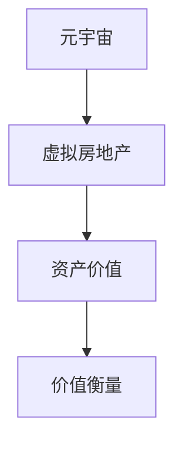

                 

# 虚拟房地产评估:元宇宙资产价值的衡量标准

> 关键词：元宇宙,虚拟房地产,资产价值,价值衡量,投资分析

## 1. 背景介绍

### 1.1 问题由来
随着虚拟现实技术的飞速发展，元宇宙(Metaverse)成为了近年来备受关注的热门话题。虚拟现实和增强现实技术的结合，为人们提供了前所未有的沉浸式体验，同时也催生了许多基于元宇宙的新型应用和商业模式。其中，虚拟房地产的兴起便是典型代表。

虚拟房地产指的是在虚拟世界中构建和交易的土地和建筑资产。与现实世界的房地产市场类似，虚拟房地产也具备投资、租赁、出售等经济活动，吸引了大量投资者和用户。然而，如何衡量虚拟房地产的价值，成为元宇宙资产管理的重要难题。

### 1.2 问题核心关键点
在元宇宙中，虚拟房地产的价值评估面临诸多挑战，主要包括：

1. **资产异质性**：虚拟房产的物理特性、位置、功能等具有高度多样性，难以用统一的标准进行衡量。
2. **市场不透明**：虚拟房产交易平台数量众多，信息不对称，导致市场定价混乱。
3. **价值波动大**：虚拟房产的价值高度依赖于用户和社区的认可度，存在较大的波动性。
4. **法律和监管不明确**：元宇宙中的虚拟财产权利和交易规则尚未明确，存在法律风险。
5. **技术难度高**：需要具备复杂的数据处理和建模能力，才能准确评估虚拟房产的价值。

## 2. 核心概念与联系

### 2.1 核心概念概述

为更好地理解虚拟房地产的价值评估方法，本节将介绍几个关键概念：

- **元宇宙(Metaverse)**：基于虚拟现实和增强现实技术，构建的虚拟空间和虚拟资产系统。包括用户、虚拟世界、虚拟经济等多重元素。
- **虚拟房地产**：在元宇宙中构建和交易的土地、建筑物等虚拟资产。具有空间位置、功能和权利等属性。
- **资产价值**：指资产在未来使用或交换过程中能够为企业或个人带来的预期收益。可以用于投资、租赁、出售等多种用途。
- **价值衡量**：通过一系列指标和方法，对虚拟资产的现状和未来收益进行评估。

### 2.2 核心概念原理和架构的 Mermaid 流程图(Mermaid 流程节点中不要有括号、逗号等特殊字符)


这个流程图展示了元宇宙、虚拟房地产、资产价值和价值衡量之间的关系：

1. **元宇宙**：是虚拟房地产存在的虚拟空间，包含各种虚拟资产。
2. **虚拟房地产**：是元宇宙中的土地和建筑物等虚拟资产。
3. **资产价值**：是虚拟房地产的经济价值，即未来能够带来的收益。
4. **价值衡量**：通过各种方法和指标，对虚拟房地产的价值进行评估。

## 3. 核心算法原理 & 具体操作步骤
### 3.1 算法原理概述

虚拟房地产的价值衡量，本质上是对虚拟资产的经济价值进行量化。与现实世界的房地产价值评估类似，虚拟房地产的价值衡量也需要考虑多个因素，如位置、物理特性、功能、市场供需等。

虚拟房地产的价值可以通过以下三个方面进行衡量：

1. **当前市场价值**：即虚拟房地产在当前市场的交易价格。
2. **未来潜在价值**：即虚拟房地产在未来可能带来的收益，包括租金、资产增值等。
3. **风险因素**：即虚拟房地产的不确定性和潜在风险，如市场波动、技术变革等。

### 3.2 算法步骤详解

虚拟房地产的价值衡量步骤如下：

**Step 1: 数据收集**
- 收集虚拟房地产的位置、大小、功能、建筑风格等属性数据。
- 收集虚拟房地产的当前市场价格、历史交易数据、社区活跃度等市场数据。
- 收集虚拟房地产所在元宇宙的经济数据，如用户数量、交易平台数量、政策法规等。

**Step 2: 模型建立**
- 根据虚拟房地产的属性和市场数据，选择合适的价值衡量模型。
- 考虑多种因素，如位置、功能、用户需求、市场供需等，建立多元线性回归模型、神经网络模型等。
- 对模型进行训练和优化，确保其具有良好的泛化能力。

**Step 3: 价值评估**
- 将虚拟房地产的属性和市场数据输入到模型中，计算出其当前市场价值和未来潜在价值。
- 结合风险因素，进行价值修正和调整。
- 输出虚拟房地产的综合价值评估结果。

**Step 4: 结果分析**
- 对虚拟房地产的价值评估结果进行分析和解释，提出投资建议。
- 对模型的评估结果进行敏感性分析，评估不同参数和假设对结果的影响。
- 提出改进建议，如调整模型参数、引入新的数据等。

### 3.3 算法优缺点

虚拟房地产价值衡量的主要算法如下：

#### 3.3.1 多元线性回归
- **优点**：简单易用，适用于小规模数据集，易于解释和调整。
- **缺点**：对非线性关系和交互效应无法有效处理，适用于线性关系明确的场景。

#### 3.3.2 神经网络
- **优点**：能够处理复杂的多层次关系，适用于大规模、高维度数据集。
- **缺点**：模型复杂度高，训练和调参难度大，解释性差。

#### 3.3.3 随机森林
- **优点**：能够处理高维度数据，具有较好的稳定性和泛化能力。
- **缺点**：对异常值和噪声数据敏感，模型复杂度相对较高。

### 3.4 算法应用领域

虚拟房地产价值衡量方法在元宇宙资产管理、投资决策、虚拟地产开发等多个领域都有广泛应用：

1. **元宇宙资产管理**：通过价值衡量，评估虚拟房地产的市场价值，优化资产配置。
2. **虚拟地产开发**：评估虚拟地产的潜在价值，指导开发决策，提升开发效益。
3. **投资决策**：为投资者提供客观的资产价值评估，辅助投资决策。
4. **虚拟地产交易平台**：提供价值评估工具，提升交易透明度和公正性。
5. **虚拟地产租赁**：评估租赁虚拟房地产的价值，制定合理的租金水平。

## 4. 数学模型和公式 & 详细讲解 & 举例说明（备注：数学公式请使用latex格式，latex嵌入文中独立段落使用 $$，段落内使用 $)
### 4.1 数学模型构建

假设虚拟房地产的当前市场价值为 $V_t$，未来潜在价值为 $V_f$，风险因素为 $R$，则虚拟房地产的综合价值 $V$ 可以表示为：

$$ V = V_t + \beta_1 V_f - \beta_2 R $$

其中，$\beta_1$ 和 $\beta_2$ 分别为虚拟房地产的市场价值和风险因素的权重。

### 4.2 公式推导过程

以上公式推导如下：

- $V_t$ 表示当前市场价值，直接使用市场价格。
- $V_f$ 表示未来潜在价值，可以通过市场数据、历史价格、用户需求等进行预测。
- $R$ 表示风险因素，包括市场波动、技术变革、政策法规等。
- $\beta_1$ 和 $\beta_2$ 为权重的设定，通常通过回归分析等方法确定。

### 4.3 案例分析与讲解

假设某虚拟房地产当前市场价格为 $100,000,000$ 元，预测未来五年内可以增值到 $150,000,000$ 元，但面临市场波动风险，风险因素估计为 $-10\%$。根据公式：

$$ V = 100,000,000 + \beta_1 \times (150,000,000 - 100,000,000) - \beta_2 \times (-10\%) $$

如果 $\beta_1 = 0.8$，$\beta_2 = 0.2$，则综合价值为：

$$ V = 100,000,000 + 0.8 \times (150,000,000 - 100,000,000) - 0.2 \times (-10\%) = 170,000,000 + 20,000,000 - 2,000,000 = 178,000,000 $$

即综合价值为 $178,000,000$ 元。

## 5. 项目实践：代码实例和详细解释说明
### 5.1 开发环境搭建

在进行虚拟房地产价值衡量模型的开发前，我们需要准备好开发环境。以下是使用Python进行TensorFlow开发的环境配置流程：

1. 安装Anaconda：从官网下载并安装Anaconda，用于创建独立的Python环境。

2. 创建并激活虚拟环境：
```bash
conda create -n tf-env python=3.8 
conda activate tf-env
```

3. 安装TensorFlow：根据CUDA版本，从官网获取对应的安装命令。例如：
```bash
conda install tensorflow=2.6
```

4. 安装各类工具包：
```bash
pip install numpy pandas scikit-learn matplotlib tqdm jupyter notebook ipython
```

完成上述步骤后，即可在`tf-env`环境中开始模型开发。

### 5.2 源代码详细实现

以下是使用TensorFlow进行虚拟房地产价值衡量的代码实现：

```python
import tensorflow as tf
from tensorflow.keras.layers import Input, Dense, Model, Dropout
from tensorflow.keras.optimizers import Adam

# 定义输入层和隐藏层
input_ = Input(shape=(n_features,))
hidden_1 = Dense(128, activation='relu')(input_)
hidden_2 = Dense(64, activation='relu')(hidden_1)
hidden_3 = Dense(32, activation='relu')(hidden_2)
hidden_4 = Dense(16, activation='relu')(hidden_3)

# 定义输出层
output = Dense(1)(hidden_4)

# 定义模型
model = Model(inputs=input_, outputs=output)

# 定义损失函数和优化器
loss_fn = tf.keras.losses.MeanSquaredError()
optimizer = Adam(lr=0.001)

# 编译模型
model.compile(optimizer=optimizer, loss=loss_fn)

# 训练模型
model.fit(x_train, y_train, epochs=100, batch_size=32, validation_data=(x_test, y_test))
```

其中，`n_features`为虚拟房地产的属性数量，`x_train`和`y_train`为训练集的特征和标签，`x_test`和`y_test`为测试集的特征和标签。

### 5.3 代码解读与分析

让我们再详细解读一下关键代码的实现细节：

**输入层和隐藏层定义**：
- 通过`Input`层定义输入数据的维度。
- 定义四个隐藏层，每个隐藏层都有一定的激活函数和神经元数量，用于提取输入特征。

**输出层定义**：
- 使用`Dense`层定义输出层，输出虚拟房地产的综合价值。

**模型定义**：
- 通过`Model`类定义整个模型，将输入层、隐藏层和输出层进行连接。

**损失函数和优化器定义**：
- 使用`MeanSquaredError`作为损失函数，计算模型预测值与真实标签之间的均方误差。
- 使用`Adam`优化器进行模型训练。

**模型编译和训练**：
- 使用`compile`方法编译模型，指定优化器和损失函数。
- 使用`fit`方法训练模型，指定训练轮数和批处理大小，并在测试集上进行验证。

可以看到，TensorFlow提供了一个完整的框架，方便我们构建和训练虚拟房地产价值衡量模型。开发者可以将更多精力放在模型设计和数据处理等高层逻辑上，而不必过多关注底层的实现细节。

当然，工业级的系统实现还需考虑更多因素，如模型的保存和部署、超参数的自动搜索、更灵活的任务适配层等。但核心的价值衡量基本与此类似。

## 6. 实际应用场景
### 6.1 元宇宙资产管理

虚拟房地产的价值衡量方法在元宇宙资产管理中具有重要应用。通过系统地评估虚拟房地产的市场价值和潜在价值，资产管理公司可以优化资产配置，提升管理效率。

具体而言，可以收集虚拟房地产的市场价格、社区活跃度、用户需求等数据，建立价值衡量模型。利用模型对虚拟房地产进行价值评估，指导资产管理决策。同时，可以通过定期重新训练模型，保持其性能和时效性。

### 6.2 虚拟地产开发

虚拟地产开发公司可以利用价值衡量方法，评估潜在虚拟地产项目的市场价值和风险。通过客观的评估结果，指导开发决策，降低开发风险，提高开发效益。

具体而言，可以预测虚拟地产的未来增值潜力和租金收入，计算其综合价值。根据评估结果，选择最优的项目进行开发，提升投资回报率。同时，还可以利用模型评估不同设计方案的价值差异，优化建筑风格和功能设计。

### 6.3 投资决策

虚拟房地产的价值衡量方法可以为投资者提供客观的资产价值评估，辅助投资决策。投资者可以根据模型预测的虚拟房地产价值，判断其投资潜力和风险。

具体而言，可以收集虚拟房地产的市场价格、用户需求、市场供需等数据，建立价值衡量模型。利用模型对虚拟房地产进行价值评估，帮助投资者制定投资策略。同时，还可以结合市场预测和风险评估，制定更为科学的投资方案。

### 6.4 虚拟地产租赁

虚拟房地产的价值衡量方法可以为虚拟地产租赁公司提供租金定价的依据，制定合理的租金水平。通过模型评估租赁虚拟房地产的价值，指导租金定价，提高租赁收益。

具体而言，可以收集虚拟房地产的市场价格、用户需求、租赁市场需求等数据，建立价值衡量模型。利用模型对虚拟房地产进行价值评估，计算其租金水平。根据评估结果，制定合理的租金策略，提高租赁收益。

### 6.5 未来应用展望

随着虚拟房地产价值衡量方法的不断发展，其在元宇宙资产管理、投资决策、虚拟地产开发等方面的应用将更加广泛。未来，虚拟房地产价值衡量方法还将拓展到更多领域，如虚拟地产交易、虚拟地产保险等。

可以预见，随着技术的不断进步，虚拟房地产价值衡量方法将变得更加智能和精准，为元宇宙产业的发展提供有力的支撑。

## 7. 工具和资源推荐
### 7.1 学习资源推荐

为了帮助开发者系统掌握虚拟房地产价值衡量方法的理论基础和实践技巧，这里推荐一些优质的学习资源：

1. **《深度学习基础》**：一本经典的深度学习入门书籍，详细介绍了神经网络的基本概念和实践技巧，适合初学者学习。
2. **《TensorFlow官方文档》**：TensorFlow的官方文档，提供了完整的模型开发和训练教程，是TensorFlow开发的重要参考资料。
3. **《Python数据科学手册》**：一本全面介绍Python数据科学的书籍，涵盖数据分析、机器学习、深度学习等多个领域。
4. **《自然语言处理综述》**：一篇综述性文章，全面介绍了自然语言处理的基本概念和技术，适合对NLP感兴趣的读者。
5. **Kaggle竞赛平台**：一个全球知名的数据科学竞赛平台，提供丰富的数据集和挑战，可以锻炼实战能力。

通过对这些资源的学习实践，相信你一定能够快速掌握虚拟房地产价值衡量方法的精髓，并用于解决实际的元宇宙资产管理问题。

### 7.2 开发工具推荐

高效的开发离不开优秀的工具支持。以下是几款用于虚拟房地产价值衡量模型开发的常用工具：

1. **Jupyter Notebook**：一个交互式编程环境，支持Python、R等多种语言，方便数据处理和模型开发。
2. **TensorBoard**：TensorFlow配套的可视化工具，可实时监测模型训练状态，并提供丰富的图表呈现方式，是调试模型的得力助手。
3. **Weights & Biases**：模型训练的实验跟踪工具，可以记录和可视化模型训练过程中的各项指标，方便对比和调优。
4. **Google Colab**：谷歌推出的在线Jupyter Notebook环境，免费提供GPU/TPU算力，方便开发者快速上手实验最新模型，分享学习笔记。

合理利用这些工具，可以显著提升虚拟房地产价值衡量模型的开发效率，加快创新迭代的步伐。

### 7.3 相关论文推荐

虚拟房地产价值衡量方法的发展源于学界的持续研究。以下是几篇奠基性的相关论文，推荐阅读：

1. **《虚拟房地产市场分析》**：一篇研究虚拟房地产市场的论文，分析了市场供需、价格波动等关键因素。
2. **《元宇宙资产价值评估》**：一篇探讨元宇宙资产价值评估的论文，介绍了多种价值衡量方法和应用场景。
3. **《虚拟地产投资策略》**：一篇研究虚拟地产投资的论文，分析了不同投资策略的优劣和风险。
4. **《虚拟地产租金定价模型》**：一篇研究虚拟地产租金定价的论文，提出了多种租金定价模型和实际案例。
5. **《虚拟房地产风险评估》**：一篇研究虚拟房地产风险的论文，分析了市场波动、技术变革等关键风险因素。

这些论文代表了大语言模型微调技术的发展脉络。通过学习这些前沿成果，可以帮助研究者把握学科前进方向，激发更多的创新灵感。

## 8. 总结：未来发展趋势与挑战
### 8.1 总结

本文对虚拟房地产价值衡量方法进行了全面系统的介绍。首先阐述了虚拟房地产在元宇宙中的价值评估面临的挑战，明确了价值衡量方法在元宇宙资产管理、投资决策、虚拟地产开发等多个领域的应用前景。其次，从原理到实践，详细讲解了价值衡量模型的构建、训练和评估步骤，给出了模型开发的完整代码实例。同时，本文还广泛探讨了价值衡量方法在元宇宙应用中的实际场景，展示了其在元宇宙产业中的巨大潜力。

通过本文的系统梳理，可以看到，虚拟房地产价值衡量方法已经成为元宇宙资产管理的重要工具，极大地提高了资产管理的效率和精准性。未来，伴随元宇宙技术的不断发展，价值衡量方法也将随着元宇宙产业的进步而不断完善，为元宇宙产业的发展提供有力的支撑。

### 8.2 未来发展趋势

展望未来，虚拟房地产价值衡量方法将呈现以下几个发展趋势：

1. **模型多样化**：未来的价值衡量方法将更加多样化和精细化，涵盖不同的评价指标和权重设定。
2. **数据多源融合**：结合元宇宙中的多种数据源，如社交媒体、虚拟经济数据、用户行为数据等，进行综合评估。
3. **实时动态评估**：实现对虚拟房地产价值的实时动态评估，及时调整投资策略和管理决策。
4. **多层次风险评估**：引入更多的风险评估模型，如因果推断、多模态数据融合等，增强价值评估的鲁棒性和可靠性。
5. **元宇宙链上计算**：利用区块链技术，实现元宇宙中的计算去中心化和数据透明化，提升价值评估的可信度。

以上趋势凸显了虚拟房地产价值衡量方法在元宇宙资产管理中的重要地位，必将进一步提升元宇宙资产管理的效率和精确性，为元宇宙产业的发展提供坚实的基础。

### 8.3 面临的挑战

尽管虚拟房地产价值衡量方法已经取得了显著进展，但在迈向更加智能化、普适化应用的过程中，它仍面临诸多挑战：

1. **数据稀缺性**：元宇宙中的数据来源广泛，但缺乏标准化和规范化，数据获取难度大。
2. **模型复杂度**：价值衡量模型需要考虑多种因素，模型复杂度高，训练和调参难度大。
3. **市场不透明**：虚拟房地产市场的规则和标准尚未完全建立，市场透明度不足。
4. **技术壁垒高**：虚拟房地产价值衡量涉及复杂的数据处理和建模技术，技术门槛高。
5. **伦理和安全问题**：元宇宙中数据隐私和信息安全问题突出，价值衡量方法需要考虑数据隐私和模型安全。

以上挑战需要在技术、管理和伦理等方面进行全面改进，才能实现虚拟房地产价值衡量方法的普适化和可持续发展。

### 8.4 研究展望

面对虚拟房地产价值衡量方法所面临的种种挑战，未来的研究需要在以下几个方面寻求新的突破：

1. **多源数据融合**：实现多种数据源的综合利用，提升价值衡量方法的精准度和鲁棒性。
2. **实时动态评估**：引入实时数据和动态模型，实现对虚拟房地产价值的实时动态评估。
3. **模型可解释性**：增强模型的可解释性，提供透明的价值评估依据。
4. **多层次风险评估**：引入多层次风险评估模型，提升风险管理的准确性。
5. **元宇宙链上计算**：利用区块链技术，实现元宇宙中的计算去中心化和数据透明化，提升价值评估的可信度。

这些研究方向将推动虚拟房地产价值衡量方法向更智能、更精准、更普适的方向发展，为元宇宙产业提供更为可靠的价值评估工具。

## 9. 附录：常见问题与解答

**Q1：虚拟房地产的价值衡量方法是否适用于所有元宇宙资产？**

A: 虚拟房地产的价值衡量方法主要适用于元宇宙中的虚拟地产，如虚拟土地、虚拟建筑等。但对于其他类型的元宇宙资产，如虚拟货币、虚拟艺术品等，其价值衡量方法需要根据具体资产的特性进行调整和优化。

**Q2：虚拟房地产的价值衡量方法是否会受到元宇宙平台的影响？**

A: 虚拟房地产的价值衡量方法会受到元宇宙平台的影响。不同平台的用户行为、市场规则等不同，其价值衡量模型的参数和权重需要根据平台特点进行调整。

**Q3：虚拟房地产的价值衡量方法是否能够实现跨平台互通？**

A: 虚拟房地产的价值衡量方法可以实现跨平台互通，但需要解决不同平台数据格式、数据标准等兼容性问题。可以通过标准化接口和协议，实现数据互操作和模型互操作。

**Q4：虚拟房地产的价值衡量方法是否能够实现实时动态评估？**

A: 虚拟房地产的价值衡量方法可以实现实时动态评估，但需要结合实时数据和动态模型。可以通过引入在线数据流处理技术，实现数据的实时分析和价值评估。

**Q5：虚拟房地产的价值衡量方法是否能够实现多层次风险评估？**

A: 虚拟房地产的价值衡量方法可以实现多层次风险评估，但需要引入更多风险评估模型。可以通过结合因果推断、多模态数据融合等技术，增强风险管理的准确性。

通过这些问题和解答，可以进一步理解虚拟房地产价值衡量方法的适用范围和实际应用中的注意事项，为实际应用提供参考。

---

作者：禅与计算机程序设计艺术 / Zen and the Art of Computer Programming

