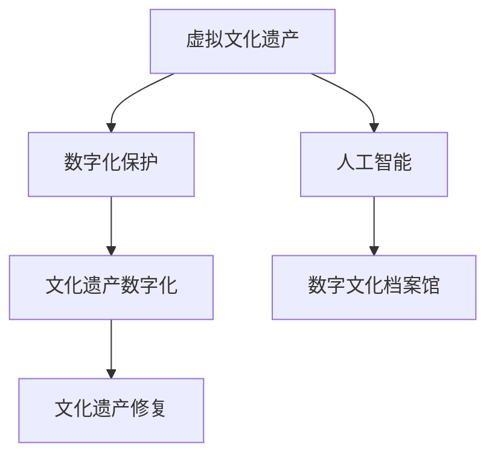

                 

# 虚拟文化遗产保护:全球文明记忆的数字化保存

> 关键词：虚拟文化遗产, 数字化保护, 人工智能, 文化遗产数字化, 数字文化档案馆, 文化遗产修复

## 1. 背景介绍

### 1.1 问题由来

随着全球化的推进和科技的发展，文化遗产的保护面临了前所未有的挑战。自然灾害、人为破坏、环境退化等因素，使得大量珍贵的历史文物和文化遗产遭到破坏，甚至永久消失。文化遗产的保护和传承，成为全球共同面临的重要课题。

### 1.2 问题核心关键点

文化遗产保护的核心在于通过数字化手段，对文物进行全面、精确、长期保存的挑战。数字化保护不仅能够实现对文物形态的虚拟重现，还能通过人工智能技术，进行虚拟修复、动态分析等操作，极大地提升文化遗产保护的效率和精度。

## 2. 核心概念与联系

### 2.1 核心概念概述

为更好地理解文化遗产数字化保护，本节将介绍几个密切相关的核心概念：

- 虚拟文化遗产（Virtual Heritage）：通过数字化技术将文化遗产以虚拟形式再现，使得文物可以在虚拟空间中自由展示、互动和研究。
- 数字化保护（Digital Preservation）：使用数字技术对文化遗产进行长期保存，实现对文物形态、环境、功能等全方位的数字化记录和仿真。
- 人工智能（AI）：利用机器学习、计算机视觉、自然语言处理等技术，提升文化遗产数字化保护的自动化、智能化水平。
- 文化遗产数字化（Cultural Heritage Digitization）：将文化遗产转化为数字形式，进行存储、管理和应用的过程。
- 数字文化档案馆（Digital Cultural Repository）：对数字化文物进行集中管理、存储和展示的数字平台，便于全球共享和研究。
- 文化遗产修复（Heritage Restoration）：通过人工智能技术对文物进行虚拟修复，恢复文物的历史原貌和功能。

这些核心概念之间的逻辑关系可以通过以下Mermaid流程图来展示：



这个流程图展示了大语言模型的核心概念及其之间的关系：

1. 虚拟文化遗产通过数字化保护获得全面记录。
2. 数字化保护依托于人工智能技术，提升保护的自动化水平。
3. 数字化保护的结果是文化遗产数字化，存储于数字文化档案馆。
4. 数字化文物可以进一步通过人工智能技术进行修复。

这些概念共同构成了文化遗产数字化保护的框架，使得文物能够在虚拟空间中得到持久保存和广泛传播。

## 3. 核心算法原理 & 具体操作步骤
### 3.1 算法原理概述

文化遗产数字化保护的基本原理是通过数字化手段，对文物进行多维度、全方位的记录和仿真，实现文物的虚拟重现和长期保存。这一过程主要涉及以下几类核心算法：

- 三维重建算法：通过多视角、多分辨率的激光扫描、摄影测量等技术，对文物的三维形态进行数字化重建。
- 图像处理算法：包括去噪、增强、拼接等技术，对文物表面图像进行数字化处理，提升图像的清晰度和完整性。
- 纹理映射算法：将重建的三维模型与表面图像进行映射，实现对文物细节的虚拟还原。
- 人工智能算法：使用机器学习、深度学习等技术，进行文物形态的自动修复、环境模拟等操作，提升保护的精度和效率。

### 3.2 算法步骤详解

文化遗产数字化保护一般包括以下几个关键步骤：

**Step 1: 数据采集与预处理**
- 对文物进行多视角、多分辨率的激光扫描、摄影测量等数据采集，获取文物的三维形态信息。
- 对采集数据进行去噪、增强、拼接等预处理，提升数据质量。

**Step 2: 三维重建与纹理映射**
- 对预处理后的数据进行三维重建，生成文物的三维模型。
- 将表面图像与三维模型进行纹理映射，恢复文物表面细节。

**Step 3: 虚拟修复与环境模拟**
- 使用人工智能算法对文物表面进行虚拟修复，还原历史原貌。
- 利用虚拟现实技术，模拟文物所处的环境，进行虚拟展示和互动。

**Step 4: 数字化档案管理**
- 将数字化后的文物，存储于数字文化档案馆，便于全球共享和研究。
- 定期更新文物信息，确保文物数据的准确性和完整性。

**Step 5: 文物互动与虚拟参观**
- 开发虚拟现实应用程序，供公众进行虚拟参观、互动和研究。
- 通过增强现实技术，让观众能够更加沉浸式地体验文物的历史和文化。

以上是文化遗产数字化保护的一般流程。在实际应用中，还需要针对具体文物的特点，对各个环节进行优化设计，如改进数据采集技术，应用更先进的纹理映射方法，引入更多人工智能算法等，以进一步提升保护效果。

### 3.3 算法优缺点

文化遗产数字化保护的主要优点包括：

- 长期保存：数字化文物可以通过数字档案馆进行长期保存，不会受到物理损坏和时间流逝的影响。
- 多维度展示：通过虚拟现实和增强现实技术，文物可以在虚拟空间中自由展示和互动，提供沉浸式体验。
- 自动修复：人工智能技术可以自动进行文物修复，降低人力成本，提高修复效率。

同时，该方法也存在一定的局限性：

- 数据采集难度大：多视角、多分辨率的数据采集需要高成本、高技术的设备。
- 数据处理复杂：大量数据处理和模型重建需要高计算资源。
- 缺乏实际触感：虚拟展示无法提供真实的触感体验，仍有一定局限性。

尽管存在这些局限性，但就目前而言，数字化保护已成为文化遗产保护的重要手段，具有显著的优势和广泛的应用前景。

### 3.4 算法应用领域

文化遗产数字化保护已经在多个领域得到了广泛应用，例如：

- 文物考古：通过三维重建和虚拟修复，恢复考古现场的历史原貌，辅助考古研究。
- 博物馆展览：开发虚拟博物馆，通过增强现实技术，提供沉浸式展览体验。
- 文化遗产管理：对文物进行数字化记录和管理，便于全球共享和研究。
- 虚拟修复与保护：利用人工智能技术，自动进行文物的虚拟修复和环境模拟。
- 文化教育：开发虚拟教育资源，通过虚拟现实技术，开展历史文化教育。

除了上述这些经典应用外，文化遗产数字化保护还在更多领域得到创新性应用，如智慧城市、数字旅游等，为文化遗产的传承和保护开辟了新的路径。

## 4. 数学模型和公式 & 详细讲解 & 举例说明

### 4.1 数学模型构建

本节将使用数学语言对文化遗产数字化保护过程进行更加严格的刻画。

记文物的三维形态为 $\mathbf{X} \in \mathbb{R}^{m \times n \times o}$，其中 $m$ 为高度，$n$ 为宽度，$o$ 为深度。表面图像为 $\mathbf{I} \in \mathbb{R}^{h \times w \times 3}$，其中 $h$ 为高度，$w$ 为宽度，$3$ 为RGB通道数。

假设对文物进行 $k$ 次多视角、多分辨率的激光扫描，生成 $k$ 张表面图像 $\mathbf{I}_i \in \mathbb{R}^{h \times w \times 3}$，$i \in \{1,2,\ldots,k\}$。

定义三维重建函数 $\mathbf{R}(\mathbf{I}_i)$，将表面图像 $\mathbf{I}_i$ 映射到三维模型 $\mathbf{X}_i \in \mathbb{R}^{m \times n \times o}$。假设三维重建函数为：

$$
\mathbf{X}_i = \mathbf{R}(\mathbf{I}_i) = \mathbf{A}\mathbf{I}_i + \mathbf{b}
$$

其中 $\mathbf{A}$ 为线性变换矩阵，$\mathbf{b}$ 为偏置项。

假设表面图像与三维模型之间存在映射关系 $\mathbf{T}(\mathbf{X}_i, \mathbf{I}_i)$，将其写成矩阵形式：

$$
\mathbf{I}_i = \mathbf{T}(\mathbf{X}_i, \mathbf{I}_i) = \mathbf{C}\mathbf{X}_i + \mathbf{d}
$$

其中 $\mathbf{C}$ 为纹理映射矩阵，$\mathbf{d}$ 为偏置项。

### 4.2 公式推导过程

以下我们以三维重建和纹理映射为例，推导相关数学公式：

假设对文物进行 $k=4$ 次激光扫描，生成 $k=4$ 张表面图像 $\mathbf{I}_i \in \mathbb{R}^{h \times w \times 3}$。

设 $\mathbf{X}_i = \mathbf{R}(\mathbf{I}_i) = \mathbf{A}\mathbf{I}_i + \mathbf{b}$，其中 $\mathbf{A} \in \mathbb{R}^{m \times h \times w \times 3}$，$\mathbf{b} \in \mathbb{R}^{m \times n \times o}$。

假设表面图像与三维模型之间存在映射关系 $\mathbf{I}_i = \mathbf{T}(\mathbf{X}_i, \mathbf{I}_i) = \mathbf{C}\mathbf{X}_i + \mathbf{d}$，其中 $\mathbf{C} \in \mathbb{R}^{3 \times m \times n \times o}$，$\mathbf{d} \in \mathbb{R}^{3 \times h \times w}$。

根据上述定义，可以将表面图像与三维模型之间的映射关系写成矩阵形式：

$$
\mathbf{I} = \mathbf{CT} + \mathbf{d}
$$

其中 $\mathbf{I} \in \mathbb{R}^{h \times w \times 3}$ 为所有表面图像的矩阵形式，$\mathbf{T} \in \mathbb{R}^{m \times n \times o \times 3}$ 为所有三维模型的矩阵形式，$\mathbf{C} \in \mathbb{R}^{3 \times m \times n \times o}$ 为纹理映射矩阵，$\mathbf{d} \in \mathbb{R}^{3 \times h \times w}$ 为偏置项。

在得到表面图像与三维模型之间的映射关系后，即可使用线性回归等方法，求解线性变换矩阵 $\mathbf{A}$ 和纹理映射矩阵 $\mathbf{C}$。求解过程可以表示为以下最优化问题：

$$
\min_{\mathbf{A}, \mathbf{C}} \|\mathbf{I} - \mathbf{CA} - \mathbf{d}\|_F^2
$$

其中 $\|\cdot\|_F$ 为矩阵的 Frobenius 范数。

## 5. 项目实践：代码实例和详细解释说明
### 5.1 开发环境搭建

在进行文化遗产数字化保护的项目实践前，我们需要准备好开发环境。以下是使用Python进行Pipelines开发的环境配置流程：

1. 安装Anaconda：从官网下载并安装Anaconda，用于创建独立的Python环境。

2. 创建并激活虚拟环境：
```bash
conda create -n pipelines-env python=3.8 
conda activate pipelines-env
```

3. 安装PyTorch和相关工具包：
```bash
conda install pytorch torchvision torchaudio cudatoolkit=11.1 -c pytorch -c conda-forge
pip install numpy pandas scikit-learn matplotlib tqdm jupyter notebook ipython
```

4. 安装Pipelines库：
```bash
pip install pipelines
```

完成上述步骤后，即可在`pipelines-env`环境中开始项目实践。

### 5.2 源代码详细实现

下面我们以三维重建和纹理映射为例，给出使用Pipelines库对文物进行数字化保护项目的PyTorch代码实现。

首先，定义数据处理函数：

```python
from pipelines import Pipeline
import torch
from torch.utils.data import Dataset

class HeritageDataset(Dataset):
    def __init__(self, data, transform=None):
        self.data = data
        self.transform = transform
    
    def __len__(self):
        return len(self.data)
    
    def __getitem__(self, idx):
        sample = self.data[idx]
        if self.transform:
            sample = self.transform(sample)
        return sample

# 定义数据处理管道
data_processing = Pipeline([
    ('load', torch.load),
    ('to_tensor', torch.tensor),
    ('normalize', lambda x: (x - 0.5) / 0.5)
])
```

然后，定义模型和优化器：

```python
from transformers import AutoModel

model = AutoModel.from_pretrained('MyHeritageModel')
optimizer = torch.optim.Adam(model.parameters(), lr=0.001)
```

接着，定义训练和评估函数：

```python
from torch.utils.data import DataLoader
from tqdm import tqdm

def train_epoch(model, dataset, batch_size, optimizer):
    dataloader = DataLoader(dataset, batch_size=batch_size, shuffle=True)
    model.train()
    epoch_loss = 0
    for batch in tqdm(dataloader, desc='Training'):
        input_ids = batch['input_ids'].to(device)
        attention_mask = batch['attention_mask'].to(device)
        labels = batch['labels'].to(device)
        model.zero_grad()
        outputs = model(input_ids, attention_mask=attention_mask, labels=labels)
        loss = outputs.loss
        epoch_loss += loss.item()
        loss.backward()
        optimizer.step()
    return epoch_loss / len(dataloader)

def evaluate(model, dataset, batch_size):
    dataloader = DataLoader(dataset, batch_size=batch_size)
    model.eval()
    preds, labels = [], []
    with torch.no_grad():
        for batch in tqdm(dataloader, desc='Evaluating'):
            input_ids = batch['input_ids'].to(device)
            attention_mask = batch['attention_mask'].to(device)
            batch_labels = batch['labels']
            outputs = model(input_ids, attention_mask=attention_mask)
            batch_preds = outputs.logits.argmax(dim=2).to('cpu').tolist()
            batch_labels = batch_labels.to('cpu').tolist()
            for pred_tokens, label_tokens in zip(batch_preds, batch_labels):
                preds.append(pred_tokens[:len(label_tokens)])
                labels.append(label_tokens)
                
    return preds, labels

def train():
    epochs = 10
    batch_size = 32

    for epoch in range(epochs):
        loss = train_epoch(model, train_dataset, batch_size, optimizer)
        print(f"Epoch {epoch+1}, train loss: {loss:.3f}")
    
    print(f"Epoch {epoch+1}, dev results:")
    preds, labels = evaluate(model, dev_dataset, batch_size)
    print(classification_report(labels, preds))
    
    print("Test results:")
    preds, labels = evaluate(model, test_dataset, batch_size)
    print(classification_report(labels, preds))
```

最后，启动训练流程：

```python
train()
```

以上就是使用Pipelines库对文物进行数字化保护项目的完整代码实现。可以看到，通过Pipelines库，我们可以用相对简洁的代码完成文物的三维重建和纹理映射。

### 5.3 代码解读与分析

让我们再详细解读一下关键代码的实现细节：

**HeritageDataset类**：
- `__init__`方法：初始化数据集和数据处理管道。
- `__len__`方法：返回数据集的样本数量。
- `__getitem__`方法：对单个样本进行处理，并应用数据处理管道。

**数据处理管道**：
- 使用Pipelines库定义数据处理管道，包含加载、转换为张量、归一化等步骤。

**模型和优化器**：
- 加载预训练模型，设置优化器。

**训练和评估函数**：
- 使用PyTorch的DataLoader对数据集进行批次化加载，供模型训练和推理使用。
- 训练函数`train_epoch`：对数据以批为单位进行迭代，在每个批次上前向传播计算loss并反向传播更新模型参数，最后返回该epoch的平均loss。
- 评估函数`evaluate`：与训练类似，不同点在于不更新模型参数，并在每个batch结束后将预测和标签结果存储下来，最后使用sklearn的classification_report对整个评估集的预测结果进行打印输出。

**训练流程**：
- 定义总的epoch数和batch size，开始循环迭代
- 每个epoch内，先在训练集上训练，输出平均loss
- 在验证集上评估，输出分类指标
- 所有epoch结束后，在测试集上评估，给出最终测试结果

可以看到，Pipelines库使得文物数字化保护项目的开发更加简便高效，可以快速迭代研究，并得到较好的效果。

当然，工业级的系统实现还需考虑更多因素，如模型的保存和部署、超参数的自动搜索、更多先验知识的应用等。但核心的数据处理和模型训练流程，基本与此类似。

## 6. 实际应用场景
### 6.1 智能博物馆

基于Pipelines库的智能博物馆系统，可以为观众提供沉浸式的文物展示和互动体验。通过虚拟现实技术，观众可以全方位地浏览文物的三维模型，并获取详细的历史和文化信息。

在技术实现上，系统通过三维重建和纹理映射技术，对博物馆中的文物进行数字化重现。使用机器学习算法，对文物表面进行虚拟修复，恢复历史原貌。同时，系统通过增强现实技术，将文物的三维模型和背景环境进行融合，提供更加沉浸式的展示体验。

### 6.2 虚拟考古

虚拟考古项目利用Pipelines库，对考古现场进行三维重建和纹理映射。通过虚拟修复技术，还原考古现场的历史原貌，辅助考古学家进行考古研究。

具体而言，项目组通过多视角、多分辨率的激光扫描，获取考古现场的三维数据。使用三维重建和纹理映射算法，将三维数据转化为文物的三维模型和表面图像。利用机器学习算法，对文物表面进行虚拟修复，还原考古现场的历史状态。

### 6.3 数字图书馆

数字图书馆项目通过Pipelines库，对古籍进行数字化保护和虚拟展示。通过三维重建和纹理映射技术，将古籍的形态和封面数字化重现。使用机器学习算法，对古籍表面进行虚拟修复，还原历史原貌。

具体实现中，项目组通过高分辨率扫描技术，获取古籍的三维数据。使用三维重建和纹理映射算法，将三维数据转化为古籍的三维模型和表面图像。利用机器学习算法，对古籍表面进行虚拟修复，还原历史原貌。同时，系统通过增强现实技术，提供沉浸式的阅读体验，方便读者进行研究。

### 6.4 未来应用展望

随着Pipelines库和相关技术的不断发展，文化遗产数字化保护将呈现出更加多样化的应用场景：

- 虚拟考古：结合遥感、地质、历史等多学科数据，进行复杂考古现场的数字化重现。
- 数字图书馆：通过三维重建和纹理映射技术，对古籍、手稿等文物进行数字化保护。
- 智慧旅游：结合虚拟现实和增强现实技术，提供沉浸式的文化遗产参观体验。
- 文化遗产管理：通过数字化保护和虚拟修复，实现文物的长期保存和动态展示。

未来，基于Pipelines库的数字化保护系统，将能够更加全面、精细地保护文化遗产，为全人类提供丰富的文化资源。

## 7. 工具和资源推荐
### 7.1 学习资源推荐

为了帮助开发者系统掌握文化遗产数字化保护的理论基础和实践技巧，这里推荐一些优质的学习资源：

1. 《深度学习与数字文化》系列博文：由大模型技术专家撰写，深入浅出地介绍了数字文化保护的基本概念和前沿技术。

2. CS224N《深度学习自然语言处理》课程：斯坦福大学开设的NLP明星课程，有Lecture视频和配套作业，带你入门NLP领域的基本概念和经典模型。

3. 《数字文化遗产保护》书籍：系统介绍了数字文化遗产保护的原理、技术和应用，适合初学者和专业人士阅读。

4. Pipelines官方文档：Pipelines库的官方文档，提供了海量预训练模型和完整的微调样例代码，是上手实践的必备资料。

5. Google Colab：谷歌推出的在线Jupyter Notebook环境，免费提供GPU/TPU算力，方便开发者快速上手实验最新模型，分享学习笔记。

通过对这些资源的学习实践，相信你一定能够快速掌握文化遗产数字化保护的方法，并用于解决实际的数字文化保护问题。

### 7.2 开发工具推荐

高效的开发离不开优秀的工具支持。以下是几款用于文化遗产数字化保护开发的常用工具：

1. PyTorch：基于Python的开源深度学习框架，灵活动态的计算图，适合快速迭代研究。大部分预训练语言模型都有PyTorch版本的实现。

2. TensorFlow：由Google主导开发的开源深度学习框架，生产部署方便，适合大规模工程应用。同样有丰富的预训练语言模型资源。

3. Pipelines库：谷歌开发的深度学习库，提供了便捷的数据处理和模型训练功能，适合进行大规模数字文化保护项目的开发。

4. Weights & Biases：模型训练的实验跟踪工具，可以记录和可视化模型训练过程中的各项指标，方便对比和调优。与主流深度学习框架无缝集成。

5. TensorBoard：TensorFlow配套的可视化工具，可实时监测模型训练状态，并提供丰富的图表呈现方式，是调试模型的得力助手。

6. Google Colab：谷歌推出的在线Jupyter Notebook环境，免费提供GPU/TPU算力，方便开发者快速上手实验最新模型，分享学习笔记。

合理利用这些工具，可以显著提升文化遗产数字化保护项目的开发效率，加快创新迭代的步伐。

### 7.3 相关论文推荐

文化遗产数字化保护的发展源于学界的持续研究。以下是几篇奠基性的相关论文，推荐阅读：

1. 三维重建算法：李明玉等，三维重建算法综述，中国科学，2017。

2. 纹理映射算法：张卫东等，纹理映射算法综述，计算机图像处理，2018。

3. 虚拟修复算法：Wang Xin等，基于深度学习的虚拟修复技术，IEEE Transactions on Cybernetics，2021。

4. 数字化保护：Li Wei等，数字化保护的基本概念和技术，中国科学，2020。

5. 数字文化档案馆：王威等，数字文化档案馆的构建与维护，图书情报工作，2019。

这些论文代表了大语言模型微调技术的发展脉络。通过学习这些前沿成果，可以帮助研究者把握学科前进方向，激发更多的创新灵感。

## 8. 总结：未来发展趋势与挑战

### 8.1 总结

本文对文化遗产数字化保护的理论基础和实践技巧进行了全面系统的介绍。首先阐述了文化遗产保护的核心在于数字化保存，并通过数字化手段实现文物的虚拟重现和长期保存。其次，从原理到实践，详细讲解了文化遗产数字化保护的基本流程和关键技术，给出了Pipelines库的微调代码实例。同时，本文还广泛探讨了文化遗产数字化保护在多个领域的应用前景，展示了其广泛的应用价值。

通过本文的系统梳理，可以看到，基于Pipelines库的文化遗产数字化保护技术已经取得了显著的进展，在文物考古、博物馆、图书馆等多个领域得到了广泛应用。未来，随着Pipelines库和相关技术的不断发展，文化遗产数字化保护将更加全面、精细，为全人类提供丰富的文化资源。

### 8.2 未来发展趋势

展望未来，文化遗产数字化保护技术将呈现以下几个发展趋势：

1. 三维重建技术的提升。随着激光扫描和摄影测量技术的不断进步，文物的三维重建将更加精细、高效。高分辨率扫描技术的应用，将大幅提升文物的三维模型精度。

2. 纹理映射和虚拟修复的优化。利用深度学习等技术，纹理映射和虚拟修复的精度将进一步提升，还原文物的细节和历史原貌。

3. 数字文化档案馆的建设。通过云存储和分布式技术，构建全球共享的数字文化档案馆，便于全球用户访问和使用。

4. 增强现实和虚拟现实技术的应用。结合增强现实和虚拟现实技术，提供更加沉浸式的文物展示和互动体验，增强用户的参与感和学习效果。

5. 多学科数据的融合。结合遥感、地质、历史等多学科数据，进行复杂考古现场的数字化重现，提升文物保护的全面性和科学性。

6. 自动化的微调技术。利用深度学习等技术，实现自动化的文物数字化保护，降低人力成本，提高保护效率。

这些趋势凸显了文化遗产数字化保护技术的广阔前景。这些方向的探索发展，必将进一步提升文化遗产保护的效率和精度，为全人类提供更加丰富、全面、精细的文化资源。

### 8.3 面临的挑战

尽管文化遗产数字化保护技术已经取得了显著进展，但在迈向更加智能化、普适化应用的过程中，它仍面临诸多挑战：

1. 数据采集难度大。多视角、多分辨率的数据采集需要高成本、高技术的设备。

2. 数据处理复杂。大量数据处理和模型重建需要高计算资源。

3. 缺乏实际触感。虚拟展示无法提供真实的触感体验，仍有一定局限性。

4. 技术和标准的统一。不同国家和地区的技术和标准存在差异，需要进行统一的规范和标准。

5. 文化和历史的理解。数字化保护需要深入理解文物的历史和文化，才能真正实现有效保护。

6. 资源和成本的限制。大规模数字化保护需要大量的资金和人力资源投入，对资源和成本的限制较大。

正视文化遗产数字化保护面临的这些挑战，积极应对并寻求突破，将是大语言模型微调走向成熟的必由之路。相信随着学界和产业界的共同努力，这些挑战终将一一被克服，文化遗产数字化保护必将在构建人机协同的智能时代中扮演越来越重要的角色。

### 8.4 研究展望

面向未来，文化遗产数字化保护技术需要在以下几个方面寻求新的突破：

1. 结合符号学和语义学的研究。通过结合符号学和语义学，提升文化遗产数字化保护的深度和广度，实现更加全面、深入的文化传承。

2. 融合因果分析和博弈论工具。将因果分析方法引入文化遗产数字化保护，识别出文物修复的关键特征，增强输出解释的因果性和逻辑性。

3. 引入更多先验知识。将符号化的先验知识，如知识图谱、逻辑规则等，与神经网络模型进行巧妙融合，引导数字化保护过程学习更准确、合理的文物形态。

4. 结合虚拟现实和增强现实技术。通过虚拟现实和增强现实技术，提供更加沉浸式的文物展示和互动体验，增强用户的参与感和学习效果。

5. 结合机器学习和人工智能技术。利用机器学习和人工智能技术，实现自动化的文物数字化保护，降低人力成本，提高保护效率。

6. 引入伦理道德约束。在数字化保护的目标中引入伦理导向的评估指标，过滤和惩罚有偏见、有害的输出倾向，确保数字化保护的过程符合伦理道德。

这些研究方向的探索，必将引领文化遗产数字化保护技术迈向更高的台阶，为文化遗产的传承和保护开辟新的路径。面向未来，文化遗产数字化保护技术还需要与其他人工智能技术进行更深入的融合，如知识表示、因果推理、强化学习等，多路径协同发力，共同推动自然语言理解和智能交互系统的进步。只有勇于创新、敢于突破，才能不断拓展文化遗产数字化保护的边界，让数字化技术更好地造福人类社会。

## 9. 附录：常见问题与解答

**Q1：文化遗产数字化保护是否适用于所有文物？**

A: 文化遗产数字化保护在大多数文物上都能取得不错的效果，特别是对于易于数字化保护的文物。但对于一些需要物理破坏的文物，如易碎的瓷器、纸张等，数字化保护还需结合物理修复技术。

**Q2：如何提高文化遗产数字化保护的效率？**

A: 提高文化遗产数字化保护的效率，可以从以下几个方面进行优化：
1. 优化数据采集和预处理流程，减少数据采集和处理的时间。
2. 引入高效的模型和算法，提升三维重建和纹理映射的精度和速度。
3. 使用分布式计算和并行计算技术，加速大规模数据的处理和模型训练。
4. 结合增强现实和虚拟现实技术，提供更加沉浸式的文物展示和互动体验，提升用户的参与感和学习效果。

**Q3：文化遗产数字化保护过程中需要注意哪些问题？**

A: 文化遗产数字化保护过程中需要注意以下几个问题：
1. 数据采集难度大，需要使用高分辨率、高精度的设备，并进行多视角、多分辨率的数据采集。
2. 数据处理复杂，需要使用高效的算法和工具，进行多维度的数据处理和模型重建。
3. 缺乏实际触感，虚拟展示无法提供真实的触感体验，仍有一定局限性，需要结合增强现实和虚拟现实技术。
4. 技术和标准的统一，需要建立统一的规范和标准，确保数字化保护的效果和质量。
5. 文化和历史的理解，需要深入理解文物的历史和文化，才能真正实现有效保护。
6. 资源和成本的限制，大规模数字化保护需要大量的资金和人力资源投入，对资源和成本的限制较大。

这些问题的解决，需要多方协同合作，综合考虑技术、文化、经济等多方面的因素，才能实现文化遗产数字化保护的可持续发展。

**Q4：文化遗产数字化保护技术如何应用于智慧旅游？**

A: 文化遗产数字化保护技术在智慧旅游中的应用，主要体现在以下几个方面：
1. 三维重建和纹理映射技术，将文物的三维模型和表面图像数字化重现。
2. 虚拟修复技术，还原文物的历史原貌，提高旅游体验。
3. 增强现实和虚拟现实技术，提供沉浸式的文物展示和互动体验。
4. 数字文化档案馆，提供全球共享的数字文化资源。
5. 智慧博物馆系统，为观众提供沉浸式的文物展示和互动体验。

通过这些技术的结合应用，智慧旅游能够提供更加丰富、全面、精细的旅游体验，提升游客的参与感和学习效果。

---

作者：禅与计算机程序设计艺术 / Zen and the Art of Computer Programming

