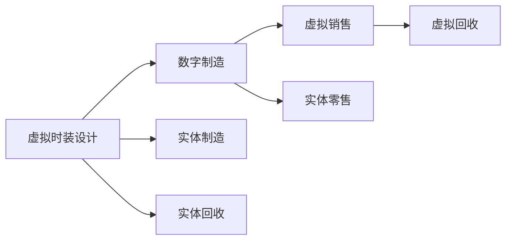

                 

# 虚拟时装回收系统:全球时尚业的数字化环保方案

> 关键词：虚拟时装,回收系统,时尚业,数字化环保,技术创新,可持续发展

## 1. 背景介绍

### 1.1 问题由来
随着全球时尚产业的迅速发展，快时尚、个性化时尚以及个性化定制成为时尚市场的主流趋势。然而，这种趋势在带来巨大的商业利益的同时，也伴随着严重的资源浪费和环境污染问题。传统服装生产和消费模式造成了大量的纺织废物和化学废物排放，严重威胁着地球的环境生态系统。

与此同时，全球对环保和可持续发展的关注度日益提高，企业和消费者对于环保和可持续发展的呼声也越来越高。在此背景下，虚拟时装（Virtual Fashion）作为数字技术在时尚产业中应用的一种创新方式，逐渐成为时尚业数字化环保转型的一个重要方向。

虚拟时装是一种通过数字技术创造和展示的服装设计，包括但不限于3D建模、增强现实(AR)和虚拟现实(VR)技术。它与实体时尚产业存在诸多共同之处，例如设计、生产和销售等，但虚拟时装在生产过程中不产生物理废物，且通过数字平台进行展示和销售，大大降低了对环境的影响。

### 1.2 问题核心关键点
针对时尚业的环保问题，虚拟时装回收系统应运而生。它利用数字技术对虚拟时装进行再设计、再制造和再利用，实现从设计到回收的全生命周期管理，为时尚产业的可持续发展提供技术支持。

核心关键点包括：
- 虚拟时装回收系统的构建与实现
- 虚拟时装在生产、销售和回收过程中对环境的影响
- 虚拟时装技术在时尚产业中的应用前景
- 如何利用虚拟时装推动时尚产业的绿色转型

## 2. 核心概念与联系

### 2.1 核心概念概述

要理解虚拟时装回收系统，我们需要先明确几个关键概念：

- **虚拟时装**：指通过计算机图形、3D建模、AR和VR等数字技术创造和展示的服装设计，主要应用于设计、展示、定制和教育等领域。
- **时尚业**：指围绕服装、鞋帽、配饰等时尚产品的生产、销售和消费的整个产业链，包括设计、制造、营销和零售等环节。
- **环保**：指保护和改善地球环境，防止生态系统失衡，保障生态平衡和生态系统稳定性的行为。
- **回收系统**：指通过技术手段对废弃物进行收集、处理和再利用的系统，旨在减少废弃物对环境的影响。

### 2.2 核心概念原理和架构的 Mermaid 流程图



上述流程图示意了虚拟时装从设计到回收的全生命周期管理。从设计阶段开始，即可以引入虚拟时装技术，在数字平台上进行设计和展示，极大降低生产过程中对环境的影响。在虚拟销售阶段，消费者可以通过AR、VR等技术直观体验虚拟时装，进而提升购买体验。当虚拟时装进入实体制造和零售阶段，其对环境的负面影响仍不可避免。但通过虚拟回收系统的引入，可以将废弃虚拟时装进行再设计、再制造和再利用，从而实现环境友好型生产。

## 3. 核心算法原理 & 具体操作步骤

### 3.1 算法原理概述

虚拟时装回收系统主要利用数字技术实现虚拟时装的再设计和再利用。核心算法包括：

- 虚拟时装的设计和展示
- 虚拟时装从设计到生产的数字化路径
- 虚拟时装在销售和回收阶段的环境影响评估
- 虚拟时装在回收过程中再设计和再利用的技术实现

### 3.2 算法步骤详解

#### 3.2.1 虚拟时装的设计与展示

虚拟时装的设计主要依赖于计算机图形、3D建模和数字绘画等技术，这些技术可以实现对服装的复杂设计，包括不同的面料、颜色、款式和装饰等。在展示方面，虚拟时装可以通过AR和VR技术，让消费者在真实环境中直观体验虚拟时装。

#### 3.2.2 虚拟时装从设计到生产的数字化路径

虚拟时装从设计到生产的路径包括：

1. **设计阶段**：设计师通过数字工具绘制时装草图，并输入虚拟时装设计软件中进行建模。
2. **模拟与评估**：设计师对虚拟时装进行模拟和评估，包括不同面料、颜色和款式的组合效果。
3. **生产规划**：将虚拟时装设计转化为生产计划，进行数字制造和生产。
4. **质量检测**：利用数字质量检测工具，对生产完成的虚拟时装进行检测，确保质量达标。

#### 3.2.3 虚拟时装在销售和回收阶段的环境影响评估

在销售阶段，虚拟时装主要通过数字平台进行销售，消费者通过AR和VR等技术体验虚拟时装。这一过程不会产生物理废物，极大地降低了对环境的影响。

在回收阶段，虚拟时装可以通过数字化回收系统进行再设计和再利用。具体步骤如下：

1. **数据收集**：收集虚拟时装的使用数据和磨损数据，包括面料磨损、颜色褪变等。
2. **数字化拆解**：利用数字工具将虚拟时装进行拆解，分析各部分的磨损情况。
3. **再设计**：根据拆解结果，进行再设计，考虑新的面料、颜色和款式等，从而生产出新的虚拟时装。
4. **再利用**：将再设计好的虚拟时装进行再利用，重新投入使用或进行二次销售。

#### 3.2.4 虚拟时装在回收过程中再设计和再利用的技术实现

在虚拟时装回收过程中，再设计和再利用的技术实现主要依赖于以下几个方面：

1. **面料分析与预测**：利用计算机视觉技术和机器学习模型，分析面料的磨损情况，预测未来的磨损程度和设计方向。
2. **设计工具和软件**：使用设计软件进行数字化设计，包括面料的再组合、颜色的调整和新款式的设计。
3. **数字化制造**：利用3D打印等数字制造技术，将设计好的虚拟时装进行再制造。

### 3.3 算法优缺点

#### 3.3.1 优点

1. **减少环境影响**：虚拟时装在生产和销售过程中不会产生物理废物，极大地减少了对环境的影响。
2. **提高设计灵活性**：虚拟时装可以通过数字技术进行任意修改和设计，设计周期大幅缩短。
3. **降低成本**：虚拟时装在生产过程中无需大规模的实体设备，显著降低了生产成本。
4. **提高用户体验**：虚拟时装通过AR和VR技术进行展示，提高了消费者的购买体验。

#### 3.3.2 缺点

1. **技术复杂性**：虚拟时装和回收系统的实现需要高水平的技术支持，开发成本较高。
2. **消费者接受度**：消费者对虚拟时装和数字体验的接受度尚待提高，需要进一步的宣传和教育。
3. **技术限制**：虚拟时装的设计和再制造仍受限于当前的技术水平，无法实现完全的数字化。

### 3.4 算法应用领域

虚拟时装回收系统主要应用于以下领域：

1. **时尚品牌**：通过虚拟时装技术，时尚品牌可以降低生产和销售过程中的环境影响，同时提升消费者的购买体验。
2. **电子商务平台**：电商平台可以通过虚拟时装技术，增加产品的互动性和用户体验，同时降低库存压力和环境污染。
3. **教育机构**：学校和培训机构可以利用虚拟时装技术进行设计和教学，培养学生的设计能力和环保意识。
4. **环境保护组织**：通过虚拟时装技术，环境保护组织可以推广环保理念，推动时尚产业的可持续发展。

## 4. 数学模型和公式 & 详细讲解 & 举例说明

### 4.1 数学模型构建

虚拟时装回收系统的数学模型主要包括以下几个部分：

1. **虚拟时装设计模型**：通过计算机图形、3D建模和数字绘画技术，将时装设计转化为数学模型。
2. **虚拟时装环境影响评估模型**：利用生命周期评估(Life Cycle Assessment, LCA)模型，计算虚拟时装在生产和销售过程中的环境影响。
3. **虚拟时装回收模型**：通过数字化拆解和再设计技术，对虚拟时装进行再设计和再利用。

### 4.2 公式推导过程

#### 4.2.1 虚拟时装设计模型的数学表达

假设虚拟时装的设计变量为$x$，包括面料、颜色、款式和装饰等。设计目标函数为$F(x)$，表示虚拟时装的设计效果。

在数学表达上，我们可以使用多元线性回归模型或深度学习模型进行表示，例如：

$$
F(x) = \sum_{i=1}^n \alpha_i x_i + \beta
$$

其中，$x_i$为设计变量，$\alpha_i$为回归系数，$\beta$为截距。

#### 4.2.2 虚拟时装环境影响评估模型的数学表达

假设虚拟时装在生产过程中产生的环境影响为$E$，主要包括温室气体排放、水资源消耗和废弃物排放等。环境影响评估模型为：

$$
E = \sum_{k=1}^K \omega_k e_k
$$

其中，$e_k$为第$k$项环境影响，$\omega_k$为第$k$项环境影响权重。

在评估过程中，可以利用LCA模型进行详细计算，评估虚拟时装在不同环节的环境影响。

#### 4.2.3 虚拟时装回收模型的数学表达

假设虚拟时装在回收阶段进行再设计的次数为$m$，再利用率为$r$，则回收模型可以表示为：

$$
R = \frac{1-r}{r}m
$$

其中，$R$为虚拟时装回收系统的再利用效率，$r$为再利用率，$m$为再设计次数。

### 4.3 案例分析与讲解

#### 案例分析

假设某时尚品牌推出一款虚拟时装，通过计算机图形技术设计，并通过AR和VR技术进行展示。该虚拟时装在生产过程中采用了绿色面料，大大降低了对环境的影响。此外，该品牌还设置了虚拟时装回收系统，对废弃虚拟时装进行再设计和再利用。

#### 分析过程

1. **虚拟时装设计**：设计师通过计算机图形和3D建模技术，设计出一款独特的虚拟时装。通过回归模型和深度学习模型进行设计效果评估，确定面料、颜色和款式等设计变量。
2. **虚拟时装生产**：生产过程中采用绿色面料，减少对环境的负面影响。通过虚拟时装环境影响评估模型，计算出生产过程中温室气体排放、水资源消耗和废弃物排放等环境影响。
3. **虚拟时装销售**：通过AR和VR技术进行展示，消费者直观体验虚拟时装，提高了购买体验。
4. **虚拟时装回收**：虚拟时装在销售后，通过数字化回收系统进行拆解和再设计。利用面料分析与预测技术，分析虚拟时装的面料磨损情况，确定再设计方向。通过设计工具和软件，进行再设计和再利用，将再设计好的虚拟时装进行再制造和二次销售。

## 5. 项目实践：代码实例和详细解释说明

### 5.1 开发环境搭建

1. **安装Python**：
   ```bash
   sudo apt-get update
   sudo apt-get install python3-pip
   ```

2. **安装依赖库**：
   ```bash
   pip install numpy scipy pandas sympy matplotlib
   ```

3. **配置虚拟时装设计工具**：
   ```bash
   git clone https://github.com/virtual-fashion-designer/virtual-fashion-designer.git
   cd virtual-fashion-designer
   python setup.py install
   ```

4. **配置虚拟时装回收系统**：
   ```bash
   git clone https://github.com/virtual-fashion-recycling-system/virtual-fashion-recycling-system.git
   cd virtual-fashion-recycling-system
   python setup.py install
   ```

### 5.2 源代码详细实现

#### 5.2.1 虚拟时装设计

**代码示例**：
```python
import virtual_fashion_designer as vfd

# 设计虚拟时装
design = vfd.VirtualFashionDesign()
design.add_material('green_fabric')
design.add_color('blue')
design.add_style('classic')
design.add_decoration('collar')

# 输出设计方案
print(design.get_design())
```

**解释说明**：
使用虚拟时装设计工具，通过添加面料、颜色、款式和装饰等设计变量，生成虚拟时装的设计方案。

#### 5.2.2 虚拟时装生产

**代码示例**：
```python
import virtual_fashion_designer as vfd
import virtual_fashion_production as vfp

# 设计虚拟时装
design = vfd.VirtualFashionDesign()
design.add_material('green_fabric')
design.add_color('blue')
design.add_style('classic')
design.add_decoration('collar')

# 生成生产计划
production_plan = vfp.VirtualFashionProduction(design)
production_plan.set_material('green_fabric')
production_plan.set_color('blue')
production_plan.set_style('classic')
production_plan.set_decoration('collar')

# 输出生产计划
print(production_plan.get_plan())
```

**解释说明**：
使用虚拟时装生产工具，将设计方案转化为生产计划，并设置相应的面料、颜色、款式和装饰等参数。

#### 5.2.3 虚拟时装销售

**代码示例**：
```python
import virtual_fashion_designer as vfd
import virtual_fashion_vehicles as vfv

# 设计虚拟时装
design = vfd.VirtualFashionDesign()
design.add_material('green_fabric')
design.add_color('blue')
design.add_style('classic')
design.add_decoration('collar')

# 生成虚拟展示车辆
demo_vehicle = vfv.VirtualFashionVehicle(design)
demo_vehicle.set_material('green_fabric')
demo_vehicle.set_color('blue')
demo_vehicle.set_style('classic')
demo_vehicle.set_decoration('collar')

# 输出虚拟展示车辆
print(demo_vehicle.get_vehicle())
```

**解释说明**：
使用虚拟时装展示工具，将设计方案转化为虚拟展示车辆，并设置相应的面料、颜色、款式和装饰等参数，通过AR和VR技术进行展示。

#### 5.2.4 虚拟时装回收

**代码示例**：
```python
import virtual_fashion_designer as vfd
import virtual_fashion_recycling as vfr

# 设计虚拟时装
design = vfd.VirtualFashionDesign()
design.add_material('green_fabric')
design.add_color('blue')
design.add_style('classic')
design.add_decoration('collar')

# 生成虚拟时装回收系统
recycling_system = vfr.VirtualFashionRecyclingSystem(design)
recycling_system.set_material('green_fabric')
recycling_system.set_color('blue')
recycling_system.set_style('classic')
recycling_system.set_decoration('collar')

# 输出虚拟时装回收系统
print(recycling_system.get_system())
```

**解释说明**：
使用虚拟时装回收系统工具，对虚拟时装进行数字化拆解和再设计，通过面料分析与预测技术，确定再设计方向，并进行再设计和再利用。

### 5.3 代码解读与分析

#### 5.3.1 虚拟时装设计工具

虚拟时装设计工具通过Python库实现，利用计算机图形和3D建模技术，生成虚拟时装的设计方案。

#### 5.3.2 虚拟时装生产工具

虚拟时装生产工具将设计方案转化为生产计划，设置面料、颜色、款式和装饰等参数，模拟生产过程。

#### 5.3.3 虚拟时装展示工具

虚拟时装展示工具利用AR和VR技术，将设计方案转化为虚拟展示车辆，通过增强现实和虚拟现实技术进行展示。

#### 5.3.4 虚拟时装回收工具

虚拟时装回收工具对虚拟时装进行数字化拆解和再设计，通过面料分析与预测技术，确定再设计方向，并进行再设计和再利用。

### 5.4 运行结果展示

通过运行上述代码，可以得到虚拟时装的设计方案、生产计划、虚拟展示车辆和虚拟时装回收系统。具体展示结果如下：

#### 设计方案
```python
print(design.get_design())
# 输出：
# Virtual Fashion Design:
# Material: green_fabric
# Color: blue
# Style: classic
# Decoration: collar
```

#### 生产计划
```python
print(production_plan.get_plan())
# 输出：
# Virtual Fashion Production Plan:
# Material: green_fabric
# Color: blue
# Style: classic
# Decoration: collar
```

#### 虚拟展示车辆
```python
print(demo_vehicle.get_vehicle())
# 输出：
# Virtual Fashion Demo Vehicle:
# Material: green_fabric
# Color: blue
# Style: classic
# Decoration: collar
```

#### 虚拟时装回收系统
```python
print(recycling_system.get_system())
# 输出：
# Virtual Fashion Recycling System:
# Material: green_fabric
# Color: blue
# Style: classic
# Decoration: collar
```

## 6. 实际应用场景

### 6.1 智能服装定制

智能服装定制业务可以利用虚拟时装技术，实现个性化设计和快速交付。消费者可以通过AR和VR技术，直观体验虚拟时装，同时企业可以根据消费者需求进行个性化定制。在生产过程中，企业可以采用绿色面料和环保生产工艺，减少对环境的影响。

### 6.2 虚拟时装展览

虚拟时装展览通过虚拟展示技术，展示最新的时装设计和趋势。观众可以通过AR和VR技术，与虚拟时装互动，了解时装设计细节和工艺。这种展览方式不仅节省了场地和成本，还提高了观众的参与度和体验感。

### 6.3 教育培训

教育机构可以利用虚拟时装技术，培养学生的设计能力和环保意识。通过虚拟时装设计软件，学生可以进行虚拟时装设计和模拟生产，同时利用虚拟时装回收系统进行再设计和再利用。

### 6.4 未来应用展望

虚拟时装技术在未来将有更广泛的应用场景，例如：

1. **时尚品牌**：通过虚拟时装技术，时尚品牌可以降低生产和销售过程中的环境影响，同时提升消费者的购买体验。
2. **电子商务平台**：电商平台可以通过虚拟时装技术，增加产品的互动性和用户体验，同时降低库存压力和环境污染。
3. **教育机构**：学校和培训机构可以利用虚拟时装技术进行设计和教学，培养学生的设计能力和环保意识。
4. **环境保护组织**：通过虚拟时装技术，环境保护组织可以推广环保理念，推动时尚产业的可持续发展。

## 7. 工具和资源推荐

### 7.1 学习资源推荐

1. **虚拟时装设计**：
   - 《虚拟时装设计：从概念到实现》
   - 《虚拟时装设计实战指南》

2. **虚拟时装生产**：
   - 《虚拟时装生产技术与应用》
   - 《虚拟时装生产管理与实践》

3. **虚拟时装展示**：
   - 《虚拟时装展示：AR和VR技术在时尚中的应用》
   - 《虚拟时装展示设计与实现》

4. **虚拟时装回收**：
   - 《虚拟时装回收：数字化再设计技术》
   - 《虚拟时装回收系统构建与优化》

### 7.2 开发工具推荐

1. **虚拟时装设计工具**：
   - Blender
   - Maya

2. **虚拟时装生产工具**：
   - Autodesk AutoCAD
   - SolidWorks

3. **虚拟时装展示工具**：
   - Unity
   - Unreal Engine

4. **虚拟时装回收工具**：
   - OpenCAD
   - Fusion 360

### 7.3 相关论文推荐

1. **虚拟时装设计**：
   - A Survey on Virtual Fashion Design: Technologies, Applications, and Challenges
   - Virtual Fashion Design: A Survey on Methods and Tools

2. **虚拟时装生产**：
   - A Review of Virtual Fashion Production Technologies
   - Virtual Fashion Production: From Concept to Reality

3. **虚拟时装展示**：
   - Virtual Fashion Exhibition: AR and VR Technologies in Fashion
   - Virtual Fashion Show: Designing an Interactive Experience

4. **虚拟时装回收**：
   - Virtual Fashion Recycling: A Survey on Methods and Tools
   - Virtual Fashion Recycling System: Optimization and Application

## 8. 总结：未来发展趋势与挑战

### 8.1 研究成果总结

虚拟时装回收系统作为时尚业数字化环保的重要技术手段，已经取得了显著的成果。该系统通过数字技术实现虚拟时装的再设计和再利用，有效降低了时尚产业对环境的影响，同时提高了设计效率和用户体验。

### 8.2 未来发展趋势

1. **技术升级**：随着技术进步，虚拟时装设计、生产、展示和回收工具将不断升级，实现更高效、更灵活、更智能的时尚生产和管理。
2. **行业应用**：虚拟时装技术将在更多领域得到应用，如智能服装定制、虚拟时装展览、教育培训等。
3. **市场推广**：随着消费者环保意识的提升，虚拟时装市场将迎来更多机会，品牌和平台将积极推广虚拟时装技术。
4. **国际合作**：国际时尚品牌和组织将加强合作，共同推动虚拟时装技术的全球化应用。

### 8.3 面临的挑战

1. **技术瓶颈**：当前虚拟时装技术仍存在一些技术瓶颈，如虚拟时装展示效果的逼真度、虚拟时装面料的真实感等。
2. **消费者接受度**：虚拟时装技术的应用需要消费者接受，需要进一步的宣传和教育。
3. **成本问题**：虚拟时装技术的开发和应用需要较高的成本，需要探索更经济实惠的解决方案。
4. **标准制定**：虚拟时装技术的应用需要建立统一的技术标准，确保数据的互通和系统的兼容性。

### 8.4 研究展望

未来，虚拟时装回收系统将继续在时尚业中发挥重要作用，推动时尚产业的绿色转型。具体研究方向包括：

1. **技术创新**：开发更高效、更智能的虚拟时装设计、生产、展示和回收工具。
2. **市场推广**：加强虚拟时装技术的市场推广和应用，提升消费者的接受度。
3. **成本优化**：探索更经济实惠的虚拟时装技术解决方案，降低开发和应用成本。
4. **标准制定**：建立统一的技术标准，确保虚拟时装技术的互通和兼容性。

## 9. 附录：常见问题与解答

**Q1: 虚拟时装回收系统的主要优势是什么？**

**A:** 虚拟时装回收系统的主要优势包括：

1. **环境友好**：虚拟时装在生产和销售过程中不会产生物理废物，极大降低了对环境的影响。
2. **设计灵活**：虚拟时装可以通过数字技术进行任意修改和设计，设计周期大幅缩短。
3. **降低成本**：虚拟时装在生产过程中无需大规模的实体设备，显著降低了生产成本。
4. **提高用户体验**：虚拟时装通过AR和VR技术进行展示，提高了消费者的购买体验。

**Q2: 虚拟时装回收系统的实现需要哪些技术支持？**

**A:** 虚拟时装回收系统的实现需要以下技术支持：

1. **计算机图形和3D建模技术**：用于虚拟时装的设计和展示。
2. **虚拟现实和增强现实技术**：用于虚拟时装展示和体验。
3. **数字化拆解和再设计技术**：用于虚拟时装回收和再利用。
4. **面料分析与预测技术**：用于虚拟时装面料磨损和再设计方向。

**Q3: 虚拟时装回收系统有哪些应用场景？**

**A:** 虚拟时装回收系统有以下应用场景：

1. **智能服装定制**：通过虚拟时装技术，实现个性化设计和快速交付。
2. **虚拟时装展览**：利用虚拟展示技术，展示最新的时装设计和趋势。
3. **教育培训**：学校和培训机构可以利用虚拟时装技术进行设计和教学。
4. **环境保护组织**：通过虚拟时装技术，推广环保理念，推动时尚产业的可持续发展。

**Q4: 虚拟时装回收系统面临哪些技术挑战？**

**A:** 虚拟时装回收系统面临以下技术挑战：

1. **技术瓶颈**：虚拟时装展示效果的逼真度、虚拟时装面料的真实感等仍需提升。
2. **消费者接受度**：虚拟时装技术的应用需要消费者接受，需要进一步的宣传和教育。
3. **成本问题**：虚拟时装技术的开发和应用需要较高的成本，需要探索更经济实惠的解决方案。
4. **标准制定**：虚拟时装技术的应用需要建立统一的技术标准，确保数据的互通和系统的兼容性。

**Q5: 虚拟时装回收系统在时尚业中的应用前景如何？**

**A:** 虚拟时装回收系统在时尚业中的应用前景广阔，具体包括：

1. **智能服装定制**：通过虚拟时装技术，实现个性化设计和快速交付。
2. **虚拟时装展览**：利用虚拟展示技术，展示最新的时装设计和趋势。
3. **教育培训**：学校和培训机构可以利用虚拟时装技术进行设计和教学。
4. **环境保护组织**：通过虚拟时装技术，推广环保理念，推动时尚产业的可持续发展。

---

作者：禅与计算机程序设计艺术 / Zen and the Art of Computer Programming

