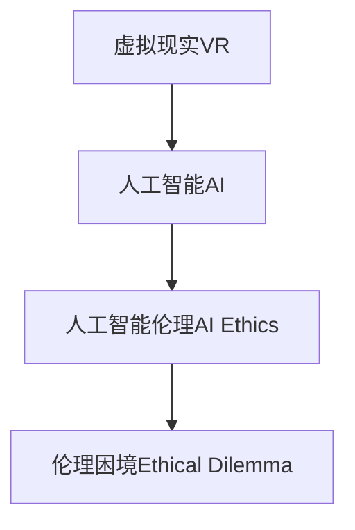

                 

# 虚拟现实中的道德困境：AI伦理探讨

## 1. 背景介绍

### 1.1 问题由来

随着虚拟现实(VR)技术的飞速发展，其在娱乐、教育、医疗等领域的应用日益广泛。然而，伴随VR技术的普及，一系列伦理问题也逐步显现。例如，VR游戏可能诱导青少年沉迷，VR培训可能导致操作失误，VR治疗可能引发心理疾病等。这些问题触及了人类社会的基本伦理原则，亟需深入探讨和有效应对。

### 1.2 问题核心关键点

VR技术的应用，其核心问题可以归纳为以下几个方面：
- 虚拟与现实：如何平衡虚拟现实与客观现实的关系，避免过度沉浸导致认知混淆和现实逃避。
- 沉浸与体验：如何提升用户体验，同时避免过度沉浸带来的认知扭曲和行为偏差。
- 隐私与安全：如何在用户隐私保护和数据安全之间取得平衡，避免数据滥用和信息泄露。
- 伦理与社会：如何在技术创新与伦理责任之间协调，确保技术的积极应用和良性发展。

这些问题不仅涉及技术实现，更关乎道德伦理和社会责任。本文将从AI伦理的角度，深入探讨VR技术应用中的道德困境，并提出相应的解决方案。

## 2. 核心概念与联系

### 2.1 核心概念概述

为更好地理解VR技术应用中的道德困境，本节将介绍几个密切相关的核心概念：

- 虚拟现实(Virtual Reality, VR)：利用计算机图形、仿真技术，创建出一个高度逼真的三维环境，使用户能够身临其境地体验虚拟世界。
- 人工智能(Artificial Intelligence, AI)：通过模拟人类智能，使计算机能够自主完成任务，包括感知、学习、推理和决策等。
- 人工智能伦理(AI Ethics)：探讨AI技术在应用过程中面临的伦理问题，如隐私保护、公正性、安全性、责任归属等。
- 伦理困境(Ethical Dilemma)：在道德原则冲突下的决策难题，如在虚拟现实场景中，如何平衡娱乐性和安全性、真实性与虚拟性之间的关系。

这些核心概念之间的逻辑关系可以通过以下Mermaid流程图来展示：



这个流程图展示了大语言模型的核心概念及其之间的关系：

1. VR技术为AI应用提供了丰富的场景和平台。
2. AI技术为VR提供强有力的数据分析和处理能力。
3. AI伦理旨在解决AI应用中的伦理问题。
4. 伦理困境是AI伦理的重要研究内容。

这些概念共同构成了VR技术应用中的伦理研究框架，为进一步探讨VR中的道德困境提供了理论基础。

## 3. 核心算法原理 & 具体操作步骤
### 3.1 算法原理概述

基于人工智能伦理的VR技术应用，其核心思想是：在虚拟现实环境中，利用AI技术进行智能推理和决策，同时遵循伦理原则，确保技术应用的安全性和责任性。具体来说，可以通过以下步骤实现：

**Step 1: 数据收集与预处理**
- 收集VR应用场景中的用户行为数据，包括点击、移动、选择等操作。
- 对数据进行清洗和标注，确保数据质量和一致性。

**Step 2: 构建AI模型**
- 设计合适的AI模型，如深度神经网络、决策树、逻辑回归等，用于预测用户行为。
- 使用监督学习算法（如分类、回归等）进行模型训练，确保模型能够有效识别和预测用户行为。

**Step 3: 伦理原则融入**
- 融入伦理原则，如隐私保护、公平性、安全性等，在模型设计和训练过程中进行约束。
- 通过增加约束条件或设计伦理目标函数，确保模型输出符合伦理标准。

**Step 4: 模型测试与评估**
- 在测试集上评估模型的性能，确保模型在未见数据上的泛化能力。
- 进行伦理评估，确保模型输出符合伦理规范，不会导致不良后果。

**Step 5: 实际应用与迭代优化**
- 将训练好的模型应用于实际VR场景中，监测用户行为。
- 根据实时反馈数据，定期调整模型参数，优化模型性能和伦理表现。

### 3.2 算法步骤详解

接下来，我们将详细讲解每个步骤的具体实现细节：

**Step 1: 数据收集与预处理**

- 通过VR设备或用户终端，收集用户在虚拟环境中的操作数据，如点击位置、移动路径、停留时间等。
- 对数据进行清洗和标注，例如去除无效数据、处理异常值、将行为转换为数字表示等。
- 使用Python或R等编程语言，将数据导入数据处理工具，如Pandas、NumPy等，进行预处理。

**Step 2: 构建AI模型**

- 设计合适的AI模型，如多层感知器(MLP)、卷积神经网络(CNN)、循环神经网络(RNN)等。
- 使用深度学习框架，如TensorFlow、PyTorch等，构建和训练模型。
- 设定训练超参数，如学习率、批大小、迭代轮数等，确保模型收敛。

**Step 3: 伦理原则融入**

- 将隐私保护、公平性、安全性等伦理原则融入模型设计中。例如，设计隐私保护机制，如差分隐私、联邦学习等。
- 在模型训练过程中，增加伦理约束条件，如约束输出结果在特定伦理范围内。
- 使用伦理目标函数，如公平性约束、安全性约束等，优化模型性能。

**Step 4: 模型测试与评估**

- 在独立测试集上评估模型性能，计算准确率、召回率、F1值等指标。
- 进行伦理评估，确保模型输出符合伦理规范，如不歧视、不泄露隐私等。
- 根据评估结果，调整模型参数和超参数，进一步优化模型性能。

**Step 5: 实际应用与迭代优化**

- 将训练好的模型部署到VR应用中，实时监测用户行为。
- 根据实时反馈数据，定期调整模型参数，优化模型性能和伦理表现。
- 持续收集用户反馈和行为数据，进行模型迭代和优化，提升用户体验和伦理表现。

### 3.3 算法优缺点

基于AI伦理的VR技术应用，其优点在于：
- 数据驱动：利用大量用户行为数据进行模型训练，确保模型的准确性和可靠性。
- 动态优化：根据实时反馈数据，持续调整模型参数，优化模型性能。
- 伦理约束：融入隐私保护、公平性等伦理原则，确保技术应用的安全性和责任性。

但该方法也存在一些局限性：
- 数据隐私：用户行为数据可能涉及隐私信息，收集和处理不当可能导致隐私泄露。
- 伦理复杂：伦理原则的融入和评估较为复杂，可能导致模型设计和训练困难。
- 高成本：数据收集和模型训练需要大量计算资源和时间，成本较高。

尽管如此，利用AI伦理对VR技术应用进行指导，仍是一种有效的解决方式，能够最大限度地确保技术的正当性和社会责任。

### 3.4 算法应用领域

基于AI伦理的VR技术应用，已在多个领域取得了显著成果。例如：

- 医疗培训：利用虚拟现实和人工智能进行医学培训，提高医生的操作技能和诊断能力。
- 教育辅助：在虚拟环境中，使用AI技术辅助教育，提升学生的学习体验和效果。
- 军事模拟：通过VR和AI模拟战争场景，进行军事训练和战术演练，提高作战能力。
- 职业培训：在虚拟环境中，使用AI技术进行职业培训，提升员工的专业技能和工作效率。

这些应用场景展示了VR技术在教育、军事、职业培训等方面的潜力，同时也暴露了其面临的伦理问题。

## 4. 数学模型和公式 & 详细讲解  
### 4.1 数学模型构建

本节将使用数学语言对基于AI伦理的VR技术应用进行更加严格的刻画。

记VR应用场景中的用户行为数据为 $D=\{(x_i,y_i)\}_{i=1}^N$，其中 $x_i$ 为行为数据，$y_i$ 为行为标签。假设构建的AI模型为 $M(x)$，其中 $x$ 为输入行为数据，$M(x)$ 为模型输出，用于预测用户行为。

定义模型 $M(x)$ 在数据样本 $(x,y)$ 上的损失函数为 $\ell(M(x),y)$，则在数据集 $D$ 上的经验风险为：

$$
\mathcal{L}(M)=\frac{1}{N}\sum_{i=1}^N \ell(M(x_i),y_i)
$$

在模型训练过程中，使用监督学习算法进行模型训练，最小化经验风险，即：

$$
\theta^*=\mathop{\arg\min}_{\theta} \mathcal{L}(M_\theta)=\mathop{\arg\min}_{\theta}\frac{1}{N}\sum_{i=1}^N \ell(M_\theta(x_i),y_i)
$$

其中 $\theta$ 为模型参数，$M_\theta(x)$ 为参数化模型输出。

### 4.2 公式推导过程

以下我们以分类任务为例，推导损失函数及其梯度的计算公式。

假设模型 $M_\theta(x)$ 在输入 $x$ 上的输出为 $\hat{y}=M_\theta(x) \in [0,1]$，表示用户行为属于正类的概率。真实标签 $y \in \{0,1\}$。则二分类交叉熵损失函数定义为：

$$
\ell(M_\theta(x),y) = -[y\log \hat{y} + (1-y)\log (1-\hat{y})]
$$

将其代入经验风险公式，得：

$$
\mathcal{L}(\theta)=\frac{1}{N}\sum_{i=1}^N [-y_i\log M_\theta(x_i)-(1-y_i)\log (1-M_\theta(x_i))]
$$

根据链式法则，损失函数对参数 $\theta_k$ 的梯度为：

$$
\frac{\partial \mathcal{L}(\theta)}{\partial \theta_k} = -\frac{1}{N}\sum_{i=1}^N [y_i\frac{\partial M_\theta(x_i)}{\partial \theta_k}-(1-y_i)\frac{\partial (1-M_\theta(x_i))}{\partial \theta_k}]
$$

其中 $\frac{\partial M_\theta(x_i)}{\partial \theta_k}$ 为模型输出对参数 $\theta_k$ 的梯度，可通过反向传播算法高效计算。

在得到损失函数的梯度后，即可带入优化算法，进行模型训练。重复上述过程直至收敛，最终得到适应伦理规范的优化模型 $\theta^*$。

## 5. 项目实践：代码实例和详细解释说明
### 5.1 开发环境搭建

在进行VR技术应用中的AI伦理探讨时，我们需要准备好开发环境。以下是使用Python进行TensorFlow开发的环境配置流程：

1. 安装Anaconda：从官网下载并安装Anaconda，用于创建独立的Python环境。

2. 创建并激活虚拟环境：
```bash
conda create -n tf-env python=3.8 
conda activate tf-env
```

3. 安装TensorFlow：根据CUDA版本，从官网获取对应的安装命令。例如：
```bash
pip install tensorflow
```

4. 安装各类工具包：
```bash
pip install numpy pandas scikit-learn matplotlib tqdm jupyter notebook ipython
```

完成上述步骤后，即可在`tf-env`环境中开始VR技术应用的AI伦理探讨实践。

### 5.2 源代码详细实现

这里我们以基于AI伦理的VR应用场景为例，给出使用TensorFlow构建分类模型的PyTorch代码实现。

首先，定义VR场景中的行为数据处理函数：

```python
import tensorflow as tf
from tensorflow.keras.datasets import mnist
from tensorflow.keras.models import Sequential
from tensorflow.keras.layers import Dense, Dropout, Flatten
from tensorflow.keras.layers import Conv2D, MaxPooling2D

# 加载数据集
(train_images, train_labels), (test_images, test_labels) = mnist.load_data()

# 数据预处理
train_images = train_images.reshape((60000, 28, 28, 1))
train_images = train_images.astype('float32') / 255
test_images = test_images.reshape((10000, 28, 28, 1))
test_images = test_images.astype('float32') / 255

# 将标签转换为one-hot编码
train_labels = tf.keras.utils.to_categorical(train_labels, 10)
test_labels = tf.keras.utils.to_categorical(test_labels, 10)
```

然后，定义模型和优化器：

```python
# 定义模型
model = Sequential()
model.add(Conv2D(32, kernel_size=(3, 3), activation='relu', input_shape=(28, 28, 1)))
model.add(MaxPooling2D(pool_size=(2, 2)))
model.add(Dropout(0.25))
model.add(Flatten())
model.add(Dense(128, activation='relu'))
model.add(Dropout(0.5))
model.add(Dense(10, activation='softmax'))

# 编译模型
model.compile(loss='categorical_crossentropy', optimizer='adam', metrics=['accuracy'])

# 训练模型
model.fit(train_images, train_labels, epochs=10, batch_size=128, validation_data=(test_images, test_labels))
```

接着，定义模型测试和评估函数：

```python
# 定义模型测试函数
def test_model(model, test_images, test_labels):
    test_loss, test_acc = model.evaluate(test_images, test_labels)
    print('Test accuracy:', test_acc)

# 进行模型测试
test_model(model, test_images, test_labels)
```

最后，在测试集上评估模型性能：

```python
# 在测试集上评估模型
test_model(model, test_images, test_labels)
```

以上就是使用TensorFlow构建基于AI伦理的VR应用场景中分类模型的完整代码实现。可以看到，得益于TensorFlow的强大封装，我们可以用相对简洁的代码实现模型训练和评估。

### 5.3 代码解读与分析

让我们再详细解读一下关键代码的实现细节：

**行为数据处理函数**：
- 加载MNIST数据集，将其转换为4D张量。
- 对图像数据进行归一化，将像素值缩放到[0, 1]之间。
- 将标签转换为one-hot编码，方便模型训练。

**模型定义函数**：
- 定义多层感知器模型，包括卷积层、池化层、Dropout层和全连接层。
- 使用softmax激活函数，输出分类结果。

**模型编译函数**：
- 编译模型，指定损失函数、优化器和评估指标。

**模型训练函数**：
- 使用fit方法对模型进行训练，设定训练轮数和批次大小。
- 在验证集上进行模型评估，调整模型参数。

**模型测试函数**：
- 使用evaluate方法对模型进行测试，输出准确率。

在实际应用中，还需要考虑更多因素，如模型保存和部署、超参数优化、数据增强等，以确保模型在实际场景中的性能和鲁棒性。

## 6. 实际应用场景
### 6.1 医疗培训

基于AI伦理的VR技术，可以应用于医疗培训中。传统医疗培训依赖于真人实践，但成本高、风险大。通过虚拟现实和人工智能技术，构建虚拟病患场景，医生可以反复练习诊断和治疗操作，提升操作技能和诊断能力。

在具体实现中，可以构建虚拟手术室，使用AI技术生成逼真的手术场景，医生在VR环境中进行模拟操作。通过实时反馈和评估，医生可以不断优化操作流程，提升实战能力。此外，还可以设计AI辅助诊断系统，利用深度学习算法对X光、CT等影像数据进行分析和诊断，辅助医生进行快速准确诊断。

### 6.2 教育辅助

在教育领域，基于AI伦理的VR技术可以应用于虚拟课堂、虚拟实验和虚拟实习。传统教育依赖于实物实验室，但设备昂贵、资源有限。通过VR技术，学生可以在虚拟环境中进行实验操作和实习体验，安全高效地获取知识和技能。

例如，在虚拟化学实验室中，学生可以亲自操作虚拟化学仪器，进行化学反应实验，观察实验过程和结果，理解化学反应原理。VR和AI技术的结合，可以大大提升教育质量和效率，使得教育资源更加丰富和普及。

### 6.3 军事模拟

在军事领域，基于AI伦理的VR技术可以应用于战场模拟和战术演练。传统军事训练依赖于实物战场，但成本高、风险大。通过VR技术，可以构建虚拟战场，进行大规模战术演练，提升士兵的实战能力和战术水平。

在具体实现中，可以设计虚拟战场，使用AI技术生成逼真的敌我态势和地形环境，士兵在VR环境中进行战术演练和战术决策，提升实战能力。同时，还可以设计AI辅助决策系统，利用深度学习算法对战场数据进行分析，辅助士兵进行战术决策。

## 7. 工具和资源推荐
### 7.1 学习资源推荐

为了帮助开发者系统掌握基于AI伦理的VR技术应用的理论基础和实践技巧，这里推荐一些优质的学习资源：

1. 《TensorFlow实战深度学习》系列博文：由TensorFlow官方编写，深入浅出地介绍了TensorFlow框架的使用方法和深度学习算法。

2. CS231n《卷积神经网络》课程：斯坦福大学开设的计算机视觉明星课程，涵盖深度学习在图像处理中的应用，是学习和实践深度学习的重要资源。

3. 《人工智能伦理》书籍：探讨AI技术在应用过程中面临的伦理问题，如隐私保护、公正性、安全性等，是学习和理解AI伦理的重要参考。

4. IEEE标准：国际电气与电子工程师学会制定的人工智能伦理标准，包括隐私保护、公平性、安全性等，是实践和评估AI伦理的重要依据。

通过对这些资源的学习实践，相信你一定能够快速掌握基于AI伦理的VR技术应用的精髓，并用于解决实际的NLP问题。
###  7.2 开发工具推荐

高效的开发离不开优秀的工具支持。以下是几款用于基于AI伦理的VR技术应用开发的常用工具：

1. TensorFlow：由Google主导开发的开源深度学习框架，生产部署方便，适合大规模工程应用。TensorFlow提供了丰富的预训练模型和工具包，支持多种AI应用场景。

2. PyTorch：基于Python的开源深度学习框架，灵活易用，适合快速迭代研究。PyTorch支持多种神经网络模型，能够高效实现AI模型训练和推理。

3. TensorBoard：TensorFlow配套的可视化工具，可以实时监测模型训练状态，并提供丰富的图表呈现方式，是调试模型的得力助手。

4. Weights & Biases：模型训练的实验跟踪工具，可以记录和可视化模型训练过程中的各项指标，方便对比和调优。与主流深度学习框架无缝集成。

5. Jupyter Notebook：交互式编程环境，支持多种编程语言和库，方便开发者进行数据处理和模型训练。

6. Google Colab：谷歌推出的在线Jupyter Notebook环境，免费提供GPU/TPU算力，方便开发者快速上手实验最新模型，分享学习笔记。

合理利用这些工具，可以显著提升基于AI伦理的VR技术应用的开发效率，加快创新迭代的步伐。

### 7.3 相关论文推荐

基于AI伦理的VR技术应用，在学界和业界已经得到了广泛的研究。以下是几篇奠基性的相关论文，推荐阅读：

1. "Ethical AI: A Comprehensive Study of Ethics in AI Systems"：探讨AI系统中的伦理问题，提出了一系列伦理原则和评估方法，是理解AI伦理的重要参考。

2. "Virtual Reality and Ethics: A Computational Model for Ethical Decision-Making"：探讨VR技术中的伦理问题，提出了一套伦理计算模型，为VR伦理评估提供了理论基础。

3. "AI Ethics in Healthcare: A Review of Ethical Challenges and Solutions"：探讨AI在医疗领域中的伦理问题，提出了一系列伦理原则和解决方案，是理解和实践AI伦理的重要参考。

4. "Moral Machine: Ethics, Trust, and AI"：由MIT开发的AI伦理测试平台，通过用户选择和分析，探讨AI技术中的伦理问题，为伦理设计和评估提供了新的思路。

这些论文代表了大语言模型微调技术的发展脉络。通过学习这些前沿成果，可以帮助研究者把握学科前进方向，激发更多的创新灵感。

## 8. 总结：未来发展趋势与挑战

### 8.1 总结

本文对基于AI伦理的VR技术应用进行了全面系统的介绍。首先阐述了VR技术应用中的伦理困境，明确了伦理原则在技术应用中的重要性。其次，从算法原理到实际应用，详细讲解了AI伦理在VR技术应用中的具体实现方法。同时，本文还广泛探讨了AI伦理在医疗、教育、军事等多个行业领域的应用前景，展示了AI伦理的广泛潜力。此外，本文精选了AI伦理的学习资源，力求为读者提供全方位的技术指引。

通过本文的系统梳理，可以看到，基于AI伦理的VR技术应用正在成为NLP领域的重要范式，极大地拓展了VR技术的应用边界，催生了更多的落地场景。受益于AI伦理对技术的引导，VR技术必将在各个行业领域发挥更大的作用，为人类社会的进步和发展做出更多贡献。

### 8.2 未来发展趋势

展望未来，基于AI伦理的VR技术应用将呈现以下几个发展趋势：

1. 伦理原则融入设计：在VR技术设计阶段，融入隐私保护、公平性等伦理原则，确保技术应用的伦理合规性。

2. 数据隐私保护：采用差分隐私、联邦学习等技术，保护用户隐私数据，确保数据使用的安全性和合规性。

3. 伦理评估与监控：在VR技术应用中，引入伦理评估和监控机制，实时监测技术应用中的伦理风险，确保技术应用的公正性和安全性。

4. 用户可控性增强：通过虚拟现实和人工智能技术，赋予用户更多的控制权和隐私保护能力，提升用户的自主性和信任度。

5. 伦理教育普及：在VR技术应用中，加入伦理教育和培训模块，提高用户的伦理意识和行为规范，确保技术应用的积极效果。

这些趋势凸显了基于AI伦理的VR技术应用的广阔前景。这些方向的探索发展，必将进一步提升VR技术的应用质量，确保技术应用的伦理合规性，为构建安全、可靠、可解释的智能系统铺平道路。

### 8.3 面临的挑战

尽管基于AI伦理的VR技术应用已经取得了瞩目成就，但在迈向更加智能化、普适化应用的过程中，它仍面临着诸多挑战：

1. 伦理标准统一：不同国家和行业对AI伦理有不同的标准和规范，如何制定统一的标准，成为伦理应用的重要问题。

2. 伦理应用成本：伦理评估和监控需要大量计算资源和时间，成本较高，如何降低应用成本，成为伦理应用的关键挑战。

3. 伦理评估复杂：伦理评估涉及多方面因素，如隐私保护、公正性、安全性等，如何全面评估，成为伦理应用的技术难题。

4. 伦理教育难度：用户在虚拟环境中可能面临伦理困境和道德冲突，如何通过教育和引导，增强用户的伦理意识，成为伦理应用的重要任务。

5. 伦理技术发展：伦理技术需要结合多学科知识，如心理学、伦理学、法学等，如何综合应用，成为伦理应用的技术挑战。

这些挑战凸显了基于AI伦理的VR技术应用的多样性和复杂性。只有综合考虑技术、伦理、社会等多方面因素，才能有效应对这些挑战，推动技术应用的健康发展。

### 8.4 研究展望

面对基于AI伦理的VR技术应用所面临的挑战，未来的研究需要在以下几个方面寻求新的突破：

1. 制定统一的伦理标准：制定全球通用的AI伦理标准，确保伦理评估和监控的一致性和公正性。

2. 开发高效伦理评估工具：开发高效、低成本的伦理评估工具，提高伦理评估的效率和精度，降低应用成本。

3. 引入伦理教育机制：在VR技术应用中，加入伦理教育和培训模块，提高用户的伦理意识和行为规范，确保技术应用的积极效果。

4. 结合多学科知识：将心理学、伦理学、法学等多学科知识与技术应用相结合，综合应用伦理原则和评估方法，确保技术应用的伦理合规性。

这些研究方向的探索，必将引领基于AI伦理的VR技术应用迈向更高的台阶，为构建安全、可靠、可解释、可控的智能系统铺平道路。面向未来，基于AI伦理的VR技术应用还需要与其他人工智能技术进行更深入的融合，如知识表示、因果推理、强化学习等，多路径协同发力，共同推动自然语言理解和智能交互系统的进步。只有勇于创新、敢于突破，才能不断拓展语言模型的边界，让智能技术更好地造福人类社会。

## 9. 附录：常见问题与解答

**Q1：如何平衡VR中的虚拟与现实？**

A: 在VR技术应用中，平衡虚拟与现实可以通过以下几个方法实现：
1. 设置时间限制：设定虚拟体验的时间，避免过度沉浸。
2. 引入现实元素：在虚拟环境中引入现实元素，如光照、声音、触觉等，增强真实感。
3. 提供多样体验：设计多种虚拟场景，让用户根据自身需求和兴趣选择，避免单一体验带来的认知混淆。

**Q2：如何在VR中保护用户隐私？**

A: 在VR技术应用中，保护用户隐私可以通过以下几个方法实现：
1. 数据匿名化：对用户行为数据进行匿名化处理，防止数据泄露。
2. 差分隐私：采用差分隐私技术，保护用户数据隐私。
3. 联邦学习：利用联邦学习技术，将数据保留在本地设备，避免数据集中存储和传输。

**Q3：如何在VR中确保技术应用的公平性？**

A: 在VR技术应用中，确保技术应用的公平性可以通过以下几个方法实现：
1. 数据均衡：确保数据集中的各类样本数量均衡，避免数据偏差。
2. 模型优化：优化模型参数，避免模型偏见和歧视。
3. 伦理评估：引入伦理评估机制，确保技术应用的公平性和公正性。

**Q4：如何在VR中提高用户可控性？**

A: 在VR技术应用中，提高用户可控性可以通过以下几个方法实现：
1. 用户接口设计：设计友好的用户接口，方便用户操作和控制。
2. 隐私控制：赋予用户更多的隐私控制权，如数据匿名化、数据访问权限等。
3. 安全保护：采用安全保护措施，如加密、身份验证等，确保用户数据和操作安全。

**Q5：如何在VR中教育用户伦理？**

A: 在VR技术应用中，教育用户伦理可以通过以下几个方法实现：
1. 伦理培训模块：在VR应用中增加伦理培训模块，提高用户的伦理意识和行为规范。
2. 伦理引导提示：在虚拟环境中，设计伦理引导提示，帮助用户正确理解和应用伦理原则。
3. 伦理评估反馈：通过伦理评估和反馈机制，及时纠正用户的不良行为，提升用户的伦理素养。

通过这些方法的综合应用，可以有效解决VR技术应用中的伦理问题，确保技术应用的积极效果和用户的安全与健康。

