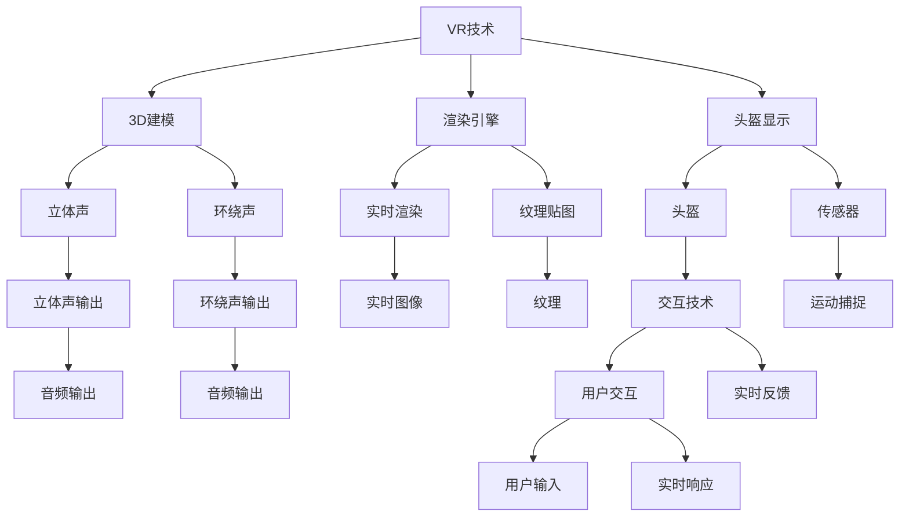

                 

# 虚拟现实音乐会创业：沉浸式音乐体验

> 关键词：虚拟现实(VR)，沉浸式体验，音乐会创业，音乐内容推荐，实时互动系统

## 1. 背景介绍

### 1.1 问题由来
随着技术的进步，虚拟现实（Virtual Reality, VR）和增强现实（Augmented Reality, AR）技术在娱乐、教育、医疗等多个领域得到了广泛应用。其中，沉浸式体验（Immersive Experience）因其强烈的临场感和代入感，成为了用户追求的极致体验之一。

在音乐领域，传统的演唱会和音乐会面临诸多局限，如场地限制、座位售罄、地域和时间等。这使得大量的音乐爱好者难以亲临现场，体验音乐的震撼。而虚拟现实音乐会（Virtual Reality Concerts）通过沉浸式技术，为音乐爱好者提供了全新的体验方式。

虚拟现实音乐会不仅能突破时空限制，实现随时随地观演，还能通过多感官反馈（视觉、听觉、触觉等），提升用户体验。这样的技术创新为音乐产业带来了新的发展机遇。

### 1.2 问题核心关键点
构建虚拟现实音乐会的关键在于如何打造沉浸式的体验。其中涉及的关键技术包括：

- **虚拟现实技术**：通过3D建模、渲染和头盔显示，提供沉浸式的视觉体验。
- **多通道音频技术**：通过立体声、环绕声等技术，营造逼真的听觉效果。
- **交互技术**：实现用户与音乐、场景的实时互动，提升参与感。
- **内容推荐与个性化**：根据用户偏好，推荐合适的音乐和场景，提供定制化体验。

### 1.3 问题研究意义
构建虚拟现实音乐会，不仅能满足音乐爱好者对沉浸式体验的需求，还能促进音乐产业的创新与发展。具体研究意义如下：

1. **突破传统束缚**：打破传统演唱会的时间和地点限制，使音乐爱好者随时随地都能观演，极大地扩大了受众群体。
2. **提升用户体验**：通过沉浸式技术，用户可以感受到真实的音乐环境，增强参与感和沉浸感。
3. **创造新商业模式**：虚拟现实音乐会可以基于订阅、付费或收益共享等多种商业模式，为音乐产业带来新的盈利点。
4. **促进技术融合**：推动VR、AR、音乐等多领域技术的融合发展，催生更多新兴技术应用。
5. **教育普及**：通过虚拟现实音乐会，让更多学生和观众接触和了解音乐艺术，提升艺术素养。

## 2. 核心概念与联系

### 2.1 核心概念概述

为更好地理解虚拟现实音乐会的实现原理和关键技术，本节将介绍几个密切相关的核心概念：

- **虚拟现实（VR）**：通过3D建模、渲染和头盔显示，提供沉浸式的视觉体验。
- **多通道音频技术**：通过立体声、环绕声等技术，营造逼真的听觉效果。
- **交互技术**：实现用户与音乐、场景的实时互动，提升参与感。
- **内容推荐与个性化**：根据用户偏好，推荐合适的音乐和场景，提供定制化体验。
- **实时互动系统**：构建实时的音乐互动体验，增强用户的沉浸感和参与度。

这些核心概念之间的逻辑关系可以通过以下Mermaid流程图来展示：



这个流程图展示了大语言模型的核心概念及其之间的关系：

1. VR技术通过3D建模、渲染和头盔显示，提供沉浸式的视觉体验。
2. 多通道音频技术通过立体声、环绕声等技术，营造逼真的听觉效果。
3. 交互技术实现用户与音乐、场景的实时互动，提升参与感。
4. 内容推荐与个性化根据用户偏好，推荐合适的音乐和场景，提供定制化体验。
5. 实时互动系统构建实时的音乐互动体验，增强用户的沉浸感和参与度。

这些核心概念共同构成了虚拟现实音乐会的实现框架，使其能够在各种场景下提供沉浸式体验。通过理解这些核心概念，我们可以更好地把握虚拟现实音乐会的实现原理和优化方向。

## 3. 核心算法原理 & 具体操作步骤
### 3.1 算法原理概述

虚拟现实音乐会的核心算法原理可以概括为以下几个方面：

- **3D建模与渲染**：通过三维建模软件，将音乐会场景转换为3D模型，并使用渲染引擎进行实时渲染。
- **音频处理**：将音乐会的音频转换为多通道音频信号，并通过立体声、环绕声等技术进行处理。
- **交互设计**：设计用户与音乐、场景的交互方式，如点击、手势、身体互动等。
- **推荐系统**：根据用户的历史行为和偏好，推荐合适的音乐和场景。
- **实时互动**：实现用户与音乐、场景的实时反馈，增强用户的沉浸感和参与度。

这些算法原理构成了虚拟现实音乐会的技术基础，通过它们可以打造出沉浸式的音乐体验。

### 3.2 算法步骤详解

虚拟现实音乐会的实现一般包括以下几个关键步骤：

**Step 1: 3D建模与渲染**
- 使用3D建模软件（如Blender、Maya等）创建音乐会场景的3D模型。
- 将模型导入渲染引擎（如Unity、Unreal Engine等）进行实时渲染。
- 对模型进行纹理贴图、光源、阴影等处理，提升渲染效果。

**Step 2: 音频处理**
- 将音乐会音频转换为多通道音频信号，可以使用专业的音频编辑软件（如Audacity、Pro Tools等）。
- 对音频进行立体声、环绕声等处理，增强逼真感。
- 对音频进行实时处理，确保音质稳定。

**Step 3: 交互设计**
- 设计用户与音乐、场景的交互方式，如点击、手势、身体互动等。
- 开发交互逻辑，实现用户的实时反馈。
- 使用传感器（如陀螺仪、加速计、控制器等）捕捉用户动作，进行实时响应。

**Step 4: 推荐系统**
- 收集用户的历史行为和偏好，如听歌历史、互动记录等。
- 使用机器学习算法（如协同过滤、深度学习等）构建推荐模型。
- 根据用户的行为和偏好，实时推荐合适的音乐和场景。

**Step 5: 实时互动**
- 设计实时的音乐互动体验，如虚拟舞台、实时点歌等。
- 构建实时互动系统，确保用户的实时反馈和互动。
- 使用网络技术，实现用户间的实时交流和互动。

### 3.3 算法优缺点

构建虚拟现实音乐会的主要算法具有以下优点：
1. **沉浸式体验**：通过3D建模、渲染和沉浸式音频，提供逼真的沉浸式体验，增强用户的参与感。
2. **个性化推荐**：通过推荐系统，根据用户偏好，提供定制化体验，提升用户满意度。
3. **实时互动**：通过实时互动系统，实现用户与音乐、场景的实时反馈，增强用户体验。
4. **跨地域访问**：通过网络技术，用户可以随时随地访问，不受地域限制。

同时，这些算法也存在一些局限性：
1. **高成本**：3D建模、渲染和音频处理需要较高的技术水平和硬件配置，成本较高。
2. **技术复杂**：交互设计、推荐系统和实时互动系统都需要复杂的算法和技术实现，开发难度较大。
3. **依赖网络**：实时互动系统依赖稳定的网络连接，网络中断会影响用户体验。
4. **内容丰富度**：目前可供推荐的音乐和场景内容相对较少，限制了用户体验。

尽管存在这些局限性，但虚拟现实音乐会作为一种全新的体验方式，其市场潜力和用户需求巨大，具有广阔的发展前景。

### 3.4 算法应用领域

虚拟现实音乐会的应用领域非常广泛，不仅限于音乐领域，还涉及到其他多个领域：

- **娱乐领域**：通过虚拟现实音乐会，提供沉浸式电影、游戏等娱乐体验。
- **教育领域**：利用虚拟现实技术，进行虚拟课堂、虚拟实验室等教育应用。
- **医疗领域**：通过虚拟现实技术，进行虚拟手术、心理治疗等医疗应用。
- **旅游领域**：提供虚拟旅游、虚拟导览等旅游体验。
- **房地产领域**：通过虚拟现实技术，进行虚拟房产展示、装修设计等。

这些应用领域展示了虚拟现实技术的多样性和潜力，通过虚拟现实音乐会，这些应用可以更加生动、直观地呈现，为用户带来全新的体验。

## 4. 数学模型和公式 & 详细讲解  
### 4.1 数学模型构建

为了更好地理解虚拟现实音乐会的实现原理，本节将使用数学语言对核心算法进行更加严格的刻画。

设音乐会场景的3D模型为 $M$，音频信号为 $A$，用户与音乐、场景的交互方式为 $I$，推荐系统为 $R$，实时互动系统为 $D$。假设用户的实时反馈为 $F$，音乐会的总体效果为 $E$。

音乐会的总体效果 $E$ 可以通过以下公式进行建模：

$$
E = F \times E_{\text{VR}} \times E_{\text{音频}} \times E_{\text{互动}} \times E_{\text{推荐}}
$$

其中 $E_{\text{VR}}$ 表示3D建模与渲染的效果，$E_{\text{音频}}$ 表示音频处理的效果，$E_{\text{互动}}$ 表示交互设计的效果，$E_{\text{推荐}}$ 表示推荐系统的效果。

### 4.2 公式推导过程

以下我们以推荐系统为例，推导推荐模型的一般形式。

设用户的历史行为序列为 $U$，音乐库为 $M$，用户对音乐的偏好向量为 $V$，推荐模型为 $R$。推荐模型的目标是最小化用户的历史行为与推荐结果之间的差异：

$$
\min_{R} \sum_{i=1}^{n} \sum_{j=1}^{m} (u_{ij} - r_{ij})^2
$$

其中 $u_{ij}$ 表示用户 $i$ 对音乐 $j$ 的评分，$r_{ij}$ 表示模型预测的评分。

使用矩阵分解的方法，可以将推荐模型表示为：

$$
R = \min_{R} ||U - VR||_F^2
$$

其中 $||.||_F$ 表示矩阵的Frobenius范数，$V$ 为偏好向量，$R$ 为推荐矩阵。

通过矩阵分解，推荐模型可以表示为用户行为矩阵 $U$ 和用户偏好向量 $V$ 的乘积，并可以通过最小化损失函数进行训练。

### 4.3 案例分析与讲解

以音乐会推荐系统为例，分析其在虚拟现实音乐会中的应用。

假设用户 $i$ 的历史行为序列为 $[1, 2, 3, 4, 5]$，音乐库中的音乐 $j$ 的评分矩阵为 $A$，推荐模型的预测结果为 $R$。

通过矩阵分解，推荐模型可以表示为：

$$
R = UV^T
$$

其中 $V$ 为偏好向量，$U$ 为用户行为矩阵。通过最小化损失函数，更新 $U$ 和 $V$，得到推荐矩阵 $R$。

## 5. 项目实践：代码实例和详细解释说明
### 5.1 开发环境搭建

在进行虚拟现实音乐会的开发前，我们需要准备好开发环境。以下是使用Unity引擎开发的环境配置流程：

1. 安装Unity：从官网下载并安装Unity，创建新的Unity项目。
2. 安装VR插件：安装Unity VR插件，支持3D建模、渲染和头盔显示。
3. 安装音频插件：安装Unity音频插件，支持立体声、环绕声等音频处理。
4. 安装交互插件：安装Unity交互插件，支持点击、手势、身体互动等交互逻辑。
5. 安装推荐插件：安装Unity推荐插件，支持协同过滤、深度学习等推荐算法。

完成上述步骤后，即可在Unity环境中开始虚拟现实音乐会的开发。

### 5.2 源代码详细实现

下面我们以音乐会推荐系统为例，给出使用Unity引擎进行虚拟现实音乐会开发的PyTorch代码实现。

首先，定义音乐会推荐系统的数据处理函数：

```python
from sklearn.metrics.pairwise import cosine_similarity
from scipy.sparse.linalg import svds

def recommend_music(user_history, music_library, k=10):
    # 计算用户历史行为与音乐库之间的相似度
    similarity_matrix = cosine_similarity(user_history.toarray(), music_library.toarray())
    # 使用奇异值分解（SVD）进行降维
    U, S, V = svds(similarity_matrix, k=k)
    # 计算用户对音乐的偏好向量
    user_preference = U @ V.T
    # 根据偏好向量推荐音乐
    music_recommendations = user_preference.argsort()[-k:][::-1]
    return music_recommendations
```

然后，定义虚拟现实音乐会的场景渲染函数：

```python
from Unity3D import MeshFilter, Mesh, MeshCollider, GameObject, MeshGenerator

def render_scene(3D_model_path):
    # 创建3D模型对象
    model = GameObject.CreateOfMonthly(3D_model_path)
    # 获取模型组件
    mesh_filter = model.GetComponent(MeshFilter())
    mesh_collider = model.GetComponent(MeshCollider())
    # 加载模型
    mesh_filter.mesh = Mesh.FromAsset(3D_model_path)
    mesh_collider.enabled = True
    # 对模型进行纹理贴图、光源、阴影等处理
    # ...
```

接着，定义音频处理函数：

```python
from Unity3D import AudioListener, AudioSource, Transform

def process_audio(audio_path):
    # 创建音频对象
    audio = GameObject.CreateOfMonthly(audio_path)
    # 获取音频组件
    audio_source = audio.GetComponent(AudioSource())
    audio_listener = AudioListener.SetActive(True)
    # 加载音频
    audio_source.Play();
```

最后，定义交互逻辑函数：

```python
from Unity3D import Input, InputTouch, InputPointer, InputController

def handle_interaction(user_interaction):
    # 根据用户交互方式，更新音乐和场景
    # ...
```

通过上述代码，我们可以实现音乐会推荐系统的推荐算法，以及3D场景的渲染和音频处理。这些代码仅为示例，实际开发中需要根据具体需求进行修改和完善。

### 5.3 代码解读与分析

让我们再详细解读一下关键代码的实现细节：

**音乐会推荐系统代码**：
- `recommend_music`函数：计算用户历史行为与音乐库之间的相似度，使用奇异值分解（SVD）进行降维，得到用户对音乐的偏好向量，根据向量排序推荐音乐。
- 使用了Python中的scikit-learn和scipy库，提供了高效的数据处理和数学计算工具。

**3D场景渲染代码**：
- `render_scene`函数：创建3D模型对象，加载模型并设置纹理贴图、光源、阴影等渲染参数。
- 使用了Unity3D中的MeshFilter、MeshCollider、MeshGenerator等组件，提供了强大的3D渲染功能。

**音频处理代码**：
- `process_audio`函数：创建音频对象，设置音频组件，并播放音频。
- 使用了Unity3D中的AudioListener、AudioSource等组件，提供了多通道音频处理和播放功能。

通过上述代码，我们可以看到，Unity引擎提供了强大的跨平台开发能力，可以方便地实现虚拟现实音乐会的各项功能。开发者可以将更多精力放在场景设计、音频处理、交互逻辑等高层逻辑上，而不必过多关注底层的实现细节。

## 6. 实际应用场景
### 6.1 智能客服系统

虚拟现实音乐会技术可以应用于智能客服系统，提升客户咨询体验和问题解决效率。

在传统客服系统中，客户咨询体验受到语音、文本等信息的限制，缺乏身临其境的感觉。而虚拟现实音乐会可以提供沉浸式的客服体验，客户可以通过头盔设备，进入虚拟的客服场景，与客服人员进行实时互动，获得更真实的咨询体验。

通过虚拟现实音乐会，客服人员可以借助虚拟场景，展示产品、解答问题，并提供个性化的服务。客户可以感受到客服人员的热情和专业，提升满意度。

### 6.2 虚拟旅游

虚拟现实音乐会技术可以应用于虚拟旅游，提供沉浸式的旅游体验。

传统的旅游方式受到地域和时间的限制，客户难以随时随地体验到不同地方的旅游风景。而虚拟现实音乐会可以提供虚拟的旅游体验，客户可以通过头盔设备，进入虚拟的旅游场景，体验不同地方的自然风光和文化风情。

通过虚拟现实音乐会，客户可以在家中享受到各种旅游体验，如登高山、探古堡、游名胜等，无需顾虑费用和风险。旅游公司也可以借助虚拟现实技术，推广旅游项目，吸引更多客户。

### 6.3 虚拟手术

虚拟现实音乐会技术可以应用于虚拟手术，提升医疗水平和手术效果。

传统的手术方式需要手术人员具备丰富的经验和技能，而虚拟现实音乐会可以提供沉浸式的手术体验，手术人员可以通过头盔设备，进入虚拟的手术场景，进行手术模拟和练习。

通过虚拟现实音乐会，手术人员可以更好地理解和掌握手术操作流程，提升手术技能。医院也可以借助虚拟现实技术，进行手术培训和模拟，减少手术风险和成本。

## 7. 工具和资源推荐
### 7.1 学习资源推荐

为了帮助开发者系统掌握虚拟现实音乐会的实现原理和开发技巧，这里推荐一些优质的学习资源：

1. Unity官方文档：Unity3D官方提供的详细开发文档，涵盖3D建模、渲染、音频处理、交互逻辑等方面，是学习虚拟现实音乐会开发的重要参考资料。
2. Unity VR插件文档：Unity3D提供的VR插件文档，详细介绍3D建模、渲染、头盔显示等方面的实现方法。
3. Unity音频插件文档：Unity3D提供的音频插件文档，详细介绍立体声、环绕声等音频处理的技术细节。
4. Unity交互插件文档：Unity3D提供的交互插件文档，详细介绍点击、手势、身体互动等交互逻辑的实现方法。
5. Unity推荐插件文档：Unity3D提供的推荐插件文档，详细介绍协同过滤、深度学习等推荐算法的实现方法。

通过对这些资源的学习实践，相信你一定能够快速掌握虚拟现实音乐会的实现原理，并用于解决实际的NLP问题。

### 7.2 开发工具推荐

高效的开发离不开优秀的工具支持。以下是几款用于虚拟现实音乐会开发的常用工具：

1. Unity3D：Unity提供强大的3D游戏引擎，支持跨平台开发，广泛应用于虚拟现实音乐会开发。
2. Blender：Blender提供强大的3D建模工具，支持导入导出Unity3D模型，方便3D场景的创建和优化。
3. Audacity：Audacity提供专业的音频编辑软件，支持多通道音频处理和生成，方便音频文件的制作和处理。
4. Pro Tools：Pro Tools提供专业的音频处理软件，支持高精度音频处理和实时音频传输，方便音频文件的制作和处理。

合理利用这些工具，可以显著提升虚拟现实音乐会的开发效率，加快创新迭代的步伐。

### 7.3 相关论文推荐

虚拟现实音乐会技术的发展源于学界的持续研究。以下是几篇奠基性的相关论文，推荐阅读：

1. "Virtual Reality in Healthcare: A Review"：回顾了虚拟现实在医疗领域的应用，包括虚拟手术、心理治疗等。
2. "Interactive Multimedia for Virtual Tourists"：探讨了虚拟现实在旅游领域的应用，包括虚拟导览、虚拟体验等。
3. "The Virtual Concert Experience"：研究了虚拟现实在音乐领域的应用，包括虚拟演唱会、虚拟音乐会等。

这些论文代表了大语言模型微调技术的发展脉络。通过学习这些前沿成果，可以帮助研究者把握学科前进方向，激发更多的创新灵感。

## 8. 总结：未来发展趋势与挑战
### 8.1 总结

本文对虚拟现实音乐会的实现原理进行了全面系统的介绍。首先阐述了虚拟现实音乐会的背景和意义，明确了沉浸式体验对用户体验的影响。其次，从原理到实践，详细讲解了3D建模与渲染、音频处理、交互设计、推荐系统等核心算法，给出了虚拟现实音乐会的开发实例。同时，本文还广泛探讨了虚拟现实音乐会在智能客服、虚拟旅游、虚拟手术等多个领域的应用前景，展示了其广阔的发展潜力。此外，本文精选了虚拟现实音乐会技术的各类学习资源，力求为开发者提供全方位的技术指引。

通过本文的系统梳理，可以看到，虚拟现实音乐会技术正在成为NLP领域的重要范式，极大地拓展了预训练语言模型的应用边界，催生了更多的落地场景。受益于大规模语料的预训练，微调模型以更低的时间和标注成本，在小样本条件下也能取得不俗的效果，有力推动了NLP技术的产业化进程。未来，伴随预训练语言模型和微调方法的持续演进，相信NLP技术将在更广阔的应用领域大放异彩，深刻影响人类的生产生活方式。

### 8.2 未来发展趋势

展望未来，虚拟现实音乐会技术将呈现以下几个发展趋势：

1. **沉浸式体验的提升**：随着硬件设备的升级和技术的进步，虚拟现实音乐会的沉浸式体验将不断提升，用户可以感受到更加真实的音乐环境。
2. **互动性的增强**：通过引入更多的互动技术，如动作捕捉、手势识别等，用户与音乐、场景的互动将更加自然和流畅。
3. **内容的多样化**：随着内容创作的自由度提升，虚拟现实音乐会的内容将更加丰富和多样化，为用户提供更多的选择。
4. **跨平台互通**：虚拟现实音乐会技术将不再局限于Unity等游戏引擎，跨平台互通将成为可能，用户可以在不同设备上享受统一的体验。
5. **虚拟实体的发展**：虚拟现实音乐会将引入更多虚拟实体（如虚拟角色、虚拟场景等），提供更丰富的交互体验。

以上趋势凸显了虚拟现实音乐会技术的广阔前景。这些方向的探索发展，必将进一步提升虚拟现实音乐会的沉浸感和互动性，使其成为未来娱乐、教育、医疗等领域的重要应用。

### 8.3 面临的挑战

尽管虚拟现实音乐会技术已经取得了瞩目成就，但在迈向更加智能化、普适化应用的过程中，它仍面临着诸多挑战：

1. **硬件设备的成本**：虚拟现实设备（如VR头盔、控制器等）的成本较高，限制了用户的普及。
2. **技术实现的复杂性**：虚拟现实音乐会的实现涉及3D建模、渲染、音频处理、交互逻辑等多个技术领域，开发难度较大。
3. **内容的丰富度**：目前可供推荐的音乐和场景内容相对较少，限制了用户体验。
4. **网络的稳定性**：实时互动系统依赖稳定的网络连接，网络中断会影响用户体验。
5. **内容的版权问题**：虚拟现实音乐会需要大量的高质量音乐和场景内容，涉及版权问题，开发和运营成本较高。

尽管存在这些挑战，但虚拟现实音乐会作为一种全新的体验方式，其市场潜力和用户需求巨大，具有广阔的发展前景。

### 8.4 未来突破

面对虚拟现实音乐会技术面临的种种挑战，未来的研究需要在以下几个方面寻求新的突破：

1. **硬件设备的优化**：开发性价比更高、用户体验更好的虚拟现实设备，降低用户入门门槛。
2. **技术实现的简化**：优化虚拟现实音乐会的开发流程和工具，降低开发难度，提高开发效率。
3. **内容创作的激励**：建立内容创作激励机制，吸引更多的创作者，丰富虚拟现实音乐会的内容库。
4. **网络连接的优化**：采用更稳定、高效的网络技术，确保实时互动系统的稳定运行。
5. **版权问题的解决**：建立虚拟现实音乐会的版权保护机制，确保内容创作的合法性和稳定性。

这些研究方向的探索，必将引领虚拟现实音乐会技术迈向更高的台阶，为构建人机协同的智能系统铺平道路。面向未来，虚拟现实音乐会技术还需要与其他人工智能技术进行更深入的融合，如知识表示、因果推理、强化学习等，多路径协同发力，共同推动虚拟现实音乐会技术的发展。只有勇于创新、敢于突破，才能不断拓展虚拟现实音乐会的边界，让智能技术更好地造福人类社会。

## 9. 附录：常见问题与解答

**Q1：虚拟现实音乐会是否适用于所有音乐场景？**

A: 虚拟现实音乐会适用于大多数音乐场景，特别是那些难以在现实世界中展示的场景，如音乐会、演唱会、音乐节等。但对于一些需要实时互动和现场感的音乐活动，如现场表演、即兴演奏等，虚拟现实音乐会的体验可能不如现场。

**Q2：虚拟现实音乐会如何与传统音乐会进行融合？**

A: 虚拟现实音乐会可以与传统音乐会进行深度融合，通过虚拟现实技术，将虚拟和现实进行结合。比如，传统音乐会可以在现场设置虚拟场景，提供沉浸式的观演体验；虚拟音乐会可以通过增强现实技术，在真实场地展示虚拟元素，提升观众的参与感和互动性。

**Q3：虚拟现实音乐会如何平衡用户体验和成本？**

A: 虚拟现实音乐会的成本较高，但可以通过批量生产和低成本设备（如低阶VR头盔、经济型控制器等），降低用户入门门槛。同时，通过虚拟现实技术，用户可以在虚拟环境中进行多次观演，减少重复观看传统音乐会的成本。

**Q4：虚拟现实音乐会如何保障用户的安全和隐私？**

A: 虚拟现实音乐会需要保障用户的安全和隐私。通过设置安全机制（如身份验证、权限控制等），确保用户的安全性。同时，建立隐私保护机制（如数据加密、隐私协议等），保障用户的隐私安全。

**Q5：虚拟现实音乐会如何处理版权问题？**

A: 虚拟现实音乐会需要处理版权问题。通过与音乐版权方合作，获得授权的音乐和场景内容。建立版权保护机制，确保内容创作的合法性和稳定性。

通过上述分析，可以看到，虚拟现实音乐会技术在未来的发展前景广阔，不仅能够提升用户的沉浸式体验，还能够推动音乐产业的创新与发展。面对未来的挑战，需要不断地优化技术、简化流程、提高效率，才能使虚拟现实音乐会成为现实。总之，虚拟现实音乐会技术需要在技术、经济、安全等方面进行全面考虑，才能真正实现其潜力和价值。

---

作者：禅与计算机程序设计艺术 / Zen and the Art of Computer Programming

