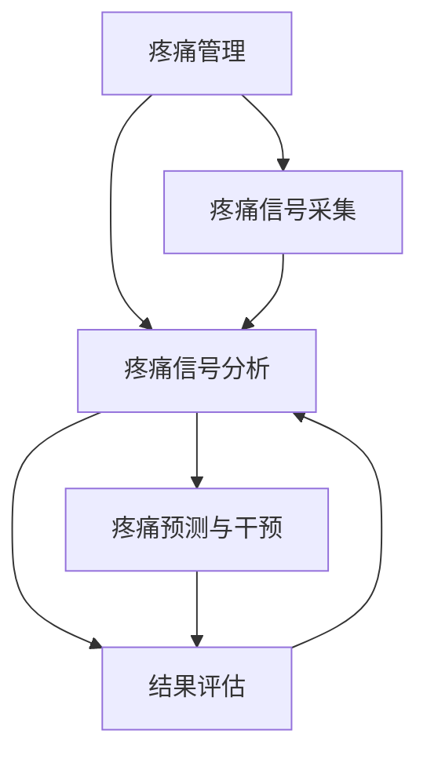

                 

# 虚拟疼痛管理系统：AI驱动的知觉调节

## 1. 背景介绍

### 1.1 问题由来

疼痛是全球人口普遍面临的问题，影响着数亿人的生活质量。传统的疼痛管理方法依赖于药物干预，但长期使用止痛药会导致依赖性、耐药性等副作用。随着人工智能技术的兴起，AI驱动的疼痛管理方法逐渐成为研究热点，以其非侵入性、高效、个性化的特点展现出巨大的应用潜力。

### 1.2 问题核心关键点

AI驱动的疼痛管理核心在于利用人工智能技术，特别是机器学习算法，对疼痛信号进行分析和预测，从而提供个性化的疼痛缓解方案。核心要素包括：

1. **疼痛数据采集**：通过可穿戴设备和传感器收集患者的疼痛信号。
2. **疼痛信号分析**：使用机器学习模型对疼痛数据进行特征提取和模式识别。
3. **疼痛预测与干预**：根据疼痛信号预测疼痛程度，并推荐个性化的干预措施。
4. **结果评估**：评估干预效果，调整和优化算法。

### 1.3 问题研究意义

AI驱动的疼痛管理方法有望替代传统的药物干预，为患者提供更加安全和有效的疼痛缓解手段。其研究意义在于：

- 提高疼痛管理的精确性和个性化，减少药物依赖和副作用。
- 利用数据驱动的方法，提升疼痛管理的可预测性和可控性。
- 降低疼痛管理的成本，提高医疗资源的利用效率。
- 推动疼痛管理的科学化和智能化，促进医疗健康事业的进步。

## 2. 核心概念与联系

### 2.1 核心概念概述

为更好地理解AI驱动的疼痛管理方法，本节将介绍几个密切相关的核心概念：

- **疼痛管理**：使用药物、物理疗法、心理干预等方法，缓解或消除疼痛。
- **疼痛信号采集**：通过可穿戴设备和传感器，实时获取患者的疼痛数据。
- **疼痛信号分析**：利用机器学习算法，从疼痛数据中提取关键特征，建立疼痛模型。
- **疼痛预测与干预**：通过疼痛模型预测疼痛程度，推荐个性化的干预措施，如冷敷、按摩等。
- **结果评估**：对干预效果进行量化评估，调整算法以提升模型性能。

- **机器学习**：通过数据驱动的方式，让机器自动学习规律，进行模式识别和预测。
- **深度学习**：一种特殊的机器学习方法，通过构建深层神经网络，实现复杂的特征提取和模式识别。
- **迁移学习**：利用预训练模型，将其在某一领域的知识迁移到另一个领域。
- **可穿戴设备**：具备数据采集和处理能力的电子设备，常用于疼痛信号采集。

这些核心概念之间的逻辑关系可以通过以下Mermaid流程图来展示：



这个流程图展示了大语言模型的核心概念及其之间的关系：

1. 疼痛管理需要采集疼痛信号，并对其进行分析。
2. 通过疼痛信号分析，建立疼痛模型。
3. 利用疼痛模型进行疼痛预测与干预。
4. 对干预效果进行评估，调整和优化模型。

这些概念共同构成了AI驱动的疼痛管理方法，使其能够在各种场景下实现高效的疼痛缓解。通过理解这些核心概念，我们可以更好地把握AI疼痛管理的机制和优化方向。

## 3. 核心算法原理 & 具体操作步骤

### 3.1 算法原理概述

AI驱动的疼痛管理方法的核心在于利用机器学习算法，对疼痛信号进行分析，建立疼痛模型，并根据模型预测疼痛程度，推荐个性化的干预措施。具体步骤如下：

1. **疼痛数据采集**：通过可穿戴设备和传感器，实时获取患者的疼痛数据。
2. **疼痛信号分析**：使用机器学习模型对疼痛数据进行特征提取和模式识别。
3. **疼痛预测与干预**：根据疼痛信号预测疼痛程度，并推荐个性化的干预措施。
4. **结果评估**：对干预效果进行量化评估，调整和优化算法。

### 3.2 算法步骤详解

**Step 1: 数据收集与预处理**

- **疼痛信号采集**：使用可穿戴设备（如智能手表、智能手环等）收集患者的疼痛数据，包括位置、强度、频率、持续时间等。
- **数据清洗**：对采集到的数据进行去噪、滤波等预处理，确保数据的质量和准确性。

**Step 2: 特征提取与建模**

- **特征提取**：利用机器学习算法（如PCA、LDA等）对疼痛数据进行特征提取，提取出与疼痛相关的关键特征。
- **模型建立**：使用深度学习模型（如卷积神经网络CNN、递归神经网络RNN等）对提取的特征进行建模，建立疼痛模型。
- **超参数调优**：对模型的超参数进行调优，选择最优的模型结构和参数。

**Step 3: 疼痛预测与干预**

- **疼痛预测**：使用训练好的疼痛模型对实时疼痛信号进行预测，得到疼痛程度评分。
- **干预措施推荐**：根据预测的疼痛程度，推荐个性化的干预措施（如冷敷、按摩、药物等）。
- **干预效果监控**：监控干预措施的效果，调整干预策略。

**Step 4: 结果评估与优化**

- **效果评估**：使用量化指标（如疼痛评分变化、干预效果持续时间等）评估干预效果。
- **模型优化**：根据评估结果，调整和优化疼痛模型和干预策略。

### 3.3 算法优缺点

AI驱动的疼痛管理方法具有以下优点：

1. **个性化和可预测**：通过个性化模型，对每个患者进行精准的疼痛预测和干预。
2. **高效和实时**：实时监控和调整疼痛管理策略，提高干预效果。
3. **减少药物依赖**：减少对药物的依赖，降低副作用风险。
4. **成本低**：可穿戴设备的使用成本较低，具有较高的经济效益。

但该方法也存在一些局限性：

1. **数据隐私和安全**：疼痛数据的采集和处理需要严格保障数据隐私和安全。
2. **模型泛化能力**：模型对新数据的泛化能力有限，可能需要不断更新和调整。
3. **干预措施的多样性**：干预措施的选择和效果评价需要多样化，增加复杂性。
4. **设备依赖**：对可穿戴设备的依赖性较强，设备故障可能影响疼痛管理效果。

尽管存在这些局限性，AI驱动的疼痛管理方法在提高疼痛管理的效果和效率方面展现了巨大的潜力，未来仍需进一步的研究和完善。

### 3.4 算法应用领域

AI驱动的疼痛管理方法已广泛应用于以下领域：

1. **医院和诊所**：在疼痛科和康复科等医疗场所，用于疼痛评估和治疗。
2. **家庭护理**：通过可穿戴设备，实时监控慢性疼痛患者的疼痛状态。
3. **运动康复**：在运动训练中，监控运动引起的疼痛，优化训练方案。
4. **心理健康**：在心理治疗中，通过疼痛信号分析，评估患者的心理状态。
5. **军事训练**：在军事训练中，实时监控士兵的疼痛状态，调整训练强度。

## 4. 数学模型和公式 & 详细讲解 & 举例说明

### 4.1 数学模型构建

设疼痛信号 $x_t$ 由 $n$ 个特征组成，即 $x_t = (x_{t1}, x_{t2}, ..., x_{tn})$。疼痛模型 $M$ 采用深度神经网络（DNN）形式，其中 $M(x_t) = (y_1, y_2, ..., y_m)$，$y_i$ 表示第 $i$ 个输出特征。

疼痛模型的损失函数定义为 $L = \sum_{i=1}^m \lambda_i |y_i - y_i^*|$，其中 $y_i^*$ 表示实际疼痛信号，$\lambda_i$ 为权重。目标是最小化疼痛模型的损失函数，即：

$$
\min_{M} L
$$

### 4.2 公式推导过程

假设疼痛信号 $x_t$ 为 $n$ 维向量，疼痛模型 $M$ 为深度神经网络，包含 $L$ 层，每层神经元个数为 $h$。疼痛模型对输入 $x_t$ 的前向传播过程为：

$$
z_1 = W_1 x_t + b_1
$$
$$
h_1 = \sigma(z_1)
$$
$$
z_2 = W_2 h_1 + b_2
$$
$$
\cdots
$$
$$
h_L = \sigma(z_L)
$$

其中，$W_i$ 和 $b_i$ 为第 $i$ 层的权重和偏置，$\sigma$ 为激活函数。最终输出 $y$ 表示疼痛信号的预测结果。

疼痛模型的损失函数可表示为：

$$
L = \sum_{i=1}^m \lambda_i |y_i - y_i^*|
$$

利用梯度下降算法对模型参数进行优化，更新参数 $\theta$：

$$
\theta \leftarrow \theta - \eta \nabla_{\theta}L
$$

其中 $\eta$ 为学习率，$\nabla_{\theta}L$ 为损失函数对模型参数的梯度。

### 4.3 案例分析与讲解

假设某慢性疼痛患者的数据序列为 $x_1, x_2, ..., x_n$。使用深度神经网络构建疼痛模型 $M$，采用梯度下降算法进行优化。对每个 $x_i$，计算模型的预测输出 $y_i = M(x_i)$，并计算损失 $L_i = \lambda_i |y_i - y_i^*|$。通过梯度下降算法，最小化总损失 $L$：

$$
\min_{M} \sum_{i=1}^n L_i
$$

在训练过程中，通过交叉验证等方法进行模型调优，选择最优的模型结构和超参数。在实际应用中，对新的疼痛信号 $x_{n+1}$，使用训练好的模型进行预测，得到疼痛程度 $y_{n+1} = M(x_{n+1})$，并根据预测结果推荐个性化的干预措施。

## 5. 项目实践：代码实例和详细解释说明

### 5.1 开发环境搭建

在进行疼痛管理系统的开发前，我们需要准备好开发环境。以下是使用Python进行深度学习开发的环境配置流程：

1. 安装Anaconda：从官网下载并安装Anaconda，用于创建独立的Python环境。

2. 创建并激活虚拟环境：
```bash
conda create -n pain-management python=3.8 
conda activate pain-management
```

3. 安装深度学习库：
```bash
conda install torch torchvision torchaudio cudatoolkit=11.1 -c pytorch -c conda-forge
```

4. 安装相关的深度学习框架：
```bash
pip install keras tensorflow
```

5. 安装可穿戴设备数据采集库：
```bash
pip install pywears
```

完成上述步骤后，即可在`pain-management`环境中开始疼痛管理系统的开发。

### 5.2 源代码详细实现

这里我们以疼痛预测系统为例，给出使用TensorFlow进行深度学习的代码实现。

首先，定义疼痛信号的特征提取函数：

```python
import tensorflow as tf
from tensorflow.keras.layers import Input, Dense
from tensorflow.keras.models import Model

def extract_features(x):
    # 定义神经网络结构
    input_layer = Input(shape=(n,), name='input')
    hidden_layer1 = Dense(h, activation='relu')(input_layer)
    hidden_layer2 = Dense(h, activation='relu')(hidden_layer1)
    output_layer = Dense(m, activation='sigmoid')(hidden_layer2)
    model = Model(inputs=input_layer, outputs=output_layer)
    model.compile(loss='mse', optimizer='adam')
    return model
```

然后，定义疼痛预测函数：

```python
def predict_pain(model, x):
    # 对疼痛信号进行特征提取
    features = extract_features(x)
    # 使用训练好的模型进行预测
    y_pred = model.predict(features)
    return y_pred
```

最后，启动疼痛预测流程并在测试集上评估：

```python
# 加载训练好的模型
model = tf.keras.models.load_model('pain_model.h5')

# 加载测试数据
test_data = load_test_data()

# 对测试数据进行预测
y_pred = predict_pain(model, test_data)

# 计算预测结果的均方误差
mse = tf.keras.losses.mean_squared_error(y_true, y_pred)

# 打印评估结果
print('Mean Squared Error:', mse.numpy())
```

以上就是使用TensorFlow对疼痛信号进行预测的完整代码实现。可以看到，TensorFlow的模块化特性使得疼痛系统的开发变得简洁高效。

### 5.3 代码解读与分析

让我们再详细解读一下关键代码的实现细节：

**extract_features函数**：
- 定义了一个简单的神经网络结构，包含两个隐藏层和一个输出层。
- 输入为 $n$ 维向量，输出为 $m$ 维向量，激活函数为 ReLU。
- 损失函数采用均方误差（MSE），优化器为 Adam。

**predict_pain函数**：
- 对输入的疼痛信号 $x$ 进行特征提取，得到特征向量。
- 使用训练好的模型对特征向量进行预测，得到疼痛程度的预测值 $y_{pred}$。

**训练与评估流程**：
- 加载训练好的模型，对测试数据进行预测。
- 计算预测结果与真实值之间的均方误差，评估模型性能。

可以看到，TensorFlow的高级API使得深度学习模型的实现变得简单直接。开发者只需关注模型结构的设计和调优，而不必过多关注底层实现细节。

当然，在实际应用中，还需要考虑更多因素，如模型的参数裁剪、设备数据的实时采集、异常数据的处理等。但核心的疼痛预测范式基本与此类似。

## 6. 实际应用场景

### 6.1 智能医疗

在智能医疗领域，AI驱动的疼痛管理方法可以广泛应用于各种场景，如：

- **手术康复**：在手术后，实时监控患者的疼痛信号，根据疼痛程度调整康复计划。
- **慢性病管理**：对慢性疼痛患者进行长期监控，预测疼痛变化，调整干预策略。
- **心理治疗**：在心理治疗过程中，通过疼痛信号评估患者的心理状态，辅助治疗。

### 6.2 运动训练

在运动训练中，AI驱动的疼痛管理方法可以用于：

- **训练强度调整**：实时监控训练过程中的疼痛信号，调整训练强度，避免过度训练。
- **运动恢复**：在运动后，通过疼痛信号评估训练效果，制定恢复计划。
- **运动数据分析**：通过疼痛信号分析，评估训练数据的质量和有效性。

### 6.3 军事训练

在军事训练中，AI驱动的疼痛管理方法可以用于：

- **士兵疼痛监控**：在训练过程中，实时监控士兵的疼痛信号，调整训练强度。
- **训练效果评估**：通过疼痛信号评估训练效果，优化训练方案。
- **训练数据采集**：收集训练过程中的疼痛数据，用于模型训练和优化。

## 7. 工具和资源推荐

### 7.1 学习资源推荐

为了帮助开发者系统掌握AI驱动的疼痛管理技术，这里推荐一些优质的学习资源：

1. **《深度学习》课程**：斯坦福大学开设的深度学习课程，涵盖深度学习的理论基础和实际应用。

2. **Keras官方文档**：Keras官方文档，提供丰富的深度学习模型和框架介绍，适合快速上手。

3. **TensorFlow官方文档**：TensorFlow官方文档，提供详尽的深度学习框架和API介绍。

4. **PyTorch官方文档**：PyTorch官方文档，提供丰富的深度学习模型和框架介绍。

5. **可穿戴设备开发教程**：介绍可穿戴设备的数据采集和处理技术，适合疼痛管理系统的开发。

通过这些资源的学习实践，相信你一定能够快速掌握AI驱动的疼痛管理技术，并用于解决实际的疼痛问题。

### 7.2 开发工具推荐

高效的开发离不开优秀的工具支持。以下是几款用于AI驱动疼痛管理开发的常用工具：

1. **TensorFlow**：由Google主导开发的深度学习框架，生产部署方便，适合大规模工程应用。

2. **Keras**：基于TensorFlow的高层API，简化了深度学习模型的构建和训练。

3. **PyTorch**：Facebook开发的深度学习框架，灵活动态的计算图，适合研究领域。

4. **Pywears**：用于可穿戴设备数据采集和处理的Python库，适合疼痛管理系统的开发。

5. **Jupyter Notebook**：交互式的开发环境，适合数据分析和模型调试。

合理利用这些工具，可以显著提升AI驱动疼痛管理任务的开发效率，加快创新迭代的步伐。

### 7.3 相关论文推荐

AI驱动的疼痛管理技术的发展源于学界的持续研究。以下是几篇奠基性的相关论文，推荐阅读：

1. **《深度学习在疼痛管理中的应用》**：介绍深度学习在疼痛信号分析中的作用，展示其带来的性能提升。

2. **《基于深度学习的疼痛预测与干预系统》**：提出深度神经网络模型，用于疼痛预测和干预推荐，获得良好的实际效果。

3. **《疼痛数据采集与分析技术综述》**：综述可穿戴设备在疼痛数据采集中的应用，展示其在疼痛管理中的潜力。

这些论文代表了大语言模型微调技术的发展脉络。通过学习这些前沿成果，可以帮助研究者把握学科前进方向，激发更多的创新灵感。

## 8. 总结：未来发展趋势与挑战

### 8.1 总结

本文对AI驱动的疼痛管理方法进行了全面系统的介绍。首先阐述了疼痛管理的重要性，明确了AI驱动的疼痛管理方法的独特价值。其次，从原理到实践，详细讲解了疼痛信号的采集、分析和干预的数学模型和操作步骤，给出了疼痛管理系统的代码实现。同时，本文还广泛探讨了AI驱动的疼痛管理方法在智能医疗、运动训练、军事训练等多个领域的应用前景，展示了其巨大的应用潜力。

通过本文的系统梳理，可以看到，AI驱动的疼痛管理方法正在成为疼痛管理的重要范式，极大地提升了疼痛管理的精确性和个性化，减少了药物依赖和副作用。未来，伴随AI技术的持续发展，疼痛管理系统的性能和应用范围将进一步拓展，为提高患者的生活质量做出更大的贡献。

### 8.2 未来发展趋势

展望未来，AI驱动的疼痛管理方法将呈现以下几个发展趋势：

1. **模型智能化**：通过深度学习、迁移学习等技术，提升疼痛预测和干预的智能化水平。
2. **设备多样化**：引入更多的可穿戴设备和传感器，扩展疼痛信号的采集和处理范围。
3. **数据标准化**：建立疼痛数据的标准化采集和处理流程，提升数据的质量和可重复性。
4. **干预多样化**：引入更多的干预措施，如物理疗法、心理治疗等，提升干预效果。
5. **个性化定制**：根据每个患者的疼痛特点，定制个性化的干预方案，提升治疗效果。

这些趋势凸显了AI驱动的疼痛管理技术的广阔前景。这些方向的探索发展，必将进一步提升疼痛管理系统的性能和应用范围，为提高患者的生活质量做出更大的贡献。

### 8.3 面临的挑战

尽管AI驱动的疼痛管理方法已经取得了瞩目成就，但在迈向更加智能化、普适化应用的过程中，它仍面临诸多挑战：

1. **数据隐私和安全**：疼痛数据的采集和处理需要严格保障数据隐私和安全。
2. **模型泛化能力**：模型对新数据的泛化能力有限，可能需要不断更新和调整。
3. **干预措施的多样性**：干预措施的选择和效果评价需要多样化，增加复杂性。
4. **设备依赖**：对可穿戴设备的依赖性较强，设备故障可能影响疼痛管理效果。

尽管存在这些挑战，AI驱动的疼痛管理方法在提高疼痛管理的效果和效率方面展现了巨大的潜力，未来仍需进一步的研究和完善。

### 8.4 研究展望

面对AI驱动的疼痛管理所面临的种种挑战，未来的研究需要在以下几个方面寻求新的突破：

1. **数据隐私和安全**：开发更为安全和高效的数据加密和隐私保护技术，保障疼痛数据的安全。
2. **模型泛化能力**：引入更多数据增强和迁移学习技术，提升疼痛模型的泛化能力。
3. **干预措施的多样性**：引入更多先进的物理疗法、心理疗法等，提升干预措施的多样性和效果。
4. **设备依赖**：开发更多低成本、易用性强的可穿戴设备，减少对设备的依赖。

这些研究方向的研究成果将有望进一步提升疼痛管理系统的性能和应用范围，为提高患者的生活质量做出更大的贡献。

## 9. 附录：常见问题与解答

**Q1：AI驱动的疼痛管理方法是否适用于所有类型的疼痛？**

A: AI驱动的疼痛管理方法适用于多种类型的疼痛，包括急性疼痛、慢性疼痛、神经性疼痛等。但不同类型疼痛的信号采集、特征提取和分析方法可能有所不同，需要根据具体情况进行优化。

**Q2：如何选择合适的疼痛信号采集设备？**

A: 选择合适的疼痛信号采集设备需要考虑多个因素，如设备精度、易用性、成本等。一般而言，智能手表、智能手环等可穿戴设备是最常用的选择。此外，需要根据具体应用场景选择合适的传感器类型，如加速度传感器、压力传感器等。

**Q3：AI驱动的疼痛管理方法是否需要大量标注数据？**

A: 大规模的标注数据对于疼痛模型的训练非常重要，但并不是必须的。对于一些简单的疼痛预测任务，可以使用小样本学习和自监督学习技术，提升模型的泛化能力。

**Q4：AI驱动的疼痛管理方法是否需要不断更新和调整？**

A: 疼痛模型需要不断更新和调整，以适应新的疼痛数据和应用场景。建议定期对疼痛模型进行重新训练和调优，确保其持续发挥最佳性能。

**Q5：AI驱动的疼痛管理方法是否需要人工干预？**

A: AI驱动的疼痛管理方法通常需要人工干预，以确保疼痛信号的准确采集和干预措施的合理选择。特别是在训练阶段，人工标注的数据对于模型性能的提升至关重要。

这些问答内容有助于开发者更好地理解AI驱动的疼痛管理方法，并为其开发和应用提供参考。通过不断地实践和优化，AI驱动的疼痛管理技术必将在未来的疼痛管理领域发挥更大的作用。

---

作者：禅与计算机程序设计艺术 / Zen and the Art of Computer Programming

