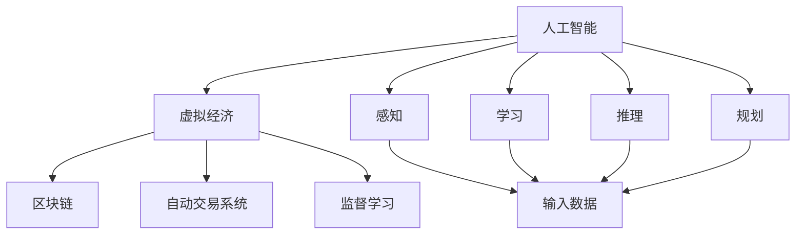

                 

# 虚拟经济：AI驱动的新型价值交换

> 关键词：虚拟经济,人工智能,价值交换,数字资产,区块链,自动交易系统

## 1. 背景介绍

### 1.1 问题由来

随着全球经济的数字化转型，虚拟经济正在快速发展，成为全球经济新常态的一部分。虚拟经济包括但不限于数字货币、非同质化代币(NFTs)、虚拟商品、虚拟服务以及各种在线交易平台等。其中，区块链技术以其去中心化、可追溯、不可篡改等特点，为虚拟经济提供了基础的技术支撑。

然而，虚拟经济也面临着诸多挑战。例如，交易效率低下、市场操纵行为、监管难度大等问题。这些问题亟需新技术来解决。在这一背景下，人工智能(AI)技术开始被引入虚拟经济领域，驱动虚拟经济走向智能化、高效化、安全化的发展路径。

### 1.2 问题核心关键点

本文聚焦于人工智能如何驱动虚拟经济的价值交换。基于监督学习的AI技术，已经被成功应用于虚拟经济中的交易平台、金融衍生品、市场分析等领域，为虚拟经济带来了革命性的变化。

本文主要探讨以下几个核心问题：

- AI在虚拟经济中的角色与作用
- 基于监督学习的虚拟经济价值交换模型
- AI驱动的虚拟经济系统架构设计
- AI在虚拟经济中的应用案例分析
- 基于监督学习的AI技术在虚拟经济中的未来展望

## 2. 核心概念与联系

### 2.1 核心概念概述

为更好地理解AI在虚拟经济中的应用，本节将介绍几个核心概念：

- 人工智能(Artificial Intelligence, AI)：利用计算机模拟人类智能行为的技术，包括感知、学习、推理、规划等。AI技术在虚拟经济中主要用于数据分析、市场预测、交易策略优化等方面。

- 虚拟经济(Virtual Economy)：指虚拟空间中的经济活动，包括数字货币、NFTs、虚拟商品等。虚拟经济不仅存在于数字世界，还与现实经济紧密相连。

- 区块链(Blockchain)：一种分布式账本技术，通过加密算法保证数据的不可篡改性。区块链是虚拟经济的基础设施，主要用于交易记录和资产认证。

- 自动交易系统(Automatic Trading System)：利用AI技术自动执行交易策略的系统，能够在市场上实时捕捉机会，快速执行交易。

- 监督学习(Supervised Learning)：一种机器学习方法，通过输入标注数据，使模型学习输入和输出之间的关系，从而进行预测和分类。监督学习是AI驱动虚拟经济的主要技术之一。

这些核心概念之间的逻辑关系可以通过以下Mermaid流程图来展示：



这个流程图展示了几大核心概念之间的关系：

1. 人工智能通过对虚拟经济的数据进行感知、学习和推理，规划出自动交易策略。
2. 虚拟经济中区块链作为基础，保证了交易的不可篡改性和数据的可信度。
3. 自动交易系统利用AI技术实时捕捉交易机会，快速执行交易。
4. 监督学习是AI驱动虚拟经济的核心技术，用于预测和分类。

这些概念共同构成了AI在虚拟经济中的基本框架，使得AI技术能够在虚拟经济中发挥强大的作用。

## 3. 核心算法原理 & 具体操作步骤
### 3.1 算法原理概述

基于监督学习的AI驱动虚拟经济的价值交换模型，利用历史交易数据和市场特征数据，训练一个预测模型，用于预测市场价格趋势和交易机会。该模型的主要目标是通过优化交易策略，最大化交易利润。

形式化地，假设市场上有N个资产，价格分别为 $P_1, P_2, ..., P_N$，初始投资金额为 $W$，交易周期为 $T$。目标是在 $T$ 周期内，最大化交易收益 $R$：

$$
\max_{\theta} R(\theta) = \sum_{i=1}^T P_i^{\theta_i} - W
$$

其中 $\theta = (\theta_1, \theta_2, ..., \theta_N)$ 为模型的交易策略参数，$P_i^{\theta_i}$ 表示第 $i$ 个资产在策略 $\theta$ 下的未来价格预测。

### 3.2 算法步骤详解

基于监督学习的虚拟经济价值交换模型的一般步骤如下：

**Step 1: 准备数据集**

- 收集历史交易数据、市场特征数据、价格趋势等，形成训练集 $D$。
- 对数据进行预处理，包括缺失值填充、异常值处理等，确保数据质量。

**Step 2: 设计模型**

- 选择合适的模型架构，如线性回归、支持向量机(SVM)、神经网络等。
- 对模型进行参数初始化，设置合适的超参数。

**Step 3: 训练模型**

- 使用历史交易数据和市场特征数据，训练模型 $M$，使得模型能够学习市场规律。
- 在训练过程中，使用交叉验证等方法防止过拟合。

**Step 4: 测试与优化**

- 在测试集上评估模型性能，计算各项指标如准确率、召回率等。
- 根据测试结果，调整模型超参数，优化模型性能。

**Step 5: 部署应用**

- 将训练好的模型应用到实时交易系统中，根据实时市场数据执行交易策略。
- 定期更新模型参数，使其能够适应市场变化。

### 3.3 算法优缺点

基于监督学习的虚拟经济价值交换模型具有以下优点：

- 简单易用：模型结构相对简单，训练和部署过程相对容易。
- 预测精度高：利用历史数据训练得到的模型，具有较高的预测精度。
- 鲁棒性强：模型能够处理多种市场特征，适应不同的市场环境。

同时，该模型也存在一定的局限性：

- 依赖历史数据：模型的预测效果高度依赖历史数据的质量和数量，一旦市场环境发生变化，历史数据可能不再适用。
- 模型复杂度高：尽管模型结构简单，但在训练过程中可能存在复杂度较高的问题。
- 数据隐私问题：模型训练过程中可能涉及敏感数据，如交易记录、市场特征等，存在隐私泄露的风险。

尽管存在这些局限性，但基于监督学习的虚拟经济价值交换模型在实际应用中仍具有很大的潜力。未来相关研究的重点在于如何进一步提高模型的泛化能力，降低对历史数据的依赖，同时兼顾数据隐私保护。

### 3.4 算法应用领域

基于监督学习的AI驱动虚拟经济的价值交换模型，已经在游戏、金融、供应链等诸多领域得到应用。

- 在游戏领域，利用AI技术对游戏数据进行分析和预测，优化游戏策略和收益。
- 在金融领域，通过对历史交易数据和市场特征进行监督学习，构建自动交易系统，优化投资收益。
- 在供应链领域，利用AI技术分析供应链数据，预测市场变化，优化库存管理和物流调度。

除了这些经典应用外，AI驱动的虚拟经济还在更多场景中得到创新性应用，如智能合约、数字资产管理、数字身份认证等，为虚拟经济带来了全新的变革。

## 4. 数学模型和公式 & 详细讲解 & 举例说明
### 4.1 数学模型构建

本节将使用数学语言对AI驱动虚拟经济的价值交换模型进行更加严格的刻画。

假设市场上有N个资产，价格分别为 $P_1, P_2, ..., P_N$，初始投资金额为 $W$，交易周期为 $T$。目标是在 $T$ 周期内，最大化交易收益 $R$：

$$
\max_{\theta} R(\theta) = \sum_{i=1}^T P_i^{\theta_i} - W
$$

其中 $\theta = (\theta_1, \theta_2, ..., \theta_N)$ 为模型的交易策略参数，$P_i^{\theta_i}$ 表示第 $i$ 个资产在策略 $\theta$ 下的未来价格预测。

假设价格预测模型 $M$ 的输出为 $\hat{P}_i$，则交易收益可以表示为：

$$
R(\theta) = \sum_{i=1}^T \hat{P}_i^{\theta_i} - W
$$

### 4.2 公式推导过程

在实践中，我们通常使用线性回归模型进行价格预测：

$$
\hat{P}_i = \sum_{j=1}^n \alpha_j x_{ij} + \beta
$$

其中 $n$ 为市场特征数量，$\alpha_j$ 为特征权重，$x_{ij}$ 为第 $i$ 个资产的第 $j$ 个特征值，$\beta$ 为截距。

利用历史交易数据和市场特征数据，可以得到模型的训练目标函数：

$$
L(\alpha, \beta) = \frac{1}{2N} \sum_{i=1}^N (\hat{P}_i - P_i)^2
$$

通过求解上述最小化问题，可以求得最优的特征权重和截距，从而构建预测模型 $M$。

在得到预测模型后，将其应用到实时交易系统中，根据实时市场数据执行交易策略。具体步骤包括：

1. 收集实时市场数据，提取市场特征 $x_t$。
2. 将市场特征输入预测模型 $M$，得到价格预测 $\hat{P}_t$。
3. 根据交易策略 $\theta$，计算交易收益 $R_t = \hat{P}_t^{\theta_t} - W$。
4. 执行交易操作，更新投资金额和市场特征数据。

### 4.3 案例分析与讲解

以金融市场为例，假设某股票在一段时间内的价格序列为 $P_t$，市场特征为 $x_t = (V_t, P_{mean}, P_{vol}, ...)$，其中 $V_t$ 为股票的成交额，$P_{mean}$ 为股票的日均价格，$P_{vol}$ 为股票的日均成交量。利用历史价格和市场特征数据，训练一个线性回归模型 $M$，用于预测股票未来价格。

假设市场上有两个交易策略 $\theta_1$ 和 $\theta_2$，其中 $\theta_1$ 为买入策略，$\theta_2$ 为卖出策略。利用训练好的模型 $M$，预测股票未来价格，并根据交易策略计算交易收益。

**案例分析：**

1. 收集历史交易数据 $D = \{(P_t, x_t)\}_{t=1}^{T_{train}}$，分为训练集和测试集。
2. 对数据进行预处理，包括缺失值填充、异常值处理等。
3. 设计线性回归模型 $M$，对训练集进行拟合。
4. 在测试集上评估模型性能，调整模型参数。
5. 将模型应用到实时交易系统，根据市场特征 $x_t$ 计算预测价格 $\hat{P}_t$。
6. 根据交易策略 $\theta$，计算交易收益 $R_t$。

## 5. 项目实践：代码实例和详细解释说明
### 5.1 开发环境搭建

在进行AI驱动虚拟经济的价值交换模型开发前，我们需要准备好开发环境。以下是使用Python进行PyTorch开发的环境配置流程：

1. 安装Anaconda：从官网下载并安装Anaconda，用于创建独立的Python环境。

2. 创建并激活虚拟环境：
```bash
conda create -n pytorch-env python=3.8 
conda activate pytorch-env
```

3. 安装PyTorch：根据CUDA版本，从官网获取对应的安装命令。例如：
```bash
conda install pytorch torchvision torchaudio cudatoolkit=11.1 -c pytorch -c conda-forge
```

4. 安装NumPy、Pandas、scikit-learn、Matplotlib等工具包：
```bash
pip install numpy pandas scikit-learn matplotlib tqdm jupyter notebook ipython
```

完成上述步骤后，即可在`pytorch-env`环境中开始开发。

### 5.2 源代码详细实现

下面我们以金融市场预测为例，给出使用PyTorch进行线性回归模型的PyTorch代码实现。

首先，定义线性回归模型的数据处理函数：

```python
import numpy as np
import pandas as pd
from sklearn.model_selection import train_test_split
from sklearn.linear_model import LinearRegression
import torch
from torch import nn, optim

def load_data(file_path):
    data = pd.read_csv(file_path)
    X = data[['V_t', 'P_mean', 'P_vol', ...]]  # 特征
    y = data['P_t']  # 目标
    return X, y

def train_test_split(X, y, test_size=0.2):
    X_train, X_test, y_train, y_test = train_test_split(X, y, test_size=test_size)
    return X_train, X_test, y_train, y_test

def preprocess_data(X, y, min_max_norm=False, standardization=False):
    # 数据预处理，包括缺失值填充、异常值处理、归一化等
    ...
    return X_train, X_test, y_train, y_test

def train_model(X_train, y_train, num_epochs=100, learning_rate=0.01, batch_size=64):
    model = nn.Linear(X.shape[1], 1)
    criterion = nn.MSELoss()
    optimizer = optim.SGD(model.parameters(), lr=learning_rate)
    train_losses = []
    test_losses = []
    for epoch in range(num_epochs):
        model.train()
        train_loss = 0
        for i in range(len(X_train) // batch_size):
            inputs = torch.tensor(X_train[i*batch_size:(i+1)*batch_size])
            targets = torch.tensor(y_train[i*batch_size:(i+1)*batch_size])
            optimizer.zero_grad()
            outputs = model(inputs)
            loss = criterion(outputs, targets)
            loss.backward()
            optimizer.step()
            train_loss += loss.item() / (len(X_train) // batch_size)
        model.eval()
        test_loss = 0
        for i in range(len(X_test) // batch_size):
            inputs = torch.tensor(X_test[i*batch_size:(i+1)*batch_size])
            targets = torch.tensor(y_test[i*batch_size:(i+1)*batch_size])
            outputs = model(inputs)
            loss = criterion(outputs, targets)
            test_loss += loss.item() / (len(X_test) // batch_size)
        train_losses.append(train_loss)
        test_losses.append(test_loss)
        print(f"Epoch {epoch+1}, train loss: {train_loss:.3f}, test loss: {test_loss:.3f}")
    return model, train_losses, test_losses

def predict(model, X, num_epochs=100, batch_size=64):
    model.eval()
    predictions = []
    with torch.no_grad():
        for i in range(len(X) // batch_size):
            inputs = torch.tensor(X[i*batch_size:(i+1)*batch_size])
            outputs = model(inputs)
            predictions.append(outputs.numpy().flatten())
    return np.concatenate(predictions)
```

然后，定义金融市场预测任务：

```python
# 加载数据
X_train, X_test, y_train, y_test = preprocess_data(load_data('data.csv'))

# 训练模型
model, train_losses, test_losses = train_model(X_train, y_train, num_epochs=100, learning_rate=0.01, batch_size=64)

# 评估模型
test_score = model.score(X_test, y_test)
print(f"Test score: {test_score:.2f}")

# 使用模型进行预测
predictions = predict(model, X_test)
```

以上就是使用PyTorch进行金融市场预测的完整代码实现。可以看到，利用Python和PyTorch，我们可以相对简洁地实现线性回归模型的训练和预测。

### 5.3 代码解读与分析

让我们再详细解读一下关键代码的实现细节：

**load_data函数**：
- 从数据文件中读取数据，并分为特征和目标。
- 返回训练集和测试集。

**train_test_split函数**：
- 将数据集分为训练集和测试集。
- 返回分割后的数据集。

**preprocess_data函数**：
- 对数据进行预处理，包括缺失值填充、异常值处理、归一化等。
- 返回处理后的数据集。

**train_model函数**：
- 定义模型结构，设置损失函数和优化器。
- 训练模型，记录损失变化。
- 返回训练好的模型、训练损失和测试损失。

**predict函数**：
- 对测试集进行预测，返回预测结果。

**financial_market**：
- 加载数据集。
- 训练模型，评估模型。
- 使用模型进行预测。

可以看到，PyTorch提供了丰富的工具和接口，使得金融市场预测模型的开发相对简单高效。开发者可以根据具体任务，进一步优化模型架构和训练策略。

当然，工业级的系统实现还需考虑更多因素，如模型的保存和部署、超参数的自动搜索、更灵活的任务适配层等。但核心的预测范式基本与此类似。

## 6. 实际应用场景
### 6.1 智能合约

智能合约是一种自动执行的合同，利用区块链技术实现去中心化的交易和执行。利用AI技术对智能合约进行优化，可以显著提升合约执行的效率和公平性。

在实际应用中，AI技术可以用于以下几个方面：

- 风险评估：利用AI技术对智能合约进行风险评估，预测合约执行过程中的各种风险，提出优化方案。
- 执行监控：利用AI技术对智能合约的执行过程进行实时监控，检测异常行为，防止欺诈和违约。
- 自动化决策：利用AI技术根据实时数据自动调整合约参数，优化合约执行结果。

### 6.2 数字资产管理

数字资产管理平台利用AI技术对各种数字资产进行动态监控和管理。通过实时分析市场数据，AI技术可以预测市场变化，及时调整资产配置，提升投资收益。

在实际应用中，AI技术可以用于以下几个方面：

- 市场预测：利用AI技术预测市场趋势，推荐最佳投资策略。
- 风险控制：利用AI技术实时监控市场风险，及时调整资产配置。
- 投资优化：利用AI技术优化资产组合，提高投资回报率。

### 6.3 供应链管理

利用AI技术对供应链进行优化，可以实现更高效的供应链管理和物流调度。通过实时分析供应链数据，AI技术可以预测市场变化，优化库存管理和物流调度，降低成本，提高效率。

在实际应用中，AI技术可以用于以下几个方面：

- 需求预测：利用AI技术预测市场需求变化，优化库存管理。
- 物流优化：利用AI技术优化物流调度，降低物流成本，提高配送效率。
- 风险预警：利用AI技术实时监控供应链风险，及时预警和应对。

### 6.4 未来应用展望

随着AI技术的不断进步，其在虚拟经济中的应用将不断扩展和深化。未来，AI驱动的虚拟经济将呈现出以下几个发展趋势：

1. 自动化程度提升：AI技术将进一步融入虚拟经济各个环节，从数据采集、数据分析到交易执行，都能实现自动化和智能化。

2. 深度学习应用：深度学习技术将广泛应用于虚拟经济，提升市场预测和交易策略优化的精度和效率。

3. 跨模态融合：AI技术将跨模态融合，结合视觉、语音、文本等多种数据，提升虚拟经济系统的感知和决策能力。

4. 实时计算能力增强：AI技术将提升实时计算能力，支持高频交易和高并发交易，提高虚拟经济的运行效率。

5. 隐私保护增强：AI技术将提升数据隐私保护能力，确保数据安全和用户隐私。

6. 智能化监管：AI技术将应用于虚拟经济监管，提升监管效率和公平性，保障市场稳定。

以上趋势展示了AI技术在虚拟经济中的巨大潜力。AI技术将进一步驱动虚拟经济智能化、高效化、安全化的发展，为虚拟经济的未来带来广阔的前景。

## 7. 工具和资源推荐
### 7.1 学习资源推荐

为了帮助开发者系统掌握AI驱动虚拟经济的价值交换理论基础和实践技巧，这里推荐一些优质的学习资源：

1. 《深度学习》书籍：Ian Goodfellow等人的著作，系统介绍了深度学习的基本概念和算法，是深度学习领域的经典教材。

2. 《Python机器学习》书籍：Sebastian Raschka等人的著作，介绍了Python在机器学习中的应用，包括数据处理、模型训练、结果评估等。

3. 《TensorFlow实战》书籍：Manning等人的著作，介绍了TensorFlow的基本用法和高级技巧，是TensorFlow的实用指南。

4. 《AI与金融》在线课程：Coursera平台上的课程，介绍了AI在金融领域的应用，包括市场预测、风险评估、自动交易等。

5. 《区块链技术与应用》在线课程：Udacity平台上的课程，介绍了区块链技术的基本概念和应用，是区块链技术的入门指南。

通过对这些资源的学习实践，相信你一定能够快速掌握AI驱动虚拟经济的价值交换技术的精髓，并用于解决实际的虚拟经济问题。

### 7.2 开发工具推荐

高效的开发离不开优秀的工具支持。以下是几款用于AI驱动虚拟经济的价值交换开发的常用工具：

1. TensorFlow：由Google主导开发的开源深度学习框架，支持分布式计算和GPU加速，适合大规模工程应用。

2. PyTorch：由Facebook主导开发的开源深度学习框架，具有动态计算图和高效的自动微分功能，适合研究和快速原型开发。

3. Jupyter Notebook：一个交互式的数据科学工具，支持Python、R、Scala等多种编程语言，适合数据探索和模型验证。

4. Tableau：一个数据可视化工具，支持多种数据源，适用于数据探索和报告展示。

5. GitHub：一个开源代码托管平台，支持版本控制和团队协作，适合代码管理和版本发布。

合理利用这些工具，可以显著提升AI驱动虚拟经济的价值交换任务的开发效率，加快创新迭代的步伐。

### 7.3 相关论文推荐

AI驱动虚拟经济的价值交换技术的发展源于学界的持续研究。以下是几篇奠基性的相关论文，推荐阅读：

1. "Deep Learning"：Ian Goodfellow等人的著作，系统介绍了深度学习的基本概念和算法。

2. "Learning from Large Scale Imbalanced Data with One Side Unlabelled"：Jianbo Shi等人的论文，介绍了如何处理数据不平衡的问题，是数据处理领域的经典工作。

3. "Predicting Stock Prices with Recurrent Neural Networks"：Jiawei Han等人的论文，介绍了使用RNN预测股票价格的方法，是时间序列预测领域的经典工作。

4. "Blockchain Technology and Applications"：Andrew Miller等人的著作，介绍了区块链技术的基本概念和应用。

5. "Blockchain-based Supply Chain Management: A Survey"：Zhang Yuzhang等人的论文，介绍了区块链在供应链中的应用，是供应链管理领域的经典工作。

这些论文代表了大语言模型微调技术的发展脉络。通过学习这些前沿成果，可以帮助研究者把握学科前进方向，激发更多的创新灵感。

## 8. 总结：未来发展趋势与挑战

### 8.1 总结

本文对AI驱动虚拟经济的价值交换方法进行了全面系统的介绍。首先阐述了AI在虚拟经济中的角色与作用，明确了AI驱动虚拟经济的价值交换模型的理论基础和实践技巧。其次，从原理到实践，详细讲解了虚拟经济价值交换的数学模型和关键步骤，给出了虚拟经济价值交换模型的完整代码实例。同时，本文还广泛探讨了AI驱动的虚拟经济在智能合约、数字资产管理、供应链管理等多个领域的应用前景，展示了AI技术的广阔应用潜力。最后，本文精选了AI驱动虚拟经济的价值交换技术的各类学习资源，力求为开发者提供全方位的技术指引。

通过本文的系统梳理，可以看到，AI驱动的虚拟经济价值交换技术正在成为虚拟经济领域的重要范式，极大地拓展了虚拟经济系统的应用边界，催生了更多的落地场景。受益于AI技术的发展，虚拟经济系统将更加智能化、高效化、安全化，为虚拟经济的未来带来广阔的前景。

### 8.2 未来发展趋势

展望未来，AI驱动的虚拟经济价值交换技术将呈现以下几个发展趋势：

1. 自动化程度提升：AI技术将进一步融入虚拟经济各个环节，从数据采集、数据分析到交易执行，都能实现自动化和智能化。

2. 深度学习应用：深度学习技术将广泛应用于虚拟经济，提升市场预测和交易策略优化的精度和效率。

3. 跨模态融合：AI技术将跨模态融合，结合视觉、语音、文本等多种数据，提升虚拟经济系统的感知和决策能力。

4. 实时计算能力增强：AI技术将提升实时计算能力，支持高频交易和高并发交易，提高虚拟经济的运行效率。

5. 隐私保护增强：AI技术将提升数据隐私保护能力，确保数据安全和用户隐私。

6. 智能化监管：AI技术将应用于虚拟经济监管，提升监管效率和公平性，保障市场稳定。

以上趋势展示了AI技术在虚拟经济中的巨大潜力。AI技术将进一步驱动虚拟经济智能化、高效化、安全化的发展，为虚拟经济的未来带来广阔的前景。

### 8.3 面临的挑战

尽管AI驱动的虚拟经济价值交换技术已经取得了瞩目成就，但在迈向更加智能化、普适化应用的过程中，它仍面临着诸多挑战：

1. 数据质量问题：虚拟经济中的数据往往存在噪音和不完整性，影响AI模型的训练效果。如何提高数据质量，优化数据预处理，仍是重要研究课题。

2. 模型复杂度高：AI模型往往具有复杂的结构，训练和部署过程较为耗时。如何降低模型复杂度，提高训练效率，仍是技术难点。

3. 数据隐私问题：虚拟经济中的数据涉及用户隐私和商业机密，数据泄露风险较高。如何保护数据隐私，确保数据安全和用户隐私，仍需进一步探索。

4. 模型鲁棒性问题：虚拟经济中的市场环境复杂多变，AI模型需要具备鲁棒性，避免在数据变化时产生不稳定表现。

5. 模型可解释性问题：AI模型的决策过程复杂，难以解释其内部工作机制和推理逻辑。如何提升模型可解释性，确保模型的透明性和可信度，仍需深入研究。

6. 法律法规问题：虚拟经济中的AI应用涉及多个法律法规的规范，如何合法合规地应用AI技术，仍需进一步探索。

正视这些挑战，积极应对并寻求突破，将是大语言模型微调走向成熟的必由之路。相信随着学界和产业界的共同努力，这些挑战终将一一被克服，AI驱动的虚拟经济价值交换技术必将在构建安全、可靠、可解释、可控的智能系统铺平道路。

### 8.4 研究展望

面对AI驱动的虚拟经济价值交换技术所面临的诸多挑战，未来的研究需要在以下几个方面寻求新的突破：

1. 探索无监督和半监督学习范式。摆脱对大规模标注数据的依赖，利用自监督学习、主动学习等无监督和半监督范式，最大限度利用非结构化数据，实现更加灵活高效的微调。

2. 研究参数高效和计算高效的微调范式。开发更加参数高效的微调方法，在固定大部分预训练参数的同时，只更新极少量的任务相关参数。同时优化微调模型的计算图，减少前向传播和反向传播的资源消耗，实现更加轻量级、实时性的部署。

3. 融合因果和对比学习范式。通过引入因果推断和对比学习思想，增强AI驱动虚拟经济的价值交换模型的建立稳定因果关系的能力，学习更加普适、鲁棒的语言表征，从而提升模型泛化性和抗干扰能力。

4. 引入更多先验知识。将符号化的先验知识，如知识图谱、逻辑规则等，与神经网络模型进行巧妙融合，引导微调过程学习更准确、合理的语言模型。同时加强不同模态数据的整合，实现视觉、语音等多模态信息与文本信息的协同建模。

5. 结合因果分析和博弈论工具。将因果分析方法引入AI驱动虚拟经济的价值交换模型，识别出模型决策的关键特征，增强输出解释的因果性和逻辑性。借助博弈论工具刻画人机交互过程，主动探索并规避模型的脆弱点，提高系统稳定性。

6. 纳入伦理道德约束。在模型训练目标中引入伦理导向的评估指标，过滤和惩罚有偏见、有害的输出倾向。同时加强人工干预和审核，建立模型行为的监管机制，确保输出符合人类价值观和伦理道德。

这些研究方向的探索，必将引领AI驱动虚拟经济价值交换技术迈向更高的台阶，为构建安全、可靠、可解释、可控的智能系统铺平道路。面向未来，AI驱动的虚拟经济价值交换技术还需要与其他人工智能技术进行更深入的融合，如知识表示、因果推理、强化学习等，多路径协同发力，共同推动自然语言理解和智能交互系统的进步。只有勇于创新、敢于突破，才能不断拓展虚拟经济系统的边界，让智能技术更好地造福人类社会。

## 9. 附录：常见问题与解答

**Q1：AI在虚拟经济中扮演何种角色？**

A: AI在虚拟经济中扮演着数据处理、市场预测、交易策略优化等多种角色。AI技术可以提升数据处理效率，实现实时市场预测，优化交易策略，提升投资收益等。

**Q2：基于监督学习的虚拟经济价值交换模型有哪些优缺点？**

A: 基于监督学习的虚拟经济价值交换模型具有以下优点：简单易用、预测精度高、鲁棒性强。但同时也存在依赖历史数据、模型复杂度高、数据隐私问题等局限性。

**Q3：AI驱动虚拟经济的价值交换模型在落地部署时需要注意哪些问题？**

A: 在部署AI驱动虚拟经济的价值交换模型时，需要注意模型裁剪、量化加速、服务化封装、弹性伸缩、监控告警、安全防护等问题。

**Q4：如何缓解基于监督学习的虚拟经济价值交换模型中的过拟合问题？**

A: 缓解基于监督学习的虚拟经济价值交换模型中的过拟合问题，可以采用数据增强、正则化、对抗训练、参数高效微调等方法。

**Q5：AI驱动的虚拟经济系统架构设计需要考虑哪些因素？**

A: AI驱动的虚拟经济系统架构设计需要考虑模型架构、数据预处理、超参数优化、模型部署、性能评估等多个因素。

---

作者：禅与计算机程序设计艺术 / Zen and the Art of Computer Programming

