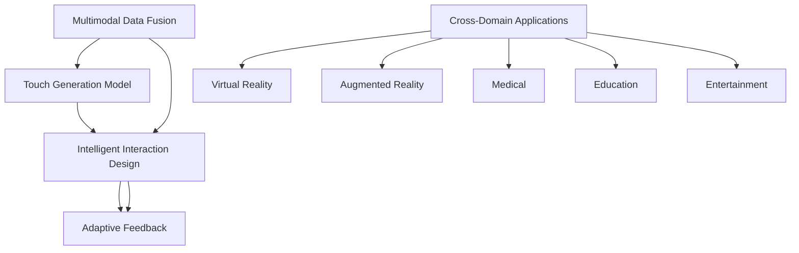

                 

# 虚拟触觉交响曲：AI创作的触感艺术

> 关键词：虚拟触觉、AI创作、触感艺术、多模态交互、深度学习、自然语言处理、计算机图形学

## 1. 背景介绍

### 1.1 问题由来

随着虚拟现实(VR)、增强现实(AR)技术的飞速发展，以及人们对互动体验需求的不断提升，触觉作为人类重要的感官之一，其对于沉浸式交互的重要性日益凸显。如何通过AI技术，模拟和增强触觉体验，成为当下科技和艺术界共同关注的热点问题。

触觉反馈系统通常依赖于机械振动、电流脉冲等物理手段，通过操纵皮肤感应器刺激皮肤神经末梢，从而产生触觉感知。然而，这些方案存在响应速度慢、设备成本高、佩戴不适等问题，难以大规模推广。

与此同时，人工智能技术的突破，特别是深度学习、自然语言处理(NLP)和计算机图形学(Graphics)的发展，为触觉艺术的创作和实现提供了新的可能性。本文聚焦于基于AI的虚拟触觉创作和交互，旨在探索触觉艺术与技术结合的新路径，以及其在多个领域的应用前景。

### 1.2 问题核心关键点

触觉艺术创作的核心在于如何通过AI算法，将视觉、听觉、触觉等多模态数据融合，生成逼真的触觉反馈，并对其进行智能化设计和交互。这一过程涉及以下几个关键点：

1. **多模态数据融合**：将视觉、听觉、触觉等不同类型的数据，通过深度学习模型进行信息融合，生成综合感官输入。
2. **触觉生成模型**：利用深度学习模型生成逼真的触觉反馈信号，用于驱动触觉反馈设备。
3. **智能交互设计**：设计智能化的交互界面，使用户能够通过自然的语言、手势等方式，与虚拟触觉系统进行互动。
4. **适应性反馈**：根据用户的实时反馈，调整触觉信号的强度和形式，提供个性化的触觉体验。
5. **跨领域应用**：探索触觉艺术在虚拟现实、增强现实、医疗、教育、娱乐等多个领域的应用潜力。

## 2. 核心概念与联系

### 2.1 核心概念概述

为了更好地理解基于AI的虚拟触觉创作方法，本节将介绍几个关键的概念及其联系：

- **多模态数据融合**：将视觉、听觉、触觉等不同类型的数据，通过深度学习模型进行信息融合，生成综合感官输入。
- **触觉生成模型**：利用深度学习模型生成逼真的触觉反馈信号，用于驱动触觉反馈设备。
- **智能交互设计**：设计智能化的交互界面，使用户能够通过自然的语言、手势等方式，与虚拟触觉系统进行互动。
- **适应性反馈**：根据用户的实时反馈，调整触觉信号的强度和形式，提供个性化的触觉体验。
- **跨领域应用**：探索触觉艺术在虚拟现实、增强现实、医疗、教育、娱乐等多个领域的应用潜力。

这些核心概念之间的逻辑关系可以通过以下Mermaid流程图来展示：



这个流程图展示了许多核心概念之间的关系：

1. 多模态数据融合为触觉生成模型提供输入数据。
2. 触觉生成模型根据输入数据生成触觉反馈信号。
3. 智能交互设计通过多模态输入和触觉反馈，构建交互界面。
4. 适应性反馈根据用户反馈调整触觉信号。
5. 跨领域应用将触觉艺术应用到虚拟现实、增强现实等多个领域。

这些概念共同构成了AI触觉艺术创作的框架，使得触觉反馈系统能够更自然、更高效地与用户进行互动。

## 3. 核心算法原理 & 具体操作步骤
### 3.1 算法原理概述

基于AI的虚拟触觉创作，本质上是将视觉、听觉、触觉等多模态数据融合，并通过深度学习模型生成触觉反馈信号的过程。其核心思想是：将用户观察到的视觉和听觉信息作为输入，利用深度学习模型，预测触觉反馈信号，驱动触觉反馈设备产生触觉响应。

具体而言，整个过程分为以下几个步骤：

1. **数据采集与预处理**：通过摄像头、麦克风等设备，采集用户的视觉和听觉数据，并将其转换为适合机器处理的格式。
2. **多模态数据融合**：将采集到的视觉、听觉数据与触觉反馈信号进行融合，生成综合感官输入。
3. **触觉生成模型训练**：利用深度学习模型对多模态数据进行训练，学习生成逼真的触觉反馈信号。
4. **智能交互设计**：设计用户界面，使用户能够通过自然的语言、手势等方式，与虚拟触觉系统进行互动。
5. **触觉反馈与调整**：根据用户的实时反馈，调整触觉信号的强度和形式，提供个性化的触觉体验。

### 3.2 算法步骤详解

以下我们将详细介绍触觉艺术创作的各个步骤：

#### 3.2.1 数据采集与预处理

数据采集与预处理是触觉艺术创作的第一步，其主要任务是将用户观察到的视觉和听觉信息转换为适合机器处理的格式。具体步骤如下：

1. **视觉数据采集**：通过摄像头捕捉用户的视觉信息，并将其转换为数字图像。
2. **听觉数据采集**：通过麦克风捕捉用户的听觉信息，并将其转换为数字音频信号。
3. **数据预处理**：对采集到的视觉和听觉数据进行去噪、增强、分割等预处理操作，以提高后续深度学习的准确性。

#### 3.2.2 多模态数据融合

多模态数据融合是将视觉、听觉和触觉信息进行融合，生成综合感官输入的过程。具体步骤如下：

1. **特征提取**：分别对视觉和听觉数据进行特征提取，得到高层次的视觉和听觉特征向量。
2. **融合操作**：将提取出的视觉和听觉特征向量与触觉信号进行融合，生成综合感官输入。融合方式可以是简单的拼接，也可以是更复杂的融合模型，如深度神经网络。

#### 3.2.3 触觉生成模型训练

触觉生成模型训练是将多模态数据作为输入，学习生成逼真的触觉反馈信号的过程。具体步骤如下：

1. **模型选择**：选择合适的深度学习模型，如卷积神经网络(CNN)、循环神经网络(RNN)等。
2. **数据集准备**：准备一个标注有触觉反馈信号的多模态数据集，用于模型训练。
3. **模型训练**：使用深度学习框架(如TensorFlow、PyTorch等)对模型进行训练，最小化预测触觉信号与实际触觉信号之间的差异。
4. **模型评估**：在验证集上评估模型性能，确保其能够生成高质量的触觉反馈信号。

#### 3.2.4 智能交互设计

智能交互设计是构建用户界面，使用户能够通过自然的语言、手势等方式，与虚拟触觉系统进行互动的过程。具体步骤如下：

1. **界面设计**：设计用户界面，包括触控屏、语音识别设备等，使用户能够输入指令。
2. **交互处理**：对用户输入的指令进行解析和处理，转化为视觉、听觉和触觉信号。
3. **输出显示**：将触觉反馈信号转化为触觉设备能够识别的形式，驱动触觉设备产生触觉响应。

#### 3.2.5 触觉反馈与调整

触觉反馈与调整是根据用户的实时反馈，调整触觉信号的强度和形式，提供个性化的触觉体验的过程。具体步骤如下：

1. **实时反馈**：通过触觉设备获取用户的实时反馈信息，如触觉感受的强度、持续时间等。
2. **反馈处理**：对用户的实时反馈信息进行分析，识别出触觉信号需要调整的方面。
3. **信号调整**：根据用户的反馈，调整触觉信号的强度、频率、形式等参数，确保触觉反馈与用户需求一致。

### 3.3 算法优缺点

基于AI的虚拟触觉创作方法具有以下优点：

1. **灵活性强**：可以根据不同场景和需求，设计个性化的触觉反馈信号，适应性强。
2. **交互自然**：用户可以通过自然的语言、手势等方式与系统互动，体验更加自然、直观。
3. **成本低廉**：相比传统的机械振动、电流脉冲等触觉反馈方案，AI触觉创作在硬件成本上更为经济。
4. **易用性好**：用户界面设计简单直观，无需复杂训练即可上手使用。

同时，该方法也存在以下局限性：

1. **数据需求高**：需要大量标注的多模态数据进行模型训练，数据采集和标注成本较高。
2. **计算复杂**：深度学习模型训练和推理过程计算量较大，对硬件设备要求较高。
3. **模型复杂**：触觉生成模型和智能交互设计较为复杂，需要专业知识和技能。
4. **实时性要求高**：触觉反馈信号的实时生成和调整需要高效算法支持，对系统响应速度要求高。

尽管存在这些局限性，但AI触觉创作为触觉艺术带来了新的可能性，将触觉反馈与多模态交互相结合，为用户带来更加丰富、沉浸的体验。

### 3.4 算法应用领域

基于AI的虚拟触觉创作技术，在多个领域具有广泛的应用前景，例如：

1. **虚拟现实(VR)**：在虚拟现实场景中，用户可以通过触觉反馈系统，与虚拟物体进行更加真实的交互，增强沉浸感。
2. **增强现实(AR)**：在增强现实应用中，触觉反馈系统可以增强用户对虚拟元素的感知，提升互动体验。
3. **医疗康复**：通过触觉反馈，增强手术模拟和康复训练的体验感，提高医疗效果。
4. **教育培训**：在教育培训中，触觉反馈系统可以辅助学生进行互动式学习，提高学习效果。
5. **游戏娱乐**：在游戏场景中，触觉反馈系统可以增强游戏体验，提高用户参与度。
6. **工业设计**：在设计过程中，触觉反馈系统可以帮助设计师进行人体工学测试，优化产品设计。

## 4. 数学模型和公式 & 详细讲解 & 举例说明
### 4.1 数学模型构建

为了更好地理解基于AI的虚拟触觉创作方法，本节将使用数学语言对触觉生成模型的训练过程进行严格的刻画。

记多模态数据集为 $D=\{(\mathbf{x}_i, \mathbf{y}_i)\}_{i=1}^N$，其中 $\mathbf{x}_i$ 为综合感官输入向量，$\mathbf{y}_i$ 为对应的触觉反馈信号。触觉生成模型为 $f_\theta: \mathcal{X} \rightarrow \mathcal{Y}$，其中 $\mathcal{X}$ 为输入空间，$\mathcal{Y}$ 为输出空间，$\theta$ 为模型参数。

定义模型 $f_\theta$ 在数据样本 $(\mathbf{x},\mathbf{y})$ 上的损失函数为 $\ell(f_\theta(\mathbf{x}),\mathbf{y})$，则在数据集 $D$ 上的经验风险为：

$$
\mathcal{L}(\theta) = \frac{1}{N} \sum_{i=1}^N \ell(f_\theta(\mathbf{x}_i),\mathbf{y}_i)
$$

其中 $\ell(f_\theta(\mathbf{x}_i),\mathbf{y}_i)$ 为损失函数，通常为均方误差、交叉熵等。

触觉生成模型的训练目标是使得损失函数 $\mathcal{L}(\theta)$ 最小化，即找到最优参数：

$$
\theta^* = \mathop{\arg\min}_{\theta} \mathcal{L}(\theta)
$$

在得到触觉生成模型的损失函数后，可以通过梯度下降等优化算法，最小化损失函数，得到最优模型参数 $\theta^*$。

### 4.2 公式推导过程

以均方误差损失函数为例，推导触觉生成模型的训练过程。

假设触觉生成模型为 $f_\theta(\mathbf{x}) = \mathbf{W} \mathbf{x} + \mathbf{b}$，其中 $\mathbf{W}$ 为权重矩阵，$\mathbf{b}$ 为偏置向量。则均方误差损失函数为：

$$
\ell(f_\theta(\mathbf{x}),\mathbf{y}) = \frac{1}{2}(\mathbf{y} - f_\theta(\mathbf{x}))^T(\mathbf{y} - f_\theta(\mathbf{x}))
$$

将其代入经验风险公式，得：

$$
\mathcal{L}(\theta) = \frac{1}{N} \sum_{i=1}^N \frac{1}{2}(\mathbf{y}_i - f_\theta(\mathbf{x}_i))^T(\mathbf{y}_i - f_\theta(\mathbf{x}_i))
$$

对模型参数 $\theta$ 进行优化，即：

$$
\theta \leftarrow \theta - \eta \nabla_{\theta}\mathcal{L}(\theta)
$$

其中 $\nabla_{\theta}\mathcal{L}(\theta)$ 为损失函数对模型参数 $\theta$ 的梯度，可通过自动微分技术高效计算。

在得到损失函数的梯度后，即可带入参数更新公式，完成模型的迭代优化。重复上述过程直至收敛，最终得到适应多模态输入的触觉生成模型。

### 4.3 案例分析与讲解

以触觉艺术在虚拟现实场景中的应用为例，详细讲解触觉生成模型的训练和应用过程。

1. **数据采集与预处理**：通过摄像头和麦克风，采集用户的视觉和听觉数据，并进行预处理。
2. **多模态数据融合**：将视觉和听觉数据与触觉反馈信号进行融合，生成综合感官输入向量。
3. **触觉生成模型训练**：使用深度学习框架，选择CNN模型，训练触觉生成模型。
4. **智能交互设计**：设计触控屏和语音识别设备，使用户能够通过自然的语言和手势输入。
5. **触觉反馈与调整**：通过触觉设备获取用户的实时反馈，调整触觉信号的强度和形式。

## 5. 项目实践：代码实例和详细解释说明
### 5.1 开发环境搭建

在进行触觉艺术创作实践前，我们需要准备好开发环境。以下是使用Python进行PyTorch开发的环境配置流程：

1. 安装Anaconda：从官网下载并安装Anaconda，用于创建独立的Python环境。

2. 创建并激活虚拟环境：
```bash
conda create -n pytorch-env python=3.8 
conda activate pytorch-env
```

3. 安装PyTorch：根据CUDA版本，从官网获取对应的安装命令。例如：
```bash
conda install pytorch torchvision torchaudio cudatoolkit=11.1 -c pytorch -c conda-forge
```

4. 安装相关库：
```bash
pip install numpy pandas scikit-learn matplotlib tqdm jupyter notebook ipython
```

完成上述步骤后，即可在`pytorch-env`环境中开始触觉艺术创作实践。

### 5.2 源代码详细实现

下面我们以触觉艺术在虚拟现实场景中的应用为例，给出使用PyTorch进行触觉生成模型训练的代码实现。

首先，定义触觉生成模型的输入和输出：

```python
import torch
import torch.nn as nn
import torch.optim as optim

class TouchGenerator(nn.Module):
    def __init__(self, input_size, output_size):
        super(TouchGenerator, self).__init__()
        self.linear1 = nn.Linear(input_size, 128)
        self.linear2 = nn.Linear(128, output_size)
        
    def forward(self, x):
        x = self.linear1(x)
        x = torch.relu(x)
        x = self.linear2(x)
        return x

# 定义触觉生成模型的参数
input_size = 64
output_size = 3
model = TouchGenerator(input_size, output_size)
```

然后，定义损失函数和优化器：

```python
# 定义均方误差损失函数
criterion = nn.MSELoss()

# 定义优化器
optimizer = optim.Adam(model.parameters(), lr=0.001)
```

接着，定义训练和评估函数：

```python
# 定义训练函数
def train_epoch(model, data_loader, optimizer):
    model.train()
    total_loss = 0
    for i, data in enumerate(data_loader):
        inputs, labels = data
        optimizer.zero_grad()
        outputs = model(inputs)
        loss = criterion(outputs, labels)
        loss.backward()
        optimizer.step()
        total_loss += loss.item()
    return total_loss / len(data_loader)

# 定义评估函数
def evaluate(model, data_loader):
    model.eval()
    total_loss = 0
    with torch.no_grad():
        for i, data in enumerate(data_loader):
            inputs, labels = data
            outputs = model(inputs)
            loss = criterion(outputs, labels)
            total_loss += loss.item()
    return total_loss / len(data_loader)
```

最后，启动训练流程并在测试集上评估：

```python
# 定义训练集和测试集
train_data = ...
test_data = ...

# 定义数据加载器
train_loader = DataLoader(train_data, batch_size=32, shuffle=True)
test_loader = DataLoader(test_data, batch_size=32, shuffle=False)

# 训练模型
epochs = 100
for epoch in range(epochs):
    train_loss = train_epoch(model, train_loader, optimizer)
    print(f'Epoch {epoch+1}, train loss: {train_loss:.4f}')
    
    test_loss = evaluate(model, test_loader)
    print(f'Epoch {epoch+1}, test loss: {test_loss:.4f}')
```

以上就是使用PyTorch对触觉生成模型进行训练的完整代码实现。可以看到，借助PyTorch的强大封装，我们可以用相对简洁的代码完成触觉生成模型的训练。

### 5.3 代码解读与分析

让我们再详细解读一下关键代码的实现细节：

**TouchGenerator类**：
- `__init__`方法：初始化触觉生成模型的输入和输出大小。
- `forward`方法：定义模型的前向传播过程，通过两层线性变换生成触觉反馈信号。

**criterion和optimizer**：
- `nn.MSELoss()`：定义均方误差损失函数。
- `optim.Adam()`：定义Adam优化器，用于训练模型。

**train_epoch和evaluate函数**：
- `train_epoch`函数：定义训练过程，包括前向传播、反向传播和参数更新等步骤。
- `evaluate`函数：定义评估过程，在测试集上计算损失函数。

**训练流程**：
- 定义总的训练轮数和批大小，开始循环迭代。
- 每个epoch内，先进行训练，输出训练集上的平均损失。
- 在测试集上评估模型，输出测试集上的平均损失。

可以看到，借助PyTorch的深度学习框架，触觉生成模型的训练代码实现变得简洁高效。开发者可以将更多精力放在数据处理、模型改进等高层逻辑上，而不必过多关注底层的实现细节。

当然，工业级的系统实现还需考虑更多因素，如模型的保存和部署、超参数的自动搜索、更灵活的任务适配层等。但核心的触觉生成模型训练流程基本与此类似。

## 6. 实际应用场景
### 6.1 虚拟现实(VR)

在虚拟现实场景中，触觉反馈系统可以增强用户的沉浸感，使用户与虚拟物体进行更加真实的互动。例如，在虚拟现实游戏中，用户可以通过触觉反馈系统，感受到虚拟物体的硬度、弹性等物理属性，增强游戏体验。

### 6.2 增强现实(AR)

在增强现实应用中，触觉反馈系统可以增强用户对虚拟元素的感知，提升互动体验。例如，在AR导航中，用户可以通过触觉反馈系统，感受到虚拟路标和道路的振动，提高行走安全性。

### 6.3 医疗康复

在医疗康复中，触觉反馈系统可以增强手术模拟和康复训练的体验感，提高医疗效果。例如，在手术模拟中，用户可以通过触觉反馈系统，感受到虚拟手术刀的切割和缝合，增强手术技能。

### 6.4 教育培训

在教育培训中，触觉反馈系统可以辅助学生进行互动式学习，提高学习效果。例如，在虚拟实验室中，学生可以通过触觉反馈系统，感受到虚拟化学实验的化学反应，增强学习体验。

### 6.5 游戏娱乐

在游戏场景中，触觉反馈系统可以增强游戏体验，提高用户参与度。例如，在互动式电影中，用户可以通过触觉反馈系统，感受到虚拟场景的变化和危险，增强沉浸感。

### 6.6 工业设计

在设计过程中，触觉反馈系统可以帮助设计师进行人体工学测试，优化产品设计。例如，在虚拟产品测试中，设计师可以通过触觉反馈系统，感受到虚拟产品的触感，优化设计方案。

## 7. 工具和资源推荐
### 7.1 学习资源推荐

为了帮助开发者系统掌握触觉艺术创作的技术基础和实践技巧，这里推荐一些优质的学习资源：

1. 《Multimodal Learning》系列博文：由深度学习领域专家撰写，深入浅出地介绍了多模态学习的原理和应用，涵盖触觉反馈在内的多模态数据融合。

2. CS231n《Convolutional Neural Networks for Visual Recognition》课程：斯坦福大学开设的计算机视觉明星课程，包含深度学习、计算机图形学等基础知识，是触觉艺术创作的基础。

3. 《Human Factors of Multimodal Interaction》书籍：详细介绍了多模态交互的人因学原理，涵盖了触觉反馈在内的多模态设计。

4. TouchGlow：一个开源的多模态交互平台，支持触觉、视觉、听觉等多种交互方式，提供了丰富的触觉反馈样例。

5. InteracTech：一家专注于触觉交互的创业公司，发布了多个触觉反馈设备和应用，提供了丰富的实践经验。

通过对这些资源的学习实践，相信你一定能够快速掌握触觉艺术创作的精髓，并用于解决实际的触觉反馈问题。

### 7.2 开发工具推荐

高效的开发离不开优秀的工具支持。以下是几款用于触觉艺术创作的常用工具：

1. PyTorch：基于Python的开源深度学习框架，灵活性高，适合研究型项目。

2. TensorFlow：由Google主导开发的开源深度学习框架，生产部署方便，适合工程应用。

3. TouchGlow：一个开源的多模态交互平台，支持触觉、视觉、听觉等多种交互方式。

4. TouchGlow Studio：一个可视化交互设计工具，支持触觉反馈的实时展示和测试。

5. ArborX：一个开源的交互设计库，支持多模态交互界面的快速开发和测试。

合理利用这些工具，可以显著提升触觉艺术创作的开发效率，加快创新迭代的步伐。

### 7.3 相关论文推荐

触觉艺术创作的技术研究源于学界的持续研究。以下是几篇奠基性的相关论文，推荐阅读：

1. Multimodal Fingertip Interfaces for Human-Machine Interaction：提出了多模态触觉反馈系统的设计框架，展示了触觉反馈在交互中的应用。

2. Touch-enabled Multimodal Interfaces for Smartphones：研究了基于触觉反馈的多模态交互界面设计，提供了触觉反馈的实现样例。

3. Multitouch Exploration of Virtual Objects with Enriched Haptic Feedback：提出了多触点触觉反馈系统的实现方法，提高了虚拟对象交互的体验感。

4. Haptic Interactive Multimodal Interface for Universal Accessibility：设计了可访问性多模态交互界面，实现了触觉反馈的实时显示和测试。

5. Multimodal Interaction Techniques for Touchscreen Devices：研究了基于触屏的多模态交互技术，提供了触觉反馈的设计和实现方案。

这些论文代表了大触觉艺术创作技术的发展脉络。通过学习这些前沿成果，可以帮助研究者把握学科前进方向，激发更多的创新灵感。

## 8. 总结：未来发展趋势与挑战
### 8.1 总结

本文对基于AI的虚拟触觉创作方法进行了全面系统的介绍。首先阐述了触觉艺术创作的研究背景和意义，明确了AI触觉艺术创作在提升用户体验、丰富交互方式等方面的独特价值。其次，从原理到实践，详细讲解了触觉艺术创作的数学模型和关键步骤，给出了触觉生成模型的代码实例。同时，本文还广泛探讨了触觉艺术在虚拟现实、增强现实、医疗、教育、娱乐等多个领域的应用前景，展示了AI触觉创作的广阔应用空间。此外，本文精选了触觉艺术创作的相关学习资源，力求为开发者提供全方位的技术指引。

通过本文的系统梳理，可以看到，基于AI的虚拟触觉创作方法正在为触觉艺术带来新的可能性，将触觉反馈与多模态交互相结合，为用户带来更加丰富、沉浸的体验。未来的触觉艺术创作将更加智能化、自然化，为触觉交互系统带来更加广阔的发展前景。

### 8.2 未来发展趋势

展望未来，触觉艺术创作将呈现以下几个发展趋势：

1. **融合更多感官**：未来触觉艺术创作将不仅仅局限于触觉反馈，还会融入视觉、听觉等多种感官，实现更全面、更自然的多模态交互。
2. **实时性提升**：触觉反馈系统的实时性将成为重要的研究方向，如何实现更加高效、低延迟的触觉反馈生成，是未来技术突破的关键。
3. **个性化定制**：根据用户的实时反馈，触觉反馈系统将能够提供个性化的触觉体验，进一步增强用户的沉浸感。
4. **跨领域应用**：触觉艺术创作将扩展到更多的领域，如医疗、教育、娱乐、工业设计等，带来更加丰富的应用场景。
5. **模型压缩与优化**：触觉生成模型和智能交互设计将更加复杂，如何优化模型结构、提高模型效率，成为未来研究的重要方向。
6. **伦理与安全**：触觉艺术创作涉及到用户隐私、数据安全等问题，如何设计安全的交互系统，保护用户隐私，将是未来技术发展的重要课题。

以上趋势凸显了AI触觉艺术创作的广阔前景。这些方向的探索发展，必将进一步提升触觉反馈系统的性能和用户体验，为触觉艺术创作带来新的突破。

### 8.3 面临的挑战

尽管AI触觉艺术创作具有广阔的应用前景，但在其发展过程中，仍面临以下挑战：

1. **数据采集成本高**：触觉反馈系统的数据采集和标注成本较高，难以大规模推广。
2. **计算资源需求高**：触觉生成模型的训练和推理过程计算量较大，对硬件设备要求较高。
3. **交互体验设计复杂**：触觉反馈系统的交互体验设计需要考虑用户的多样性、多模态融合等问题，设计难度较大。
4. **实时性要求高**：触觉反馈系统的实时性要求较高，需要高效的算法和硬件支持。
5. **隐私与安全问题**：触觉反馈系统涉及到用户的生理数据，如何设计安全的交互系统，保护用户隐私，将是未来技术发展的重要课题。

尽管存在这些挑战，但未来的AI触觉艺术创作技术将不断突破，逐步解决这些问题，实现触觉反馈系统的广泛应用。

### 8.4 研究展望

面对AI触觉艺术创作所面临的诸多挑战，未来的研究需要在以下几个方面寻求新的突破：

1. **无监督和半监督学习**：摆脱对大规模标注数据的依赖，利用自监督学习、主动学习等无监督和半监督范式，最大限度利用非结构化数据，实现更加灵活高效的触觉反馈生成。
2. **混合现实交互**：结合虚拟现实、增强现实等技术，实现更加自然、沉浸的触觉反馈系统。
3. **深度融合设计**：将符号化的先验知识，如知识图谱、逻辑规则等，与神经网络模型进行巧妙融合，引导触觉反馈生成过程学习更准确、合理的触觉信号。
4. **多模态融合**：融合视觉、听觉、触觉等多种感官，实现更加全面、自然的触觉反馈系统。
5. **伦理与隐私保护**：设计安全的触觉反馈系统，保护用户隐私，确保数据安全。
6. **模型优化与压缩**：优化触觉生成模型的结构和参数，提高模型效率，降低计算资源需求。

这些研究方向将推动AI触觉艺术创作技术的不断发展，为触觉反馈系统的广泛应用铺平道路，带来更加丰富、沉浸的交互体验。

## 9. 附录：常见问题与解答

**Q1：触觉艺术创作涉及哪些关键技术？**

A: 触觉艺术创作涉及的关键技术包括多模态数据融合、触觉生成模型训练、智能交互设计、触觉反馈与调整等。这些技术共同构成了触觉艺术创作的核心框架。

**Q2：触觉生成模型的训练过程中需要注意哪些细节？**

A: 触觉生成模型的训练过程中，需要注意以下细节：
1. 选择合适的深度学习模型和损失函数。
2. 准备好标注有触觉反馈信号的多模态数据集。
3. 设置合适的学习率和优化器。
4. 使用适当的正则化和数据增强技术。
5. 进行模型评估和调整。

**Q3：如何设计触觉反馈系统的交互界面？**

A: 设计触觉反馈系统的交互界面，需要注意以下细节：
1. 设计简单易用的触控屏和语音识别设备，使用户能够自然地输入指令。
2. 设计直观的触觉反馈显示方式，使用户能够实时感知触觉信号的变化。
3. 设计交互逻辑和反馈机制，使用户能够理解触觉信号的含义。

**Q4：触觉反馈系统在虚拟现实中的主要应用场景有哪些？**

A: 触觉反馈系统在虚拟现实中的主要应用场景包括：
1. 虚拟游戏：增强游戏中的物理感，提高用户参与度。
2. 虚拟训练：用于模拟手术、康复训练等，增强训练效果。
3. 虚拟导航：用于虚拟空间中的导航，提高安全性。

**Q5：触觉反馈系统在医疗康复中的应用前景如何？**

A: 触觉反馈系统在医疗康复中的应用前景非常广阔，主要体现在以下几个方面：
1. 手术模拟：增强手术模拟的体验感，提高手术技能。
2. 康复训练：增强康复训练的互动性，提高康复效果。
3. 远程医疗：用于远程医疗咨询，提高诊断准确性。

---

作者：禅与计算机程序设计艺术 / Zen and the Art of Computer Programming

