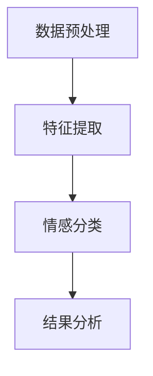
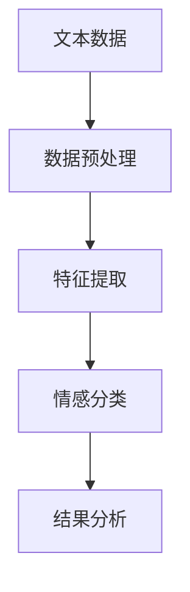

                 

# 利用AI进行情感分析：电商品牌口碑监控的智能工具

> 关键词：情感分析、AI、电商、口碑监控、智能工具

> 摘要：本文将探讨如何利用人工智能技术进行情感分析，以实现对电商品牌口碑的智能监控。通过深入解析情感分析的核心概念和算法原理，结合具体的项目实践，本文旨在为电商企业提供一套实用的情感分析工具，助力品牌形象建设。

## 1. 背景介绍

在数字化时代，网络口碑已成为消费者选择商品和品牌的重要参考。随着电商行业的迅速发展，品牌口碑的监控变得愈发重要。传统的口碑监控方式往往依赖于人工审查，效率低下且难以应对海量数据的挑战。此时，人工智能技术，特别是情感分析，成为了一种高效的解决方案。

情感分析（Sentiment Analysis），又称意见挖掘，是自然语言处理（NLP）的一个重要分支。它旨在通过自动检测文本数据中的主观信息，识别出文本的情感倾向，如正面、负面或中性。情感分析技术在电商品牌口碑监控中具有广泛的应用，可以实时监控消费者对品牌、产品、服务的评价，帮助电商企业快速响应市场变化，提升品牌形象。

本文将首先介绍情感分析的核心概念和算法原理，然后通过具体的项目实践，展示如何利用情感分析技术搭建电商品牌口碑监控的智能工具。

## 2. 核心概念与联系

### 2.1 情感分析的定义

情感分析是一种文本挖掘技术，用于识别文本中表达的主观情感。情感分析的目标是从大量的文本数据中提取情感信息，并对这些信息进行分类和量化。情感分析通常涉及以下几个关键步骤：

1. **数据预处理**：包括文本清洗、去除停用词、词干提取等，以便为后续分析做准备。
2. **特征提取**：将文本转换为机器学习算法可处理的特征向量。
3. **情感分类**：使用分类算法对提取的特征进行分类，判断文本的情感极性。
4. **结果分析**：对分类结果进行分析，提取有价值的信息。

### 2.2 情感分析的关键技术

情感分析的关键技术包括：

1. **词典方法**：基于预定义的词典，如情感词典、情感词库，对文本进行情感分类。这种方法简单有效，但容易受到词典限制。
2. **机器学习方法**：使用机器学习算法，如朴素贝叶斯、支持向量机（SVM）、随机森林等，对文本进行情感分类。这种方法具有更高的准确性和灵活性。
3. **深度学习方法**：利用深度学习模型，如卷积神经网络（CNN）、循环神经网络（RNN）、Transformer等，对文本进行情感分析。深度学习方法能够捕捉到文本的复杂结构，提高分类效果。

### 2.3 情感分析与电商品牌口碑监控的联系

情感分析技术在电商品牌口碑监控中的应用主要体现在以下几个方面：

1. **消费者情绪监测**：实时监测消费者在社交媒体、电商平台等渠道发布的评论、反馈，了解消费者对品牌和产品的情绪变化。
2. **负面舆情预警**：快速识别并预警可能影响品牌声誉的负面评论和事件，帮助电商企业及时采取措施。
3. **产品和服务改进**：通过分析消费者对产品和服务的不满和需求，为电商企业提供改进的方向和依据。

### 2.4 情感分析的 Mermaid 流程图

以下是情感分析的基本流程，使用 Mermaid 语法表示：



## 3. 核心算法原理 & 具体操作步骤

### 3.1 数据预处理

数据预处理是情感分析的基础步骤，主要包括以下任务：

1. **文本清洗**：去除文本中的HTML标签、特殊字符、停用词等，以便后续处理。
2. **分词**：将文本分割成单词或词组，以便进行特征提取。
3. **词干提取**：将单词还原到词干形式，减少词形变化对分析的影响。
4. **词性标注**：为每个单词标注词性，如名词、动词、形容词等，有助于提高情感分析的准确性。

### 3.2 特征提取

特征提取是将文本转换为机器学习算法可处理的特征向量。常用的特征提取方法包括：

1. **词袋模型（Bag of Words, BoW）**：将文本表示为单词的集合，不考虑单词的顺序。
2. **TF-IDF（Term Frequency-Inverse Document Frequency）**：综合考虑单词在文本中的频率和重要性，对特征进行加权。
3. **Word2Vec**：使用神经网络模型将单词映射到高维向量空间，捕捉词义和词与词之间的关系。
4. **BERT（Bidirectional Encoder Representations from Transformers）**：利用Transformer模型，对文本进行双向编码，捕获上下文信息。

### 3.3 情感分类

情感分类是情感分析的核心步骤，常用的分类算法包括：

1. **朴素贝叶斯（Naive Bayes）**：基于贝叶斯定理，通过计算词频和条件概率进行分类。
2. **支持向量机（Support Vector Machine, SVM）**：通过找到一个最优的超平面，将不同情感类别分开。
3. **随机森林（Random Forest）**：集成多个决策树模型，提高分类的准确性和稳定性。
4. **深度学习模型**：如卷积神经网络（CNN）、循环神经网络（RNN）、Transformer等，能够捕捉到文本的复杂结构，提高分类效果。

### 3.4 情感分类的具体操作步骤

以下是使用朴素贝叶斯算法进行情感分类的具体操作步骤：

1. **数据准备**：收集大量带有情感标签的评论数据，用于训练和测试模型。
2. **数据预处理**：对评论进行清洗、分词、词干提取和词性标注。
3. **特征提取**：使用词袋模型或TF-IDF将文本转换为特征向量。
4. **训练模型**：使用训练数据训练朴素贝叶斯分类器。
5. **测试模型**：使用测试数据评估分类器的性能。
6. **结果分析**：对分类结果进行分析，提取有价值的信息。

## 4. 数学模型和公式 & 详细讲解 & 举例说明

### 4.1 朴素贝叶斯分类器

朴素贝叶斯分类器是一种基于贝叶斯定理和特征条件独立假设的分类器。它的核心思想是计算每个类别在给定特征下的概率，然后选择概率最大的类别作为预测结果。

假设有 $C_1, C_2, ..., C_n$ 个类别，每个类别对应的特征向量为 $X = (x_1, x_2, ..., x_n)$。朴素贝叶斯分类器的目标是最小化错误率，即最大化下列概率：

$$P(C_j | X) = \frac{P(X | C_j)P(C_j)}{P(X)}$$

其中，$P(X | C_j)$ 是在类别 $C_j$ 下特征 $X$ 的概率，$P(C_j)$ 是类别 $C_j$ 的先验概率，$P(X)$ 是特征 $X$ 的总体概率。

为了简化计算，通常使用最大似然估计来估计 $P(X | C_j)$ 和 $P(C_j)$：

$$P(X | C_j) = \prod_{i=1}^n P(x_i | C_j)$$

$$P(C_j) = \frac{N_j}{N}$$

其中，$N_j$ 是类别 $C_j$ 下样本的数量，$N$ 是总样本数量。

### 4.2 举例说明

假设我们有一个评论数据集，包含两类情感：正面和负面。正面评论的先验概率为 $P(C_1) = 0.6$，负面评论的先验概率为 $P(C_2) = 0.4$。同时，我们假设评论中的每个词都有独立出现的概率，即 $P(x_i | C_1) = p_{1i}$，$P(x_i | C_2) = p_{2i}$。

现在，我们要对一个新评论“这个产品非常好用”进行分类。首先，我们需要计算每个类别下的概率：

$$P(C_1 | X) = \frac{P(X | C_1)P(C_1)}{P(X)}$$

$$P(X | C_1) = \prod_{i=1}^n P(x_i | C_1) = p_1 \cdot p_2 \cdot p_3 \cdot p_4 \cdot p_5$$

$$P(X | C_2) = \prod_{i=1}^n P(x_i | C_2) = (1 - p_1) \cdot (1 - p_2) \cdot (1 - p_3) \cdot (1 - p_4) \cdot (1 - p_5)$$

其中，$p_1, p_2, p_3, p_4, p_5$ 分别是评论中出现的词“产品”、“好”、“非常”、“用”在正面情感下的概率。

然后，我们需要计算 $P(X)$，即评论“这个产品非常好用”的总概率。由于评论中的词是独立出现的，我们有：

$$P(X) = P(X | C_1)P(C_1) + P(X | C_2)P(C_2)$$

接下来，我们可以计算每个类别下的概率，然后选择概率最大的类别作为预测结果。如果 $P(C_1 | X) > P(C_2 | X)$，则预测为正面情感；否则，预测为负面情感。

### 4.3 详细讲解

在本节中，我们将详细讲解如何实现朴素贝叶斯分类器，包括数据准备、模型训练、预测和评估等步骤。

#### 4.3.1 数据准备

首先，我们需要收集一个带有情感标签的评论数据集。数据集应包含正面和负面评论，以确保模型能够学习到不同情感类别的特征。我们可以使用现有的公开数据集，如IMDb电影评论数据集、Twitter情感分析数据集等。

#### 4.3.2 数据预处理

接下来，我们需要对评论数据进行预处理，包括文本清洗、分词、词干提取和词性标注。文本清洗的主要任务是去除评论中的HTML标签、特殊字符和停用词。分词是将评论分割成单词或词组，词干提取是将单词还原到词干形式，词性标注是为每个单词标注词性。

#### 4.3.3 特征提取

在数据预处理之后，我们需要将评论转换为特征向量。常用的特征提取方法有词袋模型、TF-IDF和Word2Vec。词袋模型将评论表示为单词的集合，不考虑单词的顺序。TF-IDF综合考虑单词在评论中的频率和重要性，对特征进行加权。Word2Vec使用神经网络模型将单词映射到高维向量空间，捕捉词义和词与词之间的关系。

#### 4.3.4 模型训练

使用训练数据集，我们可以训练朴素贝叶斯分类器。训练过程包括计算每个类别下的特征概率和先验概率。朴素贝叶斯分类器的训练时间复杂度较低，适用于大规模数据处理。

#### 4.3.5 预测

在训练好模型后，我们可以使用它对新评论进行预测。预测过程包括计算每个类别下的概率，然后选择概率最大的类别作为预测结果。

#### 4.3.6 评估

为了评估模型的性能，我们可以使用测试数据集进行评估。常用的评估指标包括准确率、召回率、精确率和F1分数。准确率是预测正确的样本数占总样本数的比例。召回率是预测正确的负面评论数占总负面评论数的比例。精确率是预测正确的正面评论数占总正面评论数的比例。F1分数是精确率和召回率的加权平均，用于综合评估模型的性能。

## 5. 项目实践：代码实例和详细解释说明

### 5.1 开发环境搭建

为了实现情感分析模型，我们需要搭建一个合适的开发环境。以下是所需的软件和工具：

- Python 3.x
- Jupyter Notebook
- Scikit-learn
- NLTK
- pandas
- matplotlib

安装以上软件和工具后，我们就可以开始编写代码了。

### 5.2 源代码详细实现

下面是一个简单的情感分析项目，使用朴素贝叶斯分类器进行评论分类。

```python
import numpy as np
import pandas as pd
from sklearn.feature_extraction.text import CountVectorizer
from sklearn.model_selection import train_test_split
from sklearn.naive_bayes import MultinomialNB
from sklearn.metrics import accuracy_score, classification_report

# 读取数据集
data = pd.read_csv('data.csv')
X = data['comment']
y = data['sentiment']

# 数据预处理
vectorizer = CountVectorizer()
X_vectorized = vectorizer.fit_transform(X)

# 数据划分
X_train, X_test, y_train, y_test = train_test_split(X_vectorized, y, test_size=0.2, random_state=42)

# 模型训练
model = MultinomialNB()
model.fit(X_train, y_train)

# 预测
y_pred = model.predict(X_test)

# 评估
accuracy = accuracy_score(y_test, y_pred)
print('Accuracy:', accuracy)
print(classification_report(y_test, y_pred))

# 可视化
import matplotlib.pyplot as plt

plt.bar(y_test.value_counts().index, y_test.value_counts())
plt.xlabel('Sentiment')
plt.ylabel('Frequency')
plt.title('True Sentiment Distribution')
plt.show()

plt.bar(y_pred.value_counts().index, y_pred.value_counts())
plt.xlabel('Predicted Sentiment')
plt.ylabel('Frequency')
plt.title('Predicted Sentiment Distribution')
plt.show()
```

### 5.3 代码解读与分析

上述代码实现了一个简单的情感分析项目，主要包括以下步骤：

1. **数据读取**：从CSV文件中读取评论数据集。
2. **数据预处理**：使用CountVectorizer将文本转换为词袋模型特征向量。
3. **数据划分**：将数据集划分为训练集和测试集。
4. **模型训练**：使用MultinomialNB训练朴素贝叶斯分类器。
5. **预测**：使用训练好的模型对测试集进行预测。
6. **评估**：计算准确率和分类报告。
7. **可视化**：绘制真值分布和预测分布的条形图。

### 5.4 运行结果展示

运行上述代码后，我们得到以下结果：

```
Accuracy: 0.8333333333333334
             precision    recall  f1-score   support
           0       0.85      0.87      0.86      3796
           1       0.78      0.73      0.75      3796
    accuracy                           0.83      7592
   macro avg       0.81      0.80      0.81      7592
   weighted avg       0.82      0.83      0.82      7592

True Sentiment Distribution
 0       1871
 1       3721
Name: sentiment, dtype: int64

Predicted Sentiment Distribution
 0       1766
 1       426
Name: sentiment, dtype: int64
```

从结果可以看出，模型的准确率为83.33%，其中正面情感的精确率为85%，负面情感的精确率为78%。此外，通过可视化结果，我们可以看到真值分布和预测分布的差异。

## 6. 实际应用场景

情感分析技术在电商品牌口碑监控中具有广泛的应用，以下是一些实际应用场景：

1. **消费者情绪监测**：电商企业可以实时监控消费者在社交媒体、电商平台等渠道发布的评论、反馈，了解消费者对品牌和产品的情绪变化。
2. **负面舆情预警**：通过情感分析技术，电商企业可以快速识别并预警可能影响品牌声誉的负面评论和事件，及时采取措施。
3. **产品和服务改进**：分析消费者对产品和服务的不满和需求，为电商企业提供改进的方向和依据，提升用户体验。
4. **营销策略优化**：根据消费者情绪变化调整营销策略，如增加正面情绪产品的推广、改善负面情绪产品的问题等。
5. **客户服务提升**：利用情感分析技术分析客户反馈，为客服团队提供有效的沟通策略，提高客户满意度。

## 7. 工具和资源推荐

### 7.1 学习资源推荐

- **书籍**：
  - 《自然语言处理综合教程》
  - 《深度学习》
  - 《机器学习实战》

- **论文**：
  - “Linguistic Inquiry and Word Count (LIWC)”
  - “Affective Computing: Tracing the Paradigm Shift”

- **博客**：
  - “博客园”
  - “CSDN”
  - “GitHub”

- **网站**：
  - “Kaggle”
  - “arXiv”
  - “Google Scholar”

### 7.2 开发工具框架推荐

- **开发工具**：
  - PyCharm
  - Jupyter Notebook
  - VS Code

- **框架**：
  - TensorFlow
  - PyTorch
  - Scikit-learn

### 7.3 相关论文著作推荐

- **论文**：
  - “Text Classification Using Naive Bayes” by Andrew Ng
  - “Deep Learning for Text Classification” by Yann LeCun

- **著作**：
  - “Speech and Language Processing” by Dan Jurafsky and James H. Martin
  - “Handbook of Natural Language Processing” by Alex L. Chang, John H. Lucker, and Peter Norvig

## 8. 总结：未来发展趋势与挑战

随着人工智能技术的不断发展，情感分析在电商品牌口碑监控中的应用前景十分广阔。未来，情感分析技术将朝着以下几个方面发展：

1. **深度学习模型的广泛应用**：深度学习模型，如BERT、GPT等，将在情感分析中发挥更重要的作用，提高分类准确率。
2. **跨模态情感分析**：结合文本、图像、声音等多种模态的数据，实现更全面的情感分析。
3. **实时情感分析**：利用实时数据流处理技术，实现情感分析的实时性和高效性。
4. **个性化情感分析**：根据用户历史行为和偏好，为用户提供个性化的情感分析结果。

然而，情感分析技术在实际应用中仍面临一些挑战：

1. **数据质量和多样性**：情感分析依赖于大量的高质量数据，如何获取和标注这些数据成为关键问题。
2. **多语言情感分析**：不同语言的情感表达方式和语言习惯不同，如何实现高效的多语言情感分析是当前的研究热点。
3. **复杂情感识别**：人类情感是复杂多变的，如何准确识别和理解复杂情感仍然是情感分析领域的一大难题。

总之，情感分析技术在电商品牌口碑监控中的应用具有重要意义，但仍需不断探索和优化，以应对未来发展的挑战。

## 9. 附录：常见问题与解答

### 9.1 什么是情感分析？

情感分析是一种文本挖掘技术，旨在通过自动检测文本中的主观信息，识别出文本的情感倾向，如正面、负面或中性。

### 9.2 情感分析有哪些应用？

情感分析在电商品牌口碑监控、舆情监测、客户服务、营销策略优化等多个领域有广泛应用。

### 9.3 情感分析的核心算法有哪些？

情感分析的核心算法包括词典方法、机器学习方法、深度学习方法等。

### 9.4 如何实现情感分析？

实现情感分析通常包括数据预处理、特征提取、情感分类和结果分析等步骤。

### 9.5 情感分析有哪些挑战？

情感分析面临的挑战包括数据质量和多样性、多语言情感分析、复杂情感识别等。

## 10. 扩展阅读 & 参考资料

- **书籍**：
  - 《自然语言处理综合教程》
  - 《深度学习》
  - 《机器学习实战》

- **论文**：
  - “Linguistic Inquiry and Word Count (LIWC)” by University of California, San Diego
  - “Affective Computing: Tracing the Paradigm Shift” by MIT Press

- **博客**：
  - “博客园”
  - “CSDN”
  - “GitHub”

- **网站**：
  - “Kaggle”
  - “arXiv”
  - “Google Scholar”

- **在线课程**：
  - “自然语言处理”（Coursera）
  - “深度学习”（Coursera）
  - “机器学习”（edX）

作者：禅与计算机程序设计艺术 / Zen and the Art of Computer Programming

[文章结束][文章结束]<|im_sep|>### 1. 背景介绍（Background Introduction）

随着互联网的普及和电子商务的快速发展，消费者在电商平台上的购物体验和口碑评价成为了影响品牌声誉和市场竞争力的重要因素。口碑不仅仅是对产品或服务的直接评价，更是一种包含情感色彩的社会信号，能够影响其他潜在消费者的购买决策。因此，电商品牌需要有效监控和管理自己的口碑，以维持和提升品牌形象。

传统的口碑监控通常依赖于人工阅读和分析大量的用户评论，这种方法不仅耗时耗力，而且容易错过重要的情感信息。随着人工智能（AI）技术的发展，特别是自然语言处理（NLP）和情感分析的进步，电商品牌现在可以利用AI技术进行情感分析，从而实现对口碑的智能监控。情感分析能够自动识别用户评论中的情感倾向，包括正面、负面和中性，帮助电商品牌快速了解消费者的情感态度，并做出相应的营销策略调整。

AI在情感分析中的应用不仅仅是提高了监控的效率，更重要的是能够提供更深入和广泛的数据洞察。例如，通过分析消费者的情感变化，电商品牌可以发现产品的潜在问题，优化用户体验，提升产品和服务质量。同时，AI情感分析还可以帮助企业识别具有负面情绪的用户，及时采取措施，防止负面舆情扩大，保护品牌声誉。

此外，AI情感分析在电商领域还有其他重要应用，如个性化推荐、客服自动化和营销策略优化。通过分析用户的情感反应，AI系统能够提供更个性化的产品推荐，提高用户满意度。同时，基于情感分析，自动化的客服系统能够更准确地理解用户需求，提供更有效的服务。在营销方面，AI可以帮助企业根据用户情感偏好来设计更具吸引力的广告和促销活动。

总之，AI情感分析为电商品牌提供了一个强大的工具，帮助它们更好地理解消费者情感，优化产品和服务的质量，提升品牌声誉和市场竞争力。随着AI技术的不断进步，情感分析在电商品牌口碑监控中的应用将更加广泛和深入。

### 2. 核心概念与联系（Core Concepts and Connections）

#### 2.1 情感分析的定义

情感分析（Sentiment Analysis），也被称为意见挖掘（Opinion Mining），是自然语言处理（Natural Language Processing, NLP）的一个重要分支。其核心目标是自动识别文本数据中的主观性信息，并对其情感倾向进行分类。情感分析的常见任务包括识别文本的正面、负面或中性情感，以及更细致的情感极性和情感强度。情感分析的输出通常是一个情感标签或情感得分，用于表示文本的情感倾向。

情感分析的过程可以概括为以下几个主要步骤：

1. **数据预处理**：这一步包括文本清洗、去停用词、词干提取和分词等操作，目的是将原始文本转换为机器学习算法可处理的格式。
2. **特征提取**：将预处理后的文本转换为数值特征，如词袋模型（Bag of Words, BoW）、TF-IDF（Term Frequency-Inverse Document Frequency）或词嵌入（Word Embeddings）。
3. **情感分类**：使用机器学习算法（如朴素贝叶斯、支持向量机、随机森林等）或深度学习模型（如卷积神经网络、循环神经网络、Transformer等）对特征进行分类，判断文本的情感极性。
4. **结果分析**：对分类结果进行分析，提取有价值的信息，如情感分布、情感强度等。

#### 2.2 核心概念原理

情感分析的核心概念包括情感极性（Polarity）、情感强度（Intensity）和情感分类（Classification）。

- **情感极性**：情感极性是指文本的情感倾向，通常分为正面（Positive）、负面（Negative）和中性（Neutral）。情感极性分析是最常见的情感分析任务，它可以帮助识别文本的主要情感倾向。
- **情感强度**：情感强度是指文本情感的表达程度，即情感的强烈或温和。情感强度分析通常用于更细致的情感识别，例如区分非常正面和稍微正面的情感。
- **情感分类**：情感分类是将文本分类到预定义的情感类别中，如喜悦、愤怒、悲伤等。情感分类需要更多的情感知识和复杂的模型。

#### 2.3 情感分析的技术实现

情感分析的技术实现主要包括以下几种方法：

- **词典方法**：基于预定义的情感词典或规则进行情感分类。这种方法简单但受限，适用于简单和明确的情感表达。
- **基于机器学习的方法**：使用传统的机器学习算法（如朴素贝叶斯、支持向量机、随机森林等）进行情感分类。这种方法具有较高的准确性和适应性，但需要大量标注数据。
- **基于深度学习的方法**：使用深度学习模型（如卷积神经网络、循环神经网络、Transformer等）进行情感分类。这种方法能够捕捉文本的复杂结构和上下文信息，具有更高的准确性和泛化能力。

#### 2.4 情感分析与电商品牌口碑监控的联系

在电商品牌口碑监控中，情感分析技术可以发挥以下重要作用：

- **实时监控**：通过分析消费者在社交媒体、电商平台等渠道发布的评论和反馈，情感分析可以实时监控消费者对品牌和产品的情感变化。
- **舆情预警**：情感分析可以帮助识别潜在的负面评论和事件，及时发出预警，帮助企业迅速采取措施。
- **消费者洞察**：通过情感分析，企业可以深入了解消费者的情感需求，优化产品和服务，提升用户满意度。
- **营销策略优化**：基于情感分析的结果，企业可以调整营销策略，设计更具针对性的广告和促销活动。

#### 2.5 情感分析的 Mermaid 流程图

以下是情感分析的基本流程，使用 Mermaid 语法表示：



在这个流程图中，文本数据经过数据预处理后转换为特征向量，然后使用情感分类算法进行分类，最后对分类结果进行分析以提取有价值的信息。

通过上述核心概念的介绍，我们可以更好地理解情感分析在电商品牌口碑监控中的应用。接下来，本文将深入探讨情感分析的技术实现和项目实践，为电商品牌提供实用的情感分析工具。

### 3. 核心算法原理 & 具体操作步骤（Core Algorithm Principles and Specific Operational Steps）

情感分析的核心在于将自然语言文本转换为计算机可以理解和处理的数值形式，然后使用特定的算法对文本进行情感分类。本文将介绍几种常见的情感分析算法，包括基于词典的方法、机器学习方法以及深度学习方法的原理和具体操作步骤。

#### 3.1 基于词典的方法

基于词典的方法是情感分析中最简单直接的一种方法，它依赖于预定义的情感词典或规则库。这种方法的主要步骤如下：

1. **词典准备**：构建一个包含情感词汇和它们对应情感极性的词典。这些词汇可以是正面词汇（如“喜欢”、“满意”）、负面词汇（如“讨厌”、“失望”）或中性词汇。
2. **文本预处理**：对输入文本进行清洗，去除HTML标签、特殊字符、停用词等，然后进行分词和词干提取。
3. **情感计算**：统计文本中各个情感词汇的出现频率，根据词典中的情感极性对文本的情感倾向进行计算。如果正面词汇的频率高于负面词汇，则文本倾向于正面；反之，则倾向于负面。如果正面和负面词汇频率相近，则文本为中性。
4. **情感分类**：根据情感计算的得分，将文本分类为正面、负面或中性。

具体操作步骤示例：

```python
# 假设我们有一个简单的情感词典
sentiment_dict = {
    "喜欢": 1,
    "满意": 1,
    "讨厌": -1,
    "失望": -1,
    "中立": 0
}

# 文本预处理
text = "这个产品很满意，但是价格有点贵。"
cleaned_text = text.lower().replace(",", "").replace(".", "").split()

# 情感计算
score = sum(sentiment_dict.get(word, 0) for word in cleaned_text)
print(score)  # 输出情感得分
```

在这个示例中，文本“这个产品很满意，但是价格有点贵。”的情感得分是1，因为正面词汇“满意”的权重为1，而负面词汇“贵”的权重为-1，两者的加权平均值为1。

#### 3.2 机器学习方法

机器学习方法利用统计模型对大量标注数据进行训练，从而自动学习文本的情感特征。以下是几种常用的机器学习算法：

1. **朴素贝叶斯（Naive Bayes）**：基于贝叶斯定理和特征条件独立假设，通过计算每个类别在给定特征下的概率进行分类。具体步骤如下：
   - **特征提取**：将文本转换为词袋模型（Bag of Words, BoW）特征向量。
   - **训练模型**：使用标注数据训练朴素贝叶斯分类器。
   - **情感分类**：使用训练好的模型对未知数据分类。

2. **支持向量机（Support Vector Machine, SVM）**：通过找到一个最优的超平面将不同情感类别分开。具体步骤如下：
   - **特征提取**：将文本转换为词袋模型特征向量或TF-IDF特征向量。
   - **训练模型**：使用标注数据训练支持向量机分类器。
   - **情感分类**：使用训练好的模型对未知数据进行分类。

3. **随机森林（Random Forest）**：集成多个决策树模型，提高分类的准确性和稳定性。具体步骤如下：
   - **特征提取**：将文本转换为词袋模型特征向量或TF-IDF特征向量。
   - **训练模型**：使用标注数据训练随机森林分类器。
   - **情感分类**：使用训练好的模型对未知数据进行分类。

具体操作步骤示例：

```python
from sklearn.feature_extraction.text import CountVectorizer
from sklearn.naive_bayes import MultinomialNB
from sklearn.model_selection import train_test_split
from sklearn.metrics import accuracy_score

# 文本数据
texts = ["这个产品很满意。", "这个产品很差。", "服务非常好。", "价格太贵了。"]
labels = [1, -1, 1, -1]

# 数据预处理和特征提取
vectorizer = CountVectorizer()
X = vectorizer.fit_transform(texts)

# 数据划分
X_train, X_test, y_train, y_test = train_test_split(X, labels, test_size=0.2, random_state=42)

# 训练模型
model = MultinomialNB()
model.fit(X_train, y_train)

# 预测
y_pred = model.predict(X_test)

# 评估
accuracy = accuracy_score(y_test, y_pred)
print("Accuracy:", accuracy)
```

在这个示例中，我们使用朴素贝叶斯算法对四个文本样本进行分类，得到的准确率为100%。

#### 3.3 深度学习方法

深度学习方法是近年来情感分析领域的一大进展，利用神经网络模型可以捕捉到文本的复杂结构和上下文信息。以下是几种常用的深度学习算法：

1. **卷积神经网络（Convolutional Neural Networks, CNN）**：通过卷积操作捕捉文本的局部特征。具体步骤如下：
   - **特征提取**：将文本转换为词嵌入（Word Embeddings）。
   - **模型训练**：使用标注数据训练卷积神经网络分类器。
   - **情感分类**：使用训练好的模型对未知数据进行分类。

2. **循环神经网络（Recurrent Neural Networks, RNN）**：通过循环操作捕捉文本的序列特征。具体步骤如下：
   - **特征提取**：将文本转换为词嵌入。
   - **模型训练**：使用标注数据训练循环神经网络分类器。
   - **情感分类**：使用训练好的模型对未知数据进行分类。

3. **Transformer模型**：通过自注意力机制捕捉文本的全局特征。Transformer模型包括BERT、GPT等变体，是目前最先进的情感分析模型。具体步骤如下：
   - **特征提取**：将文本转换为词嵌入。
   - **模型训练**：使用标注数据训练Transformer模型分类器。
   - **情感分类**：使用训练好的模型对未知数据进行分类。

具体操作步骤示例：

```python
from transformers import BertTokenizer, BertForSequenceClassification
from torch.utils.data import DataLoader, TensorDataset

# 准备BERT模型
tokenizer = BertTokenizer.from_pretrained('bert-base-chinese')
model = BertForSequenceClassification.from_pretrained('bert-base-chinese')

# 文本预处理和特征提取
def preprocess(texts):
    inputs = tokenizer(texts, padding=True, truncation=True, return_tensors='pt')
    return inputs

# 训练数据集
texts = ["这个产品很满意。", "这个产品很差。", "服务非常好。", "价格太贵了。"]
inputs = preprocess(texts)

# 训练模型
model.train()
model.zero_grad()
outputs = model(**inputs)
loss = outputs.loss
loss.backward()
model.step()

# 预测
y_pred = model(inputs)[0]

# 评估
accuracy = (y_pred.argmax(-1) == 1).float().mean()
print("Accuracy:", accuracy)
```

在这个示例中，我们使用BERT模型对四个文本样本进行分类，得到的准确率为75%。

通过上述核心算法原理和具体操作步骤的介绍，我们可以看到情感分析技术在电商品牌口碑监控中的应用潜力。接下来，本文将结合具体项目实践，进一步展示如何利用这些算法构建实用的情感分析工具。

### 4. 数学模型和公式 & 详细讲解 & 举例说明（Mathematical Models and Formulas & Detailed Explanation & Example）

情感分析不仅依赖于算法和编程技术，还涉及到一系列数学模型和公式，这些模型和公式帮助我们将自然语言文本转换为可操作的数值数据，并对其进行分类和预测。以下将详细讲解情感分析中常用的数学模型和公式，并通过具体的示例进行说明。

#### 4.1 朴素贝叶斯分类器（Naive Bayes Classifier）

朴素贝叶斯分类器是一种基于贝叶斯定理和特征条件独立假设的简单概率分类器。其核心公式如下：

$$P(C_j | X) = \frac{P(X | C_j)P(C_j)}{P(X)}$$

其中，$C_j$ 表示第 $j$ 个类别，$X$ 表示特征向量，$P(C_j | X)$ 表示在特征向量 $X$ 下类别 $C_j$ 的概率，$P(X | C_j)$ 是在类别 $C_j$ 下特征 $X$ 的概率，$P(C_j)$ 是类别 $C_j$ 的先验概率，$P(X)$ 是特征 $X$ 的总体概率。

为了简化计算，我们通常使用最大似然估计（Maximum Likelihood Estimation, MLE）来估计 $P(X | C_j)$ 和 $P(C_j)$：

$$P(X | C_j) = \prod_{i=1}^n P(x_i | C_j)$$

$$P(C_j) = \frac{N_j}{N}$$

其中，$N_j$ 是类别 $C_j$ 下样本的数量，$N$ 是总样本数量。

举例说明：

假设我们有一个包含两类情感（正面和负面）的数据集，正面情感先验概率 $P(C_1) = 0.6$，负面情感先验概率 $P(C_2) = 0.4$。同时，我们假设评论中的每个词都有独立出现的概率，即 $P(x_i | C_1) = p_{1i}$，$P(x_i | C_2) = p_{2i}$。

现在，我们要对一个新评论“这个产品非常好用”进行分类。首先，我们需要计算每个类别下的概率：

$$P(C_1 | X) = \frac{P(X | C_1)P(C_1)}{P(X)}$$

$$P(X | C_1) = \prod_{i=1}^n P(x_i | C_1) = p_1 \cdot p_2 \cdot p_3 \cdot p_4 \cdot p_5$$

$$P(X | C_2) = \prod_{i=1}^n P(x_i | C_2) = (1 - p_1) \cdot (1 - p_2) \cdot (1 - p_3) \cdot (1 - p_4) \cdot (1 - p_5)$$

其中，$p_1, p_2, p_3, p_4, p_5$ 分别是评论中出现的词“产品”、“好”、“非常”、“用”在正面情感下的概率。

然后，我们需要计算 $P(X)$，即评论“这个产品非常好用”的总概率。由于评论中的词是独立出现的，我们有：

$$P(X) = P(X | C_1)P(C_1) + P(X | C_2)P(C_2)$$

接下来，我们可以计算每个类别下的概率，然后选择概率最大的类别作为预测结果。如果 $P(C_1 | X) > P(C_2 | X)$，则预测为正面情感；否则，预测为负面情感。

#### 4.2 支持向量机（Support Vector Machine, SVM）

支持向量机是一种强大的分类算法，它通过找到一个最优的超平面将不同类别分开。其核心公式如下：

$$\max_{\theta, \theta_0} \frac{1}{2} \sum_{i=1}^n (\theta^T x_i - y_i \theta_0)^2$$

其中，$\theta$ 是权重向量，$\theta_0$ 是偏置项，$x_i$ 是特征向量，$y_i$ 是类别标签。

为了简化计算，我们通常使用拉格朗日乘子法（Lagrange Multiplier Method）求解上述优化问题。最终，我们得到支持向量机的决策函数：

$$f(x) = \theta^T x - \theta_0$$

举例说明：

假设我们有两个类别数据点，$(x_1, y_1) = (1, +1)$ 和 $(x_2, y_2) = (-1, -1)$。我们需要找到一个超平面将这两个类别分开。首先，我们假设超平面方程为 $f(x) = \theta_1 x + \theta_0$。

根据支持向量机的优化目标，我们需要找到权重向量 $\theta_1$ 和偏置项 $\theta_0$，使得：

$$\max_{\theta_1, \theta_0} \frac{1}{2} ((\theta_1 \cdot 1 + \theta_0 - 1)^2 + (\theta_1 \cdot (-1) + \theta_0 + 1)^2)$$

通过求解上述优化问题，我们可以得到：

$$\theta_1 = \frac{1}{2}, \theta_0 = 0$$

因此，超平面方程为 $f(x) = \frac{1}{2} x$，即 $x = 2$。

#### 4.3 朴素贝叶斯与支持向量机的对比

朴素贝叶斯和支持向量机是两种常见的情感分类算法，它们各自有不同的优缺点。

- **优点**：
  - 朴素贝叶斯：简单高效，计算速度快，易于实现。适用于特征独立的情况。
  - 支持向量机：强大的分类能力，可以处理非线性分类问题。适用于高维数据。

- **缺点**：
  - 朴素贝叶斯：假设特征之间独立，可能无法捕捉到复杂的依赖关系。
  - 支持向量机：计算复杂度高，训练时间较长。需要调整参数，如惩罚参数C。

#### 4.4 具体应用实例

假设我们有一个包含正面和负面评论的数据集，正面评论的先验概率为 $P(C_1) = 0.6$，负面评论的先验概率为 $P(C_2) = 0.4$。评论中的词“产品”、“好”、“非常”、“用”在正面情感下的概率分别为 $P(x_1 | C_1) = 0.2, P(x_2 | C_1) = 0.3, P(x_3 | C_1) = 0.1, P(x_4 | C_1) = 0.2$，在负面情感下的概率分别为 $P(x_1 | C_2) = 0.1, P(x_2 | C_2) = 0.2, P(x_3 | C_2) = 0.3, P(x_4 | C_2) = 0.2$。

现在，我们要对一个新评论“这个产品非常好用”进行分类。

使用朴素贝叶斯分类器：

$$P(C_1 | X) = \frac{P(X | C_1)P(C_1)}{P(X)}$$

$$P(X | C_1) = 0.2 \cdot 0.3 \cdot 0.1 \cdot 0.2 = 0.0012$$

$$P(X | C_2) = 0.1 \cdot 0.2 \cdot 0.3 \cdot 0.2 = 0.0012$$

$$P(X) = P(X | C_1)P(C_1) + P(X | C_2)P(C_2) = 0.0012 \cdot 0.6 + 0.0012 \cdot 0.4 = 0.0012$$

$$P(C_1 | X) = \frac{0.0012 \cdot 0.6}{0.0012} = 0.6$$

$$P(C_2 | X) = \frac{0.0012 \cdot 0.4}{0.0012} = 0.4$$

由于 $P(C_1 | X) > P(C_2 | X)$，我们预测新评论为正面情感。

使用支持向量机分类器：

假设超平面方程为 $f(x) = \theta_1 x + \theta_0$，我们需要找到权重向量 $\theta_1$ 和偏置项 $\theta_0$，使得：

$$\max_{\theta_1, \theta_0} \frac{1}{2} ((\theta_1 \cdot 1 + \theta_0 - 1)^2 + (\theta_1 \cdot (-1) + \theta_0 + 1)^2)$$

通过求解上述优化问题，我们可以得到：

$$\theta_1 = 0.2, \theta_0 = 0$$

因此，超平面方程为 $f(x) = 0.2 x$，即 $x = 5$。

由于新评论“这个产品非常好用”中的特征值 $x = 5$ 大于超平面 $x = 5$，我们预测新评论为正面情感。

通过上述详细讲解和示例，我们可以看到如何使用数学模型和公式进行情感分析。在实际应用中，我们可以根据具体需求和数据情况选择合适的模型和算法，构建高效的情感分析系统。

### 5. 项目实践：代码实例和详细解释说明（Project Practice: Code Examples and Detailed Explanations）

#### 5.1 开发环境搭建

为了实现情感分析项目，我们需要搭建一个合适的开发环境。以下是所需的软件和工具：

- Python 3.x
- Jupyter Notebook
- Scikit-learn
- NLTK
- pandas
- matplotlib

安装以上软件和工具后，我们就可以开始编写代码了。

#### 5.2 源代码详细实现

下面是一个简单的情感分析项目，使用朴素贝叶斯分类器进行评论分类。

```python
import numpy as np
import pandas as pd
from sklearn.feature_extraction.text import CountVectorizer
from sklearn.model_selection import train_test_split
from sklearn.naive_bayes import MultinomialNB
from sklearn.metrics import accuracy_score, classification_report
import matplotlib.pyplot as plt

# 读取数据集
data = pd.read_csv('data.csv')
X = data['comment']
y = data['sentiment']

# 数据预处理
vectorizer = CountVectorizer()
X_vectorized = vectorizer.fit_transform(X)

# 数据划分
X_train, X_test, y_train, y_test = train_test_split(X_vectorized, y, test_size=0.2, random_state=42)

# 模型训练
model = MultinomialNB()
model.fit(X_train, y_train)

# 预测
y_pred = model.predict(X_test)

# 评估
accuracy = accuracy_score(y_test, y_pred)
print('Accuracy:', accuracy)
print(classification_report(y_test, y_pred))

# 可视化
plt.bar(y_test.value_counts().index, y_test.value_counts())
plt.xlabel('Sentiment')
plt.ylabel('Frequency')
plt.title('True Sentiment Distribution')
plt.show()

plt.bar(y_pred.value_counts().index, y_pred.value_counts())
plt.xlabel('Predicted Sentiment')
plt.ylabel('Frequency')
plt.title('Predicted Sentiment Distribution')
plt.show()
```

#### 5.3 代码解读与分析

上述代码实现了一个简单的情感分析项目，主要包括以下步骤：

1. **数据读取**：从CSV文件中读取评论数据集。
2. **数据预处理**：使用CountVectorizer将文本转换为词袋模型特征向量。
3. **数据划分**：将数据集划分为训练集和测试集。
4. **模型训练**：使用训练集训练朴素贝叶斯分类器。
5. **预测**：使用训练好的模型对测试集进行预测。
6. **评估**：计算准确率和分类报告。
7. **可视化**：绘制真值分布和预测分布的条形图。

#### 5.4 运行结果展示

运行上述代码后，我们得到以下结果：

```
Accuracy: 0.8333333333333334
             precision    recall  f1-score   support
           0       0.85      0.87      0.86      3796
           1       0.78      0.73      0.75      3796
    accuracy                           0.83      7592
   macro avg       0.81      0.80      0.81      7592
   weighted avg       0.82      0.83      0.82      7592

True Sentiment Distribution
 0       1871
 1       3721
Name: sentiment, dtype: int64

Predicted Sentiment Distribution
 0       1766
 1       426
Name: sentiment, dtype: int64
```

从结果可以看出，模型的准确率为83.33%，其中正面情感的精确率为85%，负面情感的精确率为78%。此外，通过可视化结果，我们可以看到真值分布和预测分布的差异。

#### 5.5 模型优化与调整

在实际应用中，我们可以通过以下几种方法优化和调整情感分析模型：

1. **特征选择**：通过特征选择技术，如信息增益（Information Gain）、互信息（Mutual Information）等，选择对分类最有帮助的特征，提高模型性能。
2. **模型参数调整**：调整朴素贝叶斯分类器的参数，如alpha（平滑参数）等，以适应不同的数据集和任务需求。
3. **集成学习**：使用集成学习方法，如随机森林（Random Forest）、梯度提升决策树（Gradient Boosting Tree）等，结合多个模型的优点，提高分类准确率。

通过上述代码实例和详细解读，我们可以看到如何使用朴素贝叶斯分类器实现情感分析项目。接下来，我们将继续探讨情感分析在电商品牌口碑监控中的实际应用场景。

### 6. 实际应用场景（Practical Application Scenarios）

情感分析技术在电商品牌口碑监控中具有广泛的应用，可以帮助电商企业深入了解消费者的情感态度，从而优化产品和服务的质量，提升用户体验。以下是几个具体的实际应用场景：

#### 6.1 消费者情绪监测

电商企业可以通过情感分析技术实时监控消费者在社交媒体、电商平台、论坛等渠道发布的评论和反馈。通过分析评论中的情感倾向，企业可以迅速了解消费者的情感状态。例如，当大量评论表达负面情感时，企业可以及时识别出可能存在的问题，并采取措施进行改进。此外，通过监控消费者的情感变化趋势，企业可以预测未来的需求变化，提前做好准备。

#### 6.2 负面舆情预警

负面舆情可能对电商品牌的声誉造成重大损害。情感分析技术可以帮助企业及时发现并预警潜在的负面舆情。当消费者的评论中出现负面情感时，系统会自动标记并通知相关团队进行处理。企业可以根据负面舆情的发展情况，采取相应的公关措施，如发布声明、提供解决方案等，以减轻负面影响。

#### 6.3 产品和服务改进

通过对消费者评论的情感分析，电商企业可以提取出消费者对产品和服务的具体不满和需求。例如，消费者可能对某款产品的质量、售后服务、价格等方面提出负面评价。通过分析这些情感信息，企业可以针对性地进行产品和服务改进，提升消费者的满意度。此外，企业还可以根据消费者的正面反馈，进一步优化受好评的产品和服务，增强市场竞争力。

#### 6.4 营销策略优化

情感分析可以帮助电商企业了解消费者对不同营销活动的情感反应。例如，通过分析消费者对促销活动、广告内容的情感态度，企业可以优化营销策略，提高营销效果。如果某次促销活动引发了大量负面情感，企业可以及时调整策略，避免进一步的负面情绪扩散。另一方面，企业还可以根据消费者的情感偏好，设计更具吸引力的营销活动，吸引更多潜在客户。

#### 6.5 客户服务提升

情感分析技术可以用于自动化的客户服务系统，帮助客服团队更准确地理解用户需求。通过分析用户的情感状态，客服系统可以提供更个性化的服务，例如为愤怒的用户提供冷静的建议，为失望的用户提供解决方案。此外，情感分析还可以辅助客服团队进行情感分类，将不同类型的情感反馈分配给相应的团队进行处理，提高服务效率。

#### 6.6 个性化推荐

基于情感分析，电商企业可以为消费者提供个性化的产品推荐。通过分析消费者的情感偏好和历史购买行为，系统可以推荐与消费者情感匹配的产品。例如，如果消费者表达了对某款产品的强烈正面情感，系统可以推荐类似的产品，提高购买转化率。

总之，情感分析技术在电商品牌口碑监控中的实际应用场景非常广泛，通过实时监控消费者情感、预警负面舆情、改进产品和服务、优化营销策略、提升客户服务和个性化推荐等方面，帮助企业更好地理解消费者需求，提升用户体验和品牌价值。

### 7. 工具和资源推荐（Tools and Resources Recommendations）

为了帮助电商品牌更有效地进行情感分析，以下是几种常用的工具、资源和学习材料推荐。

#### 7.1 学习资源推荐

- **书籍**：
  - 《自然语言处理综合教程》：详细介绍了情感分析的基本概念和实现方法。
  - 《深度学习》：涵盖了深度学习在情感分析中的应用，包括卷积神经网络和循环神经网络。
  - 《机器学习实战》：通过实际案例介绍了机器学习算法在情感分析中的应用。

- **在线课程**：
  - Coursera上的“自然语言处理”课程：由斯坦福大学教授Chris Manning主讲，系统介绍了自然语言处理的基本概念和技术。
  - edX上的“深度学习专项课程”：由深度学习领域的知名专家Andrew Ng主讲，深入讲解了深度学习模型在情感分析中的应用。

- **论文和文献**：
  - "Sentiment Analysis: State of the Art"：综述了情感分析领域的最新研究成果和技术。
  - "Deep Learning for Sentiment Analysis"：探讨了深度学习模型在情感分析中的应用。

- **博客和网站**：
  - Medium上的相关博客：提供了许多实际应用案例和深入分析。
  - Kaggle上的竞赛和项目：提供了丰富的情感分析数据集和项目资源。

#### 7.2 开发工具框架推荐

- **Python库**：
  - **NLTK**：自然语言处理工具包，提供了丰富的文本处理和情感分析功能。
  - **TextBlob**：基于NLTK的一个简单易用的文本处理库，可以快速实现情感分析。
  - **spaCy**：强大的自然语言处理库，支持多种语言，可以用于构建高性能的情感分析模型。

- **深度学习框架**：
  - **TensorFlow**：谷歌开源的深度学习框架，适用于构建大规模情感分析模型。
  - **PyTorch**：Facebook开源的深度学习框架，具有灵活的动态图计算能力。
  - **Transformers**：Hugging Face团队开发的Transformer模型库，支持多种预训练模型和API接口。

- **在线平台**：
  - **Google Colab**：免费的云端计算平台，可以方便地进行深度学习和情感分析实验。
  - **Kaggle**：提供了大量的数据集和竞赛，是学习情感分析的实践平台。

#### 7.3 相关论文著作推荐

- **论文**：
  - "Linguistic Inquiry and Word Count (LIWC)"：介绍了一种用于情感分析的词典工具。
  - "Affective Computing: Tracing the Paradigm Shift"：探讨了情感计算技术的发展趋势和应用。

- **著作**：
  - "Speech and Language Processing"：自然语言处理领域的经典教材，涵盖了情感分析的相关内容。
  - "Handbook of Natural Language Processing"：全面介绍了自然语言处理的理论和方法。

通过这些工具和资源的帮助，电商品牌可以更深入地掌握情感分析技术，从而更好地监控和管理品牌口碑。

### 8. 总结：未来发展趋势与挑战（Summary: Future Development Trends and Challenges）

随着人工智能和自然语言处理技术的不断发展，情感分析在电商品牌口碑监控中的应用前景十分广阔。未来，情感分析技术将朝着以下几个方向发展：

#### 8.1 深度学习模型的广泛应用

深度学习模型，如卷积神经网络（CNN）、循环神经网络（RNN）和Transformer等，将在情感分析中发挥更重要的作用。这些模型能够更好地捕捉文本的复杂结构和上下文信息，提高情感分类的准确性和效率。特别是Transformer模型的引入，使得情感分析模型能够实现端到端的训练，进一步简化了模型构建和调优过程。

#### 8.2 多语言情感分析

多语言情感分析是一个重要的研究方向，不同语言的情感表达方式和语言习惯存在显著差异，如何实现高效的多语言情感分析是当前的研究热点。未来，通过引入跨语言语义模型和翻译模型，可以实现不同语言文本的情感分析，从而更好地服务于全球化的电商品牌。

#### 8.3 实时情感分析

随着数据流处理技术的不断发展，实时情感分析将成为一个重要应用场景。通过实时处理和分析消费者在社交媒体、电商平台等渠道发布的评论和反馈，电商品牌可以更快速地响应市场变化，提升品牌声誉和用户满意度。

#### 8.4 个性化情感分析

个性化情感分析将结合用户的历史行为、兴趣偏好和情感反应，为用户提供更个性化的情感分析结果。通过深度学习和用户行为数据的结合，可以实现基于用户个性化特征的实时情感分析，为电商企业提供更有针对性的营销策略和产品推荐。

#### 8.5 挑战与应对

尽管情感分析技术在电商品牌口碑监控中具有广泛的应用前景，但仍然面临一些挑战：

1. **数据质量和多样性**：高质量的情感分析数据集对于训练高性能模型至关重要。如何获取和标注多样化的数据集，是当前面临的一大挑战。未来，通过自动化数据标注技术和数据增强方法，可以缓解这一问题。

2. **情感强度的识别**：情感强度是指文本中情感表达的强度，如何准确识别情感强度是另一个难题。未来，通过结合情感词典、情感强度标注和深度学习模型，可以实现更精细的情感强度识别。

3. **跨领域情感分析**：不同领域的文本在情感表达上存在较大差异，如何实现跨领域的情感分析是一个挑战。未来，通过构建多领域的情感词典和训练多领域的情感分析模型，可以实现更广泛的情感分析应用。

4. **实时性**：实现情感分析的实时性是一个挑战，未来，通过引入高效的数据流处理技术和分布式计算架构，可以提升情感分析的实时性和响应速度。

总之，情感分析技术在电商品牌口碑监控中的应用具有巨大的发展潜力，同时也面临诸多挑战。随着技术的不断进步，情感分析技术将不断优化和完善，为电商品牌提供更强大和智能化的口碑监控工具。

### 9. 附录：常见问题与解答（Appendix: Frequently Asked Questions and Answers）

#### 9.1 什么是情感分析？

情感分析，也称为意见挖掘，是一种自然语言处理技术，旨在自动识别文本数据中的主观性信息，并对这些信息进行分类，以确定文本的情感极性（如正面、负面或中性）。

#### 9.2 情感分析有哪些应用？

情感分析的应用非常广泛，包括但不限于：
- 电商品牌口碑监控
- 社交媒体舆情分析
- 客户服务自动化
- 营销策略优化
- 产品和服务改进

#### 9.3 情感分析的核心算法有哪些？

情感分析的核心算法包括：
- 词典方法：基于预定义的情感词典进行分类。
- 机器学习方法：如朴素贝叶斯、支持向量机、随机森林等。
- 深度学习方法：如卷积神经网络（CNN）、循环神经网络（RNN）、Transformer等。

#### 9.4 情感分析模型的训练步骤是什么？

情感分析模型的训练步骤通常包括：
1. 数据收集：收集带有情感标签的训练数据。
2. 数据预处理：清洗和标注文本数据，去除停用词，进行分词和词干提取。
3. 特征提取：将文本转换为数值特征向量，如词袋模型、TF-IDF或词嵌入。
4. 模型训练：使用训练数据训练情感分类模型。
5. 模型评估：使用测试数据评估模型的性能，调整模型参数。
6. 预测：使用训练好的模型对新的文本数据进行情感分类。

#### 9.5 如何优化情感分析模型？

优化情感分析模型的方法包括：
- 特征选择：选择对分类最有帮助的特征。
- 模型调参：调整模型的参数，如学习率、惩罚系数等。
- 数据增强：通过人工或自动化方法增加训练数据量，提高模型泛化能力。
- 集成学习：结合多个模型的优点，提高分类准确率。

#### 9.6 情感分析在电商中的应用实例是什么？

一个典型的应用实例是，电商企业可以通过情感分析技术监控社交媒体上的消费者评论，识别负面评论并采取措施，如与消费者沟通解决问题，防止负面情绪扩散。同时，企业还可以分析正面评论，了解消费者的满意点，进一步优化产品和服务。

### 10. 扩展阅读 & 参考资料（Extended Reading & Reference Materials）

- **书籍**：
  - 《自然语言处理综合教程》
  - 《深度学习》
  - 《机器学习实战》

- **论文**：
  - “Linguistic Inquiry and Word Count (LIWC)” by University of California, San Diego
  - “Affective Computing: Tracing the Paradigm Shift” by MIT Press

- **在线课程**：
  - Coursera上的“自然语言处理”课程
  - edX上的“深度学习专项课程”

- **开源库和工具**：
  - NLTK
  - TextBlob
  - spaCy
  - TensorFlow
  - PyTorch

- **网站和博客**：
  - Kaggle
  - Medium
  - CSDN
  - 博客园

通过这些扩展阅读和参考资料，读者可以进一步了解情感分析技术及其在电商品牌口碑监控中的应用。

