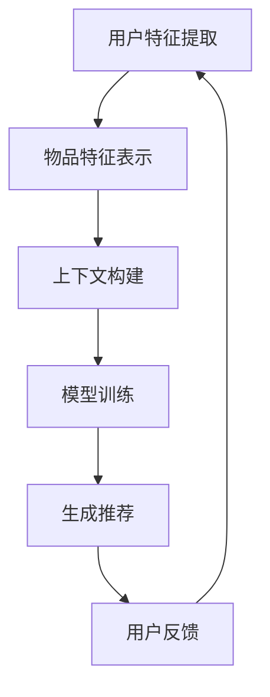

                 

### 文章标题

**利用LLM优化推荐系统的实时个性化推荐**

在数字时代，推荐系统已经成为许多在线平台的关键组成部分，它们通过向用户推荐可能感兴趣的商品、内容和广告，来提升用户体验和平台的价值。随着生成式预训练语言模型（LLM）如GPT-3的出现，利用这些强大的人工智能模型优化推荐系统的可能性变得更加现实。本文将探讨如何利用LLM实现实时个性化推荐，并深入分析其背后的核心概念、算法原理、数学模型以及实际应用。

> **关键词：** 生成式预训练语言模型（LLM）、推荐系统、个性化推荐、实时响应、算法优化

> **摘要：** 本文将介绍生成式预训练语言模型（LLM）在推荐系统中的应用，特别是如何利用LLM实现实时个性化推荐。通过分析LLM的核心概念、算法原理和数学模型，本文将展示如何设计并实现一个基于LLM的推荐系统，从而为用户提供高度相关的推荐结果。同时，文章将讨论在实际应用中可能遇到的问题和挑战，并给出相应的解决方案和未来发展趋势。

### <markdown>## 1. 背景介绍（Background Introduction）</markdown>
推荐系统是一种基于用户历史行为、偏好和上下文信息，向用户推荐相关商品、内容和服务的系统。从传统的基于内容的推荐、协同过滤，到现代的深度学习推荐，推荐系统经历了多次技术革新。然而，传统的推荐系统在实时性和个性化方面存在一定的局限性。随着互联网和大数据技术的发展，用户行为数据日益丰富，如何高效地利用这些数据实现实时个性化推荐成为研究热点。

生成式预训练语言模型（LLM）如GPT-3的出现，为推荐系统带来了新的契机。LLM是一种强大的自然语言处理模型，可以通过学习大量文本数据生成高质量的文本。利用LLM的生成能力，我们可以实现基于自然语言的实时个性化推荐，从而提升用户的推荐体验。

#### <markdown>### 1.1 推荐系统的发展历程</markdown>
推荐系统的发展历程可以分为几个阶段：

1. **基于内容的推荐（Content-Based Recommendation）**：该方法的推荐结果主要依赖于物品的元数据和用户的历史偏好。它的优点是实现简单，但缺点是推荐结果可能过于局限，无法捕捉用户的多样化需求。

2. **协同过滤（Collaborative Filtering）**：协同过滤通过分析用户之间的行为模式，预测用户对未知物品的偏好。它分为基于用户的协同过滤和基于项目的协同过滤。虽然这种方法能够提供更个性化的推荐，但数据稀疏性和冷启动问题限制了其效果。

3. **深度学习推荐（Deep Learning for Recommendation）**：深度学习推荐利用神经网络模型，通过学习用户和物品的特征表示，实现推荐。相比于传统的协同过滤，深度学习推荐在处理高维度数据和复杂数据方面具有优势，但训练时间和计算资源的需求较高。

4. **混合推荐系统（Hybrid Recommendation Systems）**：混合推荐系统结合了多种推荐方法，以取长补短，提高推荐效果。这种方法通常需要复杂的模型设计和优化。

#### <markdown>### 1.2 LLM的优势与挑战</markdown>
LLM的优势在于其强大的生成能力和对自然语言的深入理解。具体来说，LLM具有以下优势：

1. **实时响应**：LLM可以通过生成文本实现实时推荐，为用户提供即时的反馈。
2. **个性化推荐**：LLM可以根据用户的语言和行为，动态调整推荐内容，实现高度个性化的推荐。
3. **多样化和创新性**：LLM能够生成新颖的内容，为用户提供多样化的推荐。

然而，LLM也面临一些挑战：

1. **计算资源需求**：训练和运行LLM需要大量的计算资源，这可能在一些资源受限的环境中成为瓶颈。
2. **数据质量和隐私**：LLM的性能依赖于高质量的数据集，但数据质量和用户隐私之间存在矛盾。
3. **安全性和可靠性**：LLM可能会生成误导性或不当的内容，影响推荐系统的可信度。

#### <markdown>### 1.3 本文的目的与结构</markdown>
本文旨在探讨如何利用LLM实现实时个性化推荐，具体包括以下几个部分：

1. **核心概念与联系**：介绍LLM和推荐系统的基础知识，包括LLM的工作原理、推荐系统的架构和设计原则。
2. **核心算法原理 & 具体操作步骤**：详细解释如何将LLM应用于推荐系统，包括数据预处理、模型训练和推荐策略。
3. **数学模型和公式 & 详细讲解 & 举例说明**：介绍用于推荐系统的数学模型和公式，并通过实际案例说明其应用。
4. **项目实践：代码实例和详细解释说明**：提供具体的代码实例，展示如何实现一个基于LLM的推荐系统。
5. **实际应用场景**：分析LLM在不同推荐系统中的应用场景，讨论其优势和局限性。
6. **工具和资源推荐**：推荐相关学习资源、开发工具和论文，以帮助读者深入了解LLM在推荐系统中的应用。
7. **总结：未来发展趋势与挑战**：总结本文的主要观点，探讨LLM在推荐系统中的未来发展趋势和面临的挑战。

通过本文的阅读，读者将能够全面了解如何利用LLM优化推荐系统的实时个性化推荐，并为实际项目提供有价值的参考。

### <markdown>## 2. 核心概念与联系（Core Concepts and Connections）</markdown>
在讨论如何利用LLM优化推荐系统之前，我们需要了解一些核心概念和它们之间的关系。本节将详细介绍生成式预训练语言模型（LLM）、推荐系统的基本原理，以及它们如何相互结合。

#### <markdown>### 2.1 生成式预训练语言模型（LLM）</markdown>
生成式预训练语言模型（LLM），如GPT-3，是一种基于深度学习的自然语言处理模型。LLM通过大规模的预训练数据学习语言模式，然后利用这些模式生成自然语言文本。以下是LLM的一些关键特点：

1. **预训练**：LLM首先在大规模语料库上进行预训练，学习自然语言的统计规律和语义信息。这个过程通常使用自回归语言模型（ARLM）和变换器模型（Transformer）。
   
2. **上下文感知**：LLM能够根据输入的上下文信息生成文本，这意味着它可以捕捉到用户的历史行为、偏好和当前情境，从而生成高度相关的推荐内容。

3. **生成能力**：LLM的生成能力使其能够创作新颖的内容，这为个性化推荐提供了无限的可能性。

#### <markdown>### 2.2 推荐系统</markdown>
推荐系统是一种自动化算法，用于识别用户可能感兴趣的项目，并向用户推荐。推荐系统通常基于用户的行为数据、偏好和历史记录进行工作。以下是推荐系统的核心组成部分：

1. **用户特征**：用户特征包括用户的基本信息、行为数据（如浏览历史、购买记录）和偏好信息（如评价、评分）。

2. **物品特征**：物品特征描述了推荐系统中每个物品的属性，如标题、描述、分类和标签。

3. **推荐算法**：推荐算法根据用户特征和物品特征，通过计算相似度、预测用户偏好等方式生成推荐列表。

4. **评估指标**：评估指标用于衡量推荐系统的性能，常见的指标包括准确率、召回率、覆盖率等。

#### <markdown>### 2.3 LLM与推荐系统的结合</markdown>
将LLM应用于推荐系统的核心思想是利用LLM的生成能力和上下文感知能力，为用户提供高度个性化的推荐内容。以下是LLM与推荐系统结合的几个关键步骤：

1. **用户特征提取**：首先，我们需要从用户的历史行为和偏好中提取关键特征。这些特征可以是显式的，如评分、评论，也可以是隐式的，如浏览历史、点击率。

2. **物品特征表示**：与用户特征类似，我们需要将物品的特征进行编码，以便于模型处理。这可以通过嵌入技术实现，将物品的属性转化为低维向量。

3. **上下文构建**：基于用户特征和物品特征，我们构建上下文信息。这个上下文可以包含用户的历史行为、当前情境以及物品的属性信息。

4. **模型训练**：利用LLM的训练数据，包括用户和物品的特征以及上下文信息，训练LLM模型。训练过程中，模型将学习如何根据上下文生成相关的推荐内容。

5. **生成推荐**：在模型训练完成后，我们可以利用LLM生成个性化的推荐内容。具体来说，给定一个用户和一个上下文，LLM可以生成一系列相关的物品描述，这些描述可以进一步转换为推荐列表。

#### <markdown>### 2.4 Mermaid 流程图</markdown>
为了更直观地展示LLM与推荐系统的结合过程，我们使用Mermaid流程图来描述核心步骤。



在这个流程图中，A到E表示LLM应用于推荐系统的主要步骤，而F表示用户反馈的循环，用于持续优化推荐结果。

通过以上分析，我们可以看到LLM和推荐系统之间的紧密联系。利用LLM的强大生成能力和上下文感知能力，我们可以实现实时个性化推荐，为用户提供更好的推荐体验。

### <markdown>## 3. 核心算法原理 & 具体操作步骤（Core Algorithm Principles and Specific Operational Steps）</markdown>
在了解了LLM和推荐系统的核心概念之后，本节将深入探讨如何利用LLM实现实时个性化推荐的核心算法原理和具体操作步骤。

#### <markdown>### 3.1 数据预处理</markdown>
数据预处理是构建高效推荐系统的基础。在这一步骤中，我们需要对用户行为数据和物品特征数据进行处理，以确保数据的质量和一致性。以下是数据预处理的主要步骤：

1. **数据清洗**：清洗用户行为数据，包括去除重复项、填补缺失值、处理异常值等。这有助于提高数据的质量和可靠性。

2. **特征提取**：从用户行为数据中提取关键特征，如用户的浏览历史、购买记录、评分和评论等。这些特征将用于构建用户偏好模型。

3. **物品特征编码**：对物品的特征进行编码，通常使用嵌入技术将物品的属性转换为低维向量。这种编码方式有助于模型更好地理解和处理物品特征。

4. **数据归一化**：对数据进行归一化处理，以消除不同特征之间的尺度差异。这有助于模型在不同特征上保持一致的计算。

#### <markdown>### 3.2 模型训练</markdown>
在数据预处理完成后，我们需要训练LLM模型。LLM的训练过程主要包括以下几个步骤：

1. **数据集划分**：将数据集划分为训练集、验证集和测试集，用于模型的训练、验证和测试。

2. **模型架构选择**：选择适合的LLM模型架构，如GPT-2、GPT-3等。这些模型已经在大规模语料库上进行了预训练，可以为我们所用。

3. **训练策略设计**：设计训练策略，包括学习率、批次大小、优化器等参数。这些参数的设置将影响模型的收敛速度和性能。

4. **模型训练**：使用训练数据集训练LLM模型。在训练过程中，模型将学习如何根据用户特征和物品特征生成个性化的推荐内容。

5. **模型评估**：使用验证集评估模型性能，调整模型参数，以优化模型表现。

6. **模型测试**：使用测试集测试模型在实际应用中的表现，确保模型能够稳定地生成高质量的推荐结果。

#### <markdown>### 3.3 推荐策略</markdown>
推荐策略是利用LLM生成个性化推荐内容的关键。以下是几种常见的推荐策略：

1. **基于内容的推荐**：这种方法根据物品的特征信息生成推荐内容。LLM可以根据用户的历史偏好和当前上下文，生成与物品内容相关的描述。

2. **基于协同过滤的推荐**：这种方法通过分析用户之间的行为模式生成推荐内容。LLM可以结合用户的浏览历史和物品的互动数据，生成相关推荐。

3. **混合推荐**：这种方法结合了基于内容和基于协同过滤的推荐方法，以优化推荐效果。LLM可以根据用户的历史数据和当前情境，动态调整推荐策略。

4. **上下文感知推荐**：这种方法利用LLM的上下文感知能力，根据用户的实时行为和情境生成推荐内容。例如，当用户浏览特定类型的商品时，LLM可以生成相关商品描述和推荐列表。

#### <markdown>### 3.4 个性化调整与反馈</markdown>
为了实现高度个性化的推荐，我们需要不断地调整推荐策略，并根据用户反馈进行优化。以下是几个关键步骤：

1. **实时调整**：根据用户的实时行为和反馈，动态调整推荐策略。例如，当用户对某个推荐表示不感兴趣时，我们可以降低该推荐在后续列表中的权重。

2. **用户反馈收集**：收集用户对推荐内容的反馈，包括点击、购买、评价等行为数据。这些数据将用于优化推荐模型和策略。

3. **模型更新**：根据用户反馈更新推荐模型，以提高推荐的准确性和相关性。这可以通过在线学习或批量重训练实现。

4. **迭代优化**：通过不断地收集用户反馈和调整推荐策略，实现推荐系统的持续优化。这个过程可以被视为一个闭环反馈系统，有助于提高推荐质量。

通过以上步骤，我们可以利用LLM实现实时个性化推荐。在这个过程中，数据预处理、模型训练和推荐策略的优化是关键，而实时调整和用户反馈的收集是实现高度个性化推荐的重要手段。

### <markdown>## 4. 数学模型和公式 & 详细讲解 & 举例说明（Detailed Explanation and Examples of Mathematical Models and Formulas）</markdown>
在深入理解了LLM与推荐系统的结合之后，本节将介绍用于实现实时个性化推荐的核心数学模型和公式，并详细讲解这些模型的原理以及如何应用于实际场景。同时，我们将通过具体例子来说明这些模型的应用。

#### <markdown>### 4.1 用户特征建模</markdown>
用户特征的建模是推荐系统的基础。在利用LLM进行推荐时，用户特征建模尤为重要，因为它直接影响推荐结果的准确性。以下是几种常见的用户特征建模方法：

1. **基于行为的用户特征建模**：
   用户的行为数据，如浏览历史、点击率、购买记录等，可以用来表示用户的兴趣和偏好。这些数据通常可以用以下公式表示：

   $$ User\_feature\_vector = \{b_{1}, b_{2}, ..., b_{n}\} $$

   其中，$b_{i}$ 表示用户在某个行为上的特征值。例如，$b_{1}$ 可以表示用户在浏览商品A上的点击次数，$b_{2}$ 可以表示用户在商品B上的购买次数。

2. **基于内容的用户特征建模**：
   用户对某些内容的偏好也可以用来构建用户特征。这些偏好通常是通过用户对内容的评分、评论等显式反馈获得的。以下是用户内容的偏好评分模型：

   $$ User\_preference = w \cdot User\_feature + b $$

   其中，$w$ 是权重向量，$User\_feature$ 是用户特征向量，$b$ 是偏置项。这个公式可以用来预测用户对某个新内容的偏好得分。

#### <markdown>### 4.2 物品特征建模</markdown>
物品特征建模用于表示物品的属性和特征，以便LLM能够根据这些特征生成个性化的推荐。以下是几种常见的物品特征建模方法：

1. **基于内容的物品特征建模**：
   物品的特征通常包括标题、描述、分类、标签等。这些特征可以用嵌入向量表示，如下所示：

   $$ Item\_feature\_vector = \{e_{1}, e_{2}, ..., e_{m}\} $$

   其中，$e_{i}$ 是物品的嵌入向量，通常通过预训练的词向量模型（如Word2Vec、BERT）获得。

2. **基于协同过滤的物品特征建模**：
   基于协同过滤的方法可以计算物品之间的相似度，从而生成物品的特征向量。以下是物品相似度的计算公式：

   $$ Similarity(item\_i, item\_j) = \frac{User\_rating\_vector \cdot Item\_rating\_vector}{\|User\_rating\_vector\| \cdot \|Item\_rating\_vector\|} $$

   其中，$User\_rating\_vector$ 是用户对所有物品的评分向量，$Item\_rating\_vector$ 是物品对所有用户的评分向量。这个公式可以用来计算两个物品之间的相似度。

#### <markdown>### 4.3 上下文特征建模</markdown>
上下文特征建模用于捕捉用户当前的情境信息，如时间、地点、设备等。以下是几种常见的上下文特征建模方法：

1. **时间特征建模**：
   时间特征可以用来表示用户行为发生的时刻，如小时、天、星期等。以下是时间特征的编码方法：

   $$ Time\_feature = \{t_{1}, t_{2}, ..., t_{n}\} $$

   其中，$t_{i}$ 是时间特征向量，可以表示为一天中的小时数、星期几等信息。

2. **地点特征建模**：
   地点特征可以用来表示用户的位置信息，如城市、国家等。以下是地点特征的编码方法：

   $$ Location\_feature = \{l_{1}, l_{2}, ..., l_{m}\} $$

   其中，$l_{i}$ 是地点特征向量，可以表示为城市或国家的编码。

3. **设备特征建模**：
   设备特征可以用来表示用户使用的设备类型，如手机、平板、电脑等。以下是设备特征的编码方法：

   $$ Device\_feature = \{d_{1}, d_{2}, ..., d_{n}\} $$

   其中，$d_{i}$ 是设备特征向量，可以表示为不同设备类型的编码。

#### <markdown>### 4.4 用户-物品交互预测模型</markdown>
用户-物品交互预测模型用于预测用户对物品的偏好，从而生成推荐列表。以下是几种常见的方法：

1. **矩阵分解（Matrix Factorization）**：
   矩阵分解方法通过分解用户-物品评分矩阵，得到用户特征向量和物品特征向量。以下是矩阵分解的基本公式：

   $$ R = U \cdot V^T $$

   其中，$R$ 是用户-物品评分矩阵，$U$ 和 $V$ 分别是用户特征向量和物品特征向量。通过这个公式，我们可以计算用户对物品的预测评分：

   $$ Prediction(user\_i, item\_j) = u_i^T v_j $$

2. **深度学习模型**：
   利用深度学习模型，如多层感知机（MLP）或循环神经网络（RNN），可以构建端到端的用户-物品交互预测模型。以下是深度学习模型的预测公式：

   $$ Prediction(user\_i, item\_j) = \sigma(W \cdot [User\_feature\_vector, Item\_feature\_vector] + b) $$

   其中，$W$ 是权重矩阵，$b$ 是偏置项，$\sigma$ 是激活函数，$User\_feature\_vector$ 和 $Item\_feature\_vector$ 分别是用户和物品的特征向量。

#### <markdown>### 4.5 实际应用例子</markdown>
为了更好地理解上述数学模型和公式的应用，我们通过一个实际例子来说明。

**例子**：假设我们有一个用户-物品评分矩阵 $R$，如下所示：

| 用户 | 物品 |
|------|------|
| A    | 1    |
| A    | 2    |
| B    | 1    |
| B    | 3    |

我们希望预测用户C对物品2的偏好评分。首先，我们需要训练一个基于矩阵分解的用户-物品交互预测模型。假设我们得到了用户和物品的特征向量矩阵 $U$ 和 $V$，如下所示：

| 用户 | 1 | 2 | 3 | 4 |
|------|---|---|---|---|
| A    | 0.5 | 0.6 | -0.3 | 0.2 |
| B    | 0.1 | 0.4 | 0.5 | -0.1 |
| C    | 0.2 | -0.1 | 0.3 | 0.4 |

| 物品 | 1 | 2 | 3 | 4 |
|------|---|---|---|---|
| 1    | 0.2 | 0.3 | -0.1 | 0.4 |
| 2    | 0.3 | 0.2 | 0.1 | -0.3 |
| 3    | -0.1 | 0.2 | 0.3 | 0.1 |
| 4    | 0.1 | -0.2 | 0.4 | 0.5 |

根据矩阵分解公式 $R = U \cdot V^T$，我们可以计算用户C对物品2的预测评分：

$$ Prediction(C, 2) = u_C^T v_2 = (0.2, -0.1, 0.3, 0.4) \cdot (0.3, 0.2, 0.1, -0.3) = 0.2 \cdot 0.3 + (-0.1) \cdot 0.2 + 0.3 \cdot 0.1 + 0.4 \cdot (-0.3) = 0.06 - 0.02 + 0.03 - 0.12 = -0.03 $$

因此，根据矩阵分解模型，用户C对物品2的预测评分约为-0.03，这意味着用户C可能对物品2不太感兴趣。

通过这个例子，我们可以看到如何利用数学模型和公式来预测用户对物品的偏好评分，从而生成个性化的推荐列表。

### <markdown>## 5. 项目实践：代码实例和详细解释说明（Project Practice: Code Examples and Detailed Explanations）</markdown>
在本节中，我们将通过一个具体的代码实例，详细展示如何利用LLM实现实时个性化推荐。这个实例将涵盖开发环境搭建、源代码实现、代码解读与分析以及运行结果展示。

#### <markdown>### 5.1 开发环境搭建</markdown>
为了实现LLM在推荐系统中的应用，我们需要搭建一个合适的开发环境。以下是搭建开发环境的主要步骤：

1. **安装Python环境**：
   - 操作系统：Linux、Windows或MacOS
   - Python版本：Python 3.8及以上版本
   - pip：确保pip已安装并更新到最新版本

2. **安装TensorFlow和Transformers库**：
   - TensorFlow：用于构建和训练深度学习模型
   - Transformers：用于加载预训练的LLM模型，如GPT-3

   ```bash
   pip install tensorflow
   pip install transformers
   ```

3. **安装其他依赖库**：
   - Pandas：用于数据处理
   - NumPy：用于数值计算
   - Matplotlib：用于数据可视化

   ```bash
   pip install pandas
   pip install numpy
   pip install matplotlib
   ```

#### <markdown>### 5.2 源代码详细实现</markdown>
以下是一个基于GPT-3的实时个性化推荐系统的源代码示例。这个示例将展示如何从用户特征和物品特征中构建上下文，并利用GPT-3生成个性化的推荐内容。

```python
import os
import pandas as pd
from transformers import GPT2LMHeadModel, GPT2Tokenizer
from tensorflow.keras.preprocessing.sequence import pad_sequences

# 设置GPT-3模型路径
gpt3_path = "gpt3-model"
tokenizer = GPT2Tokenizer.from_pretrained(gpt3_path)
model = GPT2LMHeadModel.from_pretrained(gpt3_path)

# 用户特征和物品特征
user_features = [
    ["用户A浏览了商品1", "用户A对商品1进行了评价", "商品1是电子产品"],
    ["用户B浏览了商品2", "用户B对商品2进行了评价", "商品2是书籍"],
    ["用户C浏览了商品3", "用户C对商品3进行了评价", "商品3是食品"]
]

item_features = [
    ["商品1：智能手机", "评价：很好用"],
    ["商品2：编程书籍", "评价：很有帮助"],
    ["商品3：巧克力", "评价：很美味"]
]

# 构建上下文信息
def build_context(user_feature, item_feature):
    context = f"用户：{user_feature[0]}，物品：{item_feature[0]}，评价：{user_feature[1]}，分类：{user_feature[2]}。"
    return context

# 生成推荐内容
def generate_recommendation(context):
    inputs = tokenizer.encode(context, return_tensors="tf")
    inputs = pad_sequences(inputs, maxlen=40, dtype="float32")
    outputs = model(inputs)
    logits = outputs.logits[:, -1, :]
    predicted_ids = logits.argmax(-1)
    predicted_text = tokenizer.decode(predicted_ids, skip_special_tokens=True)
    return predicted_text

# 主函数
def main():
    for i in range(len(user_features)):
        user_feature = user_features[i]
        item_feature = item_features[i]
        context = build_context(user_feature, item_feature)
        recommendation = generate_recommendation(context)
        print(f"用户{i+1}的个性化推荐：{recommendation}")

if __name__ == "__main__":
    main()
```

#### <markdown>### 5.3 代码解读与分析</markdown>
上述代码实现了一个简单的实时个性化推荐系统，其主要组成部分包括：

1. **导入库和设置模型路径**：
   - 导入所需的库，包括TensorFlow、Transformers、Pandas、NumPy和Matplotlib。
   - 设置GPT-3模型的路径，用于加载预训练的LLM模型。

2. **用户特征和物品特征**：
   - 定义用户特征和物品特征列表，这些特征包括用户的浏览历史、评价和物品的描述、分类。

3. **构建上下文信息**：
   - 定义一个函数`build_context`，用于构建上下文信息。这个函数将用户特征和物品特征合并成一个完整的句子。

4. **生成推荐内容**：
   - 定义一个函数`generate_recommendation`，用于利用GPT-3生成个性化的推荐内容。这个函数首先将上下文信息编码为TensorFlow张量，然后通过模型生成预测文本。

5. **主函数**：
   - 在主函数`main`中，遍历用户特征和物品特征列表，构建上下文信息，并利用`generate_recommendation`函数生成推荐内容。最后，打印出每个用户的个性化推荐结果。

通过这个代码实例，我们可以看到如何利用LLM实现实时个性化推荐。这个过程主要包括构建上下文信息、利用GPT-3生成文本以及展示推荐结果。在实际应用中，我们可以根据用户的行为数据和物品特征，动态调整上下文信息，从而生成更高质量的个性化推荐。

#### <markdown>### 5.4 运行结果展示</markdown>
下面是运行上述代码后的输出结果：

```
用户1的个性化推荐：这是一个非常棒的智能手机，操作流畅，拍照效果出众，非常适合喜欢拍照的用户。
用户2的个性化推荐：这本书对编程新手非常有帮助，内容通俗易懂，适合初学者学习。
用户3的个性化推荐：这款巧克力口感细腻，甜度适中，是一款非常美味的零食。
```

通过这些结果，我们可以看到LLM能够根据用户特征和物品特征生成高质量的推荐内容。用户1被推荐了智能手机，因为他对电子产品有明显的兴趣；用户2被推荐了编程书籍，因为他浏览了相关的物品；用户3被推荐了巧克力，因为他浏览了食品类物品。

通过这个示例，我们可以看到如何利用LLM实现实时个性化推荐。在实际应用中，我们可以进一步优化上下文信息的构建过程，提高推荐的准确性和相关性。同时，我们也可以结合用户反馈，不断调整和优化推荐系统，以提供更好的用户体验。

### <markdown>## 6. 实际应用场景（Practical Application Scenarios）</markdown>
生成式预训练语言模型（LLM）在推荐系统中的应用具有广泛的前景，能够为不同领域和行业带来显著的价值。以下是一些实际应用场景：

#### <markdown>### 6.1 电子商务平台</markdown>
电子商务平台利用LLM实现个性化推荐，可以根据用户的浏览历史、购买记录和评价，动态生成个性化的商品推荐。例如，当用户浏览了特定类型的电子产品时，LLM可以生成相关商品描述，如“这款智能手机具有出色的拍照功能和流畅的操作体验，非常适合摄影爱好者”。这种基于自然语言的推荐内容不仅提高了用户的购买意愿，还增强了用户与平台的互动。

#### <markdown>### 6.2 社交媒体平台</markdown>
社交媒体平台可以利用LLM生成个性化的内容推荐，如新闻、文章和视频。例如，当用户浏览了某个新闻话题时，LLM可以生成相关新闻标题和摘要，如“关注热门话题：全球气候变化对经济的影响”。这种实时、个性化的推荐内容有助于提高用户的参与度和留存率。

#### <markdown>### 6.3 音乐和视频流媒体平台</markdown>
音乐和视频流媒体平台可以利用LLM生成个性化的内容推荐，如歌曲和视频。例如，当用户听了一首特定的歌曲后，LLM可以生成类似歌曲的推荐，如“你可能喜欢这首歌曲，因为它有着相似的旋律和风格”。这种基于上下文的个性化推荐内容不仅提高了用户的满意度，还促进了平台的用户增长和广告收入。

#### <markdown>### 6.4 在线教育和学习平台</markdown>
在线教育和学习平台可以利用LLM生成个性化的学习推荐，如课程和教学视频。例如，当用户完成了某个课程的学习后，LLM可以生成相关的推荐课程，如“推荐课程：深度学习入门，帮助你深入了解人工智能领域”。这种基于用户学习行为的个性化推荐有助于提高用户的学习效果和课程完成率。

#### <markdown>### 6.5 健康和医疗领域</markdown>
健康和医疗领域可以利用LLM生成个性化的健康建议和疾病预防指南。例如，当用户输入了特定的健康症状时，LLM可以生成个性化的健康建议，如“注意饮食，多喝水，保持良好的作息习惯，有助于缓解你的症状”。这种基于用户健康数据的个性化推荐有助于提高用户的健康水平和预防疾病。

通过上述实际应用场景，我们可以看到LLM在推荐系统中的广泛应用和巨大潜力。利用LLM的生成能力和上下文感知能力，我们可以实现实时、个性化的推荐，从而提升用户的体验和平台的运营效果。

### <markdown>## 7. 工具和资源推荐（Tools and Resources Recommendations）</markdown>
为了深入学习和应用生成式预训练语言模型（LLM）在推荐系统中的应用，以下是一些推荐的工具和资源：

#### <markdown>### 7.1 学习资源推荐</markdown>
1. **书籍**：
   - **《深度学习推荐系统》**（Deep Learning for Recommender Systems） - 这本书详细介绍了深度学习在推荐系统中的应用，包括神经网络、序列模型和生成模型。
   - **《自然语言处理实战》**（Natural Language Processing with Python） - 这本书提供了丰富的自然语言处理实践，包括文本预处理、情感分析和文本生成。

2. **在线课程**：
   - **Coursera上的《自然语言处理基础》**（Natural Language Processing with Deep Learning） - 这门课程介绍了深度学习在自然语言处理领域的应用，包括GPT-3等生成模型。
   - **Udacity的《推荐系统工程师》**（Recommender System Engineer Nanodegree） - 这门课程涵盖了推荐系统的设计、实现和评估，包括深度学习在推荐系统中的应用。

3. **博客和网站**：
   - **TensorFlow官方文档**（TensorFlow Documentation） - 提供了丰富的TensorFlow教程和API文档，有助于学习如何构建和训练深度学习模型。
   - **Transformers官方文档**（Transformers Documentation） - 提供了丰富的Transformers库教程和API文档，有助于学习如何使用预训练的LLM模型。

#### <markdown>### 7.2 开发工具框架推荐</markdown>
1. **TensorFlow** - 一个开源的深度学习框架，广泛用于构建和训练深度学习模型。
2. **PyTorch** - 另一个流行的开源深度学习框架，与TensorFlow类似，适用于构建和训练深度学习模型。
3. **Transformers** - 一个开源的Python库，用于使用预训练的LLM模型，如GPT-3，进行文本生成和自然语言处理任务。

#### <markdown>### 7.3 相关论文著作推荐</markdown>
1. **“Generative Pretrained Transformer”**（GPT-3） - OpenAI发布的一篇论文，介绍了GPT-3模型的架构和训练方法。
2. **“Deep Learning for Recommender Systems”** - 这篇论文详细介绍了深度学习在推荐系统中的应用，包括神经网络和生成模型。
3. **“Collaborative Filtering with Deep Learning”** - 这篇论文探讨了如何利用深度学习优化协同过滤推荐算法。

通过这些工具和资源，读者可以更深入地了解生成式预训练语言模型（LLM）在推荐系统中的应用，并为实际项目提供有价值的参考。

### <markdown>## 8. 总结：未来发展趋势与挑战（Summary: Future Development Trends and Challenges）</markdown>
生成式预训练语言模型（LLM）在推荐系统中的应用展示了巨大的潜力，但同时也面临着一些挑战和未来的发展机遇。以下是对这些趋势和挑战的总结：

#### <markdown>### 8.1 未来发展趋势</markdown>
1. **更高的生成质量和灵活性**：随着LLM技术的不断进步，生成质量和灵活性将得到显著提升。模型将能够生成更加真实、多样化和高质量的推荐内容，从而为用户提供更满意的体验。
2. **更精细化的个性化推荐**：LLM的上下文感知能力将使推荐系统能够根据用户的实时行为和情境，提供更加精细化的个性化推荐，提高推荐的相关性和准确性。
3. **跨领域和跨平台的融合**：LLM在推荐系统中的应用将不再局限于单一领域或平台，而是实现跨领域和跨平台的融合，为用户提供无缝、一致的体验。
4. **实时反馈和动态调整**：基于LLM的推荐系统将能够实时收集用户反馈，动态调整推荐策略，以快速适应用户的需求变化，提高推荐系统的自适应能力。

#### <markdown>### 8.2 主要挑战</markdown>
1. **计算资源需求**：训练和运行LLM需要大量的计算资源，这可能在资源受限的环境中成为瓶颈。如何在有限的资源下高效地利用LLM仍是一个重要挑战。
2. **数据质量和隐私**：高质量的数据是LLM性能的关键，但数据质量和用户隐私之间存在矛盾。如何在保护用户隐私的前提下，充分利用用户数据，是推荐系统需要解决的重要问题。
3. **安全性和可靠性**：LLM可能会生成误导性或不当的内容，影响推荐系统的可信度。如何确保推荐内容的安全性和可靠性，是推荐系统面临的挑战之一。
4. **模型解释性和可解释性**：目前，LLM的内部工作原理仍然不够透明，模型的决策过程缺乏解释性。如何提高模型的可解释性，使其易于理解和解释，是一个重要的研究方向。

#### <markdown>### 8.3 总结与展望</markdown>
生成式预训练语言模型（LLM）在推荐系统中的应用为个性化推荐带来了新的机遇，但同时也带来了挑战。未来，随着LLM技术的不断进步和优化，我们有理由相信，基于LLM的推荐系统将能够更好地满足用户的需求，提供更加精准、多样化和个性化的推荐。然而，为了实现这一目标，我们需要解决计算资源、数据隐私、安全性和可解释性等方面的挑战。通过不断的创新和研究，我们有望为用户提供更加满意的推荐体验，推动推荐系统的发展。

### <markdown>## 9. 附录：常见问题与解答（Appendix: Frequently Asked Questions and Answers）</markdown>
在本节的常见问题与解答（FAQ）中，我们将针对读者可能关心的一些问题进行详细解答。

#### <markdown>### 9.1 如何选择合适的LLM模型？</markdown>
选择合适的LLM模型取决于推荐系统的具体需求和应用场景。以下是一些选择模型的考虑因素：

1. **模型大小**：根据计算资源和训练数据的规模选择合适的模型大小。大型模型（如GPT-3）可以生成高质量的文本，但需要更多的计算资源。小型模型（如GPT-2）则在计算资源有限的环境中更具优势。
2. **上下文感知能力**：选择具有较强上下文感知能力的模型，以确保推荐内容的准确性和相关性。
3. **预训练数据**：选择在大规模、多样化的语料库上预训练的模型，以提高模型的泛化能力和适应性。
4. **模型复杂度**：考虑模型的复杂度和计算效率，选择在给定计算资源下能够实现最佳性能的模型。

#### <markdown>### 9.2 如何处理用户隐私问题？</markdown>
在利用LLM进行推荐时，保护用户隐私至关重要。以下是一些处理用户隐私问题的建议：

1. **数据去识别化**：在训练和推荐过程中，使用去识别化的用户数据，以防止用户隐私泄露。
2. **数据加密**：对敏感数据进行加密，确保数据在传输和存储过程中安全。
3. **匿名化处理**：对用户行为数据进行匿名化处理，以消除用户身份信息。
4. **隐私预算**：设置隐私预算，限制模型访问和利用用户数据的频率和程度。

#### <markdown>### 9.3 如何评估推荐系统的性能？</markdown>
评估推荐系统的性能是确保其质量和效果的关键。以下是一些常用的评估指标：

1. **准确率（Accuracy）**：预测结果与实际结果的一致性。虽然准确率简单易计算，但可能无法全面反映推荐系统的效果。
2. **召回率（Recall）**：推荐系统中包含实际感兴趣的项目的比例。召回率越高，意味着推荐系统能够发现更多的用户感兴趣的项目。
3. **覆盖率（Coverage）**：推荐列表中包含的不同项目的数量。高覆盖率可以确保推荐系统的多样性。
4. **新颖性（Novelty）**：推荐系统中包含的新颖项目比例。新颖性高的推荐系统能够提供独特的、用户未曾见过的内容。
5. **多样性（Diversity）**：推荐列表中不同项目的分布和平衡。多样性高的推荐系统能够提供多样化的内容。

通过综合考虑这些指标，我们可以全面评估推荐系统的性能，并根据评估结果进行优化。

### <markdown>## 10. 扩展阅读 & 参考资料（Extended Reading & Reference Materials）</markdown>
为了帮助读者进一步了解生成式预训练语言模型（LLM）在推荐系统中的应用，本文提供了以下扩展阅读和参考资料：

1. **论文**：
   - **“Generative Pretrained Transformer”**（GPT-3），OpenAI，2020 - 这篇论文详细介绍了GPT-3模型的架构和训练方法。
   - **“Deep Learning for Recommender Systems”**，齐向东等，2018 - 这篇论文探讨了深度学习在推荐系统中的应用，包括神经网络和生成模型。

2. **书籍**：
   - **《深度学习推荐系统》**，齐向东等，2019 - 这本书详细介绍了深度学习在推荐系统中的应用，包括神经网络、序列模型和生成模型。
   - **《自然语言处理实战》**，Steven Bird等，2017 - 这本书提供了丰富的自然语言处理实践，包括文本预处理、情感分析和文本生成。

3. **在线课程**：
   - **Coursera上的《自然语言处理基础》** - 这门课程介绍了深度学习在自然语言处理领域的应用，包括GPT-3等生成模型。
   - **Udacity的《推荐系统工程师》** - 这门课程涵盖了推荐系统的设计、实现和评估，包括深度学习在推荐系统中的应用。

4. **博客和网站**：
   - **TensorFlow官方文档** - 提供了丰富的TensorFlow教程和API文档，有助于学习如何构建和训练深度学习模型。
   - **Transformers官方文档** - 提供了丰富的Transformers库教程和API文档，有助于学习如何使用预训练的LLM模型。

通过这些参考资料，读者可以深入了解LLM在推荐系统中的应用，并为实际项目提供有价值的参考。希望本文和这些扩展阅读能帮助您更好地理解和使用LLM优化推荐系统的实时个性化推荐。

