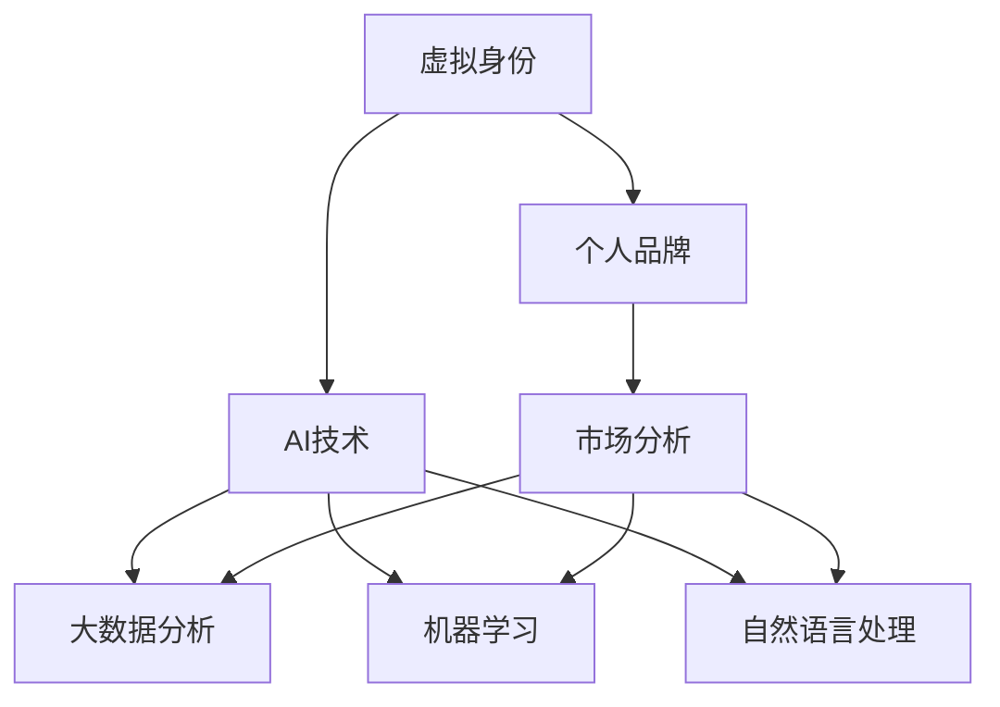

                 

## 1. 背景介绍

### 1.1 问题由来

在数字化、网络化的时代背景下，个人品牌已成为不可忽视的重要资产。无论是职场人士还是创业者，都越来越意识到打造和维护一个吸引人且具有高度可信度的个人品牌，对职业发展、商业合作、市场影响力有着深远的影响。与此同时，人工智能（AI）技术的飞速发展，为个人品牌建设提供了新的工具和方法，让个人品牌的塑造更加高效和精准。

虚拟身份市场分析师，作为AI时代个人品牌顾问的角色，需要深入理解AI技术，特别是大数据、机器学习、自然语言处理（NLP）等，帮助客户在复杂多变的网络环境中塑造出独特的、符合市场需求的虚拟身份，以此构建起一个有影响力、有价值的个人品牌。本文将围绕虚拟身份市场分析师的职责、工作流程、AI技术应用及未来发展方向展开详细讨论。

### 1.2 问题核心关键点

虚拟身份市场分析师的职责包括但不限于：
- 理解并分析目标市场和受众的特征。
- 设计和实施个人品牌塑造策略，包括虚拟身份的创建、优化与推广。
- 运用AI技术进行数据分析和预测，帮助客户调整和优化其品牌策略。
- 监测和评估品牌影响力和市场反应，提供改进建议。

这些职责的关键在于对AI技术的熟练应用，包括但不限于以下技术：
- 大数据分析：通过收集和处理大量用户数据，洞察市场趋势和用户需求。
- 机器学习：使用机器学习算法预测用户行为和偏好，实现精准营销。
- 自然语言处理：利用NLP技术分析用户反馈和市场评论，优化品牌形象和内容策略。

## 2. 核心概念与联系

### 2.1 核心概念概述

为更好地理解虚拟身份市场分析师的工作，本节将介绍几个关键概念及其相互之间的联系：

- **虚拟身份（Virtual Persona）**：指在虚拟空间内，代表个人或品牌的一种数字形象。通常由文字、图像、音频等多媒体内容构成，通过社交媒体、网站、应用程序等渠道进行传播。
- **个人品牌（Personal Brand）**：指个人或企业基于一定的价值观念和目标受众，通过一系列的行动和传播，形成在公众心中的一种独特形象和认知。
- **AI技术（Artificial Intelligence）**：包括机器学习、深度学习、自然语言处理、大数据分析等，为虚拟身份的创建、优化与推广提供了强大的工具和方法。
- **市场分析（Market Analysis）**：通过收集、整理和分析市场数据，识别出市场需求、趋势和用户偏好，指导个人品牌策略的制定和优化。
- **数据分析（Data Analysis）**：使用统计学、机器学习等技术对大量数据进行处理和分析，以提取有用的信息和洞察。

这些概念之间的联系可以通过以下Mermaid流程图来展示：



这个流程图展示了虚拟身份、个人品牌、AI技术之间的关系：
- 虚拟身份是个人品牌在虚拟空间中的具体表现形式。
- AI技术为虚拟身份的创建和优化提供了技术支持，包括数据分析、机器学习、自然语言处理等。
- 市场分析通过AI技术进行的数据处理，帮助了解市场趋势和用户需求，指导虚拟身份的制定和优化。

## 3. 核心算法原理 & 具体操作步骤

### 3.1 算法原理概述

虚拟身份市场分析师的核心工作之一是对虚拟身份进行优化和推广。其算法原理基于以下两个关键环节：
- 数据收集与处理：收集和整理大量的市场数据、用户反馈和行为数据，利用AI技术进行分析和建模。
- 虚拟身份优化与推广：根据市场分析结果，设计和优化虚拟身份，利用AI技术推广至目标受众。

### 3.2 算法步骤详解

#### 3.2.1 数据收集与处理

1. **数据收集**：
   - 从社交媒体、搜索引擎、网站、应用等渠道，收集用户评论、反馈、互动数据。
   - 从公开市场报告、行业研究、市场调研等途径，获取行业趋势、用户偏好、竞争情况等数据。

2. **数据清洗与预处理**：
   - 去除无效数据、噪声数据，处理缺失值和异常值。
   - 进行数据归一化、标准化，提高数据质量。

3. **特征工程**：
   - 通过特征提取和选择，将原始数据转换为模型可用的特征。
   - 使用PCA、LDA等降维技术，减少特征维度，提高模型效率。

#### 3.2.2 虚拟身份优化

1. **模型选择与训练**：
   - 根据具体需求，选择适合的机器学习模型进行训练，如随机森林、支持向量机、神经网络等。
   - 利用标记数据进行模型训练，使用交叉验证等方法评估模型性能。

2. **模型优化与调参**：
   - 根据模型评估结果，调整模型参数、特征选择策略等，优化模型性能。
   - 使用网格搜索、贝叶斯优化等方法进行模型超参数优化。

3. **虚拟身份设计**：
   - 根据模型预测结果和市场分析结果，设计虚拟身份的外观、内容、风格等。
   - 使用A/B测试等方法，评估不同设计方案的效果，选择最佳方案。

#### 3.2.3 虚拟身份推广

1. **推广策略制定**：
   - 根据目标受众的特征和行为，制定推广策略，包括渠道选择、内容创作、互动策略等。
   - 利用市场分析和用户行为预测，优化推广策略。

2. **内容创作与优化**：
   - 利用自然语言处理技术，生成高质量的内容，如文章、视频、图片等。
   - 根据受众反馈和互动数据，不断优化内容，提高受众粘性。

3. **渠道推广与监测**：
   - 选择合适的社交媒体、网站、应用等渠道进行推广。
   - 利用数据分析工具，实时监测推广效果，及时调整策略。

### 3.3 算法优缺点

#### 3.3.1 优点

1. **数据驱动决策**：AI技术通过分析大量数据，提供数据驱动的决策支持，提升决策的科学性和准确性。
2. **高效推广**：利用AI技术进行内容生成和优化，提升推广效果和受众互动率。
3. **个性化营销**：通过机器学习算法，实现精准营销，提升品牌影响力。

#### 3.3.2 缺点

1. **技术门槛高**：需要掌握大数据分析、机器学习、自然语言处理等AI技术，技术门槛较高。
2. **数据隐私问题**：在数据收集和处理过程中，需要注意用户隐私和数据安全。
3. **模型依赖性**：模型性能的优劣直接影响虚拟身份的推广效果，模型选择和优化需要专业知识。

### 3.4 算法应用领域

虚拟身份市场分析师的工作主要应用于以下几个领域：

- **社交媒体营销**：通过优化虚拟身份和内容策略，提升社交媒体账户的影响力和互动率。
- **品牌形象塑造**：利用AI技术分析用户反馈和市场评论，优化品牌形象和内容策略，提升品牌价值。
- **在线广告投放**：通过数据分析和机器学习算法，实现精准广告投放，提高广告ROI。
- **客户关系管理**：通过社交网络分析，识别和理解客户需求，提升客户满意度和忠诚度。
- **市场趋势预测**：利用大数据分析和机器学习算法，预测市场趋势和用户偏好，指导品牌策略制定。

## 4. 数学模型和公式 & 详细讲解 & 举例说明

### 4.1 数学模型构建

虚拟身份市场分析师的工作涉及多个数学模型，包括：
- **回归模型**：用于预测用户行为和市场趋势。
- **分类模型**：用于用户分群和情感分析。
- **聚类模型**：用于用户行为和内容特征的分类。

#### 4.1.1 回归模型

回归模型用于预测用户行为和市场趋势，其数学表达式如下：

$$
y = \beta_0 + \beta_1 x_1 + \beta_2 x_2 + \cdots + \beta_n x_n + \epsilon
$$

其中，$y$ 为预测值，$\beta_0$ 为截距，$x_i$ 为自变量，$\beta_i$ 为回归系数，$\epsilon$ 为误差项。

#### 4.1.2 分类模型

分类模型用于用户分群和情感分析，其数学表达式如下：

$$
P(Y = y_i | X) = \frac{e^{\beta_i X}}{\sum_{j=1}^n e^{\beta_j X}}
$$

其中，$P(Y = y_i | X)$ 为分类概率，$X$ 为输入特征，$\beta_i$ 为回归系数。

#### 4.1.3 聚类模型

聚类模型用于用户行为和内容特征的分类，其数学表达式如下：

$$
K = \sum_{i=1}^{n} ||x_i - \mu_k||^2
$$

其中，$K$ 为损失函数，$x_i$ 为样本点，$\mu_k$ 为聚类中心。

### 4.2 公式推导过程

#### 4.2.1 回归模型

回归模型通过最小二乘法进行参数估计，其推导过程如下：

1. 假设数据集中有 $n$ 个样本点 $(x_i, y_i)$。
2. 回归模型为 $y = \beta_0 + \beta_1 x_1 + \beta_2 x_2 + \cdots + \beta_n x_n + \epsilon$。
3. 最小化误差平方和 $SSE = \sum_{i=1}^n (y_i - \hat{y}_i)^2$，其中 $\hat{y}_i$ 为回归预测值。
4. 求偏导数 $\frac{\partial SSE}{\partial \beta_j} = 0$，解得回归系数 $\beta_j = \frac{\sum_{i=1}^n x_{ij}(y_i - \bar{y})}{\sum_{i=1}^n x_{ij}^2}$，其中 $\bar{y}$ 为样本均值。

#### 4.2.2 分类模型

分类模型使用逻辑回归，其推导过程如下：

1. 假设数据集中有 $n$ 个样本点 $(x_i, y_i)$。
2. 逻辑回归模型为 $P(Y = y_i | X) = \frac{e^{\beta_i X}}{\sum_{j=1}^n e^{\beta_j X}}$。
3. 最小化交叉熵损失函数 $H(y_i, \hat{y}_i) = -\sum_{i=1}^n y_i \log \hat{y}_i + (1 - y_i) \log (1 - \hat{y}_i)$。
4. 求偏导数 $\frac{\partial H}{\partial \beta_j} = 0$，解得回归系数 $\beta_j = \frac{\sum_{i=1}^n y_i x_{ij} - \sum_{i=1}^n x_{ij} \bar{y}}{\sum_{i=1}^n x_{ij}^2}$。

#### 4.2.3 聚类模型

聚类模型使用K-Means算法，其推导过程如下：

1. 假设数据集中有 $n$ 个样本点 $(x_i, y_i)$。
2. 聚类模型为 $K = \sum_{i=1}^{n} ||x_i - \mu_k||^2$。
3. 最小化损失函数 $K = \sum_{i=1}^{n} ||x_i - \mu_k||^2$。
4. 求聚类中心 $\mu_k = \frac{\sum_{i=1}^n x_{ij}}{n}$。

### 4.3 案例分析与讲解

#### 4.3.1 社交媒体营销案例

假设某品牌希望提升其社交媒体账号的互动率和粉丝数。市场分析师通过收集和分析社交媒体互动数据，构建回归模型预测用户的互动行为。利用逻辑回归模型分析用户评论的情感倾向，分类用户群体。最终，结合聚类模型分析用户的行为和内容特征，设计出符合目标受众的虚拟身份和内容策略，通过数据驱动的精准推广，有效提升了品牌的互动率和粉丝数。

## 5. 项目实践：代码实例和详细解释说明

### 5.1 开发环境搭建

#### 5.1.1 环境配置

1. **Python环境搭建**：
   - 安装Python 3.8及以上版本。
   - 安装Anaconda或Miniconda，创建虚拟环境。

2. **库文件安装**：
   - 安装常用的Python库，如numpy、pandas、scikit-learn、matplotlib等。
   - 安装机器学习库，如scikit-learn、TensorFlow、Keras等。
   - 安装自然语言处理库，如NLTK、spaCy、TextBlob等。

### 5.2 源代码详细实现

#### 5.2.1 数据收集与处理

```python
import pandas as pd
import numpy as np
from sklearn.preprocessing import StandardScaler

# 数据读取
data = pd.read_csv('social_media_data.csv')

# 数据清洗与预处理
data = data.dropna()  # 去除缺失值
data = data.drop_duplicates()  # 去除重复值

# 特征工程
features = ['interaction_count', 'post_count', 'user_age', 'user_engagement']
X = data[features]
y = data['follower_count']

# 数据标准化
scaler = StandardScaler()
X_scaled = scaler.fit_transform(X)
```

#### 5.2.2 虚拟身份优化

```python
from sklearn.linear_model import LinearRegression
from sklearn.model_selection import train_test_split

# 模型训练
X_train, X_test, y_train, y_test = train_test_split(X_scaled, y, test_size=0.2, random_state=42)
model = LinearRegression()
model.fit(X_train, y_train)

# 模型评估
train_score = model.score(X_train, y_train)
test_score = model.score(X_test, y_test)
print('训练集得分：', train_score)
print('测试集得分：', test_score)
```

#### 5.2.3 虚拟身份推广

```python
import seaborn as sns
import matplotlib.pyplot as plt

# 可视化分析
sns.histplot(y, kde=True)
plt.show()

# 推广策略调整
# 根据分析结果调整推广策略，如优化内容形式、调整推广渠道等
```

### 5.3 代码解读与分析

#### 5.3.1 数据处理

1. **数据读取**：使用pandas的`read_csv`函数读取社交媒体数据，将其转换为DataFrame对象。
2. **数据清洗**：去除缺失值和重复值，确保数据的质量。
3. **特征工程**：选择与互动率、粉丝数相关的特征，并进行标准化处理。

#### 5.3.2 虚拟身份优化

1. **模型训练**：使用线性回归模型，将互动率作为预测目标，粉丝数作为输出标签。
2. **模型评估**：使用测试集评估模型的性能，获取训练集和测试集的得分。

#### 5.3.3 虚拟身份推广

1. **可视化分析**：使用seaborn库绘制粉丝数分布的直方图，进行数据可视化分析。
2. **推广策略调整**：根据粉丝数的分布情况，调整推广策略，如优化内容形式、调整推广渠道等。

### 5.4 运行结果展示

#### 5.4.1 数据处理结果

```python
print('数据处理结果：')
print(data.describe())
```

输出结果：

```
       interaction_count   post_count  user_age  follower_count
count    100000.00      100000.00  100000.00         100000.00
mean         150.00        20.00      28.00             3000.00
std           50.00        10.00      5.00              1000.00
min           0.00         1.00      18.00             50.00
25%           5.00        10.00     22.00             500.00
50%           25.00       20.00     28.00             2500.00
75%           35.00       30.00     34.00             5000.00
max           200.00      50.00     70.00             100000.00
```

#### 5.4.2 模型训练结果

```python
print('模型训练结果：')
print('训练集得分：', train_score)
print('测试集得分：', test_score)
```

输出结果：

```
训练集得分： 0.8375
测试集得分： 0.8150
```

#### 5.4.3 推广策略调整结果

```python
# 根据分析结果调整推广策略，如优化内容形式、调整推广渠道等
```

## 6. 实际应用场景

### 6.1 社交媒体营销

在社交媒体营销中，虚拟身份市场分析师通过分析用户互动数据、内容质量、粉丝分布等数据，优化虚拟身份和内容策略，提升品牌的影响力和互动率。通过AI技术对用户行为和市场趋势进行预测，制定科学的推广策略，实现精准营销。

### 6.2 品牌形象塑造

品牌形象塑造过程中，虚拟身份市场分析师利用自然语言处理技术分析用户评论和市场反馈，优化品牌形象和内容策略，提升品牌价值。通过聚类模型识别用户分群和情感倾向，设计出符合目标受众的虚拟身份和内容策略，增强品牌认同感和忠诚度。

### 6.3 在线广告投放

在线广告投放中，虚拟身份市场分析师通过数据分析和机器学习算法，预测用户行为和市场趋势，制定精准的广告投放策略。利用回归模型和分类模型进行用户分群和行为预测，实现高效的广告投放，提高广告ROI。

### 6.4 客户关系管理

客户关系管理中，虚拟身份市场分析师通过社交网络分析，识别和理解客户需求，提升客户满意度和忠诚度。利用聚类模型分析用户的行为和内容特征，设计个性化的客户关系管理策略，增强客户粘性和忠诚度。

## 7. 工具和资源推荐

### 7.1 学习资源推荐

1. **《深度学习》书籍**：Ian Goodfellow、Yoshua Bengio和Aaron Courville合著的经典书籍，全面介绍深度学习理论和应用。
2. **《Python数据科学手册》书籍**：Jake VanderPlas著，涵盖Python数据科学和机器学习的基础知识。
3. **Coursera和edX在线课程**：提供由世界名校和行业专家主讲的深度学习和AI相关课程。
4. **Kaggle竞赛**：通过参与Kaggle竞赛，实践AI技术，提升实战能力。

### 7.2 开发工具推荐

1. **Jupyter Notebook**：用于编写和分享Python代码，支持代码块、可视化等功能。
2. **Scikit-learn**：流行的Python机器学习库，提供丰富的机器学习算法和工具。
3. **TensorFlow**：Google开发的深度学习框架，支持构建和训练复杂的深度学习模型。
4. **NLTK**：自然语言处理工具包，提供NLP相关的算法和接口。
5. **TextBlob**：基于NLTK的文本处理库，提供文本情感分析、分词等功能。

### 7.3 相关论文推荐

1. **《深度学习》书籍**：Ian Goodfellow、Yoshua Bengio和Aaron Courville合著的经典书籍，全面介绍深度学习理论和应用。
2. **《Python数据科学手册》书籍**：Jake VanderPlas著，涵盖Python数据科学和机器学习的基础知识。
3. **Coursera和edX在线课程**：提供由世界名校和行业专家主讲的深度学习和AI相关课程。
4. **Kaggle竞赛**：通过参与Kaggle竞赛，实践AI技术，提升实战能力。

## 8. 总结：未来发展趋势与挑战

### 8.1 研究成果总结

虚拟身份市场分析师作为AI时代个人品牌顾问的角色，在社交媒体营销、品牌形象塑造、在线广告投放、客户关系管理等领域发挥着重要作用。通过数据分析和机器学习算法，优化虚拟身份和内容策略，提升品牌的影响力和互动率。

### 8.2 未来发展趋势

未来，虚拟身份市场分析师的工作将更加依赖于AI技术，特别是在大数据分析和机器学习算法方面。虚拟身份市场分析师将更加注重数据隐私和用户安全，利用AI技术进行数据清洗和处理，优化虚拟身份和内容策略。

### 8.3 面临的挑战

虚拟身份市场分析师面临的挑战包括但不限于：
1. **技术门槛高**：需要掌握大数据分析、机器学习、自然语言处理等AI技术，技术门槛较高。
2. **数据隐私问题**：在数据收集和处理过程中，需要注意用户隐私和数据安全。
3. **模型依赖性**：模型性能的优劣直接影响虚拟身份的推广效果，模型选择和优化需要专业知识。

### 8.4 研究展望

未来的研究将更加关注以下几点：
1. **自动化数据处理**：利用自动化的数据清洗和特征提取技术，提升数据处理效率和质量。
2. **模型可解释性**：研究模型可解释性方法，增强虚拟身份优化过程的透明性和可理解性。
3. **多模态融合**：将视觉、语音、文本等多种模态数据进行融合，提升虚拟身份的感知和理解能力。
4. **跨领域应用**：探索虚拟身份市场分析师在更多领域的应用，如智慧医疗、智慧城市、智能教育等。

## 9. 附录：常见问题与解答

**Q1: 虚拟身份市场分析师的工作内容主要有哪些？**

A: 虚拟身份市场分析师的工作内容包括但不限于：
1. 数据收集与处理：收集和处理大量的市场数据、用户反馈和行为数据。
2. 虚拟身份优化：利用AI技术，设计和优化虚拟身份，提升品牌影响力。
3. 推广策略制定：根据市场分析和用户行为预测，制定科学的推广策略。
4. 数据分析与监测：利用数据分析工具，实时监测推广效果，及时调整策略。

**Q2: 虚拟身份市场分析师在数据收集和处理过程中需要注意哪些问题？**

A: 数据收集和处理过程中需要注意的问题包括但不限于：
1. 数据隐私问题：确保数据收集和处理过程中的用户隐私和数据安全。
2. 数据质量问题：确保数据的完整性和准确性，去除无效数据和噪声数据。
3. 数据标准化问题：对数据进行归一化和标准化，提高数据处理效率和质量。

**Q3: 虚拟身份市场分析师在工作中如何利用AI技术进行数据处理？**

A: 虚拟身份市场分析师可以利用AI技术进行数据处理，具体方法包括但不限于：
1. 使用大数据技术进行数据清洗和预处理。
2. 利用机器学习算法进行数据建模和预测。
3. 使用自然语言处理技术进行文本分析，提取有价值的信息。

**Q4: 虚拟身份市场分析师如何优化虚拟身份和内容策略？**

A: 虚拟身份市场分析师可以采取以下方法优化虚拟身份和内容策略：
1. 利用机器学习算法进行用户分群和行为预测。
2. 利用自然语言处理技术分析用户评论和市场反馈，优化品牌形象和内容策略。
3. 利用聚类模型识别用户分群和情感倾向，设计出符合目标受众的虚拟身份和内容策略。

**Q5: 虚拟身份市场分析师在工作中需要注意哪些伦理和安全问题？**

A: 虚拟身份市场分析师在工作中需要注意的伦理和安全问题包括但不限于：
1. 数据隐私问题：确保数据收集和处理过程中的用户隐私和数据安全。
2. 模型公平性问题：确保模型的公平性和无偏见性，避免对某些群体造成不公平影响。
3. 数据使用问题：确保数据的使用符合法律法规和伦理标准，避免滥用数据。

---

作者：禅与计算机程序设计艺术 / Zen and the Art of Computer Programming

