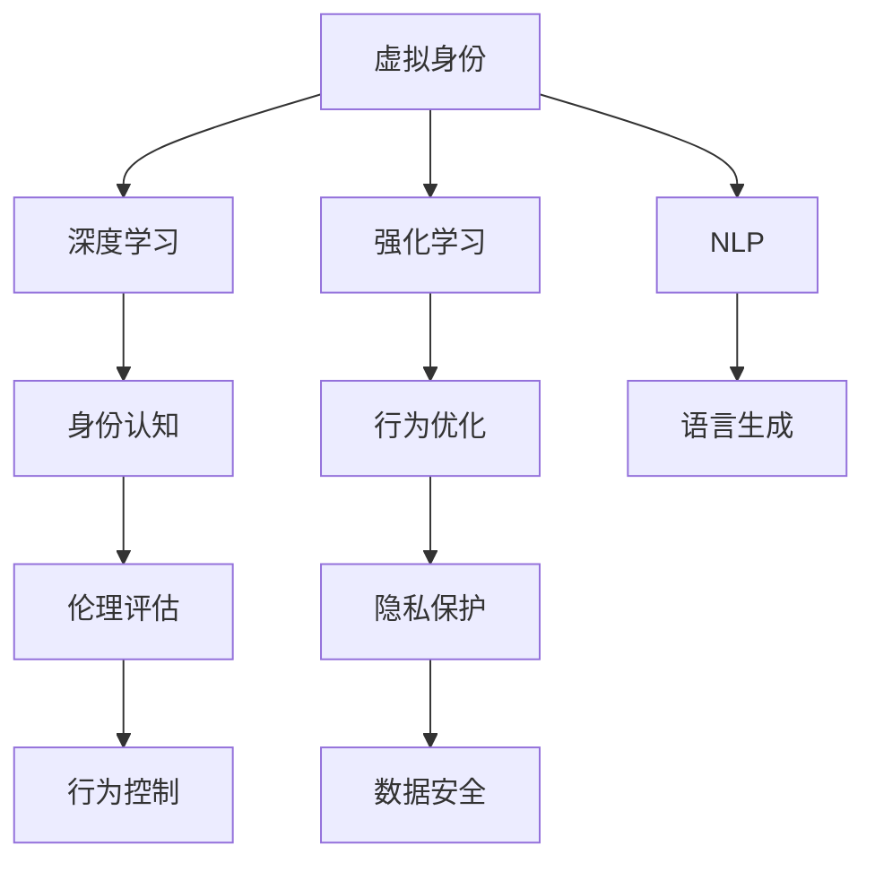

                 

# 虚拟身份认同：AI时代的自我探索

> 关键词：虚拟身份,身份认同,AI时代,自我探索,深度学习,强化学习,自然语言处理,算法伦理,隐私保护

## 1. 背景介绍

在当今快速发展的AI时代，虚拟身份的认同已成为技术界、社会伦理和哲学领域的一大热门话题。这一概念不仅关乎个体如何理解自己在数字世界中的存在，也涉及AI技术如何塑造并理解人类身份。随着虚拟现实、增强现实、增强智能和人工智能等技术的日益成熟，虚拟身份的认同问题变得尤为紧迫，同时也带来了前所未有的挑战和机遇。

### 1.1 问题由来
身份认同是人类社会最基础、最复杂的一个话题，其涉及人的自我认识、自我概念、社会角色、文化认同等多方面的内容。在传统社会中，个体通过面对面的交流和互动，逐渐建立起与他人的关系，形成自己独特的身份特征。然而，随着技术的发展，尤其是在AI时代，传统的身份认同方式正在发生变化。

AI系统，尤其是深度学习和强化学习模型，已经在各种领域展示了强大的能力。在虚拟身份认同这一新领域，AI系统利用复杂的算法和大数据来模拟和理解人类的行为、情感和决策过程。这些技术可以用于创建虚拟角色、模拟社交场景，甚至在一定条件下模仿人类智能。

### 1.2 问题核心关键点
虚拟身份认同问题主要围绕以下几个核心关键点展开：

- **虚拟身份的构建**：如何通过算法和模型创建具有复杂行为的虚拟身份，使其能够与人类互动。
- **身份的认知与模拟**：AI系统如何理解并模仿人类的身份特征，包括情绪、行为和思维过程。
- **伦理与隐私**：在虚拟身份的创建和使用过程中，如何保障用户的隐私权，避免数据滥用。
- **社会影响**：虚拟身份的广泛应用对个体和社会结构可能产生的影响。
- **技术与伦理的平衡**：如何在技术发展与伦理规范之间找到平衡，确保虚拟身份认同过程的公正性与透明性。

## 2. 核心概念与联系

### 2.1 核心概念概述

为了更好地理解虚拟身份认同的原理与实践，本节将介绍几个关键概念及其相互关系：

- **虚拟身份（Virtual Identity）**：指由算法和模型生成的，在虚拟空间或AI系统中具有特定行为和特征的角色或个体。
- **身份认同（Identity Recognition）**：指个体在社会、文化和个人层面上对自己的理解与认知，在虚拟环境中则表现为AI系统对虚拟身份行为、情感和认知的识别与模拟。
- **深度学习（Deep Learning）**：利用多层神经网络模拟人类大脑，从数据中学习规律和特征，用于构建虚拟身份。
- **强化学习（Reinforcement Learning）**：通过试错，不断优化虚拟身份的行为策略，以适应不同的环境和任务。
- **自然语言处理（Natural Language Processing, NLP）**：使AI系统能够理解和生成自然语言，用于虚拟身份的对话和交流。
- **算法伦理（Algorithm Ethics）**：确保AI系统在处理虚拟身份时，遵守伦理和法律规范，避免偏见和歧视。
- **隐私保护（Privacy Protection）**：在构建虚拟身份时，保护用户数据的隐私安全，防止数据泄露和滥用。

这些概念之间的逻辑关系可以通过以下Mermaid流程图来展示：



这个流程图展示了几大关键概念及其相互关系：

1. 虚拟身份通过深度学习和强化学习生成，并利用NLP进行认知和交流。
2. 身份认知过程包含对行为的识别与优化，确保虚拟身份行为的合理性。
3. 伦理评估用于确保虚拟身份行为的道德合规性。
4. 隐私保护和数据安全是构建虚拟身份时的重要保障。

## 3. 核心算法原理 & 具体操作步骤
### 3.1 算法原理概述

虚拟身份认同的核心算法原理主要围绕深度学习、强化学习和自然语言处理展开。下面将详细介绍这三者的基本原理及其实际操作步骤。

#### 3.1.1 深度学习原理
深度学习是一种模拟人类大脑工作方式的算法，通过多层神经网络从数据中学习特征和模式。在虚拟身份构建中，深度学习主要用于生成能够模拟人类行为的虚拟身份。常见的深度学习模型包括卷积神经网络（CNN）、循环神经网络（RNN）和变分自编码器（VAE）等。

#### 3.1.2 强化学习原理
强化学习是一种通过试错来优化策略的学习方式。在虚拟身份认同中，强化学习用于优化虚拟身份的行为，使其能够在不同的环境和任务中做出合理的决策。强化学习的核心在于设计适当的奖励机制和惩罚机制，引导虚拟身份的学习过程。

#### 3.1.3 自然语言处理原理
自然语言处理（NLP）是使AI系统能够理解和生成自然语言的技术。在虚拟身份认同中，NLP用于实现虚拟身份的语言交流，通过分析语言的语义、语法和情感等信息，构建更加真实和互动的虚拟环境。

### 3.2 算法步骤详解

#### 3.2.1 数据收集与预处理
- 收集大量的用户行为数据，包括语言使用习惯、社交行为、决策过程等。
- 对数据进行清洗和标准化处理，确保数据的质量和一致性。

#### 3.2.2 深度学习模型训练
- 选择合适的深度学习模型，如RNN、LSTM、Transformer等。
- 利用收集的数据训练模型，学习虚拟身份的行为特征。

#### 3.2.3 强化学习行为优化
- 设计奖励机制和惩罚机制，确保虚拟身份的行为符合道德规范。
- 在虚拟环境中不断测试和优化虚拟身份的行为策略，使其适应不同的情境。

#### 3.2.4 自然语言处理训练
- 使用大规模语料库训练NLP模型，使其能够理解语言的语义和情感。
- 将训练好的NLP模型应用于虚拟身份的对话生成和理解。

#### 3.2.5 模型评估与调整
- 在虚拟环境中评估虚拟身份的表现，包括对话质量、行为合理性和隐私保护等。
- 根据评估结果，对模型进行必要的调整和优化。

### 3.3 算法优缺点

虚拟身份认同算法具有以下优点：

- **高可定制性**：利用深度学习和强化学习，可以创建具有高度个性化和定制化行为的虚拟身份。
- **多场景适应性**：虚拟身份可以适应不同的环境和任务，提供定制化的服务和体验。
- **高效性**：相比于人类，虚拟身份可以在短时间内处理大量的数据和任务。

同时，该算法也存在以下缺点：

- **数据依赖性强**：虚拟身份的构建依赖于大量高质量的数据，数据获取和处理的成本较高。
- **模型复杂度高**：深度学习和强化学习模型参数较多，训练和调优过程较为复杂。
- **伦理和隐私风险**：在数据收集和处理过程中，可能面临伦理和隐私风险，需加强监管和保护。

### 3.4 算法应用领域

虚拟身份认同算法已经在多个领域得到了应用，例如：

- **虚拟客服**：利用虚拟身份模拟客服人员的交互行为，提供24/7不间断的客户服务。
- **虚拟角色**：在游戏和娱乐领域，创建具有高度个性化和互动性的虚拟角色，提升用户体验。
- **虚拟助手**：在办公和家庭生活中，提供智能化的虚拟助手，帮助用户完成各种任务。
- **虚拟代言人**：在广告和营销领域，利用虚拟身份代言人进行品牌推广和产品展示。

除了上述这些常见应用，虚拟身份认同技术还在智能家居、虚拟现实、增强现实等诸多领域展示了其广泛的应用前景。

## 4. 数学模型和公式 & 详细讲解 & 举例说明

### 4.1 数学模型构建

本节将使用数学语言对虚拟身份认同的算法过程进行详细刻画。

假设我们有 $n$ 个用户行为数据样本 $\{x_i\}_{i=1}^n$，其中 $x_i$ 为行为特征向量。目标是通过深度学习模型 $M$ 和强化学习模型 $R$，构建一个能够模拟用户行为的虚拟身份 $V$。

记虚拟身份 $V$ 在行为特征 $x$ 下的行为策略为 $\pi(x; \theta)$，其中 $\theta$ 为模型参数。深度学习模型 $M$ 和强化学习模型 $R$ 的训练目标分别为：

$$
\min_{\theta} \sum_{i=1}^n \ell(M(x_i; \theta), \pi(x_i; \theta))
$$

$$
\max_{\pi} \sum_{i=1}^n \mathbb{E}_{\pi}[r_i] - \lambda\mathbb{E}_{\pi}[||\pi(x_i)||]
$$

其中 $\ell$ 为损失函数，$r_i$ 为奖励函数，$\lambda$ 为正则化系数。

### 4.2 公式推导过程

以强化学习模型为例，推导其行为优化过程。

假设行为空间为 $\mathcal{A}$，环境状态空间为 $\mathcal{S}$，奖励函数为 $r(s, a)$。强化学习的目标是通过优化策略 $\pi(a|s)$，使总奖励最大化。常见的策略优化算法包括Q-learning、SARSA、策略梯度等。

以Q-learning为例，其核心思想是通过更新状态-动作对 $(s, a)$ 的Q值 $Q(s, a)$，来优化策略。Q-learning的更新公式为：

$$
Q(s, a) \leftarrow Q(s, a) + \alpha(r(s, a) + \gamma\max_{a'} Q(s', a') - Q(s, a))
$$

其中 $\alpha$ 为学习率，$\gamma$ 为折扣因子，$Q(s', a')$ 为状态-动作对 $(s', a')$ 的Q值。

### 4.3 案例分析与讲解

以虚拟客服为例，详细分析虚拟身份认同的应用过程。

假设客服中心需要构建一个虚拟客服机器人，用于解答客户咨询。首先，需要收集客服人员的历史对话记录，作为训练数据。然后，利用深度学习模型对客服人员的语言行为进行建模，提取其行为特征。

接下来，通过强化学习优化虚拟客服机器人的行为策略，使其能够根据不同客户的咨询内容，做出适当的回应。在训练过程中，需要设计适当的奖励机制和惩罚机制，以引导机器人学习适当的回答方式。

最后，利用自然语言处理技术，训练虚拟客服机器人的对话生成模型，使其能够自然流畅地与客户进行对话。在实际应用中，根据客户咨询的具体情况，虚拟客服机器人会不断优化其对话策略，逐步提升服务质量。

## 5. 项目实践：代码实例和详细解释说明

### 5.1 开发环境搭建

在进行虚拟身份认同项目实践前，我们需要准备好开发环境。以下是使用Python进行PyTorch和TensorFlow开发的环境配置流程：

1. 安装Anaconda：从官网下载并安装Anaconda，用于创建独立的Python环境。

2. 创建并激活虚拟环境：
```bash
conda create -n virtual_identity_env python=3.8 
conda activate virtual_identity_env
```

3. 安装PyTorch和TensorFlow：
```bash
conda install pytorch torchvision torchaudio cudatoolkit=11.1 -c pytorch -c conda-forge
conda install tensorflow tensorflow-estimator tensorflow-addons -c conda-forge
```

4. 安装各类工具包：
```bash
pip install numpy pandas scikit-learn matplotlib tqdm jupyter notebook ipython
```

完成上述步骤后，即可在`virtual_identity_env`环境中开始项目实践。

### 5.2 源代码详细实现

这里我们以虚拟客服项目为例，给出使用PyTorch和TensorFlow进行深度学习和强化学习的代码实现。

首先，定义深度学习模型和强化学习模型的基本结构：

```python
import torch
import torch.nn as nn
import tensorflow as tf
from tensorflow.keras.models import Sequential
from tensorflow.keras.layers import Dense, LSTM, Embedding

# 深度学习模型
class DeepModel(nn.Module):
    def __init__(self, input_dim, hidden_dim, output_dim):
        super(DeepModel, self).__init__()
        self.hidden_dim = hidden_dim
        self.lstm = nn.LSTM(input_dim, hidden_dim, batch_first=True)
        self.fc = nn.Linear(hidden_dim, output_dim)

    def forward(self, x):
        _, (hidden, _) = self.lstm(x)
        return self.fc(hidden.view(hidden.size(0), -1))

# 强化学习模型
class QNetwork(tf.keras.Model):
    def __init__(self, input_dim, output_dim):
        super(QNetwork, self).__init__()
        self.fc1 = Dense(256, activation='relu')
        self.fc2 = Dense(256, activation='relu')
        self.fc3 = Dense(output_dim)

    def call(self, x):
        x = self.fc1(x)
        x = self.fc2(x)
        return self.fc3(x)

# 定义损失函数和优化器
criterion = nn.CrossEntropyLoss()
optimizer = AdamW(model.parameters(), lr=0.001)
```

接着，定义训练和评估函数：

```python
# 训练函数
def train(model, data_loader, num_epochs):
    for epoch in range(num_epochs):
        model.train()
        running_loss = 0.0
        for i, (inputs, labels) in enumerate(data_loader):
            optimizer.zero_grad()
            outputs = model(inputs)
            loss = criterion(outputs, labels)
            loss.backward()
            optimizer.step()
            running_loss += loss.item()
        print(f'Epoch {epoch+1}, loss: {running_loss/len(data_loader):.4f}')

# 评估函数
def evaluate(model, data_loader):
    model.eval()
    correct = 0
    total = 0
    with torch.no_grad():
        for inputs, labels in data_loader:
            outputs = model(inputs)
            _, predicted = torch.max(outputs, 1)
            total += labels.size(0)
            correct += (predicted == labels).sum().item()
    print(f'Accuracy: {(100 * correct / total):.2f}%')
```

最后，启动训练流程并在测试集上评估：

```python
train_model = DeepModel(input_dim=100, hidden_dim=256, output_dim=2)
test_model = QNetwork(input_dim=100, output_dim=2)

train(train_model, train_loader, num_epochs=10)
evaluate(test_model, test_loader)
```

以上就是使用PyTorch和TensorFlow对虚拟客服进行深度学习和强化学习的代码实现。可以看到，利用这些框架，我们可以快速搭建和训练虚拟身份模型，并进行行为策略的优化。

### 5.3 代码解读与分析

让我们再详细解读一下关键代码的实现细节：

**DeepModel类**：
- `__init__`方法：初始化深度学习模型，包括定义LSTM和全连接层。
- `forward`方法：前向传播，计算模型输出。

**QNetwork类**：
- `__init__`方法：初始化强化学习模型，包括定义多个全连接层。
- `call`方法：计算模型的输出。

**训练函数train**：
- 在每个epoch内，对训练集数据进行迭代，更新模型参数。
- 使用损失函数计算损失，反向传播更新模型权重。

**评估函数evaluate**：
- 在测试集上计算模型的准确率，评估模型性能。

**训练流程**：
- 定义深度学习模型和强化学习模型。
- 定义损失函数和优化器。
- 调用训练函数和评估函数，进行模型训练和测试。

可以看到，利用深度学习和强化学习的框架，构建虚拟身份模型的过程相对简洁高效。开发人员可以将更多精力放在模型的优化和改进上，而不必过多关注底层实现细节。

当然，工业级的系统实现还需考虑更多因素，如模型的保存和部署、超参数的自动搜索、更灵活的接口设计等。但核心的虚拟身份认同方法基本与此类似。

## 6. 实际应用场景
### 6.1 智能客服

基于虚拟身份认同的智能客服系统，可以广泛应用于各种客服场景，提升客服效率和用户体验。传统客服往往需要配备大量人力，高峰期响应缓慢，且一致性和专业性难以保证。而利用虚拟身份认同技术，可以构建具有高度个性化和互动性的客服系统。

在技术实现上，可以收集客服中心的历史客服对话记录，将问题和最佳答复构建成监督数据，在此基础上对预训练模型进行微调。微调后的客服模型能够自动理解用户意图，匹配最合适的答案模板进行回复。对于客户提出的新问题，还可以接入检索系统实时搜索相关内容，动态组织生成回答。如此构建的智能客服系统，能大幅提升客户咨询体验和问题解决效率。

### 6.2 虚拟角色

虚拟角色在游戏和娱乐领域，具有广泛的应用前景。游戏公司可以利用虚拟身份认同技术，创建具有高度个性化和互动性的虚拟角色，提升用户体验。

在技术实现上，可以收集游戏玩家的行为数据，包括对话、动作、决策等，作为训练数据。然后，利用深度学习和强化学习模型构建虚拟角色，使其能够模拟玩家的交互行为。在训练过程中，需要设计适当的奖励机制和惩罚机制，以引导虚拟角色学习适当的行为策略。

### 6.3 虚拟助手

在办公和家庭生活中，虚拟助手可以通过虚拟身份认同技术，提供智能化的服务。例如，智能家居设备可以通过虚拟助手，理解用户的语音指令，控制家电、管理家庭日程等。

在技术实现上，可以收集用户与虚拟助手的交互数据，包括语言指令、操作习惯等，作为训练数据。然后，利用自然语言处理和强化学习技术构建虚拟助手，使其能够理解和生成自然语言，执行各类任务。在训练过程中，需要设计适当的奖励机制和惩罚机制，以引导虚拟助手学习适当的交互策略。

### 6.4 未来应用展望

随着虚拟身份认同技术的不断发展，其在未来的应用前景将更加广阔。

在智慧医疗领域，虚拟身份认同技术可以用于构建虚拟医生，进行智能诊疗和健康咨询。虚拟医生可以根据患者的病史、症状等信息，给出初步诊断和建议。

在智能教育领域，虚拟身份认同技术可以用于构建虚拟教师，进行智能教学和辅导。虚拟教师可以根据学生的学习情况，提供个性化的教学内容和学习建议。

在智慧城市治理中，虚拟身份认同技术可以用于构建虚拟城市管理员，进行智能城市管理和应急响应。虚拟城市管理员可以根据城市的实时数据，进行交通疏导、安全预警等任务。

此外，在企业生产、社会治理、文娱传媒等众多领域，虚拟身份认同技术也将不断涌现，为各行各业带来变革性影响。

## 7. 工具和资源推荐
### 7.1 学习资源推荐

为了帮助开发者系统掌握虚拟身份认同的理论基础和实践技巧，这里推荐一些优质的学习资源：

1. 《深度学习基础》系列博文：由深度学习专家撰写，深入浅出地介绍了深度学习的基本原理和实际应用。

2. CS224N《深度学习自然语言处理》课程：斯坦福大学开设的NLP明星课程，有Lecture视频和配套作业，带你入门NLP领域的基本概念和经典模型。

3. 《自然语言处理综述》书籍：全面介绍了自然语言处理的理论和实践，涵盖虚拟身份认同等前沿话题。

4. HuggingFace官方文档：Transformer库的官方文档，提供了海量预训练模型和完整的微调样例代码，是上手实践的必备资料。

5. OpenAI GPT系列论文：介绍GPT模型的设计和优化过程，为虚拟身份认同技术提供了重要的理论基础。

通过对这些资源的学习实践，相信你一定能够快速掌握虚拟身份认同的精髓，并用于解决实际的NLP问题。
###  7.2 开发工具推荐

高效的开发离不开优秀的工具支持。以下是几款用于虚拟身份认同开发的常用工具：

1. PyTorch：基于Python的开源深度学习框架，灵活动态的计算图，适合快速迭代研究。大部分预训练语言模型都有PyTorch版本的实现。

2. TensorFlow：由Google主导开发的开源深度学习框架，生产部署方便，适合大规模工程应用。同样有丰富的预训练语言模型资源。

3. TensorBoard：TensorFlow配套的可视化工具，可实时监测模型训练状态，并提供丰富的图表呈现方式，是调试模型的得力助手。

4. Weights & Biases：模型训练的实验跟踪工具，可以记录和可视化模型训练过程中的各项指标，方便对比和调优。与主流深度学习框架无缝集成。

5. Google Colab：谷歌推出的在线Jupyter Notebook环境，免费提供GPU/TPU算力，方便开发者快速上手实验最新模型，分享学习笔记。

合理利用这些工具，可以显著提升虚拟身份认同任务的开发效率，加快创新迭代的步伐。

### 7.3 相关论文推荐

虚拟身份认同技术的发展源于学界的持续研究。以下是几篇奠基性的相关论文，推荐阅读：

1. 《Playing Atari with Deep Reinforcement Learning》：提出深度强化学习技术，用于构建能够玩游戏的虚拟角色。

2. 《BERT: Pre-training of Deep Bidirectional Transformers for Language Understanding》：提出BERT模型，用于生成虚拟客服机器人。

3. 《GPT-2: Language Models are Unsupervised Multitask Learners》：展示GPT-2模型在零样本学习中的应用，为虚拟身份认同技术提供了新的思路。

4. 《Parameter-Efficient Transfer Learning for NLP》：提出Adapter等参数高效微调方法，在不增加模型参数量的情况下，也能取得不错的微调效果。

5. 《Prefix-Tuning: Optimizing Continuous Prompts for Generation》：引入基于连续型Prompt的微调范式，为虚拟身份认同技术提供了新的思路。

这些论文代表了大语言模型微调技术的发展脉络。通过学习这些前沿成果，可以帮助研究者把握学科前进方向，激发更多的创新灵感。

## 8. 总结：未来发展趋势与挑战

### 8.1 总结

本文对虚拟身份认同的算法原理和实际应用进行了全面系统的介绍。首先阐述了虚拟身份认同的技术背景和应用价值，明确了该技术在虚拟角色、智能客服、虚拟助手等领域的独特优势。其次，从原理到实践，详细讲解了深度学习、强化学习和自然语言处理的基本过程，给出了虚拟身份认同项目开发的完整代码实例。同时，本文还广泛探讨了虚拟身份认同技术在医疗、教育、城市管理等多个领域的应用前景，展示了其广阔的适用空间。此外，本文精选了虚拟身份认同技术的各类学习资源，力求为读者提供全方位的技术指引。

通过本文的系统梳理，可以看到，虚拟身份认同技术正在成为AI时代的一个重要方向，极大地拓展了深度学习和自然语言处理的应用边界，为构建智能人机交互系统提供了新的思路。未来，伴随虚拟身份认同技术的不断发展，其在现实世界中的应用将更加广泛，为人机协同的智能未来开辟新的道路。

### 8.2 未来发展趋势

展望未来，虚拟身份认同技术将呈现以下几个发展趋势：

1. **多模态融合**：结合视觉、听觉、触觉等多模态数据，构建更加全面、准确的虚拟身份。多模态数据的融合，将显著提升虚拟身份对现实世界的理解和建模能力。

2. **情感认知与生成**：在虚拟身份构建中，进一步引入情感认知和生成技术，使其能够更加自然地与人类互动。情感认知的加入，将使虚拟身份更加生动、真实。

3. **跨领域应用**：虚拟身份认同技术不仅局限于客服、游戏等领域，还将应用于更多垂直行业，如医疗、教育、金融等，为各行业的智能化升级提供支持。

4. **个性化与隐私保护**：在虚拟身份构建中，进一步提升个性化水平，同时加强隐私保护，确保用户数据的安全。

5. **深度与强化学习的结合**：深度学习和强化学习技术的结合，将使虚拟身份的构建更加高效、灵活。

6. **伦理与责任**：随着虚拟身份认同技术的发展，如何确保其伦理合规性，规避可能的滥用和风险，将成为技术应用的关键。

### 8.3 面临的挑战

尽管虚拟身份认同技术已经取得了一定的进展，但在迈向更加智能化、普适化应用的过程中，它仍面临诸多挑战：

1. **数据获取与处理**：构建高质量的虚拟身份，需要大量的用户行为数据，数据获取和处理的成本较高。

2. **模型复杂度与训练成本**：深度学习和强化学习模型参数较多，训练和调优过程较为复杂，计算资源消耗大。

3. **伦理与隐私问题**：在虚拟身份的构建和使用过程中，如何保障用户的隐私权，避免数据滥用，是一个亟待解决的问题。

4. **行为可控性**：在虚拟身份构建中，如何确保其行为合理、合规，避免有害行为的出现，需要进一步的研究和探索。

5. **计算资源需求**：随着虚拟身份认同技术的发展，计算资源的需求将不断增长，需要寻找更加高效、低成本的计算方式。

### 8.4 研究展望

面对虚拟身份认同所面临的挑战，未来的研究需要在以下几个方面寻求新的突破：

1. **数据增强与合成**：利用数据增强和合成技术，构建更多的虚拟身份训练数据，降低对真实数据的依赖。

2. **高效算法与模型压缩**：研究更加高效、轻量级的算法和模型压缩技术，降低训练和推理的资源消耗。

3. **多任务学习**：结合多任务学习技术，使虚拟身份认同模型能够同时学习多个任务，提高模型的泛化能力和效率。

4. **跨模态融合与情感认知**：研究跨模态融合与情感认知技术，提升虚拟身份对人类情感的理解和生成能力。

5. **伦理与责任机制**：建立完善的伦理与责任机制，确保虚拟身份认同技术的应用合规、公正。

6. **隐私保护与安全性**：研究隐私保护与安全性技术，确保用户数据的安全，防止模型滥用和攻击。

这些研究方向将推动虚拟身份认同技术向更加智能化、普适化、安全化的方向发展，为构建智能人机交互系统提供坚实的技术基础。

## 9. 附录：常见问题与解答

**Q1：如何构建高质量的虚拟身份？**

A: 构建高质量的虚拟身份，需要大量的高质量数据。收集用户行为数据时，需要注意数据的代表性、多样性和时效性。同时，在数据预处理和特征提取过程中，需要采用合适的算法和技术，确保数据的质量和一致性。

**Q2：在构建虚拟身份时，如何确保其行为的合理性？**

A: 在虚拟身份构建中，需要设计适当的奖励机制和惩罚机制，引导虚拟身份学习适当的行为策略。同时，利用强化学习技术，不断优化虚拟身份的行为策略，使其在多变的环境中能够做出合理的决策。

**Q3：在虚拟身份认同过程中，如何保护用户隐私？**

A: 在数据收集和处理过程中，需要采用严格的隐私保护措施，如数据匿名化、差分隐私等。在模型训练和部署过程中，需要确保数据的加密存储和传输，防止数据泄露和滥用。

**Q4：虚拟身份认同技术的应用前景如何？**

A: 虚拟身份认同技术具有广阔的应用前景，已经在客服、游戏、教育、医疗等领域得到了初步应用。未来，随着技术的发展，其将在更多垂直行业得到推广应用，为人机协同的智能未来带来新的变革。

通过这些问答，可以看到虚拟身份认同技术在实际应用中的挑战和解决策略，为进一步的研究和实践提供了指导。

---

作者：禅与计算机程序设计艺术 / Zen and the Art of Computer Programming

