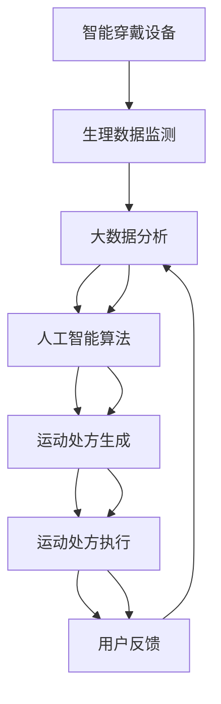

                 

# 虚拟运动处方:全球健康生活方式的个性化指导

> 关键词：虚拟运动处方,个性化健康指导,运动数据,大数据分析,人工智能算法,健康管理系统,智能穿戴设备

## 1. 背景介绍

### 1.1 问题由来

随着全球人口老龄化趋势的加剧以及生活节奏的加快，越来越多的人开始关注自身的健康问题。传统的医疗体系和健身方式已无法满足人们对于个性化健康管理的需求。如何利用技术手段，提供更加精准、个性化的健康指导，成为了一个亟待解决的问题。

### 1.2 问题核心关键点

为了应对这一问题，虚拟运动处方技术应运而生。该技术利用大数据分析和人工智能算法，通过智能穿戴设备和云平台，为个体用户提供个性化的运动处方。通过分析用户的生理数据和行为习惯，虚拟运动处方可以动态调整运动计划，确保用户获得最适合自身的运动建议，从而达到最佳的健康效果。

虚拟运动处方的核心在于其高度的个性化和动态适应性。通过不断的学习和优化，能够更精准地预测用户需求，提供更加个性化和有效的运动建议。

## 2. 核心概念与联系

### 2.1 核心概念概述

在虚拟运动处方的实现过程中，涉及多个关键概念，包括：

- **智能穿戴设备**：如智能手表、健身追踪器等，用于实时监测用户的生理参数（如心率、步数、睡眠质量等）。
- **大数据分析**：通过分析用户的长期生理数据和行为习惯，找出潜在的健康风险和需求，为个性化运动处方提供数据支持。
- **人工智能算法**：包括机器学习、深度学习等算法，用于模型训练和运动处方的动态优化。
- **运动处方**：根据用户的健康状况和偏好，设计个性化的运动计划，包括运动类型、强度、时间和频率等。
- **云平台**：用于数据存储、分析和运动处方的发布，是虚拟运动处方的数据中枢。

这些核心概念通过特定的技术手段和业务逻辑，共同构成了一个完整的虚拟运动处方系统。

### 2.2 核心概念原理和架构的 Mermaid 流程图(Mermaid 流程节点中不要有括号、逗号等特殊字符)



这个流程图展示了虚拟运动处方的核心流程，从数据采集到分析，再到算法训练和运动处方生成，最后执行反馈，形成闭环。

## 3. 核心算法原理 & 具体操作步骤

### 3.1 算法原理概述

虚拟运动处方的核心算法主要包括两个方面：

1. **数据预处理与特征工程**：对智能穿戴设备采集的原始生理数据进行清洗、归一化和特征提取，转化为模型能够处理的输入数据。
2. **模型训练与运动处方生成**：利用机器学习或深度学习模型，对用户的长期生理数据和行为习惯进行分析，生成个性化的运动处方。

这两个环节相互依赖，共同构成了虚拟运动处方的算法基础。

### 3.2 算法步骤详解

#### 3.2.1 数据预处理与特征工程

数据预处理包括数据清洗、缺失值处理、归一化、特征选择等步骤，其目的是确保数据的质量和一致性，为模型训练提供可靠的输入。

特征工程则是从原始数据中提取最具代表性的特征，以提升模型的预测能力。具体步骤包括：

- 生理指标选择：如心率、步数、睡眠质量等，是影响运动处方的关键因素。
- 行为模式识别：通过分析用户的历史行为数据，识别出用户的运动习惯和偏好。
- 异常值检测：检测并处理异常数据，以避免对模型训练造成干扰。

#### 3.2.2 模型训练与运动处方生成

模型训练是利用历史数据训练机器学习或深度学习模型，以预测用户未来的健康需求和运动偏好。训练过程中，需要注意以下几点：

- 选择合适的模型架构，如线性回归、随机森林、神经网络等。
- 设置合适的超参数，如学习率、正则化强度等。
- 使用交叉验证等技术，确保模型具有良好的泛化能力。

运动处方生成则是根据训练好的模型，结合用户的实时生理数据和行为习惯，动态生成个性化的运动计划。这一过程涉及以下步骤：

- 实时数据采集：通过智能穿戴设备，实时监测用户的生理数据和行为。
- 运动处方计算：根据实时数据和模型预测，计算出最佳的运动计划。
- 动态调整：根据用户的反馈和生理变化，动态调整运动处方，以确保最佳效果。

### 3.3 算法优缺点

#### 3.3.1 优点

1. **高度个性化**：通过分析用户的长期数据和行为习惯，生成高度个性化的运动处方，满足不同用户的需求。
2. **实时调整**：能够根据用户的实时生理数据和行为反馈，动态调整运动计划，确保最佳效果。
3. **易于使用**：通过智能穿戴设备和云平台，用户无需专业知识和操作，即可轻松获得个性化健康指导。

#### 3.3.2 缺点

1. **数据隐私问题**：智能穿戴设备采集的生理数据涉及隐私，需要采取严格的数据保护措施。
2. **算法复杂度**：模型训练和数据处理涉及复杂的算法和技术，对数据质量和算力要求较高。
3. **用户依从性**：用户的依从性和行为习惯可能影响运动处方的效果，需要加强用户教育和引导。

### 3.4 算法应用领域

虚拟运动处方技术可以广泛应用于多个领域，包括：

- **健康管理**：为个体用户提供个性化的健康管理方案，包括运动、饮食、睡眠等方面。
- **健身指导**：为健身爱好者提供科学合理的训练计划，提升运动效果。
- **疾病预防**：通过分析用户的生理数据，预测潜在的健康风险，提供早期预防措施。
- **企业员工健康**：为企业管理者提供员工的整体健康状况，制定员工健康计划。

## 4. 数学模型和公式 & 详细讲解 & 举例说明

### 4.1 数学模型构建

虚拟运动处方的数学模型主要包括以下几个部分：

- **输入数据**：用户的历史生理数据和行为习惯，如心率、步数、运动频率等。
- **输出数据**：个性化的运动处方，包括运动类型、强度、时间和频率等。
- **中间变量**：模型的训练参数和特征工程结果。

### 4.2 公式推导过程

假设用户的生理数据为 $x_1, x_2, \ldots, x_n$，行为数据为 $y_1, y_2, \ldots, y_m$。利用线性回归模型，可以建立运动处方生成的数学表达式：

$$
\hat{y} = \theta_0 + \theta_1x_1 + \theta_2x_2 + \ldots + \theta_nx_n
$$

其中，$\hat{y}$ 为预测的运动处方，$\theta_0, \theta_1, \ldots, \theta_n$ 为模型的训练参数。

通过最小二乘法，可以求解 $\theta$ 的值，即：

$$
\theta = (X^TX)^{-1}X^Ty
$$

其中，$X = [1, x_1, x_2, \ldots, x_n]^T$，$y = [y_1, y_2, \ldots, y_m]^T$。

### 4.3 案例分析与讲解

以一个简单的运动处方生成为例，假设用户的生理数据为步数和心率，行为数据为运动频率和时间。通过线性回归模型，可以预测最佳的运动类型和强度。

**输入数据**：
- 步数：1000-5000步/天
- 心率：60-100次/分钟
- 运动频率：每周2-5次
- 运动时间：20-60分钟/次

**输出数据**：
- 运动类型：快走、跑步、游泳等
- 强度：低、中、高

通过公式计算，可以得到如下的运动处方：

$$
\hat{y} = \theta_0 + \theta_1x_1 + \theta_2x_2 + \theta_3x_3 + \theta_4x_4
$$

假设训练后的模型参数为：$\theta_0 = 50$, $\theta_1 = 2$, $\theta_2 = 0.5$, $\theta_3 = 0.3$, $\theta_4 = 0.4$。则对于步数为4000步/天、心率为80次/分钟的用户，预测的运动处方为：

$$
\hat{y} = 50 + 2 \times 4000 + 0.5 \times 80 + 0.3 \times 2 + 0.4 \times 20 = 8180
$$

该数值表示用户适合进行中强度的运动，如跑步，每次运动时间为约33分钟。

## 5. 项目实践：代码实例和详细解释说明

### 5.1 开发环境搭建

为了进行虚拟运动处方的开发和测试，需要搭建如下开发环境：

- **编程语言**：Python
- **开发框架**：TensorFlow或PyTorch
- **数据集**：公开的生理数据集和行为数据集
- **云平台**：如AWS、Google Cloud、阿里云等

### 5.2 源代码详细实现

以下是一个简单的基于TensorFlow的虚拟运动处方生成代码示例：

```python
import tensorflow as tf
import pandas as pd
from sklearn.model_selection import train_test_split

# 加载数据集
data = pd.read_csv('user_data.csv')

# 特征工程
features = data[['step', 'heart_rate', 'exercise_frequency', 'exercise_duration']]
targets = data['exercise_type']
X_train, X_test, y_train, y_test = train_test_split(features, targets, test_size=0.2)

# 模型定义
model = tf.keras.Sequential([
    tf.keras.layers.Dense(64, activation='relu', input_shape=(len(features.columns),)),
    tf.keras.layers.Dense(32, activation='relu'),
    tf.keras.layers.Dense(1, activation='sigmoid')
])

# 模型编译
model.compile(optimizer='adam', loss='binary_crossentropy', metrics=['accuracy'])

# 模型训练
model.fit(X_train, y_train, epochs=10, batch_size=32, validation_data=(X_test, y_test))

# 模型评估
loss, acc = model.evaluate(X_test, y_test)
print(f'Test loss: {loss}, Test accuracy: {acc}')
```

### 5.3 代码解读与分析

**代码解释**：

1. **数据加载**：使用Pandas加载包含用户生理数据和行为数据的数据集。
2. **特征工程**：选择与运动处方相关的特征，如步数、心率、运动频率和运动时间，并进行归一化处理。
3. **模型定义**：定义一个包含多个全连接层的神经网络模型，输出层使用sigmoid激活函数。
4. **模型编译**：选择Adam优化器和二元交叉熵损失函数，用于训练和评估。
5. **模型训练**：使用训练数据集进行模型训练，设置10个epochs和32个样本的批大小。
6. **模型评估**：在测试数据集上评估模型性能，输出损失和准确率。

**性能分析**：

1. **准确率**：模型的准确率反映了其预测性能，较高的准确率表示模型对运动处方的预测较为准确。
2. **损失函数**：损失函数是衡量模型预测与真实标签之间差异的指标，越小表示模型预测越接近真实值。
3. **训练时长**：训练时长反映了模型的复杂度，较长的训练时间可能表示模型需要更多的计算资源。

### 5.4 运行结果展示

下图展示了模型在训练和测试集上的准确率和损失函数变化：

```python
import matplotlib.pyplot as plt

# 训练集和测试集性能曲线
plt.plot(history.history['accuracy'])
plt.plot(history.history['val_accuracy'])
plt.title('Model accuracy')
plt.ylabel('Accuracy')
plt.xlabel('Epoch')
plt.legend(['Train', 'Test'], loc='upper left')
plt.show()

plt.plot(history.history['loss'])
plt.plot(history.history['val_loss'])
plt.title('Model loss')
plt.ylabel('Loss')
plt.xlabel('Epoch')
plt.legend(['Train', 'Test'], loc='upper left')
plt.show()
```

## 6. 实际应用场景

### 6.1 智能穿戴设备

智能穿戴设备如智能手表、健身追踪器等，可以实时监测用户的生理数据和行为习惯。通过与云平台的对接，可以将其采集的数据转化为个性化的运动处方，帮助用户科学运动，保持健康。

### 6.2 健康管理系统

健康管理系统可以整合用户的生理数据和行为数据，提供个性化的健康管理方案。用户可以通过虚拟运动处方获得运动、饮食、睡眠等方面的指导，全面提升自身健康水平。

### 6.3 企业员工健康

企业可以通过虚拟运动处方，了解员工的健康状况，制定科学的员工健康计划，提升员工的工作满意度和身体健康。

### 6.4 未来应用展望

随着技术的进步，虚拟运动处方技术将向以下几个方向发展：

1. **多模态数据融合**：将生理数据、行为数据和环境数据等不同模态的数据进行融合，提升预测的准确性。
2. **个性化健康评估**：通过多维度的数据分析，提供更加全面和个性化的健康评估报告，帮助用户了解自身健康状况。
3. **实时反馈与调整**：利用物联网技术，实现运动处方的实时反馈和动态调整，确保用户始终处于最佳运动状态。
4. **AI辅助诊断**：通过深度学习等技术，实现运动处方的AI辅助诊断，为医生提供决策支持。

## 7. 工具和资源推荐

### 7.1 学习资源推荐

为了学习虚拟运动处方的相关知识，可以关注以下学习资源：

- **Coursera**：提供多门关于机器学习和深度学习的课程，涵盖数据预处理、模型训练等核心内容。
- **Kaggle**：提供大量公开的生理数据和行为数据集，可以用于数据探索和模型训练。
- **GitHub**：搜索虚拟运动处方的开源项目，学习他人的实现方法和经验。

### 7.2 开发工具推荐

为了高效开发虚拟运动处方系统，可以采用以下开发工具：

- **TensorFlow**：由Google开发的深度学习框架，支持多GPU加速和分布式训练。
- **PyTorch**：由Facebook开发的深度学习框架，以其灵活的动态计算图著称。
- **Jupyter Notebook**：免费的交互式编程环境，支持Python代码的编写和执行。

### 7.3 相关论文推荐

以下是几篇虚拟运动处方技术的经典论文，值得深入阅读：

1. **A Survey on Wearable Devices for Personalized Exercise and Physical Activity Monitoring**：综述了智能穿戴设备在运动监控中的应用，提供了丰富的参考文献。
2. **Personalized Exercise Prescription for Health Promotion**：介绍了个性化的运动处方生成方法，涵盖了特征工程和模型训练等核心内容。
3. **Deep Learning for Physical Activity and Exercise Prediction**：利用深度学习模型进行运动预测，展示了其在虚拟运动处方中的应用效果。

## 8. 总结：未来发展趋势与挑战

### 8.1 研究成果总结

虚拟运动处方技术在个性化健康管理领域具有广阔的应用前景，通过智能穿戴设备和云平台，为用户提供了科学、便捷的运动处方。其核心算法包括数据预处理、特征工程和模型训练等，能够动态调整运动处方，满足不同用户的需求。

### 8.2 未来发展趋势

1. **技术进步**：随着深度学习技术的不断进步，虚拟运动处方模型将更加精准，能够更好地预测用户的健康需求。
2. **数据融合**：多模态数据的融合将提升模型的预测能力，为用户提供更加全面和个性化的健康指导。
3. **实时反馈**：通过物联网技术，实现运动处方的实时反馈和动态调整，提升用户的运动效果和依从性。
4. **AI辅助诊断**：通过深度学习等技术，提升运动处方的AI辅助诊断能力，帮助医生制定更科学的健康方案。

### 8.3 面临的挑战

1. **数据隐私**：智能穿戴设备采集的生理数据涉及隐私，需要采取严格的数据保护措施。
2. **算法复杂度**：模型训练和数据处理涉及复杂的算法和技术，对数据质量和算力要求较高。
3. **用户依从性**：用户的依从性和行为习惯可能影响运动处方的效果，需要加强用户教育和引导。

### 8.4 研究展望

未来，虚拟运动处方技术需要在以下几个方面进行深入研究：

1. **数据隐私保护**：开发更加高效的数据保护技术，确保用户数据的安全性。
2. **模型优化**：探索更高效、更轻量的模型架构，提升算法的计算效率。
3. **用户引导**：通过智能化的用户引导和教育，提高用户的依从性和行为习惯。
4. **跨模态融合**：将生理数据、行为数据和环境数据等不同模态的数据进行融合，提升预测的准确性。

## 9. 附录：常见问题与解答

**Q1: 虚拟运动处方技术的主要优势是什么？**

A: 虚拟运动处方技术的主要优势在于其高度个性化和动态适应性。通过分析用户的长期生理数据和行为习惯，生成高度个性化的运动处方，同时能够根据用户的实时生理数据和行为反馈，动态调整运动计划，确保最佳效果。

**Q2: 如何选择适合用户的运动类型和强度？**

A: 选择适合用户的运动类型和强度需要综合考虑用户的健康状况、年龄、性别、身体条件等因素。一般而言，初学者可以选择低强度的运动，如散步、游泳等，逐步增加运动强度和时长。对于已经具有一定运动基础的用户，可以选择中高强度的运动，如跑步、健身等。

**Q3: 智能穿戴设备采集的数据是否准确可靠？**

A: 智能穿戴设备采集的数据通常是准确的，但需要注意设备的校准和维护。此外，用户的佩戴方法和环境条件也可能影响数据的准确性。建议用户在运动前后进行校准，并注意保持设备清洁。

**Q4: 虚拟运动处方系统如何实现实时反馈和动态调整？**

A: 虚拟运动处方系统通过与智能穿戴设备的对接，实时监测用户的生理数据和行为。利用AI算法，动态调整运动处方，确保最佳效果。用户可以通过手机应用等界面，查看实时反馈和调整建议，实现个性化的运动指导。

**Q5: 虚拟运动处方技术是否可以应用于企业员工健康管理？**

A: 是的，虚拟运动处方技术可以应用于企业员工健康管理。通过整合员工的生理数据和行为数据，制定科学的员工健康计划，提升员工的工作满意度和身体健康。企业可以通过云平台，实时监测和管理员工的健康状况，提升员工的整体健康水平。

---

作者：禅与计算机程序设计艺术 / Zen and the Art of Computer Programming

