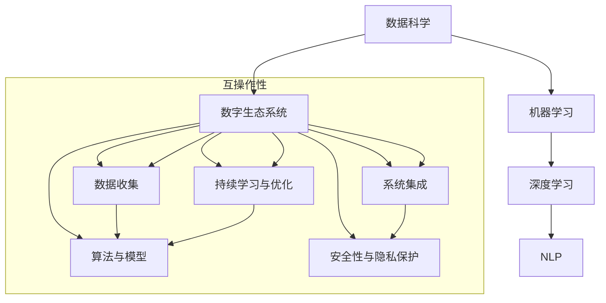

                 

## 1. 背景介绍

### 1.1 问题由来
在数字化转型的浪潮下，人工智能（AI）技术正在重塑全球经济结构。AI驱动的数字生态系统（Digital Ecosystems）已成为企业获取竞争优势的新利器，通过数据驱动的决策支持、智能自动化和实时洞察，为组织提供了前所未有的创新能力。然而，构建和运营这些生态系统的复杂性也日益凸显，涉及技术栈、数据治理、组织文化和商业模式等多个层面。

AI驱动的数字生态系统，以数据为原材料，通过算法和模型加工生成价值。这些系统不仅能够自主进化、自我修复，还能通过不断学习和优化，提升自身的性能和效率。本文将探讨AI驱动的数字生态系统的构建和运营，帮助读者理解和应对在数字生态系统中面临的各种挑战，并提出可行的解决方案。

### 1.2 问题核心关键点
构建AI驱动的数字生态系统，需要关注以下几个核心关键点：
1. **数据收集与质量**：数据是AI驱动生态系统的生命线。高质量的数据，直接影响到模型性能和决策质量。
2. **算法与模型选择**：选择合适的算法和模型，是保证生态系统智能性的关键。需要根据具体场景选择适合的机器学习或深度学习模型。
3. **系统集成与互操作性**：生态系统的各个组件需要无缝集成，实现数据的流通和交换，确保系统间互操作性。
4. **安全性与隐私保护**：保护数据隐私和系统安全，防止数据泄露和系统被攻击。
5. **持续学习与优化**：生态系统需要具备持续学习的能力，能够根据新数据和新需求不断优化自身。

理解这些关键点，对于构建高效、智能的数字生态系统至关重要。

## 2. 核心概念与联系

### 2.1 核心概念概述

为了更好地理解AI驱动的数字生态系统的核心概念及其相互关系，我们将在这一节详细阐述这些关键概念。

#### 2.1.1 数据科学
数据科学（Data Science）是以数据为核心的跨学科领域，涵盖数据挖掘、统计分析、机器学习等多个方面。数据科学的目标是提取有价值的信息，帮助决策者做出更好的决策。

#### 2.1.2 机器学习
机器学习（Machine Learning）是数据科学的一个分支，通过算法模型从数据中学习规律和模式，实现自主决策。常用的机器学习算法包括监督学习、无监督学习和强化学习等。

#### 2.1.3 深度学习
深度学习（Deep Learning）是机器学习的一种，通过多层神经网络结构实现对复杂数据的处理和分析。深度学习在图像识别、语音识别、自然语言处理等领域表现出色。

#### 2.1.4 自然语言处理（NLP）
自然语言处理（NLP）是指计算机理解和处理人类语言的技术。NLP涉及文本预处理、情感分析、实体识别、机器翻译等多个任务。

#### 2.1.5 数字生态系统
数字生态系统（Digital Ecosystem）是由多个数字组件构成的互操作网络，旨在通过数据流通和共享，实现高效的信息交换和价值创造。

这些核心概念之间通过数据流动和算法模型进行连接，共同构成了AI驱动的数字生态系统的核心框架。

### 2.2 核心概念原理和架构的 Mermaid 流程图



该图展示了核心概念之间的逻辑关系和数据流动路径。数据通过数据收集模块进入生态系统，经过机器学习模型和深度学习算法处理，形成有价值的输出。这些输出通过自然语言处理技术转化为更易理解的信息，最终与系统集成、安全性与隐私保护、持续学习与优化等组件协同工作，共同支持数字生态系统的运行。

## 3. 核心算法原理 & 具体操作步骤

### 3.1 算法原理概述

AI驱动的数字生态系统的构建，依赖于数据科学、机器学习和深度学习等技术。其中，数据科学通过数据分析和建模，为机器学习提供基础数据支持；机器学习通过算法模型，从数据中提取规律和模式；深度学习通过神经网络结构，处理复杂非线性数据。

核心算法原理包括以下几个方面：
1. **数据预处理**：包括数据清洗、特征提取、标准化等，确保数据质量。
2. **算法模型选择**：根据任务需求选择合适的算法模型，如回归、分类、聚类、神经网络等。
3. **模型训练与优化**：通过训练数据集对模型进行训练，并使用验证集进行调优，确保模型泛化能力。
4. **模型评估与部署**：评估模型性能，部署到实际应用场景中，实现自动化决策和智能操作。

### 3.2 算法步骤详解

构建AI驱动的数字生态系统的具体操作步骤如下：

#### 3.2.1 数据收集与处理
1. **数据收集**：通过API接口、传感器、日志等手段收集数据。
2. **数据清洗**：去除噪声数据、缺失值处理、异常值检测等。
3. **特征工程**：提取有用的特征，如时间戳、地理位置、用户行为等。

#### 3.2.2 算法模型选择与训练
1. **模型选择**：根据任务需求选择合适的算法模型，如线性回归、支持向量机、随机森林、卷积神经网络等。
2. **数据划分**：将数据集划分为训练集、验证集和测试集。
3. **模型训练**：使用训练集对模型进行训练，并在验证集上进行调优。
4. **模型评估**：使用测试集评估模型性能，确保模型泛化能力。

#### 3.2.3 系统集成与优化
1. **API接口设计**：设计API接口，实现数据和服务间的互操作。
2. **系统集成**：将各个模块和服务集成到统一的生态系统中，确保数据流通。
3. **持续学习与优化**：根据新数据和新需求，不断优化模型和系统性能。

### 3.3 算法优缺点

AI驱动的数字生态系统具有以下优点：
1. **高效性**：通过自动化决策和智能操作，提升效率和生产力。
2. **精确性**：基于大量数据和复杂算法，提供高质量的决策支持。
3. **可扩展性**：系统可以根据需求进行扩展和调整，灵活应对变化。

但同时也存在一些缺点：
1. **高成本**：构建和维护数字生态系统需要大量资金和技术投入。
2. **数据隐私风险**：大量数据的收集和使用，存在数据隐私和安全风险。
3. **算法复杂性**：模型训练和调优需要较强的技术和数据科学能力。

### 3.4 算法应用领域

AI驱动的数字生态系统在多个领域都有广泛应用，例如：
1. **金融科技（FinTech）**：通过大数据分析和机器学习，实现风险评估、智能投顾、欺诈检测等功能。
2. **医疗健康（HealthTech）**：利用NLP和深度学习，进行疾病预测、诊断、治疗方案优化等。
3. **智能制造（Industry 4.0）**：通过物联网和机器学习，实现设备监控、质量控制、生产优化等。
4. **智慧城市**：通过传感器和数据分析，实现城市交通管理、公共安全、环境监测等。
5. **供应链管理**：通过大数据分析和机器学习，优化供应链流程，提高运营效率。

## 4. 数学模型和公式 & 详细讲解 & 举例说明

### 4.1 数学模型构建

AI驱动的数字生态系统的构建，涉及多种数学模型，主要包括回归模型、分类模型、聚类模型和神经网络模型等。

以线性回归模型为例，其数学模型构建如下：

设$y$为因变量，$x_1, x_2, ..., x_n$为自变量，则线性回归模型的数学表达式为：

$$
y = \beta_0 + \beta_1x_1 + \beta_2x_2 + ... + \beta_nx_n + \epsilon
$$

其中，$\beta_0, \beta_1, \beta_2, ..., \beta_n$为模型参数，$\epsilon$为随机误差项。

### 4.2 公式推导过程

线性回归模型的参数估计，通过最小二乘法求解。设训练集为$D=\{(x_i, y_i)\}_{i=1}^N$，则目标函数为：

$$
\min_{\beta_0, \beta_1, \beta_2, ..., \beta_n} \sum_{i=1}^N (y_i - (\beta_0 + \beta_1x_{i1} + \beta_2x_{i2} + ... + \beta_nx_{in}))^2
$$

通过求导和最小化，得到参数的解为：

$$
\beta_j = \frac{\sum_{i=1}^N(x_{ij}\cdot y_i) - \frac{\sum_{i=1}^N(x_{ij})\cdot\sum_{i=1}^N(y_i)}{N\sum_{i=1}^N(x_{ij}^2) - (\sum_{i=1}^N(x_{ij}))^2} \quad (j=0,1,2,...,n)
$$

### 4.3 案例分析与讲解

以金融风险评估为例，通过线性回归模型，根据用户的历史交易数据，预测其未来的违约概率。

设$x_1, x_2, ..., x_n$为用户的历史交易数据，$y$为用户是否违约的标记。则线性回归模型可表示为：

$$
\text{违约概率} = \beta_0 + \beta_1x_1 + \beta_2x_2 + ... + \beta_nx_n
$$

通过训练数据集，求解模型参数$\beta_0, \beta_1, \beta_2, ..., \beta_n$。模型训练完成后，对于新用户，输入其历史交易数据，计算预测的违约概率。

## 5. 项目实践：代码实例和详细解释说明

### 5.1 开发环境搭建

要构建AI驱动的数字生态系统，首先需要搭建好开发环境。以下是使用Python进行Scikit-Learn开发的流程：

1. 安装Anaconda：从官网下载并安装Anaconda，用于创建独立的Python环境。
2. 创建并激活虚拟环境：
```bash
conda create -n sklearn-env python=3.8 
conda activate sklearn-env
```
3. 安装Scikit-Learn：
```bash
pip install scikit-learn
```

### 5.2 源代码详细实现

下面以线性回归模型为例，展示Scikit-Learn中线性回归模型的实现。

首先，定义数据集：

```python
from sklearn.datasets import load_boston
from sklearn.model_selection import train_test_split

boston = load_boston()
X = boston.data
y = boston.target
X_train, X_test, y_train, y_test = train_test_split(X, y, test_size=0.2, random_state=42)
```

然后，训练线性回归模型：

```python
from sklearn.linear_model import LinearRegression
from sklearn.metrics import mean_squared_error

model = LinearRegression()
model.fit(X_train, y_train)

y_pred = model.predict(X_test)
mse = mean_squared_error(y_test, y_pred)
print(f"MSE: {mse}")
```

最后，评估模型性能：

```python
from sklearn.metrics import r2_score

r2 = r2_score(y_test, y_pred)
print(f"R^2: {r2}")
```

### 5.3 代码解读与分析

上述代码展示了使用Scikit-Learn构建线性回归模型的完整流程：

1. 导入必要的库：包括数据集加载、模型训练、模型评估等。
2. 加载数据集：使用Boston Housing数据集，包含14个房屋特征和目标房价。
3. 数据划分：将数据集划分为训练集和测试集。
4. 训练模型：使用LinearRegression类训练线性回归模型。
5. 模型预测：对测试集进行预测，并计算预测误差。
6. 模型评估：使用均方误差（MSE）和决定系数（R^2）评估模型性能。

通过上述代码，可以看到Scikit-Learn库的易用性和高效性，可以方便地实现各种机器学习模型。

## 6. 实际应用场景

### 6.1 金融科技（FinTech）

AI驱动的数字生态系统在金融科技领域的应用非常广泛。通过大数据分析和机器学习，金融机构可以实时监控市场动态，识别潜在的风险点，并进行风险预警。

以智能投顾为例，通过分析用户的历史交易数据、资产配置偏好等信息，智能投顾系统可以自动推荐最优投资组合，帮助用户实现资产增值。同时，通过深度学习算法，系统还能进行舆情分析，及时捕捉市场情绪变化，调整投资策略。

### 6.2 医疗健康（HealthTech）

在医疗健康领域，AI驱动的数字生态系统可以通过大数据分析和NLP技术，实现疾病预测、诊断和治疗方案优化等功能。

例如，通过分析患者的电子健康记录（EHR）和医疗影像数据，智能诊断系统可以早期发现疾病迹象，并给出相应的治疗建议。同时，通过NLP技术，系统还能自动总结和分析医生笔记，提升临床决策的效率和准确性。

### 6.3 智能制造（Industry 4.0）

智能制造是工业4.0的核心技术之一。AI驱动的数字生态系统可以通过物联网和机器学习，实现设备监控、质量控制、生产优化等功能。

例如，通过部署传感器采集设备运行数据，机器学习模型可以实时监测设备的健康状况，预测故障发生概率，并发出预警。同时，通过深度学习算法，系统还能进行故障诊断和维修方案优化，提升生产效率和设备利用率。

### 6.4 智慧城市

智慧城市是AI驱动的数字生态系统的典型应用场景。通过传感器和数据分析，智慧城市可以实现城市交通管理、公共安全、环境监测等功能。

例如，通过部署交通摄像头和传感器，系统可以实时监控交通流量和道路状况，自动调整红绿灯和交通信号，缓解交通拥堵。同时，通过数据分析，系统还能预测天气变化，提前发布预警信息，保障公共安全。

## 7. 工具和资源推荐

### 7.1 学习资源推荐

为了帮助开发者掌握AI驱动的数字生态系统的构建和运营，以下是一些优质的学习资源：

1. **Scikit-Learn官方文档**：Scikit-Learn库的官方文档，提供了丰富的API接口和实例代码，适合初学者和进阶开发者。
2. **TensorFlow官方文档**：TensorFlow库的官方文档，涵盖深度学习模型的实现和优化。
3. **Kaggle数据集**：Kaggle网站提供了大量的公开数据集，适合进行机器学习竞赛和实践。
4. **Coursera机器学习课程**：由斯坦福大学教授Andrew Ng讲授的机器学习课程，系统讲解了机器学习的基本概念和算法。
5. **Google Cloud AI平台**：Google提供的AI开发平台，包含丰富的机器学习模型和工具，支持从云端到本地的AI开发。

### 7.2 开发工具推荐

高效的开发离不开优秀的工具支持。以下是几款用于AI驱动的数字生态系统开发的常用工具：

1. **Jupyter Notebook**：Jupyter Notebook是一个交互式的开发环境，支持Python、R等多种语言，适合数据科学和机器学习开发。
2. **TensorFlow**：Google开发的深度学习框架，支持GPU加速，适合大规模深度学习模型的开发。
3. **PyTorch**：Facebook开发的深度学习框架，支持动态计算图和GPU加速，适合研究型机器学习开发。
4. **Scikit-Learn**：Python的机器学习库，提供了多种机器学习算法和工具，适合快速原型开发。
5. **Keras**：基于TensorFlow和Theano等后端的高级神经网络库，适合快速原型开发和模型部署。

### 7.3 相关论文推荐

AI驱动的数字生态系统的构建涉及多种前沿技术和算法，以下是一些经典的研究论文：

1. **A Survey of Data Mining Techniques for Big Data**：这篇综述文章介绍了大数据环境下常用的数据挖掘技术。
2. **Machine Learning: A Probabilistic Perspective**：Tom Mitchell教授的经典书籍，系统讲解了机器学习的基本概念和算法。
3. **Deep Learning**：Ian Goodfellow等人编写的深度学习教材，涵盖深度学习模型的理论和实践。
4. **Natural Language Processing with Python**：Steven Bird等人编写的NLP教材，适合Python语言的学习者。
5. **AI: A Modern Approach**：Stuart Russell和Peter Norvig的AI教材，涵盖AI的各个领域和应用。

## 8. 总结：未来发展趋势与挑战

### 8.1 研究成果总结

本文详细探讨了AI驱动的数字生态系统的构建和运营，涵盖数据科学、机器学习、深度学习等多个方面。通过理论分析和实际案例，展示了数字生态系统的应用前景和潜力。

### 8.2 未来发展趋势

展望未来，AI驱动的数字生态系统将呈现以下几个发展趋势：

1. **智能化升级**：通过深度学习和自然语言处理技术，系统将具备更强的智能化能力，能够处理更复杂的任务。
2. **自动化决策**：通过机器学习和自动控制技术，系统将实现自动化的决策和操作，提升效率和准确性。
3. **跨领域融合**：AI驱动的数字生态系统将与其他技术（如物联网、区块链等）进行深度融合，形成更全面的数字生态系统。
4. **数据隐私保护**：随着数据隐私保护法规的日益严格，系统将采用更先进的数据加密和隐私保护技术，确保用户数据安全。
5. **可解释性和透明性**：为了提高系统的可解释性和透明性，系统将采用更先进的解释技术，如因果推断和可解释AI。

### 8.3 面临的挑战

尽管AI驱动的数字生态系统具有巨大的潜力和优势，但在实际应用中仍面临以下挑战：

1. **数据质量**：高质量的数据是AI驱动生态系统的基础，但数据的收集、清洗和处理需要大量时间和资源。
2. **算法复杂性**：AI模型的训练和优化需要较强的技术和算法能力，对开发者的要求较高。
3. **系统复杂性**：数字生态系统的组件众多，系统集成和互操作性设计复杂。
4. **安全性和隐私**：系统面临数据泄露和系统攻击的风险，需要采取有效的安全措施。
5. **成本和资源**：构建和运营数字生态系统需要大量的资金和技术资源。

### 8.4 研究展望

面对这些挑战，未来的研究需要从以下几个方面进行突破：

1. **数据质量提升**：通过自动化数据清洗和预处理技术，提升数据质量，降低数据收集和处理的成本。
2. **算法优化**：开发更高效、更轻量级的算法模型，减少计算资源消耗，提高系统性能。
3. **系统集成优化**：采用更先进的服务架构和微服务技术，实现系统的高效集成和互操作性。
4. **安全性和隐私保护**：引入区块链和分布式技术，确保数据隐私和安全，防止系统被攻击。
5. **可解释性增强**：开发更强大的可解释AI技术，提高系统的透明性和可信度。

## 9. 附录：常见问题与解答

**Q1：如何提高数据质量？**

A: 提高数据质量的方法包括：
1. 数据清洗：去除噪声数据、缺失值处理、异常值检测等。
2. 数据增强：通过数据增强技术，生成更多高质量数据。
3. 数据预处理：对数据进行标准化、归一化等预处理，提高数据质量。
4. 数据标注：对于需要标注的数据，进行高质量的标注，提升数据准确性。

**Q2：如何选择适合的机器学习模型？**

A: 选择适合的机器学习模型需要考虑以下几个因素：
1. 任务类型：根据任务类型选择适当的算法，如回归、分类、聚类等。
2. 数据规模：根据数据规模选择适当的算法，如线性回归适用于小数据集，深度学习适用于大数据集。
3. 模型复杂度：根据模型复杂度选择适当的算法，如线性模型适用于简单任务，深度学习模型适用于复杂任务。
4. 可解释性：对于需要高可解释性的任务，选择可解释性强的模型，如线性回归、决策树等。

**Q3：如何处理数据隐私和安全问题？**

A: 处理数据隐私和安全问题的方法包括：
1. 数据加密：对敏感数据进行加密，防止数据泄露。
2. 访问控制：对数据的访问进行严格的权限控制，防止未授权访问。
3. 匿名化处理：对数据进行匿名化处理，防止数据泄露。
4. 数据脱敏：对数据进行脱敏处理，防止数据泄露。
5. 安全审计：定期进行安全审计，及时发现和修复安全漏洞。

**Q4：如何提升模型的泛化能力？**

A: 提升模型泛化能力的方法包括：
1. 数据增强：通过数据增强技术，生成更多高质量数据。
2. 正则化：使用L1、L2正则化等方法，防止过拟合。
3. 模型集成：通过集成多个模型，提高模型泛化能力。
4. 迁移学习：利用迁移学习技术，将已有模型的知识迁移到新模型中，提高泛化能力。
5. 交叉验证：通过交叉验证等方法，评估模型性能，防止过拟合。

**Q5：如何提升模型的可解释性？**

A: 提升模型可解释性的方法包括：
1. 特征选择：选择重要的特征，提升模型的可解释性。
2. 模型可视化：通过可视化技术，展示模型的决策过程。
3. 局部可解释性：对局部决策进行解释，提升模型的透明性。
4. 可解释AI：采用可解释AI技术，提高模型的透明性和可信度。
5. 因果推断：通过因果推断技术，提高模型的可解释性。

