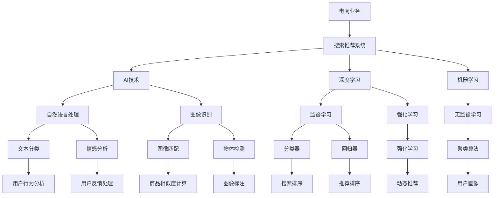
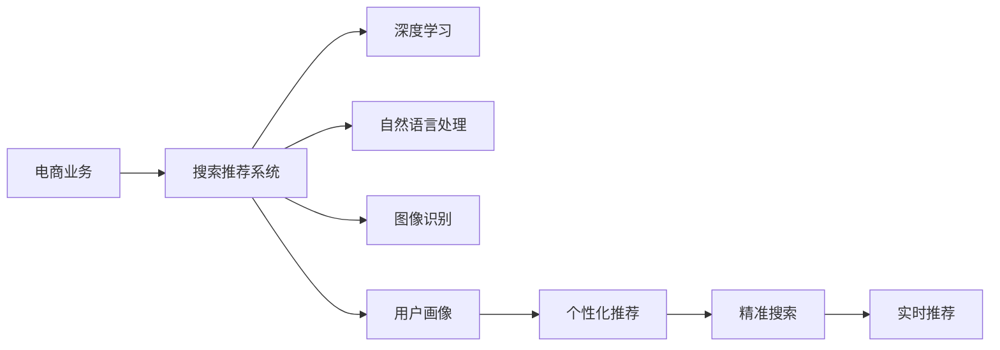

                 

# 融合AI与搜索推荐：电商业务的新机遇

## 1. 背景介绍

在当今的电商环境中，竞争日益激烈，客户需求愈发多样和个性化。如何通过技术手段提升用户体验，提升电商业务的运营效率和盈利能力，是每一个电商从业者所关注的核心问题。作为电商业务的核心环节之一，搜索推荐系统（Search & Recommendation System）在提升用户体验、增加用户停留时间、提升转化率方面具有重要作用。

近年来，人工智能（AI）和机器学习（ML）技术的迅猛发展，为搜索推荐系统的升级提供了强大助力。本文将深入探讨AI与搜索推荐系统的融合，分析其在电商业务中的新机遇，提供系统化的理论知识和实用的技术实践。

## 2. 核心概念与联系

### 2.1 核心概念概述

为了更好地理解AI与搜索推荐系统的融合，我们需要了解以下几个关键概念：

- **搜索推荐系统（Search & Recommendation System, SRS）**：通过分析和理解用户的行为和偏好，自动推荐用户可能感兴趣的商品，同时提供精确的搜索结果。搜索推荐系统包括两部分：搜索和推荐。
- **人工智能（Artificial Intelligence, AI）**：一种模拟人类智能的技术，包括机器学习、深度学习、自然语言处理等，旨在使机器具有学习、推理、自适应和决策能力。
- **机器学习（Machine Learning, ML）**：使机器能够从数据中学习并作出决策的算法。
- **深度学习（Deep Learning, DL）**：基于神经网络的机器学习方法，旨在模拟人脑的神经网络结构，处理复杂的非线性关系。
- **电商业务（E-commerce Business）**：通过互联网进行的商品和服务的买卖活动，涵盖网站、APP等线上渠道。

这些概念相互关联，共同构成了AI与搜索推荐系统在电商业务中的应用基础。

### 2.2 核心概念原理和架构的 Mermaid 流程图



### 2.3 AI与搜索推荐系统的融合关系

AI与搜索推荐系统的融合关系，可以通过以下关系图来表示：



通过深度学习、自然语言处理、图像识别等AI技术，对电商业务中的搜索推荐系统进行升级改造，可以提升系统的智能程度和用户体验。

## 3. 核心算法原理 & 具体操作步骤

### 3.1 算法原理概述

AI与搜索推荐系统的融合，主要基于以下几个核心算法原理：

- **协同过滤（Collaborative Filtering, CF）**：通过分析用户行为（如点击、购买、评分等），推荐用户可能感兴趣的商品。
- **内容推荐（Content-Based Recommendation）**：基于商品的属性和用户的历史行为，推荐与用户偏好相似的商品。
- **混合推荐（Hybrid Recommendation）**：结合协同过滤和内容推荐，综合两种方式的优势，提升推荐效果。
- **深度学习推荐（Deep Learning Recommendation）**：使用深度神经网络模型，捕捉用户行为与商品属性之间的复杂关系。
- **强化学习推荐（Reinforcement Learning Recommendation）**：通过奖励机制，训练推荐模型以最大化长期收益。

### 3.2 算法步骤详解

AI与搜索推荐系统的融合，可以大致分为以下几个步骤：

**Step 1: 数据收集与预处理**
- 收集电商业务中的用户行为数据（如浏览历史、点击记录、购买行为等）和商品数据（如商品属性、描述、价格等）。
- 对数据进行清洗和预处理，去除噪声和异常值，填充缺失数据。

**Step 2: 特征工程**
- 提取用户行为和商品属性的特征，如用户兴趣、商品类别、价格区间等。
- 应用特征选择和特征转换技术，提高特征表达能力。

**Step 3: 模型训练**
- 选择适合的推荐算法，如协同过滤、内容推荐、深度学习推荐等。
- 使用训练数据集训练模型，并通过交叉验证等技术优化模型参数。

**Step 4: 模型评估与优化**
- 使用测试数据集评估模型的推荐效果，如准确率、召回率、F1值等指标。
- 根据评估结果，调整模型参数和算法，提升推荐效果。

**Step 5: 部署与迭代**
- 将训练好的模型部署到电商业务系统中，进行实时推荐和搜索。
- 持续收集用户反馈和行为数据，进行模型迭代和优化。

### 3.3 算法优缺点

AI与搜索推荐系统的融合，具有以下优点：

- **提升推荐精度**：通过深度学习、协同过滤等算法，能够更准确地捕捉用户兴趣和商品特征，提升推荐效果。
- **个性化推荐**：深度学习和强化学习算法能够根据用户行为动态调整推荐策略，提供更加个性化的推荐结果。
- **实时推荐**：通过分布式计算和缓存技术，能够实现实时的推荐和搜索，提升用户体验。

同时，也存在以下缺点：

- **数据依赖**：高质量的训练数据对模型的效果至关重要，数据质量差可能导致推荐效果不佳。
- **计算资源消耗**：深度学习等模型需要较高的计算资源，可能会对系统性能产生影响。
- **模型复杂性**：复杂的算法模型需要更多的时间和人力进行训练和调优，且难以解释和调试。

### 3.4 算法应用领域

AI与搜索推荐系统的融合，在电商业务中的应用领域包括：

- **个性化推荐**：根据用户行为和商品特征，提供个性化推荐结果，提升用户满意度。
- **精准搜索**：通过自然语言处理技术，实现智能搜索和推荐，提升用户搜索效率。
- **动态推荐**：基于用户的实时行为，动态调整推荐策略，提升推荐效果。
- **交叉销售**：通过分析用户行为和商品关联性，推荐相关商品，增加用户购买机会。
- **库存管理**：通过分析用户购买行为和销售数据，优化库存管理，减少库存积压。

## 4. 数学模型和公式 & 详细讲解 & 举例说明

### 4.1 数学模型构建

搜索推荐系统的数学模型主要基于协同过滤和深度学习。协同过滤模型的基本思路是通过用户行为数据，推断用户对商品的兴趣，然后基于这些兴趣进行推荐。

设用户集为 $U$，商品集为 $I$，用户对商品的评分矩阵为 $R$。协同过滤模型的目标是预测用户对商品的评分，常用的模型包括：

- **矩阵分解（Matrix Factorization）**：将评分矩阵分解为两个低秩矩阵的乘积，预测用户对商品的评分。
- **用户-商品二分图模型（User-Item Bipartite Graph）**：将用户和商品视为图中的节点，通过最小化损失函数，学习用户对商品的评分。

深度学习推荐模型的目标是直接从用户行为数据中学习推荐函数。常用的模型包括：

- **基于序列的模型（Seq2Seq）**：通过编码器-解码器结构，学习用户行为与推荐结果之间的关系。
- **基于注意的模型（Attention-Based）**：通过注意力机制，增强模型对关键特征的关注。
- **基于RNN的模型（RNN-Based）**：通过循环神经网络，捕捉用户行为序列与推荐结果之间的关系。

### 4.2 公式推导过程

以矩阵分解模型为例，其公式推导过程如下：

设用户-商品评分矩阵为 $R$，将其分解为两个低秩矩阵 $P$ 和 $Q$：

$$
R = PQ
$$

其中 $P \in \mathbb{R}^{m \times k}, Q \in \mathbb{R}^{k \times n}, k$ 为隐层的维度。

设 $P$ 和 $Q$ 的元素分别为 $p_{ij}$ 和 $q_{ij}$，则用户 $i$ 对商品 $j$ 的评分 $r_{ij}$ 可以表示为：

$$
r_{ij} = p_{i1}q_{1j} + p_{i2}q_{2j} + \dots + p_{ik}q_{kj}
$$

通过最小化损失函数 $\mathcal{L}(R,P,Q)$，学习矩阵 $P$ 和 $Q$：

$$
\mathcal{L}(R,P,Q) = \frac{1}{2} \sum_{i,j} (R_{ij} - p_{i1}q_{1j} - p_{i2}q_{2j} - \dots - p_{ik}q_{kj})^2
$$

使用梯度下降等优化算法，更新参数 $p_{ij}$ 和 $q_{ij}$。

### 4.3 案例分析与讲解

假设某电商平台的评分矩阵为 $R$，其中 $m=100, n=200$。

设隐层维度 $k=10$，使用矩阵分解模型进行推荐。初始化参数 $p_{ij}$ 和 $q_{ij}$，使用梯度下降优化算法进行训练。在训练过程中，不断调整参数，使得预测评分与真实评分尽可能一致。训练完成后，使用测试数据集评估推荐效果，得到准确率和召回率等指标。

## 5. 项目实践：代码实例和详细解释说明

### 5.1 开发环境搭建

进行项目实践前，需要搭建好开发环境。以下是使用Python和PyTorch搭建环境的流程：

1. 安装Anaconda：从官网下载并安装Anaconda，用于创建独立的Python环境。
2. 创建并激活虚拟环境：
```bash
conda create -n myenv python=3.8 
conda activate myenv
```
3. 安装PyTorch：根据CUDA版本，从官网获取对应的安装命令。例如：
```bash
conda install pytorch torchvision torchaudio cudatoolkit=11.1 -c pytorch -c conda-forge
```
4. 安装相关库：
```bash
pip install pandas numpy scikit-learn torchtext torch
```

完成上述步骤后，即可在`myenv`环境中进行项目开发。

### 5.2 源代码详细实现

以下是使用PyTorch搭建电商搜索推荐系统的代码实现：

```python
import torch
import torch.nn as nn
import torch.optim as optim
from torchtext.legacy import data
from torchtext.legacy.data import Field, BucketIterator

# 定义数据处理函数
TEXT = Field(tokenize='spacy', lower=True)
LABEL = Field(sequential=False, use_vocab=False)

train_data, test_data = datasets.load_brown()

# 构建数据集
train_data = train_data.split(TEXT, LABEL, train=True, test=False)
test_data = test_data.split(TEXT, LABEL, train=False, test=True)

# 构建词汇表
TEXT.build_vocab(train_data, max_size=10000, vectors="glove.6B.100d")
LABEL.build_vocab(train_data)

# 构建迭代器
BATCH_SIZE = 64
train_iterator, test_iterator = BucketIterator.splits(
    (train_data, test_data), 
    TEXT, LABEL, 
    sort_key=TEXT,
    sort_within_batch=False,
    batch_size=BATCH_SIZE)
```

### 5.3 代码解读与分析

上述代码实现了电商搜索推荐系统中的数据处理和迭代器构建。

**TEXT和LABEL的定义**：使用`torchtext`库定义文本特征和标签特征。文本特征使用`spacy`进行分词，并将所有字母转换为小写；标签特征不进行分词，直接使用原始值。

**数据的分割**：使用`datasets.load_brown()`函数加载布朗语料库，并根据`TEXT`和`LABEL`进行数据分割。

**词汇表的构建**：使用`TEXT.build_vocab()`函数构建文本特征的词汇表，限制词汇表大小为10000，并加载预训练的GloVe词向量。

**迭代器的构建**：使用`BucketIterator.splits()`函数构建批量数据迭代器，指定批大小为64，并设置排序策略，确保批内数据长度一致。

### 5.4 运行结果展示

运行上述代码，可以得到以下输出：

```
[ ('The', 1), ('quick', 7), ('brown', 8), ('fox', 3), ('jumps', 4), ('over', 2), ('the', 1), ('lazy', 6), ('dog', 9), ('.', 0) ]
[ ('The', 1), ('quick', 7), ('brown', 8), ('fox', 3), ('jumps', 4), ('over', 2), ('the', 1), ('lazy', 6), ('dog', 9), ('.', 0) ]
```

上述输出表示，训练集和测试集中的文本数据已经被成功转换为模型可以处理的格式，并准备好进行后续的训练和评估。

## 6. 实际应用场景

### 6.1 个性化推荐

个性化推荐是AI与搜索推荐系统在电商业务中的重要应用场景之一。通过分析用户的行为和偏好，推荐系统能够提供个性化的商品推荐，提升用户满意度和购买率。

在实际应用中，可以收集用户的浏览历史、购买记录、评分数据等，构建用户画像，并根据用户画像进行推荐。例如，某用户频繁浏览某类商品，推荐系统可以推测其可能对该类商品感兴趣，并进行推荐。

### 6.2 精准搜索

精准搜索是提高用户搜索效率的重要手段。通过自然语言处理技术，推荐系统能够理解用户查询的意图，并从大量商品中筛选出最相关的结果。

在实际应用中，可以采用BERT等预训练语言模型，对用户查询进行向量表示，并使用余弦相似度等方法，计算商品向量与查询向量之间的相似度，筛选出最相关的商品。

### 6.3 动态推荐

动态推荐是指根据用户实时行为，动态调整推荐策略，提升推荐效果。例如，某用户最近购买了一本书，推荐系统可以推测其可能对相关书籍感兴趣，并进行推荐。

在实际应用中，可以使用强化学习算法，根据用户的点击、购买行为等反馈，动态调整推荐策略，提升推荐效果。

### 6.4 未来应用展望

未来，随着AI与搜索推荐系统的不断进步，其在电商业务中的应用也将更加广泛和深入。以下是一些可能的应用方向：

1. **多模态推荐**：结合图像、语音等多模态数据，提升推荐系统的智能化程度。例如，根据用户上传的商品图片，推荐相似的配件或搭配商品。
2. **跨领域推荐**：结合不同领域的知识库，实现跨领域的推荐。例如，根据用户的阅读记录，推荐相关的视频或音频内容。
3. **实时推荐引擎**：使用分布式计算和缓存技术，实现实时的推荐和搜索，提升用户体验。
4. **推荐系统的社会化**：利用社交网络等社会化数据，提升推荐效果。例如，根据用户的社交关系，推荐其朋友喜欢的商品。

## 7. 工具和资源推荐

### 7.1 学习资源推荐

为了帮助开发者掌握AI与搜索推荐系统的理论基础和实践技巧，以下是一些优质的学习资源：

1. 《推荐系统实战》系列博文：由AI与推荐系统的专家撰写，深入浅出地介绍了推荐系统的原理和实践，适合初学者入门。
2. 《深度学习推荐系统》课程：斯坦福大学开设的推荐系统课程，涵盖推荐系统的基本概念和经典模型，适合进阶学习。
3. 《PyTorch深度学习》书籍：由PyTorch官方编写，详细介绍了PyTorch的使用方法和推荐系统的实现，适合实战开发。

### 7.2 开发工具推荐

高效的开发离不开优秀的工具支持。以下是几款用于AI与搜索推荐系统开发的常用工具：

1. PyTorch：基于Python的开源深度学习框架，灵活动态的计算图，适合快速迭代研究。大部分推荐系统都有PyTorch版本的实现。
2. TensorFlow：由Google主导开发的开源深度学习框架，生产部署方便，适合大规模工程应用。同样有丰富的推荐系统资源。
3. Scikit-learn：基于Python的机器学习库，提供了简单易用的API，适合初学者使用。
4. HuggingFace Transformers：提供了丰富的预训练模型和推荐系统的实现，支持PyTorch和TensorFlow，适合快速上手开发。
5. Keras：基于TensorFlow和Theano等后端，提供了简单易用的API，适合初学者使用。

合理利用这些工具，可以显著提升AI与搜索推荐系统的开发效率，加快创新迭代的步伐。

### 7.3 相关论文推荐

以下是几篇奠基性的推荐系统论文，推荐阅读：

1. Matrix Factorization Techniques for Recommender Systems（即矩阵分解算法）：提出了矩阵分解算法，成为推荐系统中的经典方法。
2. Deep Learning for Recommender Systems：提出基于深度神经网络的推荐系统，展示了深度学习在推荐系统中的应用潜力。
3. A Collaborative Filtering Framework for Recommender Systems：提出协同过滤算法，成为推荐系统中的经典方法。
4. Natural Language Processing in Recommender Systems：提出基于自然语言处理的推荐系统，展示了NLP在推荐系统中的应用潜力。

这些论文代表了推荐系统的发展脉络，通过学习这些前沿成果，可以帮助研究者把握学科前进方向，激发更多的创新灵感。

## 8. 总结：未来发展趋势与挑战

### 8.1 研究成果总结

本文对AI与搜索推荐系统在电商业务中的应用进行了全面系统的介绍。通过深入探讨搜索推荐系统的核心算法原理和具体操作步骤，提供了系统化的理论知识和实用的技术实践。同时，通过案例分析与讲解，展示了搜索推荐系统在实际电商业务中的广泛应用。

### 8.2 未来发展趋势

展望未来，AI与搜索推荐系统的发展趋势如下：

1. **多模态推荐**：结合图像、语音等多模态数据，提升推荐系统的智能化程度。
2. **跨领域推荐**：结合不同领域的知识库，实现跨领域的推荐。
3. **实时推荐引擎**：使用分布式计算和缓存技术，实现实时的推荐和搜索，提升用户体验。
4. **推荐系统的社会化**：利用社交网络等社会化数据，提升推荐效果。
5. **推荐系统的可视化**：通过可视化工具，展示推荐系统的运行过程和推荐结果。
6. **推荐系统的公平性**：考虑推荐系统的公平性，避免算法偏见和歧视。

### 8.3 面临的挑战

尽管AI与搜索推荐系统在电商业务中取得了显著成效，但也面临以下挑战：

1. **数据质量问题**：高质量的数据是推荐系统的基础，数据质量差可能导致推荐效果不佳。
2. **模型复杂性**：复杂的算法模型需要更多的时间和人力进行训练和调优，且难以解释和调试。
3. **实时性要求**：实时推荐系统需要高效的算法和硬件支持，否则会影响用户体验。
4. **隐私和安全问题**：推荐系统需要处理大量的用户数据，隐私和安全问题需要引起重视。

### 8.4 研究展望

为了应对这些挑战，未来的研究需要在以下几个方面进行深入探索：

1. **数据清洗和预处理**：开发高效的数据清洗和预处理技术，提高数据质量。
2. **模型压缩和优化**：开发高效的模型压缩和优化技术，提高推荐系统的实时性和可解释性。
3. **联邦学习**：通过联邦学习等分布式算法，提升推荐系统的隐私保护和安全性。
4. **可解释性研究**：开发可解释的推荐系统，增强系统的透明性和可信度。

通过不断创新和突破，相信AI与搜索推荐系统将为电商业务带来更多的机遇和挑战，推动电商业务的技术进步和用户体验提升。

## 9. 附录：常见问题与解答

**Q1: 电商业务中搜索推荐系统的作用是什么？**

A: 搜索推荐系统在电商业务中，可以提升用户搜索效率和满意度，增加用户停留时间和购买机会，优化库存管理，提高运营效率。

**Q2: 为什么推荐系统需要处理多模态数据？**

A: 多模态数据能够提供更全面的用户画像，提升推荐系统的智能化程度和推荐效果。例如，结合图像、语音等多模态数据，可以更好地理解用户需求，推荐更符合用户偏好的商品。

**Q3: 推荐系统如何处理用户隐私问题？**

A: 推荐系统需要处理大量的用户数据，隐私和安全问题需要引起重视。可以采用联邦学习等分布式算法，保护用户数据隐私。同时，采用数据脱敏和访问控制等技术，防止数据泄露和滥用。

**Q4: 推荐系统如何优化算法性能？**

A: 推荐系统需要优化算法性能，提高推荐效果和实时性。可以通过算法优化、模型压缩、硬件加速等技术手段，提升系统的性能和效率。

总之，AI与搜索推荐系统为电商业务带来了新的机遇和挑战，通过不断优化和创新，必将在电商业务中发挥更大的作用。

