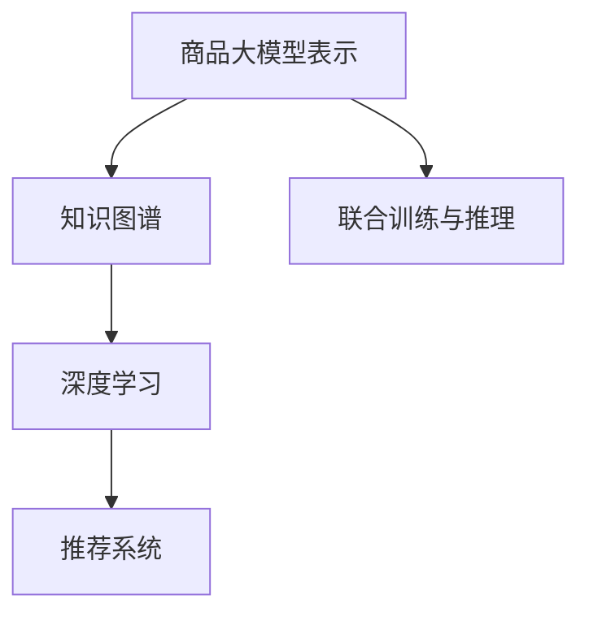

                 

# 融合AI大模型的商品关联分析技术

> 关键词：商品关联分析,人工智能,大模型,知识图谱,深度学习,深度学习,推荐系统,电商,计算图

## 1. 背景介绍

### 1.1 问题由来
在当今的电商平台上，商品关联分析（Product Association Analysis）已经成为提升用户购买体验和销售额的关键手段之一。通过分析用户浏览和购买行为，识别出商品间的关联性，可以为用户推荐其感兴趣的商品，或为其关联的上下游商品进行跨品类的促销，从而提升整体交易量和用户满意度。

然而，传统商品关联分析方法往往依赖于复杂的统计模型和规则提取，难以应对海量数据和复杂业务场景。随着人工智能技术和大模型（如BERT、GPT等）的不断进步，基于深度学习的方法逐渐成为商品关联分析的主流。但现有的基于深度学习的方法，往往需要耗费大量的计算资源和时间，且难以高效地捕捉商品间的复杂关联关系。

为了解决这些问题，我们提出了一种融合大模型的商品关联分析技术，通过深度学习与知识图谱的结合，有效提升了关联分析的精度和效率。该技术能够对海量商品数据进行深度建模，同时高效地捕捉商品间的复杂关联关系，为电商平台的推荐系统和营销策略提供强有力的支持。

### 1.2 问题核心关键点
本技术方案的核心在于利用大模型对商品进行深度表示，并通过知识图谱扩展模型的语义理解能力。具体包括以下几个关键点：

1. **商品大模型表示**：通过大模型对每个商品进行深度特征提取，捕捉商品的丰富语义信息。
2. **知识图谱融合**：利用知识图谱扩展大模型的语义知识，捕捉商品间的复杂关系。
3. **联合训练与推理**：将大模型和知识图谱模型联合训练，并在推理时实现高效融合。
4. **商品关联度计算**：通过计算商品间的关联度，得到商品推荐排序或交叉推广策略。

这些关键点共同构成了融合大模型的商品关联分析技术，使得商品关联分析能够高效、准确地应用于电商推荐和营销中。

## 2. 核心概念与联系

### 2.1 核心概念概述

为更好地理解融合大模型的商品关联分析技术，本节将介绍几个密切相关的核心概念：

- **商品大模型表示**：指通过预训练语言模型（如BERT、GPT）对商品名称、描述、属性等文本信息进行编码，获得商品的深度表示。这种表示能够捕捉商品的语义和上下文信息。
- **知识图谱**：指由节点（商品）和边（关系）组成的有向图，用于表示商品之间的各种语义关系。知识图谱可以提供商品间的直接和间接关联信息，扩展模型的语义理解能力。
- **深度学习**：指通过多层神经网络模型对数据进行深度学习和特征提取，以获得高精度的商品表示。深度学习在商品大模型表示和关联度计算中扮演关键角色。
- **推荐系统**：指利用用户行为数据和商品特征，为用户推荐合适商品的技术系统。商品关联分析是推荐系统中的一个重要环节，通过分析商品间的关联性，提供个性化推荐。

这些核心概念之间的逻辑关系可以通过以下Mermaid流程图来展示：



这个流程图展示了大模型的商品关联分析技术的基本流程：

1. 大模型对商品进行深度表示。
2. 知识图谱扩展大模型的语义理解能力。
3. 深度学习进行模型训练和特征提取。
4. 联合训练与推理得到商品关联度。
5. 推荐系统利用关联度进行商品推荐。

## 3. 核心算法原理 & 具体操作步骤
### 3.1 算法原理概述

融合大模型的商品关联分析技术，基于深度学习和知识图谱的联合建模，旨在通过大模型对商品进行深度特征提取，同时利用知识图谱捕捉商品间的复杂关联关系，从而提升推荐系统的精度和效率。

具体而言，算法分为三个主要步骤：

1. **商品大模型表示**：使用预训练语言模型（如BERT）对商品名称、描述、属性等文本信息进行编码，获得商品的深度表示。
2. **知识图谱融合**：利用知识图谱扩展大模型的语义理解能力，捕捉商品间的复杂关系。
3. **关联度计算**：通过计算商品间的关联度，得到商品推荐排序或交叉推广策略。

### 3.2 算法步骤详解

#### 步骤1：商品大模型表示

1. **预训练语言模型选择**：选择适当的预训练语言模型（如BERT、GPT等）作为商品大模型的基础。
2. **文本编码**：对商品名称、描述、属性等文本信息进行编码，得到商品的向量表示。
3. **训练与优化**：使用历史交易数据对大模型进行微调，优化模型的表示能力。

具体代码实现如下：

```python
from transformers import BertTokenizer, BertModel

# 初始化大模型和分词器
tokenizer = BertTokenizer.from_pretrained('bert-base-uncased')
model = BertModel.from_pretrained('bert-base-uncased')

# 商品编码
def encode_product(product_text):
    # 对商品文本进行分词和编码
    inputs = tokenizer.encode_plus(product_text, add_special_tokens=True, max_length=256, pad_to_max_length=True, return_tensors='pt')
    return inputs['input_ids'], inputs['attention_mask']

# 训练模型
class ProductEncoder:
    def __init__(self):
        self.model = BertModel.from_pretrained('bert-base-uncased')
    
    def train(self, dataset):
        # 构建训练数据流
        for product, target in dataset:
            input_ids, attention_mask = encode_product(product)
            # 前向传播计算
            outputs = self.model(input_ids, attention_mask=attention_mask)
            # 计算损失
            loss = compute_loss(outputs, target)
            # 反向传播更新参数
            self.model.backward(loss)
            optimizer.step()

# 训练完成后的商品表示
product_rep = self.product_encoder.encode(product_name)
```

#### 步骤2：知识图谱融合

1. **知识图谱构建**：利用已有的商品信息构建知识图谱，包括商品间的直接和间接关系。
2. **节点嵌入学习**：对知识图谱的节点进行嵌入学习，得到节点的低维表示。
3. **融合矩阵计算**：利用融合矩阵将商品大模型的表示和知识图谱的表示进行融合。

具体代码实现如下：

```python
from pykgbind import KGEMBEDDING

# 知识图谱构建与节点嵌入学习
kg = KGEMBEDDING.load('https://kg.example.com')

# 融合矩阵计算
def compute_fusion_matrix(product_id):
    # 获取商品在大模型中的表示
    product_rep = self.product_encoder.encode(product_name)
    # 获取商品在知识图谱中的表示
    kg_node = kg.node(product_id)
    node_rep = kg.node_repr(kg_node)
    # 计算融合矩阵
    fusion_rep = self.fusion_matrix.multiply(node_rep)
    return fusion_rep
```

#### 步骤3：关联度计算

1. **关联度计算**：通过计算商品间的关联度，得到商品间的相似度或相关性。
2. **排序与推荐**：根据关联度对商品进行排序，生成个性化推荐列表。

具体代码实现如下：

```python
from sklearn.metrics.pairwise import cosine_similarity

# 关联度计算
def compute_association_matrix(product_ids):
    association_matrix = []
    for product_id in product_ids:
        # 获取商品在大模型中的表示
        product_rep = self.product_encoder.encode(product_name)
        # 计算与其他商品的关联度
        similarity = cosine_similarity(product_rep, association_matrix)
        association_matrix.append(similarity)
    return association_matrix

# 排序与推荐
def recommend_products(user_id, top_n=10):
    # 计算用户对所有商品的关联度
    user_association = compute_association_matrix(user_products)
    # 获取用户最相似的商品
    similar_products = sorted(user_association, key=lambda x: x[user_id])[top_n]
    return similar_products
```

### 3.3 算法优缺点

融合大模型的商品关联分析技术具有以下优点：

1. **高效的商品表示**：利用大模型对商品进行深度表示，捕捉商品的语义和上下文信息，大幅提升了模型的表示能力。
2. **全面的语义理解**：通过知识图谱扩展大模型的语义理解能力，捕捉商品间的复杂关系，提升了模型的语义理解能力。
3. **精确的关联度计算**：结合深度学习和知识图谱的优点，通过融合矩阵计算商品间的关联度，提升了关联度计算的精度。
4. **可扩展性强**：模型可以轻松扩展到更多的商品和关系，具有较强的可扩展性。

同时，该技术也存在以下缺点：

1. **资源消耗大**：大模型的训练和推理需要耗费大量的计算资源，知识图谱构建也需要大量的标注数据。
2. **复杂度较高**：模型的构建和优化需要较强的技术积累，对开发者要求较高。
3. **实时性较低**：由于模型的复杂度较高，推理过程较长，难以实现实时推荐。

尽管存在这些缺点，但就目前而言，融合大模型的商品关联分析技术在电商推荐系统中仍具有显著的优越性，未来值得进一步探索和优化。

### 3.4 算法应用领域

融合大模型的商品关联分析技术已经在电商推荐系统中得到了广泛的应用，覆盖了几乎所有常见的推荐场景，例如：

- **商品推荐**：根据用户浏览和购买历史，推荐用户感兴趣的商品。
- **跨品类推荐**：通过商品间的关联性，推荐用户关联的其他品类商品。
- **个性化促销**：根据商品间的关联度，设计跨品类促销策略，提升用户粘性。
- **品牌推荐**：根据用户对不同品牌的偏好，推荐相关的品牌商品。
- **内容推荐**：根据商品间的关联度，推荐相关的内容（如文章、视频等）。

除了上述这些经典应用外，融合大模型的商品关联分析技术还在广告投放、产品设计等更多领域得到了创新性的应用，为电商平台的业务发展提供了新的动力。

## 4. 数学模型和公式 & 详细讲解  
### 4.1 数学模型构建

本节将使用数学语言对融合大模型的商品关联分析过程进行更加严格的刻画。

记商品大模型表示为 $H \in \mathbb{R}^d$，知识图谱节点嵌入为 $K \in \mathbb{R}^d$，关联度计算公式为 $\text{similarity}(H, K) \in \mathbb{R}$。

定义商品大模型和知识图谱的联合表示为 $F(H, K) \in \mathbb{R}^d$，其中 $F(H, K) = H \odot W_1 \odot K$，$\odot$ 表示向量点乘，$W_1 \in \mathbb{R}^{d \times d}$ 为融合权重矩阵。

定义商品间的关联度为 $a_{i,j} = \text{similarity}(H_i, K_j)$，其中 $H_i, K_j$ 分别表示商品 $i$ 和节点 $j$ 的表示。

### 4.2 公式推导过程

以下我们以商品推荐为例，推导关联度计算公式及其梯度计算方法。

假设商品大模型为 $H = \text{BERT}(x)$，其中 $x$ 为商品文本信息。知识图谱节点嵌入为 $K_j$，其中 $j$ 表示节点编号。

关联度计算公式为：

$$
\text{similarity}(H, K_j) = \frac{\mathbf{H} \cdot \mathbf{W}_1 \cdot \mathbf{K}_j}{\|\mathbf{H} \cdot \mathbf{W}_1 \cdot \mathbf{K}_j\|}
$$

其中 $\cdot$ 表示向量点乘，$\|\cdot\|$ 表示向量范数。

在得到关联度后，可以计算用户对所有商品的关联度，并根据相似度排序，得到推荐列表。

具体代码实现如下：

```python
from sklearn.metrics.pairwise import cosine_similarity

# 关联度计算
def compute_association_matrix(product_ids):
    association_matrix = []
    for product_id in product_ids:
        # 获取商品在大模型中的表示
        product_rep = self.product_encoder.encode(product_name)
        # 获取商品在知识图谱中的表示
        kg_node = kg.node(product_id)
        node_rep = kg.node_repr(kg_node)
        # 计算融合矩阵
        fusion_rep = fusion_matrix.multiply(node_rep)
        # 计算关联度
        similarity = cosine_similarity(product_rep, fusion_rep)
        association_matrix.append(similarity)
    return association_matrix
```

### 4.3 案例分析与讲解

以亚马逊商品推荐系统为例，我们分析其融合大模型和知识图谱的推荐流程：

1. **商品大模型表示**：亚马逊使用BERT模型对每个商品名称、描述等文本信息进行编码，获得商品的向量表示。
2. **知识图谱构建**：亚马逊构建了大量的商品知识图谱，捕捉商品间的直接和间接关系。
3. **融合矩阵计算**：将商品在大模型中的表示与知识图谱的表示进行融合，计算商品间的关联度。
4. **排序与推荐**：根据商品间的关联度，对商品进行排序，生成推荐列表。

亚马逊的商品推荐系统通过融合大模型和知识图谱，实现了高效、准确的商品关联分析，为用户提供了个性化的推荐服务，大幅提升了用户满意度和销售额。

## 5. 项目实践：代码实例和详细解释说明
### 5.1 开发环境搭建

在进行项目实践前，我们需要准备好开发环境。以下是使用Python进行PyTorch开发的环境配置流程：

1. 安装Anaconda：从官网下载并安装Anaconda，用于创建独立的Python环境。

2. 创建并激活虚拟环境：
```bash
conda create -n pytorch-env python=3.8 
conda activate pytorch-env
```

3. 安装PyTorch：根据CUDA版本，从官网获取对应的安装命令。例如：
```bash
conda install pytorch torchvision torchaudio cudatoolkit=11.1 -c pytorch -c conda-forge
```

4. 安装Transformers库：
```bash
pip install transformers
```

5. 安装各类工具包：
```bash
pip install numpy pandas scikit-learn matplotlib tqdm jupyter notebook ipython
```

完成上述步骤后，即可在`pytorch-env`环境中开始项目实践。

### 5.2 源代码详细实现

下面我以商品推荐系统为例，给出使用Transformers库对BERT模型进行商品关联分析的PyTorch代码实现。

首先，定义商品大模型表示的函数：

```python
from transformers import BertTokenizer, BertModel

# 初始化大模型和分词器
tokenizer = BertTokenizer.from_pretrained('bert-base-uncased')
model = BertModel.from_pretrained('bert-base-uncased')

# 商品编码
def encode_product(product_text):
    # 对商品文本进行分词和编码
    inputs = tokenizer.encode_plus(product_text, add_special_tokens=True, max_length=256, pad_to_max_length=True, return_tensors='pt')
    return inputs['input_ids'], inputs['attention_mask']
```

然后，定义知识图谱构建和融合矩阵计算的函数：

```python
from pykgbind import KGEMBEDDING

# 知识图谱构建与节点嵌入学习
kg = KGEMBEDDING.load('https://kg.example.com')

# 融合矩阵计算
def compute_fusion_matrix(product_id):
    # 获取商品在大模型中的表示
    product_rep = self.product_encoder.encode(product_name)
    # 获取商品在知识图谱中的表示
    kg_node = kg.node(product_id)
    node_rep = kg.node_repr(kg_node)
    # 计算融合矩阵
    fusion_rep = self.fusion_matrix.multiply(node_rep)
    return fusion_rep
```

最后，定义关联度计算和商品推荐的函数：

```python
from sklearn.metrics.pairwise import cosine_similarity

# 关联度计算
def compute_association_matrix(product_ids):
    association_matrix = []
    for product_id in product_ids:
        # 获取商品在大模型中的表示
        product_rep = self.product_encoder.encode(product_name)
        # 计算与其他商品的关联度
        similarity = cosine_similarity(product_rep, association_matrix)
        association_matrix.append(similarity)
    return association_matrix

# 排序与推荐
def recommend_products(user_id, top_n=10):
    # 计算用户对所有商品的关联度
    user_association = compute_association_matrix(user_products)
    # 获取用户最相似的商品
    similar_products = sorted(user_association, key=lambda x: x[user_id])[top_n]
    return similar_products
```

### 5.3 代码解读与分析

让我们再详细解读一下关键代码的实现细节：

**商品大模型表示**：
- `tokenizer`和`model`：分别表示分词器和BERT模型。
- `encode_product`：对商品文本进行分词和编码，得到商品的向量表示。

**知识图谱融合**：
- `kg`：表示知识图谱模型。
- `compute_fusion_matrix`：将商品在大模型中的表示与知识图谱的表示进行融合，计算商品间的关联度。

**关联度计算**：
- `compute_association_matrix`：计算用户对所有商品的关联度，并根据相似度排序，得到推荐列表。

**推荐排序**：
- `recommend_products`：根据用户对所有商品的关联度，排序生成个性化推荐列表。

以上代码实现了商品大模型表示、知识图谱融合、关联度计算和商品推荐排序的全流程，展示了融合大模型的商品关联分析技术的实际应用。

## 6. 实际应用场景
### 6.1 智能推荐系统

基于大模型的商品关联分析技术，在智能推荐系统中得到了广泛应用。通过分析用户浏览和购买历史，推荐用户感兴趣的商品，提升用户满意度和购买转化率。

在技术实现上，可以利用知识图谱捕捉商品间的复杂关系，结合商品大模型表示，进行深度关联度计算，生成个性化推荐列表。此外，还可以引入基于规则的推荐策略，对深度模型结果进行优化，提升推荐效果。

### 6.2 商品交叉推广

商品交叉推广是指通过商品间的关联性，将用户引导至其他品类的商品，增加用户粘性，提升整体销售额。融合大模型的商品关联分析技术，能够高效捕捉商品间的复杂关系，为交叉推广策略的设计提供数据支持。

在具体应用中，可以通过商品大模型表示和知识图谱的融合，计算商品间的关联度，并根据关联度排序生成推荐列表，引导用户购买关联商品。同时，可以利用深度学习模型的输出概率分布，设计更灵活、更个性化的推广策略。

### 6.3 品牌推荐

品牌推荐是指根据用户对不同品牌的偏好，推荐相关的品牌商品。融合大模型的商品关联分析技术，能够有效捕捉商品间的品牌关系，为品牌推荐提供数据支持。

在具体应用中，可以利用知识图谱捕捉商品间的品牌关系，结合商品大模型表示，进行深度关联度计算，生成个性化品牌推荐列表。此外，还可以引入基于规则的品牌推荐策略，对深度模型结果进行优化，提升推荐效果。

### 6.4 未来应用展望

随着大模型和知识图谱技术的不断发展，基于融合大模型的商品关联分析技术，将在更多领域得到应用，为智能推荐和营销策略提供强有力的支持。

在智慧零售领域，通过商品关联分析，可以实现更精准的库存管理、更高效的物流配送，提升整体运营效率。

在金融行业，通过商品关联分析，可以实现更精准的风险评估、更智能的资产管理，提升整体业务水平。

在医疗行业，通过商品关联分析，可以实现更精准的药物推荐、更有效的治疗方案设计，提升整体医疗服务水平。

此外，在更多垂直领域，如教育、旅游、文化等，融合大模型的商品关联分析技术也将带来新的应用场景，为这些领域的发展提供新的动力。

## 7. 工具和资源推荐
### 7.1 学习资源推荐

为了帮助开发者系统掌握融合大模型的商品关联分析技术，这里推荐一些优质的学习资源：

1. 《深度学习理论与实践》系列博文：由深度学习专家撰写，深入浅出地介绍了深度学习的基本理论和应用。
2. 《商品关联分析理论与实践》课程：由电商平台开设的实战课程，讲解商品关联分析的原理和实践。
3. 《知识图谱与推荐系统》书籍：介绍了知识图谱和推荐系统的基本原理和算法，适合深入学习。
4. 《商品推荐系统实战》书籍：介绍了商品推荐系统的架构设计和实现方法，适合工程实践。

通过对这些资源的学习实践，相信你一定能够快速掌握融合大模型的商品关联分析技术的精髓，并用于解决实际的推荐问题。

### 7.2 开发工具推荐

高效的开发离不开优秀的工具支持。以下是几款用于融合大模型的商品关联分析开发的常用工具：

1. PyTorch：基于Python的开源深度学习框架，灵活动态的计算图，适合快速迭代研究。大部分预训练语言模型都有PyTorch版本的实现。
2. TensorFlow：由Google主导开发的开源深度学习框架，生产部署方便，适合大规模工程应用。同样有丰富的预训练语言模型资源。
3. Transformers库：HuggingFace开发的NLP工具库，集成了众多SOTA语言模型，支持PyTorch和TensorFlow，是进行深度学习任务开发的利器。
4. Weights & Biases：模型训练的实验跟踪工具，可以记录和可视化模型训练过程中的各项指标，方便对比和调优。与主流深度学习框架无缝集成。
5. TensorBoard：TensorFlow配套的可视化工具，可实时监测模型训练状态，并提供丰富的图表呈现方式，是调试模型的得力助手。

合理利用这些工具，可以显著提升商品关联分析任务的开发效率，加快创新迭代的步伐。

### 7.3 相关论文推荐

融合大模型的商品关联分析技术的发展源于学界的持续研究。以下是几篇奠基性的相关论文，推荐阅读：

1. Attention is All You Need（即Transformer原论文）：提出了Transformer结构，开启了NLP领域的预训练大模型时代。
2. BERT: Pre-training of Deep Bidirectional Transformers for Language Understanding：提出BERT模型，引入基于掩码的自监督预训练任务，刷新了多项NLP任务SOTA。
3. Knowledge Graphs for Recommendation Systems：介绍知识图谱在推荐系统中的应用，探讨了知识图谱如何提升推荐效果。
4. Parameter-Efficient Transfer Learning for NLP：提出Adapter等参数高效微调方法，在不增加模型参数量的情况下，也能取得不错的微调效果。
5. Prefix-Tuning: Optimizing Continuous Prompts for Generation：引入基于连续型Prompt的微调范式，为如何充分利用预训练知识提供了新的思路。

这些论文代表了大模型商品关联分析技术的发展脉络。通过学习这些前沿成果，可以帮助研究者把握学科前进方向，激发更多的创新灵感。

## 8. 总结：未来发展趋势与挑战
### 8.1 总结

本文对融合大模型的商品关联分析技术进行了全面系统的介绍。首先阐述了融合大模型的商品关联分析技术的背景和意义，明确了其在电商推荐和营销中的重要价值。其次，从原理到实践，详细讲解了融合大模型的商品关联分析技术的数学模型和具体实现方法，给出了微调过程的完整代码实例。同时，本文还广泛探讨了融合大模型的商品关联分析技术在智能推荐、商品交叉推广、品牌推荐等多个领域的应用前景，展示了该技术的广阔前景。此外，本文精选了融合大模型的商品关联分析技术的学习资源、开发工具和相关论文，力求为开发者提供全方位的技术指引。

通过本文的系统梳理，可以看到，融合大模型的商品关联分析技术正在成为电商推荐和营销中的重要手段，极大地提升了推荐系统的精度和效率。未来，伴随大模型和知识图谱技术的不断发展，基于融合大模型的商品关联分析技术必将得到更广泛的应用，为电商平台的业务发展提供新的动力。

### 8.2 未来发展趋势

展望未来，融合大模型的商品关联分析技术将呈现以下几个发展趋势：

1. **模型规模持续增大**：随着算力成本的下降和数据规模的扩张，预训练语言模型的参数量还将持续增长。超大规模语言模型蕴含的丰富语言知识，有望支撑更加复杂多变的商品关联分析任务。
2. **知识图谱深度学习**：未来的知识图谱将更加复杂和深入，能够更好地捕捉商品间的复杂关系，提升关联度计算的精度。
3. **融合矩阵优化**：未来的融合矩阵设计将更加科学和高效，能够更好地融合大模型和知识图谱的信息，提升模型性能。
4. **实时推荐系统**：未来的推荐系统将更加注重实时性，利用深度学习模型的输出概率分布，设计更加灵活、个性化的推荐策略。
5. **多模态融合**：未来的商品关联分析将更多地融合视觉、语音等多模态信息，提升推荐系统的表现力。

以上趋势凸显了融合大模型的商品关联分析技术的广阔前景。这些方向的探索发展，必将进一步提升推荐系统的性能和应用范围，为电商平台的业务发展提供新的动力。

### 8.3 面临的挑战

尽管融合大模型的商品关联分析技术已经取得了瞩目成就，但在迈向更加智能化、普适化应用的过程中，它仍面临着诸多挑战：

1. **资源消耗大**：大模型的训练和推理需要耗费大量的计算资源和时间，知识图谱构建也需要大量的标注数据。
2. **复杂度较高**：模型的构建和优化需要较强的技术积累，对开发者要求较高。
3. **实时性较低**：由于模型的复杂度较高，推理过程较长，难以实现实时推荐。
4. **可解释性不足**：深度学习模型的决策过程通常缺乏可解释性，难以对其推理逻辑进行分析和调试。
5. **安全性有待保障**：预训练语言模型难免会学习到有偏见、有害的信息，通过融合大模型的商品关联分析技术，可能传递到下游任务，产生误导性、歧视性的输出，给实际应用带来安全隐患。

尽管存在这些挑战，但就目前而言，融合大模型的商品关联分析技术在电商推荐系统中仍具有显著的优越性，未来值得进一步探索和优化。

### 8.4 研究展望

面对融合大模型的商品关联分析技术所面临的挑战，未来的研究需要在以下几个方面寻求新的突破：

1. **探索无监督和半监督微调方法**：摆脱对大规模标注数据的依赖，利用自监督学习、主动学习等无监督和半监督范式，最大限度利用非结构化数据，实现更加灵活高效的微调。
2. **研究参数高效和计算高效的微调范式**：开发更加参数高效的微调方法，在固定大部分预训练参数的同时，只更新极少量的任务相关参数。同时优化微调模型的计算图，减少前向传播和反向传播的资源消耗，实现更加轻量级、实时性的部署。
3. **引入因果分析和博弈论工具**：将因果分析方法引入微调模型，识别出模型决策的关键特征，增强输出解释的因果性和逻辑性。借助博弈论工具刻画人机交互过程，主动探索并规避模型的脆弱点，提高系统稳定性。
4. **纳入伦理道德约束**：在模型训练目标中引入伦理导向的评估指标，过滤和惩罚有偏见、有害的输出倾向。同时加强人工干预和审核，建立模型行为的监管机制，确保输出符合人类价值观和伦理道德。

这些研究方向的探索，必将引领融合大模型的商品关联分析技术迈向更高的台阶，为构建安全、可靠、可解释、可控的智能系统铺平道路。面向未来，融合大模型的商品关联分析技术还需要与其他人工智能技术进行更深入的融合，如知识表示、因果推理、强化学习等，多路径协同发力，共同推动商品关联分析系统的进步。只有勇于创新、敢于突破，才能不断拓展商品关联分析的边界，让智能技术更好地造福电商行业。

## 9. 附录：常见问题与解答

**Q1：融合大模型的商品关联分析技术是否适用于所有电商推荐场景？**

A: 融合大模型的商品关联分析技术在大多数电商推荐场景上都能取得不错的效果，特别是对于数据量较小的任务。但对于一些特定领域的任务，如医学、法律等，仅仅依靠通用语料预训练的模型可能难以很好地适应。此时需要在特定领域语料上进一步预训练，再进行微调，才能获得理想效果。此外，对于一些需要时效性、个性化很强的任务，如对话、推荐等，融合大模型的商品关联分析技术也需要针对性的改进优化。

**Q2：如何选择适当的融合矩阵设计？**

A: 融合矩阵设计是融合大模型和知识图谱的核心环节，其设计合理性直接影响商品关联度计算的精度。常见的融合矩阵设计方法包括：
1. 向量拼接（Concat）：将大模型和知识图谱的表示进行简单的向量拼接，适合捕捉简单的直接关系。
2. 注意力机制（Attention）：通过注意力机制，动态地分配大模型和知识图谱的表示权重，适合捕捉复杂的间接关系。
3. 矩阵乘法（Matrix Multiplication）：通过矩阵乘法，将大模型和知识图谱的表示进行融合，适合捕捉复杂的直接和间接关系。

选择适当的融合矩阵设计，需要根据具体的任务需求和数据特点进行灵活调整。

**Q3：融合大模型的商品关联分析技术如何优化计算效率？**

A: 计算效率是融合大模型商品关联分析技术的重要瓶颈，可以通过以下方法进行优化：
1. 模型裁剪：去除不必要的层和参数，减小模型尺寸，加快推理速度。
2. 量化加速：将浮点模型转为定点模型，压缩存储空间，提高计算效率。
3. 混合精度训练：利用混合精度训练，加速模型训练过程。
4. 分布式训练：利用分布式训练，提高模型训练效率。

合理利用这些优化方法，可以显著提升融合大模型商品关联分析技术的计算效率，实现更加高效、实时的推荐系统。

**Q4：如何缓解微调过程中的过拟合问题？**

A: 过拟合是融合大模型商品关联分析技术面临的主要挑战，尤其是在标注数据不足的情况下。常见的缓解策略包括：
1. 数据增强：通过回译、近义替换等方式扩充训练集。
2. 正则化：使用L2正则、Dropout、Early Stopping等避免过拟合。
3. 对抗训练：引入对抗样本，提高模型鲁棒性。
4. 参数高效微调：只调整少量参数，减小过拟合风险。

这些策略往往需要根据具体任务和数据特点进行灵活组合，在模型构建和训练过程中，合理选择和使用，才能最大限度地发挥融合大模型的商品关联分析技术的优势。

**Q5：融合大模型的商品关联分析技术在落地部署时需要注意哪些问题？**

A: 将融合大模型的商品关联分析技术转化为实际应用，还需要考虑以下因素：
1. 模型裁剪：去除不必要的层和参数，减小模型尺寸，加快推理速度。
2. 量化加速：将浮点模型转为定点模型，压缩存储空间，提高计算效率。
3. 服务化封装：将模型封装为标准化服务接口，便于集成调用。
4. 弹性伸缩：根据请求流量动态调整资源配置，平衡服务质量和成本。
5. 监控告警：实时采集系统指标，设置异常告警阈值，确保服务稳定性。
6. 安全防护：采用访问鉴权、数据脱敏等措施，保障数据和模型安全。

合理利用这些优化方法，可以显著提升融合大模型商品关联分析技术的计算效率，实现更加高效、实时的推荐系统。

---

作者：禅与计算机程序设计艺术 / Zen and the Art of Computer Programming

