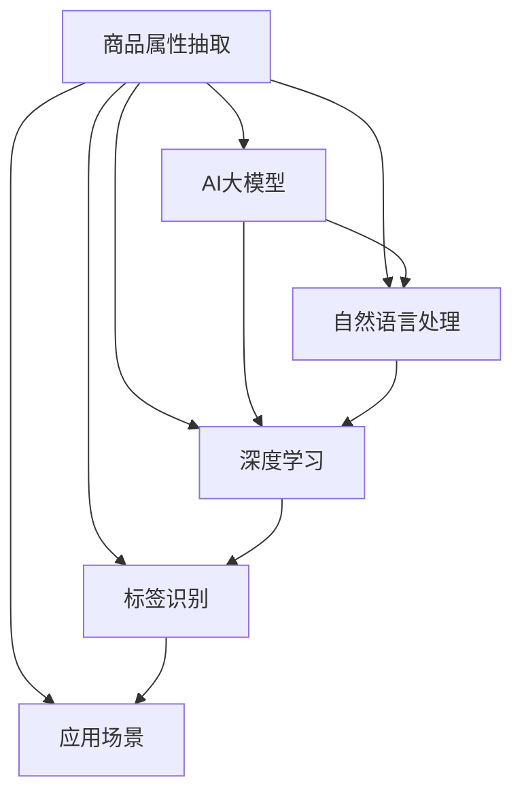

                 

# 融合AI大模型的商品属性抽取技术

> 关键词：商品属性抽取, AI大模型, 自然语言处理(NLP), 深度学习, 标签识别, 应用场景, 技术优化

## 1. 背景介绍

### 1.1 问题由来
随着电子商务的蓬勃发展，商品信息的获取和分析愈发重要。精准的商品属性抽取不仅可以大大提高搜索引擎的召回率和相关性，还能极大地改善推荐系统的个性化程度。但传统的基于规则或特征工程的抽取方法，往往需要大量的人工标注和复杂的特征工程，成本高且效率低。近年来，基于AI大模型的自动抽取技术逐渐成为热点。

### 1.2 问题核心关键点
AI大模型通过自监督预训练获得广泛的语义理解能力，可以在特定任务上进行微调，实现高效的标签识别。但现有的大模型往往缺少针对商品属性抽取任务的优化，实际应用效果仍有提升空间。

### 1.3 问题研究意义
商品属性抽取是电子商务领域的重要技术，涉及商品检索、推荐、广告投放等多个场景，对用户满意度有直接影响。通过AI大模型对商品属性进行精准抽取，能够提高用户搜索体验，提升推荐系统的个性化推荐能力，降低广告投放成本，从而推动电商行业的健康发展。

## 2. 核心概念与联系

### 2.1 核心概念概述

为更好地理解商品属性抽取技术，本节将介绍几个关键概念及其相互关系：

- 商品属性抽取(Attribute Extraction): 从商品描述中自动抽取关键属性信息，如尺寸、颜色、材质等，用于辅助搜索和推荐。
- AI大模型: 以自监督预训练为代表的大规模语言模型，如BERT、GPT-3等，通过大规模数据预训练获得了强大的语义表示能力。
- 自然语言处理(NLP): 涉及文本数据的处理和分析，包括文本分类、情感分析、命名实体识别等。商品属性抽取即是NLP的一个重要分支。
- 深度学习: 通过多层神经网络结构，对数据进行自动特征提取和模式识别，是AI大模型的核心技术。
- 标签识别(Label Recognition): 通过分类任务，将输入文本归类到预设的标签集合中，常见于文本分类、命名实体识别等任务。
- 应用场景: 商品属性抽取的应用范围广泛，涉及电商商品搜索、推荐、广告投放等，具有重要的实际价值。

这些概念之间的关系可以通过以下Mermaid流程图来展示：



这个流程图展示了大语言模型在商品属性抽取任务中的应用，其核心思想是：将商品描述文本输入到预训练模型中，通过特定任务的微调，获得属性识别模型，从而进行商品属性抽取。

## 3. 核心算法原理 & 具体操作步骤
### 3.1 算法原理概述

商品属性抽取的核心在于，将商品描述文本通过深度学习模型自动转换为对应的属性标签。具体而言，该过程包括以下几个关键步骤：

1. **数据预处理**：将商品描述文本进行分词、清洗、标准化等处理，准备输入到模型中。
2. **模型选择**：选择合适的深度学习模型，如BERT、GPT等，进行预训练。
3. **任务适配**：在预训练模型的基础上，添加适合任务的属性分类器，进行微调。
4. **标签识别**：将商品描述文本输入微调后的模型，输出对应的属性标签。
5. **模型评估**：通过评估指标（如准确率、召回率、F1值等）来评估模型的性能。

### 3.2 算法步骤详解

下面详细介绍商品属性抽取技术的各个步骤：

**Step 1: 数据预处理**
商品描述数据通常包含大量的噪音和冗余信息，需要进行预处理。预处理过程包括：
- 去除HTML标签和特殊符号。
- 去除停用词和低频词。
- 分词处理，统一词形。
- 标准化文本格式，如大小写统一。

以下是使用nltk库进行文本预处理的示例代码：

```python
import nltk
from nltk.corpus import stopwords
from nltk.tokenize import word_tokenize
from nltk.stem import WordNetLemmatizer

stop_words = set(stopwords.words('english'))
lemmatizer = WordNetLemmatizer()

def preprocess(text):
    # 去除HTML标签
    text = re.sub(r'<.*?>', '', text)
    # 去除数字和特殊符号
    text = re.sub(r'\W', ' ', text)
    # 转换为小写
    text = text.lower()
    # 分词
    tokens = word_tokenize(text)
    # 去除停用词
    tokens = [token for token in tokens if token not in stop_words]
    # 词形还原
    tokens = [lemmatizer.lemmatize(token) for token in tokens]
    # 拼接成新的文本
    processed_text = ' '.join(tokens)
    return processed_text
```

**Step 2: 模型选择与预训练**
选择合适的深度学习模型进行预训练。以BERT为例，其预训练过程如下：
- 使用包含商品描述的语料，对BERT进行自监督预训练。
- 使用掩码语言模型（Masked Language Model, MLM）和下一句预测（Next Sentence Prediction, NSP）等任务进行预训练。

以下是使用HuggingFace库进行BERT预训练的示例代码：

```python
from transformers import BertTokenizer, BertModel

tokenizer = BertTokenizer.from_pretrained('bert-base-uncased')
model = BertModel.from_pretrained('bert-base-uncased')

# 预处理商品描述文本
text = preprocess(product_description)

# 分批次输入文本
input_ids = tokenizer.encode(text, max_length=128, truncation=True, padding='max_length', return_tensors='pt')
attention_mask = input_ids.ne(0).float()

# 计算模型输出
outputs = model(input_ids=input_ids, attention_mask=attention_mask)
```

**Step 3: 任务适配与微调**
在预训练模型的基础上，添加适合任务的属性分类器，进行微调。以二分类任务为例，微调过程如下：
- 定义标签集合，如{'大码', '正装', '休闲'}。
- 添加线性分类器，输出每个属性的预测概率。
- 定义交叉熵损失函数，用于衡量模型预测与真实标签的差异。
- 使用Adam优化器，设置适当的学习率。

以下是使用HuggingFace库进行微调的示例代码：

```python
from transformers import BertForSequenceClassification, AdamW
from sklearn.metrics import accuracy_score, precision_score, recall_score, f1_score

# 定义标签集合
labels = ['大码', '正装', '休闲']

# 定义分类器
classifier = BertForSequenceClassification.from_pretrained('bert-base-uncased', num_labels=len(labels))
classifier.to(device)

# 定义优化器
optimizer = AdamW(classifier.parameters(), lr=2e-5)

# 定义损失函数
criterion = nn.CrossEntropyLoss()

# 定义微调函数
def fine_tune(classifier, train_dataset, validation_dataset, num_epochs, batch_size, learning_rate):
    device = torch.device('cuda' if torch.cuda.is_available() else 'cpu')
    classifier.to(device)

    # 定义训练器和评估器
    train_loader = DataLoader(train_dataset, batch_size=batch_size, shuffle=True)
    validation_loader = DataLoader(validation_dataset, batch_size=batch_size, shuffle=False)

    # 定义训练过程
    for epoch in range(num_epochs):
        train_loss = 0.0
        train_correct = 0
        for batch in train_loader:
            inputs, labels = batch
            inputs = inputs.to(device)
            labels = labels.to(device)
            optimizer.zero_grad()
            outputs = classifier(inputs)
            loss = criterion(outputs, labels)
            loss.backward()
            optimizer.step()

            train_loss += loss.item()
            train_correct += (outputs.argmax(dim=1) == labels).sum().item()

        # 评估过程
        validation_loss = 0.0
        validation_correct = 0
        with torch.no_grad():
            for batch in validation_loader:
                inputs, labels = batch
                inputs = inputs.to(device)
                labels = labels.to(device)
                outputs = classifier(inputs)
                loss = criterion(outputs, labels)

                validation_loss += loss.item()
                validation_correct += (outputs.argmax(dim=1) == labels).sum().item()

        train_loss /= len(train_loader)
        train_correct /= len(train_loader.dataset)
        validation_loss /= len(validation_loader)
        validation_correct /= len(validation_loader.dataset)

        print(f'Epoch: {epoch+1}, Train Loss: {train_loss:.4f}, Train Accuracy: {train_correct:.4f}, Validation Loss: {validation_loss:.4f}, Validation Accuracy: {validation_correct:.4f}')

    return classifier

# 进行微调
classifier = fine_tune(classifier, train_dataset, validation_dataset, num_epochs=5, batch_size=32, learning_rate=2e-5)
```

**Step 4: 标签识别与输出**
将商品描述文本输入微调后的模型，输出对应的属性标签。以BERT为例，其输出过程如下：
- 将预处理后的商品描述文本输入到微调后的模型中。
- 获取模型输出的属性预测概率。
- 将预测概率转换成对应的属性标签。

以下是使用HuggingFace库进行标签识别的示例代码：

```python
# 获取预测结果
with torch.no_grad():
    inputs = tokenizer.encode(product_description, max_length=128, truncation=True, padding='max_length', return_tensors='pt')
    attention_mask = inputs.ne(0).float()
    outputs = classifier(inputs, attention_mask=attention_mask)

# 获取预测概率
probabilities = outputs.logits.argmax(dim=1).tolist()

# 转换为属性标签
labels = [labels[i] for i in probabilities]
print(labels)
```

**Step 5: 模型评估**
评估微调后的模型性能。评估指标包括准确率、召回率、F1值等。以二分类任务为例，评估过程如下：
- 定义评估指标。
- 计算模型在训练集和验证集上的评估指标。
- 输出评估结果。

以下是使用sklearn库进行模型评估的示例代码：

```python
from sklearn.metrics import classification_report

# 获取评估指标
y_true = validation_labels
y_pred = labels

# 计算评估指标
report = classification_report(y_true, y_pred, output_dict=True)

# 输出评估结果
print(report)
```

### 3.3 算法优缺点

商品属性抽取技术的优点包括：
- 高效自动：自动处理大量商品描述文本，无需人工标注。
- 高准确率：通过深度学习模型，可以有效识别商品属性。
- 泛化能力强：利用预训练语言模型，可以适应多种商品属性抽取任务。

缺点包括：
- 数据质量依赖：模型效果高度依赖商品描述的质量。
- 上下文理解不足：模型难以理解复杂的上下文信息，可能导致属性识别不准确。
- 高计算资源需求：大模型的训练和推理需要高性能的硬件设备。

### 3.4 算法应用领域

商品属性抽取技术在多个电商场景中都有广泛应用，包括：

- 商品搜索：通过属性过滤，提高用户搜索的准确率和效率。
- 推荐系统：根据用户已购买和浏览的商品属性，推荐相似商品。
- 广告投放：利用商品属性进行广告定向投放，提高广告的转化率和ROI。
- 库存管理：通过属性统计，优化库存结构，减少库存积压。

## 4. 数学模型和公式 & 详细讲解
### 4.1 数学模型构建

商品属性抽取任务可以建模为二分类问题，即判断输入文本是否包含特定属性。形式化地，假设输入为 $x$，属性标签为 $y$，则任务可以表示为：

$$
y = \mathcal{M}(x)
$$

其中 $\mathcal{M}$ 为属性抽取模型，$y$ 为属性标签集合。

### 4.2 公式推导过程

以BERT为例，其预训练和微调过程可以表示为：
- 预训练过程：
$$
\theta^* = \mathop{\arg\min}_{\theta} \mathcal{L}_{MLM}(\theta, D_{MLM})
$$
其中 $\mathcal{L}_{MLM}$ 为掩码语言模型损失函数，$D_{MLM}$ 为预训练数据集。
- 微调过程：
$$
\theta^* = \mathop{\arg\min}_{\theta} \mathcal{L}(\theta, D_{task})
$$
其中 $\mathcal{L}$ 为属性分类器的损失函数，$D_{task}$ 为任务标注数据集。

### 4.3 案例分析与讲解

以"大码女裙"为例，分析商品属性抽取的过程：
1. **数据预处理**：将商品描述"大码女裙"进行分词、清洗、标准化等处理，准备输入到模型中。
2. **模型选择与预训练**：使用BERT模型进行自监督预训练，学习通用的语言表示。
3. **任务适配与微调**：在预训练模型基础上，添加线性分类器进行微调，输出"大码"属性预测概率。
4. **标签识别与输出**：将"大码女裙"输入微调后的模型，输出"大码"属性标签。

## 5. 项目实践：代码实例和详细解释说明
### 5.1 开发环境搭建

在进行商品属性抽取项目开发前，需要准备好开发环境。以下是使用Python进行PyTorch开发的环境配置流程：

1. 安装Anaconda：从官网下载并安装Anaconda，用于创建独立的Python环境。

2. 创建并激活虚拟环境：
```bash
conda create -n pytorch-env python=3.8 
conda activate pytorch-env
```

3. 安装PyTorch：根据CUDA版本，从官网获取对应的安装命令。例如：
```bash
conda install pytorch torchvision torchaudio cudatoolkit=11.1 -c pytorch -c conda-forge
```

4. 安装HuggingFace库：
```bash
pip install transformers
```

5. 安装各类工具包：
```bash
pip install numpy pandas scikit-learn matplotlib tqdm jupyter notebook ipython
```

完成上述步骤后，即可在`pytorch-env`环境中开始项目开发。

### 5.2 源代码详细实现

下面我们以商品属性抽取任务为例，给出使用Transformers库对BERT模型进行微调的PyTorch代码实现。

首先，定义任务的数据处理函数：

```python
from transformers import BertTokenizer
from torch.utils.data import Dataset
import torch

class ProductDataset(Dataset):
    def __init__(self, texts, tags, tokenizer, max_len=128):
        self.texts = texts
        self.tags = tags
        self.tokenizer = tokenizer
        self.max_len = max_len
        
    def __len__(self):
        return len(self.texts)
    
    def __getitem__(self, item):
        text = self.texts[item]
        tag = self.tags[item]
        
        encoding = self.tokenizer(text, return_tensors='pt', max_length=self.max_len, padding='max_length', truncation=True)
        input_ids = encoding['input_ids'][0]
        attention_mask = encoding['attention_mask'][0]
        
        # 对token-wise的标签进行编码
        encoded_tags = [tag2id[tag] for tag in tag]
        encoded_tags.extend([tag2id['O']] * (self.max_len - len(encoded_tags)))
        labels = torch.tensor(encoded_tags, dtype=torch.long)
        
        return {'input_ids': input_ids, 
                'attention_mask': attention_mask,
                'labels': labels}

# 标签与id的映射
tag2id = {'O': 0, '大码': 1, '正装': 2, '休闲': 3}
id2tag = {v: k for k, v in tag2id.items()}

# 创建dataset
tokenizer = BertTokenizer.from_pretrained('bert-base-uncased')

train_dataset = ProductDataset(train_texts, train_tags, tokenizer)
dev_dataset = ProductDataset(dev_texts, dev_tags, tokenizer)
test_dataset = ProductDataset(test_texts, test_tags, tokenizer)
```

然后，定义模型和优化器：

```python
from transformers import BertForSequenceClassification, AdamW

model = BertForSequenceClassification.from_pretrained('bert-base-uncased', num_labels=len(tag2id))

optimizer = AdamW(model.parameters(), lr=2e-5)
```

接着，定义训练和评估函数：

```python
from torch.utils.data import DataLoader
from tqdm import tqdm
from sklearn.metrics import classification_report

device = torch.device('cuda') if torch.cuda.is_available() else torch.device('cpu')
model.to(device)

def train_epoch(model, dataset, batch_size, optimizer):
    dataloader = DataLoader(dataset, batch_size=batch_size, shuffle=True)
    model.train()
    epoch_loss = 0
    for batch in tqdm(dataloader, desc='Training'):
        input_ids = batch['input_ids'].to(device)
        attention_mask = batch['attention_mask'].to(device)
        labels = batch['labels'].to(device)
        model.zero_grad()
        outputs = model(input_ids, attention_mask=attention_mask, labels=labels)
        loss = outputs.loss
        epoch_loss += loss.item()
        loss.backward()
        optimizer.step()
    return epoch_loss / len(dataloader)

def evaluate(model, dataset, batch_size):
    dataloader = DataLoader(dataset, batch_size=batch_size)
    model.eval()
    preds, labels = [], []
    with torch.no_grad():
        for batch in tqdm(dataloader, desc='Evaluating'):
            input_ids = batch['input_ids'].to(device)
            attention_mask = batch['attention_mask'].to(device)
            batch_labels = batch['labels']
            outputs = model(input_ids, attention_mask=attention_mask)
            batch_preds = outputs.logits.argmax(dim=2).to('cpu').tolist()
            batch_labels = batch_labels.to('cpu').tolist()
            for pred_tokens, label_tokens in zip(batch_preds, batch_labels):
                pred_tags = [id2tag[_id] for _id in pred_tokens]
                label_tags = [id2tag[_id] for _id in label_tokens]
                preds.append(pred_tags[:len(label_tags)])
                labels.append(label_tags)
                
    print(classification_report(labels, preds))
```

最后，启动训练流程并在测试集上评估：

```python
epochs = 5
batch_size = 16

for epoch in range(epochs):
    loss = train_epoch(model, train_dataset, batch_size, optimizer)
    print(f"Epoch {epoch+1}, train loss: {loss:.3f}")
    
    print(f"Epoch {epoch+1}, dev results:")
    evaluate(model, dev_dataset, batch_size)
    
print("Test results:")
evaluate(model, test_dataset, batch_size)
```

以上就是使用PyTorch对BERT进行商品属性抽取任务的微调代码实现。可以看到，得益于Transformers库的强大封装，我们可以用相对简洁的代码完成BERT模型的加载和微调。

### 5.3 代码解读与分析

让我们再详细解读一下关键代码的实现细节：

**ProductDataset类**：
- `__init__`方法：初始化文本、标签、分词器等关键组件。
- `__len__`方法：返回数据集的样本数量。
- `__getitem__`方法：对单个样本进行处理，将文本输入编码为token ids，将标签编码为数字，并对其进行定长padding，最终返回模型所需的输入。

**tag2id和id2tag字典**：
- 定义了标签与数字id之间的映射关系，用于将token-wise的预测结果解码回真实的标签。

**训练和评估函数**：
- 使用PyTorch的DataLoader对数据集进行批次化加载，供模型训练和推理使用。
- 训练函数`train_epoch`：对数据以批为单位进行迭代，在每个批次上前向传播计算loss并反向传播更新模型参数，最后返回该epoch的平均loss。
- 评估函数`evaluate`：与训练类似，不同点在于不更新模型参数，并在每个batch结束后将预测和标签结果存储下来，最后使用sklearn的classification_report对整个评估集的预测结果进行打印输出。

**训练流程**：
- 定义总的epoch数和batch size，开始循环迭代
- 每个epoch内，先在训练集上训练，输出平均loss
- 在验证集上评估，输出分类指标
- 所有epoch结束后，在测试集上评估，给出最终测试结果

可以看到，PyTorch配合Transformers库使得BERT微调的代码实现变得简洁高效。开发者可以将更多精力放在数据处理、模型改进等高层逻辑上，而不必过多关注底层的实现细节。

当然，工业级的系统实现还需考虑更多因素，如模型的保存和部署、超参数的自动搜索、更灵活的任务适配层等。但核心的微调范式基本与此类似。

## 6. 实际应用场景
### 6.1 智能客服系统

商品属性抽取技术在智能客服系统中可以发挥重要作用。智能客服系统能够自动分析客户问题，提取关键信息，提供智能回答。通过商品属性抽取，系统可以识别客户询问的商品类型，结合预训练语言模型进行深度推理，给出更准确的回答。

在技术实现上，可以收集企业内部的客户问答记录，将问题和最佳答复构建成监督数据，在此基础上对预训练语言模型进行微调。微调后的模型能够自动理解客户问题，匹配最合适的答案模板进行回复。对于客户提出的新问题，还可以接入检索系统实时搜索相关内容，动态组织生成回答。如此构建的智能客服系统，能大幅提升客户咨询体验和问题解决效率。

### 6.2 个性化推荐系统

个性化推荐系统是电商领域的重要技术，其核心在于理解用户的兴趣和行为。通过商品属性抽取，推荐系统可以自动提取用户已购买和浏览商品的属性信息，分析用户偏好，推荐更多符合其需求的商品。

在技术实现上，可以收集用户的行为数据，提取商品描述文本，通过商品属性抽取模型识别商品属性，建立用户属性偏好图。结合用户行为数据，推荐系统可以计算用户与商品之间的相似度，进行个性化推荐。如此构建的推荐系统，能够提高推荐系统的准确率和用户满意度。

### 6.3 内容生成与广告投放

商品属性抽取技术可以应用于内容生成与广告投放中。通过自动提取商品属性，生成更具针对性的广告文案，提升广告的点击率和转化率。

在技术实现上，可以收集用户浏览的商品属性信息，结合商品属性抽取技术，生成广告文案。例如，针对用户浏览的"大码女裙"，可以生成"穿着舒适，时尚大气"的广告文案。通过实时监测用户点击广告后的行为，可以不断优化广告文案，提升广告效果。

### 6.4 未来应用展望

随着商品属性抽取技术的不断发展，未来将在更多领域得到应用，为电商行业带来变革性影响。

在智慧物流领域，通过自动提取商品属性，可以实现商品的自动分类和存储，提高仓库管理效率。在智能制造领域，通过属性抽取技术，可以实现设备状态的智能监测和维护，提高生产线的智能化水平。

此外，在社交媒体、智能家居、医疗健康等众多领域，基于商品属性抽取技术的人工智能应用也将不断涌现，为各行各业带来新的创新与突破。相信随着技术的日益成熟，商品属性抽取技术必将在构建智慧社会中扮演越来越重要的角色。

## 7. 工具和资源推荐
### 7.1 学习资源推荐

为了帮助开发者系统掌握商品属性抽取的理论基础和实践技巧，这里推荐一些优质的学习资源：

1. 《Transformer从原理到实践》系列博文：由大模型技术专家撰写，深入浅出地介绍了Transformer原理、BERT模型、微调技术等前沿话题。

2. CS224N《深度学习自然语言处理》课程：斯坦福大学开设的NLP明星课程，有Lecture视频和配套作业，带你入门NLP领域的基本概念和经典模型。

3. 《Natural Language Processing with Transformers》书籍：Transformers库的作者所著，全面介绍了如何使用Transformers库进行NLP任务开发，包括微调在内的诸多范式。

4. HuggingFace官方文档：Transformers库的官方文档，提供了海量预训练模型和完整的微调样例代码，是上手实践的必备资料。

5. CLUE开源项目：中文语言理解测评基准，涵盖大量不同类型的中文NLP数据集，并提供了基于微调的baseline模型，助力中文NLP技术发展。

通过对这些资源的学习实践，相信你一定能够快速掌握商品属性抽取的精髓，并用于解决实际的NLP问题。
###  7.2 开发工具推荐

高效的开发离不开优秀的工具支持。以下是几款用于商品属性抽取开发的常用工具：

1. PyTorch：基于Python的开源深度学习框架，灵活动态的计算图，适合快速迭代研究。大部分预训练语言模型都有PyTorch版本的实现。

2. TensorFlow：由Google主导开发的开源深度学习框架，生产部署方便，适合大规模工程应用。同样有丰富的预训练语言模型资源。

3. Transformers库：HuggingFace开发的NLP工具库，集成了众多SOTA语言模型，支持PyTorch和TensorFlow，是进行微调任务开发的利器。

4. Weights & Biases：模型训练的实验跟踪工具，可以记录和可视化模型训练过程中的各项指标，方便对比和调优。与主流深度学习框架无缝集成。

5. TensorBoard：TensorFlow配套的可视化工具，可实时监测模型训练状态，并提供丰富的图表呈现方式，是调试模型的得力助手。

6. Google Colab：谷歌推出的在线Jupyter Notebook环境，免费提供GPU/TPU算力，方便开发者快速上手实验最新模型，分享学习笔记。

合理利用这些工具，可以显著提升商品属性抽取任务的开发效率，加快创新迭代的步伐。

### 7.3 相关论文推荐

商品属性抽取技术的发展源于学界的持续研究。以下是几篇奠基性的相关论文，推荐阅读：

1. Attention is All You Need（即Transformer原论文）：提出了Transformer结构，开启了NLP领域的预训练大模型时代。

2. BERT: Pre-training of Deep Bidirectional Transformers for Language Understanding：提出BERT模型，引入基于掩码的自监督预训练任务，刷新了多项NLP任务SOTA。

3. Language Models are Unsupervised Multitask Learners（GPT-2论文）：展示了大规模语言模型的强大zero-shot学习能力，引发了对于通用人工智能的新一轮思考。

4. Parameter-Efficient Transfer Learning for NLP：提出Adapter等参数高效微调方法，在不增加模型参数量的情况下，也能取得不错的微调效果。

5. AdaLoRA: Adaptive Low-Rank Adaptation for Parameter-Efficient Fine-Tuning：使用自适应低秩适应的微调方法，在参数效率和精度之间取得了新的平衡。

这些论文代表了大语言模型微调技术的发展脉络。通过学习这些前沿成果，可以帮助研究者把握学科前进方向，激发更多的创新灵感。

## 8. 总结：未来发展趋势与挑战
### 8.1 总结

本文对基于AI大模型的商品属性抽取技术进行了全面系统的介绍。首先阐述了商品属性抽取技术的背景和意义，明确了其在电商领域的重要作用。其次，从原理到实践，详细讲解了商品属性抽取的数学模型和关键步骤，给出了微调任务开发的完整代码实例。同时，本文还广泛探讨了商品属性抽取技术在智能客服、推荐系统、内容生成等多个场景中的应用前景，展示了其巨大的市场潜力。

通过本文的系统梳理，可以看到，商品属性抽取技术作为NLP领域的重要分支，具备广泛的应用场景和实用价值。随着深度学习模型和大语言模型的不断发展，商品属性抽取技术必将在未来获得更大的突破，为电商行业的数字化转型提供有力支持。

### 8.2 未来发展趋势

展望未来，商品属性抽取技术将呈现以下几个发展趋势：

1. 模型规模持续增大。随着算力成本的下降和数据规模的扩张，预训练语言模型的参数量还将持续增长。超大模型的训练和推理需要高性能的硬件设备，但同时在商品属性抽取任务上也能取得更好的效果。

2. 多模态融合增强。商品描述信息不仅包括文本，还可能包含图片、视频等多模态数据。未来，多模态融合的商品属性抽取技术将进一步提升模型的泛化能力和识别精度。

3. 微调方法多样化。除了传统的全参数微调，未来将涌现更多参数高效的微调方法，如Prefix-Tuning、LoRA等，在节省计算资源的同时也能保证微调精度。

4. 实时性要求提高。随着电商应用对推荐系统实时性的要求不断提高，商品属性抽取技术需要在短时间内快速处理海量数据，实时输出结果。

5. 个性化程度增强。通过更加精确的商品属性抽取，推荐系统可以更准确地捕捉用户需求，实现更个性化的推荐。

6. 跨领域迁移能力提升。商品属性抽取技术需要具备更强的跨领域迁移能力，以适应不同的电商场景和应用需求。

以上趋势凸显了商品属性抽取技术的广阔前景。这些方向的探索发展，必将进一步提升推荐系统的性能和用户体验，推动电商行业的智能化进程。

### 8.3 面临的挑战

尽管商品属性抽取技术已经取得了显著进展，但在迈向更加智能化、普适化应用的过程中，它仍面临着诸多挑战：

1. 数据质量瓶颈。商品描述文本的质量和规范性直接影响模型效果。数据预处理环节需要耗费大量时间和精力。

2. 上下文理解不足。模型难以理解复杂的上下文信息，可能导致属性识别不准确。

3. 计算资源需求高。大规模模型需要高性能的硬件设备支持，高昂的计算成本限制了模型的广泛应用。

4. 泛化能力有限。模型在特定领域和场景下的泛化能力有待提升，难以应对多变的用户需求。

5. 模型鲁棒性不足。模型面对域外数据时，泛化性能往往大打折扣，存在一定的鲁棒性问题。

6. 可解释性不足。模型决策过程缺乏可解释性，难以进行调试和优化。

7. 安全性和隐私保护。商品属性抽取涉及用户的隐私信息，需要在安全性和隐私保护方面加强技术保障。

这些挑战需要未来的研究在数据预处理、模型设计、计算资源优化、安全性等方面进行深入探索，以推动商品属性抽取技术的全面进步。

### 8.4 研究展望

面对商品属性抽取技术所面临的种种挑战，未来的研究需要在以下几个方面寻求新的突破：

1. 探索无监督和半监督学习范式。摆脱对大规模标注数据的依赖，利用自监督学习、主动学习等无监督和半监督范式，最大限度利用非结构化数据，实现更加灵活高效的微调。

2. 研究参数高效和计算高效的微调范式。开发更加参数高效的微调方法，在固定大部分预训练参数的同时，只更新极少量的任务相关参数。同时优化微调模型的计算图，减少前向传播和反向传播的资源消耗，实现更加轻量级、实时性的部署。

3. 引入因果推断和对比学习思想。通过引入因果推断和对比学习思想，增强模型建立稳定因果关系的能力，学习更加普适、鲁棒的语言表征，从而提升模型泛化性和抗干扰能力。

4. 结合因果分析和博弈论工具。将因果分析方法引入微调模型，识别出模型决策的关键特征，增强输出解释的因果性和逻辑性。借助博弈论工具刻画人机交互过程，主动探索并规避模型的脆弱点，提高系统稳定性。

5. 纳入伦理道德约束。在模型训练目标中引入伦理导向的评估指标，过滤和惩罚有偏见、有害的输出倾向。同时加强人工干预和审核，建立模型行为的监管机制，确保输出符合人类价值观和伦理道德。

这些研究方向的探索，必将引领商品属性抽取技术迈向更高的台阶，为构建智能电商系统提供有力支持。面向未来，商品属性抽取技术还需要与其他人工智能技术进行更深入的融合，如知识表示、因果推理、强化学习等，多路径协同发力，共同推动自然语言理解和智能交互系统的进步。只有勇于创新、敢于突破，才能不断拓展商品属性抽取的边界，让智能技术更好地造福电商行业。

## 9. 附录：常见问题与解答

**Q1：商品属性抽取技术是否适用于所有电商场景？**

A: 商品属性抽取技术适用于绝大多数电商场景，如服装、家居、数码等。但对于一些特定领域，如医疗、汽车等，属性标签可能需要更多人工标注和专业知识。

**Q2：如何提高商品属性抽取的准确率？**

A: 提高商品属性抽取的准确率，需要从数据预处理、模型选择、微调策略等多个方面入手。以下是一些常见的方法：
- 数据预处理：去除噪音和冗余信息，确保数据质量。
- 模型选择：选择适合任务的预训练模型，如BERT、GPT等。
- 微调策略：调整学习率、批大小、迭代轮数等超参数。
- 数据增强：通过数据增强技术，扩充训练集，增强模型的泛化能力。
- 对抗训练：引入对抗样本，提高模型的鲁棒性。
- 多模型集成：通过模型集成技术，提高模型的整体性能。

**Q3：商品属性抽取技术是否需要大规模标注数据？**

A: 虽然大规模标注数据可以提高模型性能，但商品属性抽取任务可以通过数据增强和半监督学习方法，减少对标注数据的依赖。例如，通过同义词替换、近义词生成等方法，扩充训练集。

**Q4：商品属性抽取技术是否需要高性能的计算资源？**

A: 大规模语言模型需要高性能的计算资源进行预训练和微调。但对于商品属性抽取任务，可以通过优化模型结构和计算图，实现轻量级部署。例如，使用部分预训练模型进行微调，减少计算资源消耗。

**Q5：商品属性抽取技术是否需要人工标注？**

A: 商品属性抽取技术可以通过无监督或半监督学习范式，减少人工标注的依赖。例如，通过基于掩码语言模型进行预训练，学习通用的语言表示，然后在特定任务上进行微调。

---

作者：禅与计算机程序设计艺术 / Zen and the Art of Computer Programming

