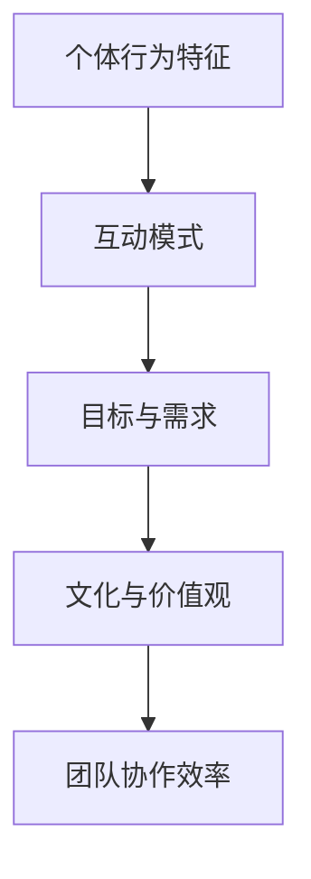

                 

## 1. 背景介绍

### 1.1 问题由来

在当今快速变化和竞争激烈的商业环境中，企业需要不断创新以保持竞争力。而团队管理是企业创新的核心驱动力之一。优秀的团队不仅能够提高生产效率，还能推动企业的持续增长。然而，成功的团队管理并非易事。它不仅需要明确的策略和规划，还需要有效的执行和持续改进。

行为模型（Behavior Model）是一种用于理解和改善团队行为的工具。它通过系统地分析和管理团队成员的行为模式，帮助管理者塑造积极的工作习惯，提升团队协作和生产效率。本文将深入探讨行为模型的原理、操作步骤及其应用领域，帮助管理者在实际工作中更好地运用这一工具。

### 1.2 问题核心关键点

行为模型基于心理学和行为学的理论，旨在通过观察和分析团队成员的行为，揭示其背后的动机、情感和习惯。其主要关注点包括：

- 团队成员的个体行为特征
- 团队成员之间的互动模式
- 团队目标与个体需求之间的关系
- 团队文化与组织价值观的契合度

行为模型通过将这些关键因素联系起来，帮助管理者识别和解决问题，优化团队运作。

## 2. 核心概念与联系

### 2.1 核心概念概述

行为模型涉及多个核心概念，包括但不限于：

- **个体行为特征**：团队成员的性格、技能、动机等特征，影响其在工作中的表现。
- **互动模式**：团队成员之间的沟通、协作和冲突模式，影响团队的整体运作效率。
- **目标与需求**：团队目标与个体需求之间的匹配程度，影响团队的凝聚力和积极性。
- **文化与价值观**：团队文化和组织价值观的契合度，影响团队的稳定性与一致性。

这些概念之间的联系可以通过以下Mermaid流程图来展示：



这个流程图展示了个体行为特征、互动模式、目标与需求和文化与价值观如何共同作用，影响团队协作效率。

### 2.2 核心概念原理和架构

行为模型的原理基于行为科学和心理学，强调通过系统地观察和分析个体行为，揭示其背后的动机和情感。其架构包括数据收集、行为分析、行为改进和持续评估四个主要步骤：

1. **数据收集**：通过问卷调查、观察和访谈等方法，收集团队成员的行为数据。
2. **行为分析**：使用统计学和心理学工具，分析数据中的行为模式和潜在的动机。
3. **行为改进**：根据分析结果，设计并实施行为改进策略，如团队建设、培训等。
4. **持续评估**：定期评估行为改进的效果，并根据结果调整策略。

这一流程形成了一个闭环，确保行为模型能够不断优化和改进。

## 3. 核心算法原理 & 具体操作步骤

### 3.1 算法原理概述

行为模型的核心算法基于行为科学和统计学的理论，通过分析个体行为数据，揭示其背后的动机和情感，从而帮助管理者优化团队运作。其主要算法包括：

- **聚类分析**：通过将个体行为特征分组，识别出相似的行为模式。
- **回归分析**：通过预测个体行为与团队目标之间的关系，揭示行为对团队的影响。
- **情感分析**：通过分析团队成员的情感表达，识别出其动机和情绪状态。

### 3.2 算法步骤详解

行为模型的具体操作步骤如下：

**Step 1: 数据收集**

- **问卷调查**：设计问卷，涵盖个体行为特征、互动模式、目标与需求、文化与价值观等维度。
- **观察记录**：通过观察团队成员在日常工作中的表现，记录其行为数据。
- **访谈访谈**：与团队成员进行深入访谈，了解其动机和情感。

**Step 2: 行为分析**

- **聚类分析**：使用K-means等聚类算法，将个体行为特征分组，识别出相似的行为模式。
- **回归分析**：使用线性回归等方法，预测个体行为与团队目标之间的关系。
- **情感分析**：使用情感分析算法，分析团队成员的情感表达，识别其动机和情绪状态。

**Step 3: 行为改进**

- **团队建设**：根据分析结果，设计并实施团队建设活动，如团队讨论、培训等。
- **激励机制**：设计激励机制，激发团队成员的积极性，提升团队协作效率。
- **沟通渠道**：优化沟通渠道，促进团队成员之间的信息共享和协作。

**Step 4: 持续评估**

- **定期评估**：定期评估行为改进的效果，使用问卷、观察和访谈等方法收集反馈。
- **数据更新**：根据评估结果，更新行为数据，继续进行行为分析。
- **调整策略**：根据评估结果，调整行为改进策略，确保其有效性。

### 3.3 算法优缺点

行为模型的优点包括：

- **系统性**：通过系统地观察和分析行为数据，能够全面揭示团队运作的规律。
- **数据驱动**：基于实证数据，能够提供客观的决策支持。
- **灵活性**：能够根据实际情况灵活调整策略，适应不同团队的特点。

其缺点包括：

- **复杂性**：需要收集和分析大量数据，对资源和专业知识要求较高。
- **主观性**：数据分析和行为改进过程中可能存在主观偏差。
- **隐私问题**：行为数据的收集和分析可能涉及隐私问题，需要严格的伦理审查。

### 3.4 算法应用领域

行为模型在多个领域得到了广泛应用，包括但不限于：

- **企业组织管理**：通过分析员工行为，优化团队运作，提升企业绩效。
- **教育机构管理**：通过分析学生行为，优化课堂教学，提升教学效果。
- **非营利组织管理**：通过分析志愿者行为，优化组织运作，提高服务质量。
- **政府机构管理**：通过分析公务员行为，优化行政效率，提高公共服务质量。

这些应用领域展示了行为模型的广泛适用性。

## 4. 数学模型和公式 & 详细讲解

### 4.1 数学模型构建

行为模型的数学模型基于统计学和心理学理论，用于分析和预测团队行为。其主要模型包括：

- **聚类模型**：用于将个体行为特征分组。
- **回归模型**：用于预测个体行为与团队目标之间的关系。
- **情感模型**：用于分析团队成员的情感表达。

### 4.2 公式推导过程

以线性回归模型为例，其公式为：

$$
y = \beta_0 + \beta_1x_1 + \beta_2x_2 + \cdots + \beta_nx_n + \epsilon
$$

其中，$y$ 表示团队目标，$\beta_i$ 表示个体行为特征对团队目标的影响系数，$x_i$ 表示个体行为特征，$\epsilon$ 表示误差项。

通过最小二乘法求解 $\beta_i$，可以得到回归方程：

$$
\beta_i = \frac{\sum_{j=1}^n(x_{ij}\Delta y)}{\sum_{j=1}^n(x_{ij}\Delta x_i)}
$$

### 4.3 案例分析与讲解

假设一个企业的目标是提高员工的创新能力。通过问卷调查、观察记录和访谈访谈，收集了100名员工的行为数据，包括工作时间、沟通频率、团队合作和自我反思等特征。使用聚类分析将员工分为三组，并通过回归分析，得到如下结果：

- 组1：工作时间显著影响创新能力，沟通频率和团队合作对创新能力的影响不显著。
- 组2：沟通频率显著影响创新能力，工作时间和团队合作对创新能力的影响不显著。
- 组3：团队合作显著影响创新能力，工作时间和沟通频率对创新能力的影响不显著。

根据分析结果，企业可以针对不同组别制定不同的策略，如提高组1的沟通频率和团队合作，提高组2的工作时间和团队合作等。

## 5. 项目实践：代码实例和详细解释说明

### 5.1 开发环境搭建

行为模型的开发需要使用Python等编程语言和R语言等统计分析工具。以下是搭建开发环境的步骤：

1. **安装Python**：使用Anaconda或Miniconda安装Python。
2. **安装必要的库**：使用pip或conda安装必要的库，如NumPy、Pandas、scikit-learn等。
3. **安装R语言**：从官网下载安装R语言，并配置RStudio等开发环境。
4. **配置环境**：配置Python和R语言的环境变量，确保能够正确运行代码。

### 5.2 源代码详细实现

以下是使用Python和R语言实现行为模型的一个简单案例。首先，使用Python的Pandas库读取问卷调查数据，并进行初步处理：

```python
import pandas as pd

# 读取问卷调查数据
data = pd.read_csv('questionnaire.csv')

# 初步处理数据
data = data.dropna().reset_index(drop=True)
```

然后，使用Python的scikit-learn库进行聚类分析：

```python
from sklearn.cluster import KMeans

# 使用K-means进行聚类分析
kmeans = KMeans(n_clusters=3, random_state=0)
clusters = kmeans.fit_predict(data[['work_time', 'communication_freq', 'team_cooperation', 'self_reflection']])
```

最后，使用R语言的ggplot2库绘制聚类结果的散点图：

```R
library(ggplot2)

# 绘制聚类结果的散点图
ggplot(data, aes(x=work_time, y=communication_freq)) + geom_point(aes(color=clusters))
```

### 5.3 代码解读与分析

上述代码展示了行为模型的一个基本流程：数据读取、初步处理、聚类分析、结果可视化。

- **数据读取**：使用Pandas库读取问卷调查数据，并进行初步处理，去除缺失值和重复数据。
- **聚类分析**：使用K-means算法对员工的行为特征进行聚类，识别出相似的行为模式。
- **结果可视化**：使用ggplot2库绘制聚类结果的散点图，直观展示不同行为模式的分布。

通过这些步骤，行为模型可以系统地分析团队成员的行为，揭示其背后的动机和情感，为管理者提供决策支持。

### 5.4 运行结果展示

聚类分析的结果展示了团队成员的行为模式，管理者可以根据这些结果制定相应的管理策略。例如，对于工作时间显著影响创新能力的组别，可以增加团队建设活动，促进沟通和合作；对于沟通频率显著影响创新能力的组别，可以增加工作时间和团队合作等。

## 6. 实际应用场景

### 6.1 企业组织管理

行为模型在企业组织管理中的应用非常广泛。通过分析员工的行为数据，企业可以优化团队运作，提升绩效。例如，一个科技公司可以通过行为模型识别出团队中的创新者和贡献者，根据其行为特征制定激励机制，激发更多员工的创新积极性。

### 6.2 教育机构管理

在教育机构管理中，行为模型可以帮助教师了解学生的行为模式，优化教学方法。例如，一个大学可以通过行为模型分析学生的课堂表现和学习习惯，识别出需要重点关注的学生，制定个性化的辅导计划。

### 6.3 非营利组织管理

在非营利组织管理中，行为模型可以帮助志愿者了解彼此的行为模式，优化组织运作。例如，一个慈善机构可以通过行为模型分析志愿者的参与频率和活动效果，识别出积极参与者，制定相应的激励措施。

### 6.4 政府机构管理

在政府机构管理中，行为模型可以帮助公务员了解彼此的行为模式，优化行政效率。例如，一个市政府可以通过行为模型分析公务员的办公时间和工作方式，识别出高效工作者，制定相应的工作规范。

## 7. 工具和资源推荐

### 7.1 学习资源推荐

为了帮助管理者掌握行为模型的原理和应用，以下是一些推荐的学习资源：

1. **《行为科学与管理》**：一本系统介绍行为科学理论与实践的书籍，适合初学者学习。
2. **Coursera《行为科学与管理》课程**：斯坦福大学开设的在线课程，系统讲解行为科学的基本概念和应用。
3. **《行为分析工具与方法》**：一本介绍行为分析工具和方法的书籍，适合实践者学习。
4. **RapidMiner**：一款开源的数据挖掘与机器学习平台，支持多种数据分析工具和模型。
5. **Python数据科学栈**：包括Pandas、NumPy、scikit-learn等库，适合数据分析与机器学习任务。

通过这些学习资源，管理者可以全面掌握行为模型的原理和应用，提升团队管理能力。

### 7.2 开发工具推荐

以下是一些推荐的行为模型开发工具：

1. **Jupyter Notebook**：一个交互式的开发环境，支持Python和R语言的交互式编程。
2. **RStudio**：一款开源的R语言集成开发环境，支持R语言的开发、调试和可视化。
3. **Tableau**：一款数据可视化工具，支持大规模数据集的处理和可视化。
4. **Tableau Server**：Tableau的服务器端产品，支持多用户协同分析和报告。
5. **Microsoft Power BI**：一款商业智能工具，支持大规模数据集的可视化和大数据分析。

通过这些工具，管理者可以快速构建和部署行为模型，提升团队管理效果。

### 7.3 相关论文推荐

以下是一些推荐的行为模型相关论文：

1. **《行为科学与管理》**：介绍行为科学的基本概念和应用。
2. **《组织行为学》**：介绍组织行为学的基本理论和方法。
3. **《团队管理与绩效》**：介绍团队管理的基本理论和实践方法。
4. **《数据驱动的行为分析》**：介绍基于数据的行为分析方法。

通过这些论文，管理者可以深入理解行为模型的理论基础和应用方法，提升团队管理水平。

## 8. 总结：未来发展趋势与挑战

### 8.1 研究成果总结

行为模型作为一种用于理解和改善团队行为的工具，已经在多个领域得到了广泛应用。通过系统地观察和分析团队成员的行为，揭示其背后的动机和情感，帮助管理者优化团队运作，提升团队协作和生产效率。

### 8.2 未来发展趋势

展望未来，行为模型将呈现以下几个发展趋势：

1. **技术进步**：随着人工智能和大数据技术的发展，行为模型的数据处理和分析能力将不断提升，能够更好地支持决策。
2. **应用扩展**：行为模型将从企业组织管理扩展到更多领域，如教育、医疗等，帮助更多组织提升管理水平。
3. **用户友好**：行为模型将更加注重用户友好性，提供更简洁直观的界面和操作方式，降低使用门槛。
4. **个性化定制**：行为模型将根据不同的组织和文化特点，提供个性化的定制解决方案，提升其适用性。

### 8.3 面临的挑战

尽管行为模型已经取得了一定的成功，但在实际应用中也面临一些挑战：

1. **数据获取难度**：行为数据的收集和分析需要大量资源和时间，特别是在数据隐私和伦理方面存在一些争议。
2. **分析复杂性**：行为模型的分析过程较为复杂，需要具备一定的统计学和心理学知识。
3. **结果解释性**：行为模型的结果需要较强的解释性，以便管理者理解和应用。
4. **技术更新快**：行为模型需要不断更新技术，以应对不断变化的商业环境和组织需求。

### 8.4 研究展望

面对这些挑战，未来的研究需要在以下几个方面寻求突破：

1. **数据自动化采集**：开发更高效的数据采集工具，降低数据收集的难度和时间成本。
2. **简化分析流程**：开发更简洁易用的数据分析工具，降低使用门槛。
3. **增强结果解释性**：通过可视化和大数据技术，增强行为模型的结果解释性。
4. **技术融合创新**：结合人工智能和大数据分析技术，开发更先进的行为分析工具。

## 9. 附录：常见问题与解答

**Q1：行为模型如何识别和解决问题？**

A: 行为模型通过系统地观察和分析团队成员的行为数据，揭示其背后的动机和情感，从而帮助管理者识别问题。例如，通过聚类分析，识别出具有相似行为特征的员工群体，进而针对性地制定改进措施。

**Q2：行为模型在团队管理中扮演什么角色？**

A: 行为模型在团队管理中扮演决策支持的角色，帮助管理者系统地理解和改善团队行为。它通过数据分析和行为改进策略，优化团队运作，提升团队协作和生产效率。

**Q3：行为模型需要多少数据才能得出有效结论？**

A: 行为模型的有效性依赖于数据的丰富性和质量。通常需要收集大量的行为数据，才能得出可靠的结论。数据量越大，模型的预测和分析能力越强。

**Q4：行为模型如何确保数据的隐私和安全？**

A: 行为模型在数据收集和分析过程中，需要严格遵守数据隐私和伦理标准。通过匿名化和加密技术，确保数据的安全和隐私保护。同时，应明确告知员工数据的收集和使用目的，并获得其同意。

**Q5：行为模型在跨文化团队中的应用有何挑战？**

A: 行为模型在跨文化团队中的应用面临文化差异和沟通障碍的挑战。不同文化背景下，员工的行为模式和沟通方式可能不同。管理者需要根据团队的文化特点，调整行为模型和策略，确保其适用性。

---

作者：禅与计算机程序设计艺术 / Zen and the Art of Computer Programming

