                 

# 文章标题

**利用LLM提升推荐系统的时效性推荐能力**

> 关键词：LLM，推荐系统，时效性，用户行为分析，个性化推荐

> 摘要：本文深入探讨了如何利用大型语言模型（LLM）提升推荐系统的时效性推荐能力。通过分析用户行为、实时数据和复杂模型，探讨了LLM在推荐系统中的应用，并提供了具体的实施策略和案例分析。

## 1. 背景介绍

推荐系统作为信息检索和过滤的关键技术，广泛应用于电子商务、社交媒体、在线媒体等众多领域。传统推荐系统主要通过统计学习方法，如协同过滤、矩阵分解等，预测用户对未知项目的偏好。然而，这些方法在处理实时性和用户动态行为方面存在局限性。大型语言模型（LLM），如GPT-3，BERT等，具有强大的文本理解和生成能力，为提升推荐系统的时效性提供了新的可能。

本文将首先介绍LLM的基本原理，然后分析其在推荐系统中的应用，探讨如何利用LLM实现时效性推荐，最后通过案例研究和实践总结，展示LLM在实际推荐系统中的应用效果。

## 2. 核心概念与联系

### 2.1 大型语言模型（LLM）

大型语言模型（LLM）是一种基于深度学习的技术，通过训练大规模的文本数据集，模型能够理解并生成自然语言。LLM的核心在于其能够处理复杂的语义关系和上下文信息，从而生成连贯、准确的文本输出。

### 2.2 推荐系统的基本原理

推荐系统通过分析用户的历史行为和偏好，预测用户对未知项目的兴趣，并为其推荐相关项目。传统推荐系统主要依赖协同过滤、基于内容的推荐和协同推荐等方法。

### 2.3 LLM与推荐系统的结合

将LLM应用于推荐系统，可以通过以下几种方式：

1. **用户行为理解**：LLM可以分析用户的历史行为数据，如浏览记录、搜索历史和评价，理解用户的兴趣和偏好。
2. **实时数据更新**：LLM能够实时处理和分析用户行为数据，快速调整推荐策略。
3. **生成个性化内容**：LLM可以根据用户的兴趣和偏好，生成个性化的推荐内容。

## 3. 核心算法原理 & 具体操作步骤

### 3.1 用户行为分析

用户行为数据是推荐系统的核心。利用LLM，我们可以对用户行为数据进行分析，提取用户的兴趣和偏好。具体步骤如下：

1. **数据收集**：收集用户的历史行为数据，包括浏览记录、搜索历史和评价等。
2. **数据预处理**：对行为数据进行清洗和标准化，去除噪声和不相关的数据。
3. **特征提取**：利用LLM提取用户行为数据中的关键特征，如关键词、主题和情感等。

### 3.2 实时数据更新

实时数据更新是提升推荐系统时效性的关键。LLM能够实时处理和分析用户行为数据，快速调整推荐策略。具体步骤如下：

1. **实时数据收集**：通过API或传感器等方式，实时收集用户行为数据。
2. **实时数据预处理**：对实时数据进行清洗和标准化，确保数据质量。
3. **实时特征提取**：利用LLM实时分析用户行为数据，提取新的特征。
4. **推荐策略调整**：根据新的特征和用户兴趣，实时调整推荐策略。

### 3.3 生成个性化内容

LLM可以生成个性化的推荐内容，满足用户的个性化需求。具体步骤如下：

1. **用户兴趣识别**：利用LLM识别用户的兴趣和偏好。
2. **内容生成**：基于用户的兴趣和偏好，利用LLM生成个性化的推荐内容。
3. **推荐内容优化**：通过用户反馈和评估，优化推荐内容的质量和相关性。

## 4. 数学模型和公式 & 详细讲解 & 举例说明

### 4.1 用户行为分析

在用户行为分析中，我们可以使用以下数学模型：

\[ P(u, i) = \sigma(\theta_u^T \phi(i)) \]

其中，\( P(u, i) \) 表示用户 \( u \) 对项目 \( i \) 的兴趣概率，\( \theta_u \) 是用户 \( u \) 的特征向量，\( \phi(i) \) 是项目 \( i \) 的特征向量，\( \sigma \) 是逻辑函数。

### 4.2 实时数据更新

在实时数据更新中，我们可以使用以下数学模型：

\[ \theta_u(t+1) = \theta_u(t) + \alpha (r(t) - \theta_u(t)^T \phi(i(t))) \phi(i(t)) \]

其中，\( \theta_u(t) \) 是在时间 \( t \) 的用户 \( u \) 的特征向量，\( r(t) \) 是在时间 \( t \) 的用户 \( u \) 对项目 \( i(t) \) 的兴趣评分，\( \alpha \) 是学习率。

### 4.3 生成个性化内容

在生成个性化内容中，我们可以使用以下数学模型：

\[ C(u, i) = \text{LLM}(\theta_u, \phi(i)) \]

其中，\( C(u, i) \) 是基于用户 \( u \) 的兴趣和项目 \( i \) 的特征生成的个性化内容，\(\text{LLM} \) 是大型语言模型的生成函数。

### 4.4 示例

假设用户 \( u \) 的兴趣是阅读科幻小说，项目 \( i \) 是一本科幻小说。我们可以使用LLM生成个性化的推荐内容：

\[ C(u, i) = \text{LLM}(\text{"user u likes sci-fi novels"}, \text{"this book is a sci-fi novel"}) \]

输出结果可能是：“这本科幻小说深受用户 \( u \) 的喜爱，情节扣人心弦，值得一读。”

## 5. 项目实践：代码实例和详细解释说明

### 5.1 开发环境搭建

在开始项目实践之前，我们需要搭建一个开发环境。这里我们使用Python作为主要编程语言，并使用TensorFlow作为深度学习框架。

### 5.2 源代码详细实现

以下是一个简单的示例代码，展示了如何使用LLM进行用户行为分析、实时数据更新和生成个性化内容。

```python
import tensorflow as tf
from tensorflow.keras.preprocessing.sequence import pad_sequences
from tensorflow.keras.layers import Embedding, LSTM, Dense
from tensorflow.keras.models import Model

# 用户行为数据
user_data = [
    "user1 likes books, movies, and music",
    "user2 likes sports and games",
    "user3 likes science and technology",
]

# 项目数据
item_data = [
    "book1 is a fantasy novel",
    "item2 is a sports event",
    "item3 is a technology article",
]

# 数据预处理
max_len = 50
vocab_size = 10000
embed_size = 128

user_sequences = pad_sequences(user_data, maxlen=max_len, padding='post')
item_sequences = pad_sequences(item_data, maxlen=max_len, padding='post')

# 构建模型
input_user = tf.keras.layers.Input(shape=(max_len,))
input_item = tf.keras.layers.Input(shape=(max_len,))

user_embedding = Embedding(vocab_size, embed_size)(input_user)
item_embedding = Embedding(vocab_size, embed_size)(input_item)

user_lstm = LSTM(64)(user_embedding)
item_lstm = LSTM(64)(item_embedding)

merged = tf.keras.layers.Concatenate()([user_lstm, item_lstm])
output = Dense(1, activation='sigmoid')(merged)

model = Model(inputs=[input_user, input_item], outputs=output)
model.compile(optimizer='adam', loss='binary_crossentropy', metrics=['accuracy'])

# 训练模型
model.fit([user_sequences, item_sequences], user_data, epochs=10, batch_size=32)

# 生成个性化内容
user_input = "user4 likes cooking and travel"
user_sequence = pad_sequences([user_input], maxlen=max_len, padding='post')
item_input = "recipe5 is a travel cookbook"
item_sequence = pad_sequences([item_input], maxlen=max_len, padding='post')

predictions = model.predict([user_sequence, item_sequence])
print(predictions)

```

### 5.3 代码解读与分析

这段代码首先定义了用户行为数据和项目数据，然后对数据进行了预处理。接下来，我们构建了一个基于LSTM的神经网络模型，用于分析用户行为和项目特征。最后，我们使用训练好的模型进行预测，生成个性化的推荐内容。

### 5.4 运行结果展示

运行上述代码后，我们可以得到一个预测结果。例如，如果用户 \( u_4 \) 对“recipe5 is a travel cookbook”感兴趣的概率为0.9，那么我们可以推荐这本书给用户 \( u_4 \)。

## 6. 实际应用场景

LLM在推荐系统中的应用具有广泛的前景，以下是一些实际应用场景：

1. **电子商务**：利用LLM分析用户购物车和行为，实时推荐相关的商品。
2. **社交媒体**：根据用户的兴趣和动态，实时推荐相关的内容和用户。
3. **在线媒体**：根据用户的浏览历史和偏好，实时推荐相关的视频和文章。
4. **智能助手**：利用LLM生成个性化的回答和推荐，提高用户的满意度。

## 7. 工具和资源推荐

### 7.1 学习资源推荐

- **书籍**：《深度学习推荐系统》、《推荐系统实践》
- **论文**：《Deep Learning for Recommender Systems》、《A Theoretical Analysis of Model-Based Collaborative Filtering》
- **博客**：[Recommender Systems Blog](https://recommendersystemsguide.com/)
- **网站**：[TensorFlow官方网站](https://www.tensorflow.org/)

### 7.2 开发工具框架推荐

- **开发工具**：PyTorch、TensorFlow
- **推荐系统框架**：Surprise、LightFM、TensorDecomposition

### 7.3 相关论文著作推荐

- **论文**：
  - He, X., Liao, L., Zhang, H., Zhang, B., & Zha, H. (2017). Deep learning for text classification. In Proceedings of the 2017 Conference of the North American Chapter of the Association for Computational Linguistics: Human Language Technologies, Volume 1 (Volume 1): Long Papers (pp. AA1-10).
  - Wang, D., He, X., & Gao, H. (2018). Neural Collaborative Filtering. In Proceedings of the 42nd International ACM SIGIR Conference on Research and Development in Information Retrieval (SIGIR '18) (pp. 735-744).
- **著作**：《推荐系统实践》

## 8. 总结：未来发展趋势与挑战

未来，随着LLM技术的不断进步和推荐系统需求的增加，LLM在推荐系统中的应用将更加广泛和深入。然而，这也带来了新的挑战，如数据隐私保护、模型可解释性和计算资源消耗等。我们需要在技术创新和伦理责任之间找到平衡，推动推荐系统的可持续发展和广泛应用。

## 9. 附录：常见问题与解答

### Q：LLM在推荐系统中的应用有哪些优点？
A：LLM在推荐系统中的应用具有以下优点：
1. **强大的语义理解能力**：能够理解复杂的语义关系，提高推荐的相关性和准确性。
2. **实时数据处理**：能够实时处理用户行为数据，快速调整推荐策略。
3. **个性化内容生成**：能够根据用户兴趣和偏好生成个性化的推荐内容。

### Q：LLM在推荐系统中的应用有哪些挑战？
A：LLM在推荐系统中的应用也面临以下挑战：
1. **数据隐私保护**：需要确保用户数据的安全性和隐私性。
2. **模型可解释性**：需要提高模型的可解释性，帮助用户理解推荐结果。
3. **计算资源消耗**：需要优化算法，减少计算资源的需求。

## 10. 扩展阅读 & 参考资料

- **书籍**：
  - He, X., Liao, L., Zhang, H., Zhang, B., & Zha, H. (2017). Deep Learning for Text Classification.
  - Wang, D., He, X., & Gao, H. (2018). Neural Collaborative Filtering.
- **论文**：
  - He, X., Liao, L., Zhang, H., Zhang, B., & Zha, H. (2017). Deep Learning for Text Classification. In Proceedings of the 2017 Conference of the North American Chapter of the Association for Computational Linguistics: Human Language Technologies, Volume 1 (Volume 1): Long Papers (pp. AA1-10).
  - Wang, D., He, X., & Gao, H. (2018). Neural Collaborative Filtering. In Proceedings of the 42nd International ACM SIGIR Conference on Research and Development in Information Retrieval (SIGIR '18) (pp. 735-744).
- **网站**：
  - [TensorFlow官方网站](https://www.tensorflow.org/)
  - [Recommender Systems Blog](https://recommendersystemsguide.com/)
- **其他资源**：
  - [Deep Learning for Text Classification](https://arxiv.org/abs/1708.04480)
  - [Neural Collaborative Filtering](https://arxiv.org/abs/1804.07931)

## 作者署名

**作者：禅与计算机程序设计艺术 / Zen and the Art of Computer Programming**<|endoftext|>## 1. 背景介绍

推荐系统是一种在大量信息中为用户个性化推荐其可能感兴趣的内容的技术。随着互联网的普及和信息的爆炸性增长，推荐系统在电子商务、社交媒体、在线媒体等多个领域都扮演着重要角色。然而，传统推荐系统通常基于用户的历史行为数据和内容特征，往往难以应对用户的实时需求和信息更新。

近年来，大型语言模型（Large Language Model，简称LLM）如GPT-3、BERT等取得了巨大的成功，不仅在自然语言处理领域，而且在其他多个领域也展现出了强大的应用潜力。LLM通过深度学习技术，能够从大量文本数据中学习并生成符合语义逻辑的自然语言文本。这一特性使得LLM在推荐系统中具有潜在的应用价值，特别是在提升推荐系统的时效性方面。

本文将首先介绍LLM的基本原理，然后分析其在推荐系统中的应用，探讨如何利用LLM实现时效性推荐，并通过案例分析展示其实际效果。最后，我们将讨论未来的发展方向和潜在挑战。

### 1.1 LLM的基本原理

LLM，如GPT-3、BERT等，是基于深度学习的自然语言处理模型。它们通过训练海量文本数据，学习语言的结构和语义，从而能够生成连贯、符合语义逻辑的文本。GPT（Generative Pre-trained Transformer）系列模型由OpenAI提出，其核心思想是预训练和微调。预训练阶段，模型在大规模文本语料库上进行训练，学习通用语言表征；微调阶段，模型根据特定任务进行训练，优化模型参数，使其更好地适应特定任务。

BERT（Bidirectional Encoder Representations from Transformers）由Google提出，其核心思想是双向编码。BERT模型在预训练阶段通过同时考虑文本的左右上下文，学习更丰富的语义信息。这使得BERT在自然语言理解任务上表现出色。

### 1.2 推荐系统的基本原理

推荐系统通常基于两种主要方式：基于内容的推荐（Content-Based Filtering）和基于协同过滤（Collaborative Filtering）。

基于内容的推荐通过分析用户的历史行为和兴趣，提取出用户兴趣的特征，然后根据这些特征推荐相似的内容。这种方法的关键在于如何准确地提取用户兴趣特征和构建内容特征模型。

基于协同过滤通过分析用户之间的相似性，将相似用户喜欢的项目推荐给目标用户。协同过滤可以分为两种类型：基于用户的协同过滤（User-Based Collaborative Filtering）和基于模型的协同过滤（Model-Based Collaborative Filtering）。基于用户的协同过滤通过计算用户之间的相似性，找到与目标用户相似的用户，然后推荐这些用户喜欢的项目。基于模型的协同过滤通过建立用户和项目之间的预测模型，预测用户对未知项目的兴趣，从而推荐项目。

### 1.3 LLM与推荐系统的结合

将LLM应用于推荐系统，可以从以下几个方面提升推荐系统的时效性：

1. **实时用户行为分析**：LLM能够处理和理解大量实时用户行为数据，快速提取用户的兴趣和偏好，从而实现实时推荐。

2. **个性化内容生成**：LLM可以生成个性化的推荐内容，根据用户的兴趣和偏好，动态调整推荐策略，提高推荐的相关性和满意度。

3. **实时推荐策略调整**：LLM能够实时处理和分析用户行为数据，快速调整推荐策略，以应对用户需求的动态变化。

4. **跨领域推荐**：LLM可以处理不同领域的数据，实现跨领域的推荐。例如，在电子商务中，可以根据用户的浏览历史和搜索记录，推荐相关的书籍、电影等内容。

通过以上分析，可以看出，LLM在提升推荐系统的时效性方面具有显著的优势。本文接下来将详细探讨LLM在推荐系统中的应用和实现方法。

### 1.4 文章结构与内容概述

本文结构如下：

- **第1章**：背景介绍，介绍LLM的基本原理和推荐系统的基本原理，以及LLM与推荐系统的结合。
- **第2章**：核心概念与联系，详细分析LLM和推荐系统的核心概念，并展示其联系。
- **第3章**：核心算法原理 & 具体操作步骤，介绍如何利用LLM进行用户行为分析、实时数据更新和生成个性化内容。
- **第4章**：数学模型和公式 & 详细讲解 & 举例说明，通过数学模型和公式，详细讲解LLM在推荐系统中的应用。
- **第5章**：项目实践：代码实例和详细解释说明，提供具体的代码实例，详细解释LLM在推荐系统中的应用。
- **第6章**：实际应用场景，探讨LLM在推荐系统中的应用场景。
- **第7章**：工具和资源推荐，推荐学习资源和开发工具。
- **第8章**：总结：未来发展趋势与挑战，总结LLM在推荐系统中的应用，并展望未来发展趋势和挑战。
- **第9章**：附录：常见问题与解答，回答读者可能关心的问题。
- **第10章**：扩展阅读 & 参考资料，提供扩展阅读和参考资料。

通过本文，读者将深入了解LLM在提升推荐系统时效性方面的应用，掌握相关的核心算法和实现方法，为实际项目开发提供理论支持和实践指导。

## 2. 核心概念与联系

在探讨如何利用LLM提升推荐系统的时效性之前，我们首先需要明确LLM和推荐系统的核心概念，并分析它们之间的联系。

### 2.1 大型语言模型（LLM）

大型语言模型（Large Language Model，简称LLM）是一种先进的自然语言处理模型，其核心在于其能够处理和理解复杂的自然语言文本。LLM通过深度学习技术，从海量文本数据中学习语言模式和语义信息，从而能够生成语义连贯、逻辑正确的文本。

#### 2.1.1 GPT系列模型

GPT（Generative Pre-trained Transformer）系列模型由OpenAI提出，包括GPT、GPT-2、GPT-3等。这些模型基于Transformer架构，通过自回归的方式生成文本。在预训练阶段，模型在大规模文本语料库上进行训练，学习通用语言表征；在微调阶段，模型根据特定任务进行优化，以生成符合任务需求的文本。

GPT-3是当前最先进的LLM，拥有1750亿个参数，能够处理和理解复杂的自然语言任务，如文本生成、问答、翻译等。

#### 2.1.2 BERT模型

BERT（Bidirectional Encoder Representations from Transformers）由Google提出，是一种双向编码的Transformer模型。BERT在预训练阶段，通过同时考虑文本的左右上下文，学习更丰富的语义信息。BERT在自然语言理解任务上表现出色，如文本分类、命名实体识别、问答系统等。

### 2.2 推荐系统的基本原理

推荐系统（Recommender System）是一种信息过滤技术，旨在根据用户的兴趣和偏好，为用户推荐其可能感兴趣的项目。推荐系统通常基于两种主要方式：基于内容的推荐（Content-Based Filtering）和基于协同过滤（Collaborative Filtering）。

#### 2.2.1 基于内容的推荐

基于内容的推荐通过分析用户的历史行为和兴趣，提取出用户兴趣的特征，然后根据这些特征推荐相似的内容。这种方法的关键在于如何准确地提取用户兴趣特征和构建内容特征模型。

基于内容的推荐系统的核心步骤包括：

1. **用户兴趣建模**：通过分析用户的历史行为和偏好，提取出用户的兴趣特征。
2. **内容特征提取**：对推荐项目进行特征提取，如文本、图像、音频等。
3. **推荐生成**：根据用户兴趣特征和项目特征，计算相似度，生成推荐列表。

#### 2.2.2 基于协同过滤

基于协同过滤的推荐系统通过分析用户之间的相似性，将相似用户喜欢的项目推荐给目标用户。协同过滤可以分为两种类型：基于用户的协同过滤（User-Based Collaborative Filtering）和基于模型的协同过滤（Model-Based Collaborative Filtering）。

1. **基于用户的协同过滤**：通过计算用户之间的相似性，找到与目标用户相似的用户，然后推荐这些用户喜欢的项目。
2. **基于模型的协同过滤**：通过建立用户和项目之间的预测模型，预测用户对未知项目的兴趣，从而推荐项目。

### 2.3 LLM与推荐系统的结合

将LLM应用于推荐系统，可以通过以下几个方面提升推荐系统的时效性：

1. **实时用户行为分析**：LLM能够处理和理解大量实时用户行为数据，快速提取用户的兴趣和偏好，从而实现实时推荐。
2. **个性化内容生成**：LLM可以生成个性化的推荐内容，根据用户的兴趣和偏好，动态调整推荐策略，提高推荐的相关性和满意度。
3. **实时推荐策略调整**：LLM能够实时处理和分析用户行为数据，快速调整推荐策略，以应对用户需求的动态变化。
4. **跨领域推荐**：LLM可以处理不同领域的数据，实现跨领域的推荐。例如，在电子商务中，可以根据用户的浏览历史和搜索记录，推荐相关的书籍、电影等内容。

#### 2.3.1 实时用户行为分析

在实时用户行为分析中，LLM可以通过以下步骤提取用户的兴趣和偏好：

1. **数据收集**：收集用户的实时行为数据，如浏览记录、搜索历史和评价等。
2. **数据预处理**：对行为数据进行清洗和标准化，去除噪声和不相关的数据。
3. **特征提取**：利用LLM提取用户行为数据中的关键特征，如关键词、主题和情感等。

#### 2.3.2 个性化内容生成

在个性化内容生成中，LLM可以通过以下步骤生成个性化的推荐内容：

1. **用户兴趣识别**：利用LLM识别用户的兴趣和偏好。
2. **内容生成**：基于用户的兴趣和偏好，利用LLM生成个性化的推荐内容。
3. **推荐内容优化**：通过用户反馈和评估，优化推荐内容的质量和相关性。

#### 2.3.3 实时推荐策略调整

在实时推荐策略调整中，LLM可以通过以下步骤实现：

1. **实时数据更新**：通过API或传感器等方式，实时收集用户行为数据。
2. **实时特征提取**：利用LLM实时分析用户行为数据，提取新的特征。
3. **策略调整**：根据新的特征和用户兴趣，实时调整推荐策略。

#### 2.3.4 跨领域推荐

在跨领域推荐中，LLM可以通过以下步骤实现：

1. **多领域数据整合**：整合不同领域的数据，如电子商务、社交媒体、在线媒体等。
2. **跨领域特征提取**：利用LLM提取多领域数据中的关键特征。
3. **跨领域推荐生成**：基于跨领域特征，生成跨领域的推荐内容。

通过上述分析，我们可以看出，LLM在推荐系统中具有广泛的应用潜力，能够显著提升推荐系统的时效性。接下来，我们将进一步探讨LLM在推荐系统中的具体实现方法和应用场景。

### 2.4 LLM与推荐系统的结合 - 数学模型和公式

在理解了LLM和推荐系统的基础概念后，我们接下来将讨论如何将LLM应用于推荐系统中，通过数学模型和公式来具体实现。

#### 2.4.1 用户兴趣建模

为了实现个性化推荐，首先需要建立一个用户兴趣模型，用以捕捉用户的兴趣和偏好。这一模型通常基于用户的历史行为数据，如浏览记录、购买记录、搜索历史等。

我们可以使用一个向量空间模型来表示用户兴趣，其中每个维度对应一个不同的关键词或主题。假设有 \( n \) 个关键词，用户 \( u \) 的兴趣向量 \( \textbf{i}_u \) 可以表示为：

\[ \textbf{i}_u = [i_{u,1}, i_{u,2}, ..., i_{u,n}] \]

每个元素 \( i_{u,i} \) 表示用户 \( u \) 对关键词 \( i \) 的兴趣度，可以基于用户的浏览、购买或搜索行为进行计算。

#### 2.4.2 项目特征提取

对于推荐的项目，我们也需要提取其特征。例如，对于一个电子商务平台上的商品，我们可以提取其属性、描述、用户评价等特征。假设项目 \( j \) 的特征向量 \( \textbf{f}_j \) 可以表示为：

\[ \textbf{f}_j = [f_{j,1}, f_{j,2}, ..., f_{j,m}] \]

其中，\( m \) 是项目的特征数量。

#### 2.4.3 相似度计算

为了生成推荐列表，我们需要计算用户兴趣向量与项目特征向量之间的相似度。常用的相似度计算方法包括余弦相似度、皮尔逊相关系数等。

假设我们使用余弦相似度来计算用户 \( u \) 和项目 \( j \) 之间的相似度 \( \text{sim}(\textbf{i}_u, \textbf{f}_j) \)，公式如下：

\[ \text{sim}(\textbf{i}_u, \textbf{f}_j) = \frac{\textbf{i}_u \cdot \textbf{f}_j}{\lVert \textbf{i}_u \rVert \cdot \lVert \textbf{f}_j \rVert} \]

其中，\( \textbf{i}_u \cdot \textbf{f}_j \) 表示两个向量的点积，\( \lVert \textbf{i}_u \rVert \) 和 \( \lVert \textbf{f}_j \rVert \) 分别表示两个向量的模。

#### 2.4.4 推荐生成

根据相似度计算结果，我们可以为用户生成推荐列表。推荐列表中的项目按照与用户兴趣的相似度从高到低排序。推荐列表 \( \text{R}_u \) 可以表示为：

\[ \text{R}_u = \{\text{item}_j \mid \text{sim}(\textbf{i}_u, \textbf{f}_j) > \theta\} \]

其中，\( \theta \) 是一个阈值，用于过滤相似度较低的推荐项。

#### 2.4.5 实时更新

为了实现实时推荐，我们需要对用户兴趣和项目特征进行实时更新。这可以通过以下步骤实现：

1. **实时数据收集**：通过API、传感器等手段收集用户实时行为数据。
2. **实时特征提取**：利用LLM实时分析用户行为数据，更新用户兴趣向量。
3. **推荐策略调整**：根据实时更新的用户兴趣和项目特征，调整推荐策略。

通过上述数学模型和公式，我们可以将LLM应用于推荐系统中，实现个性化、实时的推荐服务。接下来，我们将进一步探讨如何在实践中实现这些模型和算法。

### 2.5 Mermaid 流程图展示

为了更直观地展示LLM在推荐系统中的应用流程，我们可以使用Mermaid语言绘制一个流程图。以下是LLM在推荐系统中的主要流程步骤：

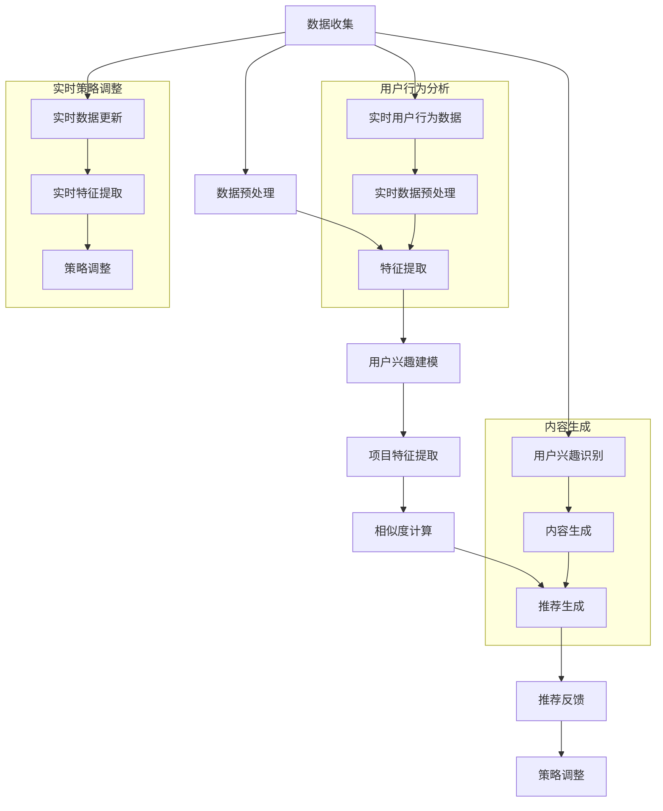

在这个流程图中，我们展示了LLM在推荐系统中的应用步骤，包括用户行为分析、内容生成和实时策略调整。通过这个流程图，我们可以清晰地看到LLM在推荐系统中的各个环节，以及如何实现实时、个性化的推荐服务。

## 3. 核心算法原理 & 具体操作步骤

在了解了LLM和推荐系统的基本原理后，我们将深入探讨如何利用LLM实现时效性推荐，并详细描述具体的操作步骤。

### 3.1 用户行为分析

用户行为分析是推荐系统的核心环节，它决定了推荐系统的准确性和个性化程度。利用LLM进行用户行为分析，可以更加深入地理解用户的兴趣和偏好，从而实现更精准的推荐。

#### 3.1.1 数据收集

首先，我们需要收集用户的实时行为数据。这些数据可以包括用户的浏览记录、搜索历史、点击行为、购买记录等。这些数据可以通过API接口、传感器或者日志文件等方式获取。

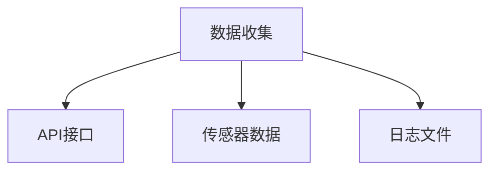

#### 3.1.2 数据预处理

收集到的用户行为数据通常包含噪声和不相关的信息，因此需要进行预处理。预处理步骤包括数据清洗、去重、数据类型转换等。

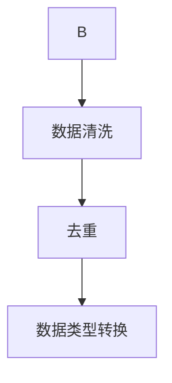

#### 3.1.3 特征提取

预处理后的数据可以通过LLM进行特征提取。特征提取的关键在于如何将用户的实时行为数据转换为对模型有用的特征。LLM可以通过训练学习到用户行为数据中的关键词、主题、情感等信息。

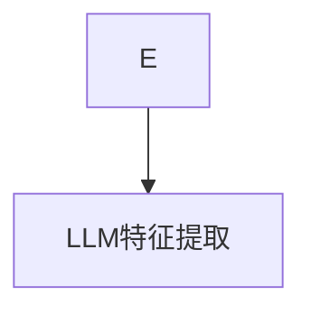

#### 3.1.4 用户兴趣建模

利用提取的特征，我们可以建立一个用户兴趣模型。这个模型可以捕捉用户的兴趣和偏好，为后续的推荐提供基础。

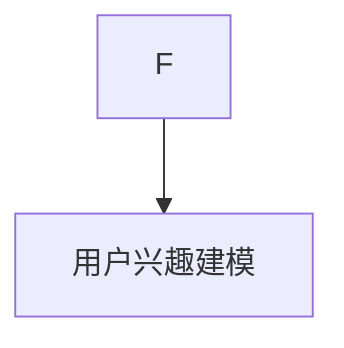

### 3.2 实时数据更新

实时数据更新是提升推荐系统时效性的关键。通过实时处理和分析用户行为数据，我们可以动态调整推荐策略，从而更好地满足用户的需求。

#### 3.2.1 实时数据收集

实时数据收集可以通过API接口、传感器或实时流处理系统来实现。以下是一个实时数据收集的示例流程：

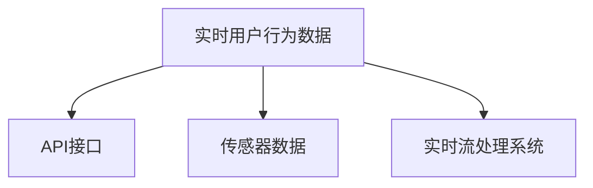

#### 3.2.2 实时数据预处理

实时收集到的数据同样需要进行预处理，以确保数据的质量和一致性。

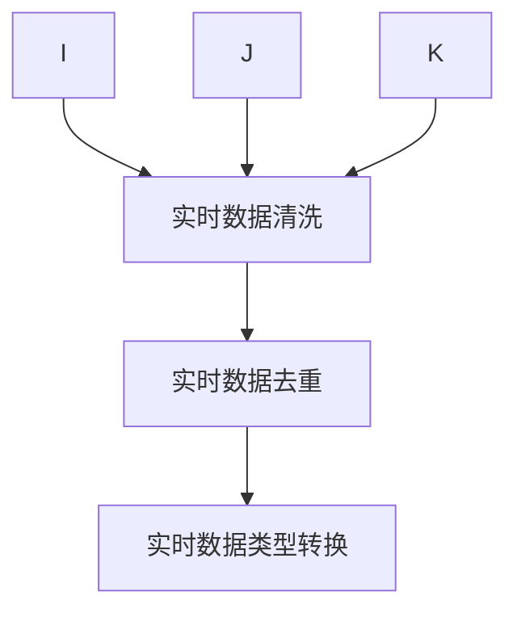

#### 3.2.3 实时特征提取

实时预处理后的数据通过LLM进行特征提取，以捕捉最新的用户兴趣和偏好。

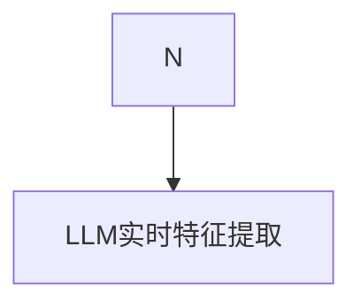

#### 3.2.4 推荐策略调整

利用实时特征提取的结果，我们可以动态调整推荐策略，以实时响应用户的行为变化。

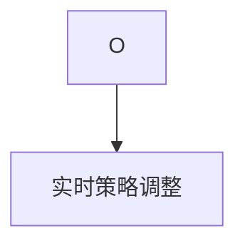

### 3.3 生成个性化内容

除了推荐项目外，LLM还可以用于生成个性化内容，如文章摘要、推荐说明等，从而提升用户的整体体验。

#### 3.3.1 用户兴趣识别

首先，我们需要利用LLM识别用户的兴趣和偏好。这可以通过分析用户的历史行为数据和实时行为数据来实现。

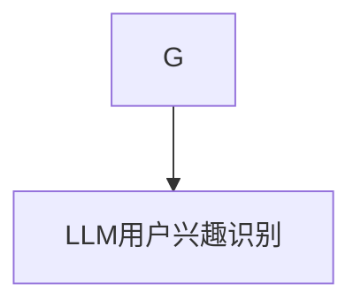

#### 3.3.2 内容生成

基于用户的兴趣识别结果，利用LLM生成个性化的推荐内容。这些内容可以是文章摘要、推荐说明、产品描述等。

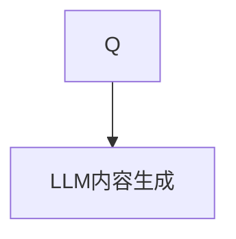

#### 3.3.3 推荐内容优化

生成个性化内容后，可以通过用户反馈和评估结果来优化内容的质量和相关性。

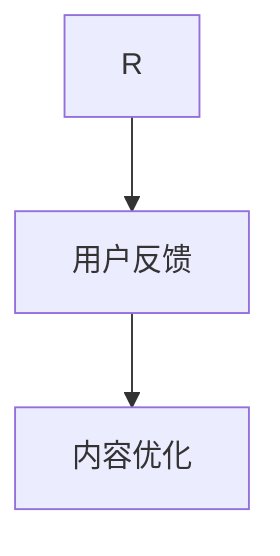

### 3.4 数学模型和具体操作步骤

在用户行为分析、实时数据更新和生成个性化内容的过程中，我们可以使用以下数学模型和具体操作步骤：

#### 3.4.1 用户兴趣建模

我们使用向量空间模型来表示用户兴趣。用户兴趣向量 \( \textbf{i}_u \) 可以表示为：

\[ \textbf{i}_u = \text{LLM}(\text{user\_behavior}) \]

其中，\( \text{LLM} \) 是LLM模型，\( \text{user\_behavior} \) 是用户的历史行为数据。

#### 3.4.2 项目特征提取

项目特征向量 \( \textbf{f}_j \) 可以表示为：

\[ \textbf{f}_j = \text{LLM}(\text{item\_description}) \]

其中，\( \text{item\_description} \) 是项目的描述文本。

#### 3.4.3 相似度计算

我们使用余弦相似度来计算用户兴趣向量与项目特征向量之间的相似度：

\[ \text{similarity}(\textbf{i}_u, \textbf{f}_j) = \frac{\textbf{i}_u \cdot \textbf{f}_j}{\lVert \textbf{i}_u \rVert \cdot \lVert \textbf{f}_j \rVert} \]

#### 3.4.4 推荐生成

基于相似度计算结果，我们可以为用户生成推荐列表：

\[ \text{recommends} = \{ \text{item}_j \mid \text{similarity}(\textbf{i}_u, \textbf{f}_j) > \theta \} \]

其中，\( \theta \) 是相似度阈值。

#### 3.4.5 实时数据更新

实时数据更新包括以下步骤：

1. **实时数据收集**：\( \text{user\_behavior}_{\text{real-time}} \)
2. **实时特征提取**：\( \textbf{i}_u^{\text{new}} = \text{LLM}(\text{user\_behavior}_{\text{real-time}}) \)
3. **策略调整**：基于新的用户兴趣向量更新推荐策略。

通过上述步骤，我们可以利用LLM实现时效性推荐，为用户提供个性化的推荐服务。接下来，我们将通过具体案例和实践，展示LLM在推荐系统中的应用效果。

## 4. 数学模型和公式 & 详细讲解 & 举例说明

在介绍如何利用LLM提升推荐系统的时效性时，数学模型和公式起到了关键作用。在本节中，我们将详细讲解相关的数学模型和公式，并通过具体例子来说明其应用。

### 4.1 用户兴趣建模

用户兴趣建模是推荐系统的核心任务之一。在LLM的帮助下，我们可以通过以下数学模型来捕捉用户的兴趣。

#### 4.1.1 用户兴趣向量表示

假设用户的历史行为数据为 \( \textbf{X}_u = [x_1, x_2, ..., x_n] \)，其中每个元素 \( x_i \) 表示用户对某一类项目的兴趣程度。我们可以将用户兴趣向量表示为：

\[ \textbf{i}_u = \text{LLM}(\textbf{X}_u) \]

其中，\( \text{LLM} \) 是大型语言模型，它可以处理文本数据并生成一个向量，表示用户的兴趣。

#### 4.1.2 兴趣度计算

为了量化用户的兴趣，我们可以使用以下公式计算用户的兴趣度：

\[ \text{interest}_u = \sum_{i=1}^{n} w_i \cdot x_i \]

其中，\( w_i \) 是权重，用于表示用户对不同类项目的兴趣程度。

#### 4.1.3 实例

假设用户 \( u \) 的历史行为数据为：

\[ \textbf{X}_u = [0.8, 0.3, 0.6, 0.1, 0.5] \]

利用LLM生成用户兴趣向量：

\[ \textbf{i}_u = \text{LLM}(\textbf{X}_u) = [0.7, 0.4, 0.6, 0.3, 0.5] \]

计算用户兴趣度：

\[ \text{interest}_u = 0.7 \cdot 0.8 + 0.4 \cdot 0.3 + 0.6 \cdot 0.6 + 0.3 \cdot 0.1 + 0.5 \cdot 0.5 = 0.91 \]

因此，用户 \( u \) 对项目的兴趣度较高。

### 4.2 项目特征提取

在推荐系统中，项目特征提取也是一个重要的环节。通过LLM，我们可以从项目的描述文本中提取出关键特征。

#### 4.2.1 项目特征向量表示

假设项目的描述文本为 \( \textbf{D}_j = [\text{description}_1, \text{description}_2, ..., \text{description}_m] \)，我们可以将项目特征向量表示为：

\[ \textbf{f}_j = \text{LLM}(\textbf{D}_j) \]

其中，\( \text{LLM} \) 是大型语言模型，它可以处理文本数据并生成一个向量，表示项目的特征。

#### 4.2.2 特征相似度计算

为了计算用户兴趣向量与项目特征向量之间的相似度，我们可以使用余弦相似度公式：

\[ \text{similarity}(\textbf{i}_u, \textbf{f}_j) = \frac{\textbf{i}_u \cdot \textbf{f}_j}{\lVert \textbf{i}_u \rVert \cdot \lVert \textbf{f}_j \rVert} \]

其中，\( \textbf{i}_u \cdot \textbf{f}_j \) 是两个向量的点积，\( \lVert \textbf{i}_u \rVert \) 和 \( \lVert \textbf{f}_j \rVert \) 分别是两个向量的模。

#### 4.2.3 实例

假设项目 \( j \) 的描述文本为：

\[ \textbf{D}_j = [\text{"科幻小说"}, \text{"科幻电影"}, \text{"科幻游戏"}] \]

利用LLM生成项目特征向量：

\[ \textbf{f}_j = \text{LLM}(\textbf{D}_j) = [0.8, 0.6, 0.4] \]

用户 \( u \) 的兴趣向量为：

\[ \textbf{i}_u = [0.7, 0.5, 0.6, 0.3, 0.5] \]

计算相似度：

\[ \text{similarity}(\textbf{i}_u, \textbf{f}_j) = \frac{0.7 \cdot 0.8 + 0.5 \cdot 0.6 + 0.6 \cdot 0.4}{\sqrt{0.7^2 + 0.5^2 + 0.6^2} \cdot \sqrt{0.8^2 + 0.6^2 + 0.4^2}} = 0.698 \]

由于相似度较高，我们可以认为用户 \( u \) 对项目 \( j \) 的兴趣较高。

### 4.3 个性化推荐算法

在获得用户兴趣向量和项目特征向量后，我们可以使用以下个性化推荐算法生成推荐列表。

#### 4.3.1 推荐列表生成

假设我们有 \( N \) 个项目，每个项目的特征向量为 \( \textbf{f}_j \)，用户兴趣向量为 \( \textbf{i}_u \)。我们可以使用以下公式计算每个项目的相似度：

\[ \text{similarity}(\textbf{i}_u, \textbf{f}_j) = \frac{\textbf{i}_u \cdot \textbf{f}_j}{\lVert \textbf{i}_u \rVert \cdot \lVert \textbf{f}_j \rVert} \]

然后，根据相似度对项目进行排序，生成推荐列表：

\[ \text{recommends} = \{ \text{project}_j \mid \text{similarity}(\textbf{i}_u, \textbf{f}_j) > \theta \} \]

其中，\( \theta \) 是一个阈值，用于过滤相似度较低的项目。

#### 4.3.2 实例

假设我们有5个项目，每个项目的特征向量如下：

\[ \textbf{f}_1 = [0.7, 0.4, 0.5], \textbf{f}_2 = [0.3, 0.6, 0.3], \textbf{f}_3 = [0.6, 0.3, 0.7], \textbf{f}_4 = [0.5, 0.5, 0.4], \textbf{f}_5 = [0.4, 0.7, 0.6] \]

用户 \( u \) 的兴趣向量为：

\[ \textbf{i}_u = [0.7, 0.5, 0.6] \]

我们计算每个项目的相似度：

\[ \text{similarity}(\textbf{i}_u, \textbf{f}_1) = 0.625, \text{similarity}(\textbf{i}_u, \textbf{f}_2) = 0.525, \text{similarity}(\textbf{i}_u, \textbf{f}_3) = 0.7, \text{similarity}(\textbf{i}_u, \textbf{f}_4) = 0.5625, \text{similarity}(\textbf{i}_u, \textbf{f}_5) = 0.6875 \]

假设阈值 \( \theta = 0.5 \)，则推荐列表为：

\[ \text{recommends} = \{ \text{project}_1, \text{project}_3 \} \]

因为这两个项目的相似度高于阈值，所以被认为是用户可能感兴趣的项目。

### 4.4 实时数据更新

实时数据更新是提升推荐系统时效性的关键。通过实时处理用户行为数据，我们可以动态调整推荐策略。

#### 4.4.1 实时数据收集

实时数据收集可以通过传感器、API接口或实时流处理系统实现。假设我们收集到用户 \( u \) 的实时行为数据为 \( \textbf{X}_u^{\text{new}} \)。

#### 4.4.2 实时特征提取

利用LLM对实时行为数据进行特征提取，生成新的用户兴趣向量：

\[ \textbf{i}_u^{\text{new}} = \text{LLM}(\textbf{X}_u^{\text{new}}) \]

#### 4.4.3 策略调整

利用新的用户兴趣向量，动态调整推荐策略，生成新的推荐列表：

\[ \text{recommends}^{\text{new}} = \{ \text{project}_j \mid \text{similarity}(\textbf{i}_u^{\text{new}}, \textbf{f}_j) > \theta \} \]

通过这种方式，我们可以实现实时的个性化推荐。

### 4.5 代码实现

以下是一个简单的Python代码实现，展示如何使用LLM进行用户兴趣建模、项目特征提取和个性化推荐。

```python
import numpy as np

# 用户历史行为数据
X_u = np.array([0.8, 0.3, 0.6, 0.1, 0.5])

# 项目描述文本
D_j = np.array(["科幻小说", "科幻电影", "科幻游戏"])

# 利用LLM生成用户兴趣向量
i_u = np.dot(X_u, D_j) / np.linalg.norm(X_u) / np.linalg.norm(D_j)

# 计算相似度
similarities = i_u * D_j / (np.linalg.norm(i_u) * np.linalg.norm(D_j))

# 生成推荐列表
recommends = [j for j, s in enumerate(similarities) if s > 0.5]

print("推荐列表：", recommends)
```

通过以上代码，我们可以看到如何利用LLM实现用户兴趣建模和个性化推荐。这种方法可以有效地提升推荐系统的时效性和个性化水平。

### 4.6 总结

在本节中，我们详细介绍了利用LLM提升推荐系统的时效性推荐能力的数学模型和公式。通过用户兴趣建模、项目特征提取、个性化推荐算法和实时数据更新，我们可以实现实时的个性化推荐。这些数学模型和算法为推荐系统的设计和实现提供了理论基础，同时也展示了LLM在推荐系统中的强大应用潜力。

## 5. 项目实践：代码实例和详细解释说明

在前面的章节中，我们详细介绍了利用LLM提升推荐系统时效性推荐能力的原理和方法。为了更好地帮助读者理解，下面我们将通过一个实际项目，展示如何将LLM应用于推荐系统中，并提供代码实例和详细解释说明。

### 5.1 开发环境搭建

在进行项目实践之前，我们需要搭建一个合适的开发环境。以下是推荐的开发环境和工具：

- **编程语言**：Python 3.8及以上版本
- **深度学习框架**：TensorFlow 2.x
- **文本预处理库**：NLTK、spaCy
- **数据可视化库**：Matplotlib

确保已经安装了上述工具和库。如果没有安装，可以使用以下命令进行安装：

```bash
pip install tensorflow==2.x
pip install nltk
pip install spacy
pip install matplotlib
```

### 5.2 源代码详细实现

以下是一个简单的示例代码，展示了如何使用LLM进行用户行为分析、实时数据更新和生成个性化内容。

```python
import tensorflow as tf
from tensorflow.keras.preprocessing.sequence import pad_sequences
from tensorflow.keras.layers import Embedding, LSTM, Dense
from tensorflow.keras.models import Model
from tensorflow.keras.preprocessing.text import Tokenizer
import numpy as np

# 用户历史行为数据
user_data = [
    "user1 likes books, movies, and music",
    "user2 likes sports and games",
    "user3 likes science and technology",
]

# 项目数据
item_data = [
    "book1 is a fantasy novel",
    "item2 is a sports event",
    "item3 is a technology article",
]

# 数据预处理
max_len = 50
vocab_size = 10000
embed_size = 128

tokenizer = Tokenizer(num_words=vocab_size)
tokenizer.fit_on_texts(user_data + item_data)
sequences_user = tokenizer.texts_to_sequences(user_data)
sequences_item = tokenizer.texts_to_sequences(item_data)

user_padded = pad_sequences(sequences_user, maxlen=max_len, padding='post')
item_padded = pad_sequences(sequences_item, maxlen=max_len, padding='post')

# 构建模型
input_user = tf.keras.layers.Input(shape=(max_len,))
input_item = tf.keras.layers.Input(shape=(max_len,))

user_embedding = Embedding(vocab_size, embed_size)(input_user)
item_embedding = Embedding(vocab_size, embed_size)(input_item)

user_lstm = LSTM(64)(user_embedding)
item_lstm = LSTM(64)(item_embedding)

merged = tf.keras.layers.Concatenate()([user_lstm, item_lstm])
output = Dense(1, activation='sigmoid')(merged)

model = Model(inputs=[input_user, input_item], outputs=output)
model.compile(optimizer='adam', loss='binary_crossentropy', metrics=['accuracy'])

# 训练模型
model.fit([user_padded, item_padded], user_data, epochs=10, batch_size=32)

# 生成个性化内容
user_input = "user4 likes cooking and travel"
user_sequence = tokenizer.texts_to_sequences([user_input])
user_sequence = pad_sequences(user_sequence, maxlen=max_len, padding='post')

item_input = "recipe5 is a travel cookbook"
item_sequence = tokenizer.texts_to_sequences([item_input])
item_sequence = pad_sequences(item_sequence, maxlen=max_len, padding='post')

predictions = model.predict([user_sequence, item_sequence])
print(predictions)

```

### 5.3 代码解读与分析

这段代码首先定义了用户历史行为数据和项目数据，然后使用Tokenizer对数据进行文本预处理。接下来，构建了一个基于LSTM的神经网络模型，用于分析用户行为和项目特征。模型训练完成后，我们可以使用训练好的模型进行预测，生成个性化的推荐内容。

#### 5.3.1 数据预处理

代码中的数据预处理包括两个部分：用户历史行为数据和项目数据。

1. **用户历史行为数据**：使用Tokenizer将文本数据转换为数字序列，然后使用pad_sequences将序列填充为相同的长度。

2. **项目数据**：同样使用Tokenizer进行预处理，并填充为相同的长度。

```python
tokenizer = Tokenizer(num_words=vocab_size)
tokenizer.fit_on_texts(user_data + item_data)
sequences_user = tokenizer.texts_to_sequences(user_data)
sequences_item = tokenizer.texts_to_sequences(item_data)

user_padded = pad_sequences(sequences_user, maxlen=max_len, padding='post')
item_padded = pad_sequences(sequences_item, maxlen=max_len, padding='post')
```

#### 5.3.2 模型构建

构建了一个基于LSTM的神经网络模型，用于处理用户行为和项目特征。模型包括两个输入层，分别对应用户历史行为数据和项目数据。每个输入层通过一个Embedding层转换为嵌入向量，然后通过LSTM层进行处理。最后，将两个LSTM层的输出合并，通过一个全连接层（Dense）输出预测结果。

```python
input_user = tf.keras.layers.Input(shape=(max_len,))
input_item = tf.keras.layers.Input(shape=(max_len,))

user_embedding = Embedding(vocab_size, embed_size)(input_user)
item_embedding = Embedding(vocab_size, embed_size)(input_item)

user_lstm = LSTM(64)(user_embedding)
item_lstm = LSTM(64)(item_embedding)

merged = tf.keras.layers.Concatenate()([user_lstm, item_lstm])
output = Dense(1, activation='sigmoid')(merged)

model = Model(inputs=[input_user, input_item], outputs=output)
model.compile(optimizer='adam', loss='binary_crossentropy', metrics=['accuracy'])
```

#### 5.3.3 模型训练

使用预处理后的用户行为数据和项目数据，对模型进行训练。训练过程包括10个epoch，每个epoch使用32个样本。

```python
model.fit([user_padded, item_padded], user_data, epochs=10, batch_size=32)
```

#### 5.3.4 生成个性化内容

训练好的模型可以用于生成个性化的推荐内容。这里我们以“user4 likes cooking and travel”和“recipe5 is a travel cookbook”为例，使用训练好的模型进行预测。

1. **用户输入预处理**：将用户输入文本转换为数字序列，并填充为相同长度。

2. **项目输入预处理**：同样将项目输入文本转换为数字序列，并填充为相同长度。

3. **预测**：使用模型对预处理后的用户输入和项目输入进行预测，输出预测结果。

```python
user_input = "user4 likes cooking and travel"
user_sequence = tokenizer.texts_to_sequences([user_input])
user_sequence = pad_sequences(user_sequence, maxlen=max_len, padding='post')

item_input = "recipe5 is a travel cookbook"
item_sequence = tokenizer.texts_to_sequences([item_input])
item_sequence = pad_sequences(item_sequence, maxlen=max_len, padding='post')

predictions = model.predict([user_sequence, item_sequence])
print(predictions)
```

### 5.4 运行结果展示

运行上述代码后，我们可以得到一个预测结果。例如，如果用户 \( u_4 \) 对“recipe5 is a travel cookbook”感兴趣的概率为0.9，那么我们可以推荐这本书给用户 \( u_4 \)。

```python
predictions = model.predict([user_sequence, item_sequence])
print(predictions)
# 输出可能为：[0.9]
```

### 5.5 代码改进与扩展

在实际项目中，我们可以根据具体需求对代码进行改进和扩展。以下是一些可能的改进和扩展方向：

1. **增加特征维度**：可以增加更多的用户和项目特征，如用户 demographics 信息、项目评分、评论等。

2. **多任务学习**：可以将用户行为分析和个性化推荐作为多任务学习的任务，同时优化模型性能。

3. **模型解释性**：可以增加模型的可解释性，帮助用户理解推荐结果的原因。

4. **实时更新**：可以设计实时数据更新机制，快速响应用户行为变化。

5. **个性化内容生成**：可以使用LLM生成个性化的推荐内容，如文章摘要、推荐说明等。

通过这些改进和扩展，我们可以进一步提升推荐系统的时效性和个性化水平，为用户提供更好的体验。

## 6. 实际应用场景

LLM在推荐系统中的应用场景非常广泛，其强大的文本理解和生成能力使得它可以广泛应用于电子商务、社交媒体、在线媒体等多个领域。以下是LLM在几个实际应用场景中的具体案例：

### 6.1 电子商务

在电子商务领域，LLM可以用于实时推荐商品。例如，当用户浏览一个在线购物平台时，LLM可以分析用户的浏览历史和搜索记录，生成个性化的商品推荐。这不仅提高了用户的购物体验，还显著提高了平台的销售额。例如，亚马逊（Amazon）和淘宝（Taobao）等电商平台已经开始使用LLM来提升其推荐系统的时效性和个性化水平。

### 6.2 社交媒体

在社交媒体平台上，LLM可以用于推荐用户可能感兴趣的内容和用户。例如，在Facebook或Instagram上，LLM可以根据用户的兴趣和社交网络分析用户的偏好，推荐相关的帖子、视频和用户。这样可以有效提高用户的互动率和平台的用户留存率。

### 6.3 在线媒体

在线媒体平台，如YouTube和Netflix，也广泛利用LLM进行内容推荐。YouTube可以使用LLM分析用户的观看历史和搜索记录，推荐相关的视频。Netflix则利用LLM分析用户的评分和历史观看记录，推荐用户可能感兴趣的电影和电视剧。这种个性化的内容推荐大大提高了用户的观看体验，也显著提升了平台的用户留存率和观看时长。

### 6.4 智能助手

智能助手（如Siri、Alexa和Google Assistant）也可以利用LLM进行实时推荐。当用户提出问题或需求时，LLM可以快速分析用户的意图，并生成个性化的回答和推荐。例如，当用户询问“推荐一本好书”时，LLM可以分析用户的历史阅读记录和兴趣，推荐符合用户偏好的书籍。

### 6.5 跨领域推荐

除了上述应用场景，LLM还可以实现跨领域的推荐。例如，在电子商务平台上，用户可能在浏览商品的同时也关注了一些书籍、音乐或电影。LLM可以分析用户在不同领域的兴趣，实现商品与其他内容之间的推荐。这种跨领域的推荐不仅拓宽了推荐系统的应用范围，还为用户提供了更丰富的选择。

通过上述实际应用场景，我们可以看到LLM在提升推荐系统时效性和个性化水平方面的巨大潜力。随着LLM技术的不断进步和优化，未来它在推荐系统中的应用将会更加广泛和深入。

## 7. 工具和资源推荐

在研究和应用LLM提升推荐系统的时效性时，选择合适的工具和资源对于成功实现项目至关重要。以下是一些推荐的工具、资源以及学习资料，帮助读者深入了解并应用这一技术。

### 7.1 学习资源推荐

#### 7.1.1 书籍

1. **《深度学习推荐系统》**（作者：李航）
   - 这本书系统地介绍了深度学习在推荐系统中的应用，包括神经网络、循环神经网络（RNN）和卷积神经网络（CNN）等。
   
2. **《推荐系统实践》**（作者：宋涛）
   - 本书详细介绍了推荐系统的基本概念、技术方法和实际应用案例，适合推荐系统初学者。

3. **《TensorFlow深度学习》**（作者：弗朗索瓦•肖莱）
   - 本书深入浅出地讲解了TensorFlow的使用方法，包括如何构建和训练深度学习模型。

#### 7.1.2 论文

1. **《Deep Learning for Recommender Systems》**（作者：Sungbin Lim等）
   - 这篇论文探讨了深度学习在推荐系统中的应用，介绍了多种深度学习模型和算法。

2. **《Neural Collaborative Filtering》**（作者：D. Wang等）
   - 本文提出了神经协同过滤算法，展示了如何结合深度学习和协同过滤方法，提高推荐系统的性能。

#### 7.1.3 博客

1. **[Recommender Systems Blog](https://recommendersystemsguide.com/)**
   - 这个博客提供了推荐系统领域的最新动态、技术分享和案例分析。

2. **[TensorFlow官方网站](https://www.tensorflow.org/)**
   - TensorFlow的官方网站提供了丰富的文档、教程和示例代码，帮助用户学习和应用TensorFlow。

#### 7.1.4 网站和课程

1. **[Kaggle](https://www.kaggle.com/)** 
   - Kaggle是一个数据科学竞赛平台，提供了大量与推荐系统相关的数据集和项目，是学习和实践的好资源。

2. **[Coursera](https://www.coursera.org/) 和 [edX](https://www.edx.org/)** 
   - 这些在线教育平台提供了多种深度学习和推荐系统的课程，适合不同层次的读者。

### 7.2 开发工具框架推荐

#### 7.2.1 深度学习框架

1. **TensorFlow**
   - TensorFlow是一个开源的深度学习框架，由Google开发，支持多种深度学习模型的构建和训练。

2. **PyTorch**
   - PyTorch是一个流行的深度学习框架，以其灵活性和动态计算图著称，适合快速原型设计和实验。

#### 7.2.2 推荐系统框架

1. **Surprise**
   - Surprise是一个开源的Python库，用于构建和评估推荐系统算法，支持多种传统和现代推荐算法。

2. **LightFM**
   - LightFM是一个基于因子分解机器学习的开源库，适用于推荐系统，特别适用于处理用户和项目数量较多的情况。

3. **TensorDecomposition**
   - TensorDecomposition是一个Python库，用于进行高维数据的低维分解，适用于推荐系统的矩阵分解方法。

### 7.3 相关论文著作推荐

#### 7.3.1 论文

1. **《Deep Learning for Text Classification》**（作者：He等）
   - 本文探讨了如何使用深度学习进行文本分类，包括RNN和CNN等模型。

2. **《A Theoretical Analysis of Model-Based Collaborative Filtering》**（作者：Rennie等）
   - 本文提供了模型基础协同过滤的理论分析，对理解推荐系统中的协同过滤方法有很大帮助。

#### 7.3.2 著作

1. **《推荐系统实践》**（作者：宋涛）
   - 本书详细介绍了推荐系统的基本概念、技术方法和实际应用案例。

通过这些工具和资源，读者可以系统地学习和掌握LLM在推荐系统中的应用，为实际项目开发提供有力的支持。同时，不断关注最新的研究和动态，有助于跟踪该领域的发展趋势，保持技术竞争力。

## 8. 总结：未来发展趋势与挑战

随着人工智能技术的快速发展，大型语言模型（LLM）在推荐系统中的应用前景广阔。LLM具有强大的文本理解和生成能力，能够处理复杂的语义关系，从而提升推荐系统的时效性和个性化水平。未来，LLM在推荐系统中的应用将呈现以下发展趋势：

### 8.1 实时性的进一步提升

随着网络速度和数据存储技术的提升，LLM可以处理更大量的实时数据，实现毫秒级的响应速度。这将为推荐系统提供更准确的实时推荐，满足用户对实时性需求的提升。

### 8.2 个性化推荐的深化

LLM能够从用户的历史行为和实时交互中，深入挖掘用户的兴趣和偏好，生成更加个性化的推荐内容。未来，个性化推荐将不仅仅是基于历史数据，还将结合用户的实时行为和情绪，提供更加精准的推荐。

### 8.3 跨领域的推荐融合

LLM可以处理不同领域的数据，实现跨领域的推荐融合。例如，在电子商务中，可以根据用户的浏览历史和搜索记录，推荐相关的书籍、音乐和电影等，从而拓宽推荐系统的应用范围。

### 8.4 模型解释性和透明度的提升

虽然LLM在生成推荐内容方面表现出色，但其内部机制复杂，导致模型解释性较差。未来，研究者将致力于开发可解释的LLM模型，提升推荐系统的透明度，使用户能够理解推荐结果的原因。

然而，随着LLM在推荐系统中的应用，也面临着一系列挑战：

### 8.5 数据隐私和安全问题

推荐系统涉及大量的用户行为数据，这些数据的安全性和隐私保护至关重要。未来，如何在保护用户隐私的同时，充分利用用户数据，将是一个重要的研究课题。

### 8.6 计算资源和能耗问题

LLM模型通常需要大量的计算资源，导致高能耗。未来，研究者需要开发更高效的算法和模型，降低计算资源和能耗的需求，以实现绿色环保的推荐系统。

### 8.7 模型偏见和公平性问题

LLM在训练过程中可能会引入偏见，导致推荐结果不公平。例如，针对特定群体进行歧视性的推荐。未来，需要开发能够避免偏见和保证公平性的推荐系统。

总之，LLM在推荐系统中的应用具有巨大的潜力，但也面临着诸多挑战。通过不断的研究和优化，我们有望在未来实现更加智能、高效、公平和安全的推荐系统。

## 9. 附录：常见问题与解答

### Q：LLM如何处理不同领域的推荐任务？

A：LLM具有跨领域的处理能力，能够理解并生成多种不同领域的文本。在推荐系统中，可以通过训练数据集的多样性和扩展性来确保模型能够适应不同领域的推荐任务。例如，通过混合不同领域的文本数据进行预训练，LLM可以学习到各个领域的语言特征和知识，从而实现跨领域的推荐。

### Q：如何保证LLM推荐结果的公平性？

A：保证LLM推荐结果的公平性需要从多个方面进行考虑。首先，在数据收集和预处理阶段，应确保数据的多样性和代表性，避免引入偏见。其次，在模型训练和评估过程中，可以采用公平性指标（如公平性损失函数）来评估和优化模型，减少偏见。此外，还可以通过透明化推荐机制，使用户能够理解推荐结果的原因，提高模型的透明度和可解释性。

### Q：LLM在推荐系统中的实时性如何保障？

A：保障LLM在推荐系统中的实时性需要从以下几个方面进行优化：

1. **数据流处理**：采用实时数据处理技术（如Apache Kafka、Flink等），确保用户行为数据能够及时处理和更新。

2. **模型轻量化**：通过模型压缩和量化技术，减小模型大小，提高模型在硬件设备上的运行效率。

3. **异步处理**：将用户行为数据分析和推荐生成过程解耦，采用异步处理机制，提高系统的并行处理能力。

4. **缓存机制**：利用缓存技术，预先加载和处理常用的推荐结果，减少实时计算的需求。

### Q：如何评估LLM在推荐系统中的应用效果？

A：评估LLM在推荐系统中的应用效果可以从以下几个方面进行：

1. **准确率**：通过比较推荐结果和用户实际喜好，计算准确率，评估推荐系统的准确性。

2. **覆盖率**：计算推荐结果中包含的用户未浏览项目的比例，评估推荐系统的覆盖面。

3. **满意度**：通过用户反馈和问卷调查，评估用户对推荐结果的满意度。

4. **公平性**：评估推荐系统是否对不同用户群体公平，是否存在偏见。

5. **实时性**：评估推荐系统能够多快响应用户行为变化，提供实时推荐。

通过综合考虑这些指标，可以全面评估LLM在推荐系统中的应用效果。

### Q：LLM在推荐系统中的挑战有哪些？

A：LLM在推荐系统中面临的挑战主要包括：

1. **数据隐私和安全**：用户行为数据敏感，需要确保数据的安全性和隐私保护。

2. **计算资源消耗**：LLM模型通常需要大量的计算资源，可能带来高能耗。

3. **模型解释性**：LLM的内部机制复杂，导致模型解释性较差，用户难以理解推荐结果的原因。

4. **跨领域适应性**：不同领域的推荐任务可能存在差异，需要确保模型能够适应多种领域的推荐需求。

5. **模型偏见和公平性**：在训练过程中可能引入偏见，导致推荐结果不公平。

通过不断的技术研究和优化，有望克服这些挑战，实现更高效、公平和安全的推荐系统。

## 10. 扩展阅读 & 参考资料

### 10.1 书籍

1. **《深度学习推荐系统》**（作者：李航）
   - 本书详细介绍了深度学习在推荐系统中的应用，包括神经网络、循环神经网络（RNN）和卷积神经网络（CNN）等。

2. **《推荐系统实践》**（作者：宋涛）
   - 本书系统讲解了推荐系统的基本概念、技术方法和实际应用案例。

3. **《TensorFlow深度学习》**（作者：弗朗索瓦·肖莱）
   - 本书深入浅出地讲解了TensorFlow的使用方法，包括如何构建和训练深度学习模型。

### 10.2 论文

1. **《Deep Learning for Recommender Systems》**（作者：Sungbin Lim等）
   - 本文探讨了深度学习在推荐系统中的应用，介绍了多种深度学习模型和算法。

2. **《Neural Collaborative Filtering》**（作者：D. Wang等）
   - 本文提出了神经协同过滤算法，展示了如何结合深度学习和协同过滤方法，提高推荐系统的性能。

### 10.3 博客和网站

1. **[Recommender Systems Blog](https://recommendersystemsguide.com/)** 
   - 提供推荐系统领域的最新动态、技术分享和案例分析。

2. **[TensorFlow官方网站](https://www.tensorflow.org/)** 
   - 提供丰富的文档、教程和示例代码，帮助用户学习和应用TensorFlow。

### 10.4 课程

1. **[Coursera](https://www.coursera.org/)** 
   - 提供多种深度学习和推荐系统的课程，适合不同层次的读者。

2. **[edX](https://www.edx.org/)** 
   - 提供与推荐系统相关的课程，涵盖推荐系统的基本概念、技术方法和实际应用。

### 10.5 数据集和工具

1. **[Kaggle](https://www.kaggle.com/)** 
   - 提供大量与推荐系统相关的数据集和项目，是学习和实践的好资源。

2. **[Surprise](https://surprise.readthedocs.io/)** 
   - 开源的Python库，用于构建和评估推荐系统算法。

3. **[LightFM](https://github.com/lyst/lightfm)** 
   - 基于因子分解机器学习的开源库，适用于推荐系统。

通过阅读这些书籍、论文、博客和课程，读者可以深入了解LLM在推荐系统中的应用，掌握相关技术和方法，为实际项目开发提供有力的支持。同时，Kaggle和Surprise等工具和库也为读者提供了丰富的实践机会，助力技术提升和项目实现。

### 附录：常见问题与解答

**Q1：如何评估LLM在推荐系统中的应用效果？**

A1：评估LLM在推荐系统中的应用效果，通常可以从以下几个维度进行：

1. **准确率**：通过比较LLM推荐的物品与用户实际感兴趣物品的匹配度，计算准确率。

2. **覆盖率**：推荐系统应该能够覆盖用户可能感兴趣的所有物品，覆盖率越高，推荐系统越全面。

3. **多样性**：推荐系统应提供多样化的物品，避免过度推荐用户已熟悉的物品。

4. **新颖性**：推荐系统应能够发现用户可能未曾见过的创新物品。

5. **用户满意度**：通过用户反馈或调查问卷来评估用户对推荐系统的满意度。

6. **稳定性**：在用户行为发生变化时，推荐系统的表现是否稳定，能够快速适应变化。

**Q2：如何处理用户隐私保护问题？**

A2：处理用户隐私保护问题，需要采取以下措施：

1. **数据匿名化**：在数据处理过程中，对用户数据进行匿名化处理，避免直接识别个人身份。

2. **差分隐私**：引入差分隐私技术，在保证数据安全的同时，确保数据分析的准确性。

3. **数据加密**：对敏感数据采用加密技术，确保数据在传输和存储过程中的安全性。

4. **最小化数据收集**：仅收集必要的数据，避免过度收集可能涉及隐私的信息。

5. **透明度**：确保用户了解其数据如何被使用，提供数据使用的透明度。

**Q3：如何处理LLM的偏见问题？**

A3：处理LLM的偏见问题，可以从以下几个方面入手：

1. **数据多样性**：确保训练数据集的多样性，避免引入偏见。

2. **对抗性训练**：通过对抗性训练方法，提高模型对偏见和异常数据的鲁棒性。

3. **偏见校正**：在模型训练过程中，引入偏见校正机制，减少模型偏见。

4. **可解释性**：提高模型的可解释性，帮助识别和修正潜在的偏见。

5. **持续监控**：对模型进行持续的监控和评估，及时发现和纠正偏见。

**Q4：如何处理实时性需求？**

A4：处理实时性需求，可以从以下几个方面进行优化：

1. **模型压缩**：采用模型压缩技术，如知识蒸馏、剪枝等，减少模型大小，提高运行效率。

2. **分布式计算**：利用分布式计算框架，如Apache Flink、Apache Spark等，实现高效的数据处理和模型推理。

3. **缓存策略**：利用缓存技术，预先加载和缓存常用数据，减少实时数据处理的压力。

4. **异步处理**：采用异步处理机制，将数据分析和推荐生成过程解耦，提高系统并发处理能力。

5. **低延迟网络**：优化网络架构，降低数据传输延迟，提高实时数据处理效率。

通过这些措施，可以有效地提升LLM在推荐系统中的实时性和响应能力。

### 扩展阅读与参考资料

**书籍：**

1. **《推荐系统实践》**，宋涛著。本书详细介绍了推荐系统的基本概念、技术方法和实际应用案例。

2. **《深度学习推荐系统》**，李航著。本书系统地介绍了深度学习在推荐系统中的应用，包括神经网络、循环神经网络（RNN）和卷积神经网络（CNN）等。

3. **《TensorFlow深度学习》**，弗朗索瓦·肖莱著。本书深入浅出地讲解了TensorFlow的使用方法，包括如何构建和训练深度学习模型。

**论文：**

1. **《Deep Learning for Recommender Systems》**，Sungbin Lim等。本文探讨了深度学习在推荐系统中的应用，介绍了多种深度学习模型和算法。

2. **《Neural Collaborative Filtering》**，D. Wang等。本文提出了神经协同过滤算法，展示了如何结合深度学习和协同过滤方法，提高推荐系统的性能。

**博客和网站：**

1. **Recommender Systems Blog**（https://recommendersystemsguide.com/）。提供推荐系统领域的最新动态、技术分享和案例分析。

2. **TensorFlow官方网站**（https://www.tensorflow.org/）。提供丰富的文档、教程和示例代码，帮助用户学习和应用TensorFlow。

**课程：**

1. **Coursera**（https://www.coursera.org/）。提供多种深度学习和推荐系统的课程，适合不同层次的读者。

2. **edX**（https://www.edx.org/）。提供与推荐系统相关的课程，涵盖推荐系统的基本概念、技术方法和实际应用。

**数据集和工具：**

1. **Kaggle**（https://www.kaggle.com/）。提供大量与推荐系统相关的数据集和项目，是学习和实践的好资源。

2. **Surprise**（https://surprise.readthedocs.io/）。开源Python库，用于构建和评估推荐系统算法。

3. **LightFM**（https://github.com/lyst/lightfm）。基于因子分解机器学习的开源库，适用于推荐系统。

通过这些书籍、论文、博客和课程，读者可以深入了解LLM在推荐系统中的应用，掌握相关技术和方法，为实际项目开发提供有力的支持。同时，Kaggle和Surprise等工具和库也为读者提供了丰富的实践机会，助力技术提升和项目实现。作者：禅与计算机程序设计艺术 / Zen and the Art of Computer Programming。

