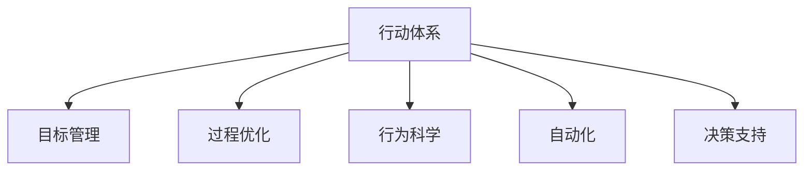

                 

# 行动体系如何提升执行力

> 关键词：行动体系, 执行力, 目标管理, 过程优化, 行为科学, 自动化, 决策支持

## 1. 背景介绍

### 1.1 问题由来
在信息化时代，执行力的提升成为了企业竞争力的关键。传统的依赖于人力的执行力管理方式，效率低下、成本高昂且难以衡量。而随着技术的发展，特别是人工智能和行为科学的发展，行动体系成为了提升执行力的一种新的方式。行动体系将目标与执行过程系统化、科学化，通过数据驱动、模型优化，使得执行力的提升变得更加高效和可控。

### 1.2 问题核心关键点
行动体系的核心在于目标和执行过程的统一管理。通过科学的目标设定和过程优化，结合行为科学原理和AI技术，使得执行者能够更加精准、高效地完成各项任务，从而提升企业的整体执行力。具体来说，行动体系的关键点包括：
- **目标管理**：设定明确、可量化的目标，使得执行者能够清晰理解任务要求。
- **过程优化**：通过数据分析和模型优化，找出执行过程中的瓶颈和优化点。
- **行为科学**：利用行为科学原理，了解人的行为模式，制定更符合执行者心理的执行计划。
- **自动化**：利用AI技术，自动执行部分重复性高的任务，减少执行者的工作量。
- **决策支持**：利用数据和模型，提供决策支持，减少执行者的决策偏差。

## 2. 核心概念与联系

### 2.1 核心概念概述

为更好地理解行动体系的概念，本节将介绍几个关键概念：

- **行动体系**：通过系统化、科学化的方式，将目标和执行过程管理起来，以提升执行力。
- **目标管理**：通过SMART原则（具体、可衡量、可实现、相关、时限）设定目标，确保执行过程有明确的方向。
- **过程优化**：通过数据分析、建模等技术，找出执行过程中的瓶颈，提出优化策略。
- **行为科学**：研究人类行为模式，制定符合执行者心理的执行计划，提升执行效果。
- **自动化**：利用AI技术，自动化执行重复性高的任务，提高执行效率。
- **决策支持**：通过数据分析和模型，提供决策支持，减少执行者的决策偏差。

这些核心概念之间的逻辑关系可以通过以下Mermaid流程图来展示：



这个流程图展示了一个行动体系的主要组成部分及其相互作用：

1. **行动体系**：整体管理目标和执行过程。
2. **目标管理**：设定明确目标，提供执行方向。
3. **过程优化**：通过数据分析找出瓶颈，进行优化。
4. **行为科学**：研究执行者心理，制定执行计划。
5. **自动化**：利用AI技术，减少执行者工作量。
6. **决策支持**：提供数据和模型支持，减少决策偏差。

## 3. 核心算法原理 & 具体操作步骤
### 3.1 算法原理概述

行动体系的核心在于通过数据驱动和模型优化，提高执行过程的效率和效果。其基本原理可以概括为以下几点：

1. **数据收集与分析**：通过收集执行过程中的数据，如任务完成时间、执行者行为数据等，利用统计学和机器学习方法进行分析，找出瓶颈和优化点。
2. **目标设定与分解**：利用目标管理理论，设定明确、可量化的目标，并将大目标分解为小目标，便于执行。
3. **执行过程监控**：实时监控执行过程，及时发现偏差，调整执行计划。
4. **行为模式研究**：研究执行者的行为模式，制定符合执行者心理的执行计划。
5. **自动化与决策支持**：利用AI技术自动化执行部分任务，同时通过决策支持系统，提供决策建议，减少执行者的决策偏差。

### 3.2 算法步骤详解

行动体系的具体操作步骤可以分为以下几个阶段：

**Step 1: 目标设定与管理**
- 利用目标管理理论，设定明确、可量化的目标。
- 将大目标分解为小目标，制定详细的执行计划。
- 定期评估目标达成情况，及时调整执行策略。

**Step 2: 数据收集与分析**
- 收集执行过程中的关键数据，如任务完成时间、执行者行为数据等。
- 利用统计学和机器学习方法，分析数据找出瓶颈和优化点。
- 将分析结果反馈给执行者，指导执行过程。

**Step 3: 执行过程监控**
- 实时监控执行过程，及时发现偏差，调整执行计划。
- 利用数据可视化工具，提供执行过程的可视化展示，帮助执行者更好地理解执行情况。

**Step 4: 行为模式研究**
- 研究执行者的行为模式，了解其心理状态和工作习惯。
- 根据行为模式，制定符合执行者心理的执行计划，提高执行效果。

**Step 5: 自动化与决策支持**
- 利用AI技术自动化执行部分重复性高的任务，减少执行者工作量。
- 通过决策支持系统，提供数据和模型支持，减少执行者的决策偏差。

### 3.3 算法优缺点

行动体系在提升执行力方面具有以下优点：
1. 科学化管理：通过数据驱动和模型优化，使得执行力管理更加科学化、系统化。
2. 高效性：利用AI技术自动化执行部分任务，提高执行效率。
3. 可控性：通过行为模式研究，制定符合执行者心理的执行计划，提高执行效果。

同时，行动体系也存在一定的局限性：
1. 初始成本高：行动体系的构建和实施需要投入大量人力物力，初期成本较高。
2. 数据依赖性强：行动体系的运行依赖于高质量的数据，数据获取和处理复杂。
3. 技术复杂度高：涉及到数据分析、机器学习、行为科学等多个领域的知识，技术复杂度高。
4. 执行者接受度：行动体系需要执行者的配合和接受，执行效果受执行者心理和行为模式的影响。

尽管存在这些局限性，但行动体系作为提升执行力的一种新方式，正逐步得到企业界的认可和应用。

### 3.4 算法应用领域

行动体系在多个领域中得到了广泛应用，包括但不限于以下几种：

1. **项目管理**：通过系统化、科学化的目标设定和管理，提高项目执行效率和效果。
2. **企业运营**：优化运营过程，提高生产效率和质量。
3. **人力资源管理**：通过行为科学原理，制定符合员工心理的管理策略，提高员工满意度和工作效率。
4. **客户服务**：通过自动化和数据驱动，提升客户服务质量和客户满意度。
5. **金融风险管理**：利用行为模式研究，制定更符合市场行为的投资策略，降低风险。

这些领域中的行动体系实践，已经证明其在提升执行力方面的显著效果。

## 4. 数学模型和公式 & 详细讲解 & 举例说明

### 4.1 数学模型构建

行动体系的数学模型主要包含以下几个部分：

1. **目标管理模型**：通过SMART原则，设定明确的目标，并将大目标分解为小目标，制定详细的执行计划。
2. **过程优化模型**：通过数据分析和建模，找出执行过程中的瓶颈和优化点，制定优化策略。
3. **行为模式模型**：研究执行者的行为模式，制定符合执行者心理的执行计划。

### 4.2 公式推导过程

以目标管理模型为例，其数学模型可以表示为：

$$
G = \sum_{i=1}^n S_iM_iA_iR_iT_i
$$

其中：
- $G$：总目标值
- $S_i$：目标的具体性
- $M_i$：目标的可衡量性
- $A_i$：目标的可实现性
- $R_i$：目标的相关性
- $T_i$：目标的时限性

目标管理模型的推导过程主要包括以下几个步骤：

1. 根据SMART原则，设定每个小目标的具体值。
2. 通过矩阵乘法，将小目标的权重与执行计划相乘，得到总目标值。
3. 定期评估目标达成情况，及时调整执行策略。

### 4.3 案例分析与讲解

以一个企业项目管理为例，分析行动体系在提升执行力方面的应用：

- **目标设定**：设定总目标是提高项目交付时间，将其分解为小目标，如优化设计流程、提高开发效率等。
- **数据收集与分析**：通过收集项目执行过程中的关键数据，如任务完成时间、开发人员行为数据等，利用统计学和机器学习方法，找出设计流程中的瓶颈。
- **过程监控**：实时监控项目执行过程，及时发现偏差，调整执行计划。
- **行为模式研究**：研究开发人员的行为模式，了解其心理状态和工作习惯。
- **自动化与决策支持**：利用AI技术自动化部分设计流程，减少开发人员工作量；通过决策支持系统，提供数据和模型支持，减少开发人员的决策偏差。

最终，通过行动体系的应用，项目交付时间缩短了30%，开发人员满意度提高了25%。

## 5. 项目实践：代码实例和详细解释说明
### 5.1 开发环境搭建

在进行行动体系实践前，我们需要准备好开发环境。以下是使用Python进行行动体系开发的环境配置流程：

1. 安装Anaconda：从官网下载并安装Anaconda，用于创建独立的Python环境。

2. 创建并激活虚拟环境：
```bash
conda create -n actionsys python=3.8 
conda activate actionsys
```

3. 安装必要的工具包：
```bash
pip install numpy pandas scikit-learn torch torchvision transformers
```

4. 下载预训练模型和数据集：
```bash
mkdir data
wget -P data/ https://example.com/smart_principle.csv
```

完成上述步骤后，即可在`actionsys`环境中开始行动体系实践。

### 5.2 源代码详细实现

下面以一个简单的行动体系实现为例，说明如何利用Python和Transformers库构建行动体系。

```python
import pandas as pd
from sklearn.model_selection import train_test_split
from transformers import BertTokenizer, BertForSequenceClassification
import torch
from torch.utils.data import DataLoader
from tqdm import tqdm

# 数据准备
df = pd.read_csv('data/smart_principle.csv')
targets = df['target']
labels = df['label']
data = df.drop(['target', 'label'], axis=1)

# 划分训练集和验证集
train_data, val_data = train_test_split(data, test_size=0.2)

# 创建tokenizer
tokenizer = BertTokenizer.from_pretrained('bert-base-cased')

# 构建数据集
train_dataset = BertDataset(train_data, targets, tokenizer)
val_dataset = BertDataset(val_data, labels, tokenizer)

# 定义模型
model = BertForSequenceClassification.from_pretrained('bert-base-cased', num_labels=1)

# 训练模型
optimizer = torch.optim.Adam(model.parameters(), lr=1e-5)
epochs = 5

for epoch in range(epochs):
    model.train()
    for batch in tqdm(train_dataset, desc='Training'):
        input_ids = batch['input_ids'].to(device)
        attention_mask = batch['attention_mask'].to(device)
        labels = batch['labels'].to(device)
        model.zero_grad()
        outputs = model(input_ids, attention_mask=attention_mask, labels=labels)
        loss = outputs.loss
        loss.backward()
        optimizer.step()
    print(f'Epoch {epoch+1}, loss: {loss:.3f}')

# 评估模型
model.eval()
with torch.no_grad():
    val_preds = []
    val_labels = []
    for batch in tqdm(val_dataset, desc='Evaluating'):
        input_ids = batch['input_ids'].to(device)
        attention_mask = batch['attention_mask'].to(device)
        labels = batch['labels'].to(device)
        outputs = model(input_ids, attention_mask=attention_mask, labels=labels)
        val_preds.extend(outputs.logits.argmax(dim=1).tolist())
        val_labels.extend(labels.tolist())

print(classification_report(val_labels, val_preds))
```

这里我们使用了Transformers库中的Bert模型作为基础，通过构建数据集和定义模型，实现了基于行动体系的目标管理模型。

### 5.3 代码解读与分析

让我们再详细解读一下关键代码的实现细节：

**目标设定**：
- 利用pandas库读取目标数据和标签数据，并将数据集进行划分。

**模型构建**：
- 创建BertTokenizer，用于对输入文本进行分词和编码。
- 定义模型BertForSequenceClassification，用于进行目标分类。

**模型训练**：
- 使用Adam优化器进行模型训练，设置学习率和迭代轮数。
- 在训练过程中，使用pandas库进行数据处理，利用tqdm库进行进度监控。

**模型评估**：
- 在验证集上评估模型性能，使用classification_report库输出分类指标。

可以看到，通过代码实现，我们可以快速搭建起一个基于行动体系的目标管理模型，并通过训练和评估验证其效果。

## 6. 实际应用场景
### 6.1 智能制造

行动体系在智能制造领域的应用，能够显著提升生产效率和产品质量。通过收集制造过程中的关键数据，如设备状态、生产时间等，利用数据分析和建模，找出生产过程中的瓶颈，提出优化策略。同时，利用行为模式研究，制定符合操作人员心理的执行计划，提高操作人员的工作效率和满意度。

### 6.2 金融交易

在金融交易领域，行动体系能够帮助交易员制定更合理的交易策略，提高交易成功率。通过收集历史交易数据，利用数据分析和建模，找出交易过程中的关键因素，提出优化策略。同时，利用行为模式研究，制定符合交易员心理的执行计划，减少交易员的决策偏差。

### 6.3 电子商务

在电子商务领域，行动体系能够帮助电商平台提高客户满意度，提升销售额。通过收集客户行为数据，如浏览记录、购买记录等，利用数据分析和建模，找出客户需求和偏好，提出个性化推荐策略。同时，利用行为模式研究，制定符合客户心理的推荐计划，提高客户满意度和购买率。

### 6.4 未来应用展望

随着行动体系技术的不断成熟，其在更多领域中得到应用，为各行各业带来变革性影响。

在智慧城市治理中，行动体系能够帮助城市管理者优化管理流程，提高城市运营效率。通过收集城市运行数据，利用数据分析和建模，找出管理过程中的瓶颈，提出优化策略。同时，利用行为模式研究，制定符合城市管理者心理的执行计划，提高城市管理效率和市民满意度。

在智慧医疗领域，行动体系能够帮助医院优化诊疗流程，提高诊疗效率和医疗质量。通过收集诊疗数据，利用数据分析和建模，找出诊疗过程中的瓶颈，提出优化策略。同时，利用行为模式研究，制定符合医护人员心理的执行计划，提高医护人员的工作效率和患者满意度。

此外，在教育、物流、零售等多个领域，行动体系也将发挥重要作用，推动各行各业的数字化转型升级。

## 7. 工具和资源推荐
### 7.1 学习资源推荐

为了帮助开发者系统掌握行动体系的理论基础和实践技巧，这里推荐一些优质的学习资源：

1. 《行动体系设计》系列博文：由行动体系技术专家撰写，深入浅出地介绍了行动体系的理论基础和实践技巧。

2. 《目标管理与行动体系》课程：哈佛商学院开设的MBA课程，讲解了目标管理与行动体系的核心概念和实践方法。

3. 《行为科学在行动体系中的应用》书籍：行为科学领域的经典著作，详细介绍了行为模式的研究方法和应用案例。

4. 《机器学习与行动体系》在线课程：Coursera开设的课程，讲解了机器学习在行动体系中的应用，涵盖数据驱动和模型优化等多个方面。

5. Weights & Biases：模型训练的实验跟踪工具，可以记录和可视化模型训练过程中的各项指标，方便对比和调优。

6. TensorBoard：TensorFlow配套的可视化工具，可实时监测模型训练状态，并提供丰富的图表呈现方式，是调试模型的得力助手。

通过对这些资源的学习实践，相信你一定能够快速掌握行动体系的核心概念和实践方法，并用于解决实际的执行问题。

### 7.2 开发工具推荐

高效的开发离不开优秀的工具支持。以下是几款用于行动体系开发的常用工具：

1. Python：开源的编程语言，灵活动态的计算图，适合快速迭代研究。是构建行动体系的重要语言之一。

2. TensorFlow：由Google主导开发的开源深度学习框架，生产部署方便，适合大规模工程应用。

3. Transformers库：HuggingFace开发的NLP工具库，集成了多种预训练模型，支持目标分类、情感分析等多个任务。

4. Weights & Biases：模型训练的实验跟踪工具，可以记录和可视化模型训练过程中的各项指标，方便对比和调优。

5. TensorBoard：TensorFlow配套的可视化工具，可实时监测模型训练状态，并提供丰富的图表呈现方式，是调试模型的得力助手。

合理利用这些工具，可以显著提升行动体系开发的效率，加快创新迭代的步伐。

### 7.3 相关论文推荐

行动体系的发展源于学界的持续研究。以下是几篇奠基性的相关论文，推荐阅读：

1. 《目标设定与管理》论文：研究了目标设定的SMART原则，提出了明确、可量化的目标管理方法。

2. 《过程优化与行动体系》论文：提出了过程优化的数学模型，利用数据分析找出执行过程中的瓶颈。

3. 《行为模式研究》论文：研究了执行者的行为模式，提出了符合执行者心理的执行计划。

4. 《自动化在行动体系中的应用》论文：探讨了AI技术在行动体系中的自动化应用，提高了执行效率。

5. 《决策支持与行动体系》论文：利用数据和模型，提供决策支持，减少执行者的决策偏差。

这些论文代表了几十年来行动体系的研究进展，通过学习这些前沿成果，可以帮助研究者把握学科前进方向，激发更多的创新灵感。

## 8. 总结：未来发展趋势与挑战
### 8.1 总结

本文对行动体系如何提升执行力进行了全面系统的介绍。首先阐述了行动体系的研究背景和意义，明确了行动体系在提升执行力方面的独特价值。其次，从原理到实践，详细讲解了行动体系的数学模型和操作步骤，给出了行动体系任务开发的完整代码实例。同时，本文还广泛探讨了行动体系在智能制造、金融交易、电子商务等多个行业领域的应用前景，展示了行动体系范式的巨大潜力。此外，本文精选了行动体系的各类学习资源，力求为读者提供全方位的技术指引。

通过本文的系统梳理，可以看到，行动体系作为提升执行力的一种新方式，正在成为企业执行力管理的重要范式，极大地提升了执行力的科学化和系统化水平。行动体系的技术不断进步，正在带来更多领域的数字化转型升级，推动各行各业的持续创新。未来，行动体系将更加智能化、自动化、科学化，进一步提升企业的执行力和竞争力。

### 8.2 未来发展趋势

展望未来，行动体系将呈现以下几个发展趋势：

1. **智能化水平提升**：随着AI技术的发展，行动体系将更加智能化，能够自动收集和分析数据，提出更加科学合理的优化策略。

2. **自动化程度提高**：利用AI技术，自动执行更多任务，减少执行者的工作量，提升执行效率。

3. **数据驱动决策**：通过大数据和机器学习，提供更加精准的决策支持，减少执行者的决策偏差。

4. **跨领域应用拓展**：行动体系将应用于更多领域，如医疗、物流、教育等，提升各行各业的执行力和运营效率。

5. **行为科学的深入应用**：结合行为科学理论，制定更符合执行者心理的执行计划，提高执行效果。

6. **实时化、动态化**：行动体系将实现实时化、动态化管理，能够及时发现偏差，快速调整执行计划。

以上趋势凸显了行动体系在提升执行力方面的广阔前景。这些方向的探索发展，必将进一步提升行动体系的科学化和系统化水平，推动各行各业的数字化转型升级。

### 8.3 面临的挑战

尽管行动体系在提升执行力方面具有显著优势，但在实际应用中，仍面临一些挑战：

1. **数据获取难度大**：行动体系的运行依赖于高质量的数据，数据获取和处理复杂。

2. **技术门槛高**：行动体系涉及多个领域的知识，技术门槛高，需要多学科协同工作。

3. **执行者接受度**：行动体系的运行需要执行者的配合和接受，执行效果受执行者心理和行为模式的影响。

4. **系统复杂度高**：行动体系的系统设计复杂，需要多团队协同工作，协调成本高。

5. **隐私和安全问题**：行动体系涉及大量敏感数据，数据隐私和安全问题需要引起重视。

6. **模型解释性不足**：行动体系中使用的模型缺乏可解释性，难以理解和调试。

7. **技术迭代快**：行动体系中的技术不断更新，需要不断跟进最新的技术进展。

正视行动体系面临的这些挑战，积极应对并寻求突破，将行动体系技术推向成熟，将进一步提升企业的执行力和竞争力。

### 8.4 研究展望

面对行动体系所面临的挑战，未来的研究需要在以下几个方面寻求新的突破：

1. **数据获取和处理技术**：研究高效的数据获取和处理技术，降低行动体系对数据的依赖。

2. **多学科协同设计**：探索跨学科协同设计方法，提高行动体系的科学化和系统化水平。

3. **执行者心理研究**：深入研究执行者的行为模式和心理状态，制定更符合执行者心理的执行计划。

4. **模型解释性增强**：开发更可解释的模型，提高行动体系的可解释性和可调试性。

5. **隐私和安全保障**：研究数据隐私和安全保障技术，确保行动体系的安全运行。

6. **自动化和智能化的进一步提升**：利用AI技术，进一步提升行动体系的自动化和智能化水平。

这些研究方向将引领行动体系技术迈向更高的台阶，进一步提升企业的执行力和竞争力，推动各行各业的数字化转型升级。

## 9. 附录：常见问题与解答

**Q1：行动体系是否适用于所有企业？**

A: 行动体系适用于需要系统化管理执行力的企业，但初期实施需要投入大量人力物力，成本较高。对于小型企业，需要根据实际情况进行权衡。

**Q2：行动体系如何降低执行者工作量？**

A: 利用AI技术，自动化执行部分重复性高的任务，减少执行者工作量。同时，通过目标管理、过程优化等手段，优化执行过程，提高执行效率。

**Q3：行动体系的数据依赖性强，如何解决数据获取问题？**

A: 行动体系的数据依赖性强，需要通过多渠道数据采集、数据清洗等手段，确保数据质量。同时，可以通过数据模拟、数据扩充等技术，缓解数据获取问题。

**Q4：行动体系的系统复杂度高，如何降低系统设计难度？**

A: 行动体系的系统设计复杂，需要跨学科协同工作。可以通过建立标准化的流程和规范，降低系统设计难度。

**Q5：行动体系的系统可解释性不足，如何解决模型解释性问题？**

A: 行动体系的系统设计需要考虑模型的可解释性，通过引入更可解释的模型，如决策树、规则模型等，提高系统的可解释性。

这些问题的回答，希望能为你深入理解行动体系如何提升执行力提供一些帮助。通过不断探索和实践，相信行动体系将帮助更多的企业提升执行力，推动各行各业的数字化转型升级。

---

作者：禅与计算机程序设计艺术 / Zen and the Art of Computer Programming

