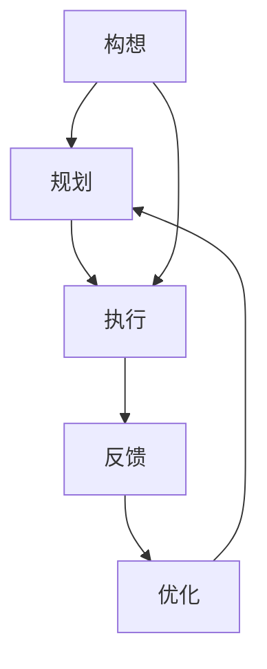

                 

# 行动力:将伟大构想化为现实

## 1. 背景介绍

### 1.1 问题由来

在当今这个快速变化的时代，技术创新正以前所未有的速度塑造着我们的世界。无论是AI、大数据、区块链还是量子计算，每一项伟大的技术构想都需要经过细心的规划、精心的设计和不懈的实践，才能最终转化为现实，并产生实实在在的价值。然而，很多创新项目往往在早期充满激情和理想，但在实际实施过程中却遭遇重重挑战，无法将理论转化为成果。

### 1.2 问题核心关键点

项目成功与否，往往取决于以下几个关键因素：

- **明确的目标**：清晰、具体、可实现的目标是成功的基石。
- **精心的规划**：详细的规划和周密的策略可以指导项目顺利推进。
- **执行的力度**：坚持不懈、持之以恒的执行是实现目标的关键。
- **灵活的应对**：面对变化和挑战，能够迅速调整策略和方法，是成功的重要保障。

在本文中，我们将从这三个方面深入探讨如何将伟大构想转化为现实，特别是如何在执行过程中保持强大的行动力和高效的执行力。

## 2. 核心概念与联系

### 2.1 核心概念概述

- **构想 (Idea)**：项目开始时的设想和规划，是项目的起点。
- **规划 (Plan)**：对构想的具体化和结构化，包括目标、方法、资源、时间安排等。
- **执行 (Execution)**：按照规划将构想变为现实的过程。
- **反馈 (Feedback)**：执行过程中获取的信息和数据，用于评估进展和调整策略。
- **优化 (Optimization)**：基于反馈对规划和执行进行调整和改进，确保目标达成。

### 2.2 核心概念原理和架构的 Mermaid 流程图



## 3. 核心算法原理 & 具体操作步骤

### 3.1 算法原理概述

将伟大构想转化为现实，本质上是一个复杂的多阶段过程，涉及目标设定、规划、执行和优化四个关键环节。这一过程类似于一个循环，每个阶段都需要依赖前一个阶段的结果，并在其后进行反馈和优化。

### 3.2 算法步骤详解

#### 3.2.1 目标设定

**目标设定**是项目成功的第一步，决定了项目的方向和重点。一个好的目标应该具有以下特点：

- **具体明确**：明确指出要达成的具体结果，避免模糊不清。
- **可量化**：设定具体的指标和标准，以便于评估和监控进展。
- **可达性**：目标应当是切实可行的，避免过高或过低的期望。
- **时间限定**：给目标设定一个合理的时间范围，避免无限制的拖沓。

#### 3.2.2 详细规划

**规划**是将目标细化为可执行的步骤和策略的过程。好的规划需要：

- **分解任务**：将大目标分解为具体的、可操作的子任务。
- **分配资源**：明确所需的人力、物力、财力等资源，并制定分配计划。
- **时间安排**：根据任务的复杂度和紧急程度，合理分配时间。
- **风险评估**：识别可能遇到的风险和挑战，并制定应对措施。

#### 3.2.3 执行推进

**执行**是将规划付诸实践的过程。执行阶段需要注意：

- **团队协作**：确保团队成员理解和认同目标和规划，共同努力。
- **灵活调整**：在执行过程中，根据实际情况进行必要的调整和优化。
- **监控进展**：定期检查任务进展情况，确保按时完成。
- **激励机制**：设置合理的激励机制，激发团队成员的积极性。

#### 3.2.4 反馈获取与优化

**反馈**是评估执行效果、进行调整和改进的重要依据。获取反馈的方式包括：

- **内部评估**：通过团队会议、进度报告等方式，了解项目进展和问题。
- **外部评估**：通过客户、用户、市场等外部的反馈，获取客观的评价。
- **数据分析**：通过项目关键指标的数据分析，客观评估进展和效果。

基于反馈，进行优化调整：

- **调整目标**：必要时根据实际情况调整目标和期望。
- **优化流程**：改进执行过程，提高效率和质量。
- **资源调整**：根据需要重新分配资源，确保项目顺利进行。
- **风险应对**：识别新风险，并制定应对策略。

### 3.3 算法优缺点

#### 3.3.1 优点

- **系统性**：通过明确的规划和执行，确保项目有序进行，避免混乱和浪费时间。
- **可控性**：通过设定目标和计划，能够有效控制项目进展和方向。
- **适应性**：通过反馈和优化，能够灵活应对变化和挑战，确保项目顺利完成。

#### 3.3.2 缺点

- **复杂性**：规划和执行过程涉及多个环节，需要细致入微的考虑。
- **灵活性不足**：过于严格的规划可能会限制团队的灵活性，影响创新和应变能力。
- **资源消耗**：规划和执行阶段需要投入大量的时间和资源，增加了项目成本。

### 3.4 算法应用领域

这一方法不仅适用于科技项目，在商业、管理、教育等多个领域都有广泛的应用：

- **项目管理**：在项目管理中，明确目标、规划任务、执行推进、反馈优化是确保项目成功的关键。
- **产品开发**：产品开发过程中，设定明确的产品目标、详细的产品规划、持续的开发执行和及时的反馈优化，是保证产品质量和按时交付的保障。
- **组织变革**：组织变革过程中，需要清晰的目标设定、周密的变革规划、有力的执行推进和及时的反馈优化，才能顺利实现转型。
- **教育培训**：教育培训项目中，明确培训目标、制定详细的培训计划、严格的执行管理和持续的反馈改进，是确保培训效果的关键。

## 4. 数学模型和公式 & 详细讲解 & 举例说明

### 4.1 数学模型构建

我们可以使用一个简单的数学模型来描述项目执行过程：

- **目标函数**：$F_{goal}(x)$，表示项目目标的实现程度，$x$ 为项目执行的相关变量。
- **规划函数**：$F_{plan}(x)$，表示根据目标和资源制定的执行计划。
- **执行函数**：$F_{execute}(x)$，表示按照计划执行后对目标的影响。
- **反馈函数**：$F_{feedback}(x)$，表示在执行过程中获取的反馈信息。
- **优化函数**：$F_{optimize}(x)$，表示根据反馈进行优化后的执行计划。

### 4.2 公式推导过程

假设项目的目标函数为：

$$ F_{goal}(x) = \sum_{i=1}^{n} w_i f_i(x) $$

其中 $f_i(x)$ 为第 $i$ 个关键指标，$w_i$ 为其权重。

项目的规划函数为：

$$ F_{plan}(x) = g_{plan}(F_{goal}(x)) $$

其中 $g_{plan}(x)$ 为规划函数，将目标函数映射为执行计划。

执行函数为：

$$ F_{execute}(x) = g_{execute}(F_{plan}(x)) $$

其中 $g_{execute}(x)$ 为执行函数，根据计划执行后更新目标函数。

反馈函数为：

$$ F_{feedback}(x) = h_{feedback}(F_{execute}(x)) $$

其中 $h_{feedback}(x)$ 为反馈函数，根据执行结果获取反馈信息。

优化函数为：

$$ F_{optimize}(x) = g_{optimize}(F_{goal}(x), F_{feedback}(x)) $$

其中 $g_{optimize}(x)$ 为优化函数，根据反馈信息调整目标函数和执行计划。

### 4.3 案例分析与讲解

假设我们要开发一款新型的AI应用。我们的目标是：

- **功能完备**：应用需要具备预测、分析、推荐等功能。
- **性能稳定**：应用需要具有高并发处理能力和低延迟。
- **用户体验**：应用需要易用、界面友好。
- **市场占有**：应用需要快速获取市场认可。

**目标函数**：

$$ F_{goal}(x) = 0.4f_{功能}(x) + 0.3f_{性能}(x) + 0.2f_{用户体验}(x) + 0.1f_{市场}(x) $$

**规划函数**：

假设我们决定将项目分成四个阶段：需求分析、系统设计、开发实施和测试部署。每个阶段的关键指标和规划函数分别为：

- **需求分析**：$f_{需求}(x) = g_{需求}(f_{市场}(x))$
- **系统设计**：$f_{设计}(x) = g_{设计}(f_{需求}(x), f_{性能}(x), f_{用户体验}(x))$
- **开发实施**：$f_{开发}(x) = g_{开发}(f_{设计}(x))$
- **测试部署**：$f_{测试}(x) = g_{测试}(f_{开发}(x), f_{性能}(x), f_{用户体验}(x))$

**执行函数**：

每个阶段的具体执行计划和方法分别为：

- **需求分析**：市场调研、需求访谈、文档编写
- **系统设计**：功能设计、架构设计、原型开发
- **开发实施**：代码编写、单元测试、功能集成
- **测试部署**：系统测试、性能测试、用户测试

**反馈函数**：

每个阶段执行后获取的反馈信息分别为：

- **需求分析**：用户反馈、需求变更
- **系统设计**：原型测试反馈、架构评审结果
- **开发实施**：代码评审结果、单元测试覆盖率
- **测试部署**：系统负载测试结果、用户满意度调查

**优化函数**：

根据每个阶段的反馈信息，优化目标函数和执行计划。例如：

- **需求分析**：根据用户反馈和需求变更，优化需求文档和设计要求。
- **系统设计**：根据原型测试反馈和架构评审结果，优化设计方案。
- **开发实施**：根据代码评审结果和单元测试覆盖率，优化开发进度和代码质量。
- **测试部署**：根据系统负载测试结果和用户满意度调查，优化测试策略和部署方案。

## 5. 项目实践：代码实例和详细解释说明

### 5.1 开发环境搭建

假设我们使用的是Python和Django框架。搭建开发环境的步骤如下：

1. 安装Python和Django：
```
pip install python django
```

2. 创建Django项目：
```
django-admin startproject myproject
cd myproject
```

3. 创建Django应用：
```
python manage.py startapp myapp
```

4. 设置数据库和配置文件：
```
# settings.py
DATABASES = {
    'default': {
        'ENGINE': 'django.db.backends.sqlite3',
        'NAME': BASE_DIR / 'db.sqlite3',
    }
}
```

### 5.2 源代码详细实现

以下是一个简单的Django应用代码示例：

```python
from django.shortcuts import render
from django.http import HttpResponse

def index(request):
    return render(request, 'index.html', {'message': 'Hello, World!'})

def about(request):
    return HttpResponse('About Us')

def contact(request):
    return render(request, 'contact.html', {'message': 'Contact Us'})
```

### 5.3 代码解读与分析

在上述代码中，我们定义了三个视图函数：

- **index**：渲染主页，显示欢迎消息。
- **about**：显示关于页面内容。
- **contact**：渲染联系页面，显示联系方式。

这些函数通过Django的视图系统，将请求路由到相应的模板中，并渲染输出页面。

### 5.4 运行结果展示

启动开发服务器：

```
python manage.py runserver
```

在浏览器中访问：

- 主页：`http://localhost:8000/`
- 关于：`http://localhost:8000/about/`
- 联系：`http://localhost:8000/contact/`

## 6. 实际应用场景

### 6.1 项目管理

在项目管理中，这一方法可以帮助项目经理：

- **明确目标**：项目目标和里程碑需要清晰明确，并纳入项目计划。
- **详细规划**：通过WBS（工作分解结构）等方法，将大目标细化为具体的任务和活动。
- **执行推进**：通过每日站会、进度报告等方式，确保项目按计划推进。
- **反馈优化**：定期评估项目进展，根据实际情况进行灵活调整和优化。

### 6.2 产品开发

在产品开发过程中，这一方法可以帮助产品经理：

- **设定目标**：明确产品功能、性能、用户体验和市场占有目标。
- **详细规划**：通过敏捷开发、设计评审等方式，确保产品规划和设计方案的可行性和完备性。
- **执行推进**：通过迭代开发、持续集成等方式，确保产品功能的快速迭代和质量提升。
- **反馈优化**：通过用户反馈、市场调研等方式，不断优化产品设计和功能。

### 6.3 组织变革

在组织变革中，这一方法可以帮助变革管理者：

- **明确目标**：明确变革目标和重点，设定具体的变革步骤和时间表。
- **详细规划**：通过变革规划、角色分析等方式，制定详细的变革策略和实施计划。
- **执行推进**：通过变革培训、沟通机制等方式，确保变革顺利推进。
- **反馈优化**：通过员工反馈、绩效评估等方式，持续监控变革进展和效果，进行必要的调整和优化。

### 6.4 教育培训

在教育培训中，这一方法可以帮助培训管理者：

- **设定目标**：明确培训目标和要求，设定具体的培训内容和指标。
- **详细规划**：通过培训计划、课程设计等方式，确保培训内容和方法的可行性和有效性。
- **执行推进**：通过培训实施、考核评估等方式，确保培训效果和质量。
- **反馈优化**：通过学员反馈、培训效果分析等方式，持续优化培训内容和方式。

## 7. 工具和资源推荐

### 7.1 学习资源推荐

- **《敏捷项目管理》**：介绍了敏捷项目管理的基本原理和实践方法，帮助项目经理掌握项目管理的精髓。
- **《项目管理工具和技巧》**：介绍了各种项目管理工具和技巧，帮助项目管理者提高工作效率和项目质量。
- **《Python基础教程》**：适合初学者入门，帮助开发人员掌握Python编程基础。
- **《Django实战》**：适合Django应用开发，详细介绍了Django框架的使用方法和最佳实践。
- **《Scrum敏捷管理》**：介绍了Scrum敏捷管理的理论基础和实践应用，帮助团队管理者提升敏捷项目管理能力。

### 7.2 开发工具推荐

- **GitHub**：代码托管和版本控制平台，方便团队协作和代码管理。
- **JIRA**：项目管理工具，支持敏捷开发、任务管理、进度跟踪等功能。
- **Confluence**：文档协作平台，支持团队知识共享和文档管理。
- **Zoom**：视频会议工具，支持团队沟通和远程协作。
- **Trello**：看板管理工具，支持任务分配、进度跟踪等功能。

### 7.3 相关论文推荐

- **《敏捷软件开发：原则、模式与实践》**：介绍敏捷开发的基本原理和实践方法。
- **《项目管理与信息系统》**：介绍项目管理的基本理论和方法，适合项目管理者阅读。
- **《Scrum敏捷管理：敏捷开发原则实践》**：详细介绍Scrum敏捷管理的实践方法和案例分析。
- **《Django Web开发》**：详细介绍Django框架的使用方法和最佳实践。

## 8. 总结：未来发展趋势与挑战

### 8.1 研究成果总结

本文从目标设定、详细规划、执行推进和反馈优化四个方面，介绍了将伟大构想转化为现实的方法。通过系统性的方法和工具，能够有效提升项目的成功率和效率。

### 8.2 未来发展趋势

未来，项目管理方法和技术将继续发展和演变，呈现以下几个趋势：

- **自动化和智能化**：越来越多的项目管理工具将采用AI和机器学习技术，实现自动化任务分配、进度跟踪、风险预警等功能。
- **可视化管理**：项目管理平台将更加注重可视化管理，通过图表、看板等方式直观展示项目进展和问题。
- **协作和沟通**：项目管理将更加注重团队协作和沟通，通过实时沟通工具、协作平台等方式提升团队效率。
- **远程和分布式管理**：随着远程办公和分布式团队的普及，项目管理也将更加注重远程协作和分布式管理。

### 8.3 面临的挑战

尽管项目管理方法不断发展，但在实际应用中仍面临诸多挑战：

- **复杂度增加**：项目规模和复杂度不断增加，对项目管理的精细化要求越来越高。
- **资源紧张**：人力资源、财务资源、技术资源等资源紧张，需要更加高效的资源配置和管理。
- **变化频繁**：市场需求和技术发展变化频繁，需要项目管理者具备较强的适应性和灵活性。
- **沟通困难**：跨部门、跨地域的沟通协作难度大，需要更加高效和透明的沟通机制。

### 8.4 研究展望

未来的项目管理研究，可以从以下几个方向进行探索：

- **智能化项目管理**：通过AI和机器学习技术，实现项目管理的自动化和智能化。
- **协作项目管理**：通过协作平台和沟通工具，提升团队协作效率和沟通效果。
- **远程项目管理**：通过远程协作和管理工具，支持远程办公和分布式团队。
- **跨领域项目管理**：通过跨领域项目管理的理论和实践，提升项目管理的应用范围和效果。

## 9. 附录：常见问题与解答

**Q1: 如何设定明确的项目目标？**

A: 设定明确的项目目标需要以下步骤：

1. **明确项目愿景**：了解项目的背景、目的和价值。
2. **识别关键成功因素**：识别项目成功的关键指标和要求。
3. **设定具体目标**：将关键成功因素转化为具体的、可量化的目标。
4. **分解任务**：将大目标分解为具体的、可操作的子目标。

**Q2: 如何有效管理项目风险？**

A: 有效管理项目风险需要以下步骤：

1. **风险识别**：通过风险评估工具和方法，识别项目中可能遇到的风险和挑战。
2. **风险评估**：评估风险的可能性和影响程度，制定应对策略。
3. **风险监控**：在项目实施过程中，持续监控风险变化，及时调整应对策略。
4. **风险应对**：制定具体的风险应对计划，减少风险对项目的影响。

**Q3: 如何提升团队协作效率？**

A: 提升团队协作效率需要以下步骤：

1. **明确职责和分工**：确保每个团队成员了解自己的职责和任务。
2. **建立沟通机制**：建立高效的沟通渠道和机制，确保信息流畅传递。
3. **使用协作工具**：采用协作平台和工具，如JIRA、Trello等，提升协作效率。
4. **定期沟通和反馈**：定期召开会议，进行项目进展和问题反馈。

**Q4: 如何优化项目资源配置？**

A: 优化项目资源配置需要以下步骤：

1. **资源评估**：评估项目所需的各种资源，包括人力、物力、财力等。
2. **优先级排序**：根据项目目标和需求，确定资源优先级。
3. **动态调整**：根据项目进展和变化，动态调整资源配置。
4. **资源监控**：实时监控资源使用情况，确保资源高效利用。

**Q5: 如何应对项目变化和挑战？**

A: 应对项目变化和挑战需要以下步骤：

1. **灵活调整计划**：根据项目变化，灵活调整项目计划和目标。
2. **迅速响应变化**：及时识别和应对项目变化，减少影响和损失。
3. **强化风险管理**：制定和执行风险管理计划，降低风险对项目的影响。
4. **提升团队韧性**：增强团队应对变化和挑战的能力，提升项目韧性。

---

作者：禅与计算机程序设计艺术 / Zen and the Art of Computer Programming

