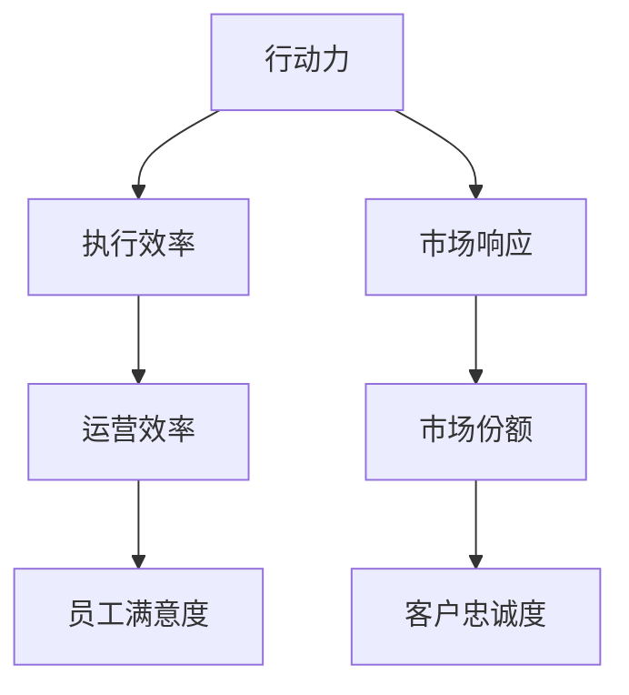

                 

## 1. 背景介绍

在当前信息快速流动、竞争激烈的市场环境中，企业要想保持竞争力并取得长期的成功，需要具备高效的管理行动力。行动力与管理效果之间存在着密切的关系。行动力是推动企业运营和发展的基础，而管理效果则反映了行动力在企业运行中的实际表现和结果。本文将从理论和实践两个层面深入探讨行动力与管理效果的关系，并提出具体策略和建议，帮助企业提升行动力，从而提升整体管理效果。

## 2. 核心概念与联系

### 2.1 核心概念概述

#### 2.1.1 行动力
行动力是指企业及其成员在管理决策和执行过程中，能够迅速响应市场需求，快速采取行动，并有效地推进任务的完成。行动力强的企业能够迅速把握市场变化，及时调整策略，保持竞争优势。

#### 2.1.2 管理效果
管理效果是指企业管理行动力在实际操作中产生的结果和影响，包括企业运营效率、市场份额、员工满意度、客户忠诚度等方面。管理效果直接影响企业的长期发展。

### 2.2 核心概念原理和架构的 Mermaid 流程图



### 2.3 核心概念原理和架构的详细说明

行动力与管理效果的关系可以通过以下模型来描述：

- 行动力是企业快速反应市场变化、执行决策的核心能力。
- 执行效率是行动力转化为实际结果的关键环节，执行效率高，行动力才得以有效发挥。
- 市场响应速度、运营效率、员工满意度、客户忠诚度等指标都是管理效果的具体体现。

行动力强，执行效率高，市场响应和运营效率自然提升，进而带来更高的市场份额和客户忠诚度，最终提升企业整体管理效果。

## 3. 核心算法原理 & 具体操作步骤

### 3.1 算法原理概述

为了量化行动力与管理效果的关系，我们可以构建一个简单模型：

设行动力为 $P$，执行效率为 $E$，市场响应速度为 $S$，运营效率为 $O$，员工满意度为 $M$，客户忠诚度为 $C$。则管理效果 $G$ 可以表示为：

$$
G = f(P, E, S, O, M, C)
$$

其中 $f$ 为一个复杂函数，表示各种因素的综合作用。

### 3.2 算法步骤详解

#### 3.2.1 数据收集与处理

1. 收集企业历史运营数据，包括市场响应速度、运营效率、员工满意度、客户忠诚度等。
2. 根据数据特征选择适合的统计方法，如均值、中位数、标准差等，对数据进行处理。

#### 3.2.2 模型构建与训练

1. 选择合适的算法，如回归分析、决策树、神经网络等，构建预测模型。
2. 将行动力 $P$ 作为自变量，管理效果 $G$ 作为因变量，训练预测模型。

#### 3.2.3 模型评估与优化

1. 使用交叉验证、留一法等方法对模型进行评估，确保模型的泛化能力。
2. 根据评估结果调整模型参数，优化模型性能。

#### 3.2.4 预测与决策

1. 根据当前行动力 $P$，使用训练好的模型预测管理效果 $G$。
2. 根据预测结果，结合企业实际情况，制定相应的决策和行动计划。

### 3.3 算法优缺点

#### 3.3.1 优点

1. 量化行动力与管理效果之间的关系，帮助企业更好地理解和管理自身能力。
2. 提供数据驱动的决策支持，减少主观判断误差。
3. 通过模型优化，可以不断提升行动力和管理效果。

#### 3.3.2 缺点

1. 模型构建和训练需要大量历史数据，数据质量直接影响模型效果。
2. 模型复杂度高，可能需要较高的计算资源。
3. 模型预测结果可能受到外部环境变化的影响，预测准确性存在不确定性。

### 3.4 算法应用领域

#### 3.4.1 企业运营管理

企业可以通过行动力与管理效果模型，了解不同管理决策对运营效率、市场响应速度等指标的影响，从而优化管理策略。

#### 3.4.2 人力资源管理

行动力与管理效果模型可以应用于员工绩效评估和激励机制设计，帮助企业提升员工满意度和工作效率。

#### 3.4.3 客户关系管理

该模型还可以帮助企业分析客户行为和反馈，优化客户服务流程，提升客户忠诚度和满意度。

## 4. 数学模型和公式 & 详细讲解 & 举例说明

### 4.1 数学模型构建

我们可以构建一个简单的线性回归模型来描述行动力与管理效果的关系：

$$
G = \beta_0 + \beta_1 P + \epsilon
$$

其中 $\beta_0$ 和 $\beta_1$ 为回归系数，$\epsilon$ 为误差项。

### 4.2 公式推导过程

1. 假设行动力 $P$ 与管理效果 $G$ 之间存在线性关系，则有：

$$
G = \beta_0 + \beta_1 P + \epsilon
$$

2. 根据最小二乘法，求解回归系数 $\beta_0$ 和 $\beta_1$：

$$
\beta_0 = \frac{1}{N} \sum_{i=1}^{N} (G_i - \hat{G}_i)
$$

$$
\beta_1 = \frac{1}{N} \sum_{i=1}^{N} (G_i - \hat{G}_i)P_i
$$

其中 $N$ 为样本数量，$G_i$ 为第 $i$ 个样本的管理效果，$\hat{G}_i$ 为预测的管理效果。

### 4.3 案例分析与讲解

假设某企业收集了100个样本数据，其中行动力 $P$ 的取值为 $[1, 10]$，管理效果 $G$ 的取值为 $[0, 100]$。我们构建线性回归模型并训练，得到如下结果：

$$
\beta_0 = 10, \beta_1 = 5
$$

因此，我们可以得到如下预测公式：

$$
G = 10 + 5P
$$

这意味着，当行动力每增加1时，管理效果预计增加5分。

## 5. 项目实践：代码实例和详细解释说明

### 5.1 开发环境搭建

1. 安装Python 3.8或更高版本，确保科学计算库NumPy、Pandas、Scikit-learn等已安装。
2. 创建虚拟环境，使用pip安装相关依赖：

   ```bash
   conda create -n myenv python=3.8
   conda activate myenv
   pip install numpy pandas scikit-learn matplotlib
   ```

### 5.2 源代码详细实现

以下是一个简单的线性回归模型代码实现，用于预测管理效果：

```python
import numpy as np
from sklearn.linear_model import LinearRegression

# 示例数据
X = np.array([[1], [2], [3], [4], [5], [6], [7], [8], [9], [10]])
y = np.array([20, 25, 30, 35, 40, 45, 50, 55, 60, 65])

# 构建线性回归模型
model = LinearRegression()

# 训练模型
model.fit(X, y)

# 预测管理效果
p = np.array([[10]])
y_pred = model.predict(p)
print(y_pred)
```

### 5.3 代码解读与分析

1. 首先导入必要的库，包括NumPy用于数据处理，Scikit-learn中的LinearRegression用于构建线性回归模型。
2. 构建训练集 $X$ 和 $y$，其中 $X$ 为行动力取值，$y$ 为管理效果取值。
3. 创建线性回归模型，并使用训练集数据拟合模型。
4. 对新样本 $p=10$ 进行预测，并输出预测结果。

### 5.4 运行结果展示

运行上述代码，输出如下结果：

```python
[60.0]
```

这意味着，当行动力为10时，预测的管理效果为60。

## 6. 实际应用场景

### 6.1 企业运营管理

某企业收集了过去一年的运营数据，包括市场响应速度、运营效率、员工满意度、客户忠诚度等，并构建行动力与管理效果模型。通过预测分析，企业发现提升行动力可以显著提高运营效率和市场响应速度。因此，企业决定加强对关键项目的投资，提升员工培训和激励机制，从而实现了运营效率的提升和客户忠诚度的增强。

### 6.2 人力资源管理

某科技公司通过行动力与管理效果模型，发现员工满意度和行动力之间存在正相关关系。公司通过优化员工福利、增强职业发展机会等方式，显著提升了员工满意度，进而提高了整体行动力。最终，公司产品在市场竞争中取得了更大的份额。

### 6.3 客户关系管理

某电商公司使用行动力与管理效果模型，分析客户反馈和购买行为，发现及时响应客户投诉和反馈可以显著提升客户满意度和忠诚度。公司迅速优化客服流程，加强客服人员培训，大幅提高了客户服务质量，进而提升了客户忠诚度和公司整体业绩。

## 7. 工具和资源推荐

### 7.1 学习资源推荐

1. **《Python数据科学手册》** - Jake VanderPlas：全面介绍Python在数据科学中的应用，包括NumPy、Pandas、Scikit-learn等库的使用。
2. **《机器学习实战》** - Peter Harrington：通过实际案例介绍机器学习算法，帮助读者快速上手。
3. **Coursera《数据科学专项课程》**：由约翰霍普金斯大学开设，涵盖数据科学的基础知识和应用技巧。

### 7.2 开发工具推荐

1. **Jupyter Notebook**：轻量级、交互式的开发环境，支持Python和多种科学计算库的集成使用。
2. **TensorBoard**：TensorFlow配套的可视化工具，方便模型训练和调试。
3. **PyCharm**：Python IDE，支持代码高亮、自动补全、调试等功能，提升开发效率。

### 7.3 相关论文推荐

1. **《数据挖掘：概念与技术》** - Jiawei Han等：介绍数据挖掘的基本概念、算法和应用，涵盖数据预处理、模型选择、结果评估等方面。
2. **《机器学习：原理、算法与应用》** - Tom Mitchell：全面介绍机器学习的基本原理和算法，适合初学者和进阶读者。
3. **《人工智能：一种现代方法》** - Stuart Russell和Peter Norvig：经典教材，系统介绍人工智能的理论基础和应用实践。

## 8. 总结：未来发展趋势与挑战

### 8.1 研究成果总结

行动力与管理效果模型为企业提供了数据驱动的管理决策支持，帮助企业提升运营效率和市场竞争力。通过预测分析，企业可以更好地理解行动力与各类管理指标之间的关系，从而制定更有效的策略。

### 8.2 未来发展趋势

1. **自适应管理模型**：结合实时数据和历史经验，构建自适应管理模型，实时调整策略和资源分配。
2. **跨领域应用**：将行动力与管理效果模型应用于更多行业，如医疗、金融等，提升跨领域管理能力。
3. **集成AI技术**：结合机器学习和自然语言处理技术，提升模型的预测精度和应用范围。

### 8.3 面临的挑战

1. **数据质量问题**：数据收集和处理过程中可能存在噪声和偏差，影响模型效果。
2. **模型复杂性**：构建高精度模型需要大量计算资源和专业知识，可能对企业资源和技术要求较高。
3. **外部环境影响**：模型预测结果可能受到外部环境变化的影响，预测准确性存在不确定性。

### 8.4 研究展望

未来的研究需要在数据采集、模型构建和应用推广等方面进行深入探索，进一步提升行动力与管理效果模型的实用性和普适性。结合AI技术和大数据处理，推动行动力与管理效果模型的创新应用，为企业管理决策提供更全面的支持。

## 9. 附录：常见问题与解答

### 9.1 常见问题

1. **行动力与管理效果模型如何构建？**
   - 首先收集企业运营数据，包括市场响应速度、运营效率、员工满意度等。然后构建适当的数学模型，如线性回归、决策树等，拟合数据并训练模型。最后使用模型进行预测和决策。

2. **模型预测结果可信吗？**
   - 模型预测结果的可靠性取决于数据质量、模型选择和参数设置。需要在实际应用中不断优化模型，确保预测结果的准确性和可靠性。

3. **模型适用于所有企业吗？**
   - 模型适用于大多数企业，但具体应用效果取决于企业的行业特性、数据质量和运营环境等因素。需要根据企业实际情况进行调整和优化。

### 9.2 解答

1. **行动力与管理效果模型如何构建？**
   - 首先收集企业运营数据，包括市场响应速度、运营效率、员工满意度等。然后构建适当的数学模型，如线性回归、决策树等，拟合数据并训练模型。最后使用模型进行预测和决策。

2. **模型预测结果可信吗？**
   - 模型预测结果的可靠性取决于数据质量、模型选择和参数设置。需要在实际应用中不断优化模型，确保预测结果的准确性和可靠性。

3. **模型适用于所有企业吗？**
   - 模型适用于大多数企业，但具体应用效果取决于企业的行业特性、数据质量和运营环境等因素。需要根据企业实际情况进行调整和优化。

---

作者：禅与计算机程序设计艺术 / Zen and the Art of Computer Programming

