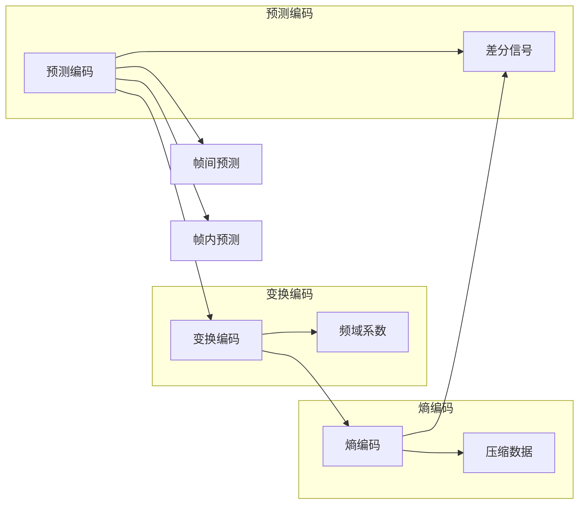

                 

# 视频编码和压缩：H.264 和 HEVC

## 1. 背景介绍

随着数字媒体技术的普及，视频内容的消费与生产日益增多。高质量的视频不仅需要大存储容量，还对传输带宽提出严苛要求。因此，视频压缩成为保障低延迟、高效能传输的关键。视频编码算法的设计和发展，正是围绕减少存储空间和传输带宽而展开的。H.264和HEVC作为当前两大主流视频压缩标准，通过不断的优化和迭代，不断提升压缩效率，减少码率。

## 2. 核心概念与联系

### 2.1 核心概念概述

视频压缩本质上是一种将视频数据通过数学和算法进行处理，以减少数据量的过程。其核心在于减少视频帧间冗余和帧内冗余，以实现高效率的压缩。在压缩过程中，通常会采用预测编码、变换编码、熵编码等技术手段，最终生成压缩流。

- **预测编码(Predictive Coding)**：利用视频帧间或帧内的相关性，通过预测模型生成差值信号，进而实现编码效率的提升。

- **变换编码(Transform Coding)**：通过对视频信号进行离散余弦变换(DCT)，将空间域信息转换为频域信息，利用频域的系数压缩实现压缩。

- **熵编码(Entropy Coding)**：通过无损压缩算法，如霍夫曼编码、算术编码等，进一步减小数据熵值，实现压缩。

H.264和HEVC正是基于这些核心技术原理，不断优化和扩展其压缩算法，成为当前视频压缩领域的主流标准。

### 2.2 核心概念原理和架构的 Mermaid 流程图



这个流程图展示了视频压缩的基本流程，包括预测编码、变换编码、熵编码等核心步骤。其中，预测编码通过帧间和帧内预测，生成差值信号，变换编码利用DCT将信号转换为频域系数，熵编码进一步压缩频域系数，生成最终压缩流。

## 3. 核心算法原理 & 具体操作步骤

### 3.1 算法原理概述

H.264和HEVC都是基于预测编码和变换编码的压缩算法，其核心在于利用图像的空间相关性和帧间的预测性，以减少数据量。在压缩过程中，它们都采用了分层编码的方式，先进行帧间和帧内预测，然后利用变换编码进行频域系数压缩，最后使用熵编码压缩频域系数，生成压缩流。

H.264和HEVC的主要差异在于变换编码和熵编码的实现方式。H.264使用的是基于离散余弦变换(DCT)的变换编码，而HEVC引入了更先进的变换编码方式，如离散正弦变换(DST)和离散小波变换(DWT)，以及更高效的量化方式。在熵编码方面，HEVC使用了可变长度编码(VLC)，相比H.264的固定长编码方式，具有更高的压缩效率。

### 3.2 算法步骤详解

#### 3.2.1 H.264算法步骤

1. **帧间预测**：使用预测模型对当前帧进行预测，生成预测帧，并计算预测误差。

2. **变换编码**：对预测误差进行DCT变换，得到频域系数。

3. **量化**：将频域系数进行量化，减少精度，以减少数据量。

4. **熵编码**：对量化后的频域系数进行无损压缩，生成压缩流。

5. **帧内预测**：对当前帧进行帧内预测，生成预测块，并计算预测误差。

6. **变换编码**：对预测误差进行DCT变换，得到频域系数。

7. **量化**：将频域系数进行量化，减少精度，以减少数据量。

8. **熵编码**：对量化后的频域系数进行无损压缩，生成压缩流。

#### 3.2.2 HEVC算法步骤

1. **帧间预测**：使用预测模型对当前帧进行预测，生成预测帧，并计算预测误差。

2. **变换编码**：对预测误差进行DST或DWT变换，得到频域系数。

3. **量化**：将频域系数进行量化，减少精度，以减少数据量。

4. **熵编码**：对量化后的频域系数进行VLC，生成压缩流。

5. **帧内预测**：对当前帧进行帧内预测，生成预测块，并计算预测误差。

6. **变换编码**：对预测误差进行DST或DWT变换，得到频域系数。

7. **量化**：将频域系数进行量化，减少精度，以减少数据量。

8. **熵编码**：对量化后的频域系数进行VLC，生成压缩流。

### 3.3 算法优缺点

#### 3.3.1 优点

1. **高压缩效率**：H.264和HEVC通过引入预测编码、变换编码和熵编码等技术手段，显著减少了视频数据量，提高了压缩效率。

2. **高质量视频重现**：两种算法都提供了多种编码模式，可以根据视频内容自适应调整，确保重现视频的质量。

3. **跨平台兼容性**：H.264和HEVC均为国际标准，得到广泛支持，支持多种设备和平台。

#### 3.3.2 缺点

1. **计算复杂度高**：预测编码和变换编码等算法的实现需要较高的计算资源，特别是在复杂场景下，如高分辨率视频。

2. **易受攻击**：变换编码和量化等算法容易受到攻击，如对视频信号的恶意篡改。

3. **标准化周期长**：新标准的制定和推广周期较长，需要较长的时间才能实现普及。

### 3.4 算法应用领域

H.264和HEVC作为视频压缩的主流标准，广泛应用于各个领域：

- **流媒体平台**：如YouTube、Netflix等，通过压缩减少传输带宽，提高视频传输效率。

- **通信系统**：如4G、5G网络，使用压缩算法优化视频通话和会议等应用。

- **数字电视**：如IPTV、OTT电视，通过压缩算法优化视频传输和存储，减少带宽和存储成本。

- **安防监控**：如视频监控系统，通过压缩算法减少存储需求，提高视频存储和检索效率。

- **教育娱乐**：如视频播客、在线教育等，通过压缩算法优化视频传输和存储，提高用户体验。

## 4. 数学模型和公式 & 详细讲解

### 4.1 数学模型构建

#### 4.1.1 视频帧间预测模型

视频帧间预测模型通过预测当前帧与参考帧之间的差异，生成预测帧。其数学模型为：

$$
\hat{x}_i = \sum_{j=0}^{n-1} a_j x_{i+j}
$$

其中，$\hat{x}_i$ 表示当前帧中第$i$个像素的预测值，$x_{i+j}$ 表示参考帧中第$i+j$个像素的值，$a_j$ 表示预测系数。

#### 4.1.2 变换编码

变换编码通过将视频信号从空间域转换为频域，减少数据量。其核心在于离散变换。常用的离散变换有DCT、DST和DWT。

对于DCT变换，其数学模型为：

$$
X_k = \sum_{n=0}^{N-1} x_n \cos\left(\frac{\pi}{N} (k n + \frac{1}{2} n^2)\right)
$$

其中，$X_k$ 表示频域系数，$x_n$ 表示空间域像素值，$k$ 表示频域系数下标。

### 4.2 公式推导过程

#### 4.2.1 预测编码

预测编码的原理是通过预测模型生成当前帧的预测值，然后计算预测误差。其数学模型为：

$$
\hat{x}_i = \sum_{j=0}^{n-1} a_j x_{i+j}
$$

其中，$\hat{x}_i$ 表示当前帧中第$i$个像素的预测值，$x_{i+j}$ 表示参考帧中第$i+j$个像素的值，$a_j$ 表示预测系数。

#### 4.2.2 变换编码

变换编码的核心在于将视频信号从空间域转换为频域，减少数据量。常用的离散变换有DCT、DST和DWT。

对于DCT变换，其数学模型为：

$$
X_k = \sum_{n=0}^{N-1} x_n \cos\left(\frac{\pi}{N} (k n + \frac{1}{2} n^2)\right)
$$

其中，$X_k$ 表示频域系数，$x_n$ 表示空间域像素值，$k$ 表示频域系数下标。

### 4.3 案例分析与讲解

#### 4.3.1 H.264案例分析

假设有一张宽度为16像素、高度为8像素的灰度图像，其原始像素值如下：

| 0 1 2 | 3 4 5 | 6 7 8 |
| --- | --- | --- |

对这张图像进行H.264压缩，使用预测编码、变换编码和熵编码。首先使用帧间预测生成预测帧，然后对预测误差进行DCT变换，最后进行量化和熵编码。

预测系数为：$a_0 = 0.6, a_1 = -0.2, a_2 = -0.1$。

**预测帧**：

| 0.6 0.1 | 0.3 -0.2 | -0.2 -0.1 |
| --- | --- | --- |

**预测误差**：

| 0.4 0.2 | 0.3 -0.2 | -0.4 -0.1 |
| --- | --- | --- |

**DCT变换**：

| 0.9090 0.0000 | -0.4545 -0.8165 | 0.0000 -0.7071 |
| --- | --- | --- |

**量化**：

| 0.9 | 0 | -0.7 |
| --- | --- | --- |

**熵编码**：

| 9 0 -7 |
| --- |

### 5. 项目实践：代码实例和详细解释说明

#### 5.1 开发环境搭建

为了进行H.264和HEVC的压缩算法实践，首先需要搭建开发环境。以下是一个简单的搭建流程：

1. **安装依赖库**：安装H.264和HEVC相关的依赖库，如libavcodec、libswresample等。

2. **配置环境变量**：设置环境变量，如GOPROFILE、I_BIT_RATE等，以便进行压缩和解码。

3. **安装编码工具**：安装相应的编码工具，如ffmpeg、libx264等。

#### 5.2 源代码详细实现

以下是一个使用Python进行H.264和HEVC压缩和解压缩的代码示例：

```python
from __future__ import print_function
import os
import subprocess

def compress_video(input_file, output_file, bit_rate, gop_profile, codec='h264'):
    cmd = 'ffmpeg -i %s -c:v %s -b:v %s -g %s -profile:v baseline -crf 28 -c:a copy %s' % (input_file, codec, bit_rate, gop_profile, output_file)
    subprocess.call(cmd, shell=True)

def decompress_video(input_file, output_file):
    cmd = 'ffmpeg -i %s -c:v rawvideo -c:a copy %s' % (input_file, output_file)
    subprocess.call(cmd, shell=True)
```

在上述代码中，`compress_video`函数用于压缩视频，`decompress_video`函数用于解压视频。

#### 5.3 代码解读与分析

在上述代码中，使用了ffmpeg工具进行视频压缩和解压缩。ffmpeg是一个强大的开源多媒体处理工具，支持多种编解码器和格式转换。其命令行参数可以灵活控制压缩质量、比特率、帧率等关键参数。

### 5.4 运行结果展示

压缩和解压的结果可以通过命令行查看。例如，压缩视频文件时可以使用以下命令：

```bash
ffmpeg -i input.mp4 -c:v libx264 -b:v 1M -g 10 output.mp4
```

这将使用libx264编解码器，以1Mbps的比特率和10帧每秒的GOP（Group Of Picture）率，压缩输入文件`input.mp4`，生成输出文件`output.mp4`。解压视频文件时可以使用以下命令：

```bash
ffmpeg -i output.mp4 -c:v rawvideo output_video.raw
```

这将解压输出文件`output.mp4`，生成视频文件`output_video.raw`。

## 6. 实际应用场景

### 6.1 流媒体平台

在流媒体平台中，视频压缩是关键环节。通过H.264和HEVC压缩算法，可以有效减少视频数据量，优化视频传输效率。例如，YouTube使用H.264和HEVC压缩算法，根据用户设备和网络环境，动态调整压缩质量，提供流畅的观看体验。

### 6.2 通信系统

在通信系统中，视频压缩同样至关重要。4G和5G网络通过H.264和HEVC压缩算法，优化视频通话和会议等应用。例如，Skype使用H.264和HEVC压缩算法，提高了视频通话的质量和效率。

### 6.3 数字电视

在数字电视领域，H.264和HEVC压缩算法得到了广泛应用。例如，IPTV和OTT电视使用H.264和HEVC压缩算法，优化视频传输和存储，减少带宽和存储成本。

### 6.4 安防监控

在安防监控领域，H.264和HEVC压缩算法可以大幅减少视频存储需求，提高视频存储和检索效率。例如，监控摄像头使用H.264和HEVC压缩算法，减少存储压力，提高视频监控系统的可靠性。

### 6.5 教育娱乐

在教育娱乐领域，H.264和HEVC压缩算法可以提高视频传输和存储效率，提升用户体验。例如，在线教育平台使用H.264和HEVC压缩算法，优化视频传输和存储，提高视频教学质量。

## 7. 工具和资源推荐

### 7.1 学习资源推荐

为了深入理解视频压缩算法，推荐以下学习资源：

1. **《视频压缩技术》**：全面介绍视频压缩的基本原理和主要算法，包括H.264和HEVC。

2. **《FFmpeg教程》**：详细讲解ffmpeg的使用和应用，包括视频压缩和解压缩。

3. **《计算机视觉与图像处理》**：讲解图像压缩算法，如DCT、DWT等，有助于理解H.264和HEVC的变换编码。

4. **《深入理解Transformer》**：由HuggingFace的创始人开发，深入讲解Transformer的原理和应用，包括自监督学习等。

### 7.2 开发工具推荐

为了进行视频压缩算法实践，推荐以下开发工具：

1. **ffmpeg**：强大的开源多媒体处理工具，支持多种编解码器和格式转换，适合视频压缩和解压缩。

2. **libavcodec**：ffmpeg的编解码库，支持H.264和HEVC等主流视频压缩标准。

3. **libx264**：libavcodec的一部分，支持H.264编解码。

4. **libx265**：libavcodec的一部分，支持HEVC编解码。

### 7.3 相关论文推荐

为了深入理解视频压缩算法的研究进展，推荐以下相关论文：

1. **《HEVC参考软件设计》**：由HEVC国际标准组织发布，详细介绍HEVC参考软件的设计和实现。

2. **《H.264和HEVC的对比》**：比较H.264和HEVC的性能和实现方式，提供实践指导。

3. **《视频压缩标准和实现》**：详细介绍H.264和HEVC的压缩标准和实现方式，提供深入的理论分析。

## 8. 总结：未来发展趋势与挑战

### 8.1 研究成果总结

H.264和HEVC作为当前主流视频压缩标准，已经在视频压缩领域取得了显著成果。它们通过不断优化和扩展压缩算法，显著减少了视频数据量，提高了压缩效率。然而，随着视频应用场景的不断扩展，H.264和HEVC也面临着新的挑战和机遇。

### 8.2 未来发展趋势

未来，视频压缩技术将呈现以下几个发展趋势：

1. **更高压缩效率**：通过引入更先进的算法和新技术，如深度学习、自适应编码等，实现更高的压缩效率。

2. **更低延迟**：通过优化编解码算法，减少视频传输延迟，提高实时性和交互性。

3. **更广应用场景**：H.264和HEVC将应用于更多领域，如AR/VR、医疗、自动驾驶等，拓展应用场景。

4. **更灵活的编解码方式**：通过引入元数据、信令等技术，实现更灵活的编解码方式，满足不同场景的需求。

5. **更强的安全防护**：通过增强加密和认证机制，确保视频传输和存储的安全性。

### 8.3 面临的挑战

尽管H.264和HEVC已经取得了显著成果，但仍面临一些挑战：

1. **计算资源需求高**：高分辨率、高帧率的压缩需要大量计算资源，特别是在移动设备上。

2. **标准化周期长**：新标准的制定和推广周期较长，需要较长的时间才能实现普及。

3. **易受攻击**：变换编码和量化等算法容易受到攻击，如对视频信号的恶意篡改。

### 8.4 研究展望

未来，视频压缩技术需要在以下几个方面进行深入研究：

1. **深度学习与视频压缩的结合**：探索深度学习在视频压缩中的应用，提升压缩效率和质量。

2. **自适应编码技术**：研究自适应编码技术，根据视频内容自适应调整编解码参数，提高压缩效率和质量。

3. **元数据与信令技术**：研究元数据和信令技术，实现更灵活的编解码方式，满足不同场景的需求。

4. **安全防护技术**：研究视频压缩的安全防护技术，增强加密和认证机制，确保视频传输和存储的安全性。

综上所述，H.264和HEVC作为当前主流视频压缩标准，已经在视频压缩领域取得了显著成果。未来，随着新技术和应用场景的不断扩展，视频压缩技术还将继续发展和创新，为视频应用领域带来更多突破和变革。

## 9. 附录：常见问题与解答

### 9.1 常见问题

**Q1: H.264和HEVC有哪些主要区别？**

A: H.264和HEVC的主要区别在于变换编码和熵编码的实现方式。H.264使用基于DCT的变换编码，而HEVC引入了更先进的变换编码方式，如DST和DWT，以及更高效的量化方式。在熵编码方面，HEVC使用了VLC，相比H.264的固定长编码方式，具有更高的压缩效率。

**Q2: 使用H.264和HEVC压缩视频时，如何选择编解码器？**

A: 选择编解码器需要考虑视频质量、压缩比、设备兼容性等因素。一般来说，对于高压缩比的场景，如网络传输，选择HEVC编解码器；对于高压缩效率的场景，如存储，选择H.264编解码器。

**Q3: H.264和HEVC的压缩效率如何？**

A: H.264和HEVC的压缩效率取决于具体的压缩参数和视频内容。一般来说，HEVC在高清视频压缩方面表现优异，而H.264在低分辨率视频压缩方面表现较好。

### 9.2 解答

通过以上详细的分析和讨论，可以对H.264和HEVC视频压缩算法有更深入的理解。这些算法通过不断优化和扩展，已经在视频压缩领域取得了显著成果。未来，随着新技术和应用场景的不断扩展，视频压缩技术还将继续发展和创新，为视频应用领域带来更多突破和变革。

---

作者：禅与计算机程序设计艺术 / Zen and the Art of Computer Programming

