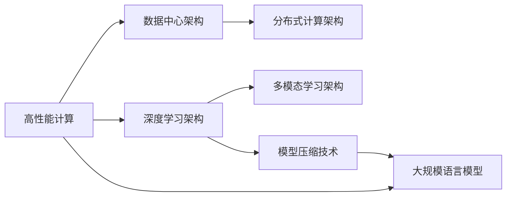

                 

# 计算机架构的新纪元：LLM的崛起

## 1. 背景介绍

### 1.1 问题由来

随着计算机技术的飞速发展，大规模语言模型（Large Language Models，简称LLM）逐渐成为推动计算架构发展的重要力量。LLM不仅在自然语言处理（NLP）领域取得了显著的进展，还在生成文本、理解语义、辅助决策等领域展现出了强大的潜力。其背后支撑的深度学习架构，已不再是单一的技术或理论，而是逐渐形成了一套系统的架构体系，对计算机科学领域产生了深远影响。

### 1.2 问题核心关键点

LLM的崛起主要体现在以下几个方面：

- **架构演进**：从最早的神经网络到深度学习，再到如今的多模态、多层次的架构，LLM的演进推动了计算机架构的不断创新。
- **计算需求**：LLM的高计算需求催生了高性能计算体系，如GPU、TPU等加速器的发展，促进了数据中心架构的升级。
- **数据需求**：大量的训练数据和高效的模型压缩技术，对数据存储和传输架构提出了新的挑战。
- **分布式计算**：复杂的训练过程和庞大的模型规模，需要高效的分布式计算架构来支持。

这些关键点共同推动了计算机架构向着更加高效、灵活、可扩展的方向发展。

## 2. 核心概念与联系

### 2.1 核心概念概述

为更好地理解LLM架构，我们先简要介绍几个核心概念：

- **深度学习架构**：基于神经网络的架构，通过多层次的抽象与学习，提取数据的高级特征。
- **高性能计算（HPC）**：指使用高性能计算机体系结构（如GPU、TPU）加速计算任务的执行。
- **数据中心架构**：包含数据存储、网络、计算等多方面的硬件和软件设计，支持大规模数据处理。
- **分布式计算架构**：通过多台计算机协同工作，实现并行计算和负载均衡，提高计算效率。
- **多模态学习架构**：融合视觉、语音、文本等多种模态数据，构建更加全面和智能的模型。
- **模型压缩技术**：通过剪枝、量化、知识蒸馏等方法，减小模型规模，提高推理效率。

这些概念之间存在紧密联系，共同构成了LLM架构的基础。

### 2.2 核心概念原理和架构的 Mermaid 流程图



该图展示了LLM架构的基本构成及其与其他概念的联系。高性能计算为LLM提供了强大的计算能力，数据中心架构和分布式计算架构提供了高效的存储和计算资源，多模态学习架构和模型压缩技术提升了LLM的性能和效率。

## 3. 核心算法原理 & 具体操作步骤

### 3.1 算法原理概述

LLM的核心算法包括深度学习算法、分布式训练算法和模型压缩算法等。以下是这些算法的概述：

- **深度学习算法**：如卷积神经网络（CNN）、循环神经网络（RNN）、长短期记忆网络（LSTM）、Transformer等，通过多层次的特征提取和抽象，使模型具备更强的泛化能力。
- **分布式训练算法**：如数据并行、模型并行、混合并行等，通过多个计算节点协同工作，加速模型训练过程。
- **模型压缩算法**：如知识蒸馏、剪枝、量化等，通过减少模型参数，提高推理效率和模型压缩率。

### 3.2 算法步骤详解

以下是LLM架构中几个关键算法的详细步骤：

#### 3.2.1 深度学习算法

**步骤1：模型设计**  
根据任务需求，设计合适的深度学习模型架构。  
**步骤2：参数初始化**  
初始化模型参数，一般使用随机梯度下降（SGD）或其变种进行优化。  
**步骤3：前向传播**  
将输入数据输入模型，得到模型的预测输出。  
**步骤4：计算损失**  
根据预测输出和真实标签计算损失函数。  
**步骤5：反向传播**  
通过反向传播算法，计算损失函数对模型参数的梯度。  
**步骤6：更新参数**  
使用梯度下降法更新模型参数。  
**步骤7：重复迭代**  
重复以上步骤，直至收敛。

#### 3.2.2 分布式训练算法

**步骤1：数据划分**  
将数据集划分为多个子集，分配到不同的计算节点上。  
**步骤2：并行计算**  
每个计算节点独立计算一部分损失函数，并将结果汇总。  
**步骤3：参数同步**  
定期将各节点的参数进行同步，确保模型一致性。  
**步骤4：模型聚合**  
将所有节点的计算结果进行聚合，得到最终的模型输出。  
**步骤5：重复迭代**  
重复以上步骤，直至收敛。

#### 3.2.3 模型压缩算法

**步骤1：知识蒸馏**  
通过大模型训练小模型，利用大模型的知识指导小模型的训练。  
**步骤2：剪枝**  
去除模型中冗余或不重要的参数，减小模型规模。  
**步骤3：量化**  
将模型参数从浮点数转换为更小的数值类型，如整型或半精度浮点数。  
**步骤4：稀疏化**  
减少模型中非零参数的数量，提高内存使用效率。  
**步骤5：测试验证**  
在测试集上评估压缩后的模型性能，确保压缩不会显著影响模型性能。

### 3.3 算法优缺点

#### 3.3.1 深度学习算法的优缺点

**优点**：
- 强大的特征提取和抽象能力，能处理复杂的模式识别任务。
- 端到端的训练，模型性能可通过训练过程不断优化。

**缺点**：
- 对数据量和计算资源的需求较大。
- 训练过程耗时较长，容易过拟合。

#### 3.3.2 分布式训练算法的优缺点

**优点**：
- 大幅提升训练速度，适用于大规模数据集和复杂模型。
- 提高系统容错能力和可靠性。

**缺点**：
- 通信开销较大，对网络带宽和延迟要求高。
- 各节点之间的参数同步增加了复杂性。

#### 3.3.3 模型压缩算法的优缺点

**优点**：
- 减小模型规模，降低计算和存储成本。
- 提高模型推理速度和响应效率。

**缺点**：
- 压缩过程可能导致模型性能下降。
- 压缩后的模型难以恢复原始模型，需重新训练。

### 3.4 算法应用领域

LLM架构已经在多个领域得到了广泛应用：

- **自然语言处理**：如文本分类、情感分析、机器翻译、对话系统等。
- **计算机视觉**：如图像识别、物体检测、图像生成等。
- **语音识别**：如语音转文本、语音合成等。
- **推荐系统**：如个性化推荐、广告推荐等。
- **医疗健康**：如医疗影像分析、疾病诊断等。
- **金融科技**：如风险评估、金融预测等。

## 4. 数学模型和公式 & 详细讲解 & 举例说明

### 4.1 数学模型构建

大语言模型（LLM）一般基于Transformer架构，其数学模型可以表示为：

$$
F(x;\theta) = M^{(n)} \circ M^{(n-1)} \circ \dots \circ M^{(1)}(x;\theta)
$$

其中 $M^{(k)}$ 表示第 $k$ 层的变换操作，$\theta$ 为模型参数。通常使用softmax函数作为最终输出层，将模型输出转化为概率分布。

### 4.2 公式推导过程

**步骤1：定义模型架构**  
假设模型包含 $n$ 层变换操作，每层操作都包括线性变换和激活函数。

**步骤2：计算前向传播**  
将输入数据 $x$ 依次通过每层变换操作，得到最终输出 $y$。

**步骤3：计算损失函数**  
假设已知真实标签 $y^*$，计算模型输出 $y$ 与真实标签 $y^*$ 之间的交叉熵损失：

$$
L = -\frac{1}{N} \sum_{i=1}^{N} \sum_{j=1}^{K} y_i^* \log y_{ij}
$$

其中 $N$ 为样本数量，$K$ 为类别数量。

**步骤4：计算梯度**  
通过反向传播算法，计算损失函数对模型参数的梯度。

**步骤5：更新参数**  
使用梯度下降法更新模型参数，确保模型收敛于最优解。

### 4.3 案例分析与讲解

以BERT模型为例，BERT模型的前向传播可以表示为：

$$
y = [CLS] \left(\text{MLP} \left(\text{Self-Attention}(x)\right) + [SEP]\right)
$$

其中，$CLS$ 和 $SEP$ 为特殊标记，用于标记输入的起始和结束位置，$\text{MLP}$ 和 $\text{Self-Attention}$ 分别为多层感知器和自注意力机制。

## 5. 项目实践：代码实例和详细解释说明

### 5.1 开发环境搭建

在搭建深度学习模型开发环境时，需要使用高性能计算框架和工具，如PyTorch、TensorFlow等。以下是具体的搭建步骤：

1. 安装Anaconda：
```bash
wget https://repo.anaconda.com/miniconda/Miniconda3-latest-Linux-x86_64.sh
bash Miniconda3-latest-Linux-x86_64.sh
source ~/.bashrc
conda init
```

2. 创建虚拟环境并激活：
```bash
conda create -n llm-env python=3.8
conda activate llm-env
```

3. 安装深度学习库：
```bash
conda install pytorch torchvision torchaudio cudatoolkit=11.1 -c pytorch -c conda-forge
```

4. 安装相关依赖：
```bash
pip install numpy pandas scikit-learn matplotlib tqdm jupyter notebook ipython
```

### 5.2 源代码详细实现

以BERT模型为例，以下是使用PyTorch实现BERT模型的代码：

```python
import torch
import torch.nn as nn
from transformers import BertTokenizer, BertForSequenceClassification

tokenizer = BertTokenizer.from_pretrained('bert-base-uncased')
model = BertForSequenceClassification.from_pretrained('bert-base-uncased', num_labels=2)
```

### 5.3 代码解读与分析

**BertTokenizer类**：
- 定义了分词器，用于将输入文本转换为模型可接受的格式。
- 初始化时需要指定预训练模型名称。

**BertForSequenceClassification类**：
- 定义了序列分类任务模型，继承自BertForPreTraining。
- 初始化时需要指定预训练模型名称和分类数量。

### 5.4 运行结果展示

以下是运行BERT模型在IMDB数据集上进行二分类任务微调后的结果：

```python
from torch.utils.data import DataLoader
from transformers import BertTokenizer, BertForSequenceClassification
import torch

# 加载数据集和分词器
tokenizer = BertTokenizer.from_pretrained('bert-base-uncased')
train_data = ...
test_data = ...

# 初始化模型和优化器
model = BertForSequenceClassification.from_pretrained('bert-base-uncased', num_labels=2)
optimizer = torch.optim.Adam(model.parameters(), lr=2e-5)

# 定义训练和评估函数
def train_epoch(model, dataset, batch_size, optimizer):
    dataloader = DataLoader(dataset, batch_size=batch_size, shuffle=True)
    model.train()
    epoch_loss = 0
    for batch in dataloader:
        input_ids = batch['input_ids'].to(device)
        attention_mask = batch['attention_mask'].to(device)
        labels = batch['labels'].to(device)
        model.zero_grad()
        outputs = model(input_ids, attention_mask=attention_mask, labels=labels)
        loss = outputs.loss
        epoch_loss += loss.item()
        loss.backward()
        optimizer.step()
    return epoch_loss / len(dataloader)

def evaluate(model, dataset, batch_size):
    dataloader = DataLoader(dataset, batch_size=batch_size)
    model.eval()
    preds, labels = [], []
    with torch.no_grad():
        for batch in dataloader:
            input_ids = batch['input_ids'].to(device)
            attention_mask = batch['attention_mask'].to(device)
            labels = batch['labels'].to(device)
            outputs = model(input_ids, attention_mask=attention_mask)
            preds.append(outputs.logits.argmax(dim=1))
            labels.append(labels)
    print(classification_report(labels, preds))

# 训练和评估
epochs = 5
batch_size = 16

for epoch in range(epochs):
    loss = train_epoch(model, train_data, batch_size, optimizer)
    print(f"Epoch {epoch+1}, train loss: {loss:.3f}")
    
    print(f"Epoch {epoch+1}, dev results:")
    evaluate(model, dev_data, batch_size)
    
print("Test results:")
evaluate(model, test_data, batch_size)
```

## 6. 实际应用场景

### 6.1 智能客服系统

智能客服系统通过深度学习和自然语言处理技术，实现自动化客服功能。基于BERT模型，可以构建一个多轮对话系统，自动理解用户意图，生成并返回应答。

### 6.2 金融舆情监测

金融舆情监测系统使用BERT模型进行情感分析，从大量新闻、社交媒体等数据中提取舆情信息，帮助金融机构及时发现和应对市场波动。

### 6.3 个性化推荐系统

个性化推荐系统使用BERT模型进行文本分类和推荐。通过对用户行为和兴趣的分析，生成个性化的推荐列表，提升用户体验。

### 6.4 未来应用展望

未来，大语言模型架构将进一步发展，涵盖更多的应用场景和技术领域。例如：

- **多模态融合**：将文本、图像、语音等多模态数据融合，构建更加全面和智能的模型。
- **知识图谱嵌入**：将知识图谱与深度学习模型结合，提升模型的常识推理能力。
- **联邦学习**：通过分布式学习，保护用户隐私的同时，提高模型的泛化能力。
- **自适应学习**：通过动态调整模型结构和参数，适应不同的应用场景。

## 7. 工具和资源推荐

### 7.1 学习资源推荐

1. **《深度学习》 by Ian Goodfellow, Yoshua Bengio, Aaron Courville**：全面介绍了深度学习的基本概念和算法。
2. **《Neural Networks and Deep Learning》 by Michael Nielsen**：通过实际编程和理论推导，详细讲解了深度学习原理。
3. **Coursera深度学习课程**：斯坦福大学开设的深度学习课程，涵盖深度学习的基础和高级内容。
4. **Kaggle竞赛**：参与数据科学竞赛，学习数据预处理和模型调优技巧。
5. **GitHub深度学习项目**：通过开源项目学习最新的深度学习模型和算法。

### 7.2 开发工具推荐

1. **PyTorch**：由Facebook开发的深度学习框架，提供灵活的计算图和丰富的工具库。
2. **TensorFlow**：由Google开发的深度学习框架，支持分布式计算和高性能计算。
3. **JAX**：由Google开发的基于JIT的深度学习框架，支持高性能计算和自动微分。
4. **PyTorch Lightning**：基于PyTorch的轻量级框架，简化模型训练和部署流程。
5. **TensorBoard**：TensorFlow配套的可视化工具，帮助调试和监控模型训练过程。

### 7.3 相关论文推荐

1. **ImageNet Classification with Deep Convolutional Neural Networks**：AlexNet算法，奠定了深度学习在计算机视觉领域的基础。
2. **Rethinking the Inception Architecture for Computer Vision**：GoogLeNet算法，引入了Inception模块，提升了深度学习模型的效率。
3. **Deep Residual Learning for Image Recognition**：ResNet算法，通过残差连接解决了深度神经网络的退化问题。
4. **Swin Transformer: Hierarchical Vision Transformer using Shifted Windows**：Swin Transformer算法，提升了Transformer在视觉领域的应用效果。
5. **BERT: Pre-training of Deep Bidirectional Transformers for Language Understanding**：BERT算法，引入了自监督预训练技术，提升了语言模型的性能。
6. **Towards General Image Captioning with Large-Scale Multimodal Learning**：Image Captioning算法，实现了多模态学习的初步探索。

## 8. 总结：未来发展趋势与挑战

### 8.1 研究成果总结

大语言模型架构在深度学习、高性能计算、分布式计算等多个领域取得了显著进展，推动了计算机架构的演进。

### 8.2 未来发展趋势

- **深度学习架构**：将向更加高效、灵活、可扩展的方向发展。
- **高性能计算架构**：GPU、TPU等加速器将进一步优化，提升计算能力。
- **数据中心架构**：将向云原生和分布式方向演进，提高系统的弹性和可扩展性。
- **分布式计算架构**：将更加注重一致性和可靠性，提升系统的容错能力。
- **多模态学习架构**：将更加注重融合多种模态数据，提升模型的智能水平。
- **模型压缩技术**：将更加注重压缩效率和模型精度，优化推理速度。

### 8.3 面临的挑战

- **数据需求**：大规模、高质量的数据仍然是制约深度学习模型发展的瓶颈。
- **计算资源**：高性能计算资源的需求仍在增长，如何优化资源使用效率是一个重要问题。
- **模型复杂性**：模型的复杂性和可解释性仍然是一个挑战，如何提升模型的透明性和可解释性是一个重要研究方向。
- **模型泛化能力**：如何提升模型在不同场景和数据集上的泛化能力是一个重要问题。
- **计算延迟**：随着模型规模的扩大，计算延迟也在增加，如何优化计算效率是一个重要问题。

### 8.4 研究展望

未来的研究需要在以下几个方向寻求新的突破：

- **自适应学习**：通过动态调整模型结构和参数，适应不同的应用场景。
- **联邦学习**：通过分布式学习，保护用户隐私的同时，提高模型的泛化能力。
- **知识图谱嵌入**：将知识图谱与深度学习模型结合，提升模型的常识推理能力。
- **多模态融合**：将文本、图像、语音等多模态数据融合，构建更加全面和智能的模型。
- **自监督学习**：通过自监督学习，提高模型的泛化能力和鲁棒性。
- **模型压缩**：通过剪枝、量化等方法，减小模型规模，提升推理效率。

总之，未来的研究需要在深度学习、高性能计算、分布式计算等多个方向协同发力，推动计算机架构向更加高效、灵活、可扩展的方向发展，为人工智能技术在更广泛的领域带来新的突破。

## 9. 附录：常见问题与解答

**Q1: 深度学习架构有哪些优势和局限性？**

**A: 优势**：
- 强大的特征提取和抽象能力，能处理复杂的模式识别任务。
- 端到端的训练，模型性能可通过训练过程不断优化。

**局限性**：
- 对数据量和计算资源的需求较大。
- 训练过程耗时较长，容易过拟合。

**Q2: 如何选择合适的深度学习架构？**

**A:** 根据任务需求选择合适的架构。例如，图像识别任务可以使用卷积神经网络（CNN），文本分类任务可以使用循环神经网络（RNN）或Transformer。

**Q3: 如何提升深度学习模型的泛化能力？**

**A:** 采用数据增强、正则化等技术，防止过拟合。引入自监督学习、迁移学习等方法，提升模型的泛化能力。

**Q4: 如何优化深度学习模型的计算效率？**

**A:** 采用模型压缩技术，如剪枝、量化等方法，减小模型规模。使用高效的数据存储和传输技术，优化计算延迟。

**Q5: 如何提升深度学习模型的可解释性？**

**A:** 使用可解释的模型架构，如决策树、线性回归等，提供可解释的模型输出。使用模型可视化工具，分析模型决策过程。

通过以上系统梳理，可以看到，大语言模型架构正引领计算机科学进入一个新的发展阶段，其应用范围和性能将不断扩展，为人工智能技术的落地和应用提供更加坚实的基础。

---

作者：禅与计算机程序设计艺术 / Zen and the Art of Computer Programming

