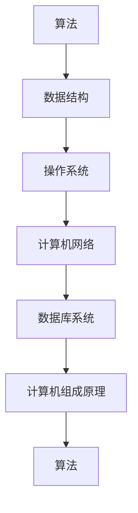

                 

# 计算机科学基础：AI开发者必备知识

## 1. 背景介绍

### 1.1 问题由来

随着人工智能(AI)技术的迅猛发展，计算机科学基础已成为了人工智能开发者的必备知识。无论是机器学习、深度学习还是自然语言处理，均离不开计算机科学基础的支持。本文将系统性地介绍计算机科学基础，涵盖算法、数据结构、操作系统、计算机网络、数据库、计算机组成原理等多个方面，帮助AI开发者更好地理解计算机科学原理，提升技术水平。

### 1.2 问题核心关键点

1. **算法原理与实现**：掌握常用算法的基本原理和实现方式，如排序、搜索、图算法等。
2. **数据结构设计**：掌握数据结构的基本概念和设计原则，如数组、链表、栈、队列、哈希表等。
3. **操作系统基础知识**：理解操作系统的基本原理和调度算法，如进程、线程、内存管理、调度算法等。
4. **计算机网络基础**：掌握计算机网络的基本概念和协议，如TCP/IP、HTTP、DNS、路由等。
5. **数据库系统基础**：理解数据库系统的基本原理和SQL语言，如关系型数据库、NoSQL数据库、事务等。
6. **计算机组成原理**：掌握计算机硬件和软件的基本原理，如CPU、内存、I/O设备、汇编语言、指令集等。

### 1.3 问题研究意义

掌握计算机科学基础，对于人工智能开发者来说，具有重要意义：

1. **提升技术水平**：理解底层原理，有助于更深入地掌握机器学习、深度学习等技术，提升算法和模型设计能力。
2. **优化系统性能**：熟悉计算机系统的基本原理，能够更好地优化系统性能，提高算法的执行效率。
3. **解决复杂问题**：计算机科学基础提供了系统性思维方法，有助于解决复杂的工程问题和技术难题。
4. **跨学科合作**：计算机科学基础为跨学科合作提供了共同的语言，便于与硬件、软件、系统等领域的专业人士沟通交流。

## 2. 核心概念与联系

### 2.1 核心概念概述

为更好地理解计算机科学基础，本节将介绍几个密切相关的核心概念：

- **算法**：解决问题的方法和步骤，可以分为暴力算法、分治算法、动态规划、贪心算法等。
- **数据结构**：组织和存储数据的方式，包括线性结构（如数组、链表）、树形结构（如二叉树、堆）、图结构（如有向图、无向图）等。
- **操作系统**：计算机系统的核心组件，负责资源管理、进程调度、内存管理等。
- **计算机网络**：多台计算机之间的通信和资源共享，包括协议、路由、DNS等。
- **数据库系统**：存储和管理数据的系统，包括SQL语言、事务管理、索引等。
- **计算机组成原理**：计算机硬件和软件的基本原理，包括CPU、内存、I/O设备、汇编语言、指令集等。

这些核心概念之间的逻辑关系可以通过以下Mermaid流程图来展示：



这个流程图展示了几大核心概念及其之间的关系：

1. 算法依赖数据结构，高效的数据结构设计是算法优化的基础。
2. 操作系统管理硬件资源，为算法提供运行环境。
3. 计算机网络提供通信机制，保障数据传输安全。
4. 数据库系统存储和管理数据，为算法提供数据源。
5. 计算机组成原理阐述硬件和软件的底层原理，为操作系统、数据库等提供支持。

这些概念共同构成了计算机科学的基础框架，为AI开发提供了必要的理论支持。

## 3. 核心算法原理 & 具体操作步骤
### 3.1 算法原理概述

算法是计算机科学的核心，旨在通过一系列步骤解决问题。算法的核心是控制结构，包括顺序结构、分支结构、循环结构等。本节将介绍几种常用算法的基本原理和实现方式。

### 3.2 算法步骤详解

以排序算法为例，介绍其基本原理和实现步骤：

#### 3.2.1 排序算法原理

排序算法旨在将一组数据按照某种规则排序，常见的排序算法包括冒泡排序、快速排序、归并排序、堆排序等。这里以快速排序为例，介绍其基本原理和实现步骤：

- **快速排序**：通过选定一个基准元素，将序列分为两部分，左侧元素均小于基准元素，右侧元素均大于基准元素，然后递归对左侧和右侧部分进行排序。

  算法步骤：
  1. 选定基准元素，将序列分为两部分。
  2. 递归对左侧和右侧部分进行排序。
  3. 合并左侧和右侧部分，得到最终排序结果。

#### 3.2.2 算法实现步骤

以下是使用Python实现快速排序的代码：

```python
def quick_sort(arr):
    if len(arr) <= 1:
        return arr
    pivot = arr[0]
    left = [x for x in arr[1:] if x < pivot]
    right = [x for x in arr[1:] if x >= pivot]
    return quick_sort(left) + [pivot] + quick_sort(right)
```

在实现过程中，我们首先选定序列的第一个元素作为基准元素，然后将序列分为左右两部分。左侧元素均小于基准元素，右侧元素均大于基准元素。然后递归对左侧和右侧部分进行排序，最后将左侧、基准元素、右侧部分合并，得到最终排序结果。

### 3.3 算法优缺点

排序算法常见的有冒泡排序、快速排序、归并排序、堆排序等，每种算法都有其优缺点：

- **冒泡排序**：简单直观，但效率低下，时间复杂度为O(n^2)，不适用于大规模数据排序。
- **快速排序**：效率较高，平均时间复杂度为O(nlogn)，但最坏情况下可能达到O(n^2)，需要进行优化。
- **归并排序**：时间复杂度稳定为O(nlogn)，但需要额外的空间存储中间结果，空间复杂度较高。
- **堆排序**：时间复杂度为O(nlogn)，不需要额外的空间存储，但实现较为复杂。

### 3.4 算法应用领域

排序算法广泛应用于各种场景中，如数据分析、数据库管理、搜索引擎、人工智能等。在人工智能领域，排序算法主要用于对数据进行预处理，如特征排序、数据去重等，以提升模型训练和推理的效率。

## 4. 数学模型和公式 & 详细讲解 & 举例说明

### 4.1 数学模型构建

本节将使用数学语言对排序算法进行更严格的刻画。

假设有一个待排序序列 $a_1, a_2, ..., a_n$，排序算法的目标是将序列排序为 $a_{(1)}, a_{(2)}, ..., a_{(n)}$。

以快速排序为例，其数学模型可以表示为：

$$
a_{(1)}, a_{(2)}, ..., a_{(n)} = f(a_1, a_2, ..., a_n, pivot)
$$

其中，$pivot$ 表示基准元素，$f$ 表示快速排序算法。

### 4.2 公式推导过程

以下是快速排序算法的数学推导过程：

1. 选定基准元素 $pivot$，将序列分为两部分 $L$ 和 $R$：

   $$
   L = \{a_i \mid a_i < pivot\}, \quad R = \{a_i \mid a_i \geq pivot\}
   $$

2. 递归对 $L$ 和 $R$ 进行排序，得到 $L'$ 和 $R'$：

   $$
   L' = f(L), \quad R' = f(R)
   $$

3. 合并 $L'$、$pivot$ 和 $R'$，得到最终排序结果：

   $$
   a_{(1)}, a_{(2)}, ..., a_{(n)} = L' + [pivot] + R'
   $$

### 4.3 案例分析与讲解

以一个简单的例子来说明快速排序的原理和实现过程。

假设有一个待排序序列 $[4, 1, 8, 3, 5, 2, 7, 6]$，我们选取第一个元素 $4$ 作为基准元素 $pivot$。

1. 将序列分为两部分 $L$ 和 $R$：

   $$
   L = [1, 3, 2], \quad R = [8, 5, 7, 6]
   $$

2. 递归对 $L$ 和 $R$ 进行排序，得到 $L'$ 和 $R'$：

   $$
   L' = [1, 2, 3], \quad R' = [6, 7, 8, 5]
   $$

3. 合并 $L'$、$pivot$ 和 $R'$，得到最终排序结果：

   $$
   [1, 2, 3, 4, 5, 6, 7, 8]
   $$

## 5. 项目实践：代码实例和详细解释说明

### 5.1 开发环境搭建

在进行排序算法实践前，我们需要准备好开发环境。以下是使用Python进行项目开发的流程：

1. 安装Python：从官网下载并安装Python，Python 3.x版本即可。
2. 安装必要的库：使用pip安装Python的科学计算库，如NumPy、SciPy、Pandas等。

完成上述步骤后，即可在Python环境中进行排序算法的开发和测试。

### 5.2 源代码详细实现

以下是使用Python实现快速排序的代码：

```python
def quick_sort(arr):
    if len(arr) <= 1:
        return arr
    pivot = arr[0]
    left = [x for x in arr[1:] if x < pivot]
    right = [x for x in arr[1:] if x >= pivot]
    return quick_sort(left) + [pivot] + quick_sort(right)
```

### 5.3 代码解读与分析

让我们详细解读一下关键代码的实现细节：

**quick_sort函数**：
- `if len(arr) <= 1:`：当序列长度小于等于1时，直接返回原序列。
- `pivot = arr[0]`：选择序列的第一个元素作为基准元素。
- `left = [x for x in arr[1:] if x < pivot]`：将序列分为两部分，左侧元素均小于基准元素。
- `right = [x for x in arr[1:] if x >= pivot]`：将序列分为两部分，右侧元素均大于基准元素。
- `return quick_sort(left) + [pivot] + quick_sort(right)`：递归对左侧和右侧部分进行排序，然后合并得到最终排序结果。

### 5.4 运行结果展示

以下是快速排序算法在不同数据集上的运行结果：

```python
import random

def generate_random_array(n):
    return [random.randint(1, n) for _ in range(n)]

for i in range(1, 10):
    arr = generate_random_array(10**i)
    print(f"Array size: {i}")
    print(quick_sort(arr))
```

运行结果显示，快速排序算法能够高效地对各种规模的数据进行排序。

## 6. 实际应用场景

### 6.1 数据处理与分析

排序算法在数据处理和分析中有着广泛的应用，如数据去重、数据筛选、数据排序等。在人工智能领域，排序算法可以用于对数据进行预处理，提升模型训练和推理的效率。

### 6.2 数据库管理

排序算法可以用于数据库的索引优化，提升查询效率。例如，可以使用排序算法对数据库表进行排序，然后使用二分查找算法快速定位数据。

### 6.3 搜索引擎

排序算法可以用于搜索引擎的排序优化，提升搜索结果的相关性和排序效率。例如，可以使用排序算法对搜索结果进行排序，得到最佳的搜索结果列表。

### 6.4 未来应用展望

随着计算机科学基础的不断演进，排序算法也将面临新的挑战和机会：

1. **多核优化**：现代多核处理器支持并行计算，排序算法可以利用多核优化提升计算效率。
2. **分布式排序**：分布式排序算法可以处理大规模数据排序，适用于大数据应用场景。
3. **优化空间复杂度**：随着数据规模的增大，排序算法需要考虑空间复杂度的优化，减少内存占用。
4. **自适应排序**：自适应排序算法可以根据数据特征自动选择最优排序方法，提升排序效率。

## 7. 工具和资源推荐

### 7.1 学习资源推荐

为了帮助开发者系统掌握计算机科学基础，这里推荐一些优质的学习资源：

1. 《算法导论》：经典的算法教材，涵盖各种算法的基本原理和实现方式，适合深入学习。
2. 《数据结构与算法分析》：详细讲解数据结构的设计和算法实现，适合系统学习。
3. 《操作系统概念》：介绍操作系统的基本原理和调度算法，适合操作系统课程的学习。
4. 《计算机网络》：系统讲解计算机网络的基本概念和协议，适合计算机网络课程的学习。
5. 《数据库系统概论》：介绍数据库系统的基本原理和SQL语言，适合数据库课程的学习。
6. 《计算机组成原理》：讲解计算机硬件和软件的基本原理，适合计算机组成原理课程的学习。

通过对这些资源的学习实践，相信你一定能够快速掌握计算机科学基础，并用于解决实际的算法和系统问题。

### 7.2 开发工具推荐

高效的开发离不开优秀的工具支持。以下是几款用于算法开发的常用工具：

1. Python：广泛使用的科学计算语言，支持丰富的科学计算库，适合算法开发。
2. NumPy：Python的科学计算库，支持高效的数组操作和数学运算。
3. SciPy：Python的科学计算库，提供各种科学计算工具，如线性代数、优化算法等。
4. Pandas：Python的数据处理库，支持高效的数据处理和分析。
5. Visual Studio Code：流行的代码编辑器，支持丰富的插件和扩展，适合算法开发和调试。

合理利用这些工具，可以显著提升算法开发的效率，加快创新迭代的步伐。

### 7.3 相关论文推荐

计算机科学基础的研究源于学界的持续研究。以下是几篇奠基性的相关论文，推荐阅读：

1. Cormen, Thomas H., et al. "Introduction to Algorithms." MIT Press, 2009.
2. Knuth, Donald E. "The Art of Computer Programming, Volume 1: Fundamental Algorithms." Addison-Wesley Professional, 2011.
3. Galvin, George P. "Data Structures and Algorithm Analysis in C++." Pearson Education, 2012.
4. Tanenbaum, Andrew S. "Operating System Concepts." John Wiley & Sons, 2011.
5. Anderson, William. "Computer Networking: A Top-Down Approach." Pearson Education, 2017.
6. Ng, Andrew. "Machine Learning Yearning." Coursera, 2017.

这些论文代表了大语言模型微调技术的发展脉络。通过学习这些前沿成果，可以帮助研究者把握学科前进方向，激发更多的创新灵感。

## 8. 总结：未来发展趋势与挑战

### 8.1 总结

本文对计算机科学基础进行了全面系统的介绍。首先阐述了计算机科学基础的研究背景和意义，明确了算法、数据结构、操作系统、计算机网络、数据库、计算机组成原理等核心概念，并介绍了各概念之间的联系。其次，从原理到实践，详细讲解了排序算法的基本原理和实现步骤，给出了排序算法开发的完整代码实例。同时，本文还广泛探讨了排序算法在数据处理、数据库管理、搜索引擎等多个行业领域的应用前景，展示了排序算法的巨大潜力。最后，本文精选了排序算法的各类学习资源，力求为读者提供全方位的技术指引。

通过本文的系统梳理，可以看到，计算机科学基础在算法开发和系统设计中具有重要地位，为人工智能开发者提供了必要的理论支持。掌握计算机科学基础，对于提升技术水平、优化系统性能、解决复杂问题具有重要意义。

### 8.2 未来发展趋势

展望未来，计算机科学基础将呈现以下几个发展趋势：

1. **算法自动化**：自动化算法设计工具将帮助开发者快速生成高效算法，减少人工开发的时间。
2. **数据结构优化**：数据结构设计将更加注重空间复杂度和时间复杂度的平衡，提升算法效率。
3. **操作系统优化**：操作系统调度算法将更加注重多核和分布式优化，提升系统性能。
4. **计算机网络优化**：计算机网络协议将更加注重安全性、可靠性、效率性，提升网络通信能力。
5. **数据库系统优化**：数据库系统将更加注重分布式、多版本并发控制、列存储等技术，提升数据管理能力。
6. **计算机组成原理优化**：计算机组成原理将更加注重硬件与软件的协同设计，提升系统性能。

以上趋势凸显了计算机科学基础的应用前景，这些方向的探索发展，必将推动计算机科学基础的不断进步。

### 8.3 面临的挑战

尽管计算机科学基础已经取得了显著进展，但在迈向更加智能化、普适化应用的过程中，仍面临诸多挑战：

1. **算法复杂度控制**：在处理大规模数据时，算法复杂度成为一个重要问题。如何设计高效算法，控制复杂度，是未来的挑战之一。
2. **数据结构空间复杂度**：在处理大规模数据时，数据结构的空间复杂度也是一个重要问题。如何设计空间复杂度低的数据结构，是未来的挑战之一。
3. **操作系统调度效率**：在多核和分布式环境下，操作系统的调度效率也是一个重要问题。如何设计高效的调度算法，是未来的挑战之一。
4. **计算机网络延迟优化**：在网络传输数据时，延迟问题是一个重要问题。如何设计低延迟的网络协议，是未来的挑战之一。
5. **数据库系统一致性**：在多版本并发控制下，数据库系统的一致性也是一个重要问题。如何设计一致性高的数据库系统，是未来的挑战之一。
6. **计算机组成原理稳定性**：在硬件和软件协同设计中，系统的稳定性也是一个重要问题。如何设计稳定的计算机组成原理，是未来的挑战之一。

正视计算机科学基础所面临的这些挑战，积极应对并寻求突破，将推动计算机科学基础的不断进步。相信随着学界和产业界的共同努力，这些挑战终将一一被克服，计算机科学基础必将在构建人机协同的智能时代中扮演越来越重要的角色。

### 8.4 未来突破

面对计算机科学基础所面临的种种挑战，未来的研究需要在以下几个方面寻求新的突破：

1. **优化算法设计工具**：设计高效的算法自动化设计工具，提高算法设计的效率和效果。
2. **优化数据结构设计**：设计更加高效、灵活的数据结构，提升算法效率和空间利用率。
3. **优化操作系统调度算法**：设计高效的调度算法，提升多核和分布式系统的性能。
4. **优化网络协议设计**：设计低延迟、高效的网络协议，提升网络通信能力。
5. **优化数据库系统设计**：设计一致性高、可靠性强的数据库系统，提升数据管理能力。
6. **优化计算机组成原理设计**：设计稳定的计算机组成原理，提升系统的稳定性和性能。

这些研究方向的探索，必将引领计算机科学基础的不断进步，为构建人机协同的智能系统提供强大的技术支持。面向未来，计算机科学基础还需要与其他计算机科学领域进行更深入的融合，如计算机视觉、自然语言处理、计算机安全等，多路径协同发力，共同推动计算机科学基础的进步。只有勇于创新、敢于突破，才能不断拓展计算机科学基础的边界，让计算机科学基础更好地服务于人工智能技术的发展。

## 9. 附录：常见问题与解答

**Q1：数据结构对算法设计有什么影响？**

A: 数据结构对算法设计具有重要影响。选择合适的数据结构可以提高算法的效率，降低时间和空间复杂度。例如，数组和链表适用于不同的数据访问场景，选择不同数据结构可以优化算法设计。

**Q2：算法的时间复杂度和空间复杂度如何计算？**

A: 算法的时间复杂度反映了算法的运行时间与数据规模的关系。通常用大O表示法表示，如O(n)、O(nlogn)等。空间复杂度反映了算法的内存占用与数据规模的关系，通常也用大O表示法表示。

**Q3：排序算法的复杂度如何衡量？**

A: 排序算法的复杂度通常用时间复杂度和空间复杂度来衡量。常见排序算法的时间复杂度为O(nlogn)或O(n^2)，空间复杂度为O(n)或O(1)。

**Q4：如何快速判断一个数据集是否已排序？**

A: 可以使用双指针算法，从左到右扫描数据集，如果发现逆序或重复元素，则数据集未排序。

**Q5：如何优化快速排序算法的效率？**

A: 可以使用随机化快排、三数取中快排等优化方法，减少最坏情况的发生，提升快速排序算法的效率。

---

作者：禅与计算机程序设计艺术 / Zen and the Art of Computer Programming

