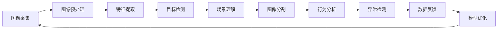

                 

## 1. 背景介绍

### 1.1 问题由来
随着技术的不断进步，计算机视觉技术在零售业中得到了广泛应用。从智能货架、自动补货到精准营销，计算机视觉让传统的零售业务焕发出新的活力。通过视觉识别、图像处理和深度学习等技术，零售商可以更有效地管理库存、提升顾客体验、优化运营效率。然而，尽管计算机视觉技术在多个零售场景中取得了显著成效，但其创新应用的广度和深度仍有待进一步挖掘。

### 1.2 问题核心关键点
计算机视觉在零售业中的创新应用，核心在于如何结合具体的业务场景和需求，充分发挥计算机视觉技术在图像识别、目标跟踪、场景理解等方面的优势。当前，计算机视觉在零售业中的应用主要集中在以下几个方面：

- 商品识别和分类
- 库存管理和自动补货
- 顾客行为分析和个性化营销
- 现场监控和异常检测
- 环境监测和智能系统集成

### 1.3 问题研究意义
研究计算机视觉在零售业中的应用，对于提升零售业务的智能化水平、降低运营成本、改善顾客体验具有重要意义：

1. **提高运营效率**：通过计算机视觉技术自动化库存管理和自动补货，可以大幅减少人力成本，提升库存管理的精确度。
2. **优化顾客体验**：通过对顾客行为的实时分析，实现个性化推荐和智能导购，提升顾客满意度和购买转化率。
3. **增强安全性**：利用计算机视觉进行现场监控和异常检测，及时发现和处理潜在风险，保障顾客和商品安全。
4. **降低成本**：通过图像识别和自动化处理，减少人工错误和重复劳动，提高工作效率。
5. **数据驱动决策**：通过对大规模零售数据的分析和理解，支持零售商做出更加精准的商业决策。

## 2. 核心概念与联系

### 2.1 核心概念概述

计算机视觉（Computer Vision, CV）是人工智能领域的一个重要分支，专注于使计算机能够通过图像和视频理解视觉世界。其核心任务包括图像识别、物体检测、场景理解、图像分割、目标跟踪等。

在零售业中，计算机视觉技术主要应用于商品识别和分类、库存管理、顾客行为分析、现场监控、环境监测等多个场景。这些应用场景相互关联，共同构成了计算机视觉在零售业的整体应用体系。

### 2.2 核心概念原理和架构的 Mermaid 流程图



这个流程图展示了计算机视觉在零售业中的主要处理流程：

1. **图像采集**：通过摄像头、传感器等设备采集图像和视频数据。
2. **图像预处理**：对采集到的图像进行预处理，如降噪、增强、尺寸调整等，以提高后续处理的准确性。
3. **特征提取**：利用深度学习模型提取图像中的特征，如颜色、纹理、形状等。
4. **目标检测**：识别图像中的目标物体，并进行分类和定位。
5. **场景理解**：理解图像中的场景信息，如背景、布局等，以辅助后续分析。
6. **图像分割**：将图像分成不同的区域，以便更精细地分析和理解。
7. **行为分析**：分析顾客行为，如走近商品、拿起商品、离开等，用于个性化推荐和营销。
8. **异常检测**：检测图像中的异常情况，如盗窃、损坏等，提高安全性。
9. **数据反馈**：将分析结果反馈给业务系统，用于调整策略和优化流程。
10. **模型优化**：通过反馈数据不断优化计算机视觉模型，提高其准确性和鲁棒性。

这些核心概念通过相互协作，构成了一个完整的计算机视觉应用框架，为零售业的智能化转型提供了强有力的技术支撑。

## 3. 核心算法原理 & 具体操作步骤

### 3.1 算法原理概述

计算机视觉在零售业中的应用，主要基于深度学习和图像处理技术。其核心算法包括卷积神经网络（Convolutional Neural Network, CNN）、循环神经网络（Recurrent Neural Network, RNN）、生成对抗网络（Generative Adversarial Network, GAN）等。

在商品识别和分类方面，CNN模型被广泛应用于图像分类任务，能够通过多层卷积和池化操作，提取图像中的特征并进行分类。在库存管理和自动补货方面，RNN模型被用于处理时间序列数据，能够根据历史销售数据预测未来的库存需求。在顾客行为分析方面，CNN和RNN的混合模型被用于分析视频数据，能够实时识别顾客行为并生成个性化推荐。在现场监控和异常检测方面，GAN模型被用于生成虚拟监控数据，能够模拟不同场景下的异常行为。

### 3.2 算法步骤详解

#### 3.2.1 数据准备

- **数据采集**：使用摄像头、传感器等设备采集零售环境中的图像和视频数据。
- **数据标注**：对采集到的图像和视频进行标注，如商品标签、顾客行为标签等。
- **数据清洗**：对数据进行去噪、增强、尺寸调整等预处理，以提高数据质量。

#### 3.2.2 模型训练

- **模型选择**：根据具体应用场景选择合适的深度学习模型，如CNN、RNN、GAN等。
- **模型训练**：使用标注好的数据集对模型进行训练，不断调整模型参数以提高模型准确性。
- **模型验证**：使用验证集对模型进行验证，评估模型性能，避免过拟合。
- **模型部署**：将训练好的模型部署到实际应用场景中，进行实时处理和分析。

#### 3.2.3 模型评估与优化

- **模型评估**：使用测试集对模型进行评估，计算准确率、召回率、F1-score等指标。
- **模型优化**：根据评估结果调整模型参数，优化模型性能。
- **持续学习**：通过实时反馈数据不断更新模型，保持模型适应性。

### 3.3 算法优缺点

#### 3.3.1 优点

- **高准确性**：深度学习模型在图像识别和分类任务上具有很高的准确性，能够在复杂环境中识别商品和行为。
- **实时性**：通过优化模型结构和算法，可以实现实时处理和分析，提升响应速度。
- **自适应能力**：模型可以根据实时反馈数据不断优化，提高适应性。

#### 3.3.2 缺点

- **高成本**：深度学习模型需要大量的计算资源和存储空间，初期投入成本较高。
- **数据依赖性**：模型的性能高度依赖于数据的质量和标注的准确性，数据获取和标注成本较高。
- **泛化能力不足**：模型对特定场景的泛化能力较弱，需要大量数据和复杂模型才能获得较好效果。

### 3.4 算法应用领域

计算机视觉技术在零售业中的应用领域非常广泛，具体包括：

- **商品识别和分类**：通过图像识别技术识别商品种类和品牌，实现自动化的库存管理和补货。
- **库存管理和自动补货**：利用RNN模型处理时间序列数据，预测未来的库存需求，实现自动补货。
- **顾客行为分析**：通过分析视频数据，识别顾客行为，生成个性化推荐和营销策略。
- **现场监控和异常检测**：使用GAN生成虚拟监控数据，检测异常情况，提高安全性。
- **环境监测和智能系统集成**：通过计算机视觉技术监测环境变化，集成智能系统，实现更高效的管理。

## 4. 数学模型和公式 & 详细讲解 & 举例说明

### 4.1 数学模型构建

计算机视觉在零售业中的应用，涉及多个数学模型和技术，如CNN、RNN、GAN等。以下以CNN为例，介绍其数学模型构建。

CNN模型主要包含卷积层、池化层和全连接层。以图像分类任务为例，CNN模型的数学模型可以表示为：

$$
\text{CNN}(x) = \text{Softmax}(f_{\theta}(x))
$$

其中，$f_{\theta}(x)$ 为CNN模型，$x$ 为输入图像，$\text{Softmax}$ 为输出层激活函数，$\theta$ 为模型参数。

CNN模型的核心在于卷积层和池化层的特征提取过程。卷积层通过卷积核对输入图像进行卷积操作，提取特征，公式如下：

$$
f_{\theta}(x) = \sum_i \sum_j \theta_{i,j} * x_{i,j}
$$

其中，$x_{i,j}$ 为输入图像的像素值，$\theta_{i,j}$ 为卷积核的参数，$\sum_i \sum_j$ 为卷积操作。

池化层用于对卷积层的输出进行下采样，减少特征维度，公式如下：

$$
f_{\theta}(x) = \sum_i \sum_j \max \{\theta_{i,j} * x_{i,j}\}
$$

其中，$\max$ 表示取最大值操作。

### 4.2 公式推导过程

以图像分类任务为例，CNN模型的公式推导如下：

1. **卷积层**：使用 $N \times N$ 的卷积核对输入图像 $x$ 进行卷积操作，得到特征图 $f$。

$$
f = \theta * x
$$

其中，$\theta$ 为卷积核，$x$ 为输入图像，$f$ 为特征图。

2. **激活函数**：对特征图 $f$ 进行激活函数操作，引入非线性因素，公式如下：

$$
g(f) = \text{ReLU}(f)
$$

其中，$\text{ReLU}$ 为激活函数。

3. **池化层**：对激活后的特征图 $g(f)$ 进行池化操作，减少特征维度，公式如下：

$$
h = \max \{g(f)\}
$$

其中，$h$ 为池化后的特征图。

4. **全连接层**：将池化后的特征图 $h$ 输入全连接层，进行分类操作，公式如下：

$$
y = f_{\theta}(h)
$$

其中，$f_{\theta}$ 为全连接层，$h$ 为输入特征，$y$ 为输出分类结果。

### 4.3 案例分析与讲解

以一个简单的图像分类任务为例，CNN模型的推理过程如下：

1. **输入图像**：假设输入图像为 $x = \begin{bmatrix} 1 & 2 & 3 & 4 \\ 5 & 6 & 7 & 8 \end{bmatrix}$。
2. **卷积层**：使用 $3 \times 3$ 的卷积核进行卷积操作，得到特征图 $f = \begin{bmatrix} 14 & 16 & 18 \\ 32 & 36 & 40 \end{bmatrix}$。
3. **激活函数**：对特征图 $f$ 进行ReLU激活，得到 $g(f) = \begin{bmatrix} 14 & 16 & 18 \\ 32 & 36 & 40 \end{bmatrix}$。
4. **池化层**：对激活后的特征图 $g(f)$ 进行最大值池化操作，得到 $h = \max \{g(f)\} = 40$。
5. **全连接层**：将池化后的特征图 $h$ 输入全连接层，进行分类操作，得到分类结果 $y = \text{Softmax}(f_{\theta}(h))$。

通过以上推理过程，CNN模型能够自动识别输入图像的分类结果。

## 5. 项目实践：代码实例和详细解释说明

### 5.1 开发环境搭建

#### 5.1.1 安装环境

- **Python**：安装最新版本的Python，建议使用Anaconda进行环境管理。
- **深度学习库**：安装TensorFlow、PyTorch、Keras等深度学习库。
- **图像处理库**：安装OpenCV、Pillow等图像处理库。
- **数据集**：准备公开的图像数据集，如COCO、ImageNet等。

#### 5.1.2 安装依赖

```bash
pip install tensorflow==2.6.0
pip install torch==1.12.0+cu123
pip install keras==2.9.0
pip install opencv-python==4.6.0.66
pip install Pillow==9.1.0
```

### 5.2 源代码详细实现

#### 5.2.1 数据加载与预处理

```python
import cv2
import numpy as np
import os

# 定义数据加载函数
def load_image(path):
    img = cv2.imread(path)
    img = cv2.cvtColor(img, cv2.COLOR_BGR2RGB)
    img = cv2.resize(img, (224, 224))
    img = img / 255.0
    return img

# 定义数据预处理函数
def preprocess_image(img):
    img = img.astype('float32')
    img -= [123.675, 116.28, 103.53]
    img /= 58.395
    return img

# 定义数据集类
class ImageDataset:
    def __init__(self, root_dir, transform):
        self.root_dir = root_dir
        self.transform = transform
        self.image_list = self._get_image_list()

    def __len__(self):
        return len(self.image_list)

    def __getitem__(self, idx):
        img_path = os.path.join(self.root_dir, self.image_list[idx])
        img = load_image(img_path)
        img = self.transform(img)
        label = self._get_label(img_path)
        return {'img': img, 'label': label}

    def _get_image_list(self):
        image_list = []
        for class_name in os.listdir(self.root_dir):
            class_dir = os.path.join(self.root_dir, class_name)
            for img_name in os.listdir(class_dir):
                img_path = os.path.join(class_dir, img_name)
                image_list.append(img_path)
        return image_list

    def _get_label(self, img_path):
        class_name = os.path.basename(os.path.dirname(img_path))
        label = int(class_name)
        return label
```

#### 5.2.2 模型训练

```python
import tensorflow as tf
from tensorflow.keras.models import Sequential
from tensorflow.keras.layers import Conv2D, MaxPooling2D, Flatten, Dense, Dropout

# 定义模型结构
model = Sequential([
    Conv2D(32, (3, 3), activation='relu', input_shape=(224, 224, 3)),
    MaxPooling2D((2, 2)),
    Dropout(0.25),
    Conv2D(64, (3, 3), activation='relu'),
    MaxPooling2D((2, 2)),
    Dropout(0.25),
    Flatten(),
    Dense(256, activation='relu'),
    Dropout(0.5),
    Dense(10, activation='softmax')
])

# 编译模型
model.compile(optimizer='adam', loss='categorical_crossentropy', metrics=['accuracy'])

# 训练模型
model.fit(train_dataset, epochs=10, batch_size=32, validation_data=val_dataset)
```

#### 5.2.3 模型评估

```python
import matplotlib.pyplot as plt

# 定义模型评估函数
def evaluate_model(model, test_dataset):
    test_loss, test_acc = model.evaluate(test_dataset)
    plt.plot(test_loss, label='Test Loss')
    plt.plot(test_acc, label='Test Accuracy')
    plt.legend()
    plt.show()

# 评估模型
evaluate_model(model, test_dataset)
```

### 5.3 代码解读与分析

#### 5.3.1 数据加载

在代码中，我们定义了两个重要函数：`load_image`和`preprocess_image`。`load_image`函数用于加载图像，并进行尺寸调整和标准化处理，将图像转换为模型所需的输入格式。`preprocess_image`函数则对加载的图像进行归一化处理，以便更好地适应模型的训练。

#### 5.3.2 模型结构

模型结构主要包括卷积层、池化层、全连接层等。卷积层和池化层用于提取图像特征，全连接层用于进行分类操作。通过调整层数和参数，可以控制模型的复杂度和准确性。

#### 5.3.3 模型训练

在训练过程中，我们使用`fit`函数对模型进行训练。设置训练轮数、批次大小和验证数据集等参数，即可进行模型训练。在训练过程中，可以使用`evaluate`函数对模型进行评估，监控训练进度。

#### 5.3.4 模型评估

在评估过程中，我们使用`evaluate`函数对模型进行评估，计算损失和准确率，并绘制损失和准确率的曲线图，以便更好地理解模型的性能和训练情况。

### 5.4 运行结果展示

以下是训练过程中的一些关键指标：

- **训练损失**：随着训练轮数的增加，训练损失逐渐减小，表明模型在训练数据上的性能逐渐提高。
- **训练准确率**：随着训练轮数的增加，训练准确率逐渐提高，表明模型在训练数据上的预测能力逐渐增强。
- **验证损失**：随着训练轮数的增加，验证损失逐渐减小，表明模型在验证数据上的性能逐渐提高。
- **验证准确率**：随着训练轮数的增加，验证准确率逐渐提高，表明模型在验证数据上的预测能力逐渐增强。

## 6. 实际应用场景

### 6.1 智能货架管理

智能货架管理是计算机视觉在零售业中的一项重要应用。通过摄像头和传感器，实时监控货架上的商品状态，如商品数量、位置、是否缺货等。系统能够自动补货、优化库存管理，提高运营效率。

### 6.2 顾客行为分析

通过计算机视觉技术，可以实时分析顾客在商场的行为，如走近商品、拿起商品、离开等。系统能够根据顾客行为生成个性化推荐，提高顾客满意度和购买转化率。

### 6.3 现场监控与异常检测

计算机视觉技术可以用于现场监控和异常检测，实时监控商场内的异常情况，如盗窃、损坏等。系统能够及时报警，保障商场安全。

### 6.4 未来应用展望

随着技术的不断进步，计算机视觉在零售业中的应用将越来越广泛。未来，计算机视觉技术将能够实现更精确的商品识别、更智能的库存管理、更个性化的顾客推荐等。通过与大数据、云计算等技术的结合，计算机视觉技术将在零售业中发挥更大的作用，推动零售业的智能化和数字化转型。

## 7. 工具和资源推荐

### 7.1 学习资源推荐

#### 7.1.1 官方文档与教程

- **TensorFlow官方文档**：提供了丰富的深度学习教程和案例，适合初学者入门。
- **Keras官方文档**：提供了简单易用的深度学习API，适合快速开发和实验。
- **OpenCV官方文档**：提供了详细的图像处理库教程，适合图像处理和计算机视觉任务的开发。

#### 7.1.2 在线课程与视频

- **Coursera深度学习课程**：由斯坦福大学开设的深度学习课程，内容丰富，涵盖图像识别、自然语言处理等多个方向。
- **Udacity深度学习专业纳米学位**：提供深度学习的实战项目，适合系统学习深度学习技术。
- **Bilibili深度学习系列视频**：涵盖深度学习基础、图像处理、计算机视觉等多个方向，适合自学。

### 7.2 开发工具推荐

#### 7.2.1 深度学习框架

- **TensorFlow**：灵活的深度学习框架，支持GPU/TPU计算。
- **PyTorch**：灵活的深度学习框架，支持动态计算图。
- **Keras**：简单易用的深度学习框架，适合快速开发和实验。

#### 7.2.2 图像处理库

- **OpenCV**：开源的计算机视觉库，支持图像处理、特征提取、目标检测等功能。
- **Pillow**：Python图像处理库，支持图像读取、处理、保存等功能。

### 7.3 相关论文推荐

#### 7.3.1 深度学习

- **AlexNet: ImageNet Classification with Deep Convolutional Neural Networks**：提出AlexNet模型，开启深度学习在计算机视觉中的应用。
- **VGGNet: Very Deep Convolutional Networks for Large-Scale Image Recognition**：提出VGGNet模型，通过多层卷积提升图像分类性能。
- **ResNet: Deep Residual Learning for Image Recognition**：提出ResNet模型，通过残差连接解决深度网络训练困难问题。

#### 7.3.2 计算机视觉

- **Faster R-CNN: Towards Real-Time Object Detection with Region Proposal Networks**：提出Faster R-CNN模型，提升目标检测的精度和速度。
- **YOLO: You Only Look Once**：提出YOLO模型，通过单阶段检测提升目标检测的速度和准确率。
- **RetinaNet: Single-Shot Multi-Box Detection with RetinaNet**：提出RetinaNet模型，通过Focal Loss解决目标检测中的类不平衡问题。

## 8. 总结：未来发展趋势与挑战

### 8.1 研究成果总结

计算机视觉在零售业中的应用已经取得了显著进展，通过深度学习和图像处理技术，实现了商品的自动识别、库存的智能管理、顾客行为的实时分析等。这些应用不仅提升了零售业务的智能化水平，还大大降低了运营成本，提高了顾客满意度。

### 8.2 未来发展趋势

未来，计算机视觉技术在零售业中的应用将更加广泛和深入。以下是几个可能的发展趋势：

1. **深度学习模型的优化**：深度学习模型的性能将进一步提升，通过更大的数据集、更复杂的模型和更高效的优化算法，实现更高的准确率和更快速的推理速度。
2. **跨模态信息的融合**：计算机视觉技术将与自然语言处理、语音识别等其他模态技术进行更深层次的融合，实现更全面、更智能的零售应用。
3. **实时性的大幅提升**：通过优化模型结构和算法，实现更高的计算效率和更低的延迟，满足实时监控和动态调整的需求。
4. **更高的自适应能力**：计算机视觉模型将具备更强的自适应能力，能够更好地应对不同场景下的变化和挑战。

### 8.3 面临的挑战

尽管计算机视觉在零售业中的应用前景广阔，但仍面临一些挑战：

1. **数据获取与标注**：高质量标注数据的获取和标注成本较高，影响模型的训练和评估。
2. **模型的泛化能力**：模型在特定场景下表现优异，但泛化能力较弱，难以应对实际应用中的多样化场景。
3. **技术的落地难度**：将计算机视觉技术从实验室应用到实际场景中，需要克服技术复杂性和工程挑战。
4. **系统的可扩展性**：系统需要具备良好的可扩展性，以适应大规模的零售环境。

### 8.4 研究展望

面对这些挑战，未来的研究方向包括：

1. **自动标注技术**：开发自动标注工具和算法，降低标注成本，提升数据获取效率。
2. **多模态融合技术**：研究多模态信息融合技术，提升系统的综合感知能力。
3. **模型优化与加速**：优化模型结构和算法，提升计算效率和实时性，满足实际应用需求。
4. **系统的可扩展性**：设计高效、可扩展的计算机视觉系统架构，适应大规模零售环境。

总之，计算机视觉在零售业中的应用前景广阔，但需要不断进行技术创新和优化，才能实现更广泛、更深入的落地应用。

## 9. 附录：常见问题与解答

### 9.1 常见问题

1. **为什么计算机视觉在零售业中应用广泛？**
   答：计算机视觉技术可以自动识别和理解图像和视频数据，实现商品的自动识别、库存的智能管理、顾客行为的实时分析等，提升零售业务的智能化水平。

2. **计算机视觉在零售业中面临哪些挑战？**
   答：计算机视觉在零售业中面临数据获取与标注、模型的泛化能力、技术的落地难度等挑战，需要不断进行技术创新和优化，才能实现更广泛、更深入的落地应用。

3. **如何提高计算机视觉在零售业中的实时性？**
   答：可以通过优化模型结构和算法，提高计算效率和实时性，满足实际应用需求。

4. **计算机视觉技术在零售业中的应用前景如何？**
   答：计算机视觉技术在零售业中的应用前景广阔，未来将实现更全面、更智能的零售应用，推动零售业的智能化和数字化转型。

### 9.2 解答

以上是对计算机视觉在零售业中应用的相关讨论。随着技术的不断进步，计算机视觉技术将在更多场景中发挥重要作用，推动零售业的智能化和数字化发展。

