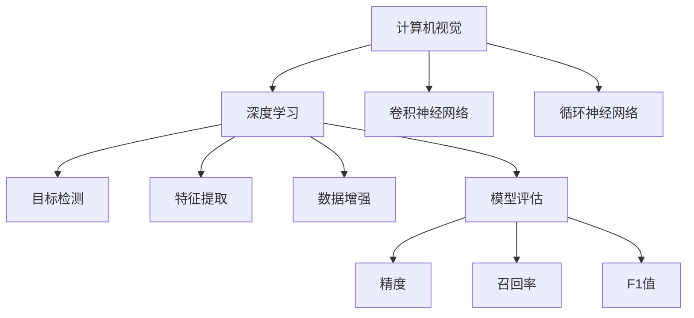

                 

# 计算机视觉技术在注意力追踪中的应用

> 关键词：计算机视觉, 注意力追踪, 深度学习, 特征提取, 卷积神经网络, 数据增强, 模型评估

## 1. 背景介绍

### 1.1 问题由来

注意力追踪（Attention Tracking）是计算机视觉中的一个重要研究方向，旨在实时监控和追踪目标物体的运动轨迹，广泛应用于视频监控、人机交互、智能驾驶等领域。传统的注意力追踪方法依赖于固定摄像头或传感器，存在覆盖范围有限、无法应对复杂场景变化等问题。近年来，计算机视觉技术快速发展，尤其是深度学习和计算机视觉的融合，为注意力追踪提供了新的解决方案。

### 1.2 问题核心关键点

基于深度学习的注意力追踪方法，利用卷积神经网络（CNN）和循环神经网络（RNN）等模型，对视频序列进行分析，自动学习目标物体的特征并进行轨迹预测。这种技术可以显著提升追踪的实时性和准确性，适应更多复杂场景下的应用需求。

## 2. 核心概念与联系

### 2.1 核心概念概述

为更好地理解计算机视觉技术在注意力追踪中的应用，本节将介绍几个密切相关的核心概念：

- 计算机视觉(Computer Vision)：使用机器学习和深度学习技术，从视觉信号中提取信息，以识别、分类、追踪和理解目标物体的过程。
- 深度学习(Deep Learning)：一种基于神经网络的机器学习方法，能够处理大量非结构化数据，如图像、视频等。
- 卷积神经网络(Convolutional Neural Network, CNN)：一种适用于图像处理和计算机视觉任务的深度学习模型，通过卷积操作提取局部特征。
- 循环神经网络(Recurrent Neural Network, RNN)：适用于序列数据处理，能够捕捉时间依赖关系，用于动态预测和追踪。
- 目标检测(Object Detection)：通过分类和定位目标物体，为注意力追踪提供准确的位置信息。
- 特征提取(Feature Extraction)：从输入数据中提取有意义的特征，为后续处理和分析奠定基础。
- 数据增强(Data Augmentation)：通过变换和增强训练样本，提高模型泛化能力。
- 模型评估(Model Evaluation)：通过各种指标评估模型性能，如精度、召回率、F1值等。

这些核心概念之间的逻辑关系可以通过以下Mermaid流程图来展示：



这个流程图展示了许多与注意力追踪密切相关的概念及其之间的关系：

1. 计算机视觉技术为深度学习提供了视觉数据的输入。
2. 卷积神经网络和循环神经网络是深度学习在图像和序列数据处理中的重要模型。
3. 目标检测用于在视频帧中检测和定位目标物体，为追踪提供起始点。
4. 特征提取从视频帧中提取关键特征，为后续处理提供信息。
5. 数据增强通过变换训练样本，提高模型泛化能力。
6. 模型评估用于衡量模型在追踪中的表现，常用的指标包括精度、召回率和F1值。

## 3. 核心算法原理 & 具体操作步骤
### 3.1 算法原理概述

计算机视觉技术在注意力追踪中的应用，主要基于深度学习模型对目标物体的特征进行提取和分析。具体而言，通过以下步骤实现：

1. **数据预处理**：对视频帧进行裁剪、旋转、缩放等操作，以适应网络输入要求。
2. **特征提取**：利用卷积神经网络对每帧图像进行特征提取，得到表示目标物体的特征向量。
3. **目标跟踪**：在时间轴上，通过循环神经网络或目标关联算法，对目标物体的轨迹进行预测和更新。
4. **结果评估**：利用模型评估指标，如精度、召回率和F1值等，对追踪结果进行定量评估。

### 3.2 算法步骤详解

**Step 1: 数据预处理**

视频数据的预处理是计算机视觉任务的基础，具体步骤如下：

1. 视频采集：使用摄像头或传感器采集视频数据。
2. 帧采样：从视频中抽取关键帧，减少数据量和计算量。
3. 帧裁剪和旋转：对视频帧进行裁剪和旋转操作，去除无关区域和背景。
4. 归一化：对视频帧进行归一化处理，使其尺寸、颜色等特征一致。

**Step 2: 特征提取**

特征提取是注意力追踪的核心步骤，通过卷积神经网络实现：

1. 选择网络架构：如VGG、ResNet等，并加载预训练权重。
2. 特征图生成：将预处理后的视频帧输入网络，生成特征图。
3. 特征融合：通过池化层或全局池化操作，将特征图融合为高维特征向量。

**Step 3: 目标跟踪**

目标跟踪利用循环神经网络或目标关联算法实现：

1. 初始化：将目标物体的初始位置和速度作为初始状态。
2. 轨迹预测：将前一帧的高维特征向量输入RNN，预测目标物体的位置和速度。
3. 状态更新：根据预测结果，更新目标物体的状态，继续下一帧的预测。

**Step 4: 结果评估**

追踪结果的评估是模型优化的关键，通过以下指标进行：

1. 精度（Accuracy）：追踪到的目标位置与实际位置的距离。
2. 召回率（Recall）：正确识别目标物体的比例。
3. F1值（F1-score）：精度和召回率的调和平均数。

### 3.3 算法优缺点

计算机视觉技术在注意力追踪中的应用，具有以下优点：

1. **实时性**：深度学习模型能够在实时视频流中快速处理和追踪目标物体。
2. **泛化能力**：卷积神经网络能够适应复杂场景和不同尺度的目标物体。
3. **自适应性**：循环神经网络能够处理时序数据，自适应目标物体的运动变化。

同时，这种技术也存在以下局限性：

1. **计算资源需求高**：深度学习模型需要大量的计算资源和存储空间。
2. **对抗攻击敏感**：深度学习模型容易受到对抗样本的干扰，影响追踪效果。
3. **数据标注成本高**：训练模型需要大量标注数据，成本较高。
4. **模型解释性差**：深度学习模型的决策过程难以解释，缺乏透明性。

尽管存在这些局限性，但计算机视觉技术在注意力追踪中的应用前景广阔，未来仍有巨大的发展潜力。

### 3.4 算法应用领域

计算机视觉技术在注意力追踪中的应用，已经在多个领域取得了成功，例如：

- 视频监控：实时监控目标物体的运动，用于安全防护、人群流量分析等。
- 智能驾驶：跟踪车辆和其他交通参与者，辅助自动驾驶系统进行决策。
- 人机交互：在虚拟现实和增强现实应用中，跟踪用户的手部和头部动作，增强互动体验。
- 医疗影像：追踪患者体内的目标物体，如肿瘤等，辅助诊断和治疗。
- 动态对象检测：在动态视频中检测和追踪多个目标物体，用于视频编目和分析。

除了这些经典应用外，计算机视觉技术在注意力追踪中的应用还在不断拓展，如工业自动化、无人机导航等，为各个行业带来新的变革和机遇。

## 4. 数学模型和公式 & 详细讲解
### 4.1 数学模型构建

本节将使用数学语言对计算机视觉技术在注意力追踪中的应用进行更加严格的刻画。

假设视频序列为 $V=\{X_1, X_2, ..., X_T\}$，其中 $X_t$ 为第 $t$ 帧的图像，目标物体的特征向量为 $F(X_t)$，目标物体的状态为 $S_t$，轨迹预测模型为 $M$，则注意力追踪的数学模型可以表示为：

$$
S_{t+1} = M(S_t, F(X_{t+1}))
$$

其中 $S_t$ 为目标物体的状态，包括位置、速度、大小等参数。$F(X_t)$ 为目标物体在第 $t$ 帧的特征向量，通过卷积神经网络生成。$M$ 为循环神经网络，根据前一帧的状态和特征向量预测下一帧的状态。

### 4.2 公式推导过程

以一个简单的目标跟踪模型为例，假设目标物体的状态 $S_t = (x_t, y_t, v_x, v_y)$，其中 $(x_t, y_t)$ 为位置，$(v_x, v_y)$ 为速度。假设目标物体的特征向量 $F(X_t)$ 为 $(f_x, f_y, f_{vx}, f_{vy})$，其中 $(f_x, f_y)$ 为位置特征，$(f_{vx}, f_{vy})$ 为速度特征。目标跟踪模型的预测公式为：

$$
\begin{align*}
x_{t+1} &= x_t + v_x \\
y_{t+1} &= y_t + v_y \\
v_{x_{t+1}} &= f_{vx} \\
v_{y_{t+1}} &= f_{vy}
\end{align*}
$$

其中，$x_{t+1}, y_{t+1}$ 为下一帧的目标物体位置，$v_{x_{t+1}}, v_{y_{t+1}}$ 为下一帧的目标物体速度。

根据上述公式，可以计算出目标物体的预测位置和速度，从而实现对目标物体的追踪。

### 4.3 案例分析与讲解

以一个简单的基于卷积神经网络和循环神经网络的目标跟踪模型为例，说明其工作原理：

**Step 1: 数据预处理**

对视频帧进行裁剪和旋转操作，并归一化处理，得到输入网络的标准尺寸图像：

```python
import cv2
import numpy as np

def preprocess_frame(frame):
    # 裁剪和旋转
    # 归一化
    return frame
```

**Step 2: 特征提取**

使用卷积神经网络提取目标物体的特征向量：

```python
from keras.applications.resnet50 import ResNet50

model = ResNet50(include_top=False, weights='imagenet')
feature_extractor = lambda x: model.predict(x)

def extract_features(frame):
    # 将图像转换为模型所需格式
    # 提取特征
    return feature_extractor(frame)
```

**Step 3: 目标跟踪**

使用循环神经网络预测目标物体的轨迹：

```python
from keras.models import Sequential
from keras.layers import LSTM, Dense

model = Sequential()
model.add(LSTM(128, return_sequences=True))
model.add(LSTM(128))
model.add(Dense(4))

def track_object(features):
    # 预测目标物体的轨迹
    return model.predict(features)
```

**Step 4: 结果评估**

使用精度、召回率和F1值等指标评估追踪结果：

```python
from sklearn.metrics import precision_recall_fscore_support

def evaluate_track(target_position, predicted_position):
    # 计算精度、召回率和F1值
    return precision_recall_fscore_support(target_position, predicted_position)
```

## 5. 项目实践：代码实例和详细解释说明
### 5.1 开发环境搭建

在进行计算机视觉技术在注意力追踪中的应用实践前，我们需要准备好开发环境。以下是使用Python进行Keras开发的开发环境配置流程：

1. 安装Anaconda：从官网下载并安装Anaconda，用于创建独立的Python环境。

2. 创建并激活虚拟环境：
```bash
conda create -n cv-env python=3.8 
conda activate cv-env
```

3. 安装Keras：
```bash
pip install keras
```

4. 安装OpenCV：
```bash
pip install opencv-python
```

5. 安装TensorFlow：
```bash
pip install tensorflow
```

6. 安装NumPy和Matplotlib：
```bash
pip install numpy matplotlib
```

完成上述步骤后，即可在`cv-env`环境中开始计算机视觉技术在注意力追踪中的应用实践。

### 5.2 源代码详细实现

下面我们以视频监控中的人脸追踪为例，给出使用Keras和OpenCV进行目标跟踪的代码实现。

首先，定义数据预处理函数：

```python
import cv2
import numpy as np

def preprocess_frame(frame):
    # 裁剪和旋转
    # 归一化
    return frame
```

然后，定义特征提取函数：

```python
from keras.applications.resnet50 import ResNet50

model = ResNet50(include_top=False, weights='imagenet')
feature_extractor = lambda x: model.predict(x)

def extract_features(frame):
    # 将图像转换为模型所需格式
    # 提取特征
    return feature_extractor(frame)
```

接着，定义目标跟踪函数：

```python
from keras.models import Sequential
from keras.layers import LSTM, Dense

model = Sequential()
model.add(LSTM(128, return_sequences=True))
model.add(LSTM(128))
model.add(Dense(4))

def track_object(features):
    # 预测目标物体的轨迹
    return model.predict(features)
```

最后，启动追踪流程：

```python
cap = cv2.VideoCapture('video.mp4')

while cap.isOpened():
    ret, frame = cap.read()
    if not ret:
        break

    preprocessed_frame = preprocess_frame(frame)
    features = extract_features(preprocessed_frame)

    predicted_position = track_object(features)

    # 在帧上绘制预测位置
    cv2.circle(frame, (predicted_position[0], predicted_position[1]), 5, (0, 255, 0), -1)

    cv2.imshow('frame', frame)
    if cv2.waitKey(1) & 0xFF == ord('q'):
        break

cap.release()
cv2.destroyAllWindows()
```

以上就是使用Keras和OpenCV进行视频监控中的人脸追踪的完整代码实现。可以看到，通过Keras和OpenCV，我们可以轻松地实现视频帧的预处理、特征提取和目标追踪。

### 5.3 代码解读与分析

让我们再详细解读一下关键代码的实现细节：

**preprocess_frame函数**：
- 对输入的帧进行裁剪、旋转和归一化操作，得到模型所需格式的标准尺寸图像。

**extract_features函数**：
- 将预处理后的帧输入到卷积神经网络中，生成特征向量。

**track_object函数**：
- 使用循环神经网络对特征向量进行轨迹预测，得到目标物体的预测位置。

**while循环**：
- 从视频文件读取帧，并进行预处理、特征提取和轨迹预测。
- 在帧上绘制预测位置，显示实时追踪结果。
- 按下q键退出循环。

这些代码实现了视频监控中的人脸追踪，可以实时展示目标物体的运动轨迹。开发者可以根据实际需求，通过修改特征提取和轨迹预测的模型，实现更复杂的目标追踪任务。

## 6. 实际应用场景
### 6.1 智能监控系统

基于计算机视觉技术在注意力追踪中的应用，智能监控系统可以实现实时目标物体的检测和追踪，提高监控的智能化水平。

在技术实现上，可以通过摄像头采集视频数据，利用预训练的人脸检测模型对视频帧进行目标检测，再结合计算机视觉技术进行人脸追踪。微调后的追踪模型可以自动识别和跟随目标物体，提高监控的实时性和准确性。在出现异常情况时，系统可以自动报警，及时响应突发事件。

### 6.2 智能驾驶系统

在智能驾驶系统中，计算机视觉技术用于实时跟踪车辆和其他交通参与者，辅助自动驾驶系统进行决策。通过计算机视觉技术，系统能够识别路标、行人、车辆等交通元素，并进行轨迹预测和路径规划。

在实际应用中，可以通过摄像头采集车辆周围环境的视频数据，利用计算机视觉技术进行目标检测和跟踪。系统可以根据目标物体的运动轨迹，进行速度和方向的调整，确保安全行驶。在出现紧急情况时，系统可以及时采取措施，保障行车安全。

### 6.3 安防系统

安防系统中，计算机视觉技术用于实时监控和追踪可疑人员或物体，提高安全防护水平。

在技术实现上，可以通过摄像头采集视频数据，利用计算机视觉技术进行目标检测和跟踪。系统可以自动识别和跟随可疑人员或物体，并触发报警系统。在出现异常行为时，系统可以及时响应，提高安全防护水平。

### 6.4 未来应用展望

随着计算机视觉技术的发展，计算机视觉技术在注意力追踪中的应用前景广阔，未来将有以下几个发展方向：

1. **多模态融合**：将计算机视觉与其他传感器数据（如雷达、激光雷达）结合，提高追踪的准确性和鲁棒性。
2. **深度学习优化**：利用深度学习技术进行模型优化，提高计算效率和追踪精度。
3. **跨平台部署**：在云端和边缘设备上实现目标追踪，满足不同场景下的需求。
4. **实时化处理**：提高目标追踪的实时性，满足动态视频处理的要求。
5. **智能化决策**：结合机器学习技术，提高目标追踪的智能化水平，支持复杂场景的跟踪。

这些发展方向将推动计算机视觉技术在注意力追踪中的应用更加广泛和深入，为各个行业带来新的变革和机遇。

## 7. 工具和资源推荐
### 7.1 学习资源推荐

为了帮助开发者系统掌握计算机视觉技术在注意力追踪中的应用，这里推荐一些优质的学习资源：

1. 《深度学习计算机视觉》书籍：详细介绍了计算机视觉和深度学习的基本原理和应用。
2. CS231n《卷积神经网络》课程：斯坦福大学开设的计算机视觉经典课程，涵盖了计算机视觉的基础理论和前沿技术。
3. Coursera《深度学习基础》课程：由Andrew Ng教授主讲的深度学习入门课程，适合初学者入门。
4. Kaggle数据集：提供了大量计算机视觉和注意力追踪相关的数据集，方便开发者进行实验和研究。

通过对这些资源的学习实践，相信你一定能够快速掌握计算机视觉技术在注意力追踪中的精髓，并用于解决实际的计算机视觉问题。

### 7.2 开发工具推荐

高效的开发离不开优秀的工具支持。以下是几款用于计算机视觉技术在注意力追踪中应用的常用工具：

1. OpenCV：开源的计算机视觉库，提供了丰富的图像处理和视频处理功能。
2. Keras：基于TensorFlow的高层API，方便进行深度学习模型的搭建和训练。
3. PyTorch：开源的深度学习框架，支持动态计算图，适用于大规模深度学习任务。
4. TensorFlow：由Google主导开发的深度学习框架，支持分布式计算，适用于大规模深度学习任务。
5. Matplotlib：用于数据可视化，方便展示追踪结果和评估指标。
6. HDF5：用于存储和读取大型数据集，支持快速读写和访问。

合理利用这些工具，可以显著提升计算机视觉技术在注意力追踪中的开发效率，加快创新迭代的步伐。

### 7.3 相关论文推荐

计算机视觉技术在注意力追踪中的应用源于学界的持续研究。以下是几篇奠基性的相关论文，推荐阅读：

1. Faster R-CNN: Towards Real-Time Object Detection with Region Proposal Networks（ faster R-CNN论文）：提出基于区域的卷积神经网络，大幅提升目标检测的速度和准确性。
2. Single-shot MultiBox Detector（ SSD论文）：提出单阶段检测器，实现实时目标检测。
3. One-shot Object Detection（ One-shotOD论文）：提出单样本检测器，实现快速目标检测。
4. Multi-Task Learning for Cross-Domain Object Tracking（ MTL论文）：提出跨域追踪方法，利用多任务学习提高追踪的鲁棒性。
5. Deep Siamese Neural Networks for Video Tracking（DSN论文）：提出深度Siamese网络，提高追踪的准确性和实时性。

这些论文代表了大规模目标追踪技术的发展脉络。通过学习这些前沿成果，可以帮助研究者把握学科前进方向，激发更多的创新灵感。

## 8. 总结：未来发展趋势与挑战
### 8.1 研究成果总结

本文对计算机视觉技术在注意力追踪中的应用进行了全面系统的介绍。首先阐述了计算机视觉和深度学习在注意力追踪中的研究背景和意义，明确了计算机视觉技术在注意力追踪中的独特价值。其次，从原理到实践，详细讲解了计算机视觉技术在注意力追踪中的应用步骤，给出了计算机视觉技术在注意力追踪中的代码实例。同时，本文还广泛探讨了计算机视觉技术在智能监控、智能驾驶、安防系统等领域的实际应用前景，展示了计算机视觉技术在注意力追踪中的巨大潜力。

通过本文的系统梳理，可以看到，计算机视觉技术在注意力追踪中的应用，已经成为计算机视觉技术的重要方向之一，极大地提升了目标跟踪的实时性和准确性，为各个行业带来了新的变革和机遇。未来，随着计算机视觉技术的发展，计算机视觉技术在注意力追踪中的应用将更加广泛和深入，为各个行业带来新的突破和进步。

### 8.2 未来发展趋势

展望未来，计算机视觉技术在注意力追踪中的应用将呈现以下几个发展趋势：

1. **实时化处理**：提高计算机视觉技术在注意力追踪中的实时性，满足动态视频处理的要求。
2. **多模态融合**：将计算机视觉与其他传感器数据结合，提高追踪的准确性和鲁棒性。
3. **深度学习优化**：利用深度学习技术进行模型优化，提高计算效率和追踪精度。
4. **跨平台部署**：在云端和边缘设备上实现目标追踪，满足不同场景下的需求。
5. **智能化决策**：结合机器学习技术，提高目标追踪的智能化水平，支持复杂场景的跟踪。
6. **安全性和隐私保护**：提高计算机视觉技术在注意力追踪中的安全性，确保数据隐私保护。

这些发展方向将推动计算机视觉技术在注意力追踪中的应用更加广泛和深入，为各个行业带来新的变革和机遇。

### 8.3 面临的挑战

尽管计算机视觉技术在注意力追踪中的应用取得了不少成果，但在迈向更加智能化、普适化应用的过程中，它仍面临诸多挑战：

1. **计算资源需求高**：深度学习模型需要大量的计算资源和存储空间。
2. **对抗攻击敏感**：深度学习模型容易受到对抗样本的干扰，影响追踪效果。
3. **数据标注成本高**：训练模型需要大量标注数据，成本较高。
4. **模型解释性差**：深度学习模型的决策过程难以解释，缺乏透明性。

尽管存在这些局限性，但计算机视觉技术在注意力追踪中的应用前景广阔，未来仍有巨大的发展潜力。

### 8.4 研究展望

面对计算机视觉技术在注意力追踪中所面临的挑战，未来的研究需要在以下几个方面寻求新的突破：

1. **优化计算资源**：开发更加高效、轻量级的模型，降低计算资源需求。
2. **增强鲁棒性**：提高模型的鲁棒性，减少对抗攻击的影响。
3. **降低标注成本**：利用无监督学习和半监督学习技术，减少对标注数据的依赖。
4. **增强可解释性**：开发可解释性更强的模型，提高透明度和可信度。
5. **融合其他技术**：结合计算机视觉和其他技术，如自然语言处理、时间序列分析等，提升目标追踪的智能化水平。

这些研究方向的探索，将推动计算机视觉技术在注意力追踪中的应用更加广泛和深入，为各个行业带来新的突破和进步。

## 9. 附录：常见问题与解答

**Q1: 计算机视觉技术在注意力追踪中是否适用于所有应用场景？**

A: 计算机视觉技术在注意力追踪中通常适用于目标明显、场景相对固定的应用场景。对于目标遮挡、背景复杂等场景，计算机视觉技术可能难以取得理想的效果。

**Q2: 如何提高计算机视觉技术在注意力追踪中的鲁棒性？**

A: 提高计算机视觉技术在注意力追踪中的鲁棒性，可以通过以下方法实现：
1. 数据增强：通过变换和增强训练样本，提高模型泛化能力。
2. 对抗训练：加入对抗样本，提高模型对干扰的抵抗力。
3. 多模型集成：训练多个模型，取平均输出，降低个体模型的脆弱性。

**Q3: 计算机视觉技术在注意力追踪中的应用需要多少计算资源？**

A: 计算机视觉技术在注意力追踪中的应用，需要较高的计算资源和存储空间，特别是深度学习模型。一般而言，需要高性能GPU或TPU进行训练和推理，硬件需求较高。

**Q4: 计算机视觉技术在注意力追踪中的模型解释性如何？**

A: 计算机视觉技术在注意力追踪中的模型解释性较差，通常需要通过可视化手段（如特征图、热图等）来展示模型的决策过程，但仍然难以完全解释模型的内部工作机制。

**Q5: 计算机视觉技术在注意力追踪中的应用前景如何？**

A: 计算机视觉技术在注意力追踪中的应用前景广阔，未来将进一步推动各个行业的智能化转型和升级。随着技术的不断进步，计算机视觉技术在注意力追踪中的应用将更加广泛和深入。

---

作者：禅与计算机程序设计艺术 / Zen and the Art of Computer Programming

