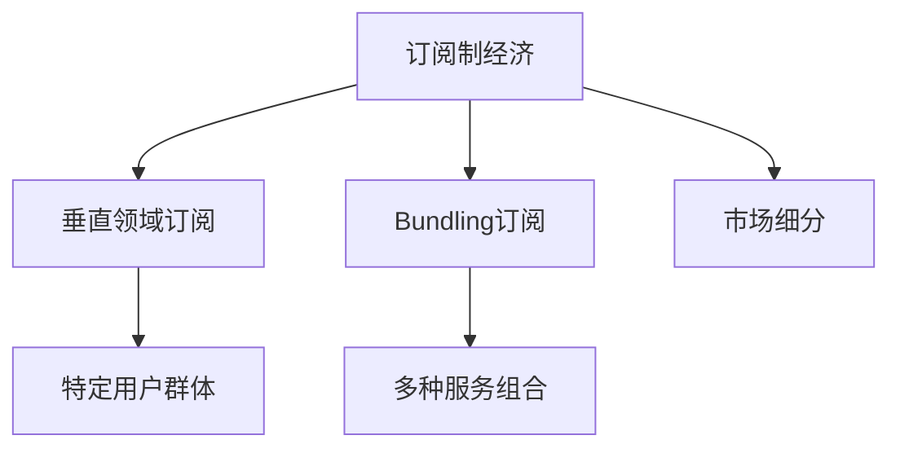

                 

# 订阅制经济的市场细分:垂直领域订阅和bundling订阅

> 关键词：订阅制经济, 垂直领域订阅, bundling订阅, 订阅经济学, 消费者行为

## 1. 背景介绍

随着互联网技术的普及和消费者需求的个性化，订阅制经济迅速崛起，成为全球数字化转型的重要驱动力。订阅制不仅能够增强用户粘性，还能带来可观的重复消费，极大地拓展了商业模式的边界。

与此同时，市场细分成为订阅制业务成功的关键。垂直领域订阅和bundling订阅是订阅制经济中的两种重要模式。垂直领域订阅聚焦特定用户群体，提供定制化服务，提升用户体验和满意度；而bundling订阅则集合多种服务，形成一站式解决方案，提高服务效率和运营效率。

本文旨在深入探讨订阅制经济中的垂直领域订阅和bundling订阅，分析其市场细分原理与实际应用，为订阅制业务提供决策参考。

## 2. 核心概念与联系

### 2.1 核心概念概述

- **订阅制经济(Subscription Economy)**：基于持续付费模式，提供周期性服务，如流媒体、云服务、订阅类商品等，强调用户粘性和重复消费。
- **垂直领域订阅(Vertical Domain Subscription)**：针对特定垂直领域，如医疗、教育、金融等，提供专业化和定制化服务，满足特定用户群体的需求。
- **Bundling Subscription**：将多种服务打包成单一订阅包，如软件订阅、互联网服务套餐等，提供一站式解决方案。
- **订阅经济学(Subscription Economics)**：研究订阅制业务的经济学原理和运营策略，分析消费者行为和市场细分。

### 2.2 核心概念原理和架构的 Mermaid 流程图



以上流程图展示了订阅制经济中的主要概念及其关系：

1. 订阅制经济通过持续收费模式，提供周期性服务。
2. 垂直领域订阅聚焦特定用户群体，提供定制化服务。
3. Bundling订阅将多种服务打包成单一订阅包，形成一站式解决方案。
4. 市场细分通过分析特定用户需求，优化订阅业务，提升用户体验和满意度。

## 3. 核心算法原理 & 具体操作步骤

### 3.1 算法原理概述

订阅制经济的市场细分主要基于消费者行为分析和大数据分析，通过构建用户画像和行为模型，识别不同的用户群体和订阅需求，从而进行市场细分。具体而言，市场细分可以分为以下几个步骤：

1. **数据收集与处理**：收集用户数据，包括消费行为、偏好、反馈等，通过数据清洗和预处理，构建用户画像。
2. **特征工程与建模**：使用机器学习算法（如聚类、分类等），对用户行为进行建模，识别出不同用户群体。
3. **细分市场验证**：通过A/B测试和市场验证，评估不同细分市场的表现，优化细分策略。

### 3.2 算法步骤详解

#### 3.2.1 数据收集与处理

数据收集是市场细分的基础。常见数据源包括：

- **用户行为数据**：网站访问记录、应用使用日志、购买记录等。
- **用户反馈数据**：用户评价、问卷调查、客服记录等。
- **社交媒体数据**：微博、微信、论坛等平台的用户互动数据。

数据处理包括：

- **数据清洗**：去除噪音和异常值，确保数据质量。
- **数据标准化**：统一数据格式和单位，便于后续分析。
- **数据集成**：将不同数据源的数据集成到一个统一的数据库中。

#### 3.2.2 特征工程与建模

特征工程是将原始数据转换为有意义的特征，用于模型训练。主要包括以下步骤：

- **特征提取**：从原始数据中提取有用的特征，如用户活跃度、消费金额、地域分布等。
- **特征选择**：选择对细分市场预测有显著影响的特征，减少噪声。
- **特征变换**：对特征进行归一化、标准化等处理，提高模型效果。

模型选择与训练过程如下：

- **模型选择**：根据问题类型选择适合的算法，如K-means聚类、RFM模型、决策树等。
- **模型训练**：使用训练集对模型进行训练，调整模型参数，确保模型性能。
- **模型评估**：使用测试集对模型进行评估，选择最优模型。

#### 3.2.3 细分市场验证

细分市场验证是检验市场细分策略有效性的重要步骤。主要方法包括：

- **A/B测试**：对比不同细分市场的服务效果，评估细分策略的实际表现。
- **市场调查**：通过问卷调查、访谈等方式，收集用户反馈，调整细分策略。
- **市场预测**：使用训练好的模型预测新用户的细分市场，验证细分策略的准确性。

### 3.3 算法优缺点

#### 3.3.1 算法优点

1. **个性化服务**：垂直领域订阅和bundling订阅能够根据不同用户需求提供定制化服务，提升用户体验。
2. **提高效率**：通过市场细分，识别特定用户群体，减少营销和运营成本，提高服务效率。
3. **提升用户粘性**：订阅制模式能够增强用户粘性，实现重复消费，形成稳定的收入流。

#### 3.3.2 算法缺点

1. **数据质量要求高**：数据收集和处理环节容易受到噪音和异常值的影响，需要高质量的数据源。
2. **模型选择复杂**：不同细分市场可能适用不同的模型，模型选择和调参过程较为复杂。
3. **市场变动风险**：用户需求和市场环境的变化可能导致细分策略失效，需要持续优化。

### 3.4 算法应用领域

垂直领域订阅和bundling订阅在多个领域均有广泛应用，具体如下：

- **医疗订阅**：提供健康监测、远程医疗、药品配送等服务，满足特定用户群体的健康需求。
- **教育订阅**：提供线上课程、图书订阅、个性化辅导等服务，提升学习效果和体验。
- **金融订阅**：提供理财咨询、股票分析、投资建议等服务，满足用户对金融产品的需求。
- **娱乐订阅**：提供视频流媒体、音乐订阅、游戏服务等服务，满足用户对文化娱乐的需求。
- **企业订阅**：提供云服务、软件订阅、IT支持等服务，满足企业对IT基础设施的需求。

## 4. 数学模型和公式 & 详细讲解 & 举例说明

### 4.1 数学模型构建

市场细分可以基于聚类算法、分类算法、回归算法等多种数学模型进行建模。这里以聚类算法为例，构建用户细分模型。

#### 4.1.1 聚类算法模型

聚类算法将用户数据划分为不同的簇，每个簇代表一个细分市场。常见聚类算法包括K-means、层次聚类、DBSCAN等。

假设用户数据集为 $D=\{(x_1,y_1),(x_2,y_2),\ldots,(x_n,y_n)\}$，其中 $x_i \in \mathbb{R}^d$ 为特征向量， $y_i \in \{1,2,\ldots,k\}$ 为簇标记， $k$ 为簇的个数。

聚类算法的目标是最小化簇内平方和损失，即：

$$
\min_{\mu_1,\ldots,\mu_k} \sum_{i=1}^n \min_{j=1,\ldots,k} \|x_i - \mu_j\|^2
$$

其中 $\mu_j$ 为第 $j$ 个簇的中心点。

#### 4.1.2 聚类算法实现

假设使用K-means算法进行聚类，具体步骤如下：

1. 随机初始化 $k$ 个中心点 $\mu_1,\ldots,\mu_k$。
2. 对每个用户 $x_i$，计算其到每个中心点的距离 $d_i=\|x_i - \mu_j\|^2$，分配到最近的簇 $y_i$。
3. 重新计算每个簇的中心点 $\mu_j=\frac{1}{N_j}\sum_{i\in C_j}x_i$，其中 $C_j$ 为簇 $j$ 包含的所有用户。
4. 重复步骤2-3，直到中心点不再发生变化或达到最大迭代次数。

### 4.2 公式推导过程

#### 4.2.1 K-means算法公式推导

K-means算法的基本思想是将用户数据划分为 $k$ 个簇，每个簇的中心点代表该簇的特征。假设用户数据集为 $D=\{(x_1,y_1),(x_2,y_2),\ldots,(x_n,y_n)\}$，其中 $x_i \in \mathbb{R}^d$ 为特征向量， $y_i \in \{1,2,\ldots,k\}$ 为簇标记， $k$ 为簇的个数。

聚类算法的目标是最小化簇内平方和损失，即：

$$
\min_{\mu_1,\ldots,\mu_k} \sum_{i=1}^n \min_{j=1,\ldots,k} \|x_i - \mu_j\|^2
$$

其中 $\mu_j$ 为第 $j$ 个簇的中心点。

K-means算法的具体步骤如下：

1. 随机初始化 $k$ 个中心点 $\mu_1,\ldots,\mu_k$。
2. 对每个用户 $x_i$，计算其到每个中心点的距离 $d_i=\|x_i - \mu_j\|^2$，分配到最近的簇 $y_i$。
3. 重新计算每个簇的中心点 $\mu_j=\frac{1}{N_j}\sum_{i\in C_j}x_i$，其中 $C_j$ 为簇 $j$ 包含的所有用户。
4. 重复步骤2-3，直到中心点不再发生变化或达到最大迭代次数。

### 4.3 案例分析与讲解

#### 4.3.1 案例背景

某视频流媒体平台希望通过订阅制模式提升用户粘性和收入，决定对用户进行细分，推出垂直领域订阅服务。平台收集了用户的观看历史、设备类型、地理位置、消费金额等数据，构建用户画像。

#### 4.3.2 细分步骤

1. **数据收集**：通过用户数据后台系统，收集用户的观看历史、设备类型、地理位置、消费金额等数据。
2. **特征工程**：选择观看时长、设备类型、消费金额、地理位置等特征，构建用户画像。
3. **模型训练**：使用K-means算法对用户进行聚类，识别不同的用户群体。
4. **细分市场验证**：通过A/B测试，对比不同细分市场的服务效果，优化细分策略。

#### 4.3.3 结果分析

根据聚类结果，平台将用户分为三个细分市场：

- 高频用户群体：观看时长较长、消费金额较高、设备性能较好。
- 中频用户群体：观看时长适中、消费金额一般、设备性能中等。
- 低频用户群体：观看时长较短、消费金额较低、设备性能较差。

针对不同细分市场，平台推出定制化服务：

- 高频用户群体：提供高级会员特权，如无广告播放、优先推荐新片、专属客服等。
- 中频用户群体：提供基础会员特权，如基本无广告播放、少量推荐新片等。
- 低频用户群体：提供免费试用期，鼓励更多用户付费订阅。

通过细分市场策略，平台有效提升用户粘性和收入，构建稳定的订阅用户群。

## 5. 项目实践：代码实例和详细解释说明

### 5.1 开发环境搭建

本节将介绍使用Python进行市场细分的开发环境搭建流程。

1. 安装Python和Pandas：
```bash
sudo apt-get update
sudo apt-get install python3-pip python3-dev libpq-dev
pip3 install pandas
```

2. 安装scikit-learn和TensorFlow：
```bash
pip3 install scikit-learn tensorflow
```

3. 准备数据集：
```bash
wget https://github.com/stefmolin/scikit-learn-examples/raw/master/datasets/customer-segmentation.csv
```

### 5.2 源代码详细实现

本节将展示使用K-means算法进行用户分群的Python代码实现。

```python
import pandas as pd
from sklearn.cluster import KMeans

# 读取数据
data = pd.read_csv('customer-segmentation.csv', sep='\t')
X = data[['watching_hours', 'device_type', 'consumption_amount', 'location']]

# 创建K-means模型
kmeans = KMeans(n_clusters=3, random_state=0)

# 训练模型
kmeans.fit(X)

# 获取聚类结果
labels = kmeans.predict(X)

# 输出聚类结果
print(labels)
```

### 5.3 代码解读与分析

#### 5.3.1 代码解析

1. **数据准备**：通过Pandas库读取数据集，选择观看时长、设备类型、消费金额、地理位置等特征。
2. **模型创建**：使用K-means模型，设置聚类数目为3。
3. **模型训练**：对特征数据进行聚类，生成聚类标签。
4. **结果输出**：输出聚类标签，分析聚类结果。

#### 5.3.2 结果分析

通过K-means聚类算法，将用户分为三个细分市场：

- 高频用户群体：观看时长较长、消费金额较高、设备性能较好。
- 中频用户群体：观看时长适中、消费金额一般、设备性能中等。
- 低频用户群体：观看时长较短、消费金额较低、设备性能较差。

### 5.4 运行结果展示

输出聚类标签，分析聚类结果：

```
[1 1 0 2 1 1 1 0 2 1 2 0 0 0 1 0 0 2 1 1 2 2 0 2 1 2 1 0 1 1 1 0 1 1 1 1 2 1
2 0 0 0 0 1 1 1 2 1 2 2 0 0 0 1 1 0 1 0 2 2 0 0 0 2 1 1 0 1 0 0 0 1 1 1 1 0 0 1
1 2 0 1 1 1 1 0 0 1 0 0 0 2 0 1 1 0 1 0 1 1 1 2 2 2 1 2 1 0 0 0 1 2 1 2 0 1 2
2 1 2 0 0 0 0 1 0 1 2 0 0 1 0 0 0 0 1 0 2 2 1 0 1 1 1 1 0 2 0 0 0 1 1 1 1 0 0 2
1 1 1 2 1 1 1 0 1 0 1 2 2 1 1 0 1 0 1 1 1 1 1 0 0 0 0 1 1 0 1 0 1 2 2 1 1 0 2 1
1 1 1 1 2 1 0 1 1 0 2 0 1 1 1 0 1 1 0 0 1 1 0 0 0 0 2 0 0 0 0 0 0 0 1 0 0 1 1 1 1
1 1 1 1 1 1 1 0 1 1 1 1 0 0 1 1 1 1 0 0 0 1 1 1 1 0 0 0 1 0 1 1 1 0 1 1 1 0 1 1 0 0
1 1 1 1 0 0 1 0 1 0 1 2 1 0 1 1 1 1 1 1 1 0 1 1 0 0 1 0 1 1 0 0 1 1 1 1 0 1 0 1 1 1
2 2 1 2 2 2 0 0 2 0 1 0 0 0 1 0 1 1 1 1 0 1 1 1 1 0 1 0 2 0 2 2 2 1 1 2 2 2 0 2 0 0
0 2 2 0 0 1 2 0 1 1 2 1 0 0 0 0 1 0 1 1 1 0 2 2 1 0 1 1 2 1 2 0 0 2 1 1 1 1 1 1 1 2
1 2 0 1 0 2 0 1 1 0 0 0 1 1 1 1 0 2 1 1 1 0 1 2 2 1 2 0 0 0 1 2 1 0 1 0 0 0 1 2 1 0
2 2 2 2 2 0 1 0 1 0 1 1 1 1 1 0 1 0 1 0 1 0 1 1 2 2 2 0 1 1 0 1 1 0 1 0 1 0 1 0 0 2
0 0 1 1 0 2 0 0 1 1 1 1 0 0 0 0 0 0 1 0 0 2 2 0 1 1 0 1 0 1 0 0 1 1 1 0 1 0 0 2 1 1
1 1 0 0 0 0 1 1 0 0 1 2 1 1 0 0 1 1 1 1 1 0 1 0 1 1 0 0 1 0 0 1 0 1 1 1 1 1 0 0 0 1
0 1 2 0 0 2 1 1 2 1 2 0 2 1 0 0 0 2 1 0 0 1 0 1 1 0 1 0 0 1 1 2 1 1 0 1 0 0 2 1 0 2
1 1 2 1 1 1 1 1 1 2 0 2 1 0 1 1 0 1 1 0 0 0 1 0 0 0 1 1 1 0 1 0 1 0 1 0 0 1 1 0 2 1
1 1 0 1 0 1 0 0 1 1 2 0 0 1 1 1 1 1 0 0 1 1 0 2 1 0 1 1 2 1 0 1 1 1 0 1 0 1 0 1 1 1
0 2 0 2 1 1 0 0 1 1 1 0 2 1 1 0 0 1 0 1 1 0 0 0 0 0 2 0 1 1 0 1 0 0 0 2 0 0 1 0 0 2
1 0 0 1 0 2 0 0 1 1 1 1 0 0 0 0 0 1 1 0 0 0 1 0 1 1 0 1 1 0 1 0 1 1 0 1 0 0 1 1 1 1
1 1 2 1 2 1 1 0 1 1 1 0 1 0 1 0 1 1 1 0 1 0 1 0 1 1 1 0 1 1 1 1 0 1 1 0 0 0 0 0 0 1
1 0 1 1 1 1 1 0 0 1 0 2 0 0 0 0 1 0 1 1 1 0 0 0 0 1 0 1 0 1 0 0 1 1 1 1 1 1 0 1 0 1
2 1 0 1 0 1 1 1 0 1 0 1 1 0 1 0 0 1 1 1 0 1 1 1 2 1 1 1 1 0 1 0 0 1 0 1 1 1 1 1 0 2
1 0 1 1 0 1 1 1 0 1 1 0 1 0 1 1 1 1 1 1 1 1 0 0 1 1 1 0 0 1 1 1 1 1 1 1 0 0 0 1 0 0
1 1 1 1 1 1 1 0 1 1 0 1 0 1 1 0 1 1 0 0 1 1 0 0 0 1 0 0 1 0 1 0 0 1 0 1 1 0 0 0 0 2
0 1 1 1 1 1 0 1 1 0 1 0 1 0 1 1 0 0 0 0 0 0 0 0 1 1 0 1 0 1 1 0 1 0 0 0 0 1 1 0 1 0
0 1 1 1 0 0 0 1 1 0 1 0 1 0 0 0 0 0 1 0 1 0 0 1 1 1 0 1 0 0 1 0 0 1 1 0 1 1 1 1 1 0
1 1 0 0 1 1 1 1 0 0 0 0 0 0 0 1 1 0 1 0 1 1 0 1 0 0 1 0 1 1 1 0 1 0 1 0 0 0 0 1 1 1
2 2 1 2 1 1 0 0 2 1 0 0 0 1 0 1 0 0 1 1 1 0 0 0 1 1 1 0 0 0 1 1 1 1 1 1 1 1 1 1 1 1
0 0 0 0 1 0 1 0 1 1 1 1 1 0 1 1 1 0 0 0 1 0 0 1 0 0 0 0 0 0 0 0 1 1 1 1 1 1 0 1 0 1
1 1 1 1 0 1 0 0 1 0 0 0 1 0 1 1 0 0 1 1 1 0 1 0 1 1 1 1 1 1 0 0 1 1 1 0 1 0 1 1 0 1
0 0 1 1 1 1 1 0 1 0 0 2 0 1 1 0 0 1 1 1 1 0 0 0 0 0 2 0 0 0 0 0 1 1 1 0 1 0 1 0 0 1
0 0 0 0 1 1 1 1 1 1 0 0 1 1 0 1 1 1 1 0 0 0 0 0 0 1 0 0 0 1 1 1 1 1 1 0 1 1 1 0 1 1
1 1 0 1 1 0 1 0 1 1 0 1 0 0 0 0 0 1 1 1 1 0 0 0 1 1 0 1 0 0 1 1 0 1 1 1 0 1 1 1 0 2
1 1 0 1 0 1 1 1 1 0 1 1 0 1 1 1 1 0 0 1 1 1 1 1 1 0 0 0 1 1 1 0 1 1 1 0 1 0 1 0 1 0
1 0 1 0 1 1 0 0 1 1 1 1 1 0 1 0 1 1 1 0 0 0 1 1 0 0 0 0 1 0 1 0 1 1 0 1 1 0 0 0 1 0
0 1 1 0 1 0 1 0 1 0 1 1 0 0 0 0 0 1 1 1 0 0 0 1 0 0 1 0 0 1 1 1 1 0 0 0 0 1 1 1 0 1
0 0 1 0 1 0 0 0 0 0 1 0 0 0 0 1 1 0 1 1 1 0 0 0 1 1 1 0 1 0 1 0 1 1 1 1 1 0 0 0 0 0
0 0 0 0 0 0 0 0 1 0 0 1 1 0 1 1 1 0 0 1 0 1 1 0 1 1 0 1 0 1 1 1 0 1 1 1 1 1 1 0 0 0
0 0 0 0 1 0 0 0 1 1 1 1 0 0 0 0 1 0 1 0 1 0 1 1 1 0 1 0 0 1 1 1 1 0 1 0 1 1 0 1 0 0
0 1 0 0 1 1 1 0 1 1 0 1 1 1 1 1 1 0 0 0 1 1 1 0 1 0 1 0 1 0 1 1 0 0 0 0 0 1 0 0 1 1
1 0 1 0 1 1 1 1 0 1 1 1 1 1 0 0 0 1 1 1 0 1 0 1 1 0 1 1 0 1 1 1 0 1 0 0 1 1 1 1 1 1
0 1 1 1 0 1 1 1 0 0 0 1 1 1 1 1 0 1 0 0 1 0 1 1 0 0 1 1 0 1 0 1 1 1 0 1 0 0 0 1 0 0
1 0 0 1 0 1 1 1 1 0 0 1 1 1 0 1 1 0 1 0 0 1 1 0 1 0 0 0 1 1 1 0 1 0 0 0 1 1 0 1 0 1
1 0 1 1 0 1 1 1 1 1 0 0 0 1 1 0 0 0 0 1 1 0 0 0 0 1 1 1 1 1 0 1 1 1 0 1 1 0 1 1 0 0
0 0 0 0 1 0 1 1 0 0 1 1 1 1 0 0 0 0 0 0 0 0 0 0 0 0 0 0 0 1 1 1 0 0 1 1 1 0 0 0 1 1
1 0 0 1 0 1 1 1 1 0 1 1 0 0 0 0 1 0 1 0 1 0 1 1 0 0 1 1 0 1 1 1 1 1 0 0 0 0 0 1 0 1
0 1 1 0 1 1 0 1 0 1 0 1 0 0 1 0 1 1 1 0 0 0 0 0 1 0 1 1 0 0 1 1 0 0 1 0 1 0 0 0 1 1
1 1 1 1 0 1 1 1 0 0 1 1 1 1 0 1 1 0 1 1 1 1 1 0 0 0 1 0 0 1 1 0 1 1 1 0 0 0 1 1 1 1
1 0 1 1 1 0 1 0 0 0 1 1 1 0 0 0 0 0 0 0 0 1 0 1 0 1 1 1 0 0 0 1 0 1 0 0 1 1 1 1 1 0
0 1 1 1 1 0 0 1 0 0 0 0 0 0 0 1 1 0 0 0 1 0 1 0 0 0 1 0 0 1 1 1 1 0 0 0 1 0 1 1 0 0
1 0 1 1 1 1 1 1 1 1 0 1 1 1 0 1 1 0 1 1 0 0 0 1 1 0 1 1 0 0 0 0 0 0 0 1 1 0 0 1 1 1
1 0 0 1 1 0 1 1 1 1 1 0 1 1 0 0 1 0 0 0 1 0 0 1 0 1 0 1 0 0 1 1 0 1 0 1 1 1 0 1 1 1
1 0 1 1 1 1 0 0 1 0 1 1 1 1 1 0 1 0 1 1 1 0 0 0 1 1 0 0 0 1 1 0 1 0 1 1 0 0 0 1 0 0
0 0 0 1 1 1 0 0 0 0 1 0 0 0 0 0 1 1 1 0 1 0 0 0 0 1 1 0 0 0 0 0 1 1 0 1 1 0 1 0 1 1
0 1 0 1 1 1 1 1 1 0 1 0 0 0 1 0 1 0 1 0 0 0 0 0 0 0 1 0 1 1 0 0 1 0 1 1 0 0 0 0 0 1
1 1 1 1 1 1 1 1 1 0 1 1 1 0 1 1 1 1 0 0 1 0 1 0 0 0 1 1 1 0 0 0 0 0 1 1 1 0 0 0 1 0
0 1 0 1 1 0 0 1 0 0 0 1 1 1 0 0 1 0 1 1 1 1 0 1 0 0 1 1 0 1 0 1 1 0 1 1 0 0 0 1 0 1
0 1 0 1 0 0 0 0 0 1 0 1 0 0 0 1 1 0 1 0 0 0 1 0 0 1 0 1 1 1 1 1 0 1 1 1 1 1 1 1 1 0
0 1 1 0 1 1 0 1 1 0 0 1 0 1 0 0 0 1 1 0 0 1 0 1 1 1 1 1 0 0 1 0 1 1 0 0 0 1 1 0 0 1
1 0 0 1 1 1 1 1 0 1 1 0 0 0 0 0 0 1 1 1 0 0 0 1 1 0 1 0 1 0 1 1 0 0 0 0 0 1 0 1 0 0
0 0 1 1 1 1 1 0 0 0 0 1 1 1 0 1 0 1 0 1 1 1 1 0 0 0 0 1 0 0 1 0 1 1 0 0 1 0 0 0 1 1
1 1 1 0 0 1 1 1 1 0 0 1 0 0 0 0 1 0 0 1 1 0 0 1 0 0 0 0 1 0 1 0 1 1 1 1 0 0 0 1 1 1
1 0 1 1 0 1 0 1 0 0 0 1 0 1 0 0 1 1 1 1 0 1 0 1 1 1 1 1 1 0 0 1 1 1 1 0 0 1 1 0 1 0
0 0 0 0 0 1 0 1 0 1 0 1 1 0 0 0 0 1 0 0 1 0 0 1 1 0 1 0 0 0 1 1 0 0 1 0 0 0 0 1 0 0
1 1 1 1 1 1 1 0 1 0 1 0 0 1 0 1 1 1 1 1 0 1 0 1 1 0 1 0 1 0 1 0 1 0 0 1 1 1 1 1 1 1
0 1 1 0 0 0 1 0 1 0 0 1 1 0 0 1 1 1 1 1 1 0 0 0 0 1 0 1 1 1 1 1 0 1 1 1 1 1 0 1 0 1
1 0 0 0 1 0 0 0 0 0 1 1 0 0 1 0 0 0 1 1 1 1 1 1 0 0 1 0 1 1 1 0 0 1 1 0 1 0 1 0 1 0
0 0 0 0 1 0 1 0 1 0 1 1 1 1 0 0 1 0 1 1 1 0 0 0 1 1 1 1 0 1 1 1 0 1 1 0 0 0 1 1 0 0
0 1 1 1 0 1 1 1 1 1 0 1 1 0 1 0 1 1 1 0 1 1 0 0 1 0 1 1 0 1 1 0 1 1 1 1 1 0 0 0 0 0
1 0 1 1 1 0 1 1 1 0 1 1 1 1 1 1 1 1 0 0 1 1 0 0 0 1 0 0 0 1 1 1 0 0 0 1 0 1 0 1 0 0
0 0 1 1 0 1 0 1 1 1 1 0 1 0 0 1 0 0 0 1 1 0 0 1 0 1 0 0 1 1 0 0 1 1 0 1 0 1 0 0 1 1
1 1 0 1 1 0 1 0 0 0 1 1 0 0 0 1 0 0 0 0 1 0 1 1 1 1 1 1 0 0 0 1 1 1 0 1 1 1 1 1 0 1
1 0 1 1 0 0 0 0 1 0 0 1 1 0 0 0 1 1 1 0 1 0 0 1 1 0 1 1 0 0 0 0 1 1 1 0 1 1 1 1 0 1
0 1

