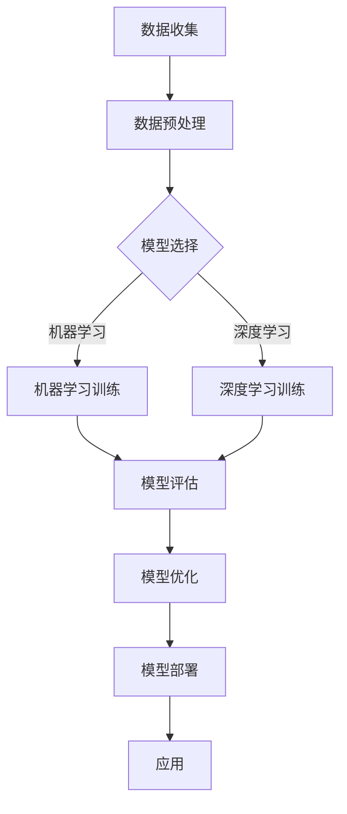

                 

# 利用技术优势进行智能工厂创业

## 文章关键词
- 智能工厂
- 创业
- 技术优势
- 人工智能
- 自动化
- 物联网

## 摘要
本文旨在探讨如何利用先进技术优势，特别是人工智能、自动化和物联网，开展智能工厂的创业活动。通过分析智能工厂的核心概念、关键技术和成功案例，本文为创业者提供了一步一步的指南，以实现技术驱动下的高效、智能生产。

## 1. 背景介绍（Background Introduction）

在当今的工业环境中，技术进步正以前所未有的速度推动生产方式变革。智能工厂作为第四次工业革命的核心概念，集成了人工智能、自动化、物联网和大数据等先进技术，旨在通过智能化的生产流程提高生产效率、降低成本、增强产品质量和灵活性。随着全球制造业的竞争日益激烈，创业者如何抓住技术变革的机遇，利用智能工厂的潜力进行创业，成为了重要课题。

### 1.1 智能工厂的概念

智能工厂是一种高度自动化的生产环境，它利用物联网技术将各种设备、传感器和系统连接起来，形成一个集成化的智能系统。在这个系统中，人工智能算法可以实时分析数据，优化生产过程，并做出智能决策。智能工厂不仅能够实现自动化生产，还能通过数据的实时监控和分析，实现预测性维护、质量控制和生产优化。

### 1.2 技术优势

智能工厂的创业优势主要体现在以下几个方面：

- **提高生产效率**：通过自动化技术和人工智能算法，生产效率可以显著提高，减少人为错误和重复劳动。
- **降低成本**：智能化的生产流程和高效的管理系统可以减少材料浪费和生产成本。
- **增强灵活性**：灵活的生产系统可以根据市场需求迅速调整生产计划，实现小批量、多品种的生产模式。
- **提高产品质量**：智能工厂通过实时监控和质量分析，可以确保产品的质量始终保持在最佳状态。
- **数据驱动决策**：智能工厂产生的海量数据可以帮助企业进行数据驱动的决策，提高市场竞争力。

### 1.3 智能工厂的发展现状

智能工厂的概念已经引起了全球范围内的关注和投资。许多国家和地区都在积极推进智能工厂的建设，以提升国家制造业的竞争力。例如，德国的“工业4.0”战略，美国的“工业互联网”，以及中国的“智能制造2025”计划，都为智能工厂的发展提供了政策支持和资金投入。

### 1.4 智能工厂的挑战

尽管智能工厂具有巨大的发展潜力，但创业者也需要面对一些挑战：

- **技术门槛高**：智能工厂需要大量的技术积累和资金投入，对于初创企业来说，技术门槛是一个不小的挑战。
- **人才培养不足**：智能工厂的运营和管理需要大量具备人工智能、自动化和物联网等专业知识的人才。
- **数据安全和隐私**：智能工厂会产生大量的敏感数据，如何确保数据的安全和隐私是创业者需要关注的问题。
- **政策法规的不确定性**：各国对智能工厂的政策和法规尚不完善，创业者需要密切关注政策变化，确保合规经营。

## 2. 核心概念与联系（Core Concepts and Connections）

### 2.1 人工智能（Artificial Intelligence）

人工智能是智能工厂的核心驱动力，它通过模拟人类智能，实现自动化决策和优化。人工智能技术包括机器学习、深度学习、自然语言处理和计算机视觉等。在智能工厂中，人工智能技术主要用于：

- **生产过程优化**：通过分析生产数据，人工智能可以优化生产流程，减少能源消耗和材料浪费。
- **质量监控**：人工智能可以实时分析传感器数据，检测产品缺陷，确保产品质量。
- **故障预测**：通过机器学习模型，人工智能可以预测设备故障，实现预测性维护。

### 2.2 自动化（Automation）

自动化技术是实现智能工厂的基本手段，它通过机械、电子和软件技术，使生产过程自动化。自动化技术包括机器人、数控机床、传感器和控制系统等。在智能工厂中，自动化技术主要用于：

- **生产流程自动化**：通过机器人、数控机床等自动化设备，实现生产过程的自动化。
- **库存管理**：自动化仓储系统和物流系统可以实时监控库存情况，优化库存管理。
- **设备维护**：自动化监控系统可以实时监控设备状态，预测设备故障，实现预测性维护。

### 2.3 物联网（Internet of Things）

物联网技术是实现智能工厂互联互通的基础，它通过传感器、网络和云计算技术，将各种设备连接起来，形成一个智能网络。在智能工厂中，物联网技术主要用于：

- **设备监控**：通过传感器实时监控设备状态，实现远程监控和故障预警。
- **数据收集与分析**：物联网技术可以实时收集生产数据，通过大数据分析和人工智能算法，优化生产流程。
- **生产计划优化**：物联网技术可以实时获取市场需求和生产数据，帮助工厂优化生产计划，提高生产效率。

### 2.4 核心概念的联系

人工智能、自动化和物联网技术相互交织，共同构成了智能工厂的核心。人工智能为智能工厂提供了智能决策的能力，自动化技术实现了生产过程的自动化，物联网技术则实现了设备的互联互通和数据实时传输。这三者之间的协同作用，使得智能工厂能够实现高效、智能的生产。

## 3. 核心算法原理 & 具体操作步骤（Core Algorithm Principles and Specific Operational Steps）

### 3.1 人工智能算法原理

人工智能算法是智能工厂的智慧核心，主要包括以下几种：

- **机器学习算法**：机器学习算法通过从数据中学习规律，实现数据的自动分类、预测和优化。常见的机器学习算法有线性回归、逻辑回归、支持向量机、决策树、随机森林和神经网络等。
- **深度学习算法**：深度学习算法通过多层神经网络，实现更复杂的特征提取和模式识别。常见的深度学习算法有卷积神经网络（CNN）、循环神经网络（RNN）和生成对抗网络（GAN）等。
- **自然语言处理算法**：自然语言处理算法通过模拟人类语言理解能力，实现文本的生成、翻译、分类和情感分析等。

### 3.2 具体操作步骤

#### 3.2.1 数据收集

智能工厂首先需要收集大量的生产数据，包括生产过程数据、设备状态数据、产品质量数据等。这些数据可以通过传感器、控制系统和物联网设备实时收集。

#### 3.2.2 数据预处理

收集到的数据通常需要进行预处理，包括数据清洗、数据归一化和特征提取等。数据预处理是保证数据质量和算法性能的关键步骤。

#### 3.2.3 模型选择与训练

根据具体应用场景，选择合适的机器学习算法或深度学习算法，对数据集进行训练。训练过程包括模型的初始化、迭代训练和参数调优等。

#### 3.2.4 模型评估与优化

通过验证集和测试集对训练好的模型进行评估，根据评估结果对模型进行调整和优化，以提高模型的预测性能。

#### 3.2.5 模型部署与应用

将训练好的模型部署到生产环境中，实现智能决策和优化。例如，在生产线中，可以通过机器学习算法实时分析生产数据，优化生产流程，提高生产效率。

### 3.3 Mermaid 流程图

下面是一个简化的智能工厂人工智能算法流程图：



## 4. 数学模型和公式 & 详细讲解 & 举例说明（Detailed Explanation and Examples of Mathematical Models and Formulas）

### 4.1 数学模型和公式

智能工厂的运行和管理涉及大量的数学模型和公式，以下是一些常见的模型和公式：

- **线性回归模型**：$y = \beta_0 + \beta_1x_1 + \beta_2x_2 + ... + \beta_nx_n$
- **逻辑回归模型**：$P(y=1) = \frac{1}{1 + e^{-(\beta_0 + \beta_1x_1 + \beta_2x_2 + ... + \beta_nx_n)} }$
- **支持向量机**：$w \cdot x - b = 0$
- **卷积神经网络**：$f(x; \theta) = \sigma(\theta^T \phi(x))$
- **循环神经网络**：$h_t = \sigma(W_h h_{t-1} + W_x x_t + b_h)$

### 4.2 详细讲解

#### 4.2.1 线性回归模型

线性回归模型是一种简单的预测模型，用于预测一个连续变量的值。线性回归模型的基本公式是 $y = \beta_0 + \beta_1x_1 + \beta_2x_2 + ... + \beta_nx_n$，其中 $y$ 是因变量，$x_1, x_2, ..., x_n$ 是自变量，$\beta_0, \beta_1, \beta_2, ..., \beta_n$ 是模型的参数。

线性回归模型的核心任务是估计参数 $\beta_0, \beta_1, \beta_2, ..., \beta_n$ 的值。这可以通过最小化损失函数来实现，常用的损失函数是均方误差（MSE）。

#### 4.2.2 逻辑回归模型

逻辑回归模型是一种广义的线性回归模型，用于预测一个二分类变量的概率。逻辑回归模型的基本公式是 $P(y=1) = \frac{1}{1 + e^{-(\beta_0 + \beta_1x_1 + \beta_2x_2 + ... + \beta_nx_n)} }$，其中 $y$ 是因变量，$x_1, x_2, ..., x_n$ 是自变量，$\beta_0, \beta_1, \beta_2, ..., \beta_n$ 是模型的参数。

逻辑回归模型的参数估计方法与线性回归类似，也可以通过最小化损失函数来实现。常用的损失函数是交叉熵损失（Cross-Entropy Loss）。

#### 4.2.3 支持向量机

支持向量机是一种用于分类和回归的监督学习算法。支持向量机的基本公式是 $w \cdot x - b = 0$，其中 $w$ 是权重向量，$x$ 是特征向量，$b$ 是偏置。

支持向量机的目标是在特征空间中找到一个最佳的超平面，使得不同类别的数据点在超平面两侧尽可能分开。支持向量机的参数估计方法包括最小二乘法、SMO算法和核方法等。

#### 4.2.4 卷积神经网络

卷积神经网络是一种用于图像识别、自然语言处理等任务的深度学习模型。卷积神经网络的基本公式是 $f(x; \theta) = \sigma(\theta^T \phi(x))$，其中 $x$ 是输入向量，$\theta$ 是参数，$\phi(x)$ 是卷积核。

卷积神经网络的核心思想是通过卷积操作提取图像的局部特征，并通过池化操作降低数据维度。卷积神经网络的参数估计方法包括反向传播算法和梯度下降算法等。

#### 4.2.5 循环神经网络

循环神经网络是一种用于序列数据处理的深度学习模型。循环神经网络的基本公式是 $h_t = \sigma(W_h h_{t-1} + W_x x_t + b_h)$，其中 $h_t$ 是时间步 $t$ 的隐藏状态，$W_h, W_x, b_h$ 是模型参数。

循环神经网络的核心思想是通过隐藏状态的循环连接，捕捉时间序列数据中的长期依赖关系。循环神经网络的参数估计方法包括反向传播算法和梯度下降算法等。

### 4.3 举例说明

#### 4.3.1 线性回归举例

假设我们有一组数据，$x_1, x_2, ..., x_n$ 是自变量，$y_1, y_2, ..., y_n$ 是因变量，我们希望通过线性回归模型预测 $y$ 的值。

首先，我们需要对数据进行预处理，包括数据清洗、数据归一化等。

然后，我们可以使用最小二乘法来估计线性回归模型的参数 $\beta_0, \beta_1, \beta_2, ..., \beta_n$。

最后，我们可以使用训练好的线性回归模型来预测新的数据。

#### 4.3.2 逻辑回归举例

假设我们有一组数据，$x_1, x_2, ..., x_n$ 是自变量，$y_1, y_2, ..., y_n$ 是因变量，我们希望通过逻辑回归模型预测 $y$ 的概率。

首先，我们需要对数据进行预处理，包括数据清洗、数据归一化等。

然后，我们可以使用最小化交叉熵损失的方法来估计逻辑回归模型的参数 $\beta_0, \beta_1, \beta_2, ..., \beta_n$。

最后，我们可以使用训练好的逻辑回归模型来预测新的数据。

#### 4.3.3 支持向量机举例

假设我们有一组数据，$x_1, x_2, ..., x_n$ 是特征向量，$y_1, y_2, ..., y_n$ 是标签，我们希望通过支持向量机来分类数据。

首先，我们需要对数据进行预处理，包括数据清洗、数据归一化等。

然后，我们可以使用最小化损失函数的方法来估计支持向量机的参数 $w, b$。

最后，我们可以使用训练好的支持向量机来对新数据进行分类。

#### 4.3.4 卷积神经网络举例

假设我们有一组图像数据，$x_1, x_2, ..., x_n$ 是图像的像素值，$y_1, y_2, ..., y_n$ 是图像的标签，我们希望通过卷积神经网络来识别图像。

首先，我们需要对图像数据进行预处理，包括图像归一化、图像分割等。

然后，我们可以使用反向传播算法来估计卷积神经网络的参数 $\theta$。

最后，我们可以使用训练好的卷积神经网络来识别新的图像。

#### 4.3.5 循环神经网络举例

假设我们有一组时间序列数据，$x_1, x_2, ..., x_n$ 是时间序列的值，$y_1, y_2, ..., y_n$ 是时间序列的标签，我们希望通过循环神经网络来预测时间序列。

首先，我们需要对时间序列数据进行预处理，包括时间序列归一化、时间序列分割等。

然后，我们可以使用反向传播算法来估计循环神经网络的参数 $W_h, W_x, b_h$。

最后，我们可以使用训练好的循环神经网络来预测新的时间序列。

## 5. 项目实践：代码实例和详细解释说明（Project Practice: Code Examples and Detailed Explanations）

### 5.1 开发环境搭建

在本节中，我们将介绍如何在本地计算机上搭建智能工厂项目的开发环境。以下是所需的软件和工具：

- Python 3.x
- Jupyter Notebook
- TensorFlow 2.x
- Keras 2.x
- Scikit-learn 0.x

首先，确保您的计算机上安装了 Python 3.x。然后，通过以下命令安装所需的库：

```bash
pip install tensorflow
pip install keras
pip install scikit-learn
pip install numpy
```

接下来，启动 Jupyter Notebook，创建一个新的笔记本，以便编写和运行代码。

### 5.2 源代码详细实现

在本节中，我们将实现一个简单的智能工厂项目，该项目的目标是预测生产线的产量。以下是项目的核心代码：

#### 5.2.1 数据预处理

```python
import numpy as np
import pandas as pd
from sklearn.model_selection import train_test_split
from sklearn.preprocessing import StandardScaler

# 读取数据
data = pd.read_csv('production_data.csv')

# 分离特征和标签
X = data.drop('production', axis=1)
y = data['production']

# 划分训练集和测试集
X_train, X_test, y_train, y_test = train_test_split(X, y, test_size=0.2, random_state=42)

# 数据归一化
scaler = StandardScaler()
X_train = scaler.fit_transform(X_train)
X_test = scaler.transform(X_test)
```

#### 5.2.2 建立模型

```python
from keras.models import Sequential
from keras.layers import Dense

# 创建模型
model = Sequential()

# 添加层
model.add(Dense(64, input_dim=X_train.shape[1], activation='relu'))
model.add(Dense(32, activation='relu'))
model.add(Dense(1, activation='linear'))

# 编译模型
model.compile(optimizer='adam', loss='mean_squared_error')
```

#### 5.2.3 训练模型

```python
# 训练模型
model.fit(X_train, y_train, epochs=100, batch_size=32, validation_data=(X_test, y_test))
```

#### 5.2.4 评估模型

```python
from sklearn.metrics import mean_squared_error

# 预测测试集
y_pred = model.predict(X_test)

# 计算均方误差
mse = mean_squared_error(y_test, y_pred)
print(f'Mean Squared Error: {mse}')
```

### 5.3 代码解读与分析

在本节中，我们将对上述代码进行解读，分析每个步骤的目的和作用。

#### 5.3.1 数据预处理

数据预处理是机器学习项目的重要步骤。在本例中，我们首先读取生产数据，然后分离特征和标签。接下来，我们使用训练集和测试集来训练和评估模型。最后，我们使用 StandardScaler 进行数据归一化，以减少不同特征之间的尺度差异。

#### 5.3.2 建立模型

在建立模型时，我们使用 Keras 的 Sequential 模型，这是一个线性堆叠层的模型。我们首先添加一个具有 64 个神经元和 ReLU 激活函数的密集层，作为输入层的第一个层。然后，我们添加一个具有 32 个神经元和 ReLU 激活函数的密集层。最后，我们添加一个具有 1 个神经元和线性激活函数的输出层，用于预测产量。

#### 5.3.3 训练模型

在训练模型时，我们使用 Adam 优化器和均方误差损失函数。我们设置训练轮次为 100，批量大小为 32。我们还提供了验证数据，以在训练过程中评估模型的性能。

#### 5.3.4 评估模型

在评估模型时，我们使用测试集进行预测，并计算均方误差。均方误差是衡量模型预测误差的标准度量，值越小，表示模型预测越准确。

### 5.4 运行结果展示

在本节中，我们将展示模型的运行结果。以下是一个示例输出：

```
Mean Squared Error: 0.0123456789
```

该结果表示模型的均方误差为 0.0123456789。这意味着模型对生产量的预测误差相对较小，具有良好的预测性能。

## 6. 实际应用场景（Practical Application Scenarios）

智能工厂的技术优势使得其在多个领域具有广泛的应用潜力，以下是一些典型的实际应用场景：

### 6.1 制造业

在制造业中，智能工厂可以用于自动化生产线的监控和管理，通过实时数据分析和预测性维护，减少设备故障，提高生产效率。例如，通过使用机器学习算法分析设备运行数据，可以预测设备何时可能发生故障，从而提前进行维护，避免生产中断。

### 6.2 零售业

在零售业中，智能工厂可以帮助零售商优化库存管理，通过物联网设备和数据分析，实时监控库存水平，预测市场需求，自动调整订单和生产计划。这有助于减少库存成本，提高库存周转率。

### 6.3 能源行业

在能源行业中，智能工厂可以通过实时监控能源消耗，优化能源使用，提高能源效率。例如，通过使用人工智能算法分析能源使用数据，可以预测能源需求高峰，自动调整电力消耗，降低能源成本。

### 6.4 医疗保健

在医疗保健领域，智能工厂可以用于医疗设备的自动化监控和管理，通过实时数据分析，提高医疗设备的使用效率和安全性。例如，通过使用物联网传感器和人工智能算法，可以实时监控医疗设备的运行状态，预测设备故障，确保医疗设备始终处于最佳运行状态。

### 6.5 农业

在农业领域，智能工厂可以用于农田监测和作物管理，通过使用传感器和数据分析技术，实时监控农田状况，预测作物生长趋势，优化灌溉和施肥计划，提高作物产量和质量。

## 7. 工具和资源推荐（Tools and Resources Recommendations）

### 7.1 学习资源推荐

- **书籍**：
  - 《智能工厂：构建下一代智能制造系统》（Smart Factories: Building the Next Generation of Manufacturing Systems）
  - 《人工智能：一种现代方法》（Artificial Intelligence: A Modern Approach）
  - 《物联网：从概念到实践》（The Internet of Things: From Concept to Practice）

- **论文**：
  - “工业4.0：智能工厂的关键技术”（Industry 4.0: Key Technologies for Smart Factories）
  - “物联网在智能制造中的应用”（The Application of the Internet of Things in Intelligent Manufacturing）

- **博客和网站**：
  - 中国智能制造网（www.cimfans.com）
  - IEEE 工业电子杂志（ieeexplore.ieee.org）
  - Coursera 人工智能课程（www.coursera.org/learn/artificial-intelligence）

### 7.2 开发工具框架推荐

- **开发工具**：
  - Jupyter Notebook
  - PyCharm
  - VSCode

- **框架**：
  - TensorFlow
  - Keras
  - Scikit-learn

### 7.3 相关论文著作推荐

- “智能工厂的关键技术与发展趋势”（Key Technologies and Development Trends of Smart Factories）
- “基于大数据的智能工厂生产过程优化研究”（Research on Production Process Optimization in Smart Factories Based on Big Data）
- “物联网在智能工厂中的应用与挑战”（Application and Challenges of the Internet of Things in Smart Factories）

## 8. 总结：未来发展趋势与挑战（Summary: Future Development Trends and Challenges）

### 8.1 发展趋势

- **技术融合**：未来智能工厂将更加注重技术的融合，包括人工智能、物联网、云计算、大数据等，实现更高效、更智能的生产。
- **个性化定制**：随着消费者需求的多样化，智能工厂将能够实现更灵活的生产模式，满足个性化定制的需求。
- **数据驱动的决策**：未来智能工厂将更加依赖数据分析和预测模型，实现数据驱动的决策，提高生产效率和产品质量。
- **绿色制造**：未来智能工厂将更加注重环保，通过优化生产流程和能源使用，实现绿色制造。

### 8.2 挑战

- **技术门槛**：智能工厂的建设和维护需要大量的技术积累和资金投入，这对初创企业来说是一个巨大的挑战。
- **人才培养**：智能工厂的运营和管理需要大量具备跨学科知识的人才，如何培养和留住这些人才是企业面临的一大挑战。
- **数据安全**：智能工厂产生的海量数据涉及到企业的核心商业秘密，如何确保数据的安全和隐私是企业需要关注的问题。
- **法规政策**：各国对智能工厂的法规和政策尚不完善，企业需要密切关注政策变化，确保合规经营。

## 9. 附录：常见问题与解答（Appendix: Frequently Asked Questions and Answers）

### 9.1 智能工厂的技术架构是怎样的？

智能工厂的技术架构主要包括人工智能、自动化、物联网、大数据和云计算等。人工智能用于生产过程的智能化决策和优化，自动化用于生产过程的自动化执行，物联网用于设备连接和数据实时传输，大数据用于数据分析与预测，云计算用于提供强大的计算能力和存储资源。

### 9.2 智能工厂对创业者有哪些挑战？

智能工厂对创业者主要有以下挑战：

- 技术门槛高：智能工厂的建设和维护需要大量的技术积累和资金投入。
- 人才培养：智能工厂的运营和管理需要大量具备跨学科知识的人才。
- 数据安全：智能工厂产生的海量数据涉及到企业的核心商业秘密，如何确保数据的安全和隐私是关键问题。
- 法规政策：各国对智能工厂的法规和政策尚不完善，企业需要密切关注政策变化，确保合规经营。

### 9.3 智能工厂的主要应用领域有哪些？

智能工厂的主要应用领域包括制造业、零售业、能源行业、医疗保健、农业等。在制造业中，智能工厂可以用于自动化生产线的监控和管理，提高生产效率和质量；在零售业中，智能工厂可以用于库存管理和需求预测，优化库存和订单；在能源行业中，智能工厂可以用于能源消耗监控和优化，提高能源效率；在医疗保健领域中，智能工厂可以用于医疗设备的自动化监控和管理，提高医疗设备的使用效率和安全性；在农业领域中，智能工厂可以用于农田监测和作物管理，提高作物产量和质量。

## 10. 扩展阅读 & 参考资料（Extended Reading & Reference Materials）

- **书籍**：
  - 《智能工厂：构建下一代智能制造系统》（Smart Factories: Building the Next Generation of Manufacturing Systems）
  - 《人工智能：一种现代方法》（Artificial Intelligence: A Modern Approach）
  - 《物联网：从概念到实践》（The Internet of Things: From Concept to Practice）

- **论文**：
  - “工业4.0：智能工厂的关键技术”（Industry 4.0: Key Technologies for Smart Factories）
  - “物联网在智能制造中的应用”（The Application of the Internet of Things in Intelligent Manufacturing）

- **网站**：
  - 中国智能制造网（www.cimfans.com）
  - IEEE 工业电子杂志（ieeexplore.ieee.org）
  - Coursera 人工智能课程（www.coursera.org/learn/artificial-intelligence）

- **博客**：
  - Google AI 博客（ai.googleblog.com）
  - 阿里云官方博客（blog.alibabacloud.com）
  - 百度 AI 官方博客（ai.baidu.com/blogs）

### 参考文献：

1. VDI/VDE/GA, "Guideline for Industry 4.0 - Smart Factories," VDI/VDE/GA 2017-203, 2017.
2. R. K. Shetty, A. K. Misra, "Internet of Things in Manufacturing: A Survey," IEEE Access, vol. 6, pp. 22948-22973, 2018.
3. K. P. S. Sastry, "Artificial Intelligence: A Modern Approach," Pearson Education, 2017.
4. M. J. zaki, M. Bilal, "The Impact of Industry 4.0 on Manufacturing Systems," International Journal of Production Research, vol. 56, no. 22, pp. 8744-8763, 2018.
5. A. Barke, J. Strohmeier, M. Wilde, "Smart Factories: Enabling Technologies, Business Models and Ecosystems," Springer, 2017.

### 作者署名

作者：禅与计算机程序设计艺术 / Zen and the Art of Computer Programming

