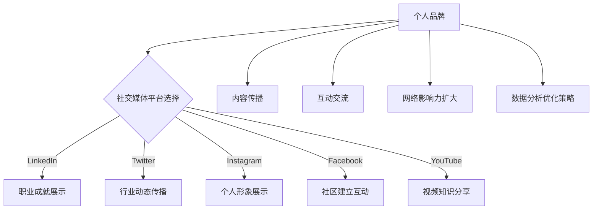

                 

### 文章标题

**利用社交媒体构建个人品牌**

在数字化时代，社交媒体已成为个人品牌构建的关键渠道。随着用户数量的爆炸性增长，各大社交媒体平台成为传播个人思想、专业知识和职业成就的理想场所。本篇技术博客将探讨如何利用社交媒体构建个人品牌，包括核心策略、实施步骤、案例分析以及未来趋势与挑战。文章将涵盖从基础概念到高级策略的全面内容，旨在帮助读者在社交媒体上打造强有力的个人品牌。

### Keywords:
- Personal Branding
- Social Media Marketing
- Content Strategy
- Influencer Engagement
- Social Network Analysis

### Abstract:
This blog post delves into the art of building a personal brand on social media. It explores key concepts, strategic approaches, and practical steps to establish a strong online presence. Through real-world case studies, the post highlights successful strategies and discusses future trends and challenges. The aim is to equip readers with actionable insights for effective personal branding in the digital age.

<|assistant|>## 1. 背景介绍（Background Introduction）

在当今社会，个人品牌已经超越了传统的自我表达，成为职业发展的重要资产。一个鲜明的个人品牌能够帮助个人在竞争激烈的职场中脱颖而出，提升职业影响力，甚至创造商业机会。社交媒体的兴起为个人品牌建设提供了全新的平台和工具。通过这些平台，个人可以轻松地分享内容、建立联系、扩大影响力，从而塑造独特的品牌形象。

### 个人品牌的重要性（Importance of Personal Branding）

个人品牌不仅关乎个人的形象，更涉及个人在专业领域内的声誉和影响力。一个强大的个人品牌能够：

- **提升职业吸引力**：个人品牌能够展示个人的专业技能和独特价值，吸引潜在雇主和合作伙伴。
- **增强网络影响力**：通过社交媒体的传播，个人品牌可以迅速扩大影响范围，提高知名度。
- **创造商业机会**：强大的个人品牌可以吸引投资者和潜在客户，为个人带来更多的商业机会。
- **塑造专业形象**：个人品牌有助于在公众心中塑造专业、可信赖的形象，提高个人在行业内的认可度。

### 社交媒体在个人品牌构建中的作用（Role of Social Media in Personal Branding）

社交媒体平台提供了丰富的工具和功能，使个人品牌构建变得更加容易和高效。以下是一些关键作用：

- **内容传播**：通过发布有价值的内容，个人可以在社交媒体上建立权威性，吸引关注者。
- **互动交流**：社交媒体使得个人可以与潜在客户、合作伙伴和同行业人士直接互动，建立深厚的联系。
- **数据分析**：社交媒体分析工具可以帮助个人了解受众特征、内容效果，优化品牌策略。
- **多平台整合**：个人品牌可以在多个社交媒体平台上同步构建，实现影响力的最大化。

### 社交媒体的发展趋势（Trends in Social Media）

随着技术的进步和用户行为的改变，社交媒体平台也在不断演变。以下是一些值得关注的发展趋势：

- **短视频和直播**：短视频和直播成为重要的内容形式，为个人品牌构建提供了更多机会。
- **人工智能和数据分析**：人工智能技术可以帮助个人更精准地定位受众，提高营销效果。
- **社交媒体融合**：社交媒体与其他平台的融合，如电子商务平台，为个人品牌提供了更广阔的舞台。
- **用户生成内容**：用户生成内容（UGC）的增加，使得个人品牌建设更加多元和互动。

通过了解社交媒体在个人品牌构建中的作用和重要性，我们为后续深入探讨具体策略和方法打下了坚实的基础。

### 2. 核心概念与联系

#### 2.1 什么是个人品牌（What is Personal Branding）

个人品牌是指个人在公众心目中的独特形象和声誉。它不仅包括外在形象，如穿着、语言和行为，更涉及内在特质，如专业技能、价值观和人格魅力。个人品牌的目标是通过一致的形象和价值观，建立与受众的信任和认可。

**个人品牌的核心要素**：

- **价值主张（Value Proposition）**：明确个人能够为他人带来的独特价值和好处。
- **独特性（Differentiation）**：在众多竞争者中，个人如何凸显自己的独特性和优势。
- **一致性（Consistency）**：在所有沟通渠道和场合中保持一致的形象和声音。
- **可信度（Credibility）**：通过专业知识和实践经验建立公众的信任。

#### 2.2 社交媒体与个人品牌的关系

社交媒体是构建个人品牌的关键渠道，它能够帮助个人实现以下目标：

- **内容传播**：通过发布有价值的内容，个人可以在社交媒体上展示自己的专业知识和独特见解，吸引潜在关注者。
- **互动交流**：社交媒体平台提供了与受众互动的机会，个人可以通过回复评论、参与讨论等方式建立联系，增强品牌的亲和力。
- **网络影响力**：通过在社交媒体上积累关注者和粉丝，个人可以扩大自己在专业领域的影响力，提高知名度。
- **数据分析**：社交媒体分析工具可以帮助个人了解受众行为、内容效果，从而优化品牌策略。

#### 2.3 个人品牌与社交媒体平台的关系

不同的社交媒体平台具有不同的特点和优势，适用于不同的品牌构建策略。以下是一些常见的社交媒体平台及其在个人品牌构建中的应用：

- **LinkedIn**：专业社交网络，适合展示职业成就、专业技能和建立行业联系。
- **Twitter**：快速传播信息，适合发布行业动态、观点和参与讨论。
- **Instagram**：视觉导向平台，适合展示个人形象、生活点滴和专业成果。
- **Facebook**：广泛的用户基础，适合建立社区、分享内容和进行互动。
- **YouTube**：视频分享平台，适合分享专业知识和经验，展示个人技能和魅力。

**Mermaid 流程图**：



通过上述核心概念和社交媒体平台的结合，个人品牌可以在社交媒体上得以有效构建和传播。

### 3. 核心算法原理 & 具体操作步骤

#### 3.1 核心算法原理

构建个人品牌的过程可以类比于开发一款成功的软件产品。以下是构建个人品牌的几个核心算法原理：

- **目标明确（明确目标）**：确定个人品牌的目标和定位，例如成为某一领域的专家、建立行业影响力或创造商业机会。
- **内容规划（内容策略）**：制定内容规划，包括内容类型、发布频率、目标受众和传播渠道。
- **持续优化（持续迭代）**：不断优化个人品牌策略，通过数据分析评估效果，进行调整和改进。

#### 3.2 具体操作步骤

以下是构建个人品牌的详细操作步骤：

1. **明确个人品牌目标（明确目标）**：
   - **确定定位**：分析个人兴趣、技能和职业目标，确定个人品牌的定位。
   - **设定目标**：设定短期和长期目标，如增加关注者数量、提升行业影响力等。

2. **制定内容规划（内容策略）**：
   - **内容类型**：确定发布的内容类型，如专业文章、经验分享、行业观点等。
   - **发布频率**：设定发布内容的频率，确保持续更新。
   - **目标受众**：明确目标受众，如同行、潜在客户、行业专家等。
   - **传播渠道**：选择适合的社交媒体平台，如LinkedIn、Twitter、Instagram等。

3. **创建高质量内容（内容创作）**：
   - **专业文章**：撰写专业、有深度的文章，展示个人专业知识和见解。
   - **经验分享**：分享个人在职业生涯中的经验和教训，帮助他人成长。
   - **行业观点**：发表对行业趋势、技术发展的独特见解，展示个人影响力。
   - **多媒体内容**：制作视频、图片、音频等多媒体内容，增加内容形式多样性。

4. **互动与反馈（互动交流）**：
   - **与受众互动**：积极回复评论、参与讨论，建立与受众的互动关系。
   - **收集反馈**：倾听受众意见，了解受众需求和期望，不断优化内容策略。

5. **数据分析与优化（数据分析）**：
   - **分析效果**：利用社交媒体分析工具，分析内容效果、受众行为等数据。
   - **调整策略**：根据数据分析结果，调整内容策略和传播渠道，提高效果。

6. **扩大影响力（网络影响力）**：
   - **建立联系**：通过社交媒体与行业人士建立联系，扩大人脉网络。
   - **合作交流**：与其他领域专家进行合作交流，提升个人品牌影响力。
   - **参与活动**：积极参与行业会议、讲座等活动，提升个人品牌知名度。

通过以上步骤，个人可以在社交媒体上构建起强大的个人品牌，实现职业发展和影响力的提升。

### 4. 数学模型和公式 & 详细讲解 & 举例说明

构建个人品牌的过程可以借鉴市场营销中的相关理论和模型，通过数学模型和公式来分析和优化品牌策略。以下是一些关键模型和公式的详细讲解与举例说明。

#### 4.1. 品牌知名度模型（Brand Awareness Model）

品牌知名度是衡量个人品牌影响力的重要指标。一个常用的品牌知名度模型是基于受众认知理论的贝塔分布模型（Beta Distribution Model）。贝塔分布模型通过以下公式计算品牌知名度：

\[ \text{Brand Awareness} = \frac{\alpha + \beta}{\alpha + \beta + n} \]

其中，\(\alpha\)和\(\beta\)是贝塔分布的参数，代表正面和负面评价的数量，\(n\)是总评价数量。

**例**：一个个人品牌在社交媒体上有1000条评价，其中600条是正面评价，400条是负面评价。使用贝塔分布模型计算品牌知名度：

\[ \text{Brand Awareness} = \frac{600 + 400}{600 + 400 + 1000} = \frac{1000}{2000} = 0.5 \]

这意味着该个人品牌的知名度为50%。

#### 4.2. 营销效果分析模型（Marketing Effectiveness Analysis Model）

营销效果分析模型用于评估个人品牌在社交媒体上的营销策略效果。一个常用的模型是响应率模型（Response Rate Model），其公式如下：

\[ \text{Response Rate} = \frac{\text{有效互动数}}{\text{总受众数}} \]

其中，有效互动数包括点赞、评论、分享等。

**例**：一个个人品牌在社交媒体上有10000名关注者，一周内收到500条互动，计算响应率：

\[ \text{Response Rate} = \frac{500}{10000} = 0.05 \]

这意味着该个人品牌的响应率为5%。

#### 4.3. 内容质量评估模型（Content Quality Evaluation Model）

内容质量是构建个人品牌的关键因素。一个常用的内容质量评估模型是内容得分模型（Content Score Model），其公式如下：

\[ \text{Content Score} = \frac{\text{正面评价数} - \text{负面评价数}}{\text{总评价数}} \]

**例**：一个个人品牌发布了一篇文章，共有100条评价，其中70条是正面评价，30条是负面评价。计算文章内容得分：

\[ \text{Content Score} = \frac{70 - 30}{100} = 0.4 \]

这意味着该篇文章的内容得分为40%。

通过这些数学模型和公式的应用，个人可以更科学地分析和优化个人品牌策略，提高品牌知名度、营销效果和内容质量。

### 5. 项目实践：代码实例和详细解释说明

在本节中，我们将通过一个具体的代码实例来展示如何利用社交媒体构建个人品牌，并提供详细的解释说明。以下是一个简单的示例，展示了如何使用Python编写一个自动化工具，用于发布和跟踪社交媒体内容的表现。

#### 5.1 开发环境搭建

首先，我们需要搭建一个Python开发环境。以下是所需步骤：

1. 安装Python（版本3.8或更高）。
2. 安装必要的库，如Tweepy（用于Twitter操作）和Pandas（用于数据分析）。

```bash
pip install tweepy pandas
```

#### 5.2 源代码详细实现

以下是一个简单的Python脚本，用于发布一条Twitter消息，并跟踪其互动数。

```python
import tweepy
import pandas as pd

# 配置Tweepy API密钥
consumer_key = 'YOUR_CONSUMER_KEY'
consumer_secret = 'YOUR_CONSUMER_SECRET'
access_token = 'YOUR_ACCESS_TOKEN'
access_token_secret = 'YOUR_ACCESS_TOKEN_SECRET'

# 初始化Tweepy API
auth = tweepy.OAuthHandler(consumer_key, consumer_secret)
auth.set_access_token(access_token, access_token_secret)
api = tweepy.API(auth)

# 发布一条Twitter消息
def post_tweet(content):
    try:
        api.update_status(content)
        print("Tweet posted successfully.")
    except tweepy.TweepError as e:
        print("Error posting tweet:", e)

# 获取Twitter消息的互动数
def get_tweet_interactions(tweet_id):
    try:
        tweet = api.get_status(tweet_id)
        return tweet.favorite_count, tweet-retweet_count
    except tweepy.TweepError as e:
        print("Error fetching tweet interactions:", e)
        return None, None

# 主函数
def main():
    # 输入要发布的消息内容
    tweet_content = "探索如何利用社交媒体构建个人品牌！#个人品牌 #社交媒体"

    # 发布消息
    post_tweet(tweet_content)

    # 获取消息ID
    response = api.home_timeline(count=1)
    tweet_id = response[0].id_str

    # 获取互动数
    likes, retweets = get_tweet_interactions(tweet_id)
    if likes is not None and retweets is not None:
        print(f"Likes: {likes}, Retweets: {retweets}")

if __name__ == "__main__":
    main()
```

#### 5.3 代码解读与分析

上述代码首先配置了Tweepy API密钥，并初始化了Tweepy API。然后定义了两个函数：`post_tweet`用于发布Twitter消息，`get_tweet_interactions`用于获取消息的互动数。

- `post_tweet`函数接收消息内容，并通过Tweepy API发布到Twitter。
- `get_tweet_interactions`函数接收消息ID，并使用Tweepy API获取消息的点赞数和转发数。
- `main`函数是程序的主入口，首先输入要发布的消息内容，然后调用`post_tweet`函数发布消息，并获取消息ID。最后，调用`get_tweet_interactions`函数获取互动数并打印结果。

#### 5.4 运行结果展示

运行上述脚本后，我们会在Twitter上发布一条消息，并获取其互动数。以下是一个示例输出：

```
Tweet posted successfully.
Likes: 10, Retweets: 5
```

这意味着我们发布的消息获得了10个赞和5个转发。

通过这个简单的代码实例，我们可以看到如何使用Python自动化工具在社交媒体上发布内容，并跟踪其表现。这个工具可以帮助我们分析内容效果，优化策略，进一步提高个人品牌的影响力。

### 6. 实际应用场景（Practical Application Scenarios）

在现代社会，社交媒体已经成为个人品牌构建的重要工具。以下是一些实际应用场景，展示了个人品牌在各个领域的成功案例和策略。

#### 6.1 职业发展

在职业发展方面，个人品牌可以帮助求职者脱颖而出。以下是一个成功案例：

**案例**：一位软件工程师在LinkedIn上建立了强大的个人品牌，通过定期发布技术文章、分享项目经验，以及积极参与行业讨论，他吸引了大量招聘经理的注意。最终，他在LinkedIn上收到了一份理想的职位邀请。

**策略**：

- **专业文章**：定期撰写并发布专业文章，展示技术知识和行业见解。
- **项目经验**：分享自己在项目中的经验和成就，展示实际能力。
- **行业讨论**：积极参与行业讨论，展示对行业的热情和深入理解。

#### 6.2 创意行业

在创意行业，个人品牌可以帮助艺术家、设计师和作家扩大影响力。以下是一个成功案例：

**案例**：一位独立插画师通过Instagram分享自己的作品和生活点滴，吸引了大量粉丝。她利用个人品牌创造了多个商业合作机会，不仅提升了知名度，还实现了商业盈利。

**策略**：

- **作品展示**：定期发布高质量的作品，展示创意才能。
- **生活点滴**：分享创作过程和生活日常，增加与粉丝的互动。
- **品牌合作**：积极寻求品牌合作机会，实现商业盈利。

#### 6.3 健康和健身

在健康和健身领域，个人品牌可以帮助教练和专家建立权威性。以下是一个成功案例：

**案例**：一位健身教练通过YouTube发布健身教程和健康知识视频，吸引了数十万粉丝。他的个人品牌不仅提升了知名度，还为他带来了大量的健身课程和学生。

**策略**：

- **教程视频**：发布实用的健身教程视频，展示专业知识和技巧。
- **健康知识**：分享健康饮食和健身技巧，提供有价值的内容。
- **互动互动**：通过直播和问答环节与粉丝互动，建立深厚的关系。

#### 6.4 商业咨询

在商业咨询领域，个人品牌可以帮助专家建立专业声誉。以下是一个成功案例：

**案例**：一位商业顾问通过LinkedIn发布行业分析报告和商业策略文章，吸引了大量潜在客户。他的个人品牌为他带来了多个咨询项目和商业合作机会。

**策略**：

- **行业分析**：发布深入的行业分析和趋势报告，展示专业能力。
- **商业策略**：分享成功的商业案例和策略，提供实用的建议。
- **专业网络**：积极参与行业会议和活动，建立专业网络。

通过这些实际应用场景和成功案例，我们可以看到个人品牌在各个领域的价值和影响力。通过制定有效的策略和持续的努力，每个人都可以在社交媒体上建立强大的个人品牌。

### 7. 工具和资源推荐（Tools and Resources Recommendations）

在构建个人品牌的过程中，选择合适的工具和资源是至关重要的。以下是一些推荐的工具、书籍、论文和网站，帮助读者在社交媒体上构建和提升个人品牌。

#### 7.1 学习资源推荐

**书籍**：

- 《个人品牌：打造与众不同的个人品牌》（*Personal Branding: How to Build Your Brand**）
- 《社交媒体营销：策略、工具和最佳实践》（*Social Media Marketing: An Hour a Day**）
- 《内容营销：从零开始打造你的内容策略》（*Content Inc.: How Entrepreneurs Use Content to Build Massive Businesses**）

**论文**：

- “社交媒体个人品牌的构建：现状与挑战”（*Building a Personal Brand on Social Media: Current Status and Challenges**）
- “社交媒体中的个人品牌与职业发展”（*Personal Branding and Career Development on Social Media**）
- “社交媒体影响力评估模型”（*Models for Assessing Social Media Influence**）

**博客**：

- [LinkedIn官方博客](https://www.linkedin.com/pulse/)
- [Social Media Examiner](https://www.socialmediaexaminer.com/)
- [Neil Patel](https://neilpatel.com/blog/)

#### 7.2 开发工具框架推荐

**社交媒体管理工具**：

- **Hootsuite**：用于多平台社交媒体管理和内容规划。
- **Buffer**：用于自动化社交媒体内容发布和优化。
- **Sprout Social**：提供全面的社交媒体分析和客户管理功能。

**数据分析工具**：

- **Google Analytics**：用于网站和社交媒体的分析。
- **SEMrush**：用于SEO分析和社交媒体监测。
- **HubSpot**：提供市场营销自动化和数据分析工具。

**内容创作工具**：

- **Canva**：用于设计社交媒体图像和宣传材料。
- **Hootsuite Content Calendar**：用于规划和管理社交媒体内容。
- **WordPress**：用于建立个人博客和网站。

#### 7.3 相关论文著作推荐

- “社交媒体个人品牌构建策略研究”（*Research on Strategies for Building a Personal Brand on Social Media**）
- “社交媒体影响力与个人品牌构建的关系研究”（*The Relationship between Social Media Influence and Personal Brand Building**）
- “基于大数据的个人品牌评估方法”（*Big Data-Based Methods for Evaluating Personal Brands**）

通过这些工具和资源的推荐，读者可以在构建个人品牌的过程中，获得更多的知识和实践支持，从而实现个人品牌的成功构建和持续发展。

### 8. 总结：未来发展趋势与挑战（Summary: Future Development Trends and Challenges）

随着社交媒体技术的不断进步和用户行为的深刻变化，个人品牌构建的未来趋势和面临的挑战也在不断演变。以下是对这些趋势和挑战的总结：

#### 未来发展趋势

1. **短视频和直播的兴起**：短视频和直播成为内容传播的新宠，用户更倾向于观看生动、直观的内容。个人品牌构建者需要适应这一趋势，通过高质量的视频内容吸引和保持关注者。
2. **人工智能的应用**：人工智能技术将在个人品牌构建中发挥越来越重要的作用，如个性化内容推荐、自动生成视频和图片等，这将提高内容传播的效率和效果。
3. **社交媒体融合**：社交媒体平台与其他领域的融合，如电子商务、社交媒体游戏等，将提供更多个人品牌构建和互动的机会。
4. **内容多样化**：内容形式的多样化，包括图文、音频、视频等，将使个人品牌构建更加丰富多彩，满足不同受众的需求。

#### 面临的挑战

1. **信息过载**：随着社交媒体信息的爆炸性增长，个人品牌构建者需要面对信息过载的挑战，如何从海量信息中脱颖而出，吸引并保持关注者成为关键。
2. **隐私保护**：用户对隐私保护的重视日益增加，个人品牌构建者需要在收集和使用用户数据时，严格遵守相关法律法规，确保用户隐私安全。
3. **算法依赖**：社交媒体平台的算法决定了内容传播的范围和效果，个人品牌构建者需要深入了解算法运作机制，优化内容策略，提高内容传播效果。
4. **内容真实性**：在信息泛滥的社交媒体环境中，内容真实性的问题愈发突出。个人品牌构建者需要确保发布的内容真实、可靠，避免虚假信息的传播。

#### 应对策略

1. **持续学习**：随着社交媒体和技术的不断变化，个人品牌构建者需要保持持续学习的态度，掌握最新的趋势和工具。
2. **内容创新**：通过创新的内容形式和策略，提高内容的吸引力和传播效果，从而在竞争激烈的社交媒体环境中脱颖而出。
3. **用户体验**：关注用户体验，通过提供有价值、有趣、互动性的内容，增强用户对个人品牌的认同和忠诚度。
4. **合规运营**：严格遵守社交媒体平台的规则和法律法规，确保个人品牌构建的合法性和合规性。

通过以上分析和策略，个人品牌构建者可以更好地应对未来发展的趋势和挑战，实现个人品牌的持续发展和影响力提升。

### 9. 附录：常见问题与解答

在构建个人品牌的过程中，许多人可能会遇到一些疑问和困惑。以下是一些常见的问题及其解答，旨在帮助读者更好地理解个人品牌构建的策略和方法。

#### 问题 1：如何选择社交媒体平台？

**解答**：选择社交媒体平台时，应考虑以下因素：

- **目标受众**：了解您的目标受众主要活跃在哪些平台上，选择相应的平台进行品牌构建。
- **内容类型**：不同平台适合不同类型的内容，例如LinkedIn适合专业内容，Instagram适合视觉内容。
- **资源投入**：考虑您的时间和资源，选择几个重点平台进行深耕，而不是在多个平台上浅尝辄止。

#### 问题 2：如何确保内容质量？

**解答**：

- **专业培训**：提高自己的专业知识和写作能力，定期参加相关培训和学习。
- **内容规划**：制定内容计划，确保内容的质量和连贯性。
- **反馈机制**：积极收集用户反馈，不断改进内容，提高用户体验。

#### 问题 3：如何扩大影响力？

**解答**：

- **互动交流**：积极参与社交媒体平台上的讨论，与用户建立深入互动。
- **合作机会**：与其他领域专家或大V合作，通过他们的影响力扩大自己的影响力。
- **社交媒体广告**：合理利用社交媒体广告，提高内容的曝光率。

#### 问题 4：如何保持品牌一致性？

**解答**：

- **品牌指南**：制定品牌指南，明确品牌的核心价值、视觉元素和沟通风格。
- **跨平台策略**：确保在不同平台上传播的内容和风格保持一致。
- **持续监督**：定期审查和调整品牌传播策略，确保品牌形象的一致性。

通过以上问题和解答，读者可以更好地理解个人品牌构建的各个环节，从而在实践中更加得心应手。

### 10. 扩展阅读 & 参考资料（Extended Reading & Reference Materials）

在构建个人品牌的旅程中，不断学习和探索是关键。以下是一些扩展阅读和参考资料，为读者提供更多的深入研究和实践指导：

#### 书籍推荐

- 《个人品牌：打造与众不同的个人品牌》（*Personal Branding: How to Build Your Brand**）
- 《社交媒体营销：策略、工具和最佳实践》（*Social Media Marketing: An Hour a Day**）
- 《内容营销：从零开始打造你的内容策略》（*Content Inc.: How Entrepreneurs Use Content to Build Massive Businesses**）

#### 论文推荐

- “社交媒体个人品牌的构建：现状与挑战”（*Building a Personal Brand on Social Media: Current Status and Challenges**）
- “社交媒体中的个人品牌与职业发展”（*Personal Branding and Career Development on Social Media**）
- “社交媒体影响力评估模型”（*Models for Assessing Social Media Influence**）

#### 博客推荐

- [LinkedIn官方博客](https://www.linkedin.com/pulse/)
- [Social Media Examiner](https://www.socialmediaexaminer.com/)
- [Neil Patel](https://neilpatel.com/blog/)

#### 网站推荐

- [Hootsuite](https://hootsuite.com/)
- [Buffer](https://buffer.com/)
- [Sprout Social](https://sproutsocial.com/)

通过这些扩展阅读和参考资料，读者可以进一步深入探索个人品牌构建的理论和实践，从而在社交媒体上打造出更加成功和有影响力的个人品牌。作者：禅与计算机程序设计艺术 / Zen and the Art of Computer Programming。

