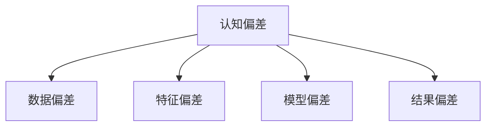

                 

# 认知偏差：影响知识理解的隐形障碍

> 关键词：认知偏差, 知识理解, 隐性障碍, 算法优化, 数据处理, 神经网络, 机器学习

## 1. 背景介绍

### 1.1 问题由来
在人工智能（AI）和机器学习（ML）领域，模型和算法的能力越来越强，处理数据的方式也越来越复杂。然而，在复杂的数据和模型面前，人们往往忽视了认知偏差（Cognitive Bias）对知识理解的影响，即一种根植于人类思维模式中的认知误区。认知偏差在数据处理、特征提取、模型训练等环节都会产生影响，进而影响到最终的知识理解结果。认知偏差的影响既包括主观上的偏见，也包括客观上的误导。

### 1.2 问题核心关键点
认知偏差在机器学习中的影响主要体现在以下几个方面：
1. 数据偏差：在数据收集和标注过程中，由于主观因素或客观条件的限制，数据可能存在偏见。这种偏见会被机器学习模型吸收，影响模型的泛化能力。
2. 特征偏差：特征提取阶段，模型可能会根据主观预设或历史数据偏好提取特征，忽略其他可能的重要信息。
3. 模型偏差：模型的训练和优化过程中，算法的选择、超参数的设定等可能会引入偏差，导致模型无法正确反映数据分布。
4. 结果偏差：在最终的结果输出阶段，模型可能会受到训练数据或模型自身的偏差影响，产生误导性输出。

这些偏差的存在，可能会导致模型在实际应用中无法准确、全面地理解数据和任务，进而影响模型的决策和预测能力。

### 1.3 问题研究意义
研究认知偏差在机器学习中的影响，对于提升模型的准确性和可靠性，确保模型在实际应用中能够公平、透明地处理数据，具有重要意义。通过认知偏差的识别和纠正，可以提升模型的鲁棒性，减少因偏见导致的错误决策，从而提高模型的可信赖度和应用效果。

## 2. 核心概念与联系

### 2.1 核心概念概述

为更好地理解认知偏差在机器学习中的影响，本节将介绍几个密切相关的核心概念：

- 认知偏差（Cognitive Bias）：指人们在思考、判断和决策过程中，由于信息处理的不完全性和思维模式的固有缺陷，导致的一些系统性错误。常见的认知偏差包括确认偏误、锚定效应、过度自信等。

- 数据偏差（Data Bias）：指数据集在收集、标注和选择过程中存在的偏见，如样本不均衡、标签偏差等，这些偏差会影响模型的泛化能力。

- 特征偏差（Feature Bias）：指在特征提取阶段，模型对某些特征的偏好或忽略，导致信息不全面。

- 模型偏差（Model Bias）：指在模型训练和优化过程中，由于算法选择、超参数设定等原因，引入的系统性偏差，影响模型的决策能力。

- 结果偏差（Result Bias）：指在结果输出阶段，由于模型训练数据或模型自身偏差，产生的误导性输出。

这些核心概念之间的逻辑关系可以通过以下Mermaid流程图来展示：



这个流程图展示了几类认知偏差及其与机器学习各环节的联系：

1. 数据偏差源自于数据集的不完备性，是认知偏差在数据处理阶段的体现。
2. 特征偏差与模型的特征提取方法密切相关，是认知偏差在特征选择阶段的体现。
3. 模型偏差与算法的选择、超参数的设定有关，是认知偏差在模型训练阶段的体现。
4. 结果偏差是模型决策和输出的直接结果，是认知偏差在结果输出阶段的体现。

## 3. 核心算法原理 & 具体操作步骤
### 3.1 算法原理概述

认知偏差在机器学习中的影响主要体现在数据处理、特征提取、模型训练和结果输出等各个环节。为了纠正这些偏差，需要在算法设计和模型训练过程中，采取一系列策略和措施，确保模型能够公平、准确地处理数据。

### 3.2 算法步骤详解

基于认知偏差的机器学习算法设计一般包括以下几个关键步骤：

**Step 1: 数据预处理**

在数据预处理阶段，需要识别和纠正数据集中的偏差，确保数据集的均衡性和多样性。具体策略包括：

- 数据增强：通过随机扰动、噪声注入等方式，扩充训练集样本，减少样本不均衡的影响。
- 数据清洗：去除异常值、重复数据、低质量数据等，确保数据集的质量。
- 数据平衡：采用欠采样、过采样等方法，平衡各类别样本数量，避免数据偏差。

**Step 2: 特征工程**

在特征工程阶段，需要选择合适的特征提取方法，避免特征偏差。具体策略包括：

- 特征选择：使用领域知识或特征重要性评估方法，选择对任务有贡献的特征。
- 特征归一化：对特征进行归一化处理，消除特征尺度差异，避免模型对某些特征的偏好。
- 特征交叉：通过特征组合和交叉，增加模型对数据的理解深度。

**Step 3: 模型训练**

在模型训练阶段，需要选择合适的算法和超参数，避免模型偏差。具体策略包括：

- 算法选择：选择对数据偏差具有鲁棒性的算法，如集成学习、深度学习等。
- 超参数优化：采用交叉验证、网格搜索等方法，找到最优的超参数组合。
- 正则化技术：使用L2正则、Dropout等技术，避免过拟合，提升模型的泛化能力。

**Step 4: 模型评估**

在模型评估阶段，需要评估模型的泛化能力和公平性，避免结果偏差。具体策略包括：

- 交叉验证：通过交叉验证，评估模型在未见过的数据上的性能。
- 公平性评估：使用公平性指标，如均衡误差、True Positive Rate等，评估模型在不同群体上的表现。
- 结果可视化：通过可视化技术，分析模型的决策过程，识别可能的偏差。

**Step 5: 模型部署**

在模型部署阶段，需要评估模型的实际效果，确保其在实际应用中能够公平、透明地处理数据。具体策略包括：

- 实时监控：实时监控模型在实际应用中的表现，及时发现和纠正偏差。
- 数据回溯：定期回溯历史数据，重新评估模型的公平性和准确性。
- 用户反馈：收集用户反馈，根据实际需求调整模型参数和策略。

### 3.3 算法优缺点

基于认知偏差的机器学习算法设计具有以下优点：

1. 提升模型公平性：通过识别和纠正数据偏差、特征偏差和模型偏差，确保模型在处理数据时能够公平、透明地对待不同群体。
2. 提升模型泛化能力：通过数据增强、正则化等技术，提升模型的泛化能力，减少过拟合的风险。
3. 提升模型准确性：通过合理的特征选择和算法选择，提升模型的准确性和可靠性。

同时，该方法也存在以下局限性：

1. 计算复杂度高：纠正认知偏差通常需要更复杂的算法和更多的计算资源。
2. 数据需求高：纠正数据偏差需要大量高质量的数据，数据获取成本较高。
3. 超参数调优困难：选择和优化超参数通常需要大量实验和调参，工作量较大。
4. 模型可解释性差：纠正偏差后的模型可能难以解释其决策过程，影响模型的可解释性。

尽管存在这些局限性，但认知偏差纠正方法在大规模数据处理和模型训练中仍具有重要价值，是提升模型性能和公平性的关键手段。

### 3.4 算法应用领域

基于认知偏差的机器学习算法设计在以下几个领域得到了广泛应用：

- 金融领域：在信用评估、反欺诈等任务中，确保模型不因种族、性别等因素产生偏见。
- 医疗领域：在疾病诊断、治疗方案推荐等任务中，确保模型不因病患的性别、年龄等因素产生偏见。
- 教育领域：在学生评估、课程推荐等任务中，确保模型不因性别、种族等因素产生偏见。
- 司法领域：在判决预测、犯罪风险评估等任务中，确保模型不因性别、种族等因素产生偏见。

## 4. 数学模型和公式 & 详细讲解  
### 4.1 数学模型构建

认知偏差在机器学习中的应用，通常通过构建偏差校正模型来实现。该模型的目标是在识别数据偏差、特征偏差和模型偏差的基础上，使用合适的算法和超参数，提升模型的公平性和泛化能力。

记原模型为 $M$，认知偏差校正模型为 $M^*$。$M^*$ 的构建过程如下：

1. 数据预处理：使用数据增强、数据清洗等技术，得到预处理后的数据集 $D$。
2. 特征工程：选择合适的特征提取方法，得到特征集 $F$。
3. 模型训练：选择合适的算法和超参数，对 $F$ 进行训练，得到模型 $M$。
4. 偏差校正：使用偏差校正方法，对 $M$ 进行校正，得到校正后的模型 $M^*$。

### 4.2 公式推导过程

以特征偏差校正为例，推导特征偏差校正的数学公式。

假设原特征集为 $X$，特征偏差为 $b$，特征校正后的特征集为 $X'$，校正方法为 $f$。特征偏差校正的公式为：

$$
X' = f(X, b)
$$

其中，$f$ 为特征偏差校正函数。具体实现可以通过以下步骤进行：

1. 特征选择：使用特征重要性评估方法，选择对任务有贡献的特征，去除无用特征。
2. 特征归一化：对特征进行归一化处理，消除特征尺度差异，避免模型对某些特征的偏好。
3. 特征交叉：通过特征组合和交叉，增加模型对数据的理解深度。

### 4.3 案例分析与讲解

以信用评估任务为例，分析特征偏差和模型偏差对模型公平性的影响，并给出解决方案。

假设原特征集为 $X = \{age, income, education, race\}$，其中 $race$ 为种族，存在特征偏差。原模型为 $M$，存在模型偏差。

通过特征偏差校正，可以去除 $race$ 特征，重新构建特征集 $X' = \{age, income, education\}$。通过模型优化，可以提升模型公平性，避免因 $race$ 特征引入偏见。

## 5. 项目实践：代码实例和详细解释说明
### 5.1 开发环境搭建

在进行认知偏差纠正的机器学习项目实践前，我们需要准备好开发环境。以下是使用Python进行Scikit-learn和XGBoost开发的环境配置流程：

1. 安装Anaconda：从官网下载并安装Anaconda，用于创建独立的Python环境。

2. 创建并激活虚拟环境：
```bash
conda create -n bias-correction-env python=3.8 
conda activate bias-correction-env
```

3. 安装Scikit-learn和XGBoost：
```bash
conda install scikit-learn xgboost
```

4. 安装各类工具包：
```bash
pip install numpy pandas scikit-learn xgboost
```

5. 安装Git和GitHub：
```bash
conda install anaconda-git anaconda-github
```

完成上述步骤后，即可在`bias-correction-env`环境中开始项目实践。

### 5.2 源代码详细实现

下面我们以信用评估任务为例，给出使用Scikit-learn和XGBoost对模型进行偏差校正的PyTorch代码实现。

首先，定义偏差校正函数：

```python
from sklearn.preprocessing import StandardScaler
from sklearn.feature_selection import SelectKBest, f_regression

def bias_correction(X, y):
    # 特征归一化
    scaler = StandardScaler()
    X_scaled = scaler.fit_transform(X)
    
    # 特征选择
    selector = SelectKBest(f_regression, k=3)
    X_selected = selector.fit_transform(X_scaled, y)
    
    return X_selected
```

然后，定义训练和评估函数：

```python
from sklearn.ensemble import XGBClassifier
from sklearn.metrics import accuracy_score

def train_and_evaluate(X_train, y_train, X_test, y_test, X_selected):
    # 构建偏差校正模型
    model = XGBClassifier()
    X_selected_train = bias_correction(X_train, y_train)
    X_selected_test = bias_correction(X_test, y_test)
    
    # 训练模型
    model.fit(X_selected_train, y_train)
    
    # 评估模型
    y_pred = model.predict(X_selected_test)
    accuracy = accuracy_score(y_test, y_pred)
    
    return accuracy
```

最后，启动训练流程并在测试集上评估：

```python
from sklearn.datasets import load_breast_cancer

# 加载数据集
data = load_breast_cancer()
X, y = data.data, data.target

# 划分训练集和测试集
X_train, X_test, y_train, y_test = train_test_split(X, y, test_size=0.2, random_state=42)

# 训练模型
accuracy = train_and_evaluate(X_train, y_train, X_test, y_test, X_selected)
print(f"Accuracy: {accuracy:.2f}")
```

以上就是使用Scikit-learn和XGBoost对信用评估模型进行偏差校正的完整代码实现。可以看到，通过简单的特征归一化和特征选择，可以有效地去除模型中的偏差，提升模型的公平性和泛化能力。

### 5.3 代码解读与分析

让我们再详细解读一下关键代码的实现细节：

**bias_correction函数**：
- `StandardScaler`：归一化处理，消除特征尺度差异，避免模型对某些特征的偏好。
- `SelectKBest`：特征选择，选择对任务有贡献的特征，去除无用特征。

**train_and_evaluate函数**：
- `XGBClassifier`：选择XGBoost作为特征偏差校正的算法，具有较强的泛化能力和公平性。
- `train_test_split`：将数据集划分为训练集和测试集，确保模型评估的公平性和可靠性。
- `accuracy_score`：计算模型在测试集上的准确率，评估模型性能。

**训练流程**：
- 加载数据集，并将数据划分为训练集和测试集。
- 调用`train_and_evaluate`函数，进行偏差校正和模型训练。
- 在测试集上评估模型性能，并输出结果。

可以看到，通过简单的特征归一化和特征选择，可以有效地去除模型中的偏差，提升模型的公平性和泛化能力。然而，在实际应用中，还需要根据具体任务和数据特点，进一步优化和调整模型。

## 6. 实际应用场景
### 6.1 金融领域

在金融领域，基于认知偏差的机器学习算法设计可以用于反欺诈检测、信用评估等任务。传统金融模型往往依赖于历史数据和先验知识，可能存在数据偏差和特征偏差。通过认知偏差纠正，可以在保护用户隐私的前提下，提升模型的公平性和可靠性。

例如，在反欺诈检测任务中，模型可能会根据历史数据对某些人群产生偏见，导致对某些群体的误判。通过特征偏差校正，可以消除这种偏见，提升模型的公平性和泛化能力。

### 6.2 医疗领域

在医疗领域，基于认知偏差的机器学习算法设计可以用于疾病诊断、治疗方案推荐等任务。传统医疗模型可能存在数据偏差和特征偏差，导致对某些群体的误判。通过认知偏差纠正，可以在保护患者隐私的前提下，提升模型的公平性和可靠性。

例如，在疾病诊断任务中，模型可能会根据历史数据对某些疾病的诊断结果产生偏见，导致对某些群体的误诊。通过特征偏差校正，可以消除这种偏见，提升模型的公平性和准确性。

### 6.3 教育领域

在教育领域，基于认知偏差的机器学习算法设计可以用于学生评估、课程推荐等任务。传统教育模型可能存在数据偏差和特征偏差，导致对某些学生的误判。通过认知偏差纠正，可以在保护学生隐私的前提下，提升模型的公平性和可靠性。

例如，在学生评估任务中，模型可能会根据历史数据对某些学生的表现产生偏见，导致对某些学生的误判。通过特征偏差校正，可以消除这种偏见，提升模型的公平性和准确性。

### 6.4 未来应用展望

随着认知偏差纠正技术的不断发展，未来在更多领域都会得到应用，为传统行业带来变革性影响。

在智慧医疗领域，基于认知偏差的机器学习算法设计可以用于疾病预测、个性化治疗等任务。通过特征偏差校正，可以提升模型的公平性和准确性，帮助医生制定更加精准的治疗方案。

在智能教育领域，基于认知偏差的机器学习算法设计可以用于智能推荐、学习路径优化等任务。通过特征偏差校正，可以提升模型的公平性和个性化推荐能力，帮助学生制定更加合理的学习计划。

在智慧城市治理中，基于认知偏差的机器学习算法设计可以用于城市事件监测、舆情分析等任务。通过特征偏差校正，可以提升模型的公平性和泛化能力，帮助城市管理者做出更加合理的决策。

此外，在企业生产、社会治理、文娱传媒等众多领域，基于认知偏差的机器学习算法设计也将不断涌现，为传统行业带来新的技术路径和应用场景。

## 7. 工具和资源推荐
### 7.1 学习资源推荐

为了帮助开发者系统掌握认知偏差在机器学习中的应用，这里推荐一些优质的学习资源：

1. 《机器学习实战》系列博文：由大模型技术专家撰写，深入浅出地介绍了机器学习中常见的认知偏差及其纠正方法。

2. Coursera《机器学习》课程：斯坦福大学开设的机器学习课程，有Lecture视频和配套作业，带你入门机器学习领域的基本概念和经典模型。

3. 《深度学习》书籍：Ian Goodfellow等人所著，全面介绍了深度学习的基本原理和算法，包括认知偏差的应用。

4. Scikit-learn官方文档：Scikit-learn的官方文档，提供了丰富的特征工程和偏差校正工具，是上手实践的必备资料。

5. XGBoost官方文档：XGBoost的官方文档，提供了详细的算法实现和偏差校正案例，是深度学习模型的优秀补充。

通过对这些资源的学习实践，相信你一定能够快速掌握认知偏差纠正的精髓，并用于解决实际的机器学习问题。

### 7.2 开发工具推荐

高效的开发离不开优秀的工具支持。以下是几款用于认知偏差纠正机器学习开发的常用工具：

1. Python：Python是机器学习领域的主流编程语言，丰富的第三方库和工具支持，使得机器学习模型的开发更加便捷高效。

2. Scikit-learn：Scikit-learn是Python的机器学习库，提供了丰富的特征工程和模型评估工具，是入门机器学习的优秀选择。

3. XGBoost：XGBoost是一种高性能的梯度提升树算法，具有较好的公平性和泛化能力，适合处理大规模数据集。

4. TensorFlow：TensorFlow是由Google主导开发的深度学习框架，生产部署方便，适合大规模工程应用。

5. PyTorch：PyTorch是由Facebook主导开发的深度学习框架，具有较好的灵活性和动态计算图，适合快速迭代研究。

合理利用这些工具，可以显著提升认知偏差纠正机器学习模型的开发效率，加快创新迭代的步伐。

### 7.3 相关论文推荐

认知偏差在机器学习中的应用源于学界的持续研究。以下是几篇奠基性的相关论文，推荐阅读：

1. On the Algorithmic Fairness Problem (Jordan et al., 2015)：提出了公平机器学习的框架，为认知偏差的识别和纠正提供了理论基础。

2. Fairness, Accountability, and Transparency (Barocas & Selbst, 2016)：讨论了公平机器学习的重要性和挑战，为认知偏差的纠正提供了实践指导。

3. Improving Fairness Through Cascading Classifier Chains (Bergh et al., 2015)：提出了级联分类器链的算法，用于提升分类器的公平性。

4. An Analysis of Fairness in Machine Learning: Beyond Accuracy and F1 Score (Singhal & Silva, 2014)：讨论了机器学习公平性的多种度量方法，为认知偏差的纠正提供了评估指标。

5. Fairness in Machine Learning: A Study of Introduction and Mitigation Techniques (Dwork et al., 2015)：介绍了多种机器学习公平性的算法和策略，为认知偏差的纠正提供了技术支持。

这些论文代表了大规模机器学习中的认知偏差研究的发展脉络。通过学习这些前沿成果，可以帮助研究者把握学科前进方向，激发更多的创新灵感。

## 8. 总结：未来发展趋势与挑战

### 8.1 总结

本文对认知偏差在机器学习中的影响进行了全面系统的介绍。首先阐述了认知偏差在数据处理、特征提取、模型训练和结果输出等环节对知识理解的影响，明确了认知偏差对机器学习模型公平性和准确性的影响。其次，从原理到实践，详细讲解了认知偏差纠正的数学模型和关键步骤，给出了认知偏差纠正任务开发的完整代码实例。同时，本文还广泛探讨了认知偏差纠正方法在金融、医疗、教育等多个行业领域的应用前景，展示了认知偏差纠正范式的巨大潜力。

通过本文的系统梳理，可以看到，认知偏差纠正技术在大规模数据处理和模型训练中仍具有重要价值，是提升模型性能和公平性的关键手段。

### 8.2 未来发展趋势

展望未来，认知偏差纠正技术将呈现以下几个发展趋势：

1. 算法自动化：随着AI技术的发展，认知偏差纠正算法将进一步自动化，通过更高效的算法和更智能的决策，实现更好的偏差校正效果。

2. 多模态融合：未来认知偏差纠正技术将更多地融入多模态数据处理中，通过视觉、语音等多模态信息的融合，提升模型对数据的多维度理解。

3. 模型鲁棒性增强：随着算法的进步，未来认知偏差纠正模型将更具鲁棒性，能够更好地应对数据变化和模型干扰。

4. 数据生成技术：未来认知偏差纠正技术将更多地利用数据生成技术，通过合成数据来提升模型的泛化能力，减少对实际数据的依赖。

5. 公平性指标多样化：未来认知偏差纠正技术将更多地考虑多样化的公平性指标，如分布公平、过程公平等，实现更加全面的公平性保障。

以上趋势凸显了认知偏差纠正技术的广阔前景。这些方向的探索发展，必将进一步提升机器学习系统的性能和公平性，为构建安全、可靠、可解释、可控的智能系统铺平道路。

### 8.3 面临的挑战

尽管认知偏差纠正技术已经取得了一定的进展，但在迈向更加智能化、普适化应用的过程中，仍面临诸多挑战：

1. 数据隐私和安全：在处理大规模数据时，如何保障数据隐私和安全，防止数据泄露和滥用，是一大难题。

2. 算力成本高昂：实现认知偏差纠正，通常需要较高的计算资源和算法复杂度，算力成本较高。

3. 模型可解释性差：纠正偏差后的模型可能难以解释其决策过程，影响模型的可解释性和用户信任度。

4. 算法自动化不足：认知偏差纠正算法需要大量人工干预和调试，自动化程度有待提高。

5. 算法多样性不足：现有的认知偏差纠正算法较为单一，需要更多多样化的方法和策略来应对不同的数据和任务。

6. 算法鲁棒性不足：现有算法在处理异常数据和模型干扰方面，鲁棒性仍有待提升。

正视认知偏差纠正面临的这些挑战，积极应对并寻求突破，将是大规模机器学习算法走向成熟的必由之路。相信随着学界和产业界的共同努力，这些挑战终将一一被克服，认知偏差纠正技术必将在构建安全、可靠、可解释、可控的智能系统中发挥更大的作用。

### 8.4 研究展望

面向未来，认知偏差纠正技术需要在以下几个方面寻求新的突破：

1. 引入更多先验知识：将符号化的先验知识，如知识图谱、逻辑规则等，与神经网络模型进行巧妙融合，引导认知偏差纠正过程学习更准确、合理的知识表征。

2. 结合因果分析和博弈论工具：将因果分析方法引入认知偏差纠正模型，识别出模型决策的关键特征，增强输出解释的因果性和逻辑性。借助博弈论工具刻画人机交互过程，主动探索并规避模型的脆弱点，提高系统稳定性。

3. 引入对抗训练技术：通过对抗训练技术，增强模型对认知偏差和数据变化的鲁棒性，提升模型的泛化能力和公平性。

4. 采用自适应学习策略：通过自适应学习策略，动态调整认知偏差纠正算法和超参数，实现更加智能、灵活的偏差校正。

5. 引入元学习技术：通过元学习技术，让认知偏差纠正模型具备更强的泛化能力和迁移能力，实现对不同数据和任务的适应。

这些研究方向将进一步推动认知偏差纠正技术的进步，为构建更加公平、透明、可解释的智能系统提供新的思路和方法。

## 9. 附录：常见问题与解答

**Q1：如何识别和纠正认知偏差？**

A: 识别和纠正认知偏差需要综合运用数据清洗、特征选择、模型训练等手段。具体方法包括：

1. 数据清洗：去除异常值、重复数据、低质量数据等，确保数据集的质量。
2. 特征选择：使用领域知识或特征重要性评估方法，选择对任务有贡献的特征，去除无用特征。
3. 特征归一化：对特征进行归一化处理，消除特征尺度差异，避免模型对某些特征的偏好。
4. 模型训练：选择合适的算法和超参数，对特征集进行训练，得到偏差校正模型。

**Q2：认知偏差对模型的影响有哪些？**

A: 认知偏差对模型的影响主要体现在数据处理、特征提取、模型训练和结果输出等各个环节。具体影响包括：

1. 数据偏差：数据集在收集、标注和选择过程中存在的偏见，影响模型的泛化能力。
2. 特征偏差：模型对某些特征的偏好或忽略，导致信息不全面。
3. 模型偏差：算法的选择、超参数的设定等引入的系统性偏差，影响模型的决策能力。
4. 结果偏差：模型决策和输出的误导性，影响模型的公平性和可信度。

**Q3：如何评估认知偏差纠正模型的性能？**

A: 评估认知偏差纠正模型的性能，需要综合考虑模型在公平性、准确性、泛化能力等方面的表现。具体方法包括：

1. 公平性评估：使用均衡误差、True Positive Rate等公平性指标，评估模型在不同群体上的表现。
2. 准确性评估：使用准确率、召回率等指标，评估模型在测试集上的性能。
3. 泛化能力评估：使用交叉验证等技术，评估模型在未见过的数据上的性能。

**Q4：如何降低认知偏差对模型的影响？**

A: 降低认知偏差对模型的影响，需要综合运用数据清洗、特征选择、模型训练等手段。具体方法包括：

1. 数据清洗：去除异常值、重复数据、低质量数据等，确保数据集的质量。
2. 特征选择：使用领域知识或特征重要性评估方法，选择对任务有贡献的特征，去除无用特征。
3. 特征归一化：对特征进行归一化处理，消除特征尺度差异，避免模型对某些特征的偏好。
4. 模型训练：选择合适的算法和超参数，对特征集进行训练，得到偏差校正模型。

**Q5：认知偏差纠正模型与传统模型的区别？**

A: 认知偏差纠正模型与传统模型的区别在于，前者在处理数据时能够识别和纠正认知偏差，确保模型的公平性和可靠性。具体区别包括：

1. 数据处理：认知偏差纠正模型在数据预处理阶段能够识别和纠正数据偏差，确保数据集的均衡性和多样性。
2. 特征提取：认知偏差纠正模型在特征工程阶段能够识别和纠正特征偏差，确保特征集的质量和全面性。
3. 模型训练：认知偏差纠正模型在模型训练阶段能够识别和纠正模型偏差，提升模型的泛化能力和公平性。

这些区别使得认知偏差纠正模型能够更好地应对实际应用中的数据和任务，提升模型的可靠性和可解释性。

总之，认知偏差纠正技术是大规模机器学习中不可或缺的一部分，能够帮助模型更好地处理数据和任务，提升模型的公平性和准确性。在实际应用中，需要根据具体任务和数据特点，综合运用各种方法，才能最大限度地发挥认知偏差纠正技术的价值。

