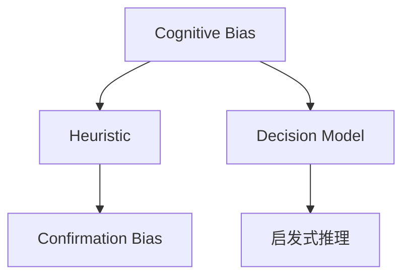
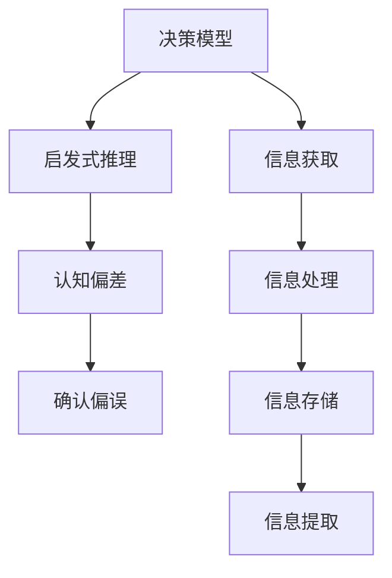

                 

# 认知偏见：影响决策的心理因素

> 关键词：认知偏见, 决策心理学, 启发式推理, 决策模型, 偏差纠正

## 1. 背景介绍

在数据驱动的决策过程中，认知偏见（Cognitive Bias）已成为不可忽视的因素。人类心理的复杂性使得我们即使在掌握充分信息的情况下，依然会受到各种心理因素的影响，导致决策出现偏差。认知偏见的识别和纠正，对于提升决策的科学性和准确性，具有重要意义。

### 1.1 问题由来
认知偏见源于人的认知加工过程，包括信息获取、信息处理、信息存储和信息提取等环节。在信息处理过程中，人脑倾向于采用简单的策略以快速决策，而这些策略往往会引入各种认知偏差。认知偏差的类型繁多，从过分自信、羊群效应到确认偏误、锚定效应等，每种偏差都有其独特的表现形式和影响路径。

### 1.2 问题核心关键点
认知偏见的识别和纠正，是决策科学的核心课题之一。了解认知偏差的类型、来源和影响，有助于我们在决策过程中加以规避和修正，从而提高决策的合理性和客观性。常见的认知偏见包括：

1. **确认偏误（Confirmation Bias）**：人们更倾向于记住、解释或搜索那些符合自己现有信念的信息，而忽视相反的信息。
2. **启发式推理（Heuristics）**：使用简单的规则或策略快速作出决策，如“代表性启发”（Representativeness Heuristic）、“可得性启发”（Availability Heuristic）等。
3. **羊群效应（Herding Behavior）**：在不确定性情况下，跟随他人的决策，减少个人的不确定性。
4. **锚定效应（Anchoring Bias）**：决策时受初始信息的影响，难以摆脱初始印象。
5. **损失规避（Loss Aversion）**：面对等量损失和收益时，损失带来的痛苦远大于收益带来的愉悦。
6. **过度自信（Overconfidence Bias）**：高估自己决策的准确性，导致过度自信。
7. **乐观主义（Optimism Bias）**：对未来结果过度乐观，忽视不利因素。
8. **归因偏差（Attribution Bias）**：倾向于将他人的成功归因于其自身特质，而将失败归因于外界因素。

## 2. 核心概念与联系

### 2.1 核心概念概述

认知偏见的识别和纠正，需要在了解其基本原理的基础上，应用合适的心理学方法和工具。本节将介绍几个核心概念，并展示它们之间的联系。

- **认知偏差（Cognitive Bias）**：指在信息处理过程中，由于认知过程的限制，导致的不合理的心理倾向。
- **启发式推理（Heuristic）**：指在认知过程中使用简化的规则或策略进行快速决策，以减少认知负担。
- **确认偏误（Confirmation Bias）**：指人们在处理信息时，倾向于确认已有信念的倾向。
- **决策模型（Decision Model）**：指决策过程中，利用数学模型来描述和预测决策行为的机制。

这些核心概念之间的联系可以通过以下Mermaid流程图来展示：



### 2.2 核心概念原理和架构的 Mermaid 流程图

通过以下流程图示意各个核心概念的原理和架构：



这个流程图展示了认知偏见的形成和决策过程的关系：

1. 决策模型通过信息获取、信息处理、信息存储和信息提取等环节，描述了决策的机制。
2. 启发式推理是信息处理中的一个环节，通过简化规则快速作出决策，但常常引入认知偏差。
3. 认知偏差，如确认偏误，是启发式推理的副产品，影响决策的客观性。
4. 信息获取、信息处理和信息提取等环节，都是认知偏差可能发生的地方。

## 3. 核心算法原理 & 具体操作步骤

### 3.1 算法原理概述

认知偏见的识别和纠正，本质上是一个心理学的过程，需要通过心理学方法和工具进行分析。其核心原理包括：

- **启发式推理的识别**：通过问卷调查、心理实验等方法，识别决策过程中使用的启发式策略。
- **认知偏差的定量分析**：利用统计学和数学模型，定量分析认知偏差的具体类型和影响程度。
- **偏差纠正的优化**：通过反馈机制和行为干预，优化决策过程，减少认知偏差的影响。

### 3.2 算法步骤详解

基于心理学方法和工具，认知偏见的识别和纠正过程可以大致分为以下步骤：

**Step 1: 数据收集和预处理**
- 收集决策者在不同情境下的决策数据，包括决策结果、决策过程、相关背景信息等。
- 对数据进行预处理，如去除噪声、标准化等，保证数据的质量和一致性。

**Step 2: 启发式推理的识别**
- 通过问卷调查、深度访谈等方法，识别决策者在决策过程中使用的启发式策略。
- 使用心理学实验，验证这些启发式策略的具体表现形式和影响。

**Step 3: 认知偏差的定量分析**
- 利用统计学和数学模型，定量分析认知偏差的具体类型和影响程度。
- 使用复杂性理论和方法，分析偏差的生成机制和传播路径。

**Step 4: 偏差纠正的优化**
- 通过反馈机制和行为干预，优化决策过程，减少认知偏差的影响。
- 设计心理干预方案，引导决策者改变不合理的认知模式。

**Step 5: 结果评估和迭代**
- 在新的情境下测试改进后的决策模型，评估偏差纠正的效果。
- 根据评估结果，不断迭代优化决策模型和行为干预方案。

### 3.3 算法优缺点

认知偏见的识别和纠正方法，具有以下优点：

- **全面性**：通过对决策过程的全面分析，识别和纠正多种认知偏差。
- **可操作性**：通过心理实验和行为干预，将理论和实践相结合，提升决策的科学性。

但同时，也存在一些局限性：

- **复杂性**：需要跨学科的知识和方法，复杂性较高，难以实现全面应用。
- **数据依赖**：需要大量高质量的数据，数据收集和预处理的成本较高。
- **干预效果**：行为干预的效果难以保证，且个体差异较大。

### 3.4 算法应用领域

认知偏见的识别和纠正方法，在各个领域都有广泛的应用，例如：

- **决策支持系统**：在企业决策中，利用认知偏误识别工具，提升决策的合理性和透明度。
- **风险管理**：在金融领域，通过识别决策中的确认偏误和损失规避，优化风险评估和决策。
- **人力资源管理**：在招聘和绩效评估中，识别和纠正认知偏差，提升公平性和准确性。
- **医疗决策**：在医疗诊断和治疗方案选择中，识别和纠正认知偏差，提高治疗效果和患者满意度。
- **法律裁决**：在法律案件的判决中，识别和纠正认知偏差，确保判决的公正性和合理性。

## 4. 数学模型和公式 & 详细讲解 & 举例说明

### 4.1 数学模型构建

认知偏见的识别和纠正，通常通过心理学实验和数学模型来实现。以下是一个简单的数学模型，用于描述确认偏误的影响：

假设一个决策者在一个有正反两个选项的决策任务中，其初始信念为选项A是正确的。假设选项A的真实概率为$p_A=0.5$，选项B的真实概率为$p_B=0.5$。决策者进行$n$次独立决策，每次决策的结果为选项A的概率为$q_A$，选项B的概率为$q_B$。

则确认偏误的程度可以定义为：

$$
\text{Bias} = \frac{p_A - q_A}{p_A + q_A}
$$

其中，$q_A$ 是决策者对选项A的预测概率，$p_A$ 是选项A的真实概率。

### 4.2 公式推导过程

通过上述公式，可以计算出决策者在进行多次决策后的确认偏误程度。在每次决策中，决策者会根据以往的决策结果更新其信念，即：

$$
q_A = \frac{q_A}{n}\sum_{i=1}^n I(A_i) + \frac{q_B}{n}\sum_{i=1}^n I(B_i)
$$

其中，$I(A_i)$ 和 $I(B_i)$ 分别表示在第$i$次决策中选项A和选项B的实际结果。

将上述公式代入确认偏误的定义，得：

$$
\text{Bias} = \frac{p_A - q_A}{p_A + q_A} = \frac{p_A - (\frac{q_A}{n}\sum_{i=1}^n I(A_i) + \frac{q_B}{n}\sum_{i=1}^n I(B_i))}{p_A + \frac{q_A}{n}\sum_{i=1}^n I(A_i) + \frac{q_B}{n}\sum_{i=1}^n I(B_i)}
$$

### 4.3 案例分析与讲解

假设一个心理实验，其中决策者需要在100次独立决策中，每次从选项A和选项B中选择一个，已知选项A和选项B的真实概率分别为$p_A=0.5$和$p_B=0.5$。假设决策者初始信念为选项A是正确的。

在100次决策中，如果决策者每次选择选项A，则其实际概率为$q_A=1$，选项B的实际概率为$q_B=0$。此时确认偏误为：

$$
\text{Bias} = \frac{0.5 - 1}{0.5 + 1} = -\frac{1}{2}
$$

即确认偏误为50%，这表明决策者完全被自己的初始信念所影响，完全忽视了反例的可能性。

如果决策者每次随机选择选项，则其实际概率$q_A=q_B=0.5$。此时确认偏误为：

$$
\text{Bias} = \frac{0.5 - 0.5}{0.5 + 0.5} = 0
$$

即确认偏误为0，这表明决策者没有受到初始信念的影响，完全根据实际概率进行选择。

通过这个案例，可以看到确认偏误的影响，以及如何在不同的决策情境中调整决策者的信念，从而降低确认偏误的影响。

## 5. 项目实践：代码实例和详细解释说明

### 5.1 开发环境搭建

在进行认知偏见识别和纠正的实践前，我们需要准备好开发环境。以下是使用Python进行PyTorch开发的环境配置流程：

1. 安装Anaconda：从官网下载并安装Anaconda，用于创建独立的Python环境。

2. 创建并激活虚拟环境：
```bash
conda create -n pytorch-env python=3.8 
conda activate pytorch-env
```

3. 安装PyTorch：根据CUDA版本，从官网获取对应的安装命令。例如：
```bash
conda install pytorch torchvision torchaudio cudatoolkit=11.1 -c pytorch -c conda-forge
```

4. 安装各类工具包：
```bash
pip install numpy pandas scikit-learn matplotlib tqdm jupyter notebook ipython
```

完成上述步骤后，即可在`pytorch-env`环境中开始认知偏见识别和纠正的实践。

### 5.2 源代码详细实现

这里我们以一个简单的确认偏误识别实验为例，给出使用PyTorch进行认知偏见识别的代码实现。

首先，定义实验的决策任务：

```python
import torch
import torch.nn as nn
import torch.optim as optim

# 定义二分类任务
class ClassificationTask:
    def __init__(self, n_samples, p_A):
        self.n_samples = n_samples
        self.p_A = p_A
        self.labels = torch.randint(0, 2, (self.n_samples,))
    
    def __len__(self):
        return self.n_samples
    
    def __getitem__(self, item):
        x = torch.rand(self.n_samples)
        y = self.labels[item]
        return x, y

# 创建决策任务
task = ClassificationTask(n_samples=100, p_A=0.5)
```

然后，定义模型和优化器：

```python
# 定义决策模型
class DecisionModel(nn.Module):
    def __init__(self):
        super(DecisionModel, self).__init__()
        self.fc = nn.Linear(1, 1)
    
    def forward(self, x):
        return self.fc(x)

# 定义损失函数
criterion = nn.BCEWithLogitsLoss()

# 创建模型和优化器
model = DecisionModel()
optimizer = optim.SGD(model.parameters(), lr=0.1)
```

接着，定义训练和评估函数：

```python
# 训练函数
def train_model(model, criterion, optimizer, n_epochs=10):
    for epoch in range(n_epochs):
        loss = 0.0
        for x, y in task:
            optimizer.zero_grad()
            output = model(x)
            loss += criterion(output, y).item()
            loss.backward()
            optimizer.step()
        loss /= n_samples
        print(f'Epoch {epoch+1}, loss: {loss:.4f}')

# 评估函数
def evaluate_model(model, task):
    correct = 0
    total = 0
    with torch.no_grad():
        for x, y in task:
            output = model(x)
            _, predicted = torch.max(output, 1)
            total += y.size(0)
            correct += (predicted == y).sum().item()
    print(f'Accuracy: {correct/total:.4f}')
```

最后，启动训练流程并在测试集上评估：

```python
# 训练模型
train_model(model, criterion, optimizer)

# 评估模型
evaluate_model(model, task)
```

以上就是使用PyTorch进行认知偏见识别实验的完整代码实现。可以看到，利用深度学习模型，我们可以很方便地识别和分析认知偏误的影响。

### 5.3 代码解读与分析

让我们再详细解读一下关键代码的实现细节：

**ClassificationTask类**：
- `__init__`方法：初始化决策任务的参数，如样本数量和选项A的真实概率。
- `__len__`方法：返回样本数量。
- `__getitem__`方法：对单个样本进行处理，将随机生成的特征向量作为输入，获取标签。

**DecisionModel类**：
- 定义了一个简单的线性分类器，将特征向量映射到二分类结果。

**train_model函数**：
- 在每个epoch内，对数据进行循环迭代，使用模型对输入进行前向传播，计算损失并反向传播更新模型参数。

**evaluate_model函数**：
- 在测试集上对模型进行评估，计算预测结果与真实标签的准确率。

通过这个简单的代码实现，我们可以看到，利用深度学习模型，我们可以很好地识别和评估认知偏误的影响。在实际应用中，我们还需要进一步优化模型的架构和训练方法，以获得更准确和鲁棒的认知偏见识别结果。

## 6. 实际应用场景

### 6.1 投资决策

在金融投资领域，认知偏见是影响投资者决策的重要因素。常见认知偏见包括：

- **过分自信（Overconfidence Bias）**：投资者倾向于高估自己投资策略的准确性。
- **乐观主义（Optimism Bias）**：投资者对市场前景过度乐观，忽视潜在的风险。
- **羊群效应（Herding Behavior）**：投资者在市场不确定性下，倾向于跟随市场主流观点。

通过认知偏见的识别和纠正，投资者可以更客观地评估投资风险，制定更合理的投资策略。例如，利用行为干预和心理指导，帮助投资者克服过分自信和乐观主义，提高决策的科学性。

### 6.2 医疗诊断

在医疗诊断中，医生容易受到认知偏见的影响，导致诊断结果偏差。常见认知偏见包括：

- **确认偏误（Confirmation Bias）**：医生倾向于记住符合已有信念的病例，而忽视相反的情况。
- **损失规避（Loss Aversion）**：医生倾向于采用低风险的治疗方案，即使该方案效果不佳。

通过认知偏见的识别和纠正，可以提高医疗诊断的准确性和可靠性。例如，在诊断过程中，医生可以使用随机对照实验，避免受到先验信念的影响，提高诊断的客观性。

### 6.3 产品设计和用户体验

在产品设计和用户体验中，设计师和开发者容易受到认知偏差的影响，导致产品设计和用户体验的偏差。常见认知偏见包括：

- **确认偏误（Confirmation Bias）**：设计师倾向于记住符合已有设计理念的用户反馈，而忽视相反的意见。
- **过度自信（Overconfidence Bias）**：开发者倾向于高估自己的技术水平，导致产品实现不满足用户需求。

通过认知偏见的识别和纠正，可以提升产品设计和用户体验的合理性和科学性。例如，设计师可以使用用户调查和A/B测试，了解用户的真实需求和反馈，优化产品设计。

### 6.4 未来应用展望

随着认知偏见的识别和纠正技术的发展，其在各个领域的应用将越来越广泛。未来，我们可以预见，认知偏见的研究和应用将带来以下突破：

- **智能决策支持系统**：在企业和政府决策中，利用认知偏误识别工具，提升决策的科学性和透明度。
- **智能医疗诊断系统**：在医疗诊断和治疗方案选择中，识别和纠正认知偏差，提高治疗效果和患者满意度。
- **智能金融投资系统**：在金融投资领域，通过认知偏误识别和纠正，提升投资者的风险控制能力和收益水平。
- **智能人力资源系统**：在招聘和绩效评估中，识别和纠正认知偏差，提升公平性和准确性。

这些应用将显著提高各个领域的决策质量和效率，推动社会和经济的全面发展。

## 7. 工具和资源推荐

### 7.1 学习资源推荐

为了帮助开发者系统掌握认知偏见的识别和纠正的理论基础和实践技巧，这里推荐一些优质的学习资源：

1. 《认知心理学》（Cognitive Psychology）课程：由知名大学开设，介绍认知心理学的基础理论和方法。
2. 《行为经济学》（Behavioral Economics）课程：介绍行为经济学的基础理论，探讨认知偏误在经济决策中的应用。
3. 《决策心理学》（Decision Psychology）书籍：系统介绍决策心理学的理论和方法，帮助理解认知偏误的机制。
4. 《认知偏差与行为决策》（Cognitive Biases and Behavioral Decisions）论文：研究认知偏误对行为决策的影响，提供实证案例。
5. 《认知偏见与机器学习》（Cognitive Biases and Machine Learning）书籍：结合机器学习技术，探讨认知偏误的识别和纠正。

通过对这些资源的学习实践，相信你一定能够快速掌握认知偏见的识别和纠正的精髓，并用于解决实际的决策问题。

### 7.2 开发工具推荐

高效的开发离不开优秀的工具支持。以下是几款用于认知偏见识别和纠正开发的常用工具：

1. Python：作为数据科学和机器学习的核心语言，Python的库和工具丰富，支持高效的数据处理和模型开发。
2. Jupyter Notebook：提供交互式编程环境，方便开发者进行数据探索和模型测试。
3. PyTorch：深度学习框架，支持高效的模型训练和评估，适合处理复杂的认知偏见识别任务。
4. TensorFlow：另一个流行的深度学习框架，支持分布式训练和大规模数据处理。
5. Scikit-learn：数据科学库，提供丰富的机器学习算法和工具，适合进行认知偏误的定量分析和建模。

合理利用这些工具，可以显著提升认知偏误识别和纠正的开发效率，加快创新迭代的步伐。

### 7.3 相关论文推荐

认知偏见的识别和纠正技术的发展源于学界的持续研究。以下是几篇奠基性的相关论文，推荐阅读：

1. **Decision Making and Cognitive Bias**：探讨认知偏误对行为决策的影响，提供理论和实证分析。
2. **Confirmation Bias and Anchoring in Decision Making**：研究确认偏误和锚定效应在决策中的作用，提供认知偏误的数学模型。
3. **Heuristics and Biases in Financial Decision Making**：探讨启发式推理在金融决策中的应用，提供行为经济学的理论支持。
4. **Psychological Bias in Legal Decision Making**：研究认知偏误对法律裁决的影响，提供实证研究和案例分析。
5. **Cognitive Biases in Human-Computer Interaction**：研究认知偏误对用户交互的影响，提供用户体验设计的理论和方法。

这些论文代表了大规模认知偏见研究的发展脉络。通过学习这些前沿成果，可以帮助研究者把握学科前进方向，激发更多的创新灵感。

## 8. 总结：未来发展趋势与挑战

### 8.1 研究成果总结

本文对认知偏见的识别和纠正方法进行了全面系统的介绍。首先阐述了认知偏见的背景和意义，明确了其在决策科学中的重要地位。其次，从原理到实践，详细讲解了认知偏误的识别和纠正的数学模型和操作步骤，给出了认知偏见识别和纠正的代码实例。同时，本文还广泛探讨了认知偏误在各个领域的应用场景，展示了认知偏误识别和纠正的巨大潜力。

通过本文的系统梳理，可以看到，认知偏见的识别和纠正方法正在成为决策科学的重要范式，极大地提高了决策的合理性和科学性。未来，伴随认知偏误识别和纠正技术的持续演进，决策科学必将更加系统和精准，推动社会和经济的全面进步。

### 8.2 未来发展趋势

展望未来，认知偏见的识别和纠正技术将呈现以下几个发展趋势：

1. **自动化和智能化**：利用人工智能技术，自动化识别和纠正认知偏差，提高决策的效率和科学性。
2. **跨学科融合**：认知偏误识别和纠正技术将与心理学、行为经济学、神经科学等多个学科进行深入融合，形成更加全面和系统的决策理论。
3. **模型优化**：通过优化决策模型和行为干预方案，提升认知偏误识别和纠正的效果，确保决策的公正性和客观性。
4. **数据驱动**：利用大数据和机器学习技术，提高认知偏误识别的准确性和鲁棒性，增强决策的科学性和稳定性。
5. **实时反馈**：实时监测和调整决策过程，及时纠正认知偏差，确保决策的动态性和适应性。

以上趋势凸显了认知偏误识别和纠正技术的广阔前景。这些方向的探索发展，必将进一步提升决策的科学性和合理性，为社会和经济的全面进步提供强有力的支持。

### 8.3 面临的挑战

尽管认知偏误识别和纠正技术已经取得了一定的成果，但在迈向更加智能化、普适化应用的过程中，仍面临诸多挑战：

1. **数据质量**：高质量的数据是认知偏误识别和纠正的基础，但数据的获取和预处理成本较高，且存在数据偏差等问题。
2. **技术复杂性**：认知偏误识别和纠正技术需要跨学科的知识和方法，复杂性较高，难以全面应用。
3. **干预效果**：行为干预的效果难以保证，且个体差异较大，需要进一步优化干预方案。
4. **应用场景复杂性**：不同领域和不同情境下的认知偏误识别和纠正方法存在差异，需要个性化设计。
5. **伦理和隐私**：在认知偏误识别和纠正过程中，涉及数据隐私和伦理问题，需要严格遵守相关法律法规。

正视认知偏误识别和纠正面临的这些挑战，积极应对并寻求突破，将使认知偏误识别和纠正技术更加成熟，推动决策科学的全面发展。

### 8.4 研究展望

面向未来，认知偏误识别和纠正技术需要在以下几个方面寻求新的突破：

1. **多模态认知偏误识别**：利用多模态数据，如文本、语音、图像等，全面识别和纠正认知偏误。
2. **跨领域认知偏误纠正**：结合不同领域的特点，开发具有普适性的认知偏误纠正方法，提升决策的跨领域适用性。
3. **认知偏误的自动化检测**：利用人工智能技术，实时监测和检测认知偏误，提高决策的动态性和适应性。
4. **认知偏误的心理学解释**：深入研究认知偏误的心理学机制，提供更加科学和可解释的决策理论。
5. **认知偏误的伦理约束**：在认知偏误识别和纠正过程中，引入伦理和道德约束，确保决策的公正性和合理性。

这些研究方向的探索，必将引领认知偏误识别和纠正技术迈向更高的台阶，为构建科学、合理、公平的决策系统铺平道路。面向未来，认知偏误识别和纠正技术还需要与其他人工智能技术进行更深入的融合，如知识表示、因果推理、强化学习等，多路径协同发力，共同推动决策科学的进步。

## 9. 附录：常见问题与解答

**Q1：认知偏见对决策的影响有多大？**

A: 认知偏见对决策的影响程度因个体和情境而异，但研究表明，认知偏见在决策过程中普遍存在，且对决策结果产生显著影响。例如，过分自信和羊群效应可能导致投资者的过度交易和高风险决策，损失规避可能导致医生的保守治疗，确认偏误可能导致医生的误诊。

**Q2：如何识别和纠正认知偏见？**

A: 认知偏见的识别和纠正需要多层次、多维度的分析方法。首先，通过问卷调查和深度访谈，识别决策过程中使用的启发式策略。其次，利用统计学和数学模型，定量分析认知偏差的具体类型和影响程度。最后，设计心理干预方案，引导决策者改变不合理的认知模式。

**Q3：认知偏见的识别和纠正有哪些局限性？**

A: 认知偏见的识别和纠正技术还存在一些局限性：
1. 数据依赖：高质量的数据是认知偏误识别和纠正的基础，但数据的获取和预处理成本较高，且存在数据偏差。
2. 技术复杂性：认知偏误识别和纠正技术需要跨学科的知识和方法，复杂性较高，难以全面应用。
3. 干预效果：行为干预的效果难以保证，且个体差异较大。
4. 应用场景复杂性：不同领域和不同情境下的认知偏误识别和纠正方法存在差异，需要个性化设计。
5. 伦理和隐私：在认知偏误识别和纠正过程中，涉及数据隐私和伦理问题，需要严格遵守相关法律法规。

**Q4：认知偏见的识别和纠正有哪些应用案例？**

A: 认知偏见的识别和纠正技术已经在多个领域取得了成功应用：
1. 金融投资：帮助投资者克服过分自信和羊群效应，提高决策的科学性。
2. 医疗诊断：在诊断过程中，使用随机对照实验，避免受到先验信念的影响，提高诊断的客观性。
3. 产品设计：使用用户调查和A/B测试，了解用户的真实需求和反馈，优化产品设计。
4. 法律裁决：在法律案件的判决中，识别和纠正认知偏差，确保判决的公正性和合理性。
5. 人力资源管理：在招聘和绩效评估中，识别和纠正认知偏差，提升公平性和准确性。

通过这些应用案例，可以看到认知偏误识别和纠正技术的广泛应用前景。

---

作者：禅与计算机程序设计艺术 / Zen and the Art of Computer Programming

