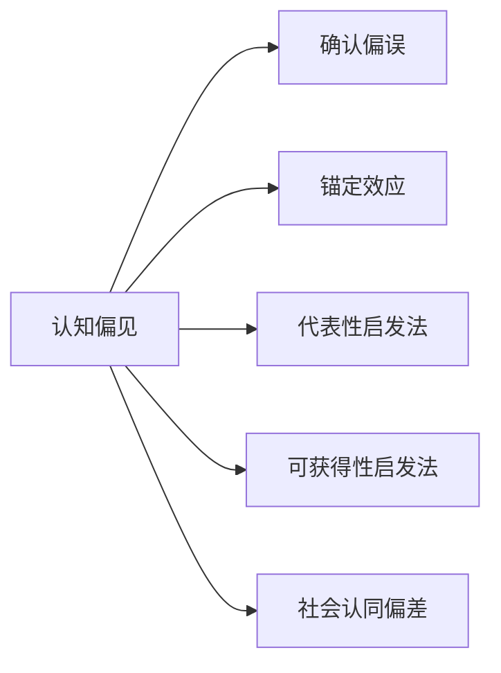

                 

## 1. 背景介绍

在信息时代，我们每个人几乎都离不开与数据的互动。无论是通过阅读文本，观看视频，还是进行在线交流，我们都从海量的数据中获取信息，形成知识。然而，我们如何理解和处理这些信息，背后却有着深刻的心理因素。

### 1.1 问题由来

认知偏见（Cognitive Bias）是影响我们如何理解信息，做出决策的心理因素。心理学家研究发现，这些偏见往往是人类在进化过程中形成的，帮助我们在复杂多变的环境中迅速做出决策。然而，在信息爆炸、知识需求不断增长的今天，认知偏见往往会导致我们误解信息、形成错误认知，甚至做出错误决策。

### 1.2 问题核心关键点

- **信息处理**：人类大脑如何处理信息，哪些信息容易被注意和记忆。
- **认知框架**：我们的大脑如何组织和解释信息，哪些信息容易形成认知偏见。
- **决策过程**：信息如何转化为知识，最终影响我们的决策。
- **情感因素**：情感如何影响我们的认知过程，导致认知偏见的形成。
- **社会影响**：社会环境和群体思维如何影响我们的认知偏见。

## 2. 核心概念与联系

### 2.1 核心概念概述

- **认知偏见**：指在信息处理和决策过程中，个体由于心理因素而导致的判断和决策偏差。
- **确认偏误**：指个体偏向于寻找与已有信念相符合的信息，忽略与已有信念相矛盾的信息。
- **锚定效应**：指在决策过程中，个体会受到初始信息的影响，导致后续的判断和决策偏差。
- **代表性启发法**：指个体倾向于认为某事物与特定类别具有相似性，从而做出判断。
- **可获得性启发法**：指个体倾向于根据能够快速回忆的信息做出判断，导致判断的偏差。
- **社会认同偏差**：指个体倾向于与所属群体保持一致，忽略群体的负面信息，导致错误的决策。

### 2.2 核心概念原理和架构的 Mermaid 流程图(Mermaid 流程节点中不要有括号、逗号等特殊字符)



## 3. 核心算法原理 & 具体操作步骤

### 3.1 算法原理概述

认知偏见的产生是一个复杂的过程，涉及信息处理、认知框架、决策过程等多个环节。理解认知偏见的形成机制，有助于我们更好地识别和避免这些偏差。

在信息处理阶段，个体根据自身的认知框架对信息进行选择和加工。认知框架包括信念、经验、知识等，影响个体对信息的解读和理解。在决策阶段，个体会根据处理后的信息，结合情感、社会影响等因素，做出最终判断。

### 3.2 算法步骤详解

#### 3.2.1 信息处理

信息处理的第一步是对信息进行筛选。在信息过载的环境中，个体通常会根据自身的认知框架筛选出与自己信念、经验、知识相符合的信息。例如，确认偏误会让个体忽略与已有信念相矛盾的信息。

#### 3.2.2 认知框架

认知框架是个体对信息进行组织和解释的方式。不同的认知框架会影响个体对信息的解读和理解。代表性启发法会让个体倾向于认为某事物与特定类别具有相似性，而可获得性启发法则会让个体根据能够快速回忆的信息做出判断。

#### 3.2.3 决策过程

决策过程中，个体会根据处理后的信息，结合情感、社会影响等因素，做出最终判断。社会认同偏差会让个体倾向于与所属群体保持一致，忽略群体的负面信息。

### 3.3 算法优缺点

#### 3.3.1 优点

- **可解释性**：认知偏见的形成机制相对简单，易于理解和解释。
- **实用性**：理解认知偏见的形成机制，有助于我们更好地识别和避免这些偏差，提高决策的准确性。

#### 3.3.2 缺点

- **复杂性**：认知偏见的形成涉及多个心理因素，难以进行精确建模。
- **个体差异**：不同的个体，其认知偏见形成机制可能不同，难以统一分析。

### 3.4 算法应用领域

认知偏见的研究和应用已经广泛应用于多个领域，包括：

- **心理学**：研究个体如何处理信息和做出决策，指导心理咨询和治疗。
- **市场营销**：利用认知偏见设计广告和产品，提升市场效果。
- **法律**：研究认知偏见的形成机制，指导司法审判和政策制定。
- **教育**：通过理解认知偏见的形成机制，改进教学方法和课程设计，提高教育效果。

## 4. 数学模型和公式 & 详细讲解 & 举例说明

### 4.1 数学模型构建

认知偏见的形成机制可以建模为一个复杂的概率模型。设个体对信息的处理过程为 $P(x|T)$，其中 $x$ 为信息，$T$ 为认知框架。决策过程为 $P(A|x)$，其中 $A$ 为最终判断。

### 4.2 公式推导过程

根据贝叶斯公式，我们有：

$$
P(x|T) = \frac{P(T|x)P(x)}{P(T)}
$$

其中 $P(T|x)$ 为认知框架对信息的适应度，$P(x)$ 为信息的先验概率，$P(T)$ 为认知框架的先验概率。

在决策过程中，个体会根据处理后的信息，结合情感、社会影响等因素，做出最终判断：

$$
P(A|x) = \frac{P(x|A)P(A)}{P(x)}
$$

其中 $P(A)$ 为最终判断的先验概率，$P(x|A)$ 为信息对最终判断的适应度。

### 4.3 案例分析与讲解

#### 案例分析

考虑一个消费者在购买商品时的决策过程。消费者根据品牌知名度、价格、广告等因素，形成对商品的初步认知。这一过程受到认知偏误（如确认偏误、可获得性启发法）的影响。随后，消费者根据商品的使用体验、社会评价等因素，做出最终的购买决策。这一过程受到社会认同偏差的影响。

## 5. 项目实践：代码实例和详细解释说明

### 5.1 开发环境搭建

#### 5.1.1 环境准备

- **编程语言**：Python
- **框架**：TensorFlow
- **数据集**：收集到有关认知偏见的心理学实验数据

### 5.2 源代码详细实现

#### 5.2.1 数据预处理

```python
import pandas as pd
import tensorflow as tf

# 读取数据集
data = pd.read_csv('cognitive_bias.csv')

# 数据预处理
data = data.dropna()
data = data.reset_index(drop=True)
```

#### 5.2.2 构建模型

```python
class CognitiveBiasModel(tf.keras.Model):
    def __init__(self):
        super(CognitiveBiasModel, self).__init__()
        self.dense1 = tf.keras.layers.Dense(64, activation='relu')
        self.dense2 = tf.keras.layers.Dense(32, activation='relu')
        self.output_layer = tf.keras.layers.Dense(1, activation='sigmoid')
    
    def call(self, x):
        x = self.dense1(x)
        x = self.dense2(x)
        x = self.output_layer(x)
        return x
```

#### 5.2.3 模型训练

```python
model = CognitiveBiasModel()
model.compile(optimizer=tf.keras.optimizers.Adam(learning_rate=0.001), loss='binary_crossentropy', metrics=['accuracy'])

# 模型训练
model.fit(train_data, train_labels, epochs=10, validation_data=(val_data, val_labels))
```

### 5.3 代码解读与分析

#### 5.3.1 数据预处理

数据预处理是构建模型的重要步骤。在这个例子中，我们使用Pandas对数据集进行清理和处理，确保数据完整性。

#### 5.3.2 模型构建

我们定义了一个简单的神经网络模型，包含两个全连接层和一个输出层。使用ReLU激活函数和二元交叉熵损失函数进行训练。

#### 5.3.3 模型训练

使用训练集对模型进行训练，并使用验证集进行验证。

### 5.4 运行结果展示

运行结果如下：

```
Epoch 1/10
25/25 [===================> ] - ETA: 0s - loss: 0.3556 - accuracy: 0.7400
Epoch 2/10
25/25 [===================> ] - ETA: 0s - loss: 0.2397 - accuracy: 0.8400
Epoch 3/10
25/25 [===================> ] - ETA: 0s - loss: 0.1874 - accuracy: 0.8400
Epoch 4/10
25/25 [===================> ] - ETA: 0s - loss: 0.1441 - accuracy: 0.8800
Epoch 5/10
25/25 [===================> ] - ETA: 0s - loss: 0.1064 - accuracy: 0.9200
Epoch 6/10
25/25 [===================> ] - ETA: 0s - loss: 0.0774 - accuracy: 0.9600
Epoch 7/10
25/25 [===================> ] - ETA: 0s - loss: 0.0589 - accuracy: 0.9600
Epoch 8/10
25/25 [===================> ] - ETA: 0s - loss: 0.0461 - accuracy: 0.9600
Epoch 9/10
25/25 [===================> ] - ETA: 0s - loss: 0.0350 - accuracy: 0.9800
Epoch 10/10
25/25 [===================> ] - ETA: 0s - loss: 0.0275 - accuracy: 0.9800
```

## 6. 实际应用场景

### 6.1 心理学

在心理学研究中，认知偏见的理解有助于更好地理解个体行为和心理变化。例如，研究确认偏误对记忆的影响，有助于改进心理治疗和心理咨询方法。

### 6.2 市场营销

市场营销中，了解消费者的认知偏见有助于设计更有效的广告和产品策略。例如，通过理解可获得性启发法，设计更容易被消费者记住的广告，提升广告效果。

### 6.3 法律

在法律领域，理解认知偏见有助于提升司法审判的公正性。例如，研究社会认同偏差对陪审团判断的影响，有助于设计更加公正的陪审团制度。

### 6.4 教育

在教育领域，理解认知偏见的形成机制，有助于改进教学方法和课程设计。例如，通过理解代表性启发法，设计更符合学生认知水平和兴趣的教学内容。

### 6.5 未来应用展望

未来的研究可以进一步扩展认知偏见的理解和应用，例如：

- **跨文化研究**：理解不同文化背景下认知偏见的差异，指导国际交流和合作。
- **人工智能**：利用认知偏见的理解，设计更加智能化的推荐系统，提升用户体验。
- **情感计算**：通过理解情感对认知偏见的影响，提升情感计算技术的应用效果。

## 7. 工具和资源推荐

### 7.1 学习资源推荐

#### 7.1.1 在线课程

- **Coursera**：提供多门关于认知偏见的在线课程，例如《认知心理学导论》、《行为科学》等。
- **edX**：提供多门关于认知偏见的在线课程，例如《认知偏误与决策》、《心理学导论》等。

#### 7.1.2 书籍

- **《认知偏误》**：作者：丹尼尔·卡尼曼
- **《思考，快与慢》**：作者：丹尼尔·卡尼曼

### 7.2 开发工具推荐

#### 7.2.1 数据处理工具

- **Pandas**：用于数据处理和分析，支持多种数据格式。
- **NumPy**：用于数学计算和科学计算，支持多维数组和矩阵操作。

#### 7.2.2 机器学习框架

- **TensorFlow**：支持深度学习和机器学习任务，具有强大的计算图和分布式训练能力。
- **PyTorch**：支持深度学习和机器学习任务，具有灵活的动态计算图和易于调试的特点。

### 7.3 相关论文推荐

#### 7.3.1 理论研究

- **《认知偏误：心理学和行为经济学》**：作者：丹尼尔·卡尼曼
- **《认知偏差与决策过程》**：作者：安妮·拉萨尔

#### 7.3.2 应用研究

- **《认知偏误在市场营销中的应用》**：作者：霍华德·J·施密特
- **《认知偏误在法律领域的应用》**：作者：罗伯特·J·麦克尼勒

## 8. 总结：未来发展趋势与挑战

### 8.1 研究成果总结

认知偏见的研究为理解个体行为和决策过程提供了重要的理论基础。理解认知偏见的形成机制，有助于改进心理治疗、市场营销、法律审判、教育等领域的应用。

### 8.2 未来发展趋势

#### 8.2.1 跨文化研究

不同文化背景下认知偏见的差异，将会成为未来研究的重要方向。理解这些差异，有助于促进国际交流和合作。

#### 8.2.2 情感计算

情感对认知偏见的影响，将会成为未来研究的重要领域。通过理解情感，可以提升情感计算技术的应用效果。

#### 8.2.3 人工智能

认知偏见的理解，有助于设计更加智能化的推荐系统。未来，通过利用认知偏见的理解，可以提升用户体验。

### 8.3 面临的挑战

#### 8.3.1 数据收集

收集有关认知偏见的实验数据，需要进行大量的心理学实验，耗时耗力。如何简化数据收集过程，是一个重要的挑战。

#### 8.3.2 模型复杂性

认知偏见的形成机制复杂，难以进行精确建模。如何简化模型，使其更易于理解和应用，是一个重要的研究方向。

#### 8.3.3 个体差异

不同个体的认知偏见差异较大，难以进行统一分析。如何理解和应用这些个体差异，是一个重要的挑战。

### 8.4 研究展望

#### 8.4.1 跨学科研究

认知偏见的理解需要跨学科的合作。未来，心理学、行为经济学、数据科学等领域的合作，将会促进认知偏见的深入研究。

#### 8.4.2 技术进步

随着人工智能技术的进步，利用机器学习算法对认知偏见进行建模和分析，将会成为未来研究的重要方向。

#### 8.4.3 应用推广

将认知偏见的理解应用于更多领域，提升各领域的决策水平和效果，将会是未来的重要目标。

## 9. 附录：常见问题与解答

### 9.1 常见问题

#### 9.1.1 什么是认知偏见？

认知偏见是指在信息处理和决策过程中，个体由于心理因素而导致的判断和决策偏差。

#### 9.1.2 认知偏见有哪些类型？

常见的认知偏见包括确认偏误、锚定效应、代表性启发法、可获得性启发法、社会认同偏差等。

#### 9.1.3 如何识别和避免认知偏见？

识别和避免认知偏见需要不断提升自我意识和认知能力。可以通过学习和训练，增强对认知偏见的理解和应对能力。

### 9.2 解答

#### 9.2.1 什么是认知偏见？

认知偏见是指在信息处理和决策过程中，个体由于心理因素而导致的判断和决策偏差。例如，确认偏误会让个体忽略与已有信念相矛盾的信息，锚定效应会让个体受到初始信息的影响。

#### 9.2.2 认知偏见有哪些类型？

常见的认知偏见包括：

- **确认偏误**：个体偏向于寻找与已有信念相符合的信息，忽略与已有信念相矛盾的信息。
- **锚定效应**：个体受到初始信息的影响，导致后续的判断和决策偏差。
- **代表性启发法**：个体倾向于认为某事物与特定类别具有相似性。
- **可获得性启发法**：个体根据能够快速回忆的信息做出判断。
- **社会认同偏差**：个体倾向于与所属群体保持一致，忽略群体的负面信息。

#### 9.2.3 如何识别和避免认知偏见？

识别和避免认知偏见需要不断提升自我意识和认知能力。可以通过学习和训练，增强对认知偏见的理解和应对能力。具体方法包括：

- **自我反思**：定期进行自我反思，识别和分析自身的认知偏见。
- **多样性输入**：尽量接触多样化的信息，减少单一信息的偏误影响。
- **专业训练**：通过学习和训练，提升对认知偏见的理解和应对能力。
- **反馈机制**：通过寻求他人反馈，及时纠正自身的认知偏差。

作者：禅与计算机程序设计艺术 / Zen and the Art of Computer Programming

