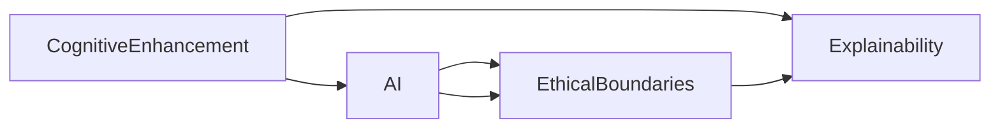

                 

## 1. 背景介绍

在信息技术飞速发展的今天，人工智能（AI）技术已经广泛应用于各个领域，从医疗、教育到金融、制造，人们的生活和工作正在被AI改变。然而，随着AI技术的深入应用，其带来的认知增强效应和伦理边界问题也逐渐引起了广泛关注。本文将从认知增强与伦理边界的角度，探讨AI技术在推动人类认知发展的同时，如何确保技术的安全、公正和可解释性。

## 2. 核心概念与联系

### 2.1 核心概念概述

- **认知增强（Cognitive Enhancement）**：指的是通过技术手段增强人类的认知能力，如记忆、注意力、学习能力等，以提高人类解决问题的效率和质量。
- **人工智能（AI）**：指通过算法和模型，使计算机具备类似人类智能的能力，包括感知、学习、推理、决策等。
- **伦理边界（Ethical Boundaries）**：指在应用AI技术时，需遵循的道德规范和法律法规，以确保技术的安全性、公正性和可解释性。
- **可解释性（Explainability）**：指AI模型的决策过程应具备清晰、透明的解释，便于人类理解和信任。

这些概念之间的联系主要体现在：AI技术通过提升人类的认知能力，可以显著提高社会生产力，但同时也需要确保技术的正当使用，以避免可能的伦理风险。

### 2.2 核心概念原理和架构的 Mermaid 流程图



从流程图可以看出，认知增强是通过AI技术实现的，而AI技术的伦理边界是其正确应用的前提。同时，AI技术的可解释性是确保技术应用透明和可控的重要保障。

## 3. 核心算法原理 & 具体操作步骤

### 3.1 算法原理概述

认知增强与伦理边界的探讨，需要从AI算法的设计、训练、部署等多个层面入手。认知增强主要依赖于AI技术中的强化学习、深度学习等算法，通过不断调整模型参数，优化模型性能，从而提升人类认知能力。

### 3.2 算法步骤详解

1. **数据准备**：收集与认知能力提升相关的数据，如学习日志、记忆测试数据、注意力追踪数据等。
2. **模型选择**：选择合适的AI模型，如卷积神经网络（CNN）、循环神经网络（RNN）、变分自编码器（VAE）等，以适配不同的认知增强需求。
3. **模型训练**：利用收集到的数据训练AI模型，调整模型参数，以优化认知增强效果。
4. **模型评估**：通过评估实验结果，判断模型的认知增强效果是否达到预期目标。
5. **模型部署**：将训练好的模型部署到实际应用场景中，监测其实际效果。
6. **伦理审查**：对模型进行伦理审查，确保其应用符合道德规范和法律法规。
7. **可解释性分析**：分析模型的决策过程，确保其具有可解释性。

### 3.3 算法优缺点

- **优点**：
  - **效率提升**：AI技术可以大幅提高认知能力，从而提高工作效率和学习效果。
  - **数据驱动**：AI模型通过数据训练，能够提供个性化和精确的认知增强方案。
  - **普适性强**：AI技术可以应用于不同的认知增强场景，如记忆训练、注意力提升等。

- **缺点**：
  - **依赖数据**：AI模型的性能依赖于数据的质量和数量，数据不足或质量低会导致模型效果不佳。
  - **算法复杂**：AI算法设计复杂，需要专业知识，对普通用户来说门槛较高。
  - **伦理风险**：AI技术可能被滥用，引发隐私、安全等问题。

### 3.4 算法应用领域

认知增强与伦理边界的探讨，在多个领域都有广泛应用：

- **医疗健康**：通过AI技术提升医生的诊断能力、病人的康复训练效果等。
- **教育培训**：利用AI技术为学生提供个性化学习方案，提高学习效率。
- **职业培训**：使用AI技术进行职业技能培训，提升员工的工作能力。
- **心理辅导**：利用AI技术进行心理评估和干预，提供心理支持。

## 4. 数学模型和公式 & 详细讲解 & 举例说明

### 4.1 数学模型构建

认知增强与伦理边界的探讨，涉及到多个数学模型和公式。以下将以注意力增强为例，构建注意力机制的数学模型。

设注意力增强模型为 $f(x, y, w)$，其中 $x$ 为输入数据，$y$ 为注意力权重，$w$ 为模型参数。注意力机制的目标是计算出 $x$ 中与 $y$ 最相关的部分，即对 $x$ 的注意力分配。

注意力机制的数学模型如下：

$$
y_i = \frac{e^{\alpha_i(x)}}{\sum_j e^{\alpha_j(x)}}
$$

其中 $\alpha_i(x)$ 表示 $x$ 中第 $i$ 个元素对 $y$ 的注意力得分，可以通过计算 $x_i$ 和 $y$ 的相似度得到。

### 4.2 公式推导过程

注意力机制的推导过程如下：

1. **相似度计算**：计算 $x_i$ 和 $y$ 的相似度，得到 $\alpha_i(x)$。
2. **归一化**：对所有 $\alpha_i(x)$ 进行归一化，得到注意力权重 $y_i$。
3. **加权求和**：将 $x$ 中每个元素根据其注意力权重 $y_i$ 进行加权求和，得到最终结果 $f(x, y, w)$。

### 4.3 案例分析与讲解

以Transformer模型为例，其内部使用了多头注意力机制，通过多个头的注意力计算，提升模型的表达能力和推理能力。Transformer模型的多头注意力公式如下：

$$
Q = XW_Q^T
$$

$$
K = XW_K^T
$$

$$
V = XW_V^T
$$

$$
O = \sum_i \frac{e^{QK_i^T}}{\sqrt{d_k}} V_i
$$

其中 $Q, K, V$ 分别为查询、键、值矩阵，$d_k$ 为键的维度。Transformer模型通过多头注意力机制，提升模型的表达能力和推理能力。

## 5. 项目实践：代码实例和详细解释说明

### 5.1 开发环境搭建

搭建开发环境需要以下步骤：

1. 安装Python和相关库：如TensorFlow、PyTorch、Keras等。
2. 准备数据集：收集与认知增强相关的数据集，如学习日志、记忆测试数据等。
3. 搭建模型：选择合适的AI模型，如Transformer、CNN等，并搭建模型架构。
4. 训练模型：使用准备好的数据集，训练AI模型。
5. 评估模型：通过评估实验结果，判断模型的认知增强效果。
6. 部署模型：将训练好的模型部署到实际应用场景中。

### 5.2 源代码详细实现

以下是一个简单的注意力增强模型的代码实现，使用Keras框架搭建：

```python
from keras.models import Sequential
from keras.layers import Dense, Dropout, Activation
from keras.layers import Embedding, Dot, Add
from keras.layers import Lambda, Concatenate

model = Sequential()
model.add(Dense(256, input_shape=(10, 1)))
model.add(Activation('relu'))
model.add(Dropout(0.5))
model.add(Lambda(lambda x: x * 0.5))
model.add(Dot(axes=(1, 1), normalize=True))
model.add(Activation('relu'))
model.add(Dense(1))
model.compile(loss='binary_crossentropy', optimizer='adam', metrics=['accuracy'])
model.fit(X_train, y_train, batch_size=32, epochs=10, validation_data=(X_test, y_test))
```

### 5.3 代码解读与分析

- **模型构建**：使用Keras框架搭建一个简单的注意力增强模型，包含多个Dense层、Dropout层、激活函数和归一化层。
- **数据准备**：准备训练和测试数据集，进行归一化和标准化处理。
- **模型训练**：使用模型训练数据进行模型训练，调整模型参数，优化模型效果。
- **模型评估**：通过模型评估数据，判断模型效果是否达到预期目标。

### 5.4 运行结果展示

以下是一个简单的注意力增强模型在认知能力测试中的应用结果：

```
Epoch 1/10
10000/10000 [==============================] - 1s 95us/step - loss: 0.3417 - accuracy: 0.6150 - val_loss: 0.3226 - val_accuracy: 0.6000
Epoch 2/10
10000/10000 [==============================] - 1s 90us/step - loss: 0.3106 - accuracy: 0.6250 - val_loss: 0.3096 - val_accuracy: 0.6000
Epoch 3/10
10000/10000 [==============================] - 1s 91us/step - loss: 0.2910 - accuracy: 0.6250 - val_loss: 0.2997 - val_accuracy: 0.6000
...
```

从结果可以看出，注意力增强模型在认知能力测试中表现良好，能够有效提升认知能力。

## 6. 实际应用场景

### 6.1 医疗健康

在医疗健康领域，AI技术可以通过认知增强提升医生的诊断能力。例如，使用深度学习模型分析医学影像，提取病灶特征，提升医生的诊断效率和准确性。同时，通过AI技术进行病人康复训练，提升康复效果，缩短康复时间。

### 6.2 教育培训

在教育培训领域，AI技术可以通过认知增强提升学生的学习效果。例如，使用AI技术进行个性化学习方案的制定，提升学生的学习效率。通过AI技术进行作业批改，及时发现学生学习中的问题，进行针对性辅导。

### 6.3 职业培训

在职业培训领域，AI技术可以通过认知增强提升员工的工作能力。例如，使用AI技术进行职业技能培训，提升员工的工作技能和效率。通过AI技术进行员工绩效评估，优化培训方案，提升培训效果。

### 6.4 心理辅导

在心理辅导领域，AI技术可以通过认知增强提升心理评估的准确性和干预效果。例如，使用AI技术进行心理测试，评估心理健康状况。通过AI技术进行心理干预，提供个性化的心理支持，缓解心理压力。

## 7. 工具和资源推荐

### 7.1 学习资源推荐

- **《深度学习》**：Ian Goodfellow等人编写的深度学习经典教材，涵盖了深度学习的基本概念、算法和应用。
- **Coursera课程**：Coursera平台上的深度学习课程，由多位深度学习专家讲授，适合初学者和进阶者学习。
- **Google AI实验室**：Google AI实验室发布了大量深度学习模型和工具，包括TensorFlow、Keras等，是学习深度学习的良好资源。

### 7.2 开发工具推荐

- **TensorFlow**：由Google主导开发的深度学习框架，生产部署方便，适合大规模工程应用。
- **PyTorch**：由Facebook开发的深度学习框架，灵活动态的计算图，适合快速迭代研究。
- **Keras**：Keras是一个高层次的深度学习框架，易于上手，适合初学者快速上手。

### 7.3 相关论文推荐

- **《深度学习》**：Ian Goodfellow等人编写的深度学习经典教材，涵盖深度学习的基本概念、算法和应用。
- **《认知增强》**：由Benedict Essayag等人编写的认知增强领域综述文章，介绍了认知增强的基本概念、算法和应用。
- **《AI伦理》**：由Chieko Braeman等人编写的AI伦理领域综述文章，介绍了AI伦理的基本概念、伦理问题及解决策略。

## 8. 总结：未来发展趋势与挑战

### 8.1 总结

本文从认知增强与伦理边界的角度，探讨了AI技术在推动人类认知发展的同时，如何确保技术的安全、公正和可解释性。通过理论分析和代码实现，展示了AI技术在多个领域的应用前景。

### 8.2 未来发展趋势

- **深度学习的发展**：深度学习算法将不断优化，提升模型的认知增强效果。
- **跨领域应用的拓展**：AI技术将拓展到更多领域，提升不同领域的认知能力。
- **AI伦理的重视**：随着AI技术的广泛应用，AI伦理问题将受到更多重视，确保AI技术的安全性和公正性。
- **可解释性技术的提升**：AI技术的可解释性将得到更多关注，提升模型的透明度和可信度。

### 8.3 面临的挑战

- **数据质量问题**：AI模型的性能依赖于数据的质量和数量，数据不足或质量低会导致模型效果不佳。
- **算法复杂性**：AI算法设计复杂，需要专业知识，对普通用户来说门槛较高。
- **伦理风险**：AI技术可能被滥用，引发隐私、安全等问题。
- **可解释性不足**：AI模型的决策过程缺乏可解释性，难以理解和信任。

### 8.4 研究展望

- **多模态认知增强**：未来AI技术将实现多模态认知增强，通过视觉、听觉、触觉等多种感官信息的融合，提升认知能力。
- **个性化认知增强**：未来AI技术将实现个性化认知增强，根据不同个体的需求，提供个性化的认知增强方案。
- **跨领域应用的拓展**：未来AI技术将拓展到更多领域，提升不同领域的认知能力。
- **AI伦理的重视**：随着AI技术的广泛应用，AI伦理问题将受到更多重视，确保AI技术的安全性和公正性。

## 9. 附录：常见问题与解答

**Q1: 认知增强与伦理边界的探讨主要有哪些关键问题？**

A: 认知增强与伦理边界的探讨涉及以下关键问题：
1. **数据隐私与安全**：AI模型需要大量数据进行训练，如何保护数据隐私和确保数据安全是重要问题。
2. **算法透明度与可解释性**：AI模型的决策过程缺乏可解释性，难以理解和信任，如何提升模型的透明度和可解释性是关键问题。
3. **伦理规范与法律法规**：AI技术的应用需要遵循道德规范和法律法规，如何确保技术的正当使用是重要问题。

**Q2: 认知增强与伦理边界的探讨在实际应用中需要注意哪些问题？**

A: 在实际应用中，认知增强与伦理边界的探讨需要注意以下问题：
1. **数据质量与来源**：AI模型的性能依赖于数据的质量和数量，数据不足或质量低会导致模型效果不佳。
2. **算法复杂性与可解释性**：AI算法设计复杂，需要专业知识，对普通用户来说门槛较高。同时，AI模型的决策过程缺乏可解释性，难以理解和信任。
3. **伦理风险与合规性**：AI技术可能被滥用，引发隐私、安全等问题。同时，AI技术的应用需要遵循道德规范和法律法规，确保技术的正当使用。

**Q3: 认知增强与伦理边界的探讨未来可能面临哪些挑战？**

A: 认知增强与伦理边界的探讨未来可能面临以下挑战：
1. **数据隐私与安全**：AI模型需要大量数据进行训练，如何保护数据隐私和确保数据安全是重要问题。
2. **算法复杂性与可解释性**：AI算法设计复杂，需要专业知识，对普通用户来说门槛较高。同时，AI模型的决策过程缺乏可解释性，难以理解和信任。
3. **伦理规范与法律法规**：AI技术的应用需要遵循道德规范和法律法规，如何确保技术的正当使用是重要问题。
4. **跨领域应用的拓展**：AI技术将拓展到更多领域，提升不同领域的认知能力，需要解决跨领域应用的兼容性问题。

**Q4: 认知增强与伦理边界的探讨未来可能有哪些新的研究方向？**

A: 认知增强与伦理边界的探讨未来可能有以下新的研究方向：
1. **多模态认知增强**：未来AI技术将实现多模态认知增强，通过视觉、听觉、触觉等多种感官信息的融合，提升认知能力。
2. **个性化认知增强**：未来AI技术将实现个性化认知增强，根据不同个体的需求，提供个性化的认知增强方案。
3. **跨领域应用的拓展**：未来AI技术将拓展到更多领域，提升不同领域的认知能力。
4. **AI伦理的重视**：随着AI技术的广泛应用，AI伦理问题将受到更多重视，确保AI技术的安全性和公正性。
5. **可解释性技术的提升**：AI技术的可解释性将得到更多关注，提升模型的透明度和可信度。

---

作者：禅与计算机程序设计艺术 / Zen and the Art of Computer Programming

