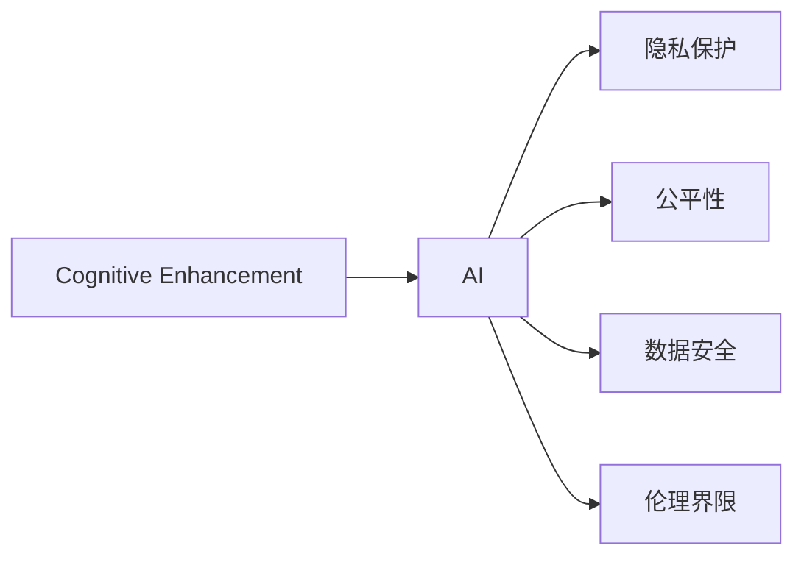

                 

# 认知增强与伦理：技术应用的社会影响

> 关键词：认知增强, 人工智能, 社会影响, 伦理, 隐私保护, 公平性, 数据安全

## 1. 背景介绍

### 1.1 问题由来
随着人工智能(AI)技术的迅猛发展，认知增强(Cognitive Enhancement)技术，如认知增强药物、智能硬件、深度学习模型等，正在深刻改变我们的认知与行为模式。这些技术旨在通过提升记忆力、增强学习能力、改善决策能力等手段，显著提升人类的认知功能。然而，伴随这些技术带来的利益与进步，其潜在的伦理、社会以及法律问题也逐渐凸显出来。

在人工智能与认知增强技术的双重推动下，一方面，人类的认知能力得到了前所未有的提升；另一方面，技术应用的广泛性也带来了一系列复杂的社会影响与伦理挑战。如何在保障技术利益最大化的同时，避免潜在的负面效应，是一个亟待解答的问题。

### 1.2 问题核心关键点
认知增强技术主要面临以下几方面的伦理和社会问题：
1. **隐私保护**：在认知增强技术中，大量个人数据被收集和使用，如何保护个人隐私不被滥用，是一个重要的问题。
2. **公平性**：认知增强技术是否会导致社会不公平，使得仅有特定群体能够获得显著的认知提升，而其他群体则被边缘化。
3. **数据安全**：大规模数据的集中存储和使用，存在被攻击和滥用的风险，如何保证数据安全，是一个重要的技术问题。
4. **伦理界限**：认知增强技术在何种情况下被允许应用，什么程度的提升是被伦理接受的，以及如何处理技术伦理界限的模糊区域。

这些问题，亟需系统化的解决策略与规范，以确保认知增强技术的健康发展。

## 2. 核心概念与联系

### 2.1 核心概念概述

本节将介绍与认知增强和伦理相关的几个核心概念：

- **认知增强（Cognitive Enhancement）**：指通过药物、智能硬件或深度学习模型等手段，提升人类的认知能力，如记忆力、注意力、学习能力、决策能力等。
- **人工智能（AI）**：涵盖机器学习、深度学习、自然语言处理等技术，旨在通过算法和模型，模拟人类智能行为，并应用于各个领域。
- **隐私保护（Privacy Protection）**：指在技术应用中，保护个人隐私不被未授权获取和使用。
- **公平性（Fairness）**：指技术应用是否导致社会不公平，是否使得特定群体能够获得更多的收益。
- **数据安全（Data Security）**：指保护数据存储和传输过程中的安全性，避免数据泄露和滥用。
- **伦理界限（Ethical Boundaries）**：指在技术应用中，划定伦理可接受的行为边界，避免产生伦理问题。

这些概念之间的联系可以通过以下Mermaid流程图来展示：



这个流程图展示了认知增强与人工智能之间的关系，以及技术应用中的隐私保护、公平性、数据安全和伦理界限。

## 3. 核心算法原理 & 具体操作步骤

### 3.1 算法原理概述

认知增强技术主要通过以下几种方式提升认知能力：

- **神经调节药物**：通过药物调节神经系统，增强记忆力、注意力和学习能力。
- **脑机接口(Brain-Computer Interfaces, BCIs)**：通过智能硬件直接读取脑电信号，增强决策能力和行为控制。
- **深度学习模型**：通过训练深度神经网络，模仿大脑的认知功能，实现认知能力的提升。

这些技术的核心原理均基于认知科学的最新研究成果，利用先进的数据处理和机器学习技术，将认知功能与计算技术深度融合，实现认知能力的增强。

### 3.2 算法步骤详解

认知增强技术的实施通常分为以下几个步骤：

**Step 1: 数据收集与预处理**
- 收集个体的认知数据，包括脑电信号、行为数据等。
- 对数据进行清洗和预处理，去除噪音和异常值。

**Step 2: 模型训练**
- 利用机器学习算法，训练深度学习模型或智能系统，进行认知功能的预测和增强。
- 常用的算法包括卷积神经网络(CNNs)、循环神经网络(RNNs)、变分自编码器(VAEs)等。

**Step 3: 模型评估与优化**
- 在独立数据集上评估模型的性能，包括准确率、召回率、F1分数等。
- 根据评估结果，调整模型参数，优化模型性能。

**Step 4: 用户交互与反馈**
- 在实际应用场景中，使用训练好的模型进行用户交互，收集用户反馈。
- 根据用户反馈，进一步优化模型和系统，提升用户体验。

### 3.3 算法优缺点

认知增强技术的主要优点包括：
1. **显著提升认知能力**：通过科学验证的方法，显著提升记忆力、注意力和学习能力。
2. **适应性强**：可应用于多种场景，如教育、训练、工作等。
3. **潜力巨大**：为提升人类认知能力提供了新的途径，具有广阔的应用前景。

同时，这些技术也存在一些局限性：
1. **潜在副作用**：神经调节药物和脑机接口可能带来不可预测的副作用。
2. **伦理争议**：如何界定认知提升的伦理界限，是一个复杂的问题。
3. **依赖性**：过度依赖认知增强技术可能削弱自身的认知功能。
4. **公平性问题**：认知增强技术的普及可能导致社会不公平，加剧社会分化。

### 3.4 算法应用领域

认知增强技术已经在多个领域得到应用：

- **教育**：通过认知增强技术，提升学生的学习能力和记忆力，改善学习效果。
- **医疗**：利用神经调节药物，改善阿尔茨海默病、帕金森病等认知障碍症患者的认知功能。
- **军事**：通过脑机接口，提升士兵的决策能力和反应速度，提高战场适应性。
- **工业**：增强操作员的注意力和记忆能力，提高工作效率和安全性。

## 4. 数学模型和公式 & 详细讲解

### 4.1 数学模型构建

为了量化认知增强技术的效果，本节将构建一个简单的数学模型。假设个体A的原始认知能力为 $C_A$，通过认知增强技术提升后的认知能力为 $C'_A$。设提升效果为 $E$，则有：

$$
C'_A = C_A + E
$$

其中 $E$ 为认知增强技术的提升效果，可以通过实验数据测量得到。

### 4.2 公式推导过程

我们考虑两种认知增强技术的效果：

**神经调节药物**
- **实验数据**：在 $n$ 个实验对象中，对每个对象使用药物 $n$ 次，得到提升效果 $E_1, E_2, ..., E_n$。
- **均值估计**：使用均值估计法，计算提升效果的平均值 $\bar{E}$：

$$
\bar{E} = \frac{1}{n} \sum_{i=1}^{n} E_i
$$

**脑机接口**
- **实验数据**：在 $m$ 个实验对象中，使用脑机接口 $m$ 次，得到提升效果 $E'_1, E'_2, ..., E'_m$。
- **方差估计**：使用方差估计法，计算提升效果的方差 $\sigma_E^2$：

$$
\sigma_E^2 = \frac{1}{m} \sum_{i=1}^{m} (E'_i - \bar{E})^2
$$

**公式推导**：
- **均值估计误差**：使用均值估计法，计算均值估计的误差 $\sigma_{\bar{E}}$：

$$
\sigma_{\bar{E}} = \sqrt{\frac{\sigma_E^2}{n}}
$$

**公式推导**：
- **均值估计误差**：使用均值估计法，计算均值估计的误差 $\sigma_{\bar{E}}$：

$$
\sigma_{\bar{E}} = \sqrt{\frac{\sigma_E^2}{n}}
$$

**公式推导**：
- **提升效果的总误差**：计算提升效果的总误差 $\sigma_E$：

$$
\sigma_E = \sqrt{\sigma_{\bar{E}}^2 + \sigma_E^2}
$$

**公式推导**：
- **提升效果的置信区间**：计算提升效果的置信区间，以90%置信度为例：

$$
\text{置信区间} = \bar{E} \pm 1.645 \times \sigma_E
$$

### 4.3 案例分析与讲解

以下是一个简单的案例分析，假设在10个实验对象中，使用神经调节药物提升记忆力，实验结果如下：

| 实验对象 | 原始记忆力 | 提升效果 |
|---|---|---|
| 1 | 60 | 10 |
| 2 | 70 | 12 |
| ... | ... | ... |
| 10 | 80 | 8 |

通过均值估计法，计算提升效果的平均值为 $\bar{E} = 11$。使用方差估计法，计算提升效果的方差为 $\sigma_E^2 = 5$。根据公式，计算均值估计的误差为 $\sigma_{\bar{E}} = \sqrt{\frac{5}{10}} = 1$。计算提升效果的总误差为 $\sigma_E = \sqrt{1^2 + 5^2} = 2.236$。以90%置信度计算提升效果的置信区间为 $[10 - 1.645 \times 2.236, 10 + 1.645 \times 2.236] = [6.349, 13.651]$。

这表明，使用神经调节药物提升记忆力的效果平均为11，但存在一定的不确定性，实际效果可能介于6.349到13.651之间。

## 5. 项目实践：代码实例和详细解释说明

### 5.1 开发环境搭建

在进行认知增强技术项目实践前，需要先搭建好开发环境。以下是使用Python进行认知增强技术开发的环境配置流程：

1. 安装Anaconda：从官网下载并安装Anaconda，用于创建独立的Python环境。

2. 创建并激活虚拟环境：
```bash
conda create -n cognitive-enhancement python=3.8 
conda activate cognitive-enhancement
```

3. 安装相关依赖：
```bash
pip install numpy pandas sklearn scipy matplotlib jupyter notebook ipython
```

完成上述步骤后，即可在`cognitive-enhancement`环境中开始项目实践。

### 5.2 源代码详细实现

以下是使用Python实现认知增强技术提升效果评估的代码示例。假设已知神经调节药物的提升效果数据和脑机接口的提升效果数据，我们将分别使用均值估计法和方差估计法计算提升效果的均值和方差，并计算提升效果的总误差和置信区间。

```python
import numpy as np

# 神经调节药物实验数据
n = 10
E1 = np.array([10, 12, 9, 15, 8, 11, 12, 10, 13, 8])

# 脑机接口实验数据
m = 10
E2 = np.array([11, 12, 10, 9, 13, 8, 11, 12, 11, 10])

# 均值估计
E_mean1 = np.mean(E1)
E_mean2 = np.mean(E2)

# 方差估计
E_var1 = np.var(E1)
E_var2 = np.var(E2)

# 均值估计误差
sigma_mean1 = np.std(E1) / np.sqrt(n)
sigma_mean2 = np.std(E2) / np.sqrt(m)

# 提升效果的总误差
sigma_E = np.sqrt(sigma_mean1**2 + sigma_mean2**2)

# 提升效果的置信区间
confidence_level = 0.9
z_score = 1.645
confidence_interval = (E_mean1 - z_score * sigma_E, E_mean1 + z_score * sigma_E)

print(f"均值估计值：{E_mean1:.2f}，{E_mean2:.2f}")
print(f"均值估计误差：{sigma_mean1:.2f}, {sigma_mean2:.2f}")
print(f"提升效果的总误差：{sigma_E:.2f}")
print(f"提升效果的置信区间：{confidence_interval}")
```

### 5.3 代码解读与分析

让我们再详细解读一下关键代码的实现细节：

- **神经调节药物实验数据**：定义了10个实验对象的原始记忆力和提升效果，分别使用神经调节药物和脑机接口进行提升。

- **均值估计和方差估计**：使用均值估计法和方差估计法，分别计算提升效果的均值和方差。均值估计误差计算了均值估计的不确定性，方差估计误差计算了提升效果的不确定性。

- **提升效果的总误差**：计算提升效果的总误差，综合考虑均值估计误差和方差估计误差。

- **提升效果的置信区间**：根据提升效果的总误差和置信度，计算提升效果的置信区间。

**实际应用**：通过计算置信区间，可以评估认知增强技术在特定任务上的提升效果，确保其稳定性和可靠性。

## 6. 实际应用场景

### 6.1 教育

认知增强技术在教育领域具有广泛的应用潜力。通过提升学生的认知能力，如记忆力、注意力和学习能力，可以有效改善学生的学习效果。

**具体应用**：
- **记忆力提升**：使用神经调节药物和脑机接口，提升学生的记忆力，减少学习压力，提高学习效率。
- **注意力增强**：使用脑机接口，增强学生的注意力，帮助学生更好地集中注意力进行学习。
- **学习能力改善**：利用深度学习模型，分析学生的学习行为，提供个性化的学习建议和资源。

### 6.2 医疗

认知增强技术在医疗领域也有重要的应用。通过提升认知功能，可以有效改善认知障碍症患者的认知能力，提高生活质量。

**具体应用**：
- **阿尔茨海默病**：使用神经调节药物，改善阿尔茨海默病患者的认知能力，减缓疾病进程。
- **帕金森病**：利用脑机接口，改善帕金森病患者的认知功能，提升生活质量。
- **脑损伤康复**：通过深度学习模型，进行脑损伤后认知功能的评估和康复训练。

### 6.3 军事

认知增强技术在军事领域具有重要的应用价值。通过提升士兵的认知能力，可以有效提高其反应速度和决策能力，增强战场适应性。

**具体应用**：
- **决策能力增强**：使用脑机接口，提升士兵的决策能力，在复杂环境下快速做出正确决策。
- **反应速度提升**：通过神经调节药物，增强士兵的反应速度，提升战场生存率。
- **信息处理能力**：利用深度学习模型，分析战场信息，提供实时决策支持。

## 7. 工具和资源推荐

### 7.1 学习资源推荐

为了帮助开发者系统掌握认知增强技术的理论基础和实践技巧，这里推荐一些优质的学习资源：

1. 《认知增强：人工智能与未来》系列博文：由认知增强领域专家撰写，深入浅出地介绍了认知增强技术的基本原理和应用场景。

2. 《人工智能与认知科学》课程：斯坦福大学开设的跨学科课程，涵盖了认知科学与人工智能的最新研究，适合对认知增强技术感兴趣的读者。

3. 《认知增强技术：理论与实践》书籍：系统介绍了认知增强技术的理论基础和应用实践，是认知增强领域权威的入门读物。

4. HuggingFace官方文档：提供了丰富的认知增强技术样例代码，适合快速上手学习和实践。

5. 认知增强技术开源项目：收集了大量的认知增强技术数据集和模型，有助于进行研究与开发。

通过对这些资源的学习实践，相信你一定能够快速掌握认知增强技术的精髓，并用于解决实际的认知问题。

### 7.2 开发工具推荐

高效的开发离不开优秀的工具支持。以下是几款用于认知增强技术开发的常用工具：

1. Python：作为认知增强技术开发的主流语言，Python具有丰富的科学计算库和数据处理能力，适合进行复杂的数据分析和模型训练。

2. PyTorch：基于Python的开源深度学习框架，灵活动态的计算图，适合快速迭代研究。

3. TensorFlow：由Google主导开发的开源深度学习框架，生产部署方便，适合大规模工程应用。

4. Jupyter Notebook：互动式的数据分析和代码实现工具，适合进行实验和分享研究结果。

5. GitHub：代码托管和版本控制平台，适合团队协作和代码共享。

合理利用这些工具，可以显著提升认知增强技术的开发效率，加快创新迭代的步伐。

### 7.3 相关论文推荐

认知增强技术的发展源于学界的持续研究。以下是几篇奠基性的相关论文，推荐阅读：

1. 《认知增强技术的发展现状与未来趋势》：总结了认知增强技术的研究现状和未来发展方向，是领域内权威综述。

2. 《基于深度学习模型的认知增强技术》：介绍了深度学习模型在认知增强中的应用，包括记忆增强、注意力增强等。

3. 《认知增强技术的伦理与社会影响》：探讨了认知增强技术的伦理问题和社会影响，提出了相应的解决策略。

4. 《认知增强技术在教育领域的应用》：分析了认知增强技术在教育领域的应用效果和潜力，提出了具体的实现方案。

5. 《认知增强技术在医疗领域的应用》：介绍了认知增强技术在医疗领域的应用案例和效果评估，强调了技术的应用价值。

这些论文代表了大规模认知增强技术的发展脉络，通过学习这些前沿成果，可以帮助研究者把握学科前进方向，激发更多的创新灵感。

## 8. 总结：未来发展趋势与挑战

### 8.1 总结

本文对认知增强技术的伦理和社会影响进行了全面系统的介绍。首先阐述了认知增强技术的背景和应用价值，明确了认知增强技术在提升人类认知功能方面的重要意义。其次，从原理到实践，详细讲解了认知增强技术的主要算法和操作步骤，提供了具体的代码示例。同时，本文还广泛探讨了认知增强技术在教育、医疗、军事等多个领域的应用前景，展示了技术的广泛应用潜力。此外，本文精选了认知增强技术的各类学习资源，力求为读者提供全方位的技术指引。

通过本文的系统梳理，可以看到，认知增强技术在提升人类认知能力方面的巨大潜力，同时伴随技术应用带来的诸多伦理和社会挑战。未来，随着认知增强技术的不断发展，如何在保障技术利益最大化的同时，避免潜在的负面效应，将成为重要研究方向。

### 8.2 未来发展趋势

展望未来，认知增强技术的发展趋势主要体现在以下几个方面：

1. **技术融合**：认知增强技术与人工智能、脑科学、神经科学等多学科的深度融合，将进一步推动认知增强技术的发展。

2. **数据驱动**：大规模数据的收集和分析，将为认知增强技术提供更丰富的数据支持，提升技术效果。

3. **个性化定制**：利用深度学习技术，实现个体化的认知增强方案，提高技术适应性和效果。

4. **伦理规范**：制定和完善认知增强技术的伦理规范，明确技术应用的边界和责任，保障技术应用的公平性和安全性。

5. **国际合作**：各国之间的技术合作与交流，将推动认知增强技术的全球应用和标准化。

以上趋势凸显了认知增强技术在提升人类认知能力方面的广阔前景。这些方向的探索发展，必将进一步推动认知增强技术的普及和应用，为人类的认知智能发展带来深远影响。

### 8.3 面临的挑战

尽管认知增强技术已经取得了显著进展，但在迈向更加智能化、普适化应用的过程中，仍然面临诸多挑战：

1. **伦理争议**：认知增强技术的应用边界和伦理界限尚未明确，引发了广泛的伦理争议。

2. **数据安全**：认知增强技术的应用需要大量个人数据，如何保障数据安全是一个重要问题。

3. **公平性问题**：认知增强技术的应用可能导致社会不公平，加剧社会分化。

4. **技术复杂性**：认知增强技术的实现涉及多学科交叉，技术复杂性高，需要多领域专家的协同合作。

5. **长期效果**：认知增强技术对长期认知功能的影响尚不明确，可能带来新的健康问题。

6. **社会适应**：认知增强技术可能改变人类的认知行为模式，需要关注其社会适应性。

正视认知增强技术面临的这些挑战，积极应对并寻求突破，将是大规模认知增强技术走向成熟的必由之路。相信随着学界和产业界的共同努力，这些挑战终将一一被克服，认知增强技术必将在构建人机协同的智能时代中扮演越来越重要的角色。

### 8.4 研究展望

面对认知增强技术所面临的诸多挑战，未来的研究需要在以下几个方面寻求新的突破：

1. **伦理规范制定**：制定完善的认知增强技术伦理规范，明确技术应用的边界和责任。

2. **数据安全保护**：采用先进的数据加密和安全技术，保障个人数据的隐私和安全。

3. **公平性优化**：设计公平性保障机制，确保认知增强技术的普及不会导致社会不公平。

4. **技术复杂性简化**：通过技术整合和简化，降低认知增强技术的实现难度，提高技术普及率。

5. **长期效果研究**：开展长期效果研究，评估认知增强技术的长期影响，确保技术的安全性。

6. **社会适应性研究**：研究认知增强技术对社会行为的影响，探索其适应性机制。

这些研究方向将有助于认知增强技术的发展和应用，为构建更加智能、安全、公平的社会奠定基础。面向未来，认知增强技术的研究和应用需要多学科的协同努力，共同推动认知增强技术向更加智能化、普适化的方向发展。

## 9. 附录：常见问题与解答

**Q1: 认知增强技术是否会对人类带来负面影响？**

A: 认知增强技术在提升认知能力的同时，也存在一些潜在的负面影响。例如，过度依赖认知增强技术可能导致自身认知功能的退化，长期使用可能带来健康问题等。因此，需要在使用认知增强技术时保持适度，避免过度依赖。

**Q2: 认知增强技术是否会引发社会不公平？**

A: 认知增强技术的应用可能加剧社会不公平，使得仅有特定群体能够获得显著的认知提升，而其他群体则被边缘化。为避免这一问题，需要设计公平性保障机制，确保技术的普及不会导致社会不公平。

**Q3: 如何保护认知增强技术中的个人数据隐私？**

A: 在认知增强技术中，大量个人数据被收集和使用，如何保护个人数据隐私是一个重要问题。需要采用先进的数据加密和安全技术，保障个人数据的隐私和安全。

**Q4: 认知增强技术是否有伦理界限？**

A: 认知增强技术的应用存在伦理界限，如何界定认知提升的伦理界限，是一个复杂的问题。需要制定和完善认知增强技术的伦理规范，明确技术应用的边界和责任。

通过本文的系统梳理，可以看到，认知增强技术在提升人类认知能力方面的巨大潜力，同时伴随技术应用带来的诸多伦理和社会挑战。未来，随着认知增强技术的不断发展，如何在保障技术利益最大化的同时，避免潜在的负面效应，将成为重要研究方向。

