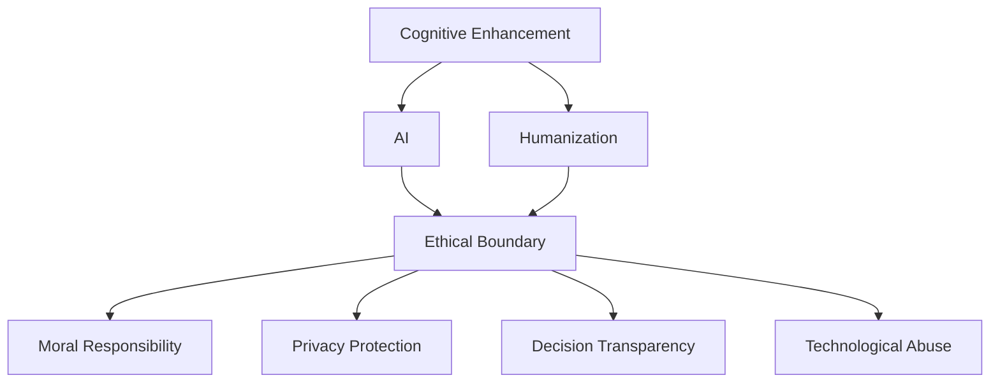

                 

# 认知增强的伦理边界：人性的定义与挑战

> 关键词：认知增强,人工智能,人性,伦理边界,道德责任,隐私保护,决策透明

## 1. 背景介绍

### 1.1 问题由来

随着人工智能(AI)技术的迅猛发展，尤其是深度学习在认知增强领域的应用，人类的认知能力得到了前所未有的提升。AI系统可以辅助人类解决复杂问题，提供决策支持，甚至在某些特定领域超越人类。然而，认知增强技术的广泛应用也引发了诸多伦理和道德问题。如何界定人工智能与人类认知能力的边界，确保技术发展不偏离人性化的初衷，是当前AI领域面临的重要挑战。

### 1.2 问题核心关键点

本研究聚焦于认知增强技术的伦理边界问题，主要关注以下几个核心关键点：

- **人性定义**：探讨人性在AI时代的具体内涵，如何界定AI系统的决策行为是否符合人类价值观。
- **道德责任**：在AI辅助决策场景中，由谁承担最终的责任和后果，包括过失与正当性。
- **隐私保护**：认知增强系统如何处理用户数据，如何确保数据的合法使用和隐私保护。
- **决策透明**：AI系统如何向用户解释其决策过程，提升决策的透明性和可解释性。
- **技术滥用**：认知增强技术可能被用于不正当用途，如何避免滥用，确保技术应用的正当性。

这些关键点共同构成了认知增强技术的伦理框架，旨在指导技术开发与应用，确保AI技术的发展符合人类社会的利益和价值观。

## 2. 核心概念与联系

### 2.1 核心概念概述

为更好地理解认知增强技术的伦理边界，本节将介绍几个密切相关的核心概念：

- **认知增强(Cognitive Enhancement)**：通过AI技术辅助人类认知能力提升，包括增强记忆、提高学习效率、优化决策等。
- **人工智能(Artificial Intelligence, AI)**：基于算法和模型，模拟人类智能，解决复杂问题的技术。
- **人性化(Humanization)**：AI系统设计时，尽可能贴近人类的认知模式和价值观，确保技术应用的正当性和可接受性。
- **伦理边界(Ethical Boundary)**：认知增强技术应用时，需在提升认知能力和符合伦理规范之间寻找平衡点。
- **道德责任(Moral Responsibility)**：在AI辅助决策场景中，明确各参与方的责任和义务，避免因技术误用导致的负面影响。
- **隐私保护(Privacy Protection)**：在认知增强系统设计中，确保用户数据的安全和隐私，避免数据滥用。
- **决策透明(Decision Transparency)**：AI系统需向用户解释其决策依据，提升用户信任度。
- **技术滥用(Technological Abuse)**：认知增强技术可能被不正当使用，需建立有效的监管机制，防止技术滥用。

这些核心概念之间的逻辑关系可以通过以下Mermaid流程图来展示：



这个流程图展示了大语言模型的核心概念及其之间的关系：

1. 认知增强技术基于AI实现。
2. 认知增强技术设计时需考虑人性化因素，确保符合人类价值观。
3. 伦理边界界定了认知增强技术的合理应用范围。
4. 认知增强系统需明确各方的道德责任。
5. 系统设计需关注隐私保护。
6. 决策过程需保证透明，增强用户信任。
7. 需防止技术滥用，建立监管机制。

这些概念共同构成了认知增强技术的伦理框架，其核心在于平衡技术提升与伦理规范之间的关系。

## 3. 核心算法原理 & 具体操作步骤

### 3.1 算法原理概述

认知增强技术通常涉及对用户认知能力的辅助决策，其核心算法原理可概括为：

1. **数据收集**：通过传感器、问卷调查等方式，收集用户的行为数据和认知数据。
2. **模型训练**：利用收集的数据，训练AI模型，提供个性化的决策建议。
3. **决策输出**：模型将处理后的数据输出为决策建议，辅助用户做出选择。
4. **伦理考量**：在决策过程中，确保算法符合伦理规范，保护用户隐私，提升决策透明性。

### 3.2 算法步骤详解

1. **数据收集与预处理**：
   - 收集用户的认知数据和行为数据。
   - 对数据进行清洗、去噪、标准化处理。
   - 确保数据的合法性和隐私保护。

2. **模型选择与训练**：
   - 选择合适的认知增强模型，如基于深度学习的分类、回归模型等。
   - 在收集的数据集上训练模型，调整模型参数，提升模型性能。
   - 采用交叉验证等方法，防止过拟合。

3. **决策输出与反馈**：
   - 模型对用户输入的数据进行预测，输出决策建议。
   - 用户根据建议进行决策，系统记录用户行为。
   - 收集用户反馈，调整模型参数，优化决策建议。

4. **伦理考量与改进**：
   - 确保模型训练和决策过程中符合伦理规范，如公平性、隐私性等。
   - 建立透明度机制，向用户解释决策依据。
   - 根据反馈和评价，不断改进模型，提升用户体验。

### 3.3 算法优缺点

认知增强技术在提升用户认知能力方面具有显著优势，但也存在一些缺点：

**优点**：
- 提升决策效率和准确性。
- 个性化决策建议，满足用户多样化需求。
- 减轻用户认知负担，优化用户体验。

**缺点**：
- 数据依赖性强，数据质量影响决策结果。
- 模型偏见可能影响决策公正性。
- 用户对技术依赖性增加，可能导致自主决策能力下降。
- 隐私保护问题，用户数据需妥善处理。

### 3.4 算法应用领域

认知增强技术在多个领域得到了广泛应用，例如：

- **医疗健康**：辅助医生进行疾病诊断，提供个性化治疗建议。
- **教育培训**：提供个性化学习路径，提升学习效率。
- **金融投资**：辅助投资者进行风险评估，优化投资决策。
- **职业发展**：提供职业规划和技能提升建议。
- **社交网络**：提升社交互动质量，增强用户情感连接。
- **运动健身**：提供个性化运动计划，提升健康水平。

除了上述这些典型应用外，认知增强技术还将在更多场景中得到应用，如智能家居、智能驾驶等，为人们的生活带来更多便利。

## 4. 数学模型和公式 & 详细讲解 & 举例说明

### 4.1 数学模型构建

认知增强技术通常涉及分类、回归等机器学习任务。以下以回归任务为例，构建数学模型。

假设输入数据为 $X$，模型参数为 $\theta$，输出为目标变量 $Y$。回归任务的目标是最小化预测值与真实值之间的误差：

$$
\min_{\theta} \sum_{i=1}^n (Y_i - f(X_i, \theta))^2
$$

其中 $f$ 为模型函数，$Y_i$ 为真实值，$X_i$ 为输入特征。常用的模型函数包括线性回归、多项式回归、神经网络等。

### 4.2 公式推导过程

以线性回归为例，推导最小二乘法的损失函数和梯度公式。

最小二乘法的损失函数为：

$$
L(\theta) = \frac{1}{2n} \sum_{i=1}^n (Y_i - \theta^TX_i)^2
$$

对损失函数求导，得梯度公式：

$$
\frac{\partial L(\theta)}{\partial \theta} = -\frac{1}{n} \sum_{i=1}^n (Y_i - \theta^TX_i)X_i
$$

根据梯度下降法，更新模型参数：

$$
\theta \leftarrow \theta - \eta \frac{\partial L(\theta)}{\partial \theta}
$$

其中 $\eta$ 为学习率，需根据具体情况调整。

### 4.3 案例分析与讲解

假设我们设计了一个辅助医生进行疾病诊断的系统。系统收集患者的症状数据，通过训练好的回归模型输出疾病的预测概率。

系统需确保模型在训练和应用过程中符合伦理规范，如：

- 数据隐私：确保患者数据匿名化，避免隐私泄露。
- 公平性：确保模型对不同种族、性别、年龄等群体的诊断准确性一致。
- 透明性：向医生解释模型输出概率的计算依据。

## 5. 项目实践：代码实例和详细解释说明

### 5.1 开发环境搭建

在进行认知增强项目开发前，需要准备好开发环境。以下是使用Python进行TensorFlow开发的环境配置流程：

1. 安装Anaconda：从官网下载并安装Anaconda，用于创建独立的Python环境。

2. 创建并激活虚拟环境：
```bash
conda create -n tf-env python=3.8 
conda activate tf-env
```

3. 安装TensorFlow：根据CUDA版本，从官网获取对应的安装命令。例如：
```bash
conda install tensorflow -c tensorflow -c conda-forge
```

4. 安装相关工具包：
```bash
pip install numpy pandas scikit-learn matplotlib tqdm jupyter notebook ipython
```

完成上述步骤后，即可在`tf-env`环境中开始认知增强项目的开发。

### 5.2 源代码详细实现

下面以医疗健康领域的疾病诊断系统为例，给出使用TensorFlow进行认知增强的PyTorch代码实现。

首先，定义输入和输出数据的占位符：

```python
import tensorflow as tf

X = tf.placeholder(tf.float32, shape=[None, num_features])
Y = tf.placeholder(tf.float32, shape=[None, 1])
```

然后，定义模型函数：

```python
def linear_regression(X, Y, num_features):
    W = tf.Variable(tf.random_normal([num_features, 1]))
    b = tf.Variable(tf.zeros([1]))
    Y_pred = tf.add(tf.matmul(X, W), b)
    loss = tf.reduce_mean(tf.square(Y_pred - Y))
    optimizer = tf.train.AdamOptimizer(learning_rate=0.01)
    train_op = optimizer.minimize(loss)
    return Y_pred, train_op
```

接着，定义训练和评估函数：

```python
import numpy as np

def train(X_train, Y_train, X_test, Y_test, num_features, epochs=100):
    Y_pred_train, train_op = linear_regression(X_train, Y_train, num_features)
    Y_pred_test, train_op = linear_regression(X_test, Y_test, num_features)
    
    sess = tf.Session()
    sess.run(tf.global_variables_initializer())
    
    for epoch in range(epochs):
        _, loss_train = sess.run([train_op, loss], feed_dict={X: X_train, Y: Y_train})
        loss_test = sess.run(loss, feed_dict={X: X_test, Y: Y_test})
        print("Epoch {}, Loss Train: {:.4f}, Loss Test: {:.4f}".format(epoch, loss_train, loss_test))
    
    return sess, Y_pred_train, Y_pred_test

def evaluate(Y_pred, Y_test):
    accuracy = np.mean(np.round(Y_pred) == Y_test)
    print("Accuracy: {:.2f}%".format(accuracy*100))
```

最后，启动训练流程并在测试集上评估：

```python
# 假设已加载训练和测试数据
X_train, Y_train, X_test, Y_test = load_data()

# 定义模型参数
num_features = 10

# 训练模型
sess, Y_pred_train, Y_pred_test = train(X_train, Y_train, X_test, Y_test, num_features)

# 评估模型
evaluate(Y_pred_train, Y_test)
evaluate(Y_pred_test, Y_test)
```

以上就是使用TensorFlow进行认知增强项目的完整代码实现。可以看到，TensorFlow提供了强大的API，使得模型训练和评估变得简洁高效。

### 5.3 代码解读与分析

让我们再详细解读一下关键代码的实现细节：

**线性回归函数**：
- 定义输入和输出占位符，并初始化模型参数。
- 构建模型函数，计算预测值和损失函数。
- 使用Adam优化器进行梯度下降，更新模型参数。

**训练函数**：
- 调用线性回归函数，分别在训练集和测试集上计算预测值和损失。
- 初始化TensorFlow会话，运行优化器。
- 循环迭代，记录每个epoch的损失。

**评估函数**：
- 使用numpy计算模型在测试集上的准确率。
- 打印准确率，用于评估模型性能。

**训练流程**：
- 加载数据。
- 定义模型参数。
- 调用训练函数，训练模型。
- 调用评估函数，评估模型性能。

可以看出，TensorFlow使得模型训练和评估变得十分方便，开发效率显著提升。但需要注意的是，实际应用中还需要考虑更多的因素，如模型参数调优、数据预处理、性能评估等。

## 6. 实际应用场景

### 6.1 医疗健康

认知增强技术在医疗健康领域的应用，主要体现在疾病诊断、个性化治疗、手术辅助等方面。通过AI技术，医生可以更准确地诊断疾病，制定个性化的治疗方案，提高手术的成功率和安全性。

在技术实现上，可以收集医生的临床经验、病历数据、基因信息等，利用回归模型、分类模型等对疾病进行预测和分类。微调后的模型需符合伦理规范，确保诊断结果的准确性和公正性。

### 6.2 教育培训

教育培训是认知增强技术的重要应用场景之一。通过AI技术，可以提供个性化的学习路径，提升学生的学习效果和教师的教学效率。

在技术实现上，可以收集学生的学习数据、行为数据、知识掌握情况等，利用回归模型、推荐系统等对学习路径进行优化。模型需符合公平性、透明性等伦理规范，确保学习资源分配的合理性。

### 6.3 金融投资

认知增强技术在金融领域的应用，主要体现在风险评估、投资决策、市场预测等方面。通过AI技术，投资者可以更准确地评估风险，制定投资策略，提升投资回报率。

在技术实现上，可以收集投资者的历史交易数据、市场数据、情绪数据等，利用回归模型、分类模型等进行风险评估和投资决策。模型需符合透明性、隐私保护等伦理规范，确保投资决策的公正性和可解释性。

### 6.4 未来应用展望

随着认知增强技术的不断发展，未来的应用场景将更加广泛。

在智慧城市治理中，认知增强技术可以用于城市事件监测、舆情分析、应急指挥等方面，提高城市管理的自动化和智能化水平。

在智慧教育中，认知增强技术可以用于智能作业批改、学情分析、知识推荐等方面，提升教育公平和教学质量。

在智慧医疗中，认知增强技术可以用于疾病诊断、个性化治疗、手术辅助等方面，提升医疗服务的智能化水平。

此外，在企业生产、社会治理、文娱传媒等众多领域，认知增强技术也将不断涌现，为传统行业数字化转型升级提供新的技术路径。相信随着技术的日益成熟，认知增强技术必将在更广阔的应用领域大放异彩。

## 7. 工具和资源推荐

### 7.1 学习资源推荐

为了帮助开发者系统掌握认知增强技术的理论基础和实践技巧，这里推荐一些优质的学习资源：

1. **《深度学习》系列书籍**：由深度学习领域的权威专家撰写，全面介绍了深度学习的基本概念和应用场景，适合入门和进阶学习。
2. **Coursera《深度学习专项课程》**：由斯坦福大学等知名高校开设，涵盖了深度学习的基础理论和实践技能。
3. **Kaggle竞赛**：通过参与Kaggle竞赛，实战练习数据预处理、模型选择、调参等技能，提升解决实际问题的能力。
4. **arXiv论文**：访问arXiv网站，阅读最新的认知增强技术论文，跟踪技术进展，获取最新研究动态。
5. **GitHub开源项目**：参与GitHub上的开源项目，学习认知增强技术的实践应用，积累实际开发经验。

通过对这些资源的学习实践，相信你一定能够快速掌握认知增强技术的精髓，并用于解决实际的NLP问题。

### 7.2 开发工具推荐

高效的开发离不开优秀的工具支持。以下是几款用于认知增强项目开发的常用工具：

1. **TensorFlow**：基于Python的开源深度学习框架，支持分布式计算和模型部署，适合大规模工程应用。
2. **Keras**：高层次的深度学习API，易于上手，提供了丰富的预训练模型和评估工具。
3. **PyTorch**：灵活的动态计算图，适合快速迭代研究，提供了强大的模型构建和调试功能。
4. **Scikit-learn**：提供了多种机器学习算法和工具，适合数据预处理和特征工程。
5. **Jupyter Notebook**：用于编写和运行Python代码的交互式开发环境，支持代码片段的保存和共享。

合理利用这些工具，可以显著提升认知增强项目的开发效率，加快创新迭代的步伐。

### 7.3 相关论文推荐

认知增强技术的发展源于学界的持续研究。以下是几篇奠基性的相关论文，推荐阅读：

1. **《DeepMind Health》**：DeepMind开发的医疗健康认知增强系统，展示了认知增强技术在实际应用中的成功案例。
2. **《Cognitive Enhancement with Machine Learning》**：总结了认知增强技术的最新研究进展，提出了多种模型和方法。
3. **《Fairness and Privacy in AI》**：讨论了AI系统中的公平性和隐私保护问题，提出了相关技术解决方案。
4. **《Explainable AI》**：介绍了可解释AI技术的最新研究进展，探讨了如何提高AI系统的透明性和可解释性。
5. **《Ethics and Fairness in AI》**：讨论了AI系统的伦理和公平性问题，提出了相关伦理准则和评估方法。

这些论文代表了大语言模型微调技术的发展脉络。通过学习这些前沿成果，可以帮助研究者把握学科前进方向，激发更多的创新灵感。

## 8. 总结：未来发展趋势与挑战

### 8.1 总结

本文对认知增强技术的伦理边界问题进行了全面系统的介绍。首先阐述了认知增强技术的背景和重要性，明确了其在提升人类认知能力方面的巨大潜力。其次，从原理到实践，详细讲解了认知增强技术的数学模型和操作步骤，给出了认知增强项目开发的完整代码实例。同时，本文还广泛探讨了认知增强技术在医疗、教育、金融等多个行业领域的应用前景，展示了技术应用的广泛性和多样性。此外，本文精选了认知增强技术的各类学习资源，力求为读者提供全方位的技术指引。

通过本文的系统梳理，可以看到，认知增强技术正在成为AI领域的重要方向，极大地拓展了AI技术的应用边界，催生了更多的落地场景。受益于深度学习和大数据技术的发展，认知增强技术在各个领域的应用将更加广泛和深入。

### 8.2 未来发展趋势

展望未来，认知增强技术将呈现以下几个发展趋势：

1. **技术成熟度提升**：随着深度学习模型的不断优化和算法框架的持续改进，认知增强技术的准确性和鲁棒性将显著提升。
2. **应用场景扩展**：认知增强技术将逐步应用于更多领域，如智能家居、智慧城市、智能交通等，推动各行业的智能化转型。
3. **多模态融合**：认知增强系统将支持语音、图像、文本等多种模态数据的输入，提升系统的综合理解和处理能力。
4. **个性化服务**：认知增强技术将根据用户的具体需求和偏好，提供个性化、定制化的服务，提升用户体验。
5. **伦理规范完善**：认知增强技术的应用将受到更为严格的伦理和法律规范的约束，确保技术应用的公正性和透明性。

这些趋势凸显了认知增强技术在各个领域的广阔前景，其核心在于如何平衡技术提升与伦理规范之间的关系，确保技术发展符合人类社会的利益和价值观。

### 8.3 面临的挑战

尽管认知增强技术在提升人类认知能力方面取得了显著成效，但在迈向更加智能化、普适化应用的过程中，它仍面临诸多挑战：

1. **数据质量问题**：认知增强系统依赖于高质量的数据，数据缺失、噪音和偏差等问题可能导致系统性能下降。
2. **伦理规范挑战**：如何在技术应用中平衡伦理和效率，确保技术应用符合人类价值观，是一个复杂的挑战。
3. **隐私保护难题**：认知增强系统处理大量用户数据，如何在数据处理和使用过程中确保用户隐私安全，是一个关键问题。
4. **模型透明性不足**：许多认知增强系统采用黑盒模型，难以解释其决策过程，导致用户信任度低。
5. **技术滥用风险**：认知增强技术可能被用于不正当用途，如何防止技术滥用，是一个重要的监管问题。

这些挑战需要技术社区、行业监管机构和用户共同努力，才能推动认知增强技术在各个领域的安全、公正、透明和高效应用。

### 8.4 研究展望

面向未来，认知增强技术的研究需要在以下几个方面寻求新的突破：

1. **数据质量提升**：提高数据采集和预处理技术，确保数据的多样性、准确性和代表性。
2. **伦理规范制定**：制定更加完善的伦理规范，确保技术应用符合人类价值观和道德标准。
3. **隐私保护机制**：建立数据保护机制，确保用户隐私安全，避免数据滥用。
4. **模型透明性提升**：开发可解释AI技术，提升认知增强系统的透明性和可解释性，增强用户信任。
5. **技术滥用防范**：建立技术滥用监控机制，及时发现和防范技术滥用行为。

这些研究方向的探索，必将引领认知增强技术迈向更高的台阶，为构建安全、可靠、可解释、可控的智能系统铺平道路。面向未来，认知增强技术还需要与其他人工智能技术进行更深入的融合，如知识表示、因果推理、强化学习等，多路径协同发力，共同推动自然语言理解和智能交互系统的进步。只有勇于创新、敢于突破，才能不断拓展认知增强技术的边界，让智能技术更好地造福人类社会。

## 9. 附录：常见问题与解答

**Q1：认知增强技术是否适用于所有应用场景？**

A: 认知增强技术在大多数应用场景上都能取得不错的效果，但对于一些特定领域，如金融、法律等，可能需要进一步的预训练和微调，以确保模型符合具体领域的规范和要求。此外，对于需要高度专业知识和人类情感判断的任务，认知增强技术可能难以完全替代人类。

**Q2：如何确保认知增强系统的公平性和透明性？**

A: 在模型设计和训练过程中，需确保数据的代表性、公平性和透明性。采用公平性算法，如对抗样本生成、数据增强等，确保模型对不同群体的预测一致。同时，开发可解释AI技术，向用户解释模型的决策依据，增强用户信任。

**Q3：认知增强系统在应用过程中如何确保用户隐私保护？**

A: 采用数据加密、去标识化、访问控制等技术手段，确保用户数据的隐私安全。建立数据使用协议，明确数据的使用范围和权限，防止数据滥用。

**Q4：认知增强系统的决策过程是否可以完全自动化？**

A: 认知增强系统的决策过程需结合人类的智慧和情感，确保决策的合理性和公正性。完全自动化的决策可能缺乏人类的情感判断和情境理解，导致决策错误。因此，需在自动化决策和人工干预之间找到平衡点。

**Q5：认知增强系统是否可以用于开发新的认知能力？**

A: 认知增强系统可以辅助人类开发新的认知能力，如提升记忆力、提升学习效率等。但完全依赖技术开发新的认知能力还面临技术、伦理等多方面的挑战，需在技术辅助和人类智慧之间找到平衡点。

---

作者：禅与计算机程序设计艺术 / Zen and the Art of Computer Programming

