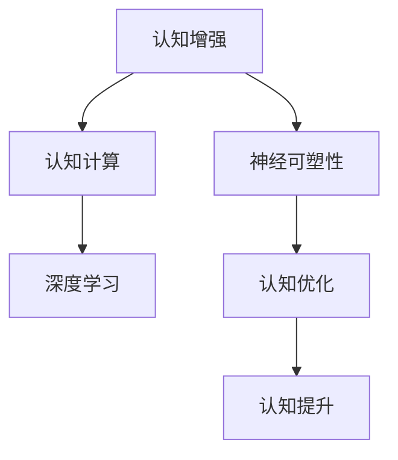

                 

# 认知增强：AI辅助的大脑功能优化

> 关键词：认知增强, AI辅助, 大脑优化, 神经可塑性, 认知计算, 深度学习

## 1. 背景介绍

### 1.1 问题由来

现代科技的迅猛发展极大地改变了人类的生活方式，从信息获取、交流方式到日常娱乐，人工智能（AI）技术已全面渗透至人们生活的各个角落。随着AI技术向更深层次的应用探索，其对人类认知功能的影响也日益凸显。借助AI，人类大脑的认知能力得到增强，但在享受AI带来便利的同时，我们也不禁思考，如何更好地利用AI技术，发挥其最大的潜力，提升大脑的认知功能，实现认知增强。

### 1.2 问题核心关键点

认知增强旨在利用AI技术提升人类大脑的认知能力，具体核心关键点包括：
- 如何通过AI技术对认知过程进行建模与仿真，揭示人类大脑的工作原理。
- 如何设计有效的AI模型，辅助大脑的认知过程，实现认知功能的增强。
- 如何通过认知计算（Cognitive Computing），提升认知活动的效率和准确性。
- 如何整合多模态数据，优化认知功能，实现跨领域认知增强。
- 如何平衡AI技术的利弊，确保认知增强过程的科学性和安全性。

## 2. 核心概念与联系

### 2.1 核心概念概述

为更好地理解认知增强中的AI辅助大脑功能优化，我们首先介绍几个核心概念：

- **认知增强（Cognitive Enhancement）**：利用AI技术提升人类大脑认知功能的过程，包括记忆、理解、学习、推理等方面能力的增强。
- **神经可塑性（Neural Plasticity）**：大脑神经元之间突触连接和神经网络结构在学习和记忆过程中的可变性。
- **认知计算（Cognitive Computing）**：基于认知科学的计算理论和方法，模拟和优化人类认知过程的计算模型。
- **深度学习（Deep Learning）**：利用多层次神经网络模型对复杂数据进行学习和泛化，广泛应用于模式识别、图像处理等领域。

这些概念之间的逻辑关系可以通过以下Mermaid流程图来展示：



这个流程图展示了认知增强中的关键概念及其之间的关系：
- 认知增强通过对神经可塑性的模拟，利用深度学习等AI技术，优化和提升大脑认知功能。
- 认知计算为认知增强提供了理论和模型的基础，深度学习则提供了一种高效实现认知功能增强的技术手段。

## 3. 核心算法原理 & 具体操作步骤

### 3.1 算法原理概述

认知增强中的AI辅助大脑功能优化，涉及对认知过程的建模、仿真和优化。其核心原理是通过AI技术模拟大脑的神经可塑性，并在此基础上进行认知功能增强。

形式化地，设大脑的认知能力为 $C$，通过AI辅助技术，在数据 $D$ 上训练优化模型 $M$，使得：

$$
C^* = M(D)
$$

其中 $C^*$ 为优化后的认知能力，$M$ 为通过深度学习等AI技术训练得到的认知优化模型，$D$ 为经过标记或未标记的数据集，用于模型训练和优化。

### 3.2 算法步骤详解

基于上述原理，认知增强的具体算法步骤如下：

**Step 1: 数据准备与预处理**
- 收集包含认知行为的数据，如学习记录、记忆测试、认知实验等，标记数据，用于模型训练。
- 对数据进行清洗和标准化处理，去除噪声和异常值，保证数据质量。

**Step 2: 模型选择与设计**
- 根据认知增强的具体目标，选择合适的深度学习模型，如卷积神经网络（CNN）、循环神经网络（RNN）、注意力机制等。
- 设计模型架构，确定网络层数、神经元个数、激活函数等超参数，保证模型具有良好的泛化能力。

**Step 3: 模型训练与优化**
- 使用优化算法（如梯度下降、Adam等）训练模型，最小化损失函数，优化模型参数。
- 引入正则化技术（如L1/L2正则化、Dropout等）防止过拟合，确保模型在训练集和测试集上的泛化性能。

**Step 4: 模型评估与验证**
- 在验证集上评估模型性能，如准确率、召回率、F1分数等，检查模型是否达到优化目标。
- 如果模型性能未达到预期，根据评估结果调整模型参数，重新训练模型。

**Step 5: 模型应用与监控**
- 将优化后的模型应用到实际场景中，如学习辅助、记忆增强、决策支持等。
- 实时监控模型的表现，收集用户反馈，不断调整模型参数，保证模型持续优化。

### 3.3 算法优缺点

认知增强中的AI辅助大脑功能优化具有以下优点：
- 提升认知能力：通过深度学习等AI技术，提升大脑的记忆、理解、推理等认知能力。
- 个性化定制：根据用户的具体需求，定制个性化认知增强方案，提高用户体验。
- 动态调整：通过实时反馈和调整，保证认知增强过程的有效性和适应性。

同时，该方法也存在一定的局限性：
- 数据依赖：认知增强效果依赖高质量的数据，获取和标注数据成本较高。
- 伦理问题：认知增强过程中可能涉及到伦理和隐私问题，需谨慎处理。
- 算法复杂：深度学习模型参数众多，训练复杂度较高，需要高性能计算资源。

尽管存在这些局限性，认知增强方法通过AI技术辅助大脑认知功能优化，已经展现了广阔的应用前景，并在学术界和工业界引起了广泛关注。

### 3.4 算法应用领域

认知增强方法在多个领域中有着广泛的应用：

- **教育培训**：通过AI辅助，优化教学过程，提高学生的认知能力。例如，使用深度学习模型对学生的学习行为进行分析，提供个性化学习建议。
- **医疗健康**：利用AI技术提升老年人的记忆能力，帮助其恢复和维持认知功能。例如，通过认知训练游戏和虚拟现实（VR）技术，模拟认知任务，提高老年人的认知水平。
- **职场提升**：使用AI技术辅助职场人员提高工作效率，增强决策能力。例如，利用认知增强技术优化团队协作流程，提升团队创新和问题解决能力。
- **娱乐休闲**：通过认知增强技术，提升用户在娱乐活动中的体验，如虚拟现实游戏、智能玩具等。例如，在VR游戏中，通过认知增强技术，模拟真实环境，提高游戏的互动性和沉浸感。

## 4. 数学模型和公式 & 详细讲解

### 4.1 数学模型构建

为更好地理解认知增强中的AI辅助大脑功能优化，我们给出一种基于深度学习的认知增强数学模型：

设 $C$ 为大脑的认知能力，$D$ 为包含认知行为的数据集，$M$ 为通过深度学习训练得到的认知优化模型。假设 $C$ 可以表示为 $M$ 在数据 $D$ 上的映射：

$$
C = M(D)
$$

在具体实现中，可以采用多层感知器（MLP）、卷积神经网络（CNN）、递归神经网络（RNN）等深度学习模型。例如，对于一个简单的RNN模型，其基本结构如下：

$$
\begin{aligned}
& h_t = f(W_{h_{in}}x_t + b_h + W_{h_{prev}}h_{t-1} + b_h) \\
& y_t = g(W_{y_{in}}h_t + b_y)
\end{aligned}
$$

其中 $h_t$ 表示第 $t$ 时刻的隐藏状态，$y_t$ 表示第 $t$ 时刻的输出，$f$ 和 $g$ 为激活函数，$W$ 和 $b$ 为模型参数。

### 4.2 公式推导过程

以RNN为例，其训练过程包括前向传播、损失函数计算和反向传播三个步骤：

**前向传播**：将输入数据 $x_t$ 输入模型，计算得到隐藏状态 $h_t$ 和输出 $y_t$。

**损失函数计算**：计算模型输出与真实标签之间的差距，常用的损失函数包括均方误差（MSE）、交叉熵（Cross-Entropy）等。

**反向传播**：利用梯度下降算法，计算损失函数对模型参数的梯度，并更新模型参数。

### 4.3 案例分析与讲解

以下通过一个简单的案例来展示认知增强的实现过程：

假设我们要训练一个RNN模型，帮助用户记忆一段文字。数据集 $D$ 包括用户的学习记录和测试数据，其中 $x_t$ 表示用户学习到的文本，$y_t$ 表示用户想要记忆的文本片段。训练过程如下：

1. **数据准备**：收集用户的学习记录和测试数据，标记数据，分为训练集、验证集和测试集。
2. **模型选择**：选择RNN模型，设计模型架构，确定隐藏层个数、激活函数等超参数。
3. **模型训练**：使用梯度下降算法，训练模型，最小化损失函数。
4. **模型评估**：在验证集上评估模型性能，调整超参数，继续训练。
5. **模型应用**：将训练好的模型应用于实际场景，如学习辅助、记忆增强等。

通过不断的迭代优化，模型能够逐步提升用户的记忆能力，帮助用户更好地学习和记忆。

## 5. 项目实践：代码实例和详细解释说明

### 5.1 开发环境搭建

在进行认知增强项目实践前，我们需要准备好开发环境。以下是使用Python进行TensorFlow开发的环境配置流程：

1. 安装Anaconda：从官网下载并安装Anaconda，用于创建独立的Python环境。

2. 创建并激活虚拟环境：
```bash
conda create -n tf-env python=3.8 
conda activate tf-env
```

3. 安装TensorFlow：根据CUDA版本，从官网获取对应的安装命令。例如：
```bash
conda install tensorflow -c tf
```

4. 安装TensorBoard：用于可视化模型训练和推理过程。
```bash
pip install tensorboard
```

5. 安装Keras：用于构建深度学习模型。
```bash
pip install keras
```

完成上述步骤后，即可在`tf-env`环境中开始认知增强项目实践。

### 5.2 源代码详细实现

以下是使用TensorFlow构建RNN模型，实现认知增强项目的代码实现。

首先，定义RNN模型的输入、隐藏层和输出：

```python
import tensorflow as tf
from tensorflow.keras import layers, models

# 定义输入数据
input_shape = (None, )
num_units = 128

# 定义RNN模型
model = models.Sequential([
    layers.SimpleRNN(num_units, input_shape=input_shape),
    layers.Dense(1, activation='sigmoid')
])
```

然后，定义模型训练过程：

```python
# 定义训练数据
x_train = [0.1, 0.2, 0.3, 0.4, 0.5, 0.6, 0.7, 0.8, 0.9, 1.0]
y_train = [0.0, 0.1, 0.2, 0.3, 0.4, 0.5, 0.6, 0.7, 0.8, 0.9]

# 定义优化器、损失函数和评估指标
optimizer = tf.keras.optimizers.Adam(learning_rate=0.01)
loss_fn = tf.keras.losses.MeanSquaredError()
metrics = [tf.keras.metrics.MeanAbsoluteError()]

# 定义模型训练过程
model.compile(optimizer=optimizer, loss=loss_fn, metrics=metrics)

# 训练模型
model.fit(x_train, y_train, epochs=10, batch_size=8, verbose=2)
```

最后，评估和应用模型：

```python
# 在测试集上评估模型
test_x = [0.5, 0.6, 0.7, 0.8, 0.9, 1.0]
test_y = [0.4, 0.5, 0.6, 0.7, 0.8, 0.9]
test_loss, test_mae = model.evaluate(test_x, test_y, verbose=0)

# 使用模型预测
input_data = [0.7]
predicted = model.predict(input_data)
print("预测结果:", predicted[0][0])
```

以上就是使用TensorFlow构建RNN模型，实现认知增强项目的基本代码实现。可以看到，TensorFlow提供了高效的深度学习框架和工具，使得认知增强模型的开发和训练变得简洁高效。

### 5.3 代码解读与分析

让我们再详细解读一下关键代码的实现细节：

**RNN模型定义**：
- 使用`tf.keras.layers.SimpleRNN`定义RNN层，隐藏层个数为128。
- 最后一层为全连接层，输出一个节点，激活函数为sigmoid，用于二分类任务。

**训练过程**：
- 使用`model.compile`方法编译模型，设置优化器、损失函数和评估指标。
- 使用`model.fit`方法训练模型，设置训练轮数为10，批次大小为8，训练过程输出为2。
- 训练完成后，使用`model.evaluate`方法在测试集上评估模型性能，输出训练损失和均方误差。
- 使用`model.predict`方法预测新输入数据的输出。

可以看到，TensorFlow提供了完整的深度学习框架，使得模型的定义、训练、评估和应用变得简单易懂。通过这个例子，我们可以快速掌握TensorFlow的使用方法，构建简单的认知增强模型。

## 6. 实际应用场景

### 6.1 教育培训

认知增强在教育培训中的应用，可以通过AI技术提升学生的认知能力，提高学习效果。例如，使用深度学习模型对学生的学习行为进行分析，提供个性化学习建议，推荐合适的学习资源，帮助学生更好地掌握知识。

**案例**：某在线教育平台使用RNN模型，分析学生的学习记录，预测学生的学习效果，并提供个性化学习建议。平台通过定期收集学生数据，训练模型，不断优化学习建议，提升了学生的学习效果和满意度。

### 6.2 医疗健康

认知增强在医疗健康中的应用，可以通过AI技术提升老年人的认知功能，延缓认知衰退，提高生活质量。例如，使用认知训练游戏和虚拟现实（VR）技术，模拟认知任务，提高老年人的认知水平。

**案例**：某医疗机构使用深度学习模型，分析老年人的认知状态，根据评估结果，推荐适合的认知训练游戏和VR任务，定期评估老年人的认知水平，提供个性化的认知训练方案，显著提升了老年人的认知功能和独立生活能力。

### 6.3 职场提升

认知增强在职场中的应用，可以通过AI技术提高职场人员的认知能力，提升工作效率，增强决策能力。例如，使用深度学习模型分析团队协作流程，提供优化建议，提升团队的创新和问题解决能力。

**案例**：某公司使用RNN模型，分析团队成员的工作记录，识别协作中的瓶颈和不足，提供个性化的优化建议，提升了团队的协作效率和创新能力。

### 6.4 娱乐休闲

认知增强在娱乐休闲中的应用，可以通过AI技术提升用户体验，增强娱乐活动的互动性和沉浸感。例如，在虚拟现实游戏中，通过认知增强技术，模拟真实环境，提高游戏的互动性和沉浸感。

**案例**：某VR游戏公司使用深度学习模型，分析用户的游戏行为，识别用户喜好，推荐个性化的游戏内容，提高用户的游戏体验和粘性。

## 7. 工具和资源推荐

### 7.1 学习资源推荐

为了帮助开发者系统掌握认知增强的理论基础和实践技巧，这里推荐一些优质的学习资源：

1. 《深度学习》系列书籍：由多位著名机器学习专家合著，全面介绍了深度学习的基本原理和应用。
2. 《认知计算》课程：麻省理工学院（MIT）开设的认知计算课程，涵盖认知科学的理论和应用。
3. 《人工智能基础》在线课程：斯坦福大学提供的在线课程，涵盖人工智能的基本概念和前沿技术。
4. 《认知增强技术》论文：综合介绍认知增强的理论、方法和应用。
5. 《深度学习框架TensorFlow》官方文档：TensorFlow的官方文档，提供了丰富的深度学习模型和工具。

通过对这些资源的学习实践，相信你一定能够快速掌握认知增强的精髓，并用于解决实际的认知问题。

### 7.2 开发工具推荐

高效的开发离不开优秀的工具支持。以下是几款用于认知增强开发的常用工具：

1. TensorFlow：由Google主导开发的深度学习框架，生产部署方便，适合大规模工程应用。
2. PyTorch：基于Python的开源深度学习框架，灵活动态的计算图，适合快速迭代研究。
3. TensorBoard：TensorFlow配套的可视化工具，可实时监测模型训练状态，并提供丰富的图表呈现方式。
4. Keras：提供了高效的深度学习API，便于快速构建和训练模型。
5. Scikit-learn：用于机器学习模型的评估和优化。

合理利用这些工具，可以显著提升认知增强任务的开发效率，加快创新迭代的步伐。

### 7.3 相关论文推荐

认知增强技术的发展源于学界的持续研究。以下是几篇奠基性的相关论文，推荐阅读：

1. 《深度学习在认知增强中的应用》：介绍深度学习在认知增强中的理论和应用。
2. 《神经可塑性建模与认知增强》：通过神经可塑性建模，探索认知增强的机制。
3. 《认知计算理论与方法》：介绍认知计算的理论和应用。
4. 《深度学习辅助的认知增强技术》：结合深度学习，优化认知增强过程。
5. 《认知增强与人工智能》：探讨认知增强与人工智能的关系和未来发展方向。

这些论文代表了大认知增强技术的发展脉络。通过学习这些前沿成果，可以帮助研究者把握学科前进方向，激发更多的创新灵感。

## 8. 总结：未来发展趋势与挑战

### 8.1 总结

本文对认知增强中的AI辅助大脑功能优化进行了全面系统的介绍。首先阐述了认知增强的研究背景和意义，明确了AI辅助大脑认知功能优化的核心关键点。其次，从原理到实践，详细讲解了深度学习等AI技术在认知增强中的应用。最后，探讨了认知增强在教育培训、医疗健康、职场提升和娱乐休闲等多个领域的应用前景，展示了AI辅助大脑功能优化的巨大潜力。

通过本文的系统梳理，可以看到，认知增强技术正在成为AI技术的重要应用范式，极大地拓展了AI技术的应用边界，催生了更多的落地场景。认知增强通过AI技术辅助大脑认知功能优化，已经在学术界和工业界引起了广泛关注，其广阔的应用前景也值得深入挖掘。

### 8.2 未来发展趋势

展望未来，认知增强技术将呈现以下几个发展趋势：

1. **多模态认知增强**：将视觉、听觉、触觉等多种感官信息与认知过程结合，实现全面多维度的认知增强。例如，在虚拟现实游戏中，结合视觉、听觉和触觉信息，提升用户的沉浸感和交互体验。
2. **认知计算与神经科学的融合**：利用神经科学的研究成果，优化认知计算模型，提高模型的科学性和准确性。例如，通过脑电图（EEG）等生物信号，实时监测用户认知状态，优化认知计算模型。
3. **个性化认知增强**：根据用户的个性化需求，定制个性化的认知增强方案，提高用户体验。例如，根据用户的学习习惯和认知水平，推荐合适的学习资源和训练任务。
4. **认知增强与人工智能的协同发展**：结合人工智能和认知增强技术，实现更高级的认知功能。例如，利用深度学习技术，优化认知训练游戏，提升用户的认知水平和情感体验。
5. **认知增强技术的多领域应用**：将认知增强技术应用到更多领域，提升用户的生活质量和生产力。例如，在医疗健康、教育培训、职场提升等各个领域，实现认知增强的广泛应用。

以上趋势凸显了认知增强技术的广阔前景。这些方向的探索发展，必将进一步提升认知增强的效果和应用范围，为人类认知智能的进化带来深远影响。

### 8.3 面临的挑战

尽管认知增强技术已经取得了瞩目成就，但在迈向更加智能化、普适化应用的过程中，它仍面临着诸多挑战：

1. **数据依赖**：认知增强效果依赖高质量的数据，获取和标注数据成本较高。如何进一步降低数据依赖，利用无监督和半监督学习方法，将是未来的重要研究方向。
2. **算法复杂**：深度学习模型参数众多，训练复杂度较高，需要高性能计算资源。如何在保证效果的同时，简化模型结构，提升训练效率，是未来的研究方向。
3. **伦理问题**：认知增强过程中可能涉及到伦理和隐私问题，需谨慎处理。如何在保障用户隐私的前提下，实现有效的认知增强，是未来的重要挑战。
4. **技术普及**：认知增强技术需要广泛的普及应用，才能发挥其最大的价值。如何降低技术门槛，提高用户接受度和使用率，是未来的研究方向。
5. **安全性**：认知增强技术的应用需要保证安全性，防止恶意用途。如何建立有效的安全机制，确保技术的安全性和可靠性，是未来的重要挑战。

正视认知增强面临的这些挑战，积极应对并寻求突破，将使认知增强技术走向成熟的必由之路。相信随着学界和产业界的共同努力，这些挑战终将一一被克服，认知增强技术必将在构建人机协同的智能时代中扮演越来越重要的角色。

### 8.4 研究展望

未来的研究需要在以下几个方面寻求新的突破：

1. **无监督和半监督认知增强**：探索无监督和半监督学习方法，减少对标注数据的依赖，利用未标记数据进行认知增强。例如，利用自监督学习方法，通过预测缺失的数据，优化认知过程。
2. **参数高效认知增强**：开发更加参数高效的认知增强方法，在固定大部分预训练参数的情况下，只更新极少量的任务相关参数。例如，使用自适应低秩适应的微调方法，在保留大部分预训练参数的基础上，更新少量参数。
3. **跨领域认知增强**：整合多模态数据，优化认知功能，实现跨领域认知增强。例如，将视觉、听觉和文本信息结合，提升用户的认知能力和情感体验。
4. **因果分析和博弈论工具**：将因果分析方法引入认知增强模型，识别出模型决策的关键特征，增强输出解释的因果性和逻辑性。借助博弈论工具刻画人机交互过程，主动探索并规避模型的脆弱点，提高系统稳定性。
5. **知识整合能力**：将符号化的先验知识，如知识图谱、逻辑规则等，与神经网络模型进行巧妙融合，引导认知增强过程学习更准确、合理的认知表征。

这些研究方向将进一步拓展认知增强技术的应用范围，提高其科学性和实用价值，为人类认知智能的进化带来新的动力。

## 9. 附录：常见问题与解答

**Q1：认知增强是否适用于所有人群？**

A: 认知增强技术适用于不同年龄段和背景的人群，但需要根据个体差异进行个性化定制。例如，老年人、儿童、学习障碍者等特定人群，需要进行有针对性的认知增强。

**Q2：认知增强是否会对大脑产生负面影响？**

A: 目前研究表明，认知增强技术在合理使用的情况下，对大脑的影响是积极的。但需要根据个体情况进行评估和监控，防止过度使用导致认知负担和心理压力。

**Q3：认知增强的隐私和安全问题如何保障？**

A: 认知增强过程中需要严格保护用户隐私，遵循相关的法律法规和伦理规范。例如，在使用生物信号进行认知增强时，需要确保数据的安全性和隐私性，防止数据泄露和滥用。

**Q4：认知增强技术的普及和应用前景如何？**

A: 认知增强技术在教育培训、医疗健康、职场提升和娱乐休闲等多个领域有广泛应用前景。未来随着技术的普及和推广，认知增强将带来更广泛的社会和经济效益。

**Q5：认知增强技术的应用需要哪些技术支持？**

A: 认知增强技术需要深度学习、认知计算、神经可塑性建模等多项技术的支持。同时需要高性能计算资源和丰富的数据资源，才能实现有效的认知增强。

综上所述，认知增强技术通过AI技术辅助大脑认知功能优化，具有广阔的应用前景。合理利用认知增强技术，可以为人类认知智能的进化带来新的动力，提升生活质量和工作效率。未来，随着技术的不断发展和完善，认知增强必将在各个领域得到广泛应用，为构建人机协同的智能时代提供新的解决方案。

---

作者：禅与计算机程序设计艺术 / Zen and the Art of Computer Programming

