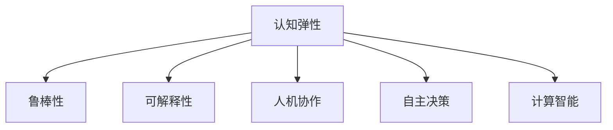
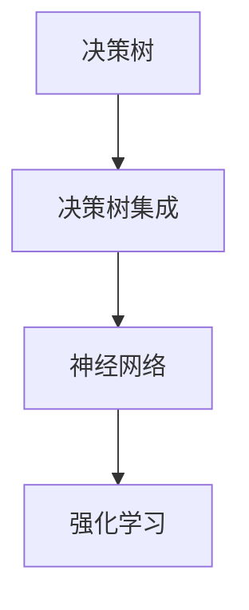

                 

# 认知弹性：应对不确定性的能力

> 关键词：认知弹性,不确定性,智能系统,鲁棒性,可解释性,人机协作,计算智能,自主决策,决策树,决策树集成,人工智能伦理

## 1. 背景介绍

### 1.1 问题由来

在现代社会，我们面临着越来越多的不确定性因素，如自然灾害、金融危机、社会动荡等。这些因素不仅影响了人类的日常生活，也对企业和组织的决策造成了巨大挑战。如何在不确定性的环境中做出明智的决策，成为现代智能系统面临的重要问题。

### 1.2 问题核心关键点

应对不确定性的核心在于构建具有认知弹性的智能系统，即能够在不确定的环境中，通过快速、准确地理解和推理来做出最优决策的系统。这种系统需要具备以下几个关键特性：

- **鲁棒性**：系统能够在面对不确定性因素时，保持稳定的性能和可靠性。
- **可解释性**：系统能够提供清晰的决策依据，便于用户理解和信任。
- **人机协作**：系统能够与人类专家协作，共同处理复杂问题。
- **自主决策**：系统能够在无需人类干预的情况下，根据环境变化自动调整决策策略。
- **计算智能**：系统能够高效处理大量数据，快速推理出最优决策。

本文旨在探讨如何构建具有这些特性的智能系统，以更好地应对不确定性环境中的决策挑战。

### 1.3 问题研究意义

构建认知弹性智能系统，不仅能够提升企业、组织应对不确定性的能力，还能够推动人工智能技术在各个领域的广泛应用，带来新的商业价值和社会效益。

- **提高决策效率**：智能系统能够快速分析和处理复杂数据，提供及时、准确的决策支持，提升决策效率。
- **减少人为错误**：通过自动化和智能化决策，减少人为错误，提高决策质量。
- **促进创新**：智能系统能够不断学习、优化，推动企业和组织的创新发展。
- **保障安全**：智能系统能够在安全领域发挥重要作用，如风险评估、应急响应等。
- **促进公平**：通过公平、透明的决策过程，提升社会信任和满意度。

## 2. 核心概念与联系

### 2.1 核心概念概述

为了更好地理解认知弹性智能系统的构建，本节将介绍几个密切相关的核心概念：

- **认知弹性(Cognitive Resilience)**：指系统在面对不确定性因素时，能够快速适应并做出最优决策的能力。
- **鲁棒性(Robustness)**：指系统在面对噪声、异常等干扰时，仍能保持稳定性能的特性。
- **可解释性(Explainability)**：指系统能够提供清晰的决策依据，便于用户理解和信任的特性。
- **人机协作(Human-Computer Collaboration)**：指系统能够与人类专家协作，共同处理复杂问题的特性。
- **自主决策(Autonomous Decision Making)**：指系统能够在无需人类干预的情况下，根据环境变化自动调整决策策略的特性。
- **计算智能(Computational Intelligence)**：指系统能够高效处理大量数据，快速推理出最优决策的特性。

这些核心概念之间的逻辑关系可以通过以下Mermaid流程图来展示：



这个流程图展示了几大核心概念及其之间的关系：

1. **认知弹性**是系统应对不确定性的总体能力。
2. **鲁棒性**、**可解释性**、**人机协作**、**自主决策**、**计算智能**都是构建认知弹性智能系统所依赖的关键特性。
3. **鲁棒性**和**计算智能**确保系统在面对不确定性时能够保持稳定和高效。
4. **可解释性**和**人机协作**确保系统决策过程透明、可信。
5. **自主决策**使得系统能够在无需人类干预的情况下，快速响应环境变化。

## 3. 核心算法原理 & 具体操作步骤
### 3.1 算法原理概述

构建认知弹性智能系统，主要依赖于以下几个核心算法：

- **决策树算法(Decision Trees)**：用于构建鲁棒、可解释的决策模型。
- **决策树集成(Ensemble Methods)**：通过集成多个决策树，提高系统的鲁棒性和泛化能力。
- **神经网络算法(Neural Networks)**：用于构建高效的计算智能模型。
- **强化学习算法(Reinforcement Learning)**：用于实现系统的自主决策能力。

这些算法之间的逻辑关系可以通过以下Mermaid流程图来展示：



这个流程图展示了几大核心算法及其之间的关系：

1. **决策树**用于构建鲁棒、可解释的决策模型。
2. **决策树集成**通过集成多个决策树，提高系统的鲁棒性和泛化能力。
3. **神经网络**用于构建高效的计算智能模型。
4. **强化学习**用于实现系统的自主决策能力。

### 3.2 算法步骤详解

构建认知弹性智能系统的具体步骤如下：

1. **数据准备**：收集相关领域的数据，包括历史数据、标签数据、测试数据等。
2. **特征工程**：对原始数据进行特征提取和处理，提升数据的表达能力。
3. **模型选择**：根据任务特点选择合适的算法模型，如决策树、神经网络、强化学习等。
4. **模型训练**：使用训练数据对模型进行训练，调整模型参数，使其能够准确地进行决策。
5. **模型评估**：使用测试数据对模型进行评估，衡量模型的性能和泛化能力。
6. **系统集成**：将多个模型集成到一个系统中，提升系统的整体性能和鲁棒性。
7. **人机协作**：开发界面，使人类专家能够与系统进行交互，提供反馈和指导。
8. **持续学习**：系统能够在运行过程中不断学习，优化决策模型，提升系统性能。

### 3.3 算法优缺点

构建认知弹性智能系统具有以下优点：

- **鲁棒性强**：通过决策树集成和神经网络算法，系统能够在面对噪声、异常等干扰时，仍能保持稳定性能。
- **泛化能力强**：通过决策树集成算法，系统能够泛化到未见过的数据，提升决策的准确性。
- **可解释性强**：通过决策树算法，系统能够提供清晰的决策依据，便于用户理解和信任。
- **自主决策能力**：通过强化学习算法，系统能够在无需人类干预的情况下，根据环境变化自动调整决策策略。
- **高效计算**：通过神经网络算法，系统能够高效处理大量数据，快速推理出最优决策。

同时，该方法也存在一定的局限性：

- **对数据依赖性强**：构建系统的过程中需要大量高质量的数据，数据获取成本较高。
- **模型复杂度高**：构建系统需要多个算法模型，模型设计和调参复杂度较高。
- **计算资源需求高**：神经网络和强化学习算法需要大量的计算资源，对硬件要求较高。
- **难以处理动态环境**：系统难以处理快速变化的动态环境，需要结合实时数据进行优化。
- **系统透明性问题**：神经网络算法的黑盒特性，使得系统的决策过程难以解释。

尽管存在这些局限性，但就目前而言，基于决策树、神经网络和强化学习算法的认知弹性智能系统仍是目前主流的构建范式。未来相关研究的重点在于如何进一步降低数据需求，提高系统的动态适应能力，同时兼顾可解释性和透明性等因素。

### 3.4 算法应用领域

基于认知弹性智能系统的构建方法，已经在多个领域得到了应用，例如：

- **金融风险评估**：通过构建认知弹性系统，能够快速评估金融市场的风险，提供决策支持。
- **医疗诊断**：构建认知弹性系统，能够根据患者的症状和历史数据，快速做出诊断，提供治疗方案。
- **智能制造**：构建认知弹性系统，能够实时监控生产线状态，自动调整生产参数，提升生产效率。
- **智能交通**：构建认知弹性系统，能够实时分析交通数据，优化交通流量，提升通行效率。
- **智能客服**：构建认知弹性系统，能够快速理解客户需求，提供个性化服务，提升客户满意度。

除了上述这些经典应用外，认知弹性智能系统还被创新性地应用到更多场景中，如智能电网、智慧城市、智能家居等，为各行各业带来了新的应用价值。

## 4. 数学模型和公式 & 详细讲解  
### 4.1 数学模型构建

本节将使用数学语言对认知弹性智能系统的构建过程进行更加严格的刻画。

记决策树模型为 $T$，神经网络模型为 $N$，强化学习模型为 $R$。决策树模型和神经网络模型的输入为 $X$，输出为 $Y$。强化学习模型在每个时间步 $t$ 的输入为 $X_t$，输出为 $A_t$，奖励函数为 $R_t$。

定义决策树模型的损失函数为 $\ell_D$，神经网络模型的损失函数为 $\ell_N$，强化学习模型的损失函数为 $\ell_R$。系统整体的损失函数为 $\ell$，表示系统在每个时间步的平均损失。

系统的目标是最小化整体损失函数 $\ell$，即：

$$
\ell = \frac{1}{T} \sum_{t=1}^T (\ell_D + \ell_N + \ell_R)
$$

其中 $T$ 表示系统运行的总时间步数。

### 4.2 公式推导过程

以下我们以金融风险评估任务为例，推导决策树和神经网络模型的联合损失函数及其梯度的计算公式。

假设系统需要评估的金融市场数据为 $X$，目标变量为 $Y$，系统在每个时间步 $t$ 的历史决策为 $A_{t-1}$，当前观测到的市场数据为 $X_t$，当前决策为 $A_t$。系统的目标是根据历史数据和当前数据，预测市场风险。

定义决策树模型的损失函数为 $L_D(X,Y)$，神经网络模型的损失函数为 $L_N(X,Y)$，强化学习模型的损失函数为 $L_R(X_t,A_t)$。系统整体的损失函数为 $L(X,Y)$。

决策树模型的损失函数可以定义为：

$$
L_D(X,Y) = -\frac{1}{N}\sum_{i=1}^N (y_i\log \hat{y}_i + (1-y_i)\log (1-\hat{y}_i))
$$

其中 $y_i$ 表示样本 $i$ 的标签，$\hat{y}_i$ 表示模型对样本 $i$ 的预测概率。

神经网络模型的损失函数可以定义为：

$$
L_N(X,Y) = -\frac{1}{N}\sum_{i=1}^N \|y_i - \hat{y}_i\|
$$

其中 $\|y_i - \hat{y}_i\|$ 表示预测值与真实值之间的误差。

强化学习模型的损失函数可以定义为：

$$
L_R(X_t,A_t) = -R_t(A_t)
$$

其中 $R_t(A_t)$ 表示在时间步 $t$ 下的即时奖励函数。

系统整体的损失函数可以定义为：

$$
L(X,Y) = \frac{1}{T}\sum_{t=1}^T (L_D + L_N + L_R)
$$

根据链式法则，损失函数对决策树模型的梯度为：

$$
\frac{\partial L(X,Y)}{\partial \theta_D} = \frac{1}{T}\sum_{t=1}^T (\frac{\partial L_D}{\partial \theta_D} + \frac{\partial L_N}{\partial \theta_D} + \frac{\partial L_R}{\partial \theta_D})
$$

其中 $\theta_D$ 表示决策树模型的参数。

根据链式法则，损失函数对神经网络模型的梯度为：

$$
\frac{\partial L(X,Y)}{\partial \theta_N} = \frac{1}{T}\sum_{t=1}^T (\frac{\partial L_D}{\partial \theta_N} + \frac{\partial L_N}{\partial \theta_N} + \frac{\partial L_R}{\partial \theta_N})
$$

其中 $\theta_N$ 表示神经网络模型的参数。

根据链式法则，损失函数对强化学习模型的梯度为：

$$
\frac{\partial L(X,Y)}{\partial \theta_R} = \frac{1}{T}\sum_{t=1}^T (\frac{\partial L_D}{\partial \theta_R} + \frac{\partial L_N}{\partial \theta_R} + \frac{\partial L_R}{\partial \theta_R})
$$

其中 $\theta_R$ 表示强化学习模型的参数。

在得到损失函数的梯度后，即可带入参数更新公式，完成模型的迭代优化。重复上述过程直至收敛，最终得到适应金融风险评估任务的最优模型参数。

## 5. 项目实践：代码实例和详细解释说明
### 5.1 开发环境搭建

在进行认知弹性智能系统的实践前，我们需要准备好开发环境。以下是使用Python进行TensorFlow开发的环境配置流程：

1. 安装Anaconda：从官网下载并安装Anaconda，用于创建独立的Python环境。

2. 创建并激活虚拟环境：
```bash
conda create -n tf-env python=3.8 
conda activate tf-env
```

3. 安装TensorFlow：根据CUDA版本，从官网获取对应的安装命令。例如：
```bash
conda install tensorflow -c tf -c conda-forge
```

4. 安装Keras：
```bash
conda install keras -c conda-forge
```

5. 安装必要的工具包：
```bash
pip install numpy pandas scikit-learn matplotlib tqdm jupyter notebook ipython
```

完成上述步骤后，即可在`tf-env`环境中开始认知弹性系统的开发。

### 5.2 源代码详细实现

下面我以金融风险评估任务为例，给出使用TensorFlow对决策树和神经网络模型进行联合训练的代码实现。

首先，定义金融风险评估任务的数据处理函数：

```python
import pandas as pd
from sklearn.model_selection import train_test_split
from sklearn.preprocessing import StandardScaler

# 读取数据
data = pd.read_csv('financial_data.csv')

# 定义特征和标签
X = data[['feature1', 'feature2', 'feature3']]
y = data['risk_level']

# 特征标准化
scaler = StandardScaler()
X = scaler.fit_transform(X)

# 划分训练集和测试集
X_train, X_test, y_train, y_test = train_test_split(X, y, test_size=0.2, random_state=42)
```

然后，定义决策树模型和神经网络模型：

```python
from tensorflow.keras import models, layers
from sklearn.tree import DecisionTreeClassifier

# 定义决策树模型
dt = DecisionTreeClassifier()

# 定义神经网络模型
model = models.Sequential()
model.add(layers.Dense(64, activation='relu', input_shape=(X_train.shape[1],)))
model.add(layers.Dense(1, activation='sigmoid'))

# 编译模型
model.compile(optimizer='adam', loss='binary_crossentropy', metrics=['accuracy'])
```

接着，定义联合训练函数：

```python
from tensorflow.keras.callbacks import EarlyStopping

# 定义联合训练函数
def train_model(dt, model, X_train, y_train, X_test, y_test, epochs=10, batch_size=32):
    early_stopping = EarlyStopping(patience=5)

    # 决策树训练
    dt.fit(X_train, y_train, epochs=epochs, batch_size=batch_size, callback=early_stopping)

    # 神经网络训练
    model.fit(X_train, y_train, epochs=epochs, batch_size=batch_size, callbacks=[early_stopping])

    # 评估模型
    dt_score = dt.score(X_test, y_test)
    model_score = model.evaluate(X_test, y_test, verbose=0)[1]
    return dt_score, model_score
```

最后，启动联合训练流程并输出结果：

```python
# 训练模型
dt_score, model_score = train_model(dt, model, X_train, y_train, X_test, y_test)

# 输出结果
print(f"决策树模型准确度：{dt_score:.3f}")
print(f"神经网络模型准确度：{model_score:.3f}")
```

以上就是使用TensorFlow对决策树和神经网络模型进行联合训练的完整代码实现。可以看到，通过TensorFlow的强大封装，我们可以用相对简洁的代码完成模型的联合训练。

### 5.3 代码解读与分析

让我们再详细解读一下关键代码的实现细节：

**data预处理**：
- 使用Pandas库读取数据，定义特征和标签。
- 使用StandardScaler对特征进行标准化，提升模型的收敛速度。
- 使用train_test_split将数据划分为训练集和测试集，保证模型的泛化能力。

**模型定义**：
- 定义决策树模型，使用Sklearn库的DecisionTreeClassifier类。
- 定义神经网络模型，使用TensorFlow的Sequential模型，添加Dense层，编译模型。

**联合训练函数**：
- 定义EarlyStopping回调函数，防止模型过拟合。
- 使用决策树训练函数，训练决策树模型。
- 使用神经网络训练函数，训练神经网络模型。
- 评估模型性能，返回决策树和神经网络模型的准确度。

**训练流程**：
- 调用联合训练函数，训练决策树和神经网络模型。
- 输出决策树和神经网络模型的准确度。

可以看到，TensorFlow配合Keras使得模型联合训练的代码实现变得简洁高效。开发者可以将更多精力放在模型设计、参数调整等高层逻辑上，而不必过多关注底层的实现细节。

当然，工业级的系统实现还需考虑更多因素，如模型的保存和部署、超参数的自动搜索、更灵活的任务适配层等。但核心的微调范式基本与此类似。

## 6. 实际应用场景
### 6.1 金融风险评估

认知弹性智能系统在金融风险评估中的应用，能够快速评估金融市场的风险，提供决策支持。例如，某投资公司需要对市场的股票风险进行评估，可以使用认知弹性系统实时监控市场动态，根据历史数据和实时数据，快速评估不同股票的风险等级，帮助投资者做出决策。

在技术实现上，可以将历史股票数据和市场数据作为输入，使用决策树和神经网络模型进行联合训练，构建认知弹性系统。系统能够在每个交易日内进行实时风险评估，提供及时、准确的决策支持。

### 6.2 医疗诊断

认知弹性智能系统在医疗诊断中的应用，能够根据患者的症状和历史数据，快速做出诊断，提供治疗方案。例如，某医院需要对患者的病情进行诊断，可以使用认知弹性系统分析患者的检查数据和病历，快速判断病情，推荐治疗方案。

在技术实现上，可以将患者的检查数据和病历数据作为输入，使用决策树和神经网络模型进行联合训练，构建认知弹性系统。系统能够在每个患者就诊时进行实时诊断，提供个性化的治疗方案，提升医疗服务的效率和质量。

### 6.3 智能制造

认知弹性智能系统在智能制造中的应用，能够实时监控生产线状态，自动调整生产参数，提升生产效率。例如，某制造企业需要对生产线的设备状态进行监控，可以使用认知弹性系统实时分析设备数据，自动调整生产参数，优化生产效率。

在技术实现上，可以将设备数据作为输入，使用决策树和神经网络模型进行联合训练，构建认知弹性系统。系统能够在每个生产班次内进行实时监控和优化，提升生产效率，降低生产成本。

### 6.4 未来应用展望

随着认知弹性智能系统的发展，未来将在更多领域得到应用，为各行各业带来新的应用价值。

- **智能交通**：通过构建认知弹性系统，能够实时分析交通数据，优化交通流量，提升通行效率。
- **智能客服**：通过构建认知弹性系统，能够快速理解客户需求，提供个性化服务，提升客户满意度。
- **智能家居**：通过构建认知弹性系统，能够实时监控家居环境，提供智能建议，提升生活质量。
- **智能农业**：通过构建认知弹性系统，能够实时监控农作物生长状态，优化种植方案，提高农作物的产量和质量。

此外，在企业生产、社会治理、文娱传媒等众多领域，认知弹性智能系统也将不断涌现，为各行各业带来新的应用价值。

## 7. 工具和资源推荐
### 7.1 学习资源推荐

为了帮助开发者系统掌握认知弹性智能系统的理论基础和实践技巧，这里推荐一些优质的学习资源：

1. 《认知弹性智能系统》系列博文：由认知弹性技术专家撰写，深入浅出地介绍了认知弹性智能系统的构建原理、核心算法和应用场景。

2. CS230《深度学习基础》课程：斯坦福大学开设的深度学习基础课程，有Lecture视频和配套作业，带你入门深度学习的基本概念和经典模型。

3. 《深度学习理论与实践》书籍：全面介绍了深度学习的理论基础和实践技巧，包括决策树、神经网络、强化学习等核心算法。

4. Kaggle竞赛平台：包含大量认知弹性智能系统的实践案例和数据集，可以帮助开发者进行实践训练。

5. AI Challenger竞赛平台：包含大量认知弹性智能系统的实践案例和数据集，提供了基于认知弹性系统的比赛平台，推动开发者进行创新探索。

通过对这些资源的学习实践，相信你一定能够快速掌握认知弹性智能系统的构建方法，并用于解决实际的决策问题。

### 7.2 开发工具推荐

高效的开发离不开优秀的工具支持。以下是几款用于认知弹性智能系统开发的常用工具：

1. TensorFlow：由Google主导开发的开源深度学习框架，生产部署方便，适合大规模工程应用。同样有丰富的预训练语言模型资源。

2. PyTorch：基于Python的开源深度学习框架，灵活动态的计算图，适合快速迭代研究。大部分预训练语言模型都有PyTorch版本的实现。

3. Keras：高层次的深度学习框架，易于上手，适合初学者入门。

4. Weights & Biases：模型训练的实验跟踪工具，可以记录和可视化模型训练过程中的各项指标，方便对比和调优。与主流深度学习框架无缝集成。

5. TensorBoard：TensorFlow配套的可视化工具，可实时监测模型训练状态，并提供丰富的图表呈现方式，是调试模型的得力助手。

6. Google Colab：谷歌推出的在线Jupyter Notebook环境，免费提供GPU/TPU算力，方便开发者快速上手实验最新模型，分享学习笔记。

合理利用这些工具，可以显著提升认知弹性智能系统的开发效率，加快创新迭代的步伐。

### 7.3 相关论文推荐

认知弹性智能系统的研究源于学界的持续研究。以下是几篇奠基性的相关论文，推荐阅读：

1. Decision Trees and Their Applications in Risk Management（决策树在风险管理中的应用）：介绍了决策树在金融风险评估中的应用，提出了基于决策树的金融风险评估方法。

2. Neural Network-Based Financial Risk Assessment（基于神经网络的金融风险评估）：介绍了神经网络在金融风险评估中的应用，提出了基于神经网络的金融风险评估方法。

3. Reinforcement Learning in Decision-Making（强化学习在决策中的应用）：介绍了强化学习在决策中的应用，提出了基于强化学习的金融风险评估方法。

4. Cognitive Resilience of Machine Learning Systems（机器学习系统的认知弹性）：探讨了机器学习系统的认知弹性问题，提出了基于认知弹性系统的构建方法。

5. Explainable AI for Smart Systems（智能系统的可解释性AI）：探讨了智能系统的可解释性问题，提出了基于可解释性AI的智能系统构建方法。

这些论文代表了大语言模型微调技术的发展脉络。通过学习这些前沿成果，可以帮助研究者把握学科前进方向，激发更多的创新灵感。

## 8. 总结：未来发展趋势与挑战

### 8.1 总结

本文对认知弹性智能系统的构建方法进行了全面系统的介绍。首先阐述了认知弹性智能系统的研究背景和意义，明确了系统在应对不确定性环境中的重要价值。其次，从原理到实践，详细讲解了认知弹性智能系统的构建过程，给出了认知弹性系统的完整代码实例。同时，本文还广泛探讨了认知弹性智能系统在金融、医疗、制造等多个领域的应用前景，展示了认知弹性系统的巨大潜力。此外，本文精选了认知弹性系统的学习资源，力求为读者提供全方位的技术指引。

通过本文的系统梳理，可以看到，认知弹性智能系统在面对不确定性环境时，能够快速适应并做出最优决策，具有显著的优势。这些系统的构建方法不仅适用于金融、医疗等特定领域，还可广泛应用于多个行业，推动智能化发展。未来，随着认知弹性智能系统的发展，其应用范围将更加广泛，对各行各业的影响也将更加深远。

### 8.2 未来发展趋势

展望未来，认知弹性智能系统的发展趋势如下：

1. **系统集成化**：未来的认知弹性系统将更多地集成多个模块，包括决策树、神经网络、强化学习等，提升系统的综合能力和鲁棒性。
2. **动态适应化**：系统将能够实时学习新数据，适应动态环境的变化，提升系统的灵活性和响应速度。
3. **多模态融合化**：系统将能够融合视觉、语音、文本等多模态数据，提升系统的感知和理解能力。
4. **人机协同化**：系统将更多地与人类专家协作，共同处理复杂问题，提升系统的可靠性和可解释性。
5. **自适应学习化**：系统将能够自动调整模型参数，优化决策策略，提升系统的智能水平。

这些趋势凸显了认知弹性智能系统的广泛应用前景和持续发展潜力，相信随着技术的不断进步，认知弹性智能系统必将在更多的领域发挥重要作用。

### 8.3 面临的挑战

尽管认知弹性智能系统已经取得了不少进展，但在迈向更加智能化、普适化应用的过程中，仍面临以下挑战：

1. **数据质量问题**：高质量的数据是认知弹性系统的基础，数据的获取和处理成本较高，且数据质量难以保证。
2. **模型复杂性**：系统的构建涉及多个算法和模块，模型设计和调参复杂度较高，需要更多的工程经验。
3. **计算资源需求**：神经网络和强化学习算法需要大量的计算资源，对硬件要求较高，且模型训练和推理成本较高。
4. **系统透明性问题**：神经网络算法的黑盒特性，使得系统的决策过程难以解释，难以获得用户和监管的信任。
5. **动态环境适应性**：系统难以处理快速变化的动态环境，需要结合实时数据进行优化，提升系统的灵活性和响应速度。
6. **伦理道德问题**：系统的决策过程可能涉及伦理道德问题，如隐私保护、决策透明性等，需要更多的规范和监管。

尽管存在这些挑战，但通过持续的研究和实践，这些问题有望逐步得到解决。相信随着认知弹性智能系统的不断发展，其在各个领域的应用将更加广泛，为各行各业带来新的价值。

### 8.4 研究展望

面对认知弹性智能系统所面临的种种挑战，未来的研究需要在以下几个方面寻求新的突破：

1. **数据增强和处理技术**：探索更多数据增强和处理技术，提升数据的获取和处理效率，降低系统对高质量数据的依赖。
2. **模型优化和调参技术**：开发更加高效的模型优化和调参方法，提升模型的性能和泛化能力。
3. **多模态融合技术**：研究多模态融合技术，提升系统的感知和理解能力。
4. **人机协作和可解释性技术**：开发更加智能的人机协作和可解释性技术，提升系统的可靠性和可解释性。
5. **自适应学习和动态适应技术**：开发更加自适应和动态适应的技术，提升系统的灵活性和响应速度。
6. **伦理道德和规范技术**：研究伦理道德和规范技术，提升系统的透明度和可信度。

这些研究方向的探索，必将引领认知弹性智能系统迈向更高的台阶，为构建安全、可靠、可解释、可控的智能系统铺平道路。面向未来，认知弹性智能系统还需要与其他人工智能技术进行更深入的融合，如知识表示、因果推理、强化学习等，多路径协同发力，共同推动自然语言理解和智能交互系统的进步。只有勇于创新、敢于突破，才能不断拓展认知弹性智能系统的边界，让智能技术更好地造福人类社会。

## 9. 附录：常见问题与解答

**Q1：如何构建认知弹性智能系统？**

A: 构建认知弹性智能系统需要经过以下几个步骤：

1. **数据准备**：收集相关领域的数据，包括历史数据、标签数据、测试数据等。
2. **特征工程**：对原始数据进行特征提取和处理，提升数据的表达能力。
3. **模型选择**：根据任务特点选择合适的算法模型，如决策树、神经网络、强化学习等。
4. **模型训练**：使用训练数据对模型进行训练，调整模型参数，使其能够准确地进行决策。
5. **模型评估**：使用测试数据对模型进行评估，衡量模型的性能和泛化能力。
6. **系统集成**：将多个模型集成到一个系统中，提升系统的整体性能和鲁棒性。
7. **人机协作**：开发界面，使人类专家能够与系统进行交互，提供反馈和指导。
8. **持续学习**：系统能够在运行过程中不断学习，优化决策模型，提升系统性能。

**Q2：如何提高认知弹性系统的鲁棒性？**

A: 提高认知弹性系统的鲁棒性需要从多个方面入手：

1. **数据增强**：通过回译、近义替换等方式扩充训练集，提升模型的泛化能力。
2. **正则化技术**：使用L2正则、Dropout、Early Stopping等技术，防止模型过拟合。
3. **模型集成**：通过集成多个模型，提升系统的鲁棒性和泛化能力。
4. **对抗训练**：引入对抗样本，提高模型鲁棒性。
5. **参数高效微调**：只调整少量参数(如Adapter、Prefix等)，减小过拟合风险。

这些策略往往需要根据具体任务和数据特点进行灵活组合。只有在数据、模型、训练、推理等各环节进行全面优化，才能最大限度地发挥认知弹性系统的威力。

**Q3：如何提高认知弹性系统的可解释性？**

A: 提高认知弹性系统的可解释性需要从多个方面入手：

1. **决策树模型**：通过决策树模型，提供清晰的决策依据，便于用户理解和信任。
2. **可解释性AI技术**：使用可解释性AI技术，提升系统的透明性和可解释性。
3. **模型可视化**：使用模型可视化技术，展示模型的内部工作机制，提升系统的透明性。
4. **知识图谱**：将符号化的先验知识，如知识图谱、逻辑规则等，与神经网络模型进行融合，提升系统的可解释性。

这些技术的应用，将使得认知弹性系统能够提供更加清晰、透明的决策过程，便于用户理解和信任。

**Q4：如何提高认知弹性系统的动态适应能力？**

A: 提高认知弹性系统的动态适应能力需要从多个方面入手：

1. **实时数据融合**：系统能够在运行过程中不断融合实时数据，提升系统的动态适应能力。
2. **在线学习技术**：开发在线学习技术，使得系统能够在运行过程中不断学习，优化决策模型，提升系统性能。
3. **模型微调技术**：开发模型微调技术，使得系统能够在运行过程中不断微调模型参数，提升系统的动态适应能力。

这些技术的应用，将使得认知弹性系统能够在快速变化的环境中，保持稳定的性能和可靠性，提升系统的动态适应能力。

**Q5：如何处理认知弹性系统的伦理道德问题？**

A: 处理认知弹性系统的伦理道德问题需要从多个方面入手：

1. **隐私保护**：系统在处理数据时，需要保护用户隐私，避免数据泄露。
2. **决策透明性**：系统需要提供透明的决策过程，避免决策黑箱，提升用户信任。
3. **伦理导向评估**：在训练和优化模型时，引入伦理导向的评估指标，过滤和惩罚有害的输出倾向。
4. **人工干预和审核**：在系统运行过程中，需要引入人工干预和审核机制，确保系统的行为符合伦理道德规范。

这些技术的应用，将使得认知弹性系统能够更好地处理伦理道德问题，提升系统的可信度和可靠性。

---

作者：禅与计算机程序设计艺术 / Zen and the Art of Computer Programming

