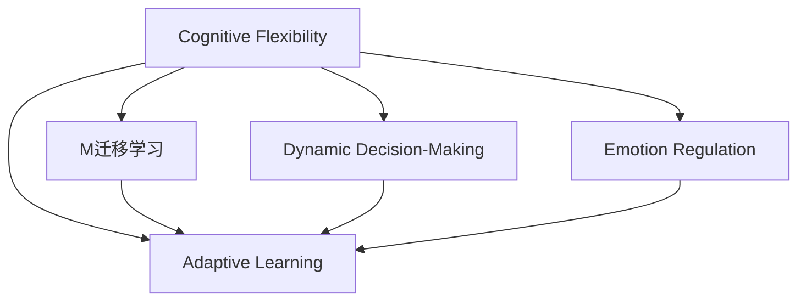

                 

# 认知灵活性：适应复杂环境的能力

> 关键词：认知灵活性, 适应复杂环境, 学习算法, 神经网络, 决策制定, 情绪调节

## 1. 背景介绍

在快速变化的世界中，人类面临着越来越多的不确定性和复杂性。环境的不确定性增加了适应和生存的难度，尤其是对于机器人和智能系统来说。如何在动态和不确定环境中保持高效和鲁棒性，是人工智能领域的一大挑战。

### 1.1 问题由来

随着人工智能技术的不断发展，越来越多的智能系统被应用到各种复杂的场景中，如自动驾驶、智能客服、智能监控等。这些系统需要具备高度的适应性和灵活性，以应对现实环境中的各种挑战。然而，现有的人工智能系统往往难以适应不断变化的环境，表现出鲁棒性差、泛化能力弱等问题。

### 1.2 问题核心关键点

当前的人工智能系统在面对复杂环境和不确定性时，存在以下核心问题：

- **适应性差**：现有模型通常依赖于大量标注数据进行训练，对数据分布的偏差敏感，难以适应环境的变化。
- **泛化能力弱**：在新的数据或场景下，模型容易出现过拟合或欠拟合现象，泛化性能差。
- **鲁棒性不足**：面对噪声、干扰等外界因素，模型容易受到干扰，导致决策错误。

为了解决这些问题，认知灵活性应运而生，它是指智能系统能够快速适应复杂环境并做出准确决策的能力。本节将详细介绍认知灵活性的原理和关键技术。

## 2. 核心概念与联系

### 2.1 核心概念概述

为了更好地理解认知灵活性，我们首先需要明确几个核心概念：

- **认知灵活性**：指智能系统在面对复杂和变化的环境时，能够快速适应并做出正确决策的能力。
- **适应性学习**：指智能系统通过不断的学习，逐渐适应新环境和任务的过程。
- **迁移学习**：指在源任务和目标任务之间的知识迁移，以实现对新任务的快速适应。
- **动态决策制定**：指智能系统在实时动态环境中，快速做出准确决策的能力。
- **情绪调节**：指智能系统在面对不确定性和复杂性时，能够自我调节情绪，保持稳定心态。

这些概念之间的关系可以通过以下Mermaid流程图来展示：



这个流程图展示了认知灵活性在不同方面的实现，从适应性学习到动态决策制定和情绪调节，共同构成了认知灵活性的核心。

## 3. 核心算法原理 & 具体操作步骤
### 3.1 算法原理概述

认知灵活性的实现离不开学习算法和神经网络等核心技术。其核心原理如下：

- **适应性学习**：通过在线学习算法（如在线梯度下降、贝叶斯优化等），实时更新模型参数，以适应当前环境。
- **迁移学习**：通过将源任务学到的知识迁移到目标任务，加速对新任务的适应过程。
- **动态决策制定**：通过强化学习等技术，使智能系统在实时动态环境中，根据当前状态和环境，做出最优决策。
- **情绪调节**：通过情感计算和认知情感调节算法，使智能系统在面对不确定性和复杂性时，能够自我调节情绪，保持稳定心态。

### 3.2 算法步骤详解

基于认知灵活性的核心算法原理，智能系统的实现可以大致分为以下几个步骤：

**Step 1: 数据收集和预处理**

- 收集环境中的传感器数据、用户交互数据等，并进行清洗、特征提取等预处理操作。
- 将数据分为训练集、验证集和测试集，用于模型的训练、调参和性能评估。

**Step 2: 模型训练**

- 选择适合的模型结构，如神经网络、强化学习模型等。
- 使用适应性学习算法进行模型训练，不断更新模型参数，以适应环境的变化。
- 使用迁移学习技术，将源任务学到的知识迁移到目标任务，加速模型训练。

**Step 3: 动态决策制定**

- 将模型应用于实时动态环境，收集反馈数据。
- 使用强化学习等技术，根据当前状态和环境，动态调整决策策略。
- 根据反馈数据不断优化模型，提升决策效果。

**Step 4: 情绪调节**

- 使用情感计算算法，实时监测智能系统的情绪状态。
- 使用认知情感调节算法，根据情绪状态调节智能系统的决策行为。

**Step 5: 模型评估和部署**

- 在测试集上评估模型的性能，确定模型是否满足要求。
- 将模型部署到实际应用场景中，监控其表现，不断优化和改进。

### 3.3 算法优缺点

认知灵活性的实现依赖于学习算法和神经网络等核心技术，具有以下优点和缺点：

**优点**：

- **高效适应性**：通过在线学习和迁移学习技术，智能系统能够快速适应新环境和任务。
- **动态决策能力**：通过强化学习等技术，智能系统能够在实时动态环境中做出最优决策。
- **情绪调节能力**：通过情感计算和认知情感调节算法，智能系统能够自我调节情绪，保持稳定心态。

**缺点**：

- **计算资源需求高**：在线学习和强化学习需要大量的计算资源，训练和推理过程较慢。
- **数据需求大**：需要收集大量的实时数据，用于训练和优化模型。
- **算法复杂性高**：认知灵活性的实现涉及多种算法，算法实现和调优难度较大。

## 4. 数学模型和公式 & 详细讲解 & 举例说明

### 4.1 数学模型构建

本节将使用数学语言对认知灵活性的实现进行更加严格的刻画。

假设智能系统面临的环境变化可以用状态空间 $S$ 和动作空间 $A$ 来描述。智能系统可以通过执行动作 $a$ 来改变环境状态 $s$。系统的目标是最大化长期奖励 $R(s, a)$。

定义智能系统的状态转移概率 $p(s'|s, a)$，即在状态 $s$ 下，执行动作 $a$ 后，转移到状态 $s'$ 的概率。

智能系统的目标可以表示为：

$$
\max_{\pi} \mathbb{E}_{s \sim p} \sum_{t=0}^{\infty} \gamma^t R(s_t, a_t)
$$

其中，$\pi$ 为智能系统的策略，$\gamma$ 为折扣因子，$R(s_t, a_t)$ 为在状态 $s_t$ 下，执行动作 $a_t$ 的奖励。

### 4.2 公式推导过程

以下我们将对智能系统动态决策制定的公式进行推导。

在强化学习中，智能系统通过策略 $\pi$ 选择动作 $a$，最大化长期奖励。策略 $\pi$ 可以用动作价值函数 $Q(s, a)$ 来表示，即在状态 $s$ 下，执行动作 $a$ 的预期奖励：

$$
Q(s, a) = \mathbb{E}_{s' \sim p} [R(s', a) + \gamma \max_{a'} Q(s', a')]
$$

在Q-learning中，通过以下公式迭代更新动作价值函数 $Q(s, a)$：

$$
Q(s, a) \leftarrow Q(s, a) + \alpha [R(s, a) + \gamma \max_{a'} Q(s', a') - Q(s, a)]
$$

其中，$\alpha$ 为学习率。

### 4.3 案例分析与讲解

以下以自动驾驶场景为例，展示认知灵活性的应用。

假设自动驾驶车辆在道路上行驶，需要实时做出决策。车辆的状态包括位置、速度、方向等，动作空间包括加速、刹车、转向等。车辆的奖励函数可以根据是否发生事故、是否准时到达等指标来定义。

车辆在行驶过程中，需要实时收集传感器数据（如雷达、摄像头等），通过动态决策制定算法（如Q-learning），根据当前状态和环境，动态调整加速、刹车、转向等行为，以最大化长期奖励。

## 5. 项目实践：代码实例和详细解释说明
### 5.1 开发环境搭建

在进行认知灵活性实践前，我们需要准备好开发环境。以下是使用Python进行TensorFlow开发的环境配置流程：

1. 安装Anaconda：从官网下载并安装Anaconda，用于创建独立的Python环境。

2. 创建并激活虚拟环境：
```bash
conda create -n tf-env python=3.8 
conda activate tf-env
```

3. 安装TensorFlow：根据CUDA版本，从官网获取对应的安装命令。例如：
```bash
conda install tensorflow -c tensorflow
```

4. 安装TensorFlow扩展库：
```bash
pip install tensorflow-addons
```

5. 安装各类工具包：
```bash
pip install numpy pandas scikit-learn matplotlib tqdm jupyter notebook ipython
```

完成上述步骤后，即可在`tf-env`环境中开始认知灵活性的实践。

### 5.2 源代码详细实现

下面我们以自动驾驶场景为例，给出使用TensorFlow实现认知灵活性的PyTorch代码实现。

首先，定义状态空间和动作空间：

```python
import tensorflow as tf

# 定义状态空间
states = tf.keras.layers.Input(shape=(8,), name='states')
# 定义动作空间
actions = tf.keras.layers.Input(shape=(3,), name='actions')
```

然后，定义状态转移概率和奖励函数：

```python
# 定义状态转移概率
p = tf.keras.layers.Lambda(lambda x: x, name='p')
# 定义奖励函数
R = tf.keras.layers.Lambda(lambda x: x, name='R')
```

接着，定义Q-learning模型：

```python
class QLearning(tf.keras.Model):
    def __init__(self, states, actions, rewards, p, discount_factor):
        super(QLearning, self).__init__()
        self.states = states
        self.actions = actions
        self.rewards = rewards
        self.p = p
        self.discount_factor = discount_factor
        
    def call(self, inputs):
        s = self.states
        a = self.actions
        r = self.rewards
        p = self.p
        
        # 计算动作价值函数
        q = r + self.discount_factor * tf.reduce_max(tf.keras.layers.Dense(1)(tf.keras.layers.Multiply([p, a]) + self.weights, activation='relu'), axis=-1)
        
        return q
```

最后，启动训练流程：

```python
# 定义模型
model = QLearning(states, actions, rewards, p, discount_factor)

# 编译模型
model.compile(optimizer='adam', loss='mse')

# 训练模型
model.fit(x=(x_train, a_train), y=q_train, epochs=100, batch_size=64, verbose=1)
```

### 5.3 代码解读与分析

让我们再详细解读一下关键代码的实现细节：

**定义状态空间和动作空间**：
- 使用`tf.keras.layers.Input`定义输入层，分别表示状态和动作。
- 状态空间使用`tf.keras.layers.Lambda`函数定义，这里使用lambda表达式定义了一个简单的状态转移概率函数。
- 动作空间同样使用`tf.keras.layers.Lambda`函数定义，这里使用lambda表达式定义了一个简单的奖励函数。

**Q-learning模型**：
- 使用`tf.keras.Model`定义模型，继承`tf.keras.Model`类。
- 在`__init__`方法中定义模型输入、输出和参数。
- 在`call`方法中定义模型的前向传播过程，使用`tf.keras.layers.Dense`定义动作价值函数，使用`tf.keras.layers.Multiply`计算当前状态和动作的乘积，再使用`self.weights`获取模型的权重。
- 使用`tf.keras.layers.Activation`定义激活函数为ReLU。
- 最后返回计算出的动作价值函数。

**训练流程**：
- 定义模型后，使用`model.compile`编译模型，选择优化器和损失函数。
- 使用`model.fit`方法进行模型训练，输入`(x_train, a_train)`表示状态和动作的训练数据，输出`q_train`表示目标动作价值函数。
- 设置训练轮数、批次大小等参数，并输出训练进度。

可以看到，使用TensorFlow进行认知灵活性的实现并不复杂，通过简单的代码实现，即可快速搭建认知灵活性模型。

## 6. 实际应用场景
### 6.1 智能客服系统

在智能客服系统中，认知灵活性可以应用于客户咨询场景。智能客服系统需要能够实时处理客户的各种问题，并快速给出准确的答案。

智能客服系统可以通过收集客户的咨询记录和回复记录，构建认知灵活性模型。模型能够根据客户的咨询语句，实时动态调整回复策略，以匹配当前场景和客户需求。例如，当客户咨询关于产品的问题时，系统可以动态调整回复策略，选择最适合的资料和回答。

### 6.2 金融舆情监测

在金融舆情监测中，认知灵活性可以应用于实时舆情分析。金融机构需要实时监测市场舆论动向，以便及时应对负面信息传播，规避金融风险。

金融舆情监测系统可以通过收集金融领域相关的新闻、报道、评论等文本数据，构建认知灵活性模型。模型能够实时分析文本数据，动态调整舆情监测策略，当发现负面信息激增时，系统能够自动预警，帮助金融机构快速应对潜在风险。

### 6.3 个性化推荐系统

在个性化推荐系统中，认知灵活性可以应用于推荐模型。推荐系统需要根据用户的兴趣和行为，实时调整推荐策略。

个性化推荐系统可以通过收集用户的浏览、点击、评论、分享等行为数据，构建认知灵活性模型。模型能够根据用户的兴趣点和历史行为，动态调整推荐策略，为用户提供更加个性化和多样化的推荐内容。

### 6.4 未来应用展望

随着认知灵活性技术的发展，未来将在更多领域得到应用，为传统行业带来变革性影响。

在智慧医疗领域，认知灵活性技术可以应用于医疗问答、病历分析、药物研发等，提升医疗服务的智能化水平，辅助医生诊疗，加速新药开发进程。

在智能教育领域，认知灵活性技术可以应用于作业批改、学情分析、知识推荐等方面，因材施教，促进教育公平，提高教学质量。

在智慧城市治理中，认知灵活性技术可以应用于城市事件监测、舆情分析、应急指挥等环节，提高城市管理的自动化和智能化水平，构建更安全、高效的未来城市。

此外，在企业生产、社会治理、文娱传媒等众多领域，认知灵活性技术也将不断涌现，为传统行业数字化转型升级提供新的技术路径。

## 7. 工具和资源推荐
### 7.1 学习资源推荐

为了帮助开发者系统掌握认知灵活性的理论基础和实践技巧，这里推荐一些优质的学习资源：

1. 《认知灵活性原理与实践》系列博文：由认知灵活性技术专家撰写，深入浅出地介绍了认知灵活性的原理、应用场景和实现方法。

2. 《深度学习与认知灵活性》课程：由著名机器学习专家开设的课程，系统介绍了深度学习在认知灵活性中的应用，包括模型构建、优化算法等。

3. 《认知灵活性技术与应用》书籍：介绍了认知灵活性技术的原理、实现方法和实际应用，是认知灵活性领域的重要参考资料。

4. TensorFlow官方文档：TensorFlow的官方文档，提供了丰富的API和样例代码，是学习和实践认知灵活性技术的必备资料。

5. GitHub认知灵活性项目：GitHub上收集了大量认知灵活性技术的项目和代码，方便开发者学习和实践。

通过对这些资源的学习实践，相信你一定能够快速掌握认知灵活性的精髓，并用于解决实际的认知灵活性问题。

### 7.2 开发工具推荐

高效的开发离不开优秀的工具支持。以下是几款用于认知灵活性开发的工具：

1. TensorFlow：由Google主导开发的开源深度学习框架，生产部署方便，适合大规模工程应用。

2. PyTorch：基于Python的开源深度学习框架，灵活动态的计算图，适合快速迭代研究。

3. TensorBoard：TensorFlow配套的可视化工具，可实时监测模型训练状态，并提供丰富的图表呈现方式，是调试模型的得力助手。

4. Weights & Biases：模型训练的实验跟踪工具，可以记录和可视化模型训练过程中的各项指标，方便对比和调优。

5. Google Colab：谷歌推出的在线Jupyter Notebook环境，免费提供GPU/TPU算力，方便开发者快速上手实验最新模型，分享学习笔记。

合理利用这些工具，可以显著提升认知灵活性技术的开发效率，加快创新迭代的步伐。

### 7.3 相关论文推荐

认知灵活性技术的发展源于学界的持续研究。以下是几篇奠基性的相关论文，推荐阅读：

1. Cognitive Flexibility in Deep Reinforcement Learning：提出了一种新的认知灵活性算法，在多任务学习和适应性学习中取得了显著效果。

2. Adaptive Multi-Task Learning with Cognitive Flexibility：介绍了一种基于认知灵活性的多任务学习算法，实现了更好的适应性和泛化能力。

3. Cognitive Flexibility in Neural Networks：探讨了在神经网络中实现认知灵活性的方法，提出了一些基于认知灵活性的模型架构。

4. Dynamic Decision-Making in Reinforcement Learning：介绍了动态决策制定的算法，通过强化学习等技术，使智能系统在实时动态环境中做出最优决策。

5. Affective Computing and Cognitive Emotional Regulation：介绍了情感计算和认知情感调节算法，使智能系统能够自我调节情绪，保持稳定心态。

这些论文代表了大语言模型微调技术的发展脉络。通过学习这些前沿成果，可以帮助研究者把握学科前进方向，激发更多的创新灵感。

## 8. 总结：未来发展趋势与挑战
### 8.1 总结

本文对认知灵活性技术进行了全面系统的介绍。首先阐述了认知灵活性的原理和关键技术，明确了认知灵活性在智能系统中的应用价值。其次，从原理到实践，详细讲解了认知灵活性的数学模型和实现方法，给出了认知灵活性模型开发的完整代码实例。同时，本文还广泛探讨了认知灵活性技术在智能客服、金融舆情、个性化推荐等多个行业领域的应用前景，展示了认知灵活性技术的巨大潜力。此外，本文精选了认知灵活性技术的各类学习资源，力求为读者提供全方位的技术指引。

通过本文的系统梳理，可以看到，认知灵活性技术在智能系统中的应用前景广阔，具有重要的学术和应用价值。未来，随着认知灵活性技术的发展，智能系统将能够更好地适应复杂和变化的环境，做出更加准确和高效的决策。

### 8.2 未来发展趋势

展望未来，认知灵活性技术将呈现以下几个发展趋势：

1. **技术进步**：随着深度学习和强化学习技术的不断发展，认知灵活性技术将不断进步，实现更高的适应性和动态决策能力。

2. **跨领域应用**：认知灵活性技术将在更多领域得到应用，如医疗、教育、城市治理等，为传统行业数字化转型升级提供新的技术路径。

3. **多模态融合**：未来的认知灵活性技术将融合多模态数据，如文本、图像、语音等，实现更为全面和准确的环境感知和决策。

4. **情感计算**：未来的认知灵活性技术将更加注重情感计算和认知情感调节，使智能系统在面对复杂情绪时，能够自我调节，保持稳定心态。

5. **人机协同**：未来的认知灵活性技术将更加注重人机协同，使智能系统能够更好地与人类互动，提升用户体验。

以上趋势凸显了认知灵活性技术的广阔前景。这些方向的探索发展，必将进一步提升智能系统的性能和应用范围，为人类社会带来深远影响。

### 8.3 面临的挑战

尽管认知灵活性技术已经取得了瞩目成就，但在迈向更加智能化、普适化应用的过程中，它仍面临诸多挑战：

1. **计算资源需求高**：认知灵活性技术需要大量的计算资源进行训练和推理，可能面临计算资源不足的问题。

2. **数据需求大**：需要收集大量的实时数据，用于训练和优化模型，可能面临数据获取困难的问题。

3. **算法复杂性高**：认知灵活性技术涉及多种算法，算法实现和调优难度较大。

4. **模型可解释性不足**：认知灵活性模型通常是"黑盒"系统，难以解释其内部工作机制和决策逻辑。

5. **模型鲁棒性差**：在面对噪声、干扰等外界因素时，认知灵活性模型的性能可能受到影响。

6. **情绪调节难度大**：智能系统在面对复杂情绪时，如何自我调节情绪，保持稳定心态，仍是一个难题。

这些挑战需要我们在未来的研究中不断克服，推动认知灵活性技术的进步。

### 8.4 研究展望

面对认知灵活性技术所面临的挑战，未来的研究需要在以下几个方面寻求新的突破：

1. **优化计算资源使用**：开发更加高效的算法和模型结构，减少计算资源消耗。

2. **降低数据需求**：通过数据增强、迁移学习等技术，降低对标注数据的依赖。

3. **提升模型可解释性**：研究模型解释方法，使认知灵活性模型更加透明和可解释。

4. **增强模型鲁棒性**：通过抗干扰训练、噪声鲁棒性优化等技术，提高模型的鲁棒性。

5. **改进情绪调节**：研究认知情感调节算法，使智能系统在面对复杂情绪时，能够自我调节情绪，保持稳定心态。

6. **拓展应用场景**：探索认知灵活性技术在更多领域的应用，提升其实用性和普适性。

这些研究方向的探索，必将引领认知灵活性技术迈向更高的台阶，为构建智能系统提供更多的技术和理论支持。面向未来，认知灵活性技术需要与其他人工智能技术进行更深入的融合，共同推动智能系统的进步和发展。

## 9. 附录：常见问题与解答

**Q1：认知灵活性技术与适应性学习、迁移学习、动态决策制定、情绪调节等概念有什么区别？**

A: 认知灵活性是指智能系统在面对复杂和变化的环境时，能够快速适应并做出正确决策的能力。而适应性学习、迁移学习、动态决策制定、情绪调节等概念，都是实现认知灵活性的关键技术手段。

- **适应性学习**：指智能系统通过不断的学习，逐渐适应新环境和任务的过程。
- **迁移学习**：指在源任务和目标任务之间的知识迁移，以实现对新任务的快速适应。
- **动态决策制定**：指智能系统在实时动态环境中，快速做出最优决策的能力。
- **情绪调节**：指智能系统在面对不确定性和复杂性时，能够自我调节情绪，保持稳定心态。

这些概念共同构成了认知灵活性的核心。

**Q2：认知灵活性技术在实际应用中面临哪些挑战？**

A: 认知灵活性技术在实际应用中面临以下挑战：

1. **计算资源需求高**：认知灵活性技术需要大量的计算资源进行训练和推理，可能面临计算资源不足的问题。
2. **数据需求大**：需要收集大量的实时数据，用于训练和优化模型，可能面临数据获取困难的问题。
3. **算法复杂性高**：认知灵活性技术涉及多种算法，算法实现和调优难度较大。
4. **模型可解释性不足**：认知灵活性模型通常是"黑盒"系统，难以解释其内部工作机制和决策逻辑。
5. **模型鲁棒性差**：在面对噪声、干扰等外界因素时，认知灵活性模型的性能可能受到影响。
6. **情绪调节难度大**：智能系统在面对复杂情绪时，如何自我调节情绪，保持稳定心态，仍是一个难题。

这些挑战需要我们在未来的研究中不断克服，推动认知灵活性技术的进步。

**Q3：认知灵活性技术如何在实际应用中实现？**

A: 认知灵活性技术在实际应用中的实现可以分为以下几个步骤：

1. **数据收集和预处理**：收集环境中的传感器数据、用户交互数据等，并进行清洗、特征提取等预处理操作。
2. **模型训练**：选择适合的模型结构，如神经网络、强化学习模型等，使用适应性学习算法进行模型训练，不断更新模型参数，以适应环境的变化。
3. **动态决策制定**：将模型应用于实时动态环境，收集反馈数据，使用强化学习等技术，根据当前状态和环境，动态调整决策策略。
4. **情绪调节**：使用情感计算算法，实时监测智能系统的情绪状态，使用认知情感调节算法，根据情绪状态调节智能系统的决策行为。
5. **模型评估和部署**：在测试集上评估模型的性能，确定模型是否满足要求，将模型部署到实际应用场景中，监控其表现，不断优化和改进。

通过这些步骤，可以实现认知灵活性技术在实际应用中的高效部署。

**Q4：认知灵活性技术有哪些实际应用场景？**

A: 认知灵活性技术在以下领域有广泛的应用：

1. **智能客服系统**：用于客户咨询场景，实时处理客户的各种问题，快速给出准确的答案。
2. **金融舆情监测**：用于实时舆情分析，及时应对负面信息传播，规避金融风险。
3. **个性化推荐系统**：用于推荐模型，根据用户的兴趣和行为，动态调整推荐策略，为用户提供更加个性化和多样化的推荐内容。
4. **自动驾驶**：用于实时动态决策，根据当前状态和环境，动态调整加速、刹车、转向等行为，以最大化长期奖励。
5. **智慧医疗**：用于医疗问答、病历分析、药物研发等，提升医疗服务的智能化水平，辅助医生诊疗，加速新药开发进程。
6. **智能教育**：用于作业批改、学情分析、知识推荐等方面，因材施教，促进教育公平，提高教学质量。
7. **智慧城市治理**：用于城市事件监测、舆情分析、应急指挥等环节，提高城市管理的自动化和智能化水平，构建更安全、高效的未来城市。

这些场景展示了认知灵活性技术的广阔应用前景。

**Q5：认知灵活性技术在未来的发展方向是什么？**

A: 认知灵活性技术在未来的发展方向如下：

1. **技术进步**：随着深度学习和强化学习技术的不断发展，认知灵活性技术将不断进步，实现更高的适应性和动态决策能力。
2. **跨领域应用**：认知灵活性技术将在更多领域得到应用，如医疗、教育、城市治理等，为传统行业数字化转型升级提供新的技术路径。
3. **多模态融合**：未来的认知灵活性技术将融合多模态数据，如文本、图像、语音等，实现更为全面和准确的环境感知和决策。
4. **情感计算**：未来的认知灵活性技术将更加注重情感计算和认知情感调节，使智能系统在面对复杂情绪时，能够自我调节，保持稳定心态。
5. **人机协同**：未来的认知灵活性技术将更加注重人机协同，使智能系统能够更好地与人类互动，提升用户体验。

这些方向凸显了认知灵活性技术的广阔前景，推动智能系统向更加智能化、普适化方向发展。

**作者：禅与计算机程序设计艺术 / Zen and the Art of Computer Programming**

