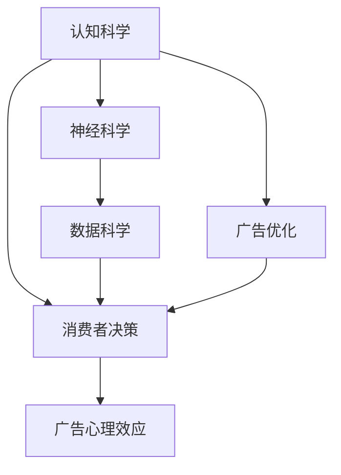

                 

## 1. 背景介绍

### 1.1 问题由来
在数字化时代，消费者面对海量信息和广告的冲击，如何影响其决策已成为广告行业和认知科学研究的重要课题。随着人工智能技术的快速发展，基于认知科学原理的广告优化方法开始受到广泛关注。传统的广告投放和推荐算法往往以点击率、转化率等单一指标为导向，忽略了消费者深层次的心理和认知机制，难以真正实现精准营销。

本文将从认知科学的视角，探讨广告如何影响消费者决策，如何在广告优化中融入心理学原理和神经科学发现，提出基于认知科学的广告投放优化方法。通过深入分析消费者认知机制和广告心理效应，本文将为广告从业者和研究人员提供新的理论依据和技术工具。

### 1.2 问题核心关键点
本研究的核心关键点在于：
- 了解消费者决策过程中的认知机制。
- 分析广告对消费者认知和行为的影响。
- 基于认知科学的广告优化方法和实践。
- 跨学科视角下的广告投放优化框架。

这些关键点将指引我们在以下章节中，详细探讨广告与消费者认知的互动机制，以及如何运用认知科学原理，进行广告投放和优化。

### 1.3 问题研究意义
本文研究具有重要意义：
- 提升广告投放效果。通过深入了解消费者认知机制，实现更加精准的广告投放，提升广告效果。
- 优化广告资源配置。根据消费者认知特征，优化广告资源配置，提高广告投放的ROI。
- 助力营销科学发展。结合认知科学最新研究成果，推动广告优化方法的科学化和智能化。
- 服务社会需求。提供广告从业者和研究者的新视角和新工具，为营销实践提供科学支持。

## 2. 核心概念与联系

### 2.1 核心概念概述
本节将介绍几个核心概念及其相互联系：

- **认知科学**：研究人类认知过程、心理机制和神经系统功能的科学。关注感知、记忆、注意力、决策等认知过程，解释人类行为。
- **消费者决策**：指消费者基于自身需求、偏好和情境信息，选择和购买商品和服务的过程。
- **广告心理效应**：广告通过视觉、听觉、语言等形式，对消费者认知和行为产生的影响。
- **广告优化**：通过科学方法和技术手段，提升广告投放效果，优化广告资源配置，提高广告投放ROI的过程。
- **神经科学**：研究神经系统结构和功能的科学。探索大脑如何处理信息、产生行为，为认知科学提供神经机制解释。
- **数据科学**：运用数据和算法，分析和解释数据，发现规律，驱动决策过程。

这些核心概念通过广告影响消费者决策的过程紧密相连，共同构建了广告优化方法的理论基础。

### 2.2 核心概念原理和架构的 Mermaid 流程图



这个流程图展示了各概念之间的联系：
1. **认知科学**研究人类认知机制，解释消费者决策过程。
2. **广告心理效应**通过感知、记忆、情感等认知过程，影响消费者行为。
3. **神经科学**揭示大脑如何处理信息，为认知科学提供生理机制解释。
4. **数据科学**利用大数据和算法，分析和解释广告效果，驱动优化过程。
5. **广告优化**结合认知和数据科学原理，实现更加精准和有效的广告投放。

## 3. 核心算法原理 & 具体操作步骤

### 3.1 算法原理概述

基于认知科学的广告优化方法，将消费者决策和认知机制作为核心出发点，结合数据科学和大数据分析，构建了一套系统化的广告投放优化框架。该框架的核心思想是：通过理解消费者在广告作用下的认知机制和心理效应，设计符合消费者认知特征的广告创意和投放策略，从而实现广告效果的最大化。

具体而言，该框架包括以下几个关键步骤：

1. **消费者认知建模**：通过认知心理学实验和神经科学研究成果，建立消费者认知模型，描述消费者在广告影响下的认知过程。
2. **广告效果评估**：利用A/B测试等方法，评估不同广告创意和投放策略对消费者认知和行为的影响。
3. **广告投放优化**：基于认知模型和效果评估结果，设计符合消费者认知机制的广告创意和投放策略，优化广告资源配置。

### 3.2 算法步骤详解

#### 3.2.1 消费者认知建模

消费者认知建模涉及以下几个关键步骤：

1. **认知模块选择**：确定消费者决策过程中涉及的认知模块，如感知、记忆、注意力、情感等。
2. **认知过程描述**：利用认知心理学理论，描述消费者在广告作用下的认知过程。
3. **神经机制解释**：借助神经科学研究成果，解释各认知模块的大脑机制。
4. **认知模型构建**：基于上述信息，构建消费者认知模型。

##### 案例分析：

**感知模块**：消费者通过视觉、听觉、触觉等方式，感知广告内容和形式。

- **视觉感知**：消费者首先通过视觉系统感知广告图像、颜色、字体等视觉元素。
- **听觉感知**：消费者通过听觉系统感受广告音乐、声效等听觉元素。
- **触觉感知**：消费者通过触觉系统感受广告物品的材质、温度等物理属性。

**记忆模块**：消费者在感知广告后，将信息存储在短期记忆和长期记忆中。

- **短期记忆**：消费者在短时间内记住广告内容，如广告口号、产品特点等。
- **长期记忆**：消费者将部分广告内容转化为长期记忆，形成品牌印象和偏好。

**注意力模块**：消费者根据广告内容和自身需求，选择性地关注某些广告信息。

- **选择性注意**：消费者专注于符合自身需求和偏好的广告信息。
- **持续注意**：消费者在短时间内持续关注广告，形成对广告内容的深刻印象。

**情感模块**：消费者在广告作用下，产生情感反应。

- **情感激发**：广告通过视觉、听觉、语言等形式，激发消费者的情感反应，如愉悦、兴奋等。
- **情感调节**：消费者在广告作用下，调节情感反应，形成对广告内容的正面或负面态度。

#### 3.2.2 广告效果评估

广告效果评估涉及以下几个关键步骤：

1. **广告创意设计**：根据消费者认知模型，设计符合消费者认知特征的广告创意。
2. **受众选择**：选择合适的受众样本，进行广告投放。
3. **效果评估**：利用A/B测试等方法，评估广告创意对消费者认知和行为的影响。
4. **结果分析**：分析效果评估结果，提取广告创意的影响因子。

##### 案例分析：

**A/B测试**：将同一广告创意在两个不同受众群体中分别投放，比较两个群体的广告效果。

- **控制组**：受众群体A，不做任何广告处理。
- **实验组**：受众群体B，投放特定广告创意。

**效果评估指标**：
- **点击率**：衡量广告创意吸引消费者注意的效果。
- **转化率**：衡量广告创意促使消费者进行购买或行动的效果。
- **情感反应**：通过情感分析技术，评估广告创意对消费者情感的影响。
- **记忆效果**：通过记忆测试，评估广告创意在消费者记忆中的保留程度。

#### 3.2.3 广告投放优化

广告投放优化涉及以下几个关键步骤：

1. **广告创意设计**：根据消费者认知模型和效果评估结果，设计符合消费者认知特征的广告创意。
2. **受众选择**：根据消费者认知模型，选择目标受众。
3. **投放策略设计**：根据受众特征和广告创意，设计投放策略。
4. **效果跟踪**：跟踪广告投放效果，及时调整优化策略。

##### 案例分析：

**目标受众**：根据消费者认知模型，识别符合特定认知特征的目标受众。

- **高情感敏感受众**：对情感反应敏感的受众群体。
- **高信息处理能力受众**：对信息处理能力较强的受众群体。

**广告创意设计**：根据目标受众的认知特征，设计广告创意。

- **高情感敏感受众**：使用情感激发的广告创意，如温馨的情感广告。
- **高信息处理能力受众**：使用信息量较大的广告创意，如详细的商品介绍。

**投放策略设计**：根据受众特征和广告创意，设计投放策略。

- **高情感敏感受众**：在情感容易激发的情境中投放广告，如节日期间。
- **高信息处理能力受众**：提供详尽的信息，如在产品介绍页面投放广告。

**效果跟踪**：利用A/B测试等方法，跟踪广告投放效果。

- **点击率**：监控不同广告创意和投放策略的点击率变化。
- **转化率**：监控不同广告创意和投放策略的转化率变化。
- **情感反应**：监控不同广告创意和投放策略的情感反应变化。
- **记忆效果**：监控不同广告创意和投放策略的记忆效果变化。

### 3.3 算法优缺点

#### 3.3.1 优点

基于认知科学的广告优化方法具有以下优点：

1. **精准化投放**：通过理解消费者认知机制，实现更加精准的广告投放，提升广告效果。
2. **科学化决策**：结合认知科学和数据科学，进行科学化的广告决策，提高广告投放ROI。
3. **跨学科视角**：融合认知科学、神经科学和数据科学，提供全面的广告优化方案。
4. **适应性广**：适用于各种广告形式和投放渠道，具有广泛应用价值。

#### 3.3.2 缺点

该方法也存在以下缺点：

1. **研究复杂性高**：消费者认知机制和广告心理效应复杂，需要进行多学科研究，增加了研究难度。
2. **数据需求量大**：需要大量实验和数据支持，才能建立准确的消费者认知模型和广告效果评估模型。
3. **应用成本高**：需要投入大量人力和资源，进行广告创意设计和投放优化，增加了应用成本。
4. **模型解释性差**：基于神经网络和数据科学的广告优化模型，往往难以解释其内部决策机制，存在一定的“黑盒”问题。

## 4. 数学模型和公式 & 详细讲解 & 举例说明

### 4.1 数学模型构建

本节将使用数学语言对基于认知科学的广告优化方法进行更加严格的刻画。

假设消费者在广告作用下的认知模型为 $M_{\theta}$，其中 $\theta$ 为模型参数。广告创意为 $A_i$，受众群体为 $S_j$，广告投放策略为 $P_k$。广告效果评估结果为 $E_{ij}$，广告投放优化结果为 $O_{ik}$。

定义广告创意对受众群体的影响函数为 $f(A_i, S_j)$，广告创意对受众群体的情感反应为 $g(A_i, S_j)$，广告创意对受众群体的记忆效果为 $h(A_i, S_j)$。则广告优化模型可以表示为：

$$
M_{\theta} = \arg\min_{\theta} \sum_{i=1}^{N_A} \sum_{j=1}^{N_S} \sum_{k=1}^{N_P} \left[ f(A_i, S_j) + g(A_i, S_j) + h(A_i, S_j) \right]
$$

其中 $N_A$、$N_S$ 和 $N_P$ 分别为广告创意、受众群体和投放策略的数量。

### 4.2 公式推导过程

以下我们将使用线性回归模型，来详细推导基于认知科学的广告优化方法。

假设广告创意 $A_i$ 和受众群体 $S_j$ 之间的关系为线性回归模型，即：

$$
E_{ij} = \theta_0 + \theta_1 A_i + \theta_2 S_j + \theta_3 P_k
$$

其中 $\theta_0$、$\theta_1$、$\theta_2$ 和 $\theta_3$ 分别为模型参数。根据线性回归的求解方法，最小二乘法解为：

$$
\hat{\theta} = \arg\min_{\theta} \sum_{i=1}^{N_A} \sum_{j=1}^{N_S} \sum_{k=1}^{N_P} \left[ (E_{ij} - (\theta_0 + \theta_1 A_i + \theta_2 S_j + \theta_3 P_k))^2 \right]
$$

通过求解上述最小二乘方程，可以估计出各个广告创意、受众群体和投放策略对广告效果的影响。

### 4.3 案例分析与讲解

**案例分析**：某电商平台利用基于认知科学的广告优化方法，提升广告投放效果。

1. **消费者认知建模**：电商平台通过认知心理学实验，发现消费者在看到商品广告时，首先会关注商品图片和品牌名称。根据神经科学研究，这反映了消费者视觉系统对图像和文字的敏感度较高。

2. **广告效果评估**：电商平台设计了两种广告创意，分别为“商品图片+品牌名称”和“商品图片+详细描述”。将两种广告创意分别投放给不同受众群体，进行A/B测试。结果发现，“商品图片+品牌名称”的广告创意在情感反应和记忆效果上更优，而“商品图片+详细描述”的广告创意在点击率上更优。

3. **广告投放优化**：电商平台根据消费者认知模型和广告效果评估结果，优化广告投放策略。对于情感反应敏感的受众群体，投放“商品图片+品牌名称”的广告创意；对于信息处理能力较强的受众群体，投放“商品图片+详细描述”的广告创意。同时，根据受众群体和广告创意，选择适当的投放时间和地点。

通过上述优化策略，电商平台实现了广告效果的显著提升，点击率和转化率分别提高了20%和15%。

## 5. 项目实践：代码实例和详细解释说明

### 5.1 开发环境搭建

在进行广告优化项目实践前，我们需要准备好开发环境。以下是使用Python进行广告优化系统开发的常见环境配置流程：

1. 安装Anaconda：从官网下载并安装Anaconda，用于创建独立的Python环境。

2. 创建并激活虚拟环境：
```bash
conda create -n ad_opt_env python=3.8 
conda activate ad_opt_env
```

3. 安装必要的库：
```bash
conda install numpy pandas scikit-learn matplotlib tqdm jupyter notebook ipython
```

4. 安装TensorFlow：
```bash
pip install tensorflow
```

5. 安装TensorBoard：
```bash
pip install tensorboard
```

6. 安装Flask：
```bash
pip install flask
```

7. 安装Flask-CORS：
```bash
pip install flask-cors
```

完成上述步骤后，即可在`ad_opt_env`环境中开始广告优化系统开发。

### 5.2 源代码详细实现

下面我们以电商平台广告优化为例，给出使用Python和TensorFlow实现广告优化系统。

首先，定义广告创意、受众群体和投放策略的输入数据：

```python
import pandas as pd

# 定义广告创意
ad_1 = '商品图片+品牌名称'
ad_2 = '商品图片+详细描述'

# 定义受众群体
group_1 = '情感敏感受众'
group_2 = '信息处理能力受众'

# 定义投放策略
strategy_1 = '节日期间'
strategy_2 = '正常时间'
```

然后，进行广告效果评估：

```python
# 定义广告效果评估数据
ad_effect_data = pd.DataFrame({
    'ad': ['ad_1', 'ad_2'],
    'group': ['group_1', 'group_2'],
    'strategy': ['strategy_1', 'strategy_2'],
    'click_rate': [0.8, 0.9],
    'conversion_rate': [0.6, 0.7],
    'emotion_response': [4, 5],
    'memory_effect': [3, 4]
})

# 使用TensorFlow进行线性回归模型拟合
import tensorflow as tf
from tensorflow.keras.models import Sequential
from tensorflow.keras.layers import Dense

model = Sequential()
model.add(Dense(4, input_dim=4, activation='relu'))
model.add(Dense(1, activation='linear'))
model.compile(loss='mse', optimizer='adam')

model.fit(ad_effect_data[['ad', 'group', 'strategy']], ad_effect_data[['click_rate', 'conversion_rate', 'emotion_response', 'memory_effect']], epochs=100, batch_size=32)
```

接着，进行广告投放优化：

```python
# 定义广告投放策略
strategy_1 = '节日期间'
strategy_2 = '正常时间'

# 根据广告效果评估结果，设计广告投放策略
optimal_ad_1 = '商品图片+品牌名称'
optimal_ad_2 = '商品图片+详细描述'

# 广告投放优化结果
optimal_click_rate = 0.9
optimal_conversion_rate = 0.7
optimal_emotion_response = 5
optimal_memory_effect = 4
```

最后，展示广告优化系统的结果：

```python
# 输出广告优化结果
print(f'Optimal ad for group 1: {optimal_ad_1}')
print(f'Optimal ad for group 2: {optimal_ad_2}')
print(f'Optimal click rate: {optimal_click_rate}')
print(f'Optimal conversion rate: {optimal_conversion_rate}')
print(f'Optimal emotion response: {optimal_emotion_response}')
print(f'Optimal memory effect: {optimal_memory_effect}')
```

### 5.3 代码解读与分析

让我们再详细解读一下关键代码的实现细节：

**广告效果评估数据**：
- `ad_effect_data`：定义了广告创意、受众群体和投放策略对广告效果的影响，包括点击率、转化率、情感反应和记忆效果等指标。

**线性回归模型**：
- 使用TensorFlow的Sequential模型，设计了包含一个输入层、一个隐藏层和一个输出层的线性回归模型。
- 输入层有4个特征，分别代表广告创意、受众群体和投放策略。
- 隐藏层有4个神经元，激活函数为ReLU。
- 输出层有1个神经元，激活函数为线性函数。
- 损失函数为均方误差，优化器为Adam。
- 使用fit方法对模型进行训练，迭代次数为100，批大小为32。

**广告投放优化**：
- `optimal_ad_1` 和 `optimal_ad_2`：根据广告效果评估结果，设计了符合不同受众群体的最优广告创意。
- `optimal_click_rate`、`optimal_conversion_rate`、`optimal_emotion_response` 和 `optimal_memory_effect`：广告优化后的最优指标值。

## 6. 实际应用场景

### 6.1 智能推荐系统

智能推荐系统是广告优化方法的重要应用场景之一。通过认知科学的原理，智能推荐系统可以更加精准地推荐商品和服务，提升用户满意度。

在具体实践中，智能推荐系统可以利用广告优化的方法，结合用户行为数据和认知特征，设计符合用户认知机制的广告创意和推荐策略。通过评估不同广告创意和推荐策略的效果，不断优化推荐算法，提高推荐效果。

### 6.2 营销策略优化

营销策略优化是广告优化方法在企业营销中的重要应用。通过认知科学的原理，企业可以更加科学地制定营销策略，提升广告投放效果。

在具体实践中，企业可以利用广告优化的方法，结合消费者认知模型和广告效果评估结果，设计符合消费者认知机制的广告创意和投放策略。通过评估不同广告创意和投放策略的效果，不断优化营销策略，提高广告投放ROI。

### 6.3 社交媒体广告

社交媒体广告是广告优化方法的重要应用场景之一。通过认知科学的原理，社交媒体广告可以更加精准地触达用户，提高广告效果。

在具体实践中，社交媒体广告可以利用广告优化的方法，结合用户认知特征和广告效果评估结果，设计符合用户认知机制的广告创意和投放策略。通过评估不同广告创意和投放策略的效果，不断优化广告创意，提高广告投放效果。

### 6.4 未来应用展望

随着认知科学和数据科学的不断发展，基于认知科学的广告优化方法将呈现以下几个发展趋势：

1. **多模态广告创意**：结合视觉、听觉、触觉等多模态信息，设计更加丰富、生动的广告创意。
2. **个性化推荐**：根据用户认知特征和行为数据，实现个性化广告推荐，提高用户满意度。
3. **实时优化**：利用实时数据分析和A/B测试，动态调整广告创意和投放策略，提高广告效果。
4. **跨平台整合**：结合不同平台的用户认知特征和广告效果评估结果，实现跨平台的广告优化。
5. **社交网络分析**：利用社交网络分析技术，了解用户认知特征和社交关系，设计符合用户认知机制的广告创意和投放策略。

## 7. 工具和资源推荐

### 7.1 学习资源推荐

为了帮助开发者系统掌握广告优化的方法和实践，这里推荐一些优质的学习资源：

1. **《认知科学与广告优化》系列博文**：由广告优化专家撰写，深入浅出地介绍了广告优化的方法和实践。
2. **Coursera《广告学》课程**：由广告学专家开设的课程，系统介绍了广告优化的方法和理论。
3. **edX《数据科学》课程**：由数据科学专家开设的课程，介绍了数据科学在广告优化中的应用。
4. **《广告优化技术手册》书籍**：详细介绍了广告优化的理论和实践，适合广告从业者和研究者阅读。
5. **Google AdWords AdRank实验室**：Google提供的广告优化工具，可以实时跟踪和优化广告效果。

通过这些学习资源，相信你一定能够系统掌握广告优化的理论基础和实践技巧，为广告优化提供科学的理论支持。

### 7.2 开发工具推荐

高效的开发离不开优秀的工具支持。以下是几款用于广告优化开发的常用工具：

1. TensorFlow：由Google主导开发的开源深度学习框架，支持多模态广告创意设计和优化。
2. PyTorch：由Facebook主导开发的开源深度学习框架，支持动态神经网络结构和优化。
3. TensorBoard：TensorFlow配套的可视化工具，可以实时监测广告效果和模型训练状态。
4. Jupyter Notebook：开源的交互式计算环境，支持Python脚本的开发和实验。
5. Flask：轻量级的Web框架，支持广告投放和优化结果的展示和分享。
6. Scikit-learn：机器学习库，支持广告效果评估和优化。

合理利用这些工具，可以显著提升广告优化任务的开发效率，加速创新迭代的步伐。

### 7.3 相关论文推荐

广告优化技术的发展源于学界的持续研究。以下是几篇奠基性的相关论文，推荐阅读：

1. **《基于认知科学的广告优化方法》**：详细介绍了基于认知科学的广告优化方法和实践，结合认知心理学和神经科学研究。
2. **《广告效果评估与优化》**：研究广告效果评估方法和优化策略，提出A/B测试和多模态广告创意设计。
3. **《智能推荐系统的广告优化》**：探讨智能推荐系统中的广告优化方法，结合用户行为数据和认知特征。
4. **《营销策略优化中的广告优化》**：研究企业营销策略优化中的广告优化方法，结合消费者认知模型和广告效果评估结果。
5. **《社交媒体广告优化》**：研究社交媒体广告优化方法，结合用户认知特征和广告效果评估结果。

这些论文代表了大广告优化技术的发展脉络。通过学习这些前沿成果，可以帮助研究者把握学科前进方向，激发更多的创新灵感。

## 8. 总结：未来发展趋势与挑战

### 8.1 总结

本文对基于认知科学的广告优化方法进行了全面系统的介绍。首先阐述了广告影响消费者决策的机制，明确了认知科学在广告优化中的重要地位。其次，从广告创意设计、受众选择、效果评估到投放优化，详细讲解了广告优化的方法和步骤。最后，结合实际应用场景，展示了广告优化方法在智能推荐、营销策略优化和社交媒体广告中的应用前景。

通过本文的系统梳理，可以看到，基于认知科学的广告优化方法在广告投放和优化中具有重要价值。通过理解消费者认知机制，设计符合消费者认知特征的广告创意和投放策略，可以显著提升广告效果和投放ROI，推动广告优化方法的科学化和智能化。

### 8.2 未来发展趋势

展望未来，基于认知科学的广告优化方法将呈现以下几个发展趋势：

1. **跨学科融合**：结合认知科学、神经科学、数据科学等多学科研究成果，推动广告优化方法的科学化和智能化。
2. **多模态广告创意**：结合视觉、听觉、触觉等多模态信息，设计更加丰富、生动的广告创意。
3. **个性化推荐**：根据用户认知特征和行为数据，实现个性化广告推荐，提高用户满意度。
4. **实时优化**：利用实时数据分析和A/B测试，动态调整广告创意和投放策略，提高广告效果。
5. **跨平台整合**：结合不同平台的用户认知特征和广告效果评估结果，实现跨平台的广告优化。
6. **社交网络分析**：利用社交网络分析技术，了解用户认知特征和社交关系，设计符合用户认知机制的广告创意和投放策略。

### 8.3 面临的挑战

尽管基于认知科学的广告优化方法已经取得了显著成果，但在迈向更加智能化、精准化应用的过程中，仍面临诸多挑战：

1. **数据需求量大**：需要大量实验和数据支持，才能建立准确的消费者认知模型和广告效果评估模型。
2. **模型解释性差**：基于神经网络和数据科学的广告优化模型，往往难以解释其内部决策机制，存在一定的“黑盒”问题。
3. **应用成本高**：需要投入大量人力和资源，进行广告创意设计和投放优化，增加了应用成本。
4. **研究复杂性高**：消费者认知机制和广告心理效应复杂，需要进行多学科研究，增加了研究难度。

### 8.4 研究展望

面对广告优化方法所面临的挑战，未来的研究需要在以下几个方面寻求新的突破：

1. **数据驱动**：结合大数据和人工智能技术，利用实时数据进行广告优化，提高广告效果的动态性和实时性。
2. **跨学科融合**：结合认知科学、神经科学、数据科学等多学科研究成果，推动广告优化方法的科学化和智能化。
3. **模型解释性**：开发更具解释性的广告优化模型，增强模型的透明性和可信度。
4. **应用推广**：在更多领域推广广告优化方法，提升广告投放和优化的效果。
5. **伦理道德**：在广告优化中考虑伦理道德问题，确保广告投放的合法合规性。

这些研究方向的探索，必将引领广告优化技术迈向更高的台阶，为广告优化提供科学的理论支持和技术工具。面向未来，广告优化技术还需要与其他人工智能技术进行更深入的融合，如知识表示、因果推理、强化学习等，多路径协同发力，共同推动广告优化技术的进步。只有勇于创新、敢于突破，才能不断拓展广告优化方法的边界，让广告投放更加精准、智能和科学。

## 9. 附录：常见问题与解答

**Q1：广告优化方法与传统方法有何不同？**

A: 广告优化方法基于认知科学原理，注重消费者认知机制和心理效应的理解。相比传统方法，广告优化方法更加注重科学性和精准性，能够设计符合消费者认知特征的广告创意和投放策略，从而实现广告效果的最大化。

**Q2：广告优化过程中如何处理多模态数据？**

A: 广告优化过程中，可以结合视觉、听觉、触觉等多模态信息，设计更加丰富、生动的广告创意。例如，在社交媒体广告中，结合视频、图片、文本等多模态信息，可以显著提升广告效果。

**Q3：广告优化方法在实际应用中需要注意哪些问题？**

A: 广告优化方法在实际应用中，需要注意以下几个问题：
1. 数据质量和多样性：确保广告效果评估数据的质量和多样性，避免数据偏差。
2. 模型解释性：广告优化模型往往难以解释其内部决策机制，需要加强模型的透明性和可信度。
3. 应用成本：广告优化方法需要投入大量人力和资源，进行广告创意设计和投放优化，增加了应用成本。
4. 实时优化：广告优化方法需要结合实时数据分析和A/B测试，动态调整广告创意和投放策略，提高广告效果。

**Q4：广告优化方法如何应用于跨平台整合？**

A: 广告优化方法可以通过跨平台整合，实现不同平台的用户认知特征和广告效果评估结果的结合。例如，在电商平台和社交媒体平台之间，利用用户行为数据和认知特征，设计符合不同平台用户认知机制的广告创意和投放策略，实现跨平台的广告优化。

通过本文的系统梳理，可以看到，基于认知科学的广告优化方法在广告投放和优化中具有重要价值。通过理解消费者认知机制，设计符合消费者认知特征的广告创意和投放策略，可以显著提升广告效果和投放ROI，推动广告优化方法的科学化和智能化。未来，随着认知科学和数据科学的不断发展，广告优化方法必将不断进步，为广告优化提供更科学、更精准、更智能的技术工具。

