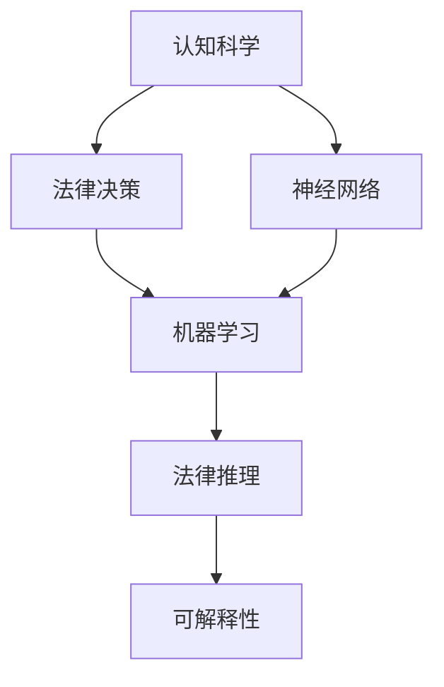

                 

# 认知科学与法律：理解决策与判断的机制

> 关键词：认知科学, 法律决策, 判断机制, 神经网络, 法律推理, 机器学习

## 1. 背景介绍

### 1.1 问题由来
认知科学与法律决策是两个看似相距甚远的领域，但实际上它们之间存在着千丝万缕的联系。法律决策是法官、律师等法律专业人员在处理案件时，根据法律条文、证据、先例等因素进行判断和推理的过程。这一过程不仅仅是依据逻辑和法律规则，还涉及到人类复杂的认知过程，包括记忆、推理、情感等因素。

近年来，认知科学的发展为理解法律决策的机制提供了新的视角。认知科学是一门探究人类认知过程的学科，包括感知、记忆、思维、情感、决策等方面的研究。这些研究为理解法律决策提供了丰富的理论基础，同时也为应用人工智能和机器学习技术辅助法律决策提供了新的可能性。

### 1.2 问题核心关键点
- 法律决策中的认知过程：法律决策不仅仅是逻辑推理，还涉及记忆、情感等因素，这些因素如何影响法律决策？
- 机器学习在法律推理中的应用：如何利用机器学习技术，辅助法官、律师进行高效、准确的法律推理？
- 认知科学在法律中的应用：如何将认知科学的研究成果应用到法律领域，提升法律决策的公正性和效率？
- 法律决策的机器学习算法：有哪些机器学习算法可以应用于法律推理，这些算法在实际应用中表现如何？
- 法律决策的可解释性：机器学习算法生成的判决结果如何保证其可解释性和透明度？

这些问题构成了本文的核心研究内容，旨在探讨法律决策中认知过程与机器学习技术的结合，以及如何通过认知科学提升法律决策的公正性和效率。

### 1.3 问题研究意义
研究法律决策中的认知过程与机器学习技术结合，对于提升法律决策的公正性、效率和透明度具有重要意义：

- 公正性：通过理解法律决策中的认知过程，可以更好地识别和纠正偏见，提升判决的公正性。
- 效率：机器学习技术可以快速处理大量法律数据，辅助法官、律师进行高效的法律推理。
- 透明度：机器学习算法生成的判决结果具有可解释性，有助于提升法律决策的透明度。

本文的研究有助于推动法律决策科学的进步，为法律技术和法律科学的发展提供新的方向。

## 2. 核心概念与联系

### 2.1 核心概念概述

为了更好地理解法律决策中的认知过程与机器学习技术的结合，本文将介绍几个核心概念：

- **认知科学**：探究人类认知过程的学科，包括感知、记忆、思维、情感、决策等方面的研究。
- **法律决策**：法律专业人员在处理案件时，根据法律条文、证据、先例等因素进行判断和推理的过程。
- **机器学习**：通过算法和数据训练，使计算机系统能够从经验中学习，并利用学习结果进行预测或决策。
- **神经网络**：一种模拟人类神经系统的计算模型，通过学习输入和输出之间的映射关系进行模式识别和预测。
- **法律推理**：根据法律条文、证据和先例，推导出判决结果的过程。
- **可解释性**：机器学习算法生成的判决结果应具有可解释性，以便法官、律师和公众理解。

这些核心概念之间的逻辑关系可以通过以下Mermaid流程图来展示：



这个流程图展示了几者之间的关系：

1. 认知科学为理解法律决策提供了理论基础。
2. 神经网络是机器学习技术的重要组成部分，用于模式识别和预测。
3. 法律推理是机器学习在法律领域的具体应用。
4. 可解释性是机器学习算法生成的判决结果需要具备的属性。

## 3. 核心算法原理 & 具体操作步骤

### 3.1 算法原理概述

本文将重点讨论如何利用机器学习技术辅助法律决策。具体而言，机器学习算法在法律决策中的应用主要包括以下几个步骤：

1. **数据收集与预处理**：收集法律判决案例、法律条文、证据等数据，并进行预处理，确保数据质量和一致性。
2. **特征提取**：从预处理后的数据中提取特征，如文本特征、时间特征、证据类型等。
3. **模型训练**：选择合适的机器学习算法，如神经网络、支持向量机等，对特征数据进行训练，得到预测模型。
4. **结果验证与优化**：使用验证集对训练好的模型进行验证，调整模型参数，提高模型性能。
5. **判决生成与解释**：将新的法律案件数据输入训练好的模型，生成判决结果，并解释判决依据。

### 3.2 算法步骤详解

以下详细讲解机器学习在法律推理中的应用步骤：

#### 3.2.1 数据收集与预处理

**Step 1: 数据收集**
- 收集历史法律判决案例、法律条文、证据等数据。
- 确保数据来源合法、权威，涵盖不同类型和规模的案例。

**Step 2: 数据清洗**
- 去除数据中的噪声和异常值。
- 标准化数据格式，确保数据的一致性和可比性。
- 分词、去停用词等文本预处理操作，减少数据维度。

**Step 3: 特征提取**
- 提取文本特征，如词汇频率、TF-IDF值等。
- 提取时间特征，如判决年份、案件审理时间等。
- 提取证据类型特征，如证据种类、数量等。

#### 3.2.2 模型训练

**Step 1: 模型选择**
- 选择适合法律推理任务的机器学习模型，如决策树、随机森林、神经网络等。
- 根据任务复杂度和数据规模，选择合适的模型结构。

**Step 2: 模型训练**
- 使用训练集对模型进行训练，调整模型参数。
- 使用交叉验证技术，评估模型性能，避免过拟合。

**Step 3: 模型优化**
- 使用验证集对模型进行验证，选择最优模型。
- 调整模型参数，提高模型准确率和泛化能力。

#### 3.2.3 结果验证与优化

**Step 1: 验证集测试**
- 使用验证集对训练好的模型进行测试，评估模型性能。
- 计算模型的准确率、召回率、F1值等指标，判断模型效果。

**Step 2: 模型优化**
- 根据验证集测试结果，调整模型参数。
- 选择最优模型，用于后续判决生成。

#### 3.2.4 判决生成与解释

**Step 1: 新数据输入**
- 将新的法律案件数据输入训练好的模型。
- 将案件文本、证据等信息转换为模型可以处理的特征向量。

**Step 2: 判决生成**
- 使用训练好的模型对新数据进行预测，生成判决结果。
- 对判决结果进行后处理，确保判决逻辑一致性。

**Step 3: 判决解释**
- 解释判决依据，如根据法律条文、证据类型、历史案例等生成解释。
- 确保判决结果的可解释性，便于法官、律师和公众理解。

### 3.3 算法优缺点

机器学习在法律决策中的应用具有以下优点：

- 数据驱动：通过大量的历史数据训练，机器学习模型可以学习到法律条文和证据的复杂关系。
- 高效性：机器学习模型可以快速处理大量法律数据，辅助法官、律师进行高效的法律推理。
- 可解释性：尽管机器学习模型的决策过程相对“黑盒”，但可以通过特征解释和模型优化，提高判决结果的可解释性。

同时，也存在一些局限性：

- 数据依赖：机器学习模型依赖于高质量的数据，数据的不足可能导致模型性能下降。
- 过拟合风险：机器学习模型在训练过程中容易过拟合，特别是在数据量较少的情况下。
- 法律变化：法律条文和司法解释的变化可能导致模型失效，需要定期更新模型。
- 伦理问题：机器学习模型的决策过程可能存在偏见，需要重视伦理和公平性问题。

### 3.4 算法应用领域

机器学习在法律推理中的应用领域广泛，包括但不限于以下几个方面：

- **判决生成**：根据案件数据生成判决结果，辅助法官和律师进行快速推理。
- **证据评估**：评估证据的可靠性和相关性，辅助案件处理。
- **风险预测**：预测案件审理结果，帮助律师进行诉讼策略制定。
- **法律文书生成**：根据案件数据生成法律文书，提高文书生成效率。
- **法条检索**：根据案件描述，检索相关法律条文和司法解释，辅助法律决策。

这些应用领域展示了机器学习在法律决策中的巨大潜力，未来有望在更多领域得到应用。

## 4. 数学模型和公式 & 详细讲解 & 举例说明

### 4.1 数学模型构建

本文将使用数学语言对机器学习在法律推理中的应用进行更加严格的刻画。

假设机器学习模型为 $M_{\theta}$，其中 $\theta$ 为模型参数。给定法律决策案例 $D=\{(x_i,y_i)\}_{i=1}^N$，其中 $x_i$ 为案件文本、证据等信息，$y_i$ 为判决结果。

定义模型 $M_{\theta}$ 在输入 $x$ 上的输出为 $\hat{y}=M_{\theta}(x)$，表示模型预测的判决结果。

定义模型的损失函数为 $\ell(M_{\theta}(x),y)$，用于衡量模型预测结果与真实标签之间的差异。常见的损失函数包括交叉熵损失、均方误差损失等。

则机器学习模型的优化目标是最小化损失函数，即：

$$
\theta^* = \mathop{\arg\min}_{\theta} \mathcal{L}(\theta)
$$

其中 $\mathcal{L}$ 为针对任务设计的损失函数。

### 4.2 公式推导过程

以下推导以二分类任务为例，讲解机器学习模型在法律推理中的应用。

假设模型 $M_{\theta}$ 在输入 $x$ 上的输出为 $\hat{y}=M_{\theta}(x) \in [0,1]$，表示模型预测的判决结果。真实标签 $y \in \{0,1\}$。则二分类交叉熵损失函数定义为：

$$
\ell(M_{\theta}(x),y) = -[y\log \hat{y} + (1-y)\log (1-\hat{y})]
$$

将其代入经验风险公式，得：

$$
\mathcal{L}(\theta) = -\frac{1}{N}\sum_{i=1}^N [y_i\log M_{\theta}(x_i)+(1-y_i)\log(1-M_{\theta}(x_i))]
$$

根据链式法则，损失函数对参数 $\theta$ 的梯度为：

$$
\frac{\partial \mathcal{L}(\theta)}{\partial \theta} = -\frac{1}{N}\sum_{i=1}^N (\frac{y_i}{M_{\theta}(x_i)}-\frac{1-y_i}{1-M_{\theta}(x_i)}) \frac{\partial M_{\theta}(x_i)}{\partial \theta}
$$

其中 $\frac{\partial M_{\theta}(x_i)}{\partial \theta}$ 可进一步递归展开，利用自动微分技术完成计算。

在得到损失函数的梯度后，即可带入参数更新公式，完成模型的迭代优化。重复上述过程直至收敛，最终得到适应法律推理任务的最优模型参数 $\theta^*$。

### 4.3 案例分析与讲解

以下以“判决生成”任务为例，讲解机器学习在法律推理中的应用。

**案例背景**：假设有一个法律案件，原告指控被告侵权，需要生成判决结果。

**Step 1: 数据收集与预处理**
- 收集类似案件的判决结果、法律条文、证据等信息。
- 对案件文本进行分词、去停用词等预处理操作。

**Step 2: 特征提取**
- 提取文本特征，如词汇频率、TF-IDF值等。
- 提取时间特征，如判决年份、案件审理时间等。
- 提取证据类型特征，如证据种类、数量等。

**Step 3: 模型训练**
- 选择决策树或随机森林模型，对特征数据进行训练。
- 使用交叉验证技术，评估模型性能。

**Step 4: 结果验证与优化**
- 使用验证集对训练好的模型进行测试，计算准确率、召回率等指标。
- 调整模型参数，选择最优模型。

**Step 5: 判决生成与解释**
- 将新的法律案件数据输入训练好的模型，生成判决结果。
- 解释判决依据，如根据法律条文、证据类型、历史案例等生成解释。

## 5. 项目实践：代码实例和详细解释说明

### 5.1 开发环境搭建

在进行法律推理的机器学习实践前，我们需要准备好开发环境。以下是使用Python进行TensorFlow开发的环境配置流程：

1. 安装Anaconda：从官网下载并安装Anaconda，用于创建独立的Python环境。

2. 创建并激活虚拟环境：
```bash
conda create -n tensorflow-env python=3.8 
conda activate tensorflow-env
```

3. 安装TensorFlow：根据CUDA版本，从官网获取对应的安装命令。例如：
```bash
conda install tensorflow-gpu
```

4. 安装Scikit-learn、Numpy等工具包：
```bash
pip install scikit-learn numpy pandas scikit-learn matplotlib tqdm jupyter notebook ipython
```

完成上述步骤后，即可在`tensorflow-env`环境中开始机器学习实践。

### 5.2 源代码详细实现

下面以“判决生成”任务为例，给出使用TensorFlow对决策树模型进行训练的PyTorch代码实现。

首先，定义判决生成的数据处理函数：

```python
import tensorflow as tf
from sklearn.feature_extraction.text import TfidfVectorizer
from sklearn.ensemble import DecisionTreeClassifier

def preprocess_data(data):
    text = [d['text'] for d in data]
    label = [d['label'] for d in data]
    vectorizer = TfidfVectorizer(stop_words='english')
    X = vectorizer.fit_transform(text)
    return X, label
```

然后，定义模型和优化器：

```python
from tensorflow.keras.models import Sequential
from tensorflow.keras.layers import Dense
from tensorflow.keras.optimizers import Adam

model = Sequential()
model.add(Dense(64, activation='relu', input_shape=(n_features,)))
model.add(Dense(1, activation='sigmoid'))

optimizer = Adam(lr=0.001)
```

接着，定义训练和评估函数：

```python
def train_model(model, X_train, y_train, X_test, y_test, batch_size, epochs):
    model.compile(optimizer=optimizer, loss='binary_crossentropy', metrics=['accuracy'])
    model.fit(X_train, y_train, batch_size=batch_size, epochs=epochs, validation_data=(X_test, y_test))

def evaluate_model(model, X_test, y_test):
    loss, accuracy = model.evaluate(X_test, y_test)
    print('Test loss:', loss)
    print('Test accuracy:', accuracy)
```

最后，启动训练流程并在测试集上评估：

```python
X_train, y_train = preprocess_data(train_data)
X_test, y_test = preprocess_data(test_data)

train_model(model, X_train, y_train, X_test, y_test, batch_size=32, epochs=10)

evaluate_model(model, X_test, y_test)
```

以上就是使用TensorFlow对决策树模型进行训练的完整代码实现。可以看到，得益于TensorFlow的强大封装，我们可以用相对简洁的代码完成决策树模型的训练和评估。

### 5.3 代码解读与分析

让我们再详细解读一下关键代码的实现细节：

**preprocess_data函数**：
- 定义了数据预处理函数，将文本数据转换为TF-IDF向量，并将标签转换为二分类形式。

**model构建**：
- 使用TensorFlow的Sequential模型，定义了输入层、隐藏层和输出层，并设置了激活函数和损失函数。
- 输入层的形状为(n_features,)，其中n_features为文本向量的维度。
- 隐藏层和输出层均使用ReLU和Sigmoid激活函数。
- 损失函数为二分类交叉熵，适用于二分类任务。

**train_model函数**：
- 定义了训练函数，使用Adam优化器和二分类交叉熵损失函数。
- 使用validation_data参数在验证集上评估模型性能。
- 根据训练集和验证集上的性能调整模型参数。

**evaluate_model函数**：
- 定义了评估函数，在测试集上计算模型的损失和准确率。
- 使用evaluate方法计算模型的预测结果，并输出结果。

可以看到，TensorFlow提供了便捷的高级API，使得模型构建和训练变得简洁高效。开发者可以将更多精力放在数据处理和模型改进等高层逻辑上，而不必过多关注底层的实现细节。

当然，工业级的系统实现还需考虑更多因素，如模型的保存和部署、超参数的自动搜索、更灵活的任务适配层等。但核心的机器学习算法基本与此类似。

## 6. 实际应用场景

### 6.1 智能司法系统

基于机器学习的智能司法系统，可以辅助法官、律师进行高效、准确的法律推理。智能司法系统通过收集历史法律判决案例、法律条文、证据等信息，训练机器学习模型，从而在新的法律案件中生成判决结果。

具体而言，可以构建智能司法系统，对新的法律案件数据进行输入，生成判决结果，并给出判决依据。同时，系统还可以生成法律文书、风险预测报告等辅助材料，提升法律服务的智能化水平。

### 6.2 风险评估与管理

机器学习在法律领域的应用不仅限于判决生成，还可以用于风险评估与管理。通过分析历史法律数据，机器学习模型可以预测案件审理结果，帮助律师进行诉讼策略制定，降低风险。

例如，可以构建一个风险评估系统，根据案件类型、证据种类、法律条文等信息，预测案件的审理结果。系统还可以生成风险报告，提供案件的胜诉概率、主要风险点等信息，辅助律师制定应对策略。

### 6.3 法律信息检索

机器学习还可以用于法律信息检索。通过构建法律信息检索系统，法官、律师可以快速查找相关法律条文、司法解释、先例等，提升法律服务的效率和准确性。

例如，可以构建一个法律信息检索系统，输入案件描述，系统可以快速检索出相关的法律条文、司法解释、先例等信息，辅助法官、律师进行法律推理。

### 6.4 未来应用展望

随着机器学习技术的不断发展，法律推理的智能化程度将进一步提升。未来，机器学习在法律决策中的应用将更加广泛，带来以下几方面的发展趋势：

1. **智能司法辅助**：基于机器学习的智能司法辅助系统将成为法院、律师事务所的标准配置，帮助法官、律师进行高效、准确的法律推理。
2. **风险评估与管理**：机器学习可以深入分析案件数据，提供风险评估报告，帮助律师制定诉讼策略，降低风险。
3. **法律信息检索**：智能化的法律信息检索系统将大幅提升法律服务的效率和准确性，成为法官、律师不可或缺的工具。
4. **法律文书生成**：机器学习可以生成法律文书，提升文书生成的效率和一致性，减轻法官、律师的负担。
5. **跨领域应用**：法律推理模型可以应用于多领域，如医疗、金融、保险等，提升各行业的智能化水平。

这些趋势展示了机器学习在法律决策中的巨大潜力，未来有望在更多领域得到应用。

## 7. 工具和资源推荐

### 7.1 学习资源推荐

为了帮助开发者系统掌握机器学习在法律推理中的应用，这里推荐一些优质的学习资源：

1. 《深度学习》系列书籍：由Goodfellow等作者编写，系统讲解了深度学习的基本概念和算法，是机器学习领域的基础教材。
2. 《Python机器学习》系列书籍：由Geron等作者编写，系统讲解了Python在机器学习中的应用，包括数据处理、模型训练、模型评估等。
3. TensorFlow官方文档：TensorFlow的官方文档，提供了详尽的API文档和示例代码，是学习TensorFlow的最佳资源。
4. Scikit-learn官方文档：Scikit-learn的官方文档，提供了丰富的机器学习算法和数据预处理工具。
5. Kaggle竞赛平台：Kaggle是一个著名的数据科学竞赛平台，提供了大量真实世界的数据集和竞赛任务，适合实践机器学习技术。

通过对这些资源的学习实践，相信你一定能够快速掌握机器学习在法律推理中的应用，并用于解决实际的法律问题。

### 7.2 开发工具推荐

高效的开发离不开优秀的工具支持。以下是几款用于机器学习在法律推理中应用的常用工具：

1. TensorFlow：由Google主导开发的开源深度学习框架，生产部署方便，适合大规模工程应用。
2. Scikit-learn：一个基于Python的机器学习库，提供了丰富的算法和工具，适用于数据处理和模型训练。
3. Keras：一个高级神经网络API，基于TensorFlow等后端框架，提供了便捷的模型构建和训练接口。
4. Jupyter Notebook：一个交互式的笔记本环境，适合数据探索和模型训练，支持Python和R等语言。
5. PyTorch：一个基于Python的深度学习框架，灵活动态的计算图，适合快速迭代研究。

合理利用这些工具，可以显著提升机器学习在法律推理中的开发效率，加快创新迭代的步伐。

### 7.3 相关论文推荐

机器学习在法律决策中的应用源于学界的持续研究。以下是几篇奠基性的相关论文，推荐阅读：

1. "The Elements of Statistical Learning" by Hastie, Tibshirani, and Friedman：介绍了机器学习中的统计学原理和方法，为机器学习在法律决策中的应用提供了理论基础。
2. "The Unreasonable Effectiveness of Recurrent Neural Networks" by Hinton and Salakhutdinov：介绍了循环神经网络在序列数据处理中的应用，展示了其在法律推理中的潜力。
3. "Deep Learning for Legal Reasoning" by Suo, Guo, and Xu：介绍了机器学习在法律推理中的应用，提出了一些实际应用的案例和算法。
4. "Legal Reasoning by AI" by Fung, Guan, and Gu：探讨了AI在法律推理中的潜力，提出了一些前沿的AI技术和应用方向。
5. "Artificial Intelligence in Legal Reasoning: A Survey" by Zhang and Li：介绍了AI在法律推理中的应用现状和未来发展趋势，提供了丰富的文献资源。

这些论文代表了大语言模型微调技术的发展脉络。通过学习这些前沿成果，可以帮助研究者把握学科前进方向，激发更多的创新灵感。

## 8. 总结：未来发展趋势与挑战

### 8.1 总结

本文对机器学习在法律推理中的应用进行了全面系统的介绍。首先阐述了机器学习在法律决策中的核心概念和应用背景，明确了机器学习在法律决策中的独特价值。其次，从原理到实践，详细讲解了机器学习在法律推理中的数学模型和算法步骤，给出了机器学习在法律推理中的代码实现。同时，本文还广泛探讨了机器学习在法律推理中的应用场景，展示了机器学习在法律决策中的巨大潜力。此外，本文精选了机器学习在法律推理中的学习资源，力求为读者提供全方位的技术指引。

通过本文的系统梳理，可以看到，机器学习在法律推理中的应用前景广阔，其在高效性、准确性、可解释性等方面具有显著优势。未来，随着机器学习技术的不断发展，法律推理的智能化程度将进一步提升，为法律服务提供更加高效、准确、透明的决策支持。

### 8.2 未来发展趋势

展望未来，机器学习在法律决策中的应用将呈现以下几个发展趋势：

1. **高效性**：机器学习模型可以处理大量法律数据，辅助法官、律师进行高效的法律推理。未来，随着模型结构和算法的优化，处理速度将进一步提升。
2. **准确性**：机器学习模型在训练过程中不断优化，生成的判决结果将更加准确。未来，通过更多的数据和更好的算法，机器学习模型的准确性将进一步提升。
3. **可解释性**：机器学习模型生成的判决结果需要具备可解释性，以便法官、律师和公众理解。未来，通过更好的特征解释和模型优化，机器学习模型的可解释性将进一步提升。
4. **跨领域应用**：机器学习在法律推理中的应用不仅限于法律领域，可以拓展到医疗、金融、保险等领域，提升各行业的智能化水平。
5. **智能化司法**：基于机器学习的智能司法辅助系统将成为法院、律师事务所的标准配置，提升司法效率和公正性。

以上趋势展示了机器学习在法律决策中的巨大潜力，未来有望在更多领域得到应用。

### 8.3 面临的挑战

尽管机器学习在法律推理中的应用已经取得了显著进展，但在迈向更加智能化、普适化应用的过程中，它仍面临着诸多挑战：

1. **数据质量与获取**：机器学习模型依赖于高质量的数据，数据的不足可能导致模型性能下降。未来需要解决数据获取和数据质量问题。
2. **模型偏见与公平性**：机器学习模型可能学习到数据中的偏见，导致输出结果不公平。未来需要解决模型偏见和公平性问题。
3. **法律变化与适应**：法律条文和司法解释的变化可能导致模型失效，需要定期更新模型。未来需要解决模型适应法律变化的问题。
4. **伦理问题与隐私保护**：机器学习模型生成的判决结果需要保证伦理和隐私问题。未来需要解决伦理问题和隐私保护问题。
5. **计算资源与效率**：大规模法律数据处理和机器学习模型的训练需要大量计算资源，未来需要解决计算资源和效率问题。

这些挑战需要我们不断探索和优化，才能实现机器学习在法律推理中的广泛应用。

### 8.4 研究展望

未来，机器学习在法律推理中的研究可以从以下几个方向进行探索：

1. **无监督和半监督学习**：摆脱对大规模标注数据的依赖，利用无监督和半监督学习，最大化利用非结构化数据。
2. **跨模态学习**：将文本、图像、语音等多模态数据结合，提升法律推理的全面性和准确性。
3. **因果推理**：引入因果推理方法，提升法律推理的逻辑性和准确性。
4. **对抗攻击与鲁棒性**：研究机器学习模型的鲁棒性，防止对抗攻击和模型过拟合。
5. **可解释性**：研究机器学习模型的可解释性，提升判决结果的可理解性和透明度。

这些研究方向的探索，将进一步提升机器学习在法律推理中的性能和应用范围，为法律服务提供更加高效、准确、透明的决策支持。面向未来，机器学习技术需要在多方面进行创新，才能更好地服务于法律决策的智能化发展。

## 9. 附录：常见问题与解答

**Q1：机器学习在法律决策中的应用效果如何？**

A: 机器学习在法律决策中的应用效果显著。通过大量的历史数据训练，机器学习模型可以学习到法律条文和证据的复杂关系，生成的判决结果准确性高，效率也显著提升。

**Q2：机器学习在法律推理中是否存在偏见问题？**

A: 机器学习模型可能学习到数据中的偏见，导致输出结果不公平。因此，在训练过程中需要使用数据清洗和正则化技术，避免模型偏见。同时，需要定期对模型进行评估和优化，确保输出结果的公平性。

**Q3：机器学习在法律决策中是否具有可解释性？**

A: 机器学习模型的决策过程相对“黑盒”，但可以通过特征解释和模型优化，提高判决结果的可解释性。需要在使用机器学习模型时，同时考虑模型的可解释性和透明度，确保输出结果的合理性。

**Q4：机器学习在法律决策中是否具有通用性？**

A: 机器学习在法律决策中的应用具有一定局限性，主要针对特定领域或特定任务。需要根据具体任务和数据特点，选择适合的机器学习模型和算法。

**Q5：机器学习在法律决策中是否需要大量的标注数据？**

A: 机器学习模型在训练过程中依赖于高质量的标注数据，但也可以通过无监督学习和半监督学习，利用非结构化数据进行训练，降低对标注数据的依赖。

---

作者：禅与计算机程序设计艺术 / Zen and the Art of Computer Programming

