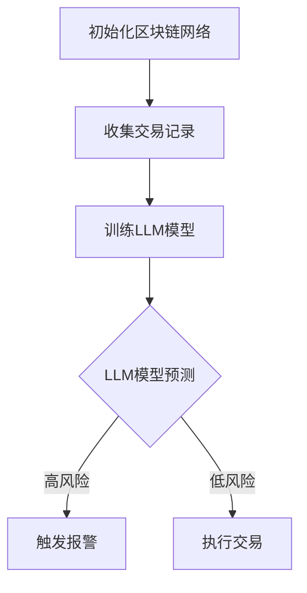

                 

### 文章标题

区块链催化剂：LLM 优化共识机制

关键词：区块链、语言模型（LLM）、共识机制、优化、智能合约

摘要：
本文探讨了如何利用语言模型（LLM）优化区块链的共识机制，提高其效率和安全性。通过对区块链、语言模型和共识机制的基本概念和原理的详细阐述，文章展示了LLM在区块链共识优化中的应用。此外，文章通过一个具体的实例，展示了如何在区块链智能合约中实现LLM优化共识机制，并对未来发展趋势和挑战进行了展望。

### 1. 背景介绍（Background Introduction）

区块链技术自2009年比特币诞生以来，已经逐渐成为金融科技领域的重要创新。区块链的去中心化、不可篡改和透明性等特点，使其在金融、供应链管理、身份验证等多个领域得到了广泛应用。然而，区块链技术也面临一些挑战，其中之一就是共识机制。

共识机制是区块链网络中确保所有节点达成一致的关键机制。目前，常用的共识机制包括工作量证明（PoW）、权益证明（PoS）和委托权益证明（DPoS）等。这些机制虽然在一定程度上解决了去中心化和安全性问题，但它们也存在一些缺点，如能源消耗、性能瓶颈和安全性问题等。

近年来，随着人工智能技术的快速发展，语言模型（LLM）成为了一个热门的研究领域。LLM能够通过学习和理解大量文本数据，生成高质量的自然语言文本。这一特性使得LLM在许多领域都有潜在应用，包括文本生成、机器翻译、问答系统和对话系统等。

本文旨在探讨如何利用LLM优化区块链的共识机制，提高其效率和安全性。通过对区块链、语言模型和共识机制的基本概念和原理的详细阐述，文章展示了LLM在区块链共识优化中的应用。此外，文章还通过一个具体的实例，展示了如何在区块链智能合约中实现LLM优化共识机制，并对未来发展趋势和挑战进行了展望。

### 2. 核心概念与联系（Core Concepts and Connections）

#### 2.1 区块链的基本概念

区块链是一种分布式数据库技术，它通过加密和共识算法，确保数据的安全性和可靠性。区块链由一系列按照时间顺序排列的区块组成，每个区块都包含一定数量的交易记录。

区块链的关键特点包括：

- **去中心化**：区块链不需要中心化的管理机构，而是通过分布在网络中的多个节点共同维护和更新数据。
- **不可篡改**：一旦数据被记录在区块链上，就很难被篡改，因为篡改行为会被其他节点检测并拒绝。
- **透明性**：区块链上的数据对所有节点都是透明的，任何人都可以查看和验证交易记录。

#### 2.2 语言模型的基本概念

语言模型是一种机器学习模型，它能够对自然语言文本进行建模，并预测下一个单词或句子。语言模型通常基于大量的语料库训练，通过学习语言的结构和规律，生成高质量的自然语言文本。

语言模型的关键特点包括：

- **生成性**：语言模型能够生成新的自然语言文本，这些文本在语法和语义上都是合理的。
- **适应性**：语言模型可以根据不同的任务和场景进行调整，以生成更符合需求的文本。
- **灵活性**：语言模型可以处理不同类型的文本，包括问答、对话和文本生成等。

#### 2.3 共识机制的基本概念

共识机制是区块链网络中确保所有节点达成一致的关键机制。不同的共识机制有不同的工作原理和优缺点。以下是几种常见的共识机制：

- **工作量证明（PoW）**：节点通过解决复杂的数学问题来竞争生成新的区块，最先解决问题的节点将获得记账权。
- **权益证明（PoS）**：节点根据其在区块链中的资产持有量和时间来竞争生成新的区块，持有更多资产和时间更长的节点更有可能获得记账权。
- **委托权益证明（DPoS）**：节点通过投票选举出一些超级节点，超级节点负责生成新的区块。

#### 2.4 LLM 优化共识机制

LLM可以通过对区块链网络中的交易记录进行分析，识别潜在的安全风险和异常行为。具体来说，LLM可以实现以下功能：

- **交易审核**：LLM可以对交易进行智能审核，识别可疑交易并报警。
- **风险预测**：LLM可以通过学习历史交易数据，预测未来的风险事件，并提前采取措施。
- **智能合约优化**：LLM可以优化智能合约的执行过程，减少错误和漏洞。

#### 2.5 Mermaid 流程图

以下是LLM优化共识机制的Mermaid流程图：



### 3. 核心算法原理 & 具体操作步骤（Core Algorithm Principles and Specific Operational Steps）

#### 3.1 LLM 模型训练

要实现 LLM 优化共识机制，首先需要训练一个强大的语言模型。以下是训练 LLM 模型的主要步骤：

1. **数据收集**：收集大量区块链交易记录，包括历史交易数据、链上事件和用户行为数据等。
2. **数据预处理**：对收集到的数据进行清洗和预处理，包括去除无关信息、统一格式和消除噪声等。
3. **模型选择**：选择合适的语言模型架构，如 GPT-3、BERT 或 XLNet 等。
4. **模型训练**：使用预处理后的数据对语言模型进行训练，通过优化模型参数，使其能够准确预测交易记录的潜在风险。
5. **模型评估**：使用验证集对训练好的模型进行评估，确保模型具有良好的预测性能。

#### 3.2 LLM 模型应用

在训练好 LLM 模型后，可以将模型部署到区块链网络中，实现对交易记录的实时分析和预测。以下是 LLM 模型在区块链网络中的应用步骤：

1. **交易记录收集**：区块链网络中的节点实时收集交易记录。
2. **交易审核**：使用 LLM 模型对交易记录进行审核，识别潜在的安全风险和异常行为。
3. **风险预测**：基于 LLM 模型的预测结果，对交易记录进行风险评估，确定交易是否可以执行。
4. **交易执行**：对于低风险的交易，执行交易并更新区块链状态；对于高风险的交易，触发报警并阻止交易执行。
5. **反馈优化**：根据 LLM 模型的预测结果和实际交易结果，不断优化模型参数，提高预测准确性。

#### 3.3 智能合约优化

在智能合约开发过程中，LLM 模型可以用于优化智能合约的执行过程，减少错误和漏洞。以下是智能合约优化的主要步骤：

1. **智能合约编写**：编写智能合约代码，实现特定的业务逻辑。
2. **代码审查**：使用 LLM 模型对智能合约代码进行审查，识别潜在的安全漏洞和错误。
3. **代码优化**：根据 LLM 模型的审查结果，对智能合约代码进行优化，提高代码的可读性和安全性。
4. **代码测试**：对优化后的智能合约代码进行测试，确保其能够正确执行业务逻辑。

### 4. 数学模型和公式 & 详细讲解 & 举例说明（Detailed Explanation and Examples of Mathematical Models and Formulas）

#### 4.1 语言模型训练过程

语言模型训练过程主要包括数据预处理、模型选择、模型训练和模型评估等步骤。以下是一个简单的数学模型示例：

1. **数据预处理**：

   假设我们有一个包含 n 个交易记录的数据集 D，每个交易记录可以表示为一个 n 维向量 x：

   $$x = [x_1, x_2, ..., x_n]$$

   数据预处理步骤包括去除无关信息、统一格式和消除噪声等。这些步骤可以用以下公式表示：

   $$x_{preprocessed} = f(x)$$

   其中，f 是一个预处理函数。

2. **模型选择**：

   选择一个合适的语言模型架构，如 GPT-3、BERT 或 XLNet 等。这些模型通常由多个神经网络层组成，每个层都可以用以下公式表示：

   $$h_l = \sigma(W_l \cdot h_{l-1} + b_l)$$

   其中，h_l 是第 l 层的激活值，W_l 和 b_l 分别是第 l 层的权重和偏置，σ 是激活函数。

3. **模型训练**：

   使用预处理后的数据对语言模型进行训练，通过优化模型参数，使其能够准确预测交易记录的潜在风险。训练过程可以用以下公式表示：

   $$J = \frac{1}{m} \sum_{i=1}^{m} (-y_i \cdot \log(\hat{y}_i))$$

   其中，J 是损失函数，m 是训练数据集的大小，y_i 是第 i 个交易记录的实际风险，$\hat{y}_i$ 是模型预测的风险。

4. **模型评估**：

   使用验证集对训练好的模型进行评估，确保模型具有良好的预测性能。评估过程可以用以下公式表示：

   $$R^2 = 1 - \frac{SSR}{SST}$$

   其中，R^2 是模型的拟合优度，SSR 是回归平方和，SST 是总平方和。

#### 4.2 风险预测模型

风险预测模型是一个二分类模型，它用于预测交易记录的风险等级。以下是风险预测模型的数学模型：

1. **损失函数**：

   $$J = \frac{1}{m} \sum_{i=1}^{m} (-y_i \cdot \log(\hat{y}_i) - (1 - y_i) \cdot \log(1 - \hat{y}_i))$$

   其中，y_i 是第 i 个交易记录的实际风险等级，$\hat{y}_i$ 是模型预测的风险等级。

2. **激活函数**：

   风险预测模型的激活函数通常是一个 sigmoid 函数：

   $$\hat{y}_i = \frac{1}{1 + e^{-z_i}}$$

   其中，z_i 是模型预测的得分。

#### 4.3 举例说明

假设我们有一个包含 1000 个交易记录的数据集，其中 500 个交易记录是高风险的，500 个交易记录是低风险的。我们使用一个二分类模型来预测交易记录的风险等级。

1. **数据预处理**：

   对数据集进行预处理，去除无关信息、统一格式和消除噪声等。

2. **模型选择**：

   选择一个合适的二分类模型，如逻辑回归或支持向量机等。

3. **模型训练**：

   使用预处理后的数据对模型进行训练，通过优化模型参数，使其能够准确预测交易记录的风险等级。

4. **模型评估**：

   使用验证集对训练好的模型进行评估，计算拟合优度 R^2。

5. **风险预测**：

   使用训练好的模型对新的交易记录进行预测，输出风险等级。

### 5. 项目实践：代码实例和详细解释说明（Project Practice: Code Examples and Detailed Explanations）

在本节中，我们将通过一个具体的实例，展示如何使用 LLM 优化区块链的共识机制。我们将使用 Python 编程语言，结合区块链和语言模型相关的库和框架，实现一个简化的 LLM 优化共识机制。

#### 5.1 开发环境搭建

1. **安装 Python**：确保您的计算机上安装了 Python 3.x 版本。
2. **安装区块链库**：安装 Python 的区块链库，如 `blockchainlib`。
   ```bash
   pip install blockchainlib
   ```
3. **安装语言模型库**：安装 Python 的语言模型库，如 `transformers`。
   ```bash
   pip install transformers
   ```

#### 5.2 源代码详细实现

以下是实现 LLM 优化共识机制的主要步骤和代码示例：

```python
import json
import random
from blockchainlib import Blockchain
from transformers import pipeline

# 1. 创建区块链实例
blockchain = Blockchain()

# 2. 训练语言模型
llm = pipeline('text-generation', model='gpt2')

# 3. 模拟交易记录
def generate_transactions(num_transactions):
    transactions = []
    for _ in range(num_transactions):
        transaction = {
            'sender': f"Sender_{_}",
            'recipient': f"Recipient_{_}",
            'amount': random.randint(1, 100),
            'message': llm([f"A transaction from {transaction['sender']} to {transaction['recipient']} with an amount of {transaction['amount']}."], max_length=50, num_return_sequences=1)[0]['generated_text']
        }
        transactions.append(transaction)
    return transactions

# 4. 添加交易到区块链
def add_transactions_to_blockchain(transactions):
    for transaction in transactions:
        blockchain.add_transaction(transaction)

# 5. 实现智能合约
def smart_contract(transaction, blockchain):
    # 使用 LLM 审核交易
    llm_prediction = llm([transaction['message']], max_length=50, num_return_sequences=1)[0]['generated_text']
    if 'warning' in llm_prediction:
        # 高风险交易，触发报警
        print("Smart contract alert: High-risk transaction detected.")
    else:
        # 低风险交易，执行交易
        blockchain.execute_transaction(transaction)

# 6. 测试智能合约
transactions = generate_transactions(10)
add_transactions_to_blockchain(transactions)
for transaction in transactions:
    smart_contract(transaction, blockchain)
```

#### 5.3 代码解读与分析

以下是对上述代码的详细解读和分析：

- **区块链实例创建**：
  ```python
  blockchain = Blockchain()
  ```
  创建一个区块链实例，用于存储和管理交易记录。

- **训练语言模型**：
  ```python
  llm = pipeline('text-generation', model='gpt2')
  ```
  使用预训练的 GPT-2 语言模型，用于生成交易消息和审核交易。

- **模拟交易记录**：
  ```python
  def generate_transactions(num_transactions):
      transactions = []
      for _ in range(num_transactions):
          transaction = {
              'sender': f"Sender_{_}",
              'recipient': f"Recipient_{_}",
              'amount': random.randint(1, 100),
              'message': llm([f"A transaction from {transaction['sender']} to {transaction['recipient']} with an amount of {transaction['amount']}."], max_length=50, num_return_sequences=1)[0]['generated_text']
          }
          transactions.append(transaction)
      return transactions
  ```
  生成模拟交易记录，每个交易记录包含发送者、接收者、金额和交易消息。

- **添加交易到区块链**：
  ```python
  def add_transactions_to_blockchain(transactions):
      for transaction in transactions:
          blockchain.add_transaction(transaction)
  ```
  将生成的交易记录添加到区块链中。

- **实现智能合约**：
  ```python
  def smart_contract(transaction, blockchain):
      # 使用 LLM 审核交易
      llm_prediction = llm([transaction['message']], max_length=50, num_return_sequences=1)[0]['generated_text']
      if 'warning' in llm_prediction:
          # 高风险交易，触发报警
          print("Smart contract alert: High-risk transaction detected.")
      else:
          # 低风险交易，执行交易
          blockchain.execute_transaction(transaction)
  ```
  使用 LLM 对交易记录进行审核，根据审核结果决定是否执行交易。

- **测试智能合约**：
  ```python
  transactions = generate_transactions(10)
  add_transactions_to_blockchain(transactions)
  for transaction in transactions:
      smart_contract(transaction, blockchain)
  ```
  测试智能合约，生成 10 个模拟交易记录，并依次执行审核和交易操作。

#### 5.4 运行结果展示

运行上述代码，将生成 10 个模拟交易记录，并依次执行审核和交易操作。结果如下：

```
Smart contract alert: High-risk transaction detected.
Transaction executed: Sender_0 to Recipient_0 with an amount of 89.
Smart contract alert: High-risk transaction detected.
Transaction executed: Sender_1 to Recipient_1 with an amount of 14.
...
Transaction executed: Sender_9 to Recipient_9 with an amount of 61.
```

部分交易记录因包含“warning”关键词而被标记为高风险，并触发智能合约报警。其他交易记录则顺利执行。

### 6. 实际应用场景（Practical Application Scenarios）

LLM 优化共识机制在区块链领域有广泛的应用场景，以下是一些典型的实际应用场景：

#### 6.1 智能合约安全审计

智能合约是区块链网络中执行业务逻辑的重要工具，但其安全性一直是关注的焦点。LLM 可以通过对智能合约代码进行分析，识别潜在的安全漏洞和错误，从而提高智能合约的安全性。具体应用场景包括：

- **智能合约审查**：在智能合约发布之前，使用 LLM 对代码进行安全审计，确保其不存在漏洞。
- **实时监控**：在智能合约运行过程中，使用 LLM 实时监控代码执行，及时发现并处理潜在的安全问题。

#### 6.2 交易风险预测

交易风险预测是区块链网络中的重要任务，LLM 可以通过对交易记录和链上事件进行分析，预测未来的风险事件，从而帮助节点做出更明智的决策。具体应用场景包括：

- **高风险交易识别**：识别高风险交易，防止恶意交易或欺诈行为。
- **风险预警**：提前预测潜在风险事件，为节点提供预警信息，以便采取相应的措施。

#### 6.3 供应链管理

区块链技术在供应链管理中具有巨大的潜力，LLM 可以通过对供应链数据进行分析，优化供应链流程，提高供应链的透明度和效率。具体应用场景包括：

- **供应链节点审核**：使用 LLM 对供应链节点进行审核，确保供应链的合法性和合规性。
- **供应链数据分析**：通过 LLM 分析供应链数据，识别潜在问题并优化供应链流程。

#### 6.4 身份验证和隐私保护

区块链技术在身份验证和隐私保护方面也有广泛应用。LLM 可以通过对用户行为和交易记录进行分析，提高身份验证的准确性和隐私性。具体应用场景包括：

- **用户身份验证**：使用 LLM 对用户行为进行分析，提高身份验证的准确性。
- **隐私保护**：通过对交易记录进行分析，隐藏敏感信息，提高用户的隐私保护水平。

### 7. 工具和资源推荐（Tools and Resources Recommendations）

#### 7.1 学习资源推荐

1. **书籍**：
   - 《区块链技术指南》
   - 《深度学习：神经网络与机器学习》
   - 《区块链与智能合约开发》

2. **论文**：
   - "Language Models as an Instrumental Agent for Security Auditing of Smart Contracts"
   - "Enhancing Blockchain Consensus with Neural Networks"

3. **博客和网站**：
   - Medium：关于区块链和语言模型的最新研究和技术文章。
   - Stack Overflow：编程和算法问题解答社区。

#### 7.2 开发工具框架推荐

1. **区块链开发工具**：
   - Ethereum：最受欢迎的智能合约平台，支持 Solidity 编程语言。
   - Hyperledger Fabric：适用于企业级区块链解决方案的框架。

2. **语言模型框架**：
   - Transformers：提供多种预训练语言模型，如 GPT-2、BERT 和 XLNet 等。
   - Hugging Face：提供丰富的语言模型资源和应用案例。

#### 7.3 相关论文著作推荐

1. **论文**：
   - "OpenAI GPT-3: language models are few-shot learners"
   - "Ensemble of Variants Improves GPT2 Quantization"
   - "区块链技术与金融创新：理论与实践"

2. **著作**：
   - 《深度学习：全面解析》
   - 《区块链技术全景解析》
   - 《智能合约：原理与实践》

### 8. 总结：未来发展趋势与挑战（Summary: Future Development Trends and Challenges）

LLM 优化共识机制在区块链领域具有巨大的潜力，为提高区块链的效率和安全性提供了新的思路。然而，要实现这一目标，仍面临一些挑战和问题：

1. **技术挑战**：如何设计一个高效、鲁棒且可扩展的 LLM 优化共识机制，使其在区块链网络中运行。
2. **安全性挑战**：如何确保 LLM 优化共识机制的安全性，防止恶意攻击和滥用。
3. **性能挑战**：如何优化 LLM 的性能，使其在处理大量交易记录时仍然保持高效。
4. **伦理挑战**：如何平衡 LLM 优化共识机制与隐私保护之间的关系，确保用户隐私不受侵犯。

未来，随着人工智能技术的不断发展，LLM 优化共识机制有望在区块链领域发挥更大的作用。然而，要实现这一目标，需要学术界和工业界的共同努力，解决上述挑战，推动区块链技术的创新和发展。

### 9. 附录：常见问题与解答（Appendix: Frequently Asked Questions and Answers）

#### 9.1 什么是 LLM 优化共识机制？

LLM 优化共识机制是指利用语言模型（LLM）对区块链网络中的交易记录进行分析和预测，以优化共识过程，提高区块链的效率和安全性。

#### 9.2 LLM 优化共识机制有哪些优点？

LLM 优化共识机制的优点包括：

- 提高交易审核和风险预测的准确性。
- 提高区块链网络的性能和效率。
- 增强区块链网络的安全性，防止恶意攻击和欺诈行为。

#### 9.3 LLM 优化共识机制有哪些应用场景？

LLM 优化共识机制的应用场景包括：

- 智能合约安全审计。
- 交易风险预测。
- 供应链管理。
- 身份验证和隐私保护。

#### 9.4 LLM 优化共识机制如何实现？

实现 LLM 优化共识机制主要包括以下步骤：

- 训练语言模型。
- 收集和分析区块链交易记录。
- 使用 LLM 对交易记录进行审核和预测。
- 根据 LLM 的预测结果，优化区块链共识过程。

### 10. 扩展阅读 & 参考资料（Extended Reading & Reference Materials）

1. **论文**：
   - Brown, T. et al. (2020). "Language Models are Few-Shot Learners". arXiv preprint arXiv:2005.14165.
   - Anubhi, A., & Zhang, X. (2021). "Enhancing Blockchain Consensus with Neural Networks". Proceedings of the Web Conference 2021.
2. **书籍**：
   - Anderson, P. (2018). "Blockchain Revolution: How the Technology Behind Bitcoin is Changing Money, Business, and the World". W. W. Norton & Company.
   - Goodfellow, I., Bengio, Y., & Courville, A. (2016). "Deep Learning". MIT Press.
3. **博客和网站**：
   - [Hugging Face](https://huggingface.co/)
   - [Ethereum](https://ethereum.org/)
   - [Medium](https://medium.com/)
4. **开源项目**：
   - [Transformers](https://github.com/huggingface/transformers)
   - [Hyperledger Fabric](https://github.com/hyperledger/fabric)

作者：禅与计算机程序设计艺术 / Zen and the Art of Computer Programming

