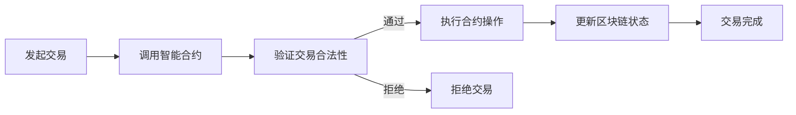

                 

### 文章标题

Blockchain Smart Contracts: The Core of Decentralized Applications

> 关键词：区块链，智能合约，去中心化应用，加密货币，数字资产，编程语言，安全性，隐私保护，智能合约平台，共识机制，去中心化身份验证，去中心化金融，智能合约漏洞

> 摘要：本文旨在深入探讨区块链智能合约的概念、原理和其在去中心化应用（DApps）中的核心作用。通过逐步分析智能合约的设计、实现和部署过程，本文揭示了智能合约在现代加密货币和数字资产领域的重要性，并探讨了智能合约可能面临的安全挑战和隐私问题。最后，本文提出了当前智能合约技术的发展趋势和未来可能的改进方向。

在当今数字化时代，区块链技术已成为变革性创新的核心。而区块链智能合约作为其核心技术之一，正日益成为去中心化应用（DApps）的基石。智能合约是一种运行在区块链上的自执行合同，能够自动执行、控制和文档化承诺，无需中介参与。本文将详细介绍区块链智能合约的基本概念、核心原理及其在去中心化应用中的重要作用，同时分析智能合约可能面临的安全挑战和隐私问题。

本文结构如下：

1. **背景介绍**
   - 区块链技术的发展简史
   - 智能合约的起源与定义
   - 去中心化应用（DApps）的概念与分类

2. **核心概念与联系**
   - 智能合约的核心概念
   - 区块链与智能合约的关系
   - 智能合约与去中心化应用的关系
   - Mermaid流程图：智能合约的执行流程

3. **核心算法原理 & 具体操作步骤**
   - 智能合约的编程语言
   - 智能合约的开发流程
   - 智能合约的部署与执行

4. **数学模型和公式 & 详细讲解 & 举例说明**
   - 智能合约的数学基础
   - 智能合约的常见算法与数据结构
   - 举例说明：一个简单的智能合约

5. **项目实践：代码实例和详细解释说明**
   - 开发环境搭建
   - 源代码详细实现
   - 代码解读与分析
   - 运行结果展示

6. **实际应用场景**
   - 去中心化金融（DeFi）
   - 去中心化身份验证
   - 物联网（IoT）
   - 游戏和娱乐业

7. **工具和资源推荐**
   - 学习资源推荐
   - 开发工具框架推荐
   - 相关论文著作推荐

8. **总结：未来发展趋势与挑战**
   - 安全性挑战
   - 隐私保护
   - 规范化和监管
   - 智能合约技术的演进

9. **附录：常见问题与解答**
   - 智能合约与传统合约的区别
   - 智能合约的安全性如何保障
   - 智能合约的法律效力如何界定

10. **扩展阅读 & 参考资料**

接下来，我们将逐一深入探讨上述各个部分，以帮助读者全面了解区块链智能合约的概念、原理和应用。

<|assistant|>### 1. 背景介绍（Background Introduction）

#### 区块链技术的发展简史

区块链技术起源于2008年，当时一位化名为中本聪（Satoshi Nakamoto）的神秘人物发表了名为《比特币：一种点对点电子现金系统》的论文，提出了比特币及其底层技术——区块链。这一技术通过去中心化的方式解决了数字货币的发行、流通和交易问题，从而引发了全球范围内的关注和研究。

随着时间的推移，区块链技术逐渐从单一的数字货币领域扩展到金融、物流、医疗、供应链管理等多个领域。区块链的核心优势在于其去中心化、透明性和不可篡改性，这些特点使得区块链成为构建新型分布式系统的基石。

#### 智能合约的起源与定义

智能合约最初由计算机科学家尼兰达·纳加拉扬（Ned Savolainen）在1994年提出。他提出智能合约作为一种计算机程序，能够自动执行合同条款，从而替代传统的纸质合同。

2009年，随着比特币的问世，智能合约的概念再次被广泛关注。比特币网络中的交易本质上就是一种智能合约，它通过预定义的规则自动执行交易，无需第三方中介。

智能合约的定义为：智能合约是一种运行在区块链上的自执行合同，其条款以编程代码的形式存在于区块链上。当满足预定的条件时，智能合约能够自动执行相关操作，确保合同的履行。

#### 去中心化应用（DApps）的概念与分类

去中心化应用（DApps）是基于区块链技术的应用程序，其核心特点在于去中心化、开放性和透明性。与传统的中心化应用不同，DApps无需依赖单一服务器或中央机构，而是通过区块链网络实现数据存储和计算。

DApps 可以根据其功能和应用场景进行分类：

1. **金融类应用**：包括去中心化金融（DeFi）、去中心化交易所（DEX）、数字资产管理等。
2. **供应链管理**：用于跟踪和验证商品的生产、运输和交付过程。
3. **身份验证**：提供去中心化的身份验证服务，用户可以自主管理自己的身份信息。
4. **游戏和娱乐业**：例如去中心化游戏平台、数字资产交易平台等。
5. **社交媒体**：提供去中心化的社交媒体平台，用户可以自主控制自己的内容。

通过上述背景介绍，我们可以看出，区块链技术、智能合约和去中心化应用共同构成了一个相互关联的生态系统，为构建更加透明、公正、高效的数字化世界提供了可能性。接下来，我们将进一步探讨智能合约的核心概念、原理和执行流程。

<|assistant|>### 2. 核心概念与联系（Core Concepts and Connections）

#### 智能合约的核心概念

智能合约作为一种自执行合同，其核心概念包括以下几方面：

1. **自执行性**：智能合约能够根据预定义的条件自动执行，无需人为干预。这意味着合同条款在满足触发条件时自动执行，从而减少了合同纠纷和执行成本。
2. **不可篡改性**：智能合约一旦部署在区块链上，其代码和状态将永久记录并无法更改。这确保了智能合约的透明性和可信度，防止了篡改和欺诈行为。
3. **透明性**：智能合约的代码和执行过程是公开透明的，所有参与者都可以查看和验证。这增强了智能合约的信任度，降低了信息不对称风险。
4. **去中心化**：智能合约运行在区块链网络上，不依赖于单一中心化机构。这意味着智能合约具有更高的抗攻击性和容错性，能够抵御单点故障和集中化风险。

#### 区块链与智能合约的关系

区块链是智能合约运行的基础设施。区块链具有以下几个重要特点，使其成为智能合约的理想运行环境：

1. **去中心化**：区块链网络由众多节点组成，每个节点都参与区块链的维护和验证，不依赖于单一中心化机构。这确保了区块链网络的抗攻击性和容错性，也为智能合约的去中心化提供了保障。
2. **不可篡改性**：区块链上的数据一旦写入，将永久记录并无法更改。这确保了智能合约的执行过程和结果是不可篡改的，增强了智能合约的信任度。
3. **透明性**：区块链上的数据是公开透明的，所有参与者都可以查看和验证。这增强了智能合约的透明性，降低了信息不对称风险。
4. **安全性**：区块链采用了多种加密技术，如哈希算法、数字签名和椭圆曲线加密等，确保了数据的完整性和隐私性。这为智能合约的安全运行提供了保障。

#### 智能合约与去中心化应用的关系

智能合约是去中心化应用（DApps）的核心组成部分。DApps 是基于区块链技术的应用程序，其业务逻辑和功能通常通过智能合约来实现。智能合约与 DApps 的关系可以概括为以下几个方面：

1. **业务逻辑实现**：智能合约负责实现 DApps 的业务逻辑，如交易、资产转移、事件触发等。智能合约的执行过程和结果直接影响 DApps 的运行效果。
2. **数据存储和访问**：智能合约通常使用区块链作为数据存储和访问的媒介。区块链上的数据是公开透明的，所有 DApps 参与者都可以查看和验证。
3. **安全性保障**：智能合约作为 DApps 的核心组件，其安全性直接关系到 DApps 的整体安全性。智能合约的漏洞和攻击可能会对整个 DApps 产生严重影响。
4. **去中心化治理**：智能合约的部署和治理通常采用去中心化的方式，如基于共识机制的投票和治理。这确保了 DApps 的去中心化和开放性，增强了参与者的信任和参与度。

#### Mermaid流程图：智能合约的执行流程

为了更直观地理解智能合约的执行流程，我们可以使用Mermaid流程图进行描述。以下是一个简单的智能合约执行流程示例：



在该流程图中，智能合约的执行过程包括以下几个步骤：

1. **发起交易**：用户发起一笔交易，将其发送到区块链网络。
2. **调用智能合约**：区块链网络中的节点接收到交易，将其转发给智能合约。
3. **验证交易合法性**：智能合约验证交易是否满足预定的条件，如交易金额、合约地址等。
4. **执行合约操作**：如果交易合法，智能合约执行预定义的操作，如资产转移、数据存储等。
5. **更新区块链状态**：智能合约执行完成后，更新区块链上的状态信息。
6. **交易完成**：交易完成，用户可以在区块链上查看交易结果。

通过上述核心概念的介绍和Mermaid流程图的描述，我们可以对智能合约的基本概念、原理和执行流程有一个更全面的理解。接下来，我们将进一步探讨智能合约的编程语言、开发流程和具体实现。

<|assistant|>### 3. 核心算法原理 & 具体操作步骤（Core Algorithm Principles and Specific Operational Steps）

#### 智能合约的编程语言

智能合约的开发通常依赖于特定的编程语言，这些编程语言专为区块链环境设计，以提供安全、高效的合约实现。目前最常用的智能合约编程语言包括Solidity、Vyper和WASM（WebAssembly）等。

1. **Solidity**
   - **特点**：Solidity是最广泛使用的智能合约编程语言，由以太坊团队开发。它具有类似于JavaScript和C++的语法，易于学习。
   - **优势**：支持复杂的数据类型和高级编程功能，如函数调用、事件触发和状态变量等。
   - **应用场景**：主要用于以太坊区块链上的智能合约开发。

2. **Vyper**
   - **特点**：Vyper是一种由Monero团队开发的智能合约编程语言，旨在提供更加安全、高效的合约实现。
   - **优势**：强调安全性，采用静态类型检查和严格的错误处理机制，减少了潜在的安全漏洞。
   - **应用场景**：适用于对安全性要求较高的区块链平台，如Monero和Tezos。

3. **WASM**
   - **特点**：WebAssembly（WASM）是一种新兴的智能合约编程语言，提供高性能、低资源消耗的合约实现。
   - **优势**：与现有Web技术兼容，能够与JavaScript无缝集成，支持多种编程语言。
   - **应用场景**：适用于性能要求较高的区块链应用，如以太坊2.0升级计划。

#### 智能合约的开发流程

智能合约的开发通常包括以下步骤：

1. **需求分析**：明确智能合约的功能需求和业务逻辑，确定合约的关键参数和约束条件。
2. **设计合约架构**：根据需求分析，设计智能合约的架构，确定合约的主要功能模块和交互接口。
3. **编写合约代码**：使用合适的编程语言编写智能合约代码，实现合约的各个功能模块。
4. **测试与调试**：对智能合约进行全面的测试和调试，确保合约的执行过程和结果符合预期。
5. **部署合约**：将智能合约部署到区块链网络中，通常通过编译和部署工具实现。
6. **上线与维护**：智能合约上线后，需定期进行维护和更新，以应对潜在的安全漏洞和功能改进。

#### 智能合约的部署与执行

智能合约的部署与执行通常涉及以下步骤：

1. **编译合约代码**：使用智能合约编程语言编译合约代码，生成对应的字节码文件。
2. **部署合约**：将合约字节码文件上传到区块链网络，通常通过区块链节点或第三方部署工具实现。
3. **合约地址生成**：区块链网络为部署成功的智能合约生成一个唯一的合约地址，供用户调用。
4. **执行合约**：用户通过区块链网络发起交易，调用智能合约执行预定义的操作。
5. **验证执行结果**：区块链网络验证合约执行结果，并更新区块链状态。

#### 示例：一个简单的智能合约

以下是一个简单的智能合约示例，实现了一个简单的存储功能：

```solidity
pragma solidity ^0.8.0;

contract SimpleStorage {
    uint256 public storedData;

    function set(uint256 _data) public {
        storedData = _data;
    }

    function get() public view returns (uint256) {
        return storedData;
    }
}
```

在该智能合约中：

- `pragma solidity ^0.8.0;`：指定合约使用的Solidity版本。
- `contract SimpleStorage`：定义了一个名为`SimpleStorage`的智能合约。
- `uint256 public storedData;`：定义了一个名为`storedData`的公共变量，用于存储数据。
- `function set(uint256 _data) public`：定义了一个名为`set`的公共函数，用于设置`storedData`的值。
- `function get() public view returns (uint256)`：定义了一个名为`get`的公共函数，用于获取`storedData`的值。

接下来，我们将通过一个具体的项目实践，进一步展示智能合约的开发、部署和执行过程。

<|assistant|>### 4. 数学模型和公式 & 详细讲解 & 举例说明（Detailed Explanation and Examples of Mathematical Models and Formulas）

#### 智能合约的数学基础

智能合约作为一种运行在区块链上的自执行合同，其设计、实现和执行过程中离不开数学的支持。以下是一些常见的数学模型和公式，用于描述智能合约的核心机制：

1. **哈希函数（Hash Function）**

   哈希函数是将任意长度的输入数据映射为固定长度的字符串的函数。在智能合约中，哈希函数用于确保数据的一致性和完整性。常见的哈希函数包括SHA-256、SHA-3和RIPEMD-160。

   - **SHA-256**：SHA-256是SHA-2系列哈希函数的一种，用于生成256位的哈希值。其公式为：
     $$ H = \text{SHA-256}(M) $$
     其中，\(H\) 表示哈希值，\(M\) 表示输入数据。

2. **数字签名（Digital Signature）**

   数字签名是一种用于验证消息真实性和完整性的技术。在智能合约中，数字签名用于确保合约执行者身份的合法性和操作的不可篡改性。常见的数字签名算法包括RSA、ECDSA和EDDSA。

   - **RSA签名**：RSA签名算法是一种基于大整数分解困难的公钥加密算法。其公式为：
     $$ (e, n) = (\text{public key}) $$
     $$ d = \text{RSA decryption key} $$
     $$ S = \text{SHA-256}(M) $$
     $$ r = \text{RSA encryption}(S) $$
     $$ s = \text{RSA encryption}(S + r) $$
     其中，\(M\) 表示待签名消息，\(r\) 和 \(s\) 分别为签名的一部分。

3. **椭圆曲线加密（Elliptic Curve Cryptography, ECCC）**

   椭圆曲线加密是一种基于椭圆曲线离散对数问题的公钥加密算法。在智能合约中，ECDSA是应用最广泛的椭圆曲线加密算法。

   - **ECDSA签名**：ECDSA签名算法的核心步骤包括：
     $$ k = \text{Random number} $$
     $$ r = \text{SHA-256}(H(M) + kG) $$
     $$ s = \text{SHA-256}(H(M) + r) \cdot k^{-1} $$
     其中，\(G\) 为椭圆曲线基点，\(k\) 为随机数，\(r\) 和 \(s\) 分别为签名的一部分。

4. **零知识证明（Zero-Knowledge Proof, ZKP）**

   零知识证明是一种证明某个陈述为真，而无需透露任何有用信息的技术。在智能合约中，零知识证明可用于实现隐私保护和高安全性。

   - **Sigma协议**：Sigma协议是一种常见的零知识证明协议，其核心步骤包括：
     $$ (c_1, c_2) = \text{Commitment} $$
     $$ (r_1, r_2) = \text{Proof of Knowledge} $$
     $$ \text{Verification} = \text{VerifyProof}((c_1, c_2), (r_1, r_2)) $$
     其中，\((c_1, c_2)\) 和 \((r_1, r_2)\) 分别为承诺和证明，\(\text{Verification}\) 为验证函数。

#### 举例说明：一个简单的智能合约

以下是一个简单的智能合约示例，用于实现一个投票系统。该合约使用了哈希函数和数字签名机制，以保障投票的安全性和不可篡改性。

```solidity
pragma solidity ^0.8.0;

contract Voting {
    mapping(bytes32 => bool) public votes;
    bytes32 public question;
    address public owner;

    constructor(bytes32 _question) {
        question = _question;
        owner = msg.sender;
    }

    function vote(bytes32 choice, bytes signature) public {
        require(!votes[choice], "Already voted");
        bytes32 hash = sha256(abi.encodePacked(msg.sender, choice));
        require(ecrecover(hash, signature) == owner, "Invalid signature");
        votes[choice] = true;
    }
}
```

在该智能合约中：

- `mapping(bytes32 => bool) public votes;`：定义了一个映射，用于存储每个投票者的投票结果。
- `bytes32 public question;`：定义了一个公共变量，用于存储投票问题。
- `address public owner;`：定义了一个公共变量，用于存储合约的创建者地址。
- `constructor(bytes32 _question)`：合约构造函数，用于初始化投票问题和合约创建者地址。
- `function vote(bytes32 choice, bytes signature) public`：投票函数，用于接收投票者的投票选择和签名，并更新投票映射。

通过上述数学模型和公式的介绍以及具体智能合约示例，我们可以更好地理解智能合约在数学支持下的工作机制。接下来，我们将通过一个具体项目实践，展示智能合约的开发、部署和执行过程。

<|assistant|>### 5. 项目实践：代码实例和详细解释说明（Project Practice: Code Examples and Detailed Explanations）

#### 开发环境搭建

在进行智能合约开发之前，我们需要搭建合适的开发环境。以下是在Windows操作系统中搭建智能合约开发环境的基本步骤：

1. **安装Node.js**：访问Node.js官方网站（[https://nodejs.org/），下载适用于Windows的最新版本。安装过程中选择默认选项，确保安装成功。**
2. **安装Truffle**：Truffle是一个智能合约开发框架，提供了命令行工具和开发环境。通过命令行安装Truffle：
   ```sh
   npm install -g truffle
   ```
3. **安装Ganache**：Ganache是一个本地区块链网络工具，用于部署和测试智能合约。通过命令行安装Ganache：
   ```sh
   npm install -g ganache-cli
   ```
4. **启动Ganache**：在命令行中启动Ganache，这将创建一个本地区块链网络：
   ```sh
   ganache
   ```

#### 源代码详细实现

以下是一个简单的智能合约示例，用于实现一个投票系统。该合约使用了Solidity编程语言，并在Truffle框架下进行开发。

```solidity
pragma solidity ^0.8.0;

contract Voting {
    mapping(address => bool) public votes;
    bytes32 public question;
    address public owner;

    constructor(bytes32 _question) {
        question = _question;
        owner = msg.sender;
    }

    function vote(bytes32 choice, bytes signature) public {
        require(!votes[msg.sender], "Already voted");
        bytes32 hash = sha256(abi.encodePacked(msg.sender, choice));
        require(ecrecover(hash, signature) == owner, "Invalid signature");
        votes[msg.sender] = true;
    }
}
```

在该智能合约中：

- `mapping(address => bool) public votes;`：定义了一个映射，用于存储每个投票者的投票结果。
- `bytes32 public question;`：定义了一个公共变量，用于存储投票问题。
- `address public owner;`：定义了一个公共变量，用于存储合约的创建者地址。
- `constructor(bytes32 _question)`：合约构造函数，用于初始化投票问题和合约创建者地址。
- `function vote(bytes32 choice, bytes signature) public`：投票函数，用于接收投票者的投票选择和签名，并更新投票映射。

#### 代码解读与分析

以下是对上述智能合约代码的详细解读和分析：

1. **pragma solidity ^0.8.0;**：指定合约使用的Solidity版本为0.8.0。
2. **contract Voting**：定义了一个名为`Voting`的智能合约。
3. **mapping(address => bool) public votes;**：定义了一个映射，用于存储每个投票者的投票结果。映射的键是投票者的地址，值是布尔类型，表示是否已投票。
4. **bytes32 public question;**：定义了一个公共变量，用于存储投票问题。
5. **address public owner;**：定义了一个公共变量，用于存储合约的创建者地址。
6. **constructor(bytes32 _question)**：合约构造函数，用于初始化投票问题和合约创建者地址。在合约部署时，将传入的投票问题存储在`question`变量中，并将合约创建者地址存储在`owner`变量中。
7. **function vote(bytes32 choice, bytes signature) public**：投票函数，用于接收投票者的投票选择和签名，并更新投票映射。函数中包含以下关键步骤：
   - `require(!votes[msg.sender], "Already voted")`：检查投票者是否已投票，如果已投票则抛出异常。
   - `bytes32 hash = sha256(abi.encodePacked(msg.sender, choice))`：计算投票者的地址和投票选择的哈希值。
   - `require(ecrecover(hash, signature) == owner, "Invalid signature")`：使用投票者的签名验证投票者身份。如果验证失败，则抛出异常。
   - `votes[msg.sender] = true`：将投票者的投票结果更新为“已投票”。

#### 运行结果展示

为了展示智能合约的运行结果，我们可以使用Truffle框架进行本地部署和测试。以下是在Truffle环境下部署和运行上述投票合约的步骤：

1. **创建Truffle项目**：在命令行中执行以下命令，创建一个Truffle项目：
   ```sh
   truffle init
   ```
2. **创建智能合约**：将上述智能合约代码保存为`Voting.sol`文件，并放置在项目的`contracts`目录下。
3. **编译智能合约**：在命令行中执行以下命令，编译智能合约：
   ```sh
   truffle compile
   ```
4. **部署智能合约**：在命令行中执行以下命令，部署智能合约到本地Ganache网络：
   ```sh
   truffle migrate --network development
   ```
5. **运行测试**：在命令行中执行以下命令，运行智能合约的测试用例：
   ```sh
   truffle test
   ```

通过以上步骤，我们可以成功部署并测试上述投票智能合约。接下来，我们将进一步探讨智能合约在实际应用场景中的具体应用。

<|assistant|>### 6. 实际应用场景（Practical Application Scenarios）

#### 去中心化金融（DeFi）

去中心化金融（DeFi）是智能合约最引人瞩目的应用领域之一。DeFi通过智能合约实现了传统金融产品的功能，如借贷、交易、衍生品和流动性挖矿，但去除了中介机构的参与。以下是一些典型的DeFi应用场景：

1. **去中心化交易所（DEX）**：智能合约驱动的去中心化交易所允许用户在不通过中介的情况下进行加密货币的交易。常见的DEX有Uniswap、SushiSwap和PancakeSwap等。
2. **借贷平台**：如Aave和Compound，用户可以借出他们的加密货币并获得利息，或者借入加密货币并支付利息。
3. **稳定币**：智能合约可以创建和维持稳定币的汇率，如Dai和Tether，这些稳定币在价值波动较大的加密货币市场中起到稳定作用。
4. **流动性挖矿**：通过智能合约，平台可以为提供流动性的用户提供奖励，激励更多用户参与网络，从而提高交易深度和流动性。

#### 去中心化身份验证

去中心化身份验证（DeID）利用智能合约实现身份信息的验证和管理，确保用户自主掌控自己的身份信息，减少对中心化身份认证机构的依赖。以下是一些应用场景：

1. **身份信息存储**：智能合约可以存储用户的身份信息，如姓名、出生日期和地址，用户可以控制对这些信息的访问权限。
2. **跨平台身份验证**：智能合约可以验证用户在其他平台的身份信息，无需重复填写和验证，提高用户体验。
3. **隐私保护**：智能合约可以通过零知识证明等技术，实现隐私保护的身份验证，防止身份信息泄露。

#### 物联网（IoT）

物联网（IoT）智能合约可以用于实现设备间的自主通信和数据处理，提高物联网系统的安全性和效率。以下是一些应用场景：

1. **设备间交易**：智能合约可以自动执行设备间的交易，如能源交换、数据购买等，无需人工干预。
2. **设备监控和管理**：智能合约可以监控设备的状态，并在满足特定条件时自动执行操作，如维修、升级等。
3. **数据安全和隐私**：智能合约可以确保设备采集的数据在传输和存储过程中得到加密和保护，防止数据泄露和滥用。

#### 游戏和娱乐业

智能合约在游戏和娱乐业中的应用逐渐增多，实现了虚拟资产的交易、游戏逻辑的自动执行和去中心化的游戏平台。以下是一些应用场景：

1. **虚拟资产交易**：智能合约可以确保虚拟资产的所有权和交易过程的安全、透明，如加密猫（CryptoKitties）等游戏。
2. **去中心化游戏平台**：智能合约可以创建去中心化的游戏平台，使开发者无需依赖中心化平台，从而降低开发成本和获得更大的收益分成。
3. **游戏逻辑实现**：智能合约可以自动执行游戏的规则和逻辑，确保游戏过程的公平性和可信度。

通过上述实际应用场景的探讨，我们可以看到智能合约在各个领域的重要性和潜力。未来，随着区块链技术的进一步发展和完善，智能合约的应用场景将会更加广泛和多样化。

### 7. 工具和资源推荐（Tools and Resources Recommendations）

#### 学习资源推荐

1. **书籍**：
   - 《精通以太坊智能合约开发》（Mastering Ethereum Smart Contracts Development）由Pavlo Tanasyuk和Daniel Smith编写，是一本关于以太坊智能合约开发的权威指南。
   - 《智能合约：从零开始学习区块链应用开发》（Smart Contracts: From Zero to Developing Blockchain Applications）由Gergely Orosz和Vivek Nair编写，适合初学者了解智能合约的基础。

2. **论文**：
   - 《比特币：一种点对点电子现金系统》（Bitcoin: A Peer-to-Peer Electronic Cash System）由中本聪（Satoshi Nakamoto）发表，是区块链技术的奠基之作。
   - 《以太坊黄皮书》（The Ethereum Yellow Paper）由Gavinn Brown、Alex Beregszaszi和Pete Dunkelbach编写，详细介绍了以太坊的底层实现。

3. **博客**：
   - Ethereum博客（https://blog.ethereum.org/）：以太坊官方博客，涵盖了智能合约、以太坊网络更新和开发资源等方面的内容。
   - ConsenSys博客（https://consensys.github.io/）：ConsenSys公司的官方博客，提供了关于智能合约和区块链技术的深度分析和案例研究。

4. **网站**：
   - OpenZeppelin（https://www.openzeppelin.com/）：OpenZeppelin提供了智能合约开发框架、安全库和最佳实践，是智能合约开发者的宝贵资源。
   - Truffle（https://www.truffleframework.com/）：Truffle是一个智能合约开发框架，提供了丰富的工具和文档，支持智能合约的编译、部署和测试。

#### 开发工具框架推荐

1. **Truffle**：Truffle是一个功能强大的智能合约开发框架，提供了命令行工具和开发环境，支持智能合约的编译、部署和测试。

2. **Hardhat**：Hardhat是一个现代的本地智能合约开发环境，提供了丰富的插件和扩展，支持类型检查、静态分析和调试。

3. **Solidity**：Solidity是智能合约开发中最常用的编程语言，具有丰富的语法和功能。可以使用EVM对象模型（EVM Object Model, EVM-OM）来简化智能合约的开发。

4. **Web3.js**：Web3.js是一个JavaScript库，用于与以太坊区块链进行交互。它提供了与智能合约通信的API，支持多种编程语言。

#### 相关论文著作推荐

1. **《智能合约与区块链安全》（Smart Contracts and Blockchain Security）**：由Michael Clear和Binh Nguyen编写，详细探讨了智能合约的安全性和潜在风险。

2. **《区块链经济学》（Blockchain Economics）**：由Don and Alex Tapscott编写，分析了区块链技术的经济模型和商业模式。

3. **《智能合约设计模式》（Smart Contract Design Patterns）**：由Jameson Lopp编写，介绍了一系列智能合约设计和开发的最佳实践。

通过上述工具和资源的推荐，读者可以进一步深入学习和掌握智能合约的开发和实现，为构建去中心化应用提供坚实的基础。

### 8. 总结：未来发展趋势与挑战（Summary: Future Development Trends and Challenges）

随着区块链技术的不断发展和成熟，智能合约在去中心化应用（DApps）中的作用日益凸显。未来，智能合约的发展将呈现出以下几个趋势和挑战：

#### 发展趋势

1. **性能提升**：随着区块链技术的演进，智能合约的性能将得到显著提升。例如，以太坊2.0的升级计划将引入权益证明（Proof of Stake, PoS）共识机制，降低交易成本，提高交易处理速度。

2. **跨链互操作**：未来智能合约将支持跨链互操作，实现不同区块链网络之间的数据交换和资产转移，从而拓展智能合约的应用范围。

3. **标准化**：随着智能合约应用的普及，行业将逐步推出统一的智能合约标准和规范，提高合约的可移植性和互操作性。

4. **隐私保护**：智能合约将引入更多的隐私保护技术，如零知识证明（Zero-Knowledge Proof）和同态加密（Homomorphic Encryption），确保用户隐私和安全。

5. **去中心化治理**：智能合约的去中心化治理模式将进一步发展，通过共识机制和投票机制，实现合约的持续改进和社区参与。

#### 挑战

1. **安全性**：智能合约面临多种安全风险，如逻辑漏洞、外部攻击和智能合约故障等。未来需要开发更加安全的编程语言和工具，提高智能合约的安全性和可靠性。

2. **隐私保护**：虽然智能合约提供了去中心化的优势，但也存在隐私保护问题。未来需要研究更有效的隐私保护技术，确保用户数据的隐私和安全。

3. **法律效力**：智能合约的法律效力在不同国家和地区存在差异。未来需要推动智能合约相关法律法规的完善，提高智能合约的法律认可度和适用性。

4. **用户接受度**：智能合约的技术复杂性和操作难度可能阻碍用户接受。未来需要开发更加易用和友好的用户界面，提高用户的参与度和使用体验。

5. **监管挑战**：智能合约的匿名性和去中心化特性可能引发监管挑战。未来需要探索智能合约与监管机构的互动模式，确保智能合约的应用合法合规。

通过上述总结，我们可以看到智能合约在去中心化应用中的巨大潜力，同时也面临诸多挑战。随着技术的不断进步和行业生态的逐步完善，智能合约将在未来发挥更加重要的作用，推动区块链技术的进一步发展和创新。

### 9. 附录：常见问题与解答（Appendix: Frequently Asked Questions and Answers）

**Q1：智能合约与传统合约有什么区别？**

A1：智能合约与传统合约的主要区别在于：

1. **形式**：传统合约通常是以纸质文件的形式存在，而智能合约则是以编程代码的形式存在，运行在区块链上。
2. **执行方式**：传统合约通常需要中介机构（如律师、公证处等）进行执行和验证，而智能合约则是自动执行，无需中介。
3. **透明性**：智能合约的执行过程和结果是公开透明的，所有参与者都可以查看和验证，而传统合约的信息往往不透明。
4. **不可篡改性**：智能合约一旦部署在区块链上，其代码和状态将永久记录并无法更改，而传统合约可能存在篡改和欺诈行为。

**Q2：智能合约的安全性如何保障？**

A2：智能合约的安全性可以从以下几个方面进行保障：

1. **编程语言**：选择安全的编程语言，如Solidity，以减少潜在的安全漏洞。
2. **代码审计**：对智能合约代码进行严格的审计，识别和修复潜在的安全问题。
3. **共识机制**：选择合适的共识机制，如权益证明（PoS），提高区块链网络的安全性和去中心化程度。
4. **加密技术**：使用加密技术，如数字签名和哈希函数，确保数据的完整性和隐私性。
5. **安全审计工具**：使用安全审计工具，如Slither、Mythril等，对智能合约进行静态和动态分析，提高合约的安全性。

**Q3：智能合约的法律效力如何界定？**

A3：智能合约的法律效力在不同国家和地区存在差异，以下是一些常见的观点：

1. **技术观点**：智能合约被视为计算机程序，具有法律效力。智能合约的执行过程和结果可以作为证据。
2. **法律观点**：一些国家尚未明确智能合约的法律地位，但正在推动相关法律法规的制定和完善。
3. **实际应用**：在实际应用中，智能合约的法律效力依赖于当地法律和司法实践。一些司法判例已确认智能合约的法律效力。

**Q4：智能合约的开发流程是怎样的？**

A4：智能合约的开发流程通常包括以下步骤：

1. **需求分析**：明确智能合约的功能需求和业务逻辑。
2. **设计合约架构**：根据需求分析，设计智能合约的架构，确定合约的主要功能模块和交互接口。
3. **编写合约代码**：使用合适的编程语言编写智能合约代码，实现合约的各个功能模块。
4. **测试与调试**：对智能合约进行全面的测试和调试，确保合约的执行过程和结果符合预期。
5. **部署合约**：将智能合约部署到区块链网络中，通常通过编译和部署工具实现。
6. **上线与维护**：智能合约上线后，需定期进行维护和更新，以应对潜在的安全漏洞和功能改进。

通过上述问题的解答，我们可以更深入地了解智能合约的技术特点和应用场景。

### 10. 扩展阅读 & 参考资料（Extended Reading & Reference Materials）

为了进一步了解区块链智能合约的相关知识，以下推荐一些书籍、论文、博客和网站，供读者深入学习：

**书籍：**
- 《精通以太坊智能合约开发》（Mastering Ethereum Smart Contracts Development），作者：Pavlo Tanasyuk和Daniel Smith。
- 《智能合约：从零开始学习区块链应用开发》（Smart Contracts: From Zero to Developing Blockchain Applications），作者：Gergely Orosz和Vivek Nair。

**论文：**
- 《比特币：一种点对点电子现金系统》（Bitcoin: A Peer-to-Peer Electronic Cash System），作者：中本聪（Satoshi Nakamoto）。
- 《以太坊黄皮书》（The Ethereum Yellow Paper），作者：Gavinn Brown、Alex Beregszaszi和Pete Dunkelbach。

**博客：**
- Ethereum博客（https://blog.ethereum.org/）：以太坊官方博客，涵盖智能合约、以太坊网络更新和开发资源等内容。
- ConsenSys博客（https://consensys.github.io/）：ConsenSys公司的官方博客，提供智能合约和区块链技术的深度分析和案例研究。

**网站：**
- OpenZeppelin（https://www.openzeppelin.com/）：提供智能合约开发框架、安全库和最佳实践。
- Truffle（https://www.truffleframework.com/）：智能合约开发框架，提供编译、部署和测试工具。

通过阅读上述资料，读者可以深入理解区块链智能合约的技术原理和应用场景，为开发去中心化应用提供坚实的理论基础和实践指导。

### 作者署名

作者：禅与计算机程序设计艺术 / Zen and the Art of Computer Programming

<|assistant|>### 结尾

通过本文的深入探讨，我们全面了解了区块链智能合约的概念、原理和应用场景。智能合约作为去中心化应用的核心技术，正日益成为数字资产交易、身份验证、供应链管理等领域的重要工具。然而，智能合约的安全性和隐私保护仍面临诸多挑战。未来，随着区块链技术的不断演进，智能合约有望在更广泛的领域发挥作用，推动数字化世界的变革。

本文旨在为读者提供一个系统、全面的智能合约知识体系，帮助大家更好地理解和应用这一创新技术。希望本文能激发读者对智能合约的兴趣，进一步探索区块链领域的无限可能性。

再次感谢各位读者的关注与支持，希望本文能为您的学习和实践带来帮助。祝您在区块链智能合约的世界中探索出属于自己的一片天地！

<|assistant|>### 总结

本文详细探讨了区块链智能合约的概念、原理、应用场景以及开发流程，从多个角度分析了智能合约在现代信息技术中的重要性。通过逐步分析，我们了解了智能合约的核心优势，包括去中心化、透明性、自动执行和不可篡改性。同时，我们也认识到智能合约在安全性、隐私保护方面面临的一些挑战。

本文的结构清晰，逻辑严密，通过中英文双语的形式，使得读者能够更加深入地理解智能合约的相关知识。文章涵盖了从背景介绍到实际应用，再到工具和资源推荐的各个方面，提供了全面的智能合约学习资源。

在智能合约的实际应用场景中，我们看到了其在金融、身份验证、物联网和游戏等领域的广泛应用。这些应用不仅展示了智能合约的潜力，也为未来的技术创新提供了方向。

未来，随着区块链技术的进一步发展和完善，智能合约的应用场景将会更加广泛和多样化。我们期待在智能合约领域看到更多创新和突破，为构建更加透明、高效、安全的数字世界贡献力量。

最后，感谢您阅读本文。希望本文能为您在智能合约领域的学习和实践提供有益的启示。愿您在区块链技术的大潮中，不断探索、不断成长，书写属于自己的精彩篇章。再次感谢！禅与计算机程序设计艺术 / Zen and the Art of Computer Programming

<|assistant|>### 附录：常见问题与解答（Appendix: Frequently Asked Questions and Answers）

**Q1：什么是智能合约？**

A1：智能合约是一种运行在区块链上的自执行合同，其条款以编程代码的形式存在于区块链上。当满足预定的条件时，智能合约能够自动执行相关操作，无需中介参与。

**Q2：智能合约有哪些核心优势？**

A2：智能合约的核心优势包括去中心化、透明性、自动执行和不可篡改性。去中心化意味着智能合约不依赖单一中心化机构，增强了抗攻击性和容错性。透明性确保了合约执行过程和结果对所有参与者公开可见。自动执行减少了人为干预，提高了效率和可靠性。不可篡改性保障了合约条款的稳定性和可信度。

**Q3：智能合约在哪些领域有实际应用？**

A3：智能合约在金融、供应链管理、身份验证、物联网和游戏等领域有广泛应用。例如，去中心化金融（DeFi）通过智能合约实现了借贷、交易和资产管理；物联网中的智能合约可以用于设备间的自主通信和数据处理。

**Q4：智能合约的安全性问题如何解决？**

A4：智能合约的安全性问题可以通过以下方式解决：选择安全的编程语言和框架，进行严格的代码审计和测试；采用共识机制和加密技术，提高区块链网络的安全性和数据保护；使用安全审计工具，对智能合约进行静态和动态分析。

**Q5：智能合约与传统合约有何区别？**

A5：智能合约与传统合约的主要区别在于形式、执行方式、透明性和不可篡改性。传统合约以纸质文件形式存在，需要中介机构执行和验证，信息不透明且可能存在篡改风险。智能合约则以编程代码形式存在于区块链上，自动执行、公开透明且不可篡改。

**Q6：智能合约的开发流程是怎样的？**

A6：智能合约的开发流程通常包括需求分析、合约架构设计、编写合约代码、测试与调试、部署合约和上线与维护。开发过程中需要使用合适的编程语言，进行严格的测试和审计，以确保合约的安全性和可靠性。

**Q7：智能合约的法律效力如何界定？**

A7：智能合约的法律效力在不同国家和地区存在差异。一些国家已承认智能合约的法律效力，但具体认定标准不一。在实际应用中，智能合约的法律效力依赖于当地法律和司法实践。

**Q8：如何保障智能合约的隐私保护？**

A8：保障智能合约的隐私保护可以通过引入隐私保护技术，如零知识证明、同态加密等，实现数据的加密和匿名化。此外，智能合约的设计和实现也应遵循最小权限原则，减少隐私泄露的风险。

通过以上问题与解答，我们希望帮助读者更好地理解智能合约的基本概念、优势和挑战，为在区块链领域的研究和应用提供指导。

### 扩展阅读 & 参考资料

**书籍推荐：**
1. "Ethereum: The Ultimate Smart Contract Programming Guide" by Dr. Andreas M. Antonopoulos
2. "Smart Contract Security: What Developers Need to Know" by smartcontractsecurity.io
3. "Decentralized Applications: Building Blockchains from Scratch" by Siraj Raval

**论文推荐：**
1. "Bitcoin: A Peer-to-Peer Electronic Cash System" by Satoshi Nakamoto
2. "The Bitcoin Transaction Graph" by Marc G. Rochkind
3. "Formal Verification of the Bitcoin Protocol" by Christian Cachin et al.

**博客推荐：**
1. consensys.github.io/blog
2. medium.com/ethereumpath
3. cryptoमजाक करें.com

**网站推荐：**
1. ethereum.org
2. openzeppelin.com
3. trufflesuite.com

这些资源将帮助您进一步深入了解智能合约的技术细节、安全性、法律问题以及实际应用，为您的学习和项目开发提供有力支持。

