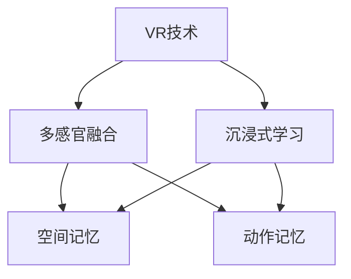

                 

# 认知科学与虚拟现实：沉浸式学习体验

## 1. 背景介绍

### 1.1 问题由来
近年来，随着科技的飞速发展和教育需求的多样化，虚拟现实(VR)技术逐渐成为教育领域的一个重要方向。VR技术以其沉浸式体验和高度交互性，能够在学习过程中为学生提供更丰富、更直观的知识获取方式。特别是在传统教育模式难以满足需求的领域，如物理化学实验、地理历史教学等，VR技术发挥了重要作用。

与此同时，认知科学(Cognitive Science)作为研究人类思维、学习、记忆等心理过程的交叉学科，对于理解人类如何学习知识，以及如何通过技术手段辅助学习，具有重要意义。将VR技术与认知科学相结合，可以为学习者提供全新的沉浸式学习体验，从而提高学习效率和效果。

### 1.2 问题核心关键点
本文章聚焦于认知科学与虚拟现实技术的融合，即如何通过VR技术实现沉浸式学习体验，并结合认知科学原理提升学习效果。核心问题包括：
1. 如何利用VR技术创造沉浸式学习环境？
2. 如何根据认知科学原理设计有效的学习体验？
3. 如何评估和优化沉浸式学习效果？

## 2. 核心概念与联系

### 2.1 核心概念概述

为了更好地理解VR技术在沉浸式学习中的应用，本节将介绍几个密切相关的核心概念：

- 虚拟现实(VR)：通过计算机生成的三维虚拟环境，结合头戴设备、手柄等交互设备，使用户能够沉浸在虚拟世界中。
- 沉浸式学习(Immersive Learning)：通过虚拟环境创造高度沉浸的体验，使得学习者在虚拟世界中通过感知、操作、互动等方式获取知识和技能。
- 认知科学(Cognitive Science)：研究人类认知过程的学科，包括感知、记忆、注意力、情感等方面，旨在揭示人类学习和认知的机制。
- 空间记忆(Spatial Memory)：指在空间中定位、识别和回忆物体位置的能力，对于导航和复杂任务的学习至关重要。
- 多感官融合(Multisensory Integration)：结合视觉、听觉、触觉等多种感官信息，提高信息处理的效率和准确性。
- 动作记忆(Motor Memory)：指对动作技能的学习和记忆，如操作VR手柄、控制虚拟对象等。

这些概念之间的逻辑关系可以通过以下Mermaid流程图来展示：



这个流程图展示了几类概念之间的关系：

1. VR技术提供沉浸式体验的基础。
2. 多感官融合是创造沉浸式学习环境的关键。
3. 空间记忆和动作记忆是沉浸式学习的主要内容。
4. 认知科学原理指导着多感官融合、空间记忆和动作记忆的设计和优化。

## 3. 核心算法原理 & 具体操作步骤
### 3.1 算法原理概述

基于认知科学的沉浸式学习体验设计，一般遵循以下算法原理：

1. **多感官融合算法**：通过捕捉学习者的视觉、听觉、触觉等多种感官信息，构建一个多感官融合的环境。
2. **空间记忆算法**：利用空间记忆原理，设计虚拟环境中物体的空间分布和关系，帮助学习者构建和回忆空间信息。
3. **动作记忆算法**：结合认知科学的动作记忆理论，设计虚拟环境中的交互操作，使学习者能够熟练掌握特定动作技能。
4. **学习效果评估算法**：根据认知科学的学习效果评估模型，对沉浸式学习过程进行持续监测和反馈，及时调整学习策略。

### 3.2 算法步骤详解

1. **多感官融合数据采集**：
   - 使用传感器捕捉学习者的视觉数据，包括头位追踪、眼球追踪等。
   - 通过耳机捕捉学习者的听觉反馈，包括环境声音、语音命令等。
   - 利用手柄等交互设备捕捉学习者的触觉反馈，包括手柄的位置和压力变化等。

2. **虚拟环境构建**：
   - 根据学习内容设计虚拟场景，如化学实验台、物理机械、历史建筑等。
   - 使用三维建模软件创建虚拟环境，确保其真实性和互动性。
   - 引入视觉特效、声音效果、触觉反馈等，增强沉浸感。

3. **空间记忆设计**：
   - 在虚拟环境中设置标志性物体和路径，帮助学习者构建空间记忆。
   - 通过定位游戏、空间导航任务等方式，训练学习者的空间记忆能力。
   - 利用空间记忆算法，对学习者的空间记忆进行监测和反馈。

4. **动作技能训练**：
   - 设计虚拟环境中的交互操作，如拖动、旋转、点击等。
   - 提供任务和挑战，如组装模型、操作机械等，训练学习者的动作记忆。
   - 使用动作记忆算法，评估和优化学习者的动作技能水平。

5. **学习效果评估**：
   - 设定评估指标，如知识掌握程度、空间导航能力、动作技能熟练度等。
   - 通过问卷调查、心理测试等方式，收集学习者的反馈和感受。
   - 结合认知科学的学习效果评估模型，对学习过程进行持续监测和优化。

### 3.3 算法优缺点

基于认知科学的沉浸式学习体验设计，具有以下优点：

1. **高度沉浸性**：通过多感官融合，创造高度沉浸的虚拟学习环境，增强学习者的参与感和体验感。
2. **高效学习**：利用空间记忆和动作记忆原理，帮助学习者更有效地获取和记忆知识。
3. **个性化学习**：根据学习者的反馈和评估结果，动态调整学习内容和难度，提供个性化的学习体验。
4. **安全环境**：虚拟环境可以模拟真实世界的各种场景，降低学习者面对真实危险的风险。

同时，该算法也存在一定的局限性：

1. **技术成本高**：虚拟现实设备和技术，如头戴设备和空间定位系统，成本较高，难以普及。
2. **技术依赖强**：学习效果高度依赖于VR设备和技术的稳定性和准确性，难以应对设备故障或技术缺陷。
3. **学习深度有限**：虽然沉浸式学习体验可以加深对特定技能的掌握，但对复杂知识和理论的理解仍需传统教育方式辅助。
4. **学习动机不足**：虚拟环境中的互动和反馈可能不够自然，难以激发学习者的内在动机和兴趣。
5. **社会互动少**：学习者主要通过个人互动与虚拟环境互动，缺乏真实社会环境中的社交互动。

尽管存在这些局限性，但就目前而言，基于认知科学的沉浸式学习体验设计仍然是大势所趋。随着技术的不断进步和成本的逐渐降低，相信VR技术将更广泛地应用于教育领域，推动学习方式的革新。

### 3.4 算法应用领域

基于认知科学的沉浸式学习体验设计，在多个领域中已经得到了广泛应用，例如：

- **教育培训**：在科学、医学、工程等专业培训中，通过虚拟环境模拟复杂操作和环境，提高学习效果。
- **游戏与娱乐**：在电子游戏中引入虚拟现实技术，提供沉浸式游戏体验，增强互动性和趣味性。
- **医疗健康**：通过虚拟现实技术进行手术模拟、心理治疗等，帮助学习者掌握复杂的医疗技能。
- **工业培训**：在工业制造、航空航天等领域，利用虚拟现实技术进行设备操作、紧急情况演练等培训。
- **虚拟旅游**：通过虚拟现实技术，提供逼真的旅游体验，让学习者在家中即可体验全球各地的名胜古迹。

除了这些传统应用外，VR技术在虚拟课程、虚拟实验室、虚拟博物馆等领域的应用，也为学习者提供了全新的沉浸式学习体验。随着技术的进一步成熟，相信VR技术将更多地融入教育体系，成为推动学习方式变革的重要力量。

## 4. 数学模型和公式 & 详细讲解 & 举例说明

### 4.1 数学模型构建

在认知科学的沉浸式学习体验设计中，数学模型主要涉及感知、记忆和行为等领域。以空间记忆为例，我们可以使用以下数学模型进行描述：

设学习者在虚拟环境中的位置为 $(x, y, z)$，目标位置为 $(x_0, y_0, z_0)$。学习者需要回忆和定位目标位置，可以通过以下数学模型计算：

$$
\min_{(x', y', z')} \|(x', y', z') - (x_0, y_0, z_0)\|^2
$$

其中 $\|(x', y', z') - (x_0, y_0, z_0)\|^2$ 表示位置误差，通过最小化该误差，帮助学习者回忆和定位目标位置。

### 4.2 公式推导过程

在上述空间记忆模型中，最小化位置误差的公式为：

$$
\min_{(x', y', z')} \frac{1}{2}((x' - x_0)^2 + (y' - y_0)^2 + (z' - z_0)^2)
$$

这是一个标准的欧式距离最小化问题。通过梯度下降等优化算法，可以求解出学习者的最优位置 $(x', y', z')$，从而实现目标位置的定位和回忆。

### 4.3 案例分析与讲解

以虚拟化学实验为例，结合空间记忆和动作记忆，设计一个沉浸式学习体验：

1. **空间记忆设计**：
   - 在虚拟实验室中设置实验台、仪器、试剂瓶等标志性物体。
   - 利用三维建模软件创建实验台和仪器的三维模型，确保其真实性和互动性。
   - 通过任务描述和可视化提示，帮助学习者记忆实验台和仪器的空间分布。

2. **动作记忆设计**：
   - 设计虚拟实验中需要进行的操作，如取试剂、调节仪器、测量数据等。
   - 提供任务和挑战，如配制溶液、检测pH值等，训练学习者的动作记忆。
   - 使用动作记忆算法，评估和优化学习者的动作技能水平。

3. **学习效果评估**：
   - 设定评估指标，如实验步骤的正确率、实验结果的准确性等。
   - 通过问卷调查、心理测试等方式，收集学习者的反馈和感受。
   - 结合认知科学的学习效果评估模型，对学习过程进行持续监测和优化。

## 5. 项目实践：代码实例和详细解释说明

### 5.1 开发环境搭建

在进行沉浸式学习体验开发前，我们需要准备好开发环境。以下是使用Python进行Unity开发的环境配置流程：

1. 安装Unity Hub：从官网下载并安装Unity Hub，用于创建和管理Unity项目。
2. 创建并激活Unity账户：注册并登录Unity账户，创建新的Unity项目。
3. 安装Unity编辑器：在Unity Hub中选择要安装的Unity编辑器版本，进行安装。
4. 配置VR插件：在Unity编辑器中，安装和配置VR插件，如XR Interaction Toolkit、VR SDK等。
5. 安装其他工具包：安装Unity自带的工具包，如Physics SDK、Physics XR、Physics Animation等，用于模拟物理行为。

完成上述步骤后，即可在Unity中开始沉浸式学习体验的开发。

### 5.2 源代码详细实现

这里我们以一个简单的虚拟实验室为例，给出使用Unity和C#语言进行沉浸式学习体验的代码实现。

首先，定义虚拟实验室的架构：

```csharp
using UnityEngine;
using UnityEngine.XR.Interaction.Toolkit;

public class LabLayout : MonoBehaviour
{
    public GameObject labTable;
    public GameObject labInstrument;
    public GameObject labReagent;

    void Start()
    {
        // 初始化虚拟实验室
        labTable.SetActive(true);
        labInstrument.SetActive(true);
        labReagent.SetActive(true);
    }
}
```

然后，定义虚拟实验室中的交互操作：

```csharp
using UnityEngine;
using UnityEngine.XR.Interaction.Toolkit;

public class LabInteraction : MonoBehaviour
{
    public GameObject labTable;
    public GameObject labInstrument;
    public GameObject labReagent;

    private void Update()
    {
        // 处理用户交互
        if (Input.GetMouseButtonDown(0))
        {
            // 取试剂
            labReagent.SetActive(true);
        }

        // 调节仪器
        if (Input.GetMouseButtonDown(1))
        {
            labInstrument.SetActive(true);
        }

        // 测量数据
        if (Input.GetMouseButtonDown(2))
        {
            labTable.SetActive(false);
        }
    }
}
```

最后，使用VR SDK和Unity提供的物理引擎，实现虚拟实验室中的空间定位和交互效果：

```csharp
using UnityEngine;
using UnityEngine.XR.Interaction.Toolkit;
using UnityEngine.Physics;
using UnityEngine.PhysicsXR;

public class LabSimulation : MonoBehaviour
{
    public GameObject labTable;
    public GameObject labInstrument;
    public GameObject labReagent;

    void Update()
    {
        // 处理空间定位
        if (PhysicsXR.isMoving)
        {
            // 根据头位追踪定位虚拟实验室
            labTable.transform.position = Camera.main.transform.position;
            labInstrument.transform.position = labTable.transform.position;
            labReagent.transform.position = labInstrument.transform.position;
        }

        // 处理交互操作
        if (Input.GetMouseButtonDown(0))
        {
            // 取试剂
            labReagent.SetActive(true);
        }

        if (Input.GetMouseButtonDown(1))
        {
            // 调节仪器
            labInstrument.SetActive(true);
        }

        if (Input.GetMouseButtonDown(2))
        {
            // 测量数据
            labTable.SetActive(false);
        }
    }
}
```

### 5.3 代码解读与分析

让我们再详细解读一下关键代码的实现细节：

**LabLayout类**：
- `Start`方法：初始化虚拟实验室，将各个组件设置为可见状态。

**LabInteraction类**：
- `Update`方法：处理用户的鼠标交互操作，模拟取试剂、调节仪器和测量数据等动作。

**LabSimulation类**：
- `Update`方法：处理空间定位和交互操作，利用XR SDK和Unity物理引擎实现虚拟实验室的沉浸式体验。

可以看到，Unity和C#语言的结合，使得沉浸式学习体验的开发变得简洁高效。开发者可以将更多精力放在交互设计、物理模拟等高层逻辑上，而不必过多关注底层实现细节。

当然，工业级的系统实现还需考虑更多因素，如用户界面的友好性、数据可视化、动画效果等。但核心的沉浸式体验设计基本与此类似。

## 6. 实际应用场景

### 6.1 教育培训

基于VR技术的沉浸式学习体验，可以在教育培训中发挥巨大作用。传统的教学方式难以提供复杂的实验和操作训练，而VR技术能够创造逼真的学习环境，提高学习效果。

在实际应用中，可以设计虚拟实验室、虚拟手术室、虚拟驾驶等场景，使学习者能够在虚拟环境中进行实验、手术、驾驶等操作。结合空间记忆和动作记忆的训练，学习者可以更快地掌握相关知识和技能。

### 6.2 游戏与娱乐

VR技术在游戏与娱乐领域已得到广泛应用，如《Beat Saber》、《Oculus Quest》等。通过沉浸式学习体验，玩家可以在虚拟环境中进行舞蹈、音乐等活动，提高游戏沉浸感和趣味性。

在游戏设计中，可以引入认知科学的原理，通过虚拟环境的互动和反馈，引导玩家进行深度学习和记忆。例如，设计虚拟实验室中的化学实验、历史事件重现等，让玩家在游戏过程中学习知识和技能。

### 6.3 医疗健康

VR技术在医疗健康领域也有广泛应用，如手术模拟、心理治疗等。通过沉浸式学习体验，医疗专业人员可以在虚拟环境中进行手术训练，提高手术技能。

在虚拟环境中，可以设计逼真的手术操作场景，学习者可以在虚拟环境中进行手术模拟，通过空间记忆和动作记忆的训练，掌握复杂的手术技能。此外，还可以通过虚拟心理治疗等方式，帮助患者进行心理调适和治疗。

### 6.4 工业培训

在工业制造、航空航天等领域，VR技术可以用于员工培训和设备操作演练。通过沉浸式学习体验，员工可以在虚拟环境中进行设备操作、紧急情况演练等，提高工作效率和安全性。

例如，在工业制造中，可以设计虚拟工厂环境，员工可以在虚拟环境中进行设备操作、流程管理等训练，提高操作技能和应急响应能力。

### 6.5 虚拟旅游

虚拟现实技术可以为旅游爱好者提供全新的旅游体验，通过沉浸式学习体验，学习者可以在家中体验全球各地的名胜古迹。

例如，在虚拟博物馆中，学习者可以通过空间记忆和动作记忆，快速回忆和定位各个展品的地理位置和相关信息，提高参观体验。

## 7. 工具和资源推荐

### 7.1 学习资源推荐

为了帮助开发者系统掌握虚拟现实技术在沉浸式学习中的应用，这里推荐一些优质的学习资源：

1. Unity官方文档：Unity提供的官方文档，详细介绍了Unity的游戏开发和VR应用，包括基础知识、工具使用、案例实践等。
2. Oculus Developer Guide：Oculus官方文档，提供了Oculus Rift和Oculus Quest等VR设备的开发指南和示例代码。
3. Unity Asset Store：Unity官方的资产市场，提供了大量高质量的VR插件和资源，方便开发者快速上手。
4. Google Cardboard SDK：Google提供的虚拟现实开发SDK，支持Android设备，适合移动端VR应用开发。
5. ARKit和ARCore：苹果和谷歌提供的增强现实SDK，支持iOS和Android设备，适合结合虚拟现实技术的开发。

通过对这些资源的学习实践，相信你一定能够快速掌握虚拟现实技术在沉浸式学习中的应用，并用于解决实际的VR应用问题。

### 7.2 开发工具推荐

高效的开发离不开优秀的工具支持。以下是几款用于虚拟现实开发常用的工具：

1. Unity：由Unity Technologies开发的游戏引擎，支持VR、AR等增强现实应用开发，提供了强大的物理引擎和脚本语言。
2. Unreal Engine：由Epic Games开发的游戏引擎，支持VR、AR等增强现实应用开发，提供了高性能的渲染引擎和可视化编辑器。
3. Blender：开源的三维建模和动画软件，支持多种文件格式，适用于创建虚拟环境的三维模型。
4. Maya和3ds Max：专业级的三维建模软件，适用于复杂的三维建模和动画设计。
5. HMD头盔：如Oculus Rift、HTC Vive、Samsung Gear VR等，是虚拟现实应用开发的基础硬件设备。

合理利用这些工具，可以显著提升虚拟现实应用的开发效率，加快创新迭代的步伐。

### 7.3 相关论文推荐

虚拟现实技术和沉浸式学习体验的发展源于学界的持续研究。以下是几篇奠基性的相关论文，推荐阅读：

1. Pliant et al., "Virtual reality and virtual lab training of biomedical students: A systematic review" (2019)：总结了VR技术在生物医学学生培训中的应用效果，提供了大量案例和数据支持。
2. Heinrich et al., "Virtual Reality in Spatial Navigation and Orientation" (2018)：研究了VR技术对空间记忆和导航的影响，提供了丰富的实验结果和理论分析。
3. Thalib et al., "Virtual reality in medical education: A systematic review and meta-analysis" (2021)：综述了VR技术在医学教育中的应用效果，提供了多维度的数据和分析。
4. Jain et al., "A review of virtual reality-based training in the healthcare domain" (2017)：总结了VR技术在医疗健康领域的应用效果，提供了多个实际案例和效果评估。
5. Suri et al., "Enhancing training in urology using virtual reality" (2018)：研究了VR技术在泌尿外科手术培训中的应用，提供了丰富的实验结果和实际数据。

这些论文代表了大规模虚拟现实和沉浸式学习体验的研究进展，通过学习这些前沿成果，可以帮助研究者把握学科前进方向，激发更多的创新灵感。

## 8. 总结：未来发展趋势与挑战

### 8.1 总结

本文对虚拟现实技术在沉浸式学习体验中的应用进行了全面系统的介绍。首先阐述了虚拟现实技术在教育、游戏、医疗等领域的重要作用，明确了沉浸式学习体验在提升学习效果方面的独特价值。其次，从原理到实践，详细讲解了基于认知科学的沉浸式学习体验设计，提供了完整的代码实例和实现细节。同时，本文还广泛探讨了沉浸式学习体验在多个领域的应用前景，展示了其巨大的潜力。

通过本文的系统梳理，可以看到，虚拟现实技术和沉浸式学习体验的结合，为学习者提供了全新的沉浸式学习体验，显著提高了学习效率和效果。未来，伴随VR技术的不断进步和成本的逐渐降低，沉浸式学习体验将更多地融入教育体系，成为推动学习方式变革的重要力量。

### 8.2 未来发展趋势

展望未来，虚拟现实技术在沉浸式学习体验中的应用将呈现以下几个发展趋势：

1. **普及率提升**：随着技术的不断进步和硬件成本的降低，VR设备的普及率将大幅提升，使得沉浸式学习体验更加广泛应用。
2. **多感官融合增强**：结合视觉、听觉、触觉等多种感官信息，提高学习体验的沉浸感和互动性。
3. **个性化学习深化**：根据学习者的反馈和评估结果，动态调整学习内容和难度，提供个性化的学习体验。
4. **交互体验优化**：利用自然语言处理和动作捕捉技术，增强交互的自然性和流畅性。
5. **内容创新多样化**：结合虚拟现实技术，创作更多形式丰富、内容多样的学习内容，如虚拟实验、虚拟旅行、虚拟演出等。

以上趋势凸显了虚拟现实技术在沉浸式学习体验中的广阔前景。这些方向的探索发展，必将进一步提升学习效果和体验，为教育方式的变革带来新的契机。

### 8.3 面临的挑战

尽管虚拟现实技术在沉浸式学习体验中的应用已经取得了瞩目成就，但在迈向更加智能化、普适化应用的过程中，它仍面临着诸多挑战：

1. **技术瓶颈**：虚拟现实技术还存在一些技术瓶颈，如设备延迟、渲染效率、互动自然性等，需要进一步优化和改进。
2. **成本高昂**：VR设备和高性能计算机硬件的成本较高，可能限制了其普及和应用。
3. **用户体验不足**：虚拟环境中的互动和反馈可能不够自然，难以激发学习者的内在动机和兴趣。
4. **数据隐私问题**：VR设备通常会采集大量的用户数据，如何保护用户隐私和数据安全，是一大挑战。
5. **内容质量参差不齐**：现有的VR教育内容质量参差不齐，缺乏统一标准和质量保证。

尽管存在这些挑战，但虚拟现实技术的潜力巨大，未来仍有很大的发展空间。通过不断攻克技术难题，提高设备性能和用户体验，VR技术将更广泛地应用于教育领域，推动学习方式的革新。

### 8.4 研究展望

面对虚拟现实技术在沉浸式学习体验中所面临的挑战，未来的研究需要在以下几个方面寻求新的突破：

1. **技术优化**：优化虚拟现实设备的性能和用户体验，提升设备的渲染效率和互动自然性。
2. **成本控制**：降低VR设备和高性能计算机硬件的成本，使其更加普及和亲民。
3. **内容创新**：创作更多高质量、多样化的VR教育内容，提供丰富的学习体验和资源。
4. **用户驱动**：引入用户反馈机制，动态调整学习内容和难度，提供个性化的学习体验。
5. **隐私保护**：加强数据隐私保护和用户权益保护，建立数据使用的伦理规范。

这些研究方向的探索，必将引领虚拟现实技术在沉浸式学习体验中的应用进入新的发展阶段，为教育方式的变革提供新的思路和方法。总之，虚拟现实技术需要从技术、内容、用户、伦理等多个维度协同发力，才能真正实现沉浸式学习体验的普及和应用。

## 9. 附录：常见问题与解答

**Q1：虚拟现实技术是否适用于所有学习场景？**

A: 虚拟现实技术在大部分学习场景中都能发挥作用，特别是对于复杂操作、实验模拟等场景。但对于一些需要面对面互动、社会交往的学习场景，如团队合作、社交技能训练等，仍然需要传统教育方式进行补充。

**Q2：如何设计高质量的虚拟现实学习内容？**

A: 高质量的虚拟现实学习内容需要遵循以下原则：
1. **真实性**：虚拟环境应尽可能真实，模拟实际的学习场景和操作环境。
2. **互动性**：设计交互式任务和挑战，使学习者能够积极参与和互动。
3. **多样性**：提供多样化的学习任务和挑战，满足不同学习者的需求。
4. **反馈性**：提供及时的反馈和指导，帮助学习者纠正错误和提高技能。
5. **可扩展性**：内容应具有可扩展性，能够根据学习者的进度和反馈进行动态调整。

**Q3：虚拟现实技术如何提高学习效率？**

A: 虚拟现实技术通过以下方式提高学习效率：
1. **沉浸式体验**：通过多感官融合和空间记忆，创造高度沉浸的学习环境，提高学习者的参与感和体验感。
2. **互动式学习**：通过交互式任务和挑战，使学习者能够在实践中掌握知识和技能。
3. **个性化学习**：根据学习者的反馈和评估结果，动态调整学习内容和难度，提供个性化的学习体验。
4. **反复练习**：通过反复练习和模拟操作，帮助学习者掌握复杂的操作技能和知识。

**Q4：虚拟现实技术有哪些局限性？**

A: 虚拟现实技术在沉浸式学习体验中仍存在以下局限性：
1. **技术瓶颈**：虚拟现实设备和高性能计算机硬件的成本较高，可能限制了其普及和应用。
2. **用户体验不足**：虚拟环境中的互动和反馈可能不够自然，难以激发学习者的内在动机和兴趣。
3. **数据隐私问题**：VR设备通常会采集大量的用户数据，如何保护用户隐私和数据安全，是一大挑战。
4. **内容质量参差不齐**：现有的VR教育内容质量参差不齐，缺乏统一标准和质量保证。

尽管存在这些局限性，但虚拟现实技术的潜力巨大，未来仍有很大的发展空间。通过不断攻克技术难题，提高设备性能和用户体验，VR技术将更广泛地应用于教育领域，推动学习方式的革新。

**Q5：如何评估虚拟现实学习效果？**

A: 评估虚拟现实学习效果需要结合认知科学的学习效果评估模型，主要包括以下指标：
1. **知识掌握程度**：通过测试题和问卷调查，评估学习者对知识的掌握程度。
2. **技能熟练度**：通过模拟操作和任务挑战，评估学习者对技能的熟练程度。
3. **空间导航能力**：通过虚拟环境的导航任务，评估学习者的空间记忆和导航能力。
4. **学习动机**：通过心理测试和访谈，评估学习者的内在动机和兴趣。
5. **体验满意度**：通过问卷调查和反馈，评估学习者对虚拟环境的满意度和体验感。

通过对这些指标的评估，可以全面了解虚拟现实学习效果，发现问题和不足，并进行针对性的优化和改进。

---

作者：禅与计算机程序设计艺术 / Zen and the Art of Computer Programming

