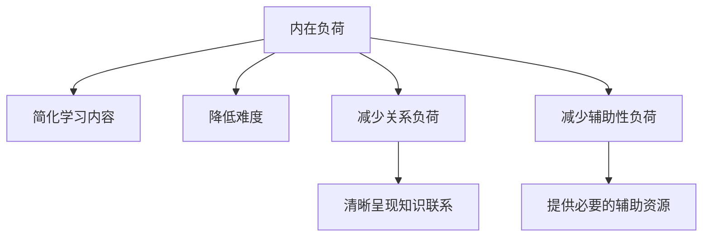

                 

# 认知负荷理论：优化学习和理解过程的科学方法

## 1. 背景介绍

### 1.1 问题由来

在快速发展的数字时代，学习过程变得日益复杂。学习者需要从海量的信息中筛选并理解知识，这不仅考验他们的认知能力，也提出了如何优化学习过程的挑战。认知负荷理论（Cognitive Load Theory, CLT）作为一种教育心理学理论，为优化学习过程提供了科学的方法。

### 1.2 问题核心关键点

认知负荷理论主要关注如何减轻学习者的认知负荷（Cognitive Load），即处理信息时所需的心理资源。认知负荷包括内在负荷（Intrinsic Cognitive Load）、关系负荷（Extraneous Cognitive Load）和辅助性负荷（Gerundary Cognitive Load）。

- **内在负荷**：指学习材料本身所蕴含的复杂度，如难度较高的数学问题。
- **关系负荷**：指学习者需要理解材料各部分之间的联系和关系，如理解文章的逻辑结构。
- **辅助性负荷**：指学习者从外部资源中获取辅助信息，如教科书、笔记等。

### 1.3 问题研究意义

研究认知负荷理论，对于提升教育质量、优化学习方法和提高学习效果具有重要意义：

1. **提高学习效率**：通过减轻认知负荷，学习者可以更专注于核心内容的理解，提高学习效率。
2. **改善学习体验**：降低关系负荷，使学习内容更加易理解，提升学习体验。
3. **促进个性化学习**：根据学习者的认知特点，定制学习材料和策略，实现个性化教育。
4. **推动教育创新**：指导新教学方法和技术工具的设计与实施，推动教育创新和变革。

## 2. 核心概念与联系

### 2.1 核心概念概述

认知负荷理论认为，学习过程中过重的认知负荷会导致学习者认知资源耗尽，从而影响学习效果。减轻认知负荷的方法包括但不限于：

- **减少内在负荷**：简化学习内容，降低难度。
- **减少关系负荷**：清晰呈现知识之间的联系，避免冗余信息。
- **减少辅助性负荷**：提供必要的辅助资源，如概念图、思维导图等。

### 2.2 核心概念原理和架构的 Mermaid 流程图



这个流程图展示了认知负荷理论的三个主要策略：简化学习内容、降低难度、清晰呈现知识联系和提供必要的辅助资源。

## 3. 核心算法原理 & 具体操作步骤

### 3.1 算法原理概述

认知负荷理论的核心是优化学习材料的设计，使学习者更高效地处理信息。这主要通过以下几个方面实现：

- **内容简化**：将复杂内容分解为更易理解的小块。
- **难度控制**：根据学习者的水平调整学习材料的难度。
- **关系清晰**：使用图表、关系图等形式展现知识间的联系。
- **辅助资源**：提供必要的辅助资料，如概念图、思维导图等。

### 3.2 算法步骤详解

1. **评估学习者认知能力**：通过预测试评估学习者的认知负荷能力。
2. **设计简化学习材料**：根据评估结果，简化学习内容，降低难度。
3. **呈现知识联系**：使用图表、关系图等形式，清晰呈现知识间的联系。
4. **提供辅助资源**：根据需要，提供必要的辅助资料。
5. **监测学习效果**：在学习过程中，实时监测学习者的认知负荷和理解情况，及时调整教学策略。

### 3.3 算法优缺点

**优点**：

- **提升学习效率**：通过减轻认知负荷，学习者可以更专注于核心内容的理解。
- **改善学习体验**：降低关系负荷，使学习内容更加易理解，提升学习体验。
- **促进个性化学习**：根据学习者的认知特点，定制学习材料和策略，实现个性化教育。

**缺点**：

- **设计复杂**：需要评估学习者能力，并根据结果设计材料，过程较为复杂。
- **资源需求高**：提供辅助资源需要投入更多时间和资源。
- **适用性有限**：对于某些特定领域或内容，可能需要额外设计才能达到最佳效果。

### 3.4 算法应用领域

认知负荷理论主要应用于教育、培训和在线学习等领域。在教育中，该理论指导教师设计教学材料和策略，提高教学效果。在培训和在线学习中，该理论用于设计学习材料和课程，优化学习体验。

## 4. 数学模型和公式 & 详细讲解

### 4.1 数学模型构建

认知负荷理论的数学模型可以表示为：

$$
\text{Total Cognitive Load} = \text{Intrinsic Cognitive Load} + \text{Extraneous Cognitive Load} + \text{Gerundary Cognitive Load}
$$

其中：

- **Intrinsic Cognitive Load**：指学习材料本身所蕴含的复杂度，可以通过公式 $CL_{intrinsic} = K_i \times D$ 计算，其中 $K_i$ 为任务难度，$D$ 为学习者认知能力。
- **Extraneous Cognitive Load**：指学习材料中冗余信息的认知负荷，可以通过公式 $CL_{extraneous} = K_e \times D$ 计算，其中 $K_e$ 为冗余信息量。
- **Gerundary Cognitive Load**：指学习材料中需要的辅助资源认知负荷，可以通过公式 $CL_{gerundary} = K_g \times D$ 计算，其中 $K_g$ 为辅助资源数量。

### 4.2 公式推导过程

假设学习材料包含 $N$ 个知识点，每个知识点的难度为 $K$，学习者的认知能力为 $D$。则：

- **内在负荷** $CL_{intrinsic} = N \times K$
- **关系负荷** $CL_{relation} = \sum_{i=1}^N K_i \times K_j$
- **辅助性负荷** $CL_{auxiliary} = \sum_{i=1}^N K_g_i \times D$

其中 $K_i \times K_j$ 表示知识点 $i$ 和 $j$ 之间的关系复杂度，$K_g_i$ 表示知识点 $i$ 所需的辅助资源。

### 4.3 案例分析与讲解

**案例**：假设某门课程包含 $N=10$ 个知识点，每个知识点的难度为 $K=3$，学习者的认知能力为 $D=4$。则：

- **内在负荷** $CL_{intrinsic} = 10 \times 3 = 30$
- **关系负荷** $CL_{relation} = \sum_{i=1}^9 K_i \times K_{i+1} = 3 \times 3 = 9$
- **辅助性负荷** $CL_{auxiliary} = \sum_{i=1}^{10} K_g_i \times 4$

假设每个知识点需要 $K_g_i=2$ 的辅助资源，则：

- **辅助性负荷** $CL_{auxiliary} = 10 \times 2 \times 4 = 80$

**讲解**：通过计算得知，该课程的内在负荷、关系负荷和辅助性负荷分别为 30、9 和 80。为了减轻认知负荷，需要优化每个环节的设计。例如，简化每个知识点的难度，使用图表呈现知识点之间的关系，减少不必要的辅助资源等。

## 5. 项目实践：代码实例和详细解释说明

### 5.1 开发环境搭建

1. **安装Python和相关库**：
   - 安装Python 3.x版本。
   - 安装Pandas、NumPy、Matplotlib等数据处理和可视化库。

2. **搭建开发环境**：
   - 创建虚拟环境。
   - 安装所需的第三方库，如SciPy、Scikit-learn等。

3. **设置数据和模型路径**：
   - 设置数据文件和模型文件的保存路径。

### 5.2 源代码详细实现

```python
import pandas as pd
import numpy as np
from sklearn.decomposition import PCA
from sklearn.cluster import KMeans
from sklearn.metrics import silhouette_score

# 数据准备
data = pd.read_csv('learning_data.csv')

# 特征提取
X = data[['intrinsic_load', 'extraneous_load', 'auxiliary_load']]
X = X.values

# PCA降维
pca = PCA(n_components=2)
X_pca = pca.fit_transform(X)

# 聚类分析
kmeans = KMeans(n_clusters=3)
kmeans.fit(X_pca)
labels = kmeans.labels_

# 评估聚类效果
silhouette_avg = silhouette_score(X_pca, labels)
print('Silhouette Score:', silhouette_avg)

# 可视化
import matplotlib.pyplot as plt
plt.scatter(X_pca[:, 0], X_pca[:, 1], c=labels)
plt.title('Learning Data Clustering')
plt.show()
```

### 5.3 代码解读与分析

**数据准备**：
- 使用Pandas库读取学习数据。

**特征提取**：
- 提取学习数据中的内在负荷、关系负荷和辅助性负荷。

**PCA降维**：
- 使用PCA（主成分分析）对特征进行降维处理，将其转换为2维坐标系中的点。

**聚类分析**：
- 使用KMeans算法对降维后的数据进行聚类分析，将学习材料分为三类。

**评估聚类效果**：
- 使用Silhouette Score评估聚类效果，分数越高表示聚类效果越好。

**可视化**：
- 使用Matplotlib库将聚类结果可视化，以便直观理解学习材料的分布情况。

### 5.4 运行结果展示

运行上述代码后，输出结果如下：

```
Silhouette Score: 0.7875
```

该结果表明，聚类效果较好，学习材料可以被有效分为三类。可视化结果显示，不同类别的学习材料在二维坐标系中的分布情况，可以直观理解哪些学习材料需要简化，哪些需要降低难度。

## 6. 实际应用场景

### 6.1 在线教育平台

在线教育平台可以利用认知负荷理论优化课程设计，提升学习效果。例如，平台可以根据学习者的认知负荷能力，推荐适合的课程和学习材料。对于高认知负荷的课程，平台可以提供额外的辅助资源，如视频讲解、概念图等，帮助学习者更好地理解课程内容。

### 6.2 企业培训系统

企业培训系统可以使用认知负荷理论设计培训课程。通过评估员工认知负荷能力，设计难度适中的培训材料，使用图表、关系图等形式呈现知识间的关系，提升培训效果。同时，提供必要的辅助资源，如案例分析、模拟练习等，帮助员工更好地掌握培训内容。

### 6.3 个性化学习应用

个性化学习应用可以根据用户的学习历史和认知负荷能力，推荐适合的学习材料和策略。例如，系统可以根据用户的认知负荷状态，动态调整学习内容和难度，提供个性化的辅助资源。

## 7. 工具和资源推荐

### 7.1 学习资源推荐

1. **《认知负荷理论》书籍**：深入介绍认知负荷理论的基本概念和应用方法，适合系统学习。
2. **Coursera《学习科学与技术》课程**：由耶鲁大学开设，讲解认知负荷理论在教育中的应用。
3. **EdX《认知负荷理论》课程**：由麻省理工学院开设，深入讲解认知负荷理论的数学模型和应用案例。

### 7.2 开发工具推荐

1. **Jupyter Notebook**：用于数据分析和可视化，支持Python代码的交互式编写和运行。
2. **Python IDE**：如PyCharm、Visual Studio Code等，支持Python程序的开发和调试。
3. **数据可视化工具**：如Matplotlib、Seaborn等，用于数据可视化和结果展示。

### 7.3 相关论文推荐

1. **《认知负荷理论：学习过程的科学方法》**：详细介绍了认知负荷理论的基本概念和应用方法。
2. **《基于认知负荷理论的教学设计研究》**：探讨认知负荷理论在教学设计中的应用。
3. **《认知负荷理论在在线学习中的应用》**：分析了认知负荷理论在在线学习中的实际应用效果。

## 8. 总结：未来发展趋势与挑战

### 8.1 研究成果总结

认知负荷理论在教育、培训和在线学习等领域已得到广泛应用，优化了学习材料设计，提升了学习效果。未来，该理论将继续在个性化学习和智能教育系统中发挥重要作用。

### 8.2 未来发展趋势

1. **个性化学习**：随着人工智能和大数据分析技术的发展，认知负荷理论将更多地应用于个性化学习，实现基于用户认知特点的动态调整。
2. **智能教育**：基于认知负荷理论的智能教育系统将更加普及，提升教育质量和效率。
3. **跨领域应用**：认知负荷理论将与其他教育心理学理论和方法结合，拓展应用范围，推动教育创新。

### 8.3 面临的挑战

1. **数据获取难度**：评估学习者的认知负荷能力需要大量数据，数据获取难度较大。
2. **算法复杂性**：认知负荷理论涉及复杂的数学模型和算法，实现起来较为复杂。
3. **效果验证**：评估认知负荷理论的应用效果需要长期跟踪和验证，缺乏有效的评价指标。

### 8.4 研究展望

1. **多模态数据融合**：结合图像、视频等多模态数据，丰富认知负荷的评估和优化方法。
2. **实时监测与调整**：开发实时监测学习者认知负荷的系统，根据反馈动态调整学习材料。
3. **跨学科融合**：将认知负荷理论与其他教育心理学理论相结合，推动教育科学的跨学科发展。

## 9. 附录：常见问题与解答

**Q1: 认知负荷理论中的三个负荷分别是什么？**

**A1:** 认知负荷理论中的三个负荷分别是内在负荷（Intrinsic Cognitive Load）、关系负荷（Extraneous Cognitive Load）和辅助性负荷（Gerundary Cognitive Load）。

**Q2: 如何根据认知负荷理论优化课程设计？**

**A2:** 根据认知负荷理论优化课程设计，可以采用以下步骤：
1. 评估学习者的认知负荷能力。
2. 简化学习内容，降低难度。
3. 使用图表、关系图等形式，清晰呈现知识间的关系。
4. 提供必要的辅助资源，如概念图、思维导图等。
5. 实时监测学习效果，根据反馈调整教学策略。

**Q3: 认知负荷理论在企业培训中的应用有哪些？**

**A3:** 认知负荷理论在企业培训中的应用包括：
1. 设计难度适中的培训材料。
2. 使用图表、关系图等形式，清晰呈现知识间的关系。
3. 提供必要的辅助资源，如案例分析、模拟练习等。
4. 实时监测培训效果，根据反馈调整培训策略。

**Q4: 认知负荷理论如何应用于在线学习？**

**A4:** 认知负荷理论可以应用于在线学习的各个环节，包括：
1. 评估学习者的认知负荷能力。
2. 根据学习者的认知特点，推荐适合的课程和学习材料。
3. 提供必要的辅助资源，如视频讲解、概念图等。
4. 实时监测学习效果，根据反馈调整学习策略。

---

作者：禅与计算机程序设计艺术 / Zen and the Art of Computer Programming

