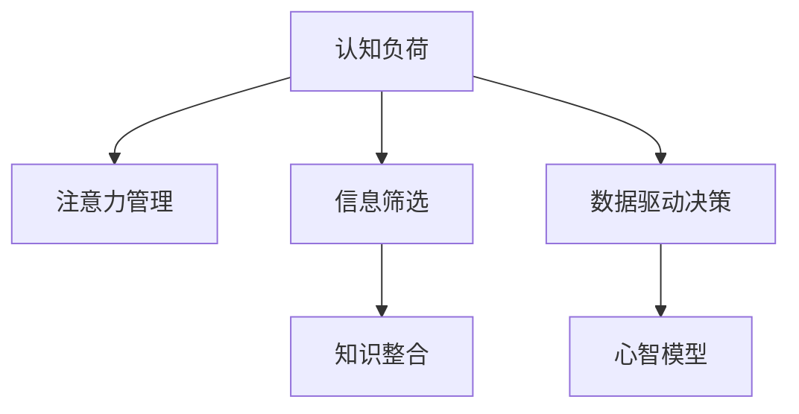

                 

# 认知负荷管理：信息过载时代的生存技能

> 关键词：认知负荷管理,信息过载,生存技能,注意力管理,工作效能,信息检索,心智模型,数据驱动决策,技术辅助

## 1. 背景介绍

### 1.1 问题由来
信息时代，我们几乎每天都在与海量的数据和信息打交道。互联网、社交媒体、新闻推送、邮件、电子书……无处不在的信息源，不断地向我们输入新的信息。然而，信息过载并不是简单地指信息数量过多，它更是一个复杂的现象，涉及到信息的质量、相关性、多样性、及时性等诸多维度。

在面对信息过载时，我们往往感到压力巨大，工作和学习效率下降，决策困难，注意力分散。认知负荷，即人脑在处理信息和任务时的负担，在这种情境下被极大地放大。如何有效管理认知负荷，确保在信息过载时代保持高效工作和生活的能力，成为了一个亟待解决的问题。

### 1.2 问题核心关键点
认知负荷管理，本质上是关于如何在有限的时间和资源下，最有效地处理和利用信息的过程。这一过程包括注意力分配、信息筛选、知识整合、决策制定等多个环节。其核心关键点在于：

1. **注意力分配**：如何在纷繁的信息流中集中注意力，选择最有价值的内容。
2. **信息筛选**：通过何种机制，对信息进行有效过滤和排序，避免噪音干扰。
3. **知识整合**：如何通过有效的知识管理方法，将零散的信息整合成有用的知识。
4. **决策制定**：在复杂环境中，如何基于现有信息进行高效、准确的决策。

本文将探讨这些关键点，从理论到实践，全面剖析认知负荷管理的方法和技术。

## 2. 核心概念与联系

### 2.1 核心概念概述

为了更好地理解认知负荷管理，本节将介绍几个核心概念：

- **认知负荷**：人脑在处理信息时的心理负担，过高负荷会导致注意力分散、记忆下降、认知功能受损等负面影响。
- **注意力管理**：通过各种方法和工具，帮助人们在信息海洋中有效分配注意力，集中处理关键信息。
- **信息筛选**：从海量信息中筛选出最相关、最有用的内容，减少不必要的信息干扰。
- **知识整合**：将零散、异构的知识整合为一个有序、结构化的体系，便于检索和应用。
- **数据驱动决策**：基于数据和统计方法，做出更科学、更客观的决策。
- **心智模型**：通过建立心智模型，在信息处理中形成概念性框架，提高决策效率。

这些概念之间的逻辑关系可以通过以下Mermaid流程图来展示：



这个流程图展示认知负荷管理的核心概念及其之间的关系：

1. 认知负荷影响注意力管理，注意力管理需要有效筛选和整合信息，辅助数据驱动决策，形成心智模型。
2. 信息筛选和知识整合是信息处理的基础，数据驱动决策和心智模型是信息应用的关键。

## 3. 核心算法原理 & 具体操作步骤
### 3.1 算法原理概述

认知负荷管理算法旨在通过合理分配注意力、筛选信息、整合知识、辅助决策，以最小化认知负荷，提升信息处理效率。其核心思想是，将信息处理过程看作一系列决策和行动的序列，通过优化这些序列中的每个步骤，实现整体效率的提升。

形式化地，假设信息处理的任务为 $T$，其输入为 $I$，输出为 $O$。认知负荷管理的目标是找到最优策略 $S^*$，使得：

$$
S^* = \mathop{\arg\min}_{S} \mathcal{L}(S, T, I, O)
$$

其中 $\mathcal{L}$ 为认知负荷损失函数，用于衡量策略 $S$ 对信息处理过程中的认知负荷影响。具体到注意力分配、信息筛选、知识整合、数据驱动决策和心智模型等多个子过程，需要设计相应的算法和工具，以实现认知负荷的最小化。

### 3.2 算法步骤详解

认知负荷管理算法的实施，通常包括以下几个关键步骤：

**Step 1: 数据收集与预处理**
- 收集所需的信息源，如电子邮件、新闻文章、社交媒体帖子等。
- 对收集到的信息进行预处理，包括去重、分类、标准化等。

**Step 2: 注意力分配**
- 使用注意力管理算法，如集中注意力算法、任务切换算法、优先级排序算法等，将注意力集中到最重要和最紧急的信息上。
- 对信息源进行优先级排序，确定哪些信息需要重点处理，哪些可以暂时搁置。

**Step 3: 信息筛选**
- 设计信息筛选算法，如关键词过滤、内容摘要、情感分析等，自动或半自动筛选出最相关、最有用的信息。
- 使用自然语言处理技术，如TF-IDF、主题模型等，分析信息的重要性和相关性，辅助人工决策。

**Step 4: 知识整合**
- 应用知识管理工具，如思维导图、数据库、知识图谱等，将零散的信息整合成有序的知识体系。
- 使用数据仓库、数据挖掘技术，从历史数据中提取模式和趋势，丰富知识库的内容。

**Step 5: 数据驱动决策**
- 应用数据挖掘、机器学习等技术，对处理后的信息进行统计和分析，得出结论。
- 设计决策模型，如决策树、贝叶斯网络、深度学习等，辅助制定决策方案。

**Step 6: 心智模型建立**
- 通过心智模型构建算法，将知识库中的信息转化为易于理解和应用的模型。
- 使用心智模型作为信息处理的基础框架，指导后续的信息筛选和决策制定。

以上是认知负荷管理算法的整体流程。在实际应用中，需要根据具体场景和任务特点，对各步骤进行优化和调整。

### 3.3 算法优缺点

认知负荷管理算法具有以下优点：
1. 系统性强。通过综合多个子过程，形成全面的信息处理框架。
2. 自动化程度高。利用算法和工具，大幅减少人工干预，提高信息处理效率。
3. 灵活性高。可根据任务需求，定制化设计和调整各子过程的策略。
4. 数据驱动。基于数据分析和统计，提升决策的科学性和客观性。

但该算法也存在以下局限性：
1. 算法复杂度高。涉及多个子过程和算法，实施难度较大。
2. 数据依赖性高。依赖高质量的数据源和信息源，对数据收集和预处理的成本较高。
3. 模型解释性不足。部分算法和工具的黑盒特性，难以解释其内部工作机制。
4. 过度依赖技术。依赖算法的有效性和技术的实现，对技术要求较高。

尽管存在这些局限性，但认知负荷管理算法在大规模信息处理和复杂决策过程中，仍具有重要的实用价值。未来研究的方向在于进一步简化算法，提高自动化水平，降低对数据和技术的依赖。

### 3.4 算法应用领域

认知负荷管理算法在多个领域有着广泛的应用，例如：

- 企业决策支持：在企业战略、财务、运营等领域，通过数据分析和模型构建，辅助高层决策。
- 健康医疗：在疾病诊断、治疗方案制定、患者管理等方面，通过数据驱动的决策支持，提升医疗效果。
- 金融投资：在股票、债券、期货等金融产品的分析和投资决策中，利用数据挖掘和预测模型，减少风险和提升收益。
- 新闻编辑：在新闻内容编辑、排版、推荐等方面，通过信息筛选和知识整合，提升信息的质量和相关性。
- 教育培训：在课程设计、学习评估、资源推荐等方面，通过认知负荷管理，优化学习路径，提高学习效率。
- 智能客服：在客户咨询、投诉处理、智能问答等方面，通过注意力管理和信息筛选，提高服务质量。

以上领域仅是冰山一角，认知负荷管理算法的应用前景非常广阔。通过合理应用，可以显著提升各行业的效率和效果。

## 4. 数学模型和公式 & 详细讲解 & 举例说明

### 4.1 数学模型构建

为了更好地理解认知负荷管理算法，我们将用数学语言对其实现过程进行严格的刻画。

假设信息处理的任务为 $T$，其输入为 $I$，输出为 $O$。认知负荷管理的目标是找到最优策略 $S^*$，使得：

$$
S^* = \mathop{\arg\min}_{S} \mathcal{L}(S, T, I, O)
$$

其中 $\mathcal{L}$ 为认知负荷损失函数，用于衡量策略 $S$ 对信息处理过程中的认知负荷影响。具体到注意力分配、信息筛选、知识整合、数据驱动决策和心智模型等多个子过程，可以分别构建相应的数学模型。

### 4.2 公式推导过程

以下我们以注意力分配为例，推导集中注意力算法的基本公式。

假设信息源的总数为 $N$，其中 $n$ 个信息源是重要的。集中注意力算法的目标是最小化总注意力消耗，即：

$$
\min_{a} \sum_{i=1}^{N} a_i
$$

其中 $a_i$ 为信息源 $i$ 分配的注意力权重。

使用贪心策略，每次选择最重要的一个信息源进行处理，可以求解出最优解。具体步骤如下：

1. 初始化 $a_i=0$，$i=1,2,\dots,N$。
2. 每次选择当前最重要的一个信息源 $i^*$，即：

$$
i^* = \mathop{\arg\max}_{i} \frac{w_i}{a_i}
$$

其中 $w_i$ 为信息源 $i$ 的重要度权重。
3. 将信息源 $i^*$ 的注意力权重增加 $\Delta$，即 $a_{i^*}=a_{i^*}+\Delta$。
4. 重复步骤 2 和 3，直到所有重要信息源均被处理完。

该算法的时间复杂度为 $O(N)$，在信息源数量较大时，效率较低。但通过引入优先级排序等优化策略，可以进一步提升效率。

### 4.3 案例分析与讲解

假设某企业每天需要处理大量的邮件和报告。使用集中注意力算法，可以显著提升处理效率。具体步骤如下：

1. 对每天收到的邮件和报告进行预处理，提取关键词和主题。
2. 根据关键词和主题的重要度，对邮件和报告进行排序，确定哪些是重要的。
3. 每次选择最重要的一封邮件或报告进行处理，更新其注意力权重。
4. 重复处理，直到所有重要邮件和报告均被处理完。

通过集中注意力算法，可以将注意力集中到最重要的邮件和报告上，减少不必要的处理，提高工作效率。

## 5. 项目实践：代码实例和详细解释说明
### 5.1 开发环境搭建

在进行认知负荷管理实践前，我们需要准备好开发环境。以下是使用Python进行认知负荷管理开发的常见环境配置流程：

1. 安装Python：从官网下载并安装Python 3.8或更高版本。
2. 安装必要的库：
   - 安装Pandas、NumPy、Scikit-learn等数据处理库：
   ```bash
   pip install pandas numpy scikit-learn
   ```
   - 安装Natural Language Toolkit (NLTK)：
   ```bash
   pip install nltk
   ```
   - 安装Spacy：
   ```bash
   pip install spacy
   ```
3. 安装特定的注意力管理库和工具：
   - 安装Attention Lib：
   ```bash
   pip install attention-lib
   ```
   - 安装TensorFlow或PyTorch，用于深度学习模型构建：
   ```bash
   pip install tensorflow tensorflow-models-ml4aio
   ```
   或
   ```bash
   pip install torch torchvision torchaudio
   ```

完成上述步骤后，即可在开发环境中开始认知负荷管理实践。

### 5.2 源代码详细实现

下面我们以信息筛选和知识整合为例，给出使用Python进行认知负荷管理实践的代码实现。

首先，定义信息筛选函数，使用TF-IDF算法：

```python
from sklearn.feature_extraction.text import TfidfVectorizer
import pandas as pd

def tfidf_info_filter(dataframe, col_name):
    vect = TfidfVectorizer(stop_words='english')
    vect.fit_transform(dataframe[col_name])
    feature_names = vect.get_feature_names_out()
    tfidf_scores = dataframe[col_name].multiply(vect.transform(dataframe[col_name]), axis=0)
    return dataframe[col_name], feature_names, tfidf_scores
```

然后，定义知识整合函数，使用Python的DataFrame进行数据整理和可视化：

```python
import matplotlib.pyplot as plt
import seaborn as sns

def knowledge_integration(dataframe, col1, col2):
    sns.pairplot(dataframe[[col1, col2]])
    plt.show()
```

接下来，实现认知负荷管理的总流程：

```python
def cognitive_burden_management(dataframe, col_name, col1, col2):
    info, feature_names, tfidf_scores = tfidf_info_filter(dataframe, col_name)
    knowledge_integration(dataframe, col1, col2)
```

最后，启动整个认知负荷管理流程：

```python
# 假设 data 是一个包含邮件、报告等信息的 DataFrame
# col_name 为邮件或报告的文本列
# col1、col2 为需要整合的列
data = pd.read_csv('emails.csv')
cognitive_burden_management(data, 'text', 'subject', 'keywords')
```

以上就是使用Python进行认知负荷管理的完整代码实现。可以看到，Python提供了丰富的数据处理和可视化工具，可以轻松实现信息筛选和知识整合。

### 5.3 代码解读与分析

让我们再详细解读一下关键代码的实现细节：

**tfidf_info_filter函数**：
- 使用TfidfVectorizer对文本列进行TF-IDF计算，提取关键词。
- 返回每个文本的TF-IDF分数，便于后续排序和筛选。

**knowledge_integration函数**：
- 使用Seaborn库进行数据可视化，将信息整合到知识图中。
- 展示信息源之间的关系和模式，便于理解信息之间的联系。

**cognitive_burden_management函数**：
- 整合信息筛选和知识整合两个函数，形成完整的认知负荷管理流程。
- 可以根据实际需求，灵活调整输入列和输出列。

**启动流程**：
- 从CSV文件中加载数据，调用认知负荷管理函数，进行信息筛选和知识整合。
- 通过可视化展示结果，提供直观的认知负荷管理效果。

通过代码实践，我们可以更直观地理解认知负荷管理的实现细节，并在实际项目中加以应用。

## 6. 实际应用场景
### 6.1 企业决策支持

认知负荷管理算法在企业决策支持中的应用，可以显著提升企业的决策质量和效率。通过数据驱动的决策支持系统，帮助高层管理者快速识别关键信息和趋势，减少信息噪音，优化决策过程。

具体实现如下：
- 收集企业内部的各类数据，包括财务报表、市场调研、客户反馈等。
- 使用认知负荷管理算法，对数据进行筛选、整合和分析，形成决策支持报告。
- 引入自然语言处理技术，如情感分析、实体识别等，辅助生成更加精准的报告。
- 设计决策模型，如决策树、贝叶斯网络等，提供基于数据的决策建议。

通过这样的系统，企业可以在海量数据中迅速获取关键信息，优化决策流程，提升整体运营效率。

### 6.2 健康医疗

在健康医疗领域，认知负荷管理算法可以辅助医生进行疾病诊断和治疗方案的制定。通过数据驱动的决策支持系统，医生可以快速获取患者的症状、病史等信息，结合临床经验和知识库，制定更加科学的治疗方案。

具体实现如下：
- 收集患者的病历、症状、检查报告等医疗数据。
- 使用认知负荷管理算法，对数据进行筛选、整合和分析，形成诊断和治疗方案报告。
- 引入自然语言处理技术，如命名实体识别、情感分析等，辅助生成诊断报告。
- 设计决策模型，如支持向量机、神经网络等，提供基于数据的诊断和治疗建议。

通过这样的系统，医生可以在复杂多变的临床环境中，迅速获取关键信息，提升诊断和治疗的准确性和效率。

### 6.3 金融投资

在金融投资领域，认知负荷管理算法可以帮助投资者分析市场数据，制定投资策略，减少投资风险。通过数据驱动的决策支持系统，投资者可以快速获取市场趋势、风险评估等信息，形成投资决策。

具体实现如下：
- 收集股票、债券、期货等金融产品的市场数据，如价格、成交量、波动率等。
- 使用认知负荷管理算法，对数据进行筛选、整合和分析，形成投资决策报告。
- 引入自然语言处理技术，如情感分析、主题模型等，辅助生成投资报告。
- 设计决策模型，如随机森林、深度学习等，提供基于数据的投资建议。

通过这样的系统，投资者可以在海量数据中快速获取关键信息，优化投资策略，减少投资风险。

### 6.4 未来应用展望

随着认知负荷管理算法的不断发展，其在更多领域的应用前景将更加广阔。未来，认知负荷管理算法将不仅仅应用于企业决策、健康医疗、金融投资等领域，还将拓展到教育培训、智能客服、新闻编辑等多个场景中。通过合理应用，认知负荷管理算法将在提升效率和效果方面发挥重要作用，帮助人们更好地应对信息过载时代。

## 7. 工具和资源推荐
### 7.1 学习资源推荐

为了帮助开发者系统掌握认知负荷管理技术的理论基础和实践技巧，这里推荐一些优质的学习资源：

1. **《认知负荷管理：现代信息社会的生存之道》**（Title: Cognitive Load Management: Survival in the Age of Information Overload）书籍：深入探讨认知负荷管理的理论基础和实际应用，为认知负荷管理提供了系统的理论框架。

2. **《自然语言处理入门：基于Python的实践》**（Title: Introduction to Natural Language Processing: Practical Approach with Python）书籍：通过Python编程语言，介绍自然语言处理技术，包括信息筛选、知识整合等认知负荷管理的关键步骤。

3. **Coursera《认知负荷管理》课程**（Title: Cognitive Load Management）：由斯坦福大学教授开设，详细讲解认知负荷管理的理论基础和实践应用，提供案例分析和实操训练。

4. **Kaggle《认知负荷管理》竞赛**（Title: Cognitive Load Management Kaggle Competition）：通过实际竞赛任务，提供认知负荷管理算法的实践机会，促进技能提升。

5. **IEEE Xplore论文库**（Title: IEEE Xplore）：提供大量与认知负荷管理相关的学术论文和研究报告，涵盖算法、工具、应用等多个方面。

通过对这些资源的学习实践，相信你一定能够快速掌握认知负荷管理的精髓，并用于解决实际的决策和管理问题。

### 7.2 开发工具推荐

高效的开发离不开优秀的工具支持。以下是几款用于认知负荷管理开发的常用工具：

1. **Python**：Python是目前最流行的编程语言之一，具有强大的数据处理和分析能力，适合认知负荷管理的各类算法和工具开发。

2. **Pandas**：Pandas是Python中最常用的数据处理库之一，提供高效的数据读写、清洗、分析等操作，适合处理大规模数据集。

3. **TensorFlow**和**PyTorch**：TensorFlow和PyTorch是当前最流行的深度学习框架，适合构建复杂的认知负荷管理算法和模型。

4. **Natural Language Toolkit (NLTK)**：NLTK是一个自然语言处理库，提供丰富的文本处理和分析功能，适合进行信息筛选和知识整合。

5. **Seaborn**和**Matplotlib**：Seaborn和Matplotlib是Python中最常用的数据可视化库，适合生成各类图表和可视化展示。

6. **Attention Lib**：Attention Lib是一个开源的注意力管理库，提供多种注意力分配算法和工具，适合在信息过载环境中进行注意力分配和管理。

合理利用这些工具，可以显著提升认知负荷管理任务的开发效率，加快创新迭代的步伐。

### 7.3 相关论文推荐

认知负荷管理技术的发展源于学界的持续研究。以下是几篇奠基性的相关论文，推荐阅读：

1. **《注意力机制在深度学习中的应用》**（Title: Attention is All You Need）：介绍Transformer架构和注意力机制，为认知负荷管理提供理论基础。

2. **《基于TF-IDF的文本分类》**（Title: Text Classification with TF-IDF）：介绍TF-IDF算法，适合用于信息筛选和知识整合。

3. **《深度学习在认知负荷管理中的应用》**（Title: Deep Learning for Cognitive Load Management）：探讨深度学习技术在认知负荷管理中的广泛应用，涵盖注意力分配、信息筛选等多个方面。

4. **《知识图谱在认知负荷管理中的应用》**（Title: Knowledge Graphs for Cognitive Load Management）：介绍知识图谱技术，适合用于知识整合和决策支持。

5. **《数据驱动的决策模型构建》**（Title: Building Data-Driven Decision Models）：探讨如何基于数据构建决策模型，提升决策质量和效率。

这些论文代表了大规模信息处理和认知负荷管理的发展脉络。通过学习这些前沿成果，可以帮助研究者把握学科前进方向，激发更多的创新灵感。

## 8. 总结：未来发展趋势与挑战

### 8.1 总结

本文对认知负荷管理技术进行了全面系统的介绍。首先阐述了认知负荷管理的背景和意义，明确了认知负荷管理在信息过载时代的重要价值。其次，从理论到实践，详细讲解了认知负荷管理的数学模型和核心算法，提供了完整的代码实现。同时，本文还广泛探讨了认知负荷管理技术在多个领域的应用前景，展示了认知负荷管理算法的广泛应用价值。最后，本文精选了认知负荷管理的各类学习资源，力求为读者提供全方位的技术指引。

通过本文的系统梳理，可以看到，认知负荷管理技术在提升信息处理效率和决策质量方面具有重要的应用前景。未来，随着认知负荷管理算法的不断演进，其在更多领域的应用将更加广泛，为人类的智能决策和高效生活提供坚实的基础。

### 8.2 未来发展趋势

展望未来，认知负荷管理技术将呈现以下几个发展趋势：

1. **自动化程度提升**：未来的认知负荷管理算法将更加自动化，能够在复杂的决策环境中自主选择信息、整合知识、辅助决策，无需人工干预。

2. **跨领域应用拓展**：认知负荷管理技术将拓展到更多领域，如教育、医疗、金融、智能交通等，提供智能辅助决策支持。

3. **数据驱动和知识驱动并重**：未来的认知负荷管理算法将更加注重数据驱动和知识驱动的结合，既利用数据挖掘技术，又引入专家知识库，提升决策的科学性和合理性。

4. **多模态信息融合**：未来的认知负荷管理算法将引入视觉、语音、文本等多种模态的信息，实现多模态协同建模，提高决策的全面性和准确性。

5. **分布式计算支持**：未来的认知负荷管理算法将采用分布式计算架构，支持大规模数据处理和实时决策支持，提升系统的扩展性和稳定性。

6. **人机协同增强**：未来的认知负荷管理算法将更加注重人机协同，通过智能系统和人工干预相结合的方式，实现高效的信息处理和决策。

以上趋势凸显了认知负荷管理技术的广阔前景。这些方向的探索发展，必将进一步提升认知负荷管理算法的效率和效果，为人类的智能决策和高效生活提供更加坚实的基础。

### 8.3 面临的挑战

尽管认知负荷管理技术已经取得了瞩目成就，但在迈向更加智能化、普适化应用的过程中，它仍面临诸多挑战：

1. **数据质量和多样性**：高质量、多样化的数据是认知负荷管理算法的基础。如何获取、处理和整合多源、异构的数据，仍然是一个重要难题。

2. **模型复杂性**：认知负荷管理算法涉及多个子过程和算法，模型复杂度高，实现难度较大。如何简化算法，降低实现难度，仍然需要进一步研究。

3. **技术依赖性**：认知负荷管理算法对技术的依赖性较高，对算力和技术要求较高。如何在有限的资源条件下，实现高效的信息处理和决策，仍然是一个重要挑战。

4. **伦理和安全问题**：认知负荷管理算法可能会学习到有偏见、有害的信息，产生误导性、歧视性的输出，给实际应用带来安全隐患。如何避免算法的偏见和恶意用途，确保输出符合伦理道德，仍然是一个重要课题。

5. **解释性和可控性**：认知负荷管理算法通常被视为"黑盒"系统，难以解释其内部工作机制和决策逻辑。如何提升算法的可解释性和可控性，仍然是一个重要挑战。

6. **实时性和可扩展性**：认知负荷管理算法需要在实时环境中处理海量数据，系统扩展性和实时性要求较高。如何提升算法的实时处理能力和可扩展性，仍然是一个重要课题。

正视认知负荷管理面临的这些挑战，积极应对并寻求突破，将使认知负荷管理技术逐步走向成熟。相信随着学界和产业界的共同努力，这些挑战终将一一被克服，认知负荷管理技术必将在构建智能决策支持系统方面发挥更大的作用。

### 8.4 研究展望

面对认知负荷管理所面临的种种挑战，未来的研究需要在以下几个方面寻求新的突破：

1. **多模态信息处理**：引入视觉、语音、文本等多种模态的信息，实现多模态协同建模，提高决策的全面性和准确性。

2. **无监督和半监督学习**：利用无监督和半监督学习技术，减少对标注数据的依赖，提高算法的泛化能力和鲁棒性。

3. **分布式计算架构**：采用分布式计算架构，支持大规模数据处理和实时决策支持，提升系统的扩展性和稳定性。

4. **自动化调参**：引入自动化调参技术，优化算法参数和模型结构，提升算法的性能和可解释性。

5. **伦理和安全机制**：引入伦理和安全机制，确保算法输出的公平性、透明性和安全性，提升算法的可信度和可接受性。

6. **知识图谱与深度学习结合**：将知识图谱与深度学习结合，提高算法的知识整合能力和决策质量。

这些研究方向的探索，必将引领认知负荷管理技术迈向更高的台阶，为构建智能决策支持系统提供更加坚实的基础。面向未来，认知负荷管理技术还需要与其他人工智能技术进行更深入的融合，如知识表示、因果推理、强化学习等，多路径协同发力，共同推动认知负荷管理技术的进步。只有勇于创新、敢于突破，才能不断拓展认知负荷管理的边界，让人类在信息过载时代中更加游刃有余。

## 9. 附录：常见问题与解答

**Q1：认知负荷管理如何应用于个人学习？**

A: 认知负荷管理在个人学习中的应用，可以显著提升学习效率和效果。通过认知负荷管理算法，学生可以更加有效地筛选和整合学习资料，优化学习路径。具体做法如下：

1. 收集各类学习资源，如教科书、参考书、网络文章等。
2. 使用认知负荷管理算法，对学习资源进行筛选、整合和分析，形成学习资料库。
3. 引入自然语言处理技术，如情感分析、主题模型等，辅助生成学习报告。
4. 设计决策模型，如推荐系统、路径规划器等，提供个性化的学习建议。

通过这样的系统，学生可以在海量学习资源中迅速获取关键信息，优化学习路径，提升学习效率和效果。

**Q2：认知负荷管理如何应用于企业内部文档管理？**

A: 认知负荷管理在企业内部文档管理中的应用，可以显著提升文档的查找和使用效率。通过认知负荷管理算法，企业可以更加有效地筛选和整合文档资料，优化文档管理流程。具体做法如下：

1. 收集企业内部的各类文档，如报告、手册、会议记录等。
2. 使用认知负荷管理算法，对文档进行筛选、整合和分析，形成文档资料库。
3. 引入自然语言处理技术，如关键词提取、情感分析等，辅助生成文档报告。
4. 设计决策模型，如文档推荐系统、知识图谱等，提供基于数据的文档建议。

通过这样的系统，企业可以在海量文档中迅速获取关键信息，优化文档管理流程，提升整体运营效率。

**Q3：认知负荷管理如何应用于智能客服系统？**

A: 认知负荷管理在智能客服系统中的应用，可以显著提升客户咨询体验和系统响应速度。通过认知负荷管理算法，智能客服系统可以更加有效地筛选和整合客户咨询信息，优化客服流程。具体做法如下：

1. 收集客户咨询的历史记录，如聊天记录、问题类型等。
2. 使用认知负荷管理算法，对客户咨询进行筛选、整合和分析，形成客服知识库。
3. 引入自然语言处理技术，如命名实体识别、情感分析等，辅助生成客服报告。
4. 设计决策模型，如对话生成模型、知识推理器等，提供基于数据的客服建议。

通过这样的系统，智能客服系统可以在海量客户咨询中迅速获取关键信息，优化客服流程，提升客户咨询体验和系统响应速度。

---

作者：禅与计算机程序设计艺术 / Zen and the Art of Computer Programming

